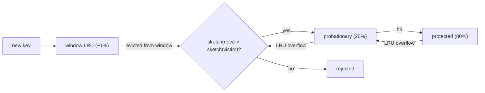

LRU has a blind spot you met in the [previous lesson](/learn/advanced-data-structures/caches-and-eviction/lru-cache): it treats an entry touched once a second ago as more valuable than an entry touched a thousand times up to two seconds ago. A one-hit wonder evicts a hot key. Web traffic, CDN requests and database page access are all heavily skewed (a small set of keys takes most of the hits, with a long tail of items requested once), so "how often" is at least as good a predictor of reuse as "how recently".

Least Frequently Used (LFU) evicts the entry with the smallest access count. The obvious implementations are slow: a min-heap keyed by count makes every `get` an O(log n) decrease-key, and a hash map of counts makes eviction an O(n) scan for the minimum. Interviewers ask for O(1), and the structure that delivers it is a good exercise in composing maps and lists. But the bigger lesson is what comes after: pure LFU has a flaw that makes it unusable, and the policies that fix it are what your cache library is actually running.

## O(1) LFU

Keep three maps and one integer:

- `values: key → value`
- `freq: key → count`
- `buckets: count → ordered set of keys with that count`, ordered by recency within the bucket
- `min_freq`: the smallest count that currently has a non-empty bucket

The bucket for each count is a doubly linked list (or an insertion-ordered map), so removing a key from its bucket and appending it to the next one are both O(1).

**get(key)**: if absent, return −1. Otherwise move `key` from `buckets[f]` to `buckets[f + 1]`, set `freq[key] = f + 1`, and if `buckets[f]` just became empty and `f == min_freq`, set `min_freq = f + 1`.

**put(key, value)**: if present, update the value and do the same promotion as `get`. If absent and the cache is full, evict the *least recently used* key from `buckets[min_freq]` (the front of that bucket's list), then insert `key` into `buckets[1]` and set `min_freq = 1`.

The last line is why `min_freq` is O(1) to maintain: a new key always has count 1, so after any insert the minimum is 1. `min_freq` only ever moves up on a promotion that empties its bucket, and it resets to 1 on the next insert. You never search for the minimum.

```viz
{"type": "system", "scenario": "lfu-cache",
 "title": "LFU cache with frequency buckets",
 "caption": "Each access moves a key one bucket up. Eviction takes the least recently used key from the lowest non-empty bucket."}
```

### A trace, capacity 2

| Operation | Buckets (count: keys, LRU first) | `min_freq` | Returns |
|---|---|---|---|
| `put(1, 1)` | 1: [1] | 1 | |
| `put(2, 2)` | 1: [1, 2] | 1 | |
| `get(1)` | 1: [2], 2: [1] | 1 | 1 |
| `put(3, 3)` | 1: [3], 2: [1] | 1 | evict 2 (only key at count 1) |
| `get(2)` | unchanged | 1 | −1 |
| `get(3)` | 2: [1, 3] | 2 | 3 (bucket 1 emptied, `min_freq` rises) |
| `put(4, 4)` | 1: [4], 2: [3] | 1 | evict 1: both had count 2, and 1 was used less recently |
| `get(1)` | unchanged | 1 | −1 |
| `get(3)` | 1: [4], 3: [3] | 1 | 3 |
| `get(4)` | 2: [4], 3: [3] | 2 | 4 |

The tie-break in the `put(4, 4)` row is the detail people get wrong: within a frequency bucket, evict by recency. Without it the policy is not well defined.

```python
from collections import OrderedDict

class LFUCache:
    def __init__(self, capacity):
        self.capacity = capacity
        self.values, self.freq, self.buckets = {}, {}, {}
        self.min_freq = 0

    def _touch(self, key):
        f = self.freq[key]
        del self.buckets[f][key]
        if not self.buckets[f]:
            del self.buckets[f]
            if self.min_freq == f:
                self.min_freq = f + 1
        self.freq[key] = f + 1
        self.buckets.setdefault(f + 1, OrderedDict())[key] = None

    def get(self, key):
        if key not in self.values:
            return -1
        self._touch(key)
        return self.values[key]

    def put(self, key, value):
        if self.capacity <= 0:
            return
        if key in self.values:
            self.values[key] = value
            self._touch(key)
            return
        if len(self.values) >= self.capacity:
            victim, _ = self.buckets[self.min_freq].popitem(last=False)
            if not self.buckets[self.min_freq]:
                del self.buckets[self.min_freq]
            del self.values[victim], self.freq[victim]
        self.values[key], self.freq[key] = value, 1
        self.buckets.setdefault(1, OrderedDict())[key] = None
        self.min_freq = 1
```

## Why pure LFU is unusable

Run this cache in front of a news site. Monday's top story gets a million hits. On Tuesday it gets none, but its count is a million, and every new story starts at count 1. New stories are evicted the moment the cache is full; Monday's story stays until the process restarts. Pure LFU **never forgets**, and it also has a cold-start problem: a new key must survive long enough to build a count, and with a full cache it is evicted before it can.

Real frequency-based policies therefore **age** their counts. The two standard mechanisms:

- **Periodic halving.** Every `N` accesses, halve every counter. A key that stops being accessed decays geometrically; a key that keeps being accessed keeps its count topped up. This is what TinyLFU does (below).
- **Time decay.** Store the last-access time with the count, and decrement the count by the elapsed time in some unit on each read. This is what Redis does.

Once counts age, "frequency" really means "frequency in the recent past", which is the quantity you wanted all along.

## The policies real caches run

### 2Q and SLRU: two lists instead of one

The cheapest fix for LRU's one-hit-wonder problem is a probation area. **2Q** keeps a small FIFO (`A1in`) for first-time entries and an LRU (`Am`) for entries seen at least twice; a key promoted from `A1in` to `Am` has proven it will be reused. A ghost list (`A1out`) remembers keys recently evicted from probation, so a second request shortly after eviction still counts. Linux's active/inactive page lists are this shape.

**Segmented LRU (SLRU)** is the same idea within one list: a *probationary* segment and a *protected* segment. New entries go to probationary; a hit promotes to protected; when protected is full its LRU entry drops back to probationary rather than out of the cache. A scan cycles through probationary and never touches protected.

### ARC: adaptive between recency and frequency

**ARC** (Adaptive Replacement Cache, IBM, 2003) keeps two LRU lists, `T1` (seen once) and `T2` (seen at least twice), plus two ghost lists `B1` and `B2` of keys recently evicted from each. The target size `p` of `T1` adapts: a hit in ghost list `B1` means "we evicted something from the recency side too early", so `p` grows; a hit in `B2` shrinks it. The cache tunes itself between LRU-like and LFU-like behaviour per workload with no parameters. ZFS uses ARC for its file cache. Postgres implemented it, then removed it, because IBM holds a patent on it, and moved to the clock sweep described below.

### W-TinyLFU: what Caffeine runs

**Caffeine** (the standard Java cache, used by Cassandra, Kafka, Spring and many others) implements **Window TinyLFU**, and it is the policy to name when someone asks "what is state of the art".

The idea splits *admission* from *eviction*. Eviction inside the main cache is SLRU (20% probationary, 80% protected). The question is whether a new key should be admitted at all. TinyLFU keeps a **count-min sketch** (the one from [count-min sketch and HyperLogLog](/learn/advanced-data-structures/probabilistic-structures/count-min-sketch-and-hyperloglog)) of access frequencies over recent history, with 4-bit counters and a halving reset every `W` accesses so old popularity fades. When a new key arrives and the main cache is full, compare the sketch's estimate for the new key against the estimate for the main cache's eviction victim. Admit the newcomer only if it is more frequent. A one-hit wonder loses that comparison and never displaces a hot entry.

Pure admission has a cold-start problem (a newly hot key cannot get in until its count grows), so the "Window" in the name is a small LRU (about 1% of capacity) in front, where new keys live briefly and can accumulate hits before facing the admission test. Caffeine also adjusts the window size at runtime by hill-climbing on the observed hit ratio. On published traces (database, search, analytics, OLTP), W-TinyLFU is within a few percent of the optimal offline policy and beats LRU by a wide margin on skewed workloads, at a memory cost of a few bits per entry for the sketch.



### Redis: sampled, logarithmic LFU

Redis's `allkeys-lfu` (and `volatile-lfu`) uses the same 24-bit field per key that its LRU uses, split into 16 bits of last-decrement time (minute resolution) and an **8-bit logarithmic counter**. A counter that can only hold 0–255 cannot count a million hits, so it counts probabilistically: on each access the counter increments with probability `1 / (counter × lfu_log_factor + 1)`. With the default `lfu-log-factor 10`, reaching 255 takes on the order of a million accesses, and a counter of 100 means roughly ten thousand. Aging is time-based: every `lfu-decay-time` minutes (default 1) the counter is decremented by one on the next access. Eviction, as for LRU, samples a handful of keys and evicts the one with the lowest counter. Twenty-four bits per key, no lists, and a policy that approximates aged LFU well enough for the workloads Redis serves.

### Postgres: clock sweep

`shared_buffers` in Postgres uses a **clock sweep** (a generalised second-chance algorithm). Each buffer has a `usage_count`, incremented on access up to a cap of 5. To find a victim, a hand sweeps the buffer ring: a buffer with `usage_count > 0` is decremented and skipped; the first buffer found at 0 is evicted. Frequently used pages keep getting reset to 5 and are rarely reached at 0; a page touched once decays to 0 in one sweep. It is an aged-frequency policy with no lists, no locks per access beyond an atomic increment, and no patent. Sequential scans of large tables additionally use a 256 KB ring buffer so that a scan recycles its own pages instead of sweeping the pool.

## Choosing a policy

| Policy | Memory per entry | Scan-resistant | Adapts to workload | Where |
|---|---|---|---|---|
| LRU | 2 pointers | No | No | Textbooks; small in-process caches |
| Sampled LRU | 24 bits | No | No | Redis |
| 2Q / SLRU | 2 pointers + segment bit | Yes | No | Linux page cache, many CDNs |
| ARC | 2 pointers + ghost keys | Yes | Yes | ZFS |
| Clock sweep | a few bits | With scan ring | Partly | Postgres |
| Aged LFU (sampled) | 24 bits | Yes | No | Redis |
| W-TinyLFU | 2 pointers + ~4 bits sketch | Yes | Yes | Caffeine, and via it Cassandra, Kafka |

The interview version of this decision: say LRU, say its failure mode (scans and one-hit wonders), say what fixes it (a probation area or frequency-based admission), and name one real system for each. If the interviewer pushes on "how would you implement frequency without a counter per key?", the count-min sketch with periodic halving is the answer, and it connects two lessons of this track in one sentence.

## Exercise

```exercise
id: lfu-cache-class
title: Implement an O(1) LFU cache
prompt: |
  Implement `LFUCache`. The tests first call `set_capacity(n)`, then
  replay `put(key, value)` (returns nothing) and `get(key)` (returns the
  value or `-1`). Every `get` and every `put` on an existing key raises
  that key's frequency by one. A new key starts at frequency 1. When a
  `put` needs space, evict the key with the lowest frequency; among keys
  tied on frequency, evict the least recently used. All operations must
  be O(1).
languages: [python, javascript]
entry: LFUCache
starter:
  python: |
    from collections import OrderedDict

    class LFUCache:
        def __init__(self):
            self.capacity = 0
            self.values = {}     # key -> value
            self.freq = {}       # key -> frequency
            self.buckets = {}    # frequency -> OrderedDict of keys (LRU first)
            self.min_freq = 0

        def set_capacity(self, capacity):
            self.capacity = capacity

        def get(self, key):
            # TODO
            return -1

        def put(self, key, value):
            # TODO
            pass
  javascript: |
    class LFUCache {
      constructor() {
        this.capacity = 0;
        this.values = new Map();   // key -> value
        this.freq = new Map();     // key -> frequency
        this.buckets = new Map();  // frequency -> Set of keys (insertion order = LRU order)
        this.minFreq = 0;
      }
      set_capacity(capacity) { this.capacity = capacity; }
      get(key) {
        // TODO
        return -1;
      }
      put(key, value) {
        // TODO
      }
    }
tests:
  - args: [["set_capacity",2],["put",1,1],["put",2,2],["get",1],["put",3,3],["get",2],["get",3],["put",4,4],["get",1],["get",3],["get",4]]
    expected: [null, null, null, 1, null, -1, 3, null, -1, 3, 4]
    label: the trace from the lesson
  - args: [["set_capacity",1],["put",1,1],["get",1],["put",2,2],["get",1],["get",2]]
    expected: [null, null, 1, null, -1, 2]
    label: capacity 1
  - args: [["set_capacity",2],["put",1,1],["put",2,2],["put",1,5],["put",3,3],["get",1],["get",2],["get",3]]
    expected: [null, null, null, null, null, 5, -1, 3]
    label: updating a key counts as an access
  - args: [["set_capacity",2],["put",1,1],["put",2,2],["put",3,3],["get",1],["get",2]]
    expected: [null, null, null, null, -1, 2]
    label: ties on frequency evict the least recently used
  - args: [["set_capacity",2],["put",1,1],["get",1],["get",1],["put",2,2],["get",2],["put",3,3],["get",2],["get",1],["get",3]]
    expected: [null, null, 1, 1, null, 2, null, -1, 1, 3]
    hidden: true
    label: frequency beats recency
  - args: [["set_capacity",3],["put",1,1],["put",2,2],["put",3,3],["get",1],["get",1],["get",2],["put",4,4],["get",3],["put",5,5],["get",4],["put",6,6],["get",2],["put",7,7],["get",6],["get",1],["get",7]]
    expected: [null, null, null, null, 1, 1, 2, null, -1, null, -1, null, 2, null, -1, 1, 7]
    hidden: true
    label: min_freq resets to 1 after each insert
hints:
  - "After inserting a new key, min_freq is always 1; it only rises when a promotion empties the bucket that min_freq points at."
  - "Within a bucket keep insertion order: remove from the front to evict, append at the back on promotion."
  - "Handle put on an existing key as update-value plus the same promotion as get."
```

## Senior signals

- You implement LFU in O(1) with **frequency buckets and a `min_freq` pointer**, and you can explain why `min_freq` never needs a search.
- You state pure LFU's fatal flaw (**it never forgets**) and the two aging mechanisms that fix it.
- You know the difference between **eviction** and **admission** and can describe TinyLFU's sketch-based admission test.
- You can say what **Redis** (`allkeys-lfu`, logarithmic counter, decay, sampling), **Caffeine** (W-TinyLFU) and **Postgres** (clock sweep, scan ring) actually run.
- You know ARC exists, what it adapts, and why Postgres could not ship it.
- You choose a policy by naming the workload's shape (skew, scans, churn) rather than by defaulting to LRU.

## Check yourself

```quiz
- q: >-
    In an O(1) LFU cache, why can min_freq be set to 1 after every insert of a new key without checking anything?
  options: ["Eviction always empties the min_freq bucket, so the old minimum is gone", "A new key has count 1, so bucket 1 is now the lowest non-empty bucket", "Each insert resets all existing counts to 1, so every key sits at the minimum", "It cannot; the minimum must be found by scanning buckets after an insert"]
  answer: 1
  explanation: >-
    The new key lands in bucket 1, which is therefore non-empty and is the smallest possible frequency. min_freq only needs to move up when a promotion empties the bucket it points at. Eviction removes one key from the lowest bucket and need not empty it; the reset is safe because of the new key, not because of the eviction.
- q: >-
    A capacity-2 LFU cache runs put(1,1), get(1), get(1), put(2,2), get(2), put(3,3). Which key is evicted?
  options: ["Key 3, because a new key starts at the lowest count", "Key 2, because its count (2) is below key 1's (3)", "No key, because capacity 2 was not exceeded", "Key 1, because key 2 was used more recently"]
  answer: 1
  explanation: >-
    Key 1 has count 3 and key 2 has count 2. LFU evicts the lowest count regardless of recency, so 2 goes even though it was touched last. LRU would have evicted 1.
- q: >-
    Why is pure LFU (no aging) unusable for a cache in front of a news site?
  options: ["Each access costs O(log n), too slow for a busy site's request rate", "Old stories keep huge counts forever, so new stories are evicted first", "A per-key count costs more memory than caching the stories saves", "One-hit wonders flush popular stories, just as a scan does under pure LRU"]
  answer: 1
  explanation: >-
    Without decay, a count reflects all history. Old hits crowd out everything new. Periodic halving (TinyLFU) or time-based decrement (Redis) makes counts reflect recent frequency. One-hit wonders are what LFU evicts most readily; its failure is the opposite, counts that never fade.
- q: >-
    What does the count-min sketch in W-TinyLFU decide?
  options: ["Whether a newcomer is admitted, by comparing it with the eviction victim", "Which entry inside the main cache is evicted, by its lowest estimated count", "How long each entry lives, by turning estimated frequency into a TTL", "How large the window LRU is, by tracking the hit ratio over time"]
  answer: 0
  explanation: >-
    TinyLFU separates admission from eviction. The main cache evicts by SLRU; the sketch is only consulted to decide if the newcomer deserves the victim's slot. One-hit wonders lose the comparison and never enter. The window size is tuned by hill-climbing on the hit ratio, not by the sketch.
- q: >-
    Redis stores an 8-bit LFU counter per key. How does it represent a million accesses?
  options: ["It overflows and wraps to 0, so a very hot key briefly looks cold", "It keeps the exact count in a separate 64-bit field per key", "It saturates at 255 after 255 accesses and stops counting", "It increments with a probability that falls as the counter grows"]
  answer: 3
  explanation: >-
    The increment probability is 1/(counter × lfu_log_factor + 1). With the default factor of 10 it takes on the order of a million hits to reach 255, so the counter is a logarithmic estimate, not a raw count, and 255 is reached only after about a million accesses, not 255. It also decays over time.
```
