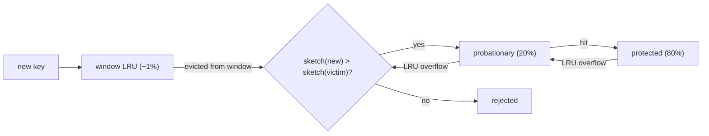

LRU has a blind spot you met in the [previous lesson](/learn/advanced-data-structures/caches-and-eviction/lru-cache): it treats an entry touched once a second ago as more valuable than an entry touched a thousand times up to two seconds ago. A one-hit wonder evicts a hot key. Web traffic, CDN requests and database page access are all heavily skewed (a small set of keys takes most of the hits, with a long tail of items requested once), so "how often" is at least as good a predictor of reuse as "how recently".

Least Frequently Used (LFU) evicts the entry with the smallest access count. The obvious implementations are slow: a min-heap keyed by count makes every `get` an O(log n) decrease-key, and a hash map of counts makes eviction an O(n) scan for the minimum. Interviewers ask for O(1); two published structures deliver it, and comparing them is a good exercise in composing maps and lists. But the bigger lesson is what comes after: pure LFU has a flaw that makes it unusable, and the policies that fix it, traced here with their real constants, are what your cache library is actually running.

## O(1) LFU

Keep three maps and one integer:

- `values: key → value`
- `freq: key → count`
- `buckets: count → ordered set of keys with that count`, ordered by recency within the bucket
- `min_freq`: the smallest count that currently has a non-empty bucket

The bucket for each count is a doubly linked list (or an insertion-ordered map), so removing a key from its bucket and appending it to the next one are both O(1).

**get(key)**: if absent, return −1. Otherwise move `key` from `buckets[f]` to `buckets[f + 1]`, set `freq[key] = f + 1`, and if `buckets[f]` has become empty and `f == min_freq`, set `min_freq = f + 1`.

**put(key, value)**: if present, update the value and do the same promotion as `get`. If absent and the cache is full, evict the *least recently used* key from `buckets[min_freq]` (the front of that bucket's list), then insert `key` into `buckets[1]` and set `min_freq = 1`.

The last line is why `min_freq` is O(1) to maintain: a new key always has count 1, so after any insert the minimum is 1. `min_freq` only ever moves up on a promotion that empties its bucket, and it resets to 1 on the next insert. You never search for the minimum.

```viz
{"type": "system", "scenario": "lfu-cache",
 "title": "LFU cache with frequency buckets",
 "caption": "Each access moves a key one bucket up. Eviction takes the least recently used key from the lowest non-empty bucket."}
```

### The buckets traced, capacity 2

Each bucket is drawn as a list from least to most recently used; `min_freq` points at the lowest non-empty one.

| Operation | Buckets after (count: keys, LRU first) | `min_freq` | Pointer work | Returns |
|---|---|---|---|---|
| `put(1, 1)` | 1: [1] | 1 | append 1 to bucket 1 | |
| `put(2, 2)` | 1: [1, 2] | 1 | append 2 to bucket 1 | |
| `get(1)` | 1: [2], 2: [1] | 1 | unlink 1 from bucket 1, append to bucket 2 (created) | 1 |
| `put(3, 3)` | 1: [3], 2: [1] | 1 | evict front of bucket 1 (key 2), delete from maps; append 3 to bucket 1 | |
| `get(2)` | unchanged | 1 | none | −1 |
| `get(3)` | 2: [1, 3] | **2** | unlink 3 from bucket 1, which empties: `min_freq` rises; append to bucket 2 | 3 |
| `put(4, 4)` | 1: [4], 2: [3] | 1 | evict front of bucket 2 (key 1: both had count 2, 1 was used less recently); append 4 to bucket 1; `min_freq = 1` | |
| `get(1)` | unchanged | 1 | none | −1 |
| `get(3)` | 1: [4], 3: [3] | 1 | unlink 3 from bucket 2 (empties, but `min_freq` is 1 so it stays), append to bucket 3 | 3 |
| `get(4)` | 2: [4], 3: [3] | 2 | unlink 4 from bucket 1 (empties, `min_freq` rises to 2), append to bucket 2 | 4 |

The tie-break in the `put(4, 4)` row is the detail people get wrong: within a frequency bucket, evict by recency. Without it the policy is not well defined. The `get(3)` row shows the other subtlety: emptying a bucket above `min_freq` does not move `min_freq`.

```python
from collections import OrderedDict

class LFUCache:
    def __init__(self, capacity):
        self.capacity = capacity
        self.values, self.freq, self.buckets = {}, {}, {}
        self.min_freq = 0

    def _touch(self, key):
        f = self.freq[key]
        del self.buckets[f][key]
        if not self.buckets[f]:
            del self.buckets[f]
            if self.min_freq == f:
                self.min_freq = f + 1
        self.freq[key] = f + 1
        self.buckets.setdefault(f + 1, OrderedDict())[key] = None

    def get(self, key):
        if key not in self.values:
            return -1
        self._touch(key)
        return self.values[key]

    def put(self, key, value):
        if self.capacity <= 0:
            return
        if key in self.values:
            self.values[key] = value
            self._touch(key)
            return
        if len(self.values) >= self.capacity:
            victim, _ = self.buckets[self.min_freq].popitem(last=False)
            if not self.buckets[self.min_freq]:
                del self.buckets[self.min_freq]
            del self.values[victim], self.freq[victim]
        self.values[key], self.freq[key] = value, 1
        self.buckets.setdefault(1, OrderedDict())[key] = None
        self.min_freq = 1
```

Three dictionaries and an `OrderedDict` per live count are not cheap. Measured with `tracemalloc` on CPython 3.14 (the container only): **175 bytes per entry** at 10⁶ keys all at count 1 and **263–315** once counts spread out (1 to 100, or half the keys at 301), against 106 for the previous lesson's LRU; a `get` took 229 ns against 78 (1,000 keys, 10⁶ random hits, one core). Spreading costs more because a CPython dict never shrinks, so bucket 1 keeps a table sized for the moment every key had count 1, and counts above 256 are separate `int` objects. That is a second reason production caches do not keep exact counts.

## The original O(1) LFU: a sorted list of frequency nodes

The first published O(1) LFU, by Ketan Shah, Anirban Mitra and Dhruv Matani (2010), has no bucket map and no `min_freq`. It keeps:

- a doubly linked **frequency list** of nodes in increasing count order behind a head sentinel of count 0, one node per count that currently has keys;
- inside each frequency node, a doubly linked list of the **items** at that count;
- in each item, a pointer back to its frequency node (its parent);
- one hash map from key to item.

The list stays sorted without a search because a count only ever moves by one. A promoted item leaves node `f` for `f.next` if that node's count is `f + 1`; otherwise a new node `f + 1` is spliced in right after `f` (four pointer writes). A node whose item list empties is unlinked (two writes). A new key joins `head.next` if its count is 1, or a new node 1 spliced after the head. The least frequently used item is therefore always in `head.next`. The paper keeps each node's items in a set "for simplicity", which makes ties arbitrary; this version keeps them in recency order and evicts the oldest, and it returns the same answers as the `min_freq` cache (checked against it and a brute-force reference on 3,000 random operation sequences).

```python
class Item:
    __slots__ = ("key", "value", "parent", "prev", "next")
    def __init__(self, key=None, value=None, parent=None):
        self.key, self.value, self.parent = key, value, parent
        self.prev = self.next = self          # an empty ring points at itself

class FreqNode:
    __slots__ = ("count", "items", "prev", "next")
    def __init__(self, count):
        self.count = count
        self.items = Item()                   # sentinel of this count's item ring
        self.prev = self.next = self

def insert_after(prev, node):                 # used for items and for freq nodes
    node.prev, node.next = prev, prev.next
    prev.next.prev = node
    prev.next = node

def unlink(node):
    node.prev.next = node.next
    node.next.prev = node.prev

class LFUCache:
    def __init__(self, capacity):
        self.capacity = capacity
        self.by_key = {}
        self.head = FreqNode(0)               # sentinel: head.next has the lowest count

    def _promote(self, item):
        freq = item.parent
        nxt = freq.next
        if nxt is self.head or nxt.count != freq.count + 1:
            nxt = FreqNode(freq.count + 1)
            insert_after(freq, nxt)           # splice f + 1 in: the list stays sorted
        unlink(item)
        insert_after(nxt.items.prev, item)    # append: most recent at the tail
        item.parent = nxt
        if freq.items.next is freq.items:     # no keys left at count f
            unlink(freq)

    def get(self, key):
        item = self.by_key.get(key)
        if item is None:
            return -1
        self._promote(item)
        return item.value

    def put(self, key, value):
        if self.capacity <= 0:
            return
        item = self.by_key.get(key)
        if item is not None:
            item.value = value
            self._promote(item)
            return
        if len(self.by_key) >= self.capacity:
            low = self.head.next              # lowest count, found without a search
            victim = low.items.next           # least recently used at that count
            unlink(victim)
            del self.by_key[victim.key]
            if low.items.next is low.items:
                unlink(low)
        first = self.head.next
        if first.count != 1:
            first = FreqNode(1)
            insert_after(self.head, first)
        item = Item(key, value, first)
        insert_after(first.items.prev, item)
        self.by_key[key] = item

    def counts(self):                         # the frequency list, for tracing
        out, f = [], self.head.next
        while f is not self.head:
            keys, it = [], f.items.next
            while it is not f.items:
                keys.append(it.key)
                it = it.next
            out.append((f.count, keys))
            f = f.next
        return out

cache = LFUCache(3)
for op, key in [("put", "a"), ("put", "b"), ("get", "a"), ("get", "a"), ("get", "b"),
                ("put", "c"), ("put", "d"), ("get", "b"), ("put", "e")]:
    if op == "put":
        cache.put(key, key.upper())
    else:
        cache.get(key)
    print(op, key, cache.counts())
```

### Traced, capacity 3

The list is drawn as `count: [items, oldest first]`; the last column counts the writes to frequency-node links.

| Operation | What happens | Frequency list after | Node writes |
|---|---|---|---|
| `put(a)` | `head.next` is the head itself, not count 1: create node 1 | 1: [a] | 4 |
| `put(b)` | `head.next` has count 1 | 1: [a, b] | 0 |
| `get(a)` | node 1's next is the head: create node 2 after node 1 | 1: [b] ⇄ 2: [a] | 4 |
| `get(a)` | node 2's next is the head: create node 3; node 2 empties, unlink it | 1: [b] ⇄ 3: [a] | 4 + 2 |
| `get(b)` | node 1's next has count 3, not 2: splice node 2 between them; node 1 empties, unlink it | 2: [b] ⇄ 3: [a] | 4 + 2 |
| `put(c)` | `head.next` has count 2: create node 1 after the head | 1: [c] ⇄ 2: [b] ⇄ 3: [a] | 4 |
| `put(d)` | full: evict the oldest item of `head.next` (c); node 1 empties, unlink it; create a new node 1 | 1: [d] ⇄ 2: [b] ⇄ 3: [a] | 2 + 4 |
| `get(b)` | node 2's next has count 3: reuse it; node 2 empties, unlink it | 1: [d] ⇄ 3: [a, b] | 2 |
| `put(e)` | full: evict d, unlink the empty node 1, create a new node 1 | 1: [e] ⇄ 3: [a, b] | 2 + 4 |

Each row also moves or inserts one item: unlink it from its old ring (two writes), append it to the new one (four), set its parent (one). No row depends on the number of keys or of distinct counts.

## Frequency list versus `min_freq` buckets

Both make `get`, `put` and eviction O(1). They differ in what else stays O(1), and in CPython they differ in memory.

| | `min_freq` + bucket map | Frequency-node list (2010) |
|---|---|---|
| Finds the minimum by | the `min_freq` integer, which only an insert resets | position: `head.next` |
| `delete(key)` or TTL expiry | the removal is O(1), but if it empties the `min_freq` bucket the next minimum is unknown until a scan over counts | O(1): unlink the item, unlink its node if empty, and `head.next` is still the minimum |
| Several evictions in a row (shrinking the cache) | only the first is guaranteed O(1) | O(1) each |
| Per entry, in a compiled language | key, value, count, prev, next, plus a hash entry | key, value, parent, prev, next, plus a hash entry |
| Per live count | a hash entry and a list sentinel | a node: count, prev, next, list sentinel |
| CPython, as written in this lesson | 175–315 bytes per entry, 229 ns per `get` | 114–125 bytes per entry, 127 ns per `get` |

In a compiled language the two cost the same five words per entry; the real difference is the first two rows, which is why a cache that also supports deletion or expiry is safer on the frequency list. In CPython the list also wins on measurement, because it is one dict plus one 72-byte slotted object per entry instead of three dicts and a bucket `OrderedDict`. Both CPython rows were measured the same way as above; they compare these two Python programs, not the designs.


## Why pure LFU is unusable

Run this cache in front of a news site. Monday's top story gets a million hits. On Tuesday it gets none, but its count is a million, and every new story starts at count 1. New stories are evicted the moment the cache is full; Monday's story stays until the process restarts. Pure LFU **never forgets**, and it also has a cold-start problem: a new key must survive long enough to build a count, and with a full cache it is evicted before it can.

Real frequency-based policies therefore **age** their counts. The two standard mechanisms:

- **Periodic halving.** Every `N` accesses, halve every counter. A key that stops being accessed decays geometrically; a key that keeps being accessed keeps its count topped up. This is what TinyLFU does.
- **Time decay.** Store the last-access time with the count, and decrement the count by the elapsed time in some unit on each read. This is what Redis does.

Watch halving change an eviction. Capacity 2, the sequence `put a, get a, get a, put b, put c, put d`:

| Step | Without aging (counts) | Evicts | Halving every 4 accesses (counts) | Evicts |
|---|---|---|---|---|
| after `put b` (4th access) | a: 3, b: 1 | | a: 3, b: 1 → **halved to a: 1, b: 0** | |
| `put c` | evict lowest: b | b | evict lowest: b (0) | b |
| `put d` | a: 3, c: 1 → evict c | c | a: 1, c: 1 → tie, c is more recent → evict a | **a** |

Without aging, `a`'s three old hits protect it forever and every newcomer is sacrificed. With halving, `a` has to keep earning its place. Once counts age, "frequency" really means "frequency in the recent past", which is the quantity you wanted all along; the second exercise makes you implement this exact table.

## 2Q and SLRU: two lists instead of one

The cheapest fix for LRU's one-hit-wonder problem is a probation area. **2Q** keeps a small FIFO (`A1in`) for first-time entries and an LRU (`Am`) for entries seen at least twice; a key promoted from `A1in` to `Am` has proven it will be reused. A ghost list (`A1out`) remembers keys recently evicted from probation, so a second request shortly after eviction still counts. Linux's active/inactive page lists are this shape.

**Segmented LRU (SLRU)** is the same idea within one list: a *probationary* segment and a *protected* segment. New entries go to probationary; a hit promotes to protected; when protected is full its LRU entry drops back to probationary rather than out of the cache. A scan cycles through probationary and never touches protected.

## ARC: adaptive between recency and frequency, traced

**ARC** (Adaptive Replacement Cache, IBM, 2003) keeps two LRU lists, `T1` (seen once) and `T2` (seen at least twice), plus two *ghost* lists `B1` and `B2` holding only the keys recently evicted from each. `|T1| + |T2| = c` is the cache; the ghosts add up to at most another `c`. A target `p` says how much of the cache `T1` deserves: on a miss, if `|T1| > p` evict from `T1` into `B1`, otherwise from `T2` into `B2`. The adaptation is the point: a hit in ghost list `B1` means "we evicted something from the recency side too early", so `p` grows by 1 (or by `|B2| / |B1|` if `B2` is larger); a hit in `B2` shrinks it symmetrically. Trace it with `c = 4`:

| Access | Event | Action | `T1` (LRU first) | `T2` | `B1` | `B2` | `p` |
|---|---|---|---|---|---|---|---|
| 1, 2, 3, 4 | misses | fill `T1` | [1, 2, 3, 4] | [] | [] | [] | 0 |
| 1 | hit in `T1` | promote to `T2` | [2, 3, 4] | [1] | [] | [] | 0 |
| 5 | miss | `|T1| = 3 > p`: evict 2 into `B1` | [3, 4, 5] | [1] | [2] | [] | 0 |
| 2 | **ghost hit in `B1`** | `p → 1`; `|T1| = 3 > 1`: evict 3 into `B1`; 2 enters `T2` | [4, 5] | [1, 2] | [3] | [] | 1 |
| 6 | miss | `|T1| = 2 > 1`: evict 4 into `B1` | [5, 6] | [1, 2] | [3, 4] | [] | 1 |
| 3 | ghost hit in `B1` | `p → 2`; `|T1| = 2`, not above `p`: evict from `T2` (1 into `B2`); 3 enters `T2` | [5, 6] | [2, 3] | [4] | [1] | 2 |
| 1 | **ghost hit in `B2`** | `p → 1`; `|T1| = 2 > 1`: evict 5 into `B1`; 1 enters `T2` | [6] | [2, 3, 1] | [4, 5] | [] | 1 |
| 7 | miss | `|T1| = 1`, not above `p`: evict from `T2` (2 into `B2`) | [6, 7] | [3, 1] | [4, 5] | [2] | 1 |
| 4 | ghost hit in `B1` | `p → 2`; evict from `T2` (3 into `B2`); 4 enters `T2` | [6, 7] | [1, 4] | [5] | [2, 3] | 2 |

Read the `p` column: the workload kept re-requesting keys that `T1` had dropped, so `p` grew and `T1` got more room; when a key came back from `B2`, `p` shrank again. The cache tunes itself between LRU-like and LFU-like behaviour per workload with no parameters, and a key that returns from a ghost list goes straight into `T2` because it has now been seen twice. ZFS uses ARC for its file cache. Postgres implemented it, then removed it in 8.1, because IBM holds a patent on it, and moved to the clock sweep described below.

## W-TinyLFU: what Caffeine runs

**Caffeine** (the standard Java cache, used by Cassandra, Kafka, Spring and many others) implements **Window TinyLFU**, and it is the policy to name when someone asks "what is state of the art".

The idea splits *admission* from *eviction*. The main region, 99% of capacity, is an SLRU with a 20% probationary and 80% protected split. The question is whether a new key should be admitted to it at all. TinyLFU keeps a **count-min sketch** (the one from [count-min sketch and HyperLogLog](/learn/advanced-data-structures/probabilistic-structures/count-min-sketch-and-hyperloglog)) of access frequencies over recent history: 4-bit counters, so an estimate saturates at 15, four counters per key inside one 64-byte block so an estimate costs one cache line, and a **halving reset** once the sample size, ten times the maximum size, has been recorded, so old popularity fades. When a candidate leaves the window and the main region is full, compare the sketch's estimate for the candidate against the estimate for the main region's eviction victim (the probationary LRU entry). Admit the newcomer only if it is more frequent; a tie keeps the victim.

Trace the admission with a cache of 1,000 entries, a sketch sample of 10,000, and a victim estimated at 3:

| Candidate | Sketch estimate when it leaves the window | Admitted? | Why |
|---|---|---|---|
| one-hit wonder | 1 | no, 1 ≤ 3 | never displaces a warmer entry |
| a key seen 5 times while in the window | 5 | yes, 5 > 3 | hot enough to earn the slot |
| a formerly hot key, saturated at 15, after one halving | 15 → 7 | yes, 7 > 3 | still warmer than the victim |
| the same key after a second halving | 7 → 3 | no, 3 ≤ 3 | it has aged out; ties keep the victim |
| a key estimated at 6 against a victim estimated at 9 | 6 | 1 time in 128 | the hash-flooding guard in the next section |

Pure admission has a cold-start problem (a newly hot key cannot get in until its count grows), so the "Window" in the name is a small LRU, 1% of capacity, in front, where new keys live briefly and can accumulate hits before facing the admission test. Caffeine resizes the window at runtime by hill climbing on the hit ratio, and it randomises admission slightly so that an attacker who floods the sketch with colliding keys cannot lock newcomers out; the next section gives both their constants. On the traces published with W-TinyLFU (database, search, analytics, OLTP) it comes close to the offline optimum on most, and beats LRU widely on skewed workloads.



## Under the hood: Caffeine's real sizes

Read from `BoundedLocalCache.java`, `FrequencySketch.java` and the buffer classes of Caffeine 3.2.4 and 3.3.0, which give the same numbers at this size except for the climber, for `Caffeine.newBuilder().maximumSize(10_000)`:

| Quantity | Rule in the source | For `maximumSize(10_000)` |
|---|---|---|
| Window | `max − (long) (0.99 × max)` (`PERCENT_MAIN`) | 100 entries |
| Protected | `(long) (0.80 × (max − window))` (`PERCENT_MAIN_PROTECTED`) | 7,920 entries |
| Probation | the rest of the main region | 1,980 entries |
| Sketch table | `long[ceilingPowerOfTwo(maximumSize)]` (3.3.0 floors it at 256), sixteen 4-bit counters per `long` | 16,384 longs = 128 KiB, 13.1 bytes per entry |
| Sketch sample | `10 × maximumSize` counted increments, then a reset | 100,000 |
| Admission | candidate > victim; else candidate ≥ 6 (`ADMIT_HASHDOS_THRESHOLD`) wins when `(random & 127) == 0`; else rejected | a warm loser gets 1 chance in 128 |
| Window climber, up to 3.2.x | one sample per sketch sample; first step 6.25% of max, × 0.98 per sample; full step again when the hit rate moves 5 points | every 100,000 requests, first step 625 |
| Read buffer | striped ring buffers of 16 slots; one stripe, doubling on contention up to `4 × ceilingPowerOfTwo(cpus)` | 64 stripes, 1,024 reads, on 16 CPUs |
| Write buffer | a queue growing from 4 to `128 × ceilingPowerOfTwo(cpus)` | 2,048 on 16 CPUs |

**The sketch.** One hash of the key picks a 64-byte block (8 longs; 2,048 blocks here), a second picks one 4-bit counter in each of the block's four 16-byte quarters, and the estimate is the minimum of the four. Because the table is sized by the maximum rounded up to a power of two, the sketch costs 8–16 bytes per entry of capacity, not 4 bits (13.1 here, 8.4 at a million), and it is allocated only when the cache first reaches half its maximum. `size` counts only increments that changed a counter. At 100,000, `reset()` shifts each `long` right by one and masks it with `0x7777…` so no bit leaks between neighbouring counters, halving all 262,144 counters in one pass over 128 KiB; it also counts the odd counters, which lost a half, and sets `size = (size − odd / 4) / 2`.

**The guard.** An attacker who makes many keys collide with the victim's counters can pin its estimate at 15, and then every candidate loses. Admitting a candidate estimated at 6 or more once in 128 times evicts the inflated victim eventually, while candidates at 1–5 never get the lottery ticket.

**The climber.** Up to 3.2.x, each sample compares its hit rate with the previous one: an improvement keeps the direction, a loss reverses it. Caffeine 3.3.0 keeps that rule up to 4,096 entries; above it, it compares the regions' hit densities (hits per unit of capacity) inside one sample of `4 × max` requests (40,000 here) and steps towards the balance point.

**The buffers.** A read offers its node to a stripe with a single compare-and-swap ([atomics and lock-free structures](/learn/systems/concurrency/atomics-and-lock-free)) and returns. If the stripe is full or contended the record is dropped, so the policy misses that access and the sketch that increment, the price of never blocking a read. A full stripe schedules a drain that replays the reads under the eviction lock. Writes are never dropped: when the write buffer is full, the writing thread takes the lock and runs the maintenance itself.

## Under the hood: Redis's sampled, logarithmic LFU

Redis's `allkeys-lfu` (and `volatile-lfu`) uses the same 24-bit field per key that its LRU uses, split into 16 bits of last-decrement time (minute resolution) and an **8-bit logarithmic counter**. A counter that can only hold 0–255 cannot count a million hits, so it counts probabilistically: a new key starts at `LFU_INIT_VAL = 5` (so that a fresh key is not the first eviction candidate), and on each access the counter increments with probability `1 / ((counter − 5) × lfu_log_factor + 1)`. The table in `redis.conf` gives the resulting counter for the default `lfu-log-factor 10`: about 10 after 100 hits, 18 after 1,000, 142 after 100,000, and 255 after a million. Aging is time-based: every `lfu-decay-time` minutes (default 1) the counter is decremented by one on the next access. Eviction, as for LRU, samples `maxmemory-samples` keys and evicts the one with the lowest counter. Twenty-four bits per key, no lists, and a policy that approximates aged LFU well enough for the workloads Redis serves.

## Under the hood: Postgres's clock sweep

`shared_buffers` in Postgres uses a **clock sweep** (a generalised second-chance algorithm). Each buffer has a `usage_count`, incremented on access up to `BM_MAX_USAGE_COUNT = 5`. To find a victim, a hand sweeps the buffer ring: a buffer with `usage_count > 0` is decremented and skipped; the first buffer found at 0 is evicted. Frequently used pages keep getting reset to 5 and are rarely reached at 0; a page touched once decays to 0 in one sweep. It is an aged-frequency policy with no lists, no locks per access beyond an atomic increment, and no patent. Sequential scans of tables larger than a quarter of `shared_buffers` additionally use a 256 KB ring buffer, and bulk writes a 16 MB one, so that a scan recycles its own pages instead of sweeping the pool.

## Choosing a policy

| Policy | Memory per entry | Scan-resistant | Adapts to workload | Where |
|---|---|---|---|---|
| LRU | 2 pointers | No | No | Textbooks; small in-process caches |
| Sampled LRU | 24 bits | No | No | Redis |
| 2Q / SLRU | 2 pointers + segment bit | Yes | No | Linux page cache, memcached, many CDNs |
| ARC | 2 pointers + ghost keys | Yes | Yes | ZFS |
| Clock sweep | a few bits | With scan ring | Partly | Postgres |
| Aged LFU (sampled) | 24 bits | Yes | No | Redis |
| Exact LFU (either O(1) layout) | 5 words + a hash entry | Yes, scanned keys stay at count 1 | No; never forgets without aging | Interview answers |
| W-TinyLFU | 2 pointers + 8–16 B of sketch | Yes | Yes | Caffeine, and via it Cassandra, Kafka |

The interview version of this decision: say LRU, say its failure mode (scans and one-hit wonders), say what fixes it (a probation area or frequency-based admission), and name one real system for each. If the interviewer pushes on "how would you implement frequency without a counter per key?", the count-min sketch with periodic halving is the answer, and it connects two lessons of this track in one sentence.

## Failure modes

| Symptom | Diagnosis | Fix |
|---|---|---|
| A frequency-based cache serves yesterday's hot items and misses today's | Counts never age (no halving, no decay); old popularity outranks new | Halving every `N` accesses (TinyLFU) or time decay (Redis `lfu-decay-time`) |
| New keys are evicted before they can become hot, so the hit ratio on a changing catalogue stays low | Pure admission with no window: a newcomer at count 1 always loses the comparison | A window (Caffeine's 1%) where new keys can accumulate hits, or Redis's `LFU_INIT_VAL` head start |
| Hand-written O(1) LFU evicts the wrong key when counts tie | No recency order within a bucket, or a set instead of an ordered list | Ordered buckets, evict from the front |
| LFU implementation is O(n) on eviction | Scanning for the minimum count instead of tracking `min_freq` | Keep `min_freq`; reset it to 1 on every insert |
| After `delete` or TTL expiry was added to a `min_freq` LFU, an eviction raises `KeyError` on `buckets[min_freq]` | A removal emptied the `min_freq` bucket, and only an insert resets `min_freq`, so it names a count with no keys | Recompute the minimum over the live counts after such a removal, or use the frequency-node list, whose `head.next` is always the minimum |
| Redis LFU counters look "stuck" at 5 for keys that are read often | `lfu-log-factor` too high for the traffic, so increments almost never happen; or reads go through a replica whose counters are not updated | Lower `lfu-log-factor` (each level then saturates sooner), read counters on the primary with `OBJECT FREQ` |
| Postgres shared-buffer hit ratio collapses during a nightly table scan | The table is smaller than a quarter of `shared_buffers`, so the scan uses the main pool instead of the 256 KB ring | Accept it, run the scan against a replica, or tune `shared_buffers` so the ring rule applies |

## Interviewer follow-ups

**"Why is `min_freq` never searched for in the O(1) LFU?"** Model answer: every insert sets it to 1, because the new key has count 1; it only rises when a promotion empties the bucket it points at, which is a single comparison. Common wrong answer: "we keep a min-heap of bucket counts", which makes eviction O(log n).

**"How does TinyLFU decide whether to admit a key, and what is the cost of that decision?"** Model answer: it compares the count-min-sketch estimate of the candidate against that of the eviction victim and admits only if the candidate is more frequent; the cost is two hash rounds and one 64-byte block read per estimate, and the sketch itself is 8–16 bytes per entry of capacity (128 KiB for `maximumSize(10_000)`); ties keep the victim, and a candidate estimated at 6 or more is admitted anyway once in 128 times, as a guard against hash flooding. Common wrong answer: "it evicts the least frequent entry from the cache", which describes LFU eviction, not admission.

**"What does ARC adapt, and how does it know which way to move?"** Model answer: the target size `p` of the recency list `T1`; a hit in the ghost list `B1` says a recently-evicted-once key came back, so `p` grows, and a hit in `B2` says a frequently used key came back, so `p` shrinks. Common wrong answer: "it switches between LRU and LFU modes", when it is a continuous split.

**"Redis stores an 8-bit counter. How does it represent a million hits, and what happens to a key that goes cold?"** Model answer: the counter increments with probability `1/((c − 5) × factor + 1)`, so it grows logarithmically and reaches 255 after roughly a million hits at factor 10; a cold key is decremented once per `lfu-decay-time` minute when next touched or sampled. Common wrong answer: "it saturates at 255 hits".

**"Your LFU must also support `delete(key)` and TTL expiry. Does `min_freq` still work?"** Model answer: not by itself; a removal that empties the `min_freq` bucket leaves it naming a count with no keys, and only the next insert repairs it, so an eviction before that insert must scan the live counts. Either recompute the minimum after such a removal, `O(distinct counts)`, or use the frequency-node list, where the removal unlinks an emptied node and `head.next` is the minimum again in O(1). Common wrong answer: "set `min_freq` to 1", which is wrong whenever no key has count 1.

## What mid-level engineers get wrong

- **Implementing LFU without aging** and shipping a cache that fossilises.
- **Using a set for the bucket**, which makes ties arbitrary and eviction non-deterministic.
- **Calling TinyLFU an eviction policy.** It is an admission policy in front of an SLRU; the sketch never chooses the victim.
- **Reading Redis's `OBJECT FREQ` as a hit count.** It is a logarithmic, decaying estimate.
- **Assuming the exact O(1) LFU is what production runs.** Its 175–315 bytes per entry in CPython (five words plus a hash entry even in a compiled language) is why Redis spends 24 bits per key and Caffeine a shared sketch of 8–16 bytes per entry.
- **Adding `delete` or TTL expiry to a `min_freq` LFU** without repairing `min_freq`, and meeting a `KeyError` in the eviction path.
- **Quoting Caffeine's sketch as 4 bits per entry.** Four bits is the counter width; the table is one `long` of sixteen counters per entry of capacity, rounded up to a power of two.
- **Treating "LRU vs LFU" as the whole decision space**, when scan resistance and adaptation are the axes that matter.

## Exercises

```exercise
id: lfu-cache-class
title: Implement an O(1) LFU cache
prompt: |
  Implement `LFUCache`. The tests first call `set_capacity(n)`, then
  replay `put(key, value)` (returns nothing) and `get(key)` (returns the
  value or `-1`). Every `get` and every `put` on an existing key raises
  that key's frequency by one. A new key starts at frequency 1. When a
  `put` needs space, evict the key with the lowest frequency; among keys
  tied on frequency, evict the least recently used. All operations must
  be O(1).
languages: [python, javascript]
entry: LFUCache
starter:
  python: |
    from collections import OrderedDict

    class LFUCache:
        def __init__(self):
            self.capacity = 0
            self.values = {}     # key -> value
            self.freq = {}       # key -> frequency
            self.buckets = {}    # frequency -> OrderedDict of keys (LRU first)
            self.min_freq = 0

        def set_capacity(self, capacity):
            self.capacity = capacity

        def get(self, key):
            # TODO
            return -1

        def put(self, key, value):
            # TODO
            pass
  javascript: |
    class LFUCache {
      constructor() {
        this.capacity = 0;
        this.values = new Map();   // key -> value
        this.freq = new Map();     // key -> frequency
        this.buckets = new Map();  // frequency -> Set of keys (insertion order = LRU order)
        this.minFreq = 0;
      }
      set_capacity(capacity) { this.capacity = capacity; }
      get(key) {
        // TODO
        return -1;
      }
      put(key, value) {
        // TODO
      }
    }
tests:
  - args: [["set_capacity",2],["put",1,1],["put",2,2],["get",1],["put",3,3],["get",2],["get",3],["put",4,4],["get",1],["get",3],["get",4]]
    expected: [null, null, null, 1, null, -1, 3, null, -1, 3, 4]
    label: the trace from the lesson
  - args: [["set_capacity",1],["put",1,1],["get",1],["put",2,2],["get",1],["get",2]]
    expected: [null, null, 1, null, -1, 2]
    label: capacity 1
  - args: [["set_capacity",2],["put",1,1],["put",2,2],["put",1,5],["put",3,3],["get",1],["get",2],["get",3]]
    expected: [null, null, null, null, null, 5, -1, 3]
    label: updating a key counts as an access
  - args: [["set_capacity",2],["put",1,1],["put",2,2],["put",3,3],["get",1],["get",2]]
    expected: [null, null, null, null, -1, 2]
    label: ties on frequency evict the least recently used
  - args: [["set_capacity",2],["put",1,1],["get",1],["get",1],["put",2,2],["get",2],["put",3,3],["get",2],["get",1],["get",3]]
    expected: [null, null, 1, 1, null, 2, null, -1, 1, 3]
    hidden: true
    label: frequency beats recency
  - args: [["set_capacity",3],["put",1,1],["put",2,2],["put",3,3],["get",1],["get",1],["get",2],["put",4,4],["get",3],["put",5,5],["get",4],["put",6,6],["get",2],["put",7,7],["get",6],["get",1],["get",7]]
    expected: [null, null, null, null, 1, 1, 2, null, -1, null, -1, null, 2, null, -1, 1, 7]
    hidden: true
    label: min_freq resets to 1 after each insert
hints:
  - "After inserting a new key, min_freq is always 1; it only rises when a promotion empties the bucket that min_freq points at."
  - "Within a bucket keep insertion order: remove from the front to evict, append at the back on promotion."
  - "Handle put on an existing key as update-value plus the same promotion as get."
```

```exercise
id: lfu-with-halving
title: LFU with periodic halving
prompt: |
  Implement `lfu_with_halving(capacity, halve_every, ops)` and return the
  list of evicted keys in order. `ops` is a list of `["put", key]` or
  `["get", key]`.

  - A `get` of an absent key does nothing and does not count as an access.
  - A `put` of an absent key first evicts, if the cache is full, the key
    with the lowest count (ties broken by least recently accessed), then
    inserts the key with count 0.
  - Every counted access (a `get` of a present key, or any `put`) adds 1 to
    the key's count, marks it most recently accessed, and increments the
    access counter. When `halve_every > 0` and the access counter is a
    multiple of `halve_every`, every present key's count is halved with
    integer division (so 1 becomes 0). `halve_every == 0` means no aging.
languages: [python, javascript]
entry: lfu_with_halving
starter:
  python: |
    def lfu_with_halving(capacity, halve_every, ops):
        counts = {}        # key -> count
        recency = []       # keys from least to most recently accessed
        evicted = []
        accesses = 0
        # TODO
        return evicted
  javascript: |
    function lfu_with_halving(capacity, halve_every, ops) {
      const counts = new Map();   // key -> count
      const recency = [];         // keys from least to most recently accessed
      const evicted = [];
      let accesses = 0;
      // TODO
      return evicted;
    }
tests:
  - args: [2, 0, [["put","a"],["put","b"],["get","a"],["put","c"],["put","d"]]]
    expected: ["b", "c"]
    label: no aging, lowest count goes first
  - args: [2, 0, [["put","a"],["get","a"],["get","a"],["put","b"],["put","c"],["get","b"],["put","d"]]]
    expected: ["b", "c"]
    label: without aging the old hot key is never evicted
  - args: [2, 4, [["put","a"],["get","a"],["get","a"],["put","b"],["put","c"],["get","b"],["put","d"]]]
    expected: ["b", "a"]
    label: the halving trace from the lesson
  - args: [1, 0, [["put","a"],["put","b"],["put","a"]]]
    expected: ["a", "b"]
    label: capacity 1
  - args: [3, 0, [["put","a"],["put","b"],["put","c"],["get","x"],["put","d"]]]
    expected: ["a"]
    label: a get of an absent key is not an access
  - args: [2, 3, [["put","a"],["put","b"],["get","a"],["put","c"],["put","d"],["put","e"]]]
    expected: ["b", "a", "c"]
    hidden: true
    label: halving every 3 accesses
  - args: [2, 0, [["get","a"],["put","a"]]]
    expected: []
    hidden: true
    label: nothing evicted
  - args: [2, 2, [["put","a"],["put","b"],["put","c"],["put","d"]]]
    expected: ["a", "b"]
    hidden: true
    label: counts halve to zero and ties fall back to recency
hints:
  - "Evict before inserting: pick the present key with the smallest count, and among equal counts the one earliest in the recency list."
  - "Increment the access counter after applying the access, then check `accesses % halve_every == 0`."
  - "Keep recency as a list you move keys to the end of; the inputs are small, so O(n) per operation is fine here."
```

## Senior signals

- You implement LFU in O(1) with **frequency buckets and a `min_freq` pointer**, you can explain why `min_freq` never needs a search, and you evict by recency within a bucket.
- You know the **frequency-node list** of Shah, Mitra and Matani, can trace a promotion that has to splice in the `f + 1` node, and can say why it keeps `delete` and TTL expiry O(1) where `min_freq` does not.
- You state pure LFU's fatal flaw (**it never forgets**), the two aging mechanisms that fix it, and you can show on a six-operation trace how halving changes the victim.
- You know the difference between **eviction** and **admission** and can trace TinyLFU's sketch-based admission test with numbers.
- You can trace **ARC**'s target `p` through ghost hits and say what each ghost list means.
- You can say what **Redis** (`allkeys-lfu`, 8-bit logarithmic counter starting at 5, factor 10, decay per minute, sampling), **Caffeine** (1% window, 20/80 SLRU, 4-bit counters in a table of 8–16 bytes per entry, halving after 10× the maximum size in increments, a 1-in-128 admission guard for candidates at 6 or more) and **Postgres** (clock sweep, usage count capped at 5, 256 KB scan ring) actually run.
- You know ARC exists, what it adapts, and why Postgres could not ship it.
- You choose a policy by naming the workload's shape (skew, scans, churn) rather than by defaulting to LRU.

## Check yourself

```quiz
- q: >-
    In an O(1) LFU cache, why can min_freq be set to 1 after every insert of a new key without checking anything?
  options: ["A new key has count 1, so bucket 1 is now the lowest non-empty bucket", "Each insert resets all existing counts to 1, so every key sits at the minimum", "Eviction always empties the min_freq bucket, so the old minimum is gone", "It cannot; the minimum must be found by scanning buckets after an insert"]
  answer: 0
  explanation: >-
    The new key lands in bucket 1, which is therefore non-empty and is the smallest possible frequency. min_freq only needs to move up when a promotion empties the bucket it points at. Eviction removes one key from the lowest bucket and need not empty it; the reset is safe because of the new key, not because of the eviction.
- q: >-
    A min_freq LFU gains a delete(key) method. A delete removes the only key at count min_freq, and the next put must evict. What goes wrong, and what avoids it?
  options: ["min_freq falls to 0; a min-heap of bucket counts restores it in O(1) after a delete", "min_freq names an empty count; a sorted frequency-node list keeps the minimum at head.next", "The deleted key stays in its bucket; a set instead of an ordered bucket removes it", "Nothing, because the next put resets min_freq to 1 before it evicts any key at all"]
  answer: 1
  explanation: >-
    Only an insert repairs min_freq, and put evicts before it inserts, so the eviction reads a count with no keys and must scan for the next one. In the frequency-node list the delete unlinks the emptied node, so head.next is the minimum again in O(1). The reset to 1 happens after the eviction, and a heap would make each repair O(log n), not O(1).
- q: >-
    Why is pure LFU (no aging) unusable for a cache in front of a news site?
  options: ["A per-key count costs more memory than caching the stories saves", "Each access costs O(log n), too slow for a busy site's request rate", "One-hit wonders flush popular stories, as a scan does under pure LRU", "Old stories keep huge counts forever, so new stories are evicted first"]
  answer: 3
  explanation: >-
    Without decay, a count reflects all history. Old hits crowd out everything new. Periodic halving (TinyLFU) or time-based decrement (Redis) makes counts reflect recent frequency. One-hit wonders are what LFU evicts most readily; its failure is the opposite, counts that never fade.
- q: >-
    In the ARC trace, a key that was evicted from T1 is requested again while its ghost is still in B1. What happens?
  options: ["The key re-enters T1 at the front and p is unchanged, since it was a miss", "The target p shrinks, because a recency-side eviction proved correct", "The key is served from B1 without any change to the lists", "The target p grows and the key enters T2, since it has now been seen twice"]
  answer: 3
  explanation: >-
    A ghost hit in B1 means the recency side was too small, so p increases, one entry is evicted to make room, and the returning key goes straight into T2 because this is its second sighting. B1 holds only keys, not values, so nothing can be served from it. A hit in B2 is what shrinks p.
- q: >-
    What does the count-min sketch in W-TinyLFU decide?
  options: ["How long each entry lives, by turning estimated frequency into a TTL", "How large the window LRU is, by tracking the hit ratio over time", "Whether a newcomer is admitted, by comparing it with the eviction victim", "Which entry inside the main cache is evicted, by its lowest estimated count"]
  answer: 2
  explanation: >-
    TinyLFU separates admission from eviction. The main cache evicts by SLRU; the sketch is only consulted to decide if the newcomer deserves the victim's slot. One-hit wonders lose the comparison and never enter. The window size is tuned by hill-climbing on the hit ratio, not by the sketch.
- q: >-
    A Caffeine cache is built with maximumSize(10_000). How large is its frequency sketch?
  options: ["128 KiB: 16,384 longs, each holding sixteen 4-bit counters", "40 KB: four 1-byte counters for each of the 10,000 entries", "640 KB: one 64-byte block of counters for every cached entry", "About 5 KB: one 4-bit counter for each of the 10,000 entries"]
  answer: 0
  explanation: >-
    FrequencySketch sizes its table to the maximum rounded up to a power of two, in 64-bit words of sixteen 4-bit counters: 16,384 longs, 128 KiB, about 13 bytes per entry. Each key uses four counters inside one 64-byte block, but many keys share a block, so the cost is not a block per entry, and 4 bits is the width of a counter, not the cost of an entry.
```
