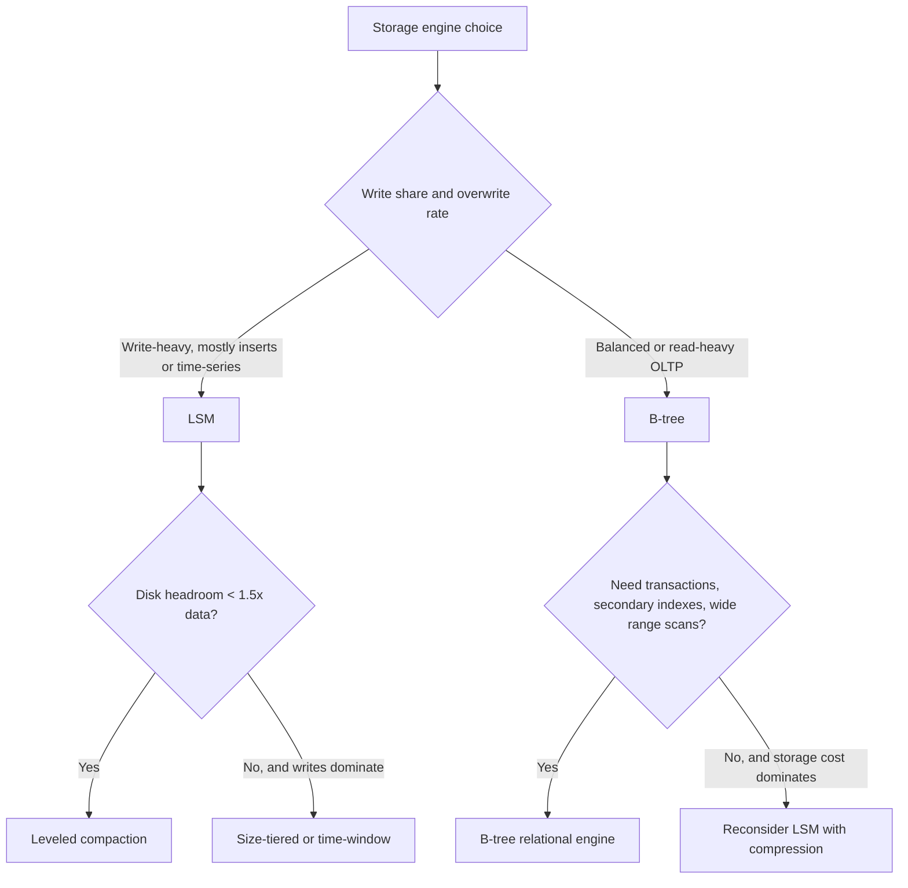

A design interview reaches the storage layer. You say "Postgres" or "Cassandra" and the interviewer asks the question that separates candidates: *why that one, for this workload?* "Cassandra scales writes" is a brand answer. The senior answer names the structure under each database, states what each structure amplifies, and matches that to the read/write mix, the data size and the disk.

Every storage engine ends up as one of two shapes. The **B-tree** family (Postgres, MySQL InnoDB, SQLite, Oracle, SQL Server, MongoDB's WiredTiger, etcd's bbolt) updates pages in place. The **LSM** family (RocksDB, LevelDB, Cassandra, ScyllaDB, HBase, MyRocks, TiKV, CockroachDB's Pebble) appends immutable sorted runs and merges them. This lesson puts them side by side with numbers, computes one workload end to end for both, and shows where to read the real amplification off a running system. It relies on the [B+ tree](/learn/advanced-data-structures/balanced-trees/b-trees-and-b-plus-trees) and [LSM](/learn/advanced-data-structures/log-structured-and-disk-structures/lsm-trees-and-sstables) lessons for the mechanisms.

## The RUM conjecture

For any structure that stores and retrieves data, you pay in three currencies: **R**ead cost, **U**pdate cost and **M**emory (space) overhead. The RUM conjecture, from the database research community, says you can drive two of the three toward their minimum only by letting the third grow. It is not a theorem, but it is a reliable lens.

- A B-tree minimises read cost (one path from root to leaf) and space (one copy of each row) and pays in update cost (a whole page rewritten per small change).
- An LSM tree with leveled compaction minimises space and keeps update cost sequential, and pays in read cost (many runs to consult).
- An LSM tree with size-tiered compaction minimises update cost and pays in both read cost and space.
- An unsorted append-only log minimises update cost to the floor and pays with unbounded read cost.

The way to compare engines is to measure each currency as an **amplification factor**: how many bytes the engine actually reads, writes or stores per byte the application asked about.

## Write amplification

Write amplification is bytes written to storage per byte of logical write. Take a 100-byte row update.

**B-tree.** The row lives in an 8 KB page (Postgres; InnoDB uses 16 KB). The buffer pool modifies the page in memory, but eventually the whole page is written back: 8,192 / 100 ≈ **82×** for that one update, if no other rows on the page changed in the meantime. Then add the WAL record (roughly the row plus a header, say 1.5×) and, in Postgres, the full-page write after a checkpoint (another 8 KB). Realistic B-tree write amplification for small random updates is in the tens, and it is *random* I/O: page 1093, then page 40,211, then page 7.

If updates cluster (a hot set of pages), the page absorbs many updates before it is flushed and the amplification drops: a page updated 50 times between checkpoints is written once, so the amplification is 82 / 50 ≈ 1.6. That is why a B-tree with a big buffer pool and a checkpoint every few minutes is fine for an OLTP database whose working set fits in RAM, and why the same database ingesting a uniformly random write stream over 5 TB is not.

**LSM tree, leveled compaction.** The row is written once to the WAL and once to the memtable's flush (a 64 MB sequential write shared with a million other rows). Then compaction moves it down the levels: the L0→L1 merge rewrites all of L1 (about 2 units per unit of L0), and each further move merges one file with the roughly `F` = 10 files it overlaps, so 11 units per unit moved. With five levels: 1 + 2 + 11 × 3 ≈ **36×** in the model, and less in practice, because many versions are overwritten before they descend. But every one of those writes is a large sequential write, which SSDs and HDDs both handle an order of magnitude more efficiently than random 8 KB writes.

**LSM tree, size-tiered.** Each row is rewritten about once per tier, `log_T(number of runs)`, typically **5–8×**. The cheapest write path there is, short of a plain log.

```viz
{"type": "system", "scenario": "b-tree-index",
 "title": "B-tree: one root-to-leaf path, in-place page updates",
 "caption": "A lookup follows a handful of pages; an update rewrites the leaf page it lands on, which is the source of the B-tree's write amplification."}
```

```viz
{"type": "system", "scenario": "lsm-tree",
 "title": "LSM: sequential runs, merged in the background",
 "caption": "Writes are absorbed in order; the cost is deferred to compaction, which rewrites data as it moves through the levels."}
```

## Read amplification

Read amplification is storage reads per logical read.

**B-tree.** A point lookup walks $\log_B n$ pages, where `B` is the fan-out. With 8 KB pages and ~20-byte index entries, `B` ≈ 400; a billion keys is four levels. The top three levels total about 1.3 GB and are always cached, so a point read on a cold leaf costs **about one** disk read for the index plus one for the heap row, and a hot one costs zero. Range scans are what B-trees are best at: leaf pages are linked, so a scan reads consecutive pages with no merging.

**LSM tree.** A point read may consult the memtable, every L0 file, and one file per level: with leveled compaction and five levels, 5–8 candidates. Bloom filters (typically 10 bits per key for ~1% false positives) reject almost all of the ones that lack the key, so a cold point read for a present key costs about **one block read plus a few filter checks**, and a read for an absent key costs close to zero. Without bloom filters, or with a size-tiered layout whose runs all overlap, the cost is one read per run. Range scans cannot use bloom filters and must merge iterators over every run whose range intersects the query; a scan that touches five runs does five times the I/O of a B-tree scan over the same rows.

The read amplification that surprises people is the one hiding in *compaction*: it reads every byte it writes, so an LSM store at write amplification 20 is also reading 20 bytes per ingested byte in the background, competing with your queries for disk bandwidth.

## Space amplification

Space amplification is bytes on disk per byte of live data.

**B-tree.** Pages are typically 60–80% full after random inserts (splits leave two half-full pages), and deleted rows leave holes until the page is reused. Postgres adds dead tuples from MVCC until `VACUUM` reclaims them; an update-heavy table without aggressive vacuuming can be 2× its live size. Baseline: **~1.3–1.5×**, worse under churn.

**LSM tree, leveled.** The last level holds about 90% of the data and contains exactly one version of each key; stale versions live in the smaller upper levels. Total: **~1.1×** the live data, plus a small transient allowance for the files being compacted. This is the single biggest reason Meta moved its user database (UDB) from InnoDB to MyRocks: [Meta reported](https://engineering.fb.com/2016/08/31/core-infra/myrocks-a-space-and-write-optimized-mysql-database/) 50% less storage for the same data than *compressed* InnoDB, with compression of sorted immutable blocks contributing alongside the layout.

**LSM tree, size-tiered.** Every tier may hold a stale copy of a key, and merging `T` runs requires space for the output while the inputs still exist. Plan for **up to 2×** and expect 1.5× steady state on overwrite-heavy workloads.

## The comparison in one table

| | B-tree (Postgres, InnoDB) | LSM leveled (RocksDB default) | LSM size-tiered (Cassandra default) |
|---|---|---|---|
| Write amp (small random updates) | tens, random I/O | 10–40, sequential | 5–8, sequential |
| Point read, cold | ~1–2 page reads | ~1 block read + filter checks | ~1 per run, filters help |
| Range scan | best: linked leaves | merge across levels | merge across all overlapping runs |
| Space amp | 1.3–2× (fragmentation, dead tuples) | ~1.1× | 1.5–2× |
| Latency profile | smooth; checkpoint spikes | compaction stalls at p99 | compaction stalls, larger |
| Transactions & secondary indexes | mature, in-place | possible (RocksDB transactions) but secondary indexes cost extra writes | limited; indexes are separate tables |
| Compression | per page, modest | per block, excellent (sorted, immutable) | per block, excellent |

The last two rows matter as much as the first three. In-place update makes row-level locking, secondary indexes and MVCC straightforward, which is why the relational engines are B-trees. Immutable sorted blocks compress extremely well (sorted keys share prefixes, values of one column sit together), which is why analytics-adjacent and storage-cost-sensitive systems lean LSM.

## One workload, computed for both

Take 10,000 updates per second of 200-byte rows spread uniformly over a 1 TB dataset, on a 2 TB NVMe SSD rated for one drive-write per day (DWPD) over its warranty. Uniform spread means the B-tree cannot coalesce updates on hot pages.

| | B-tree, 8 KiB pages | LSM, leveled, write amplification 25 |
|---|---|---|
| Bytes written per second | 10,000 × 8 KiB = **82 MB/s** of random page writes, plus ~3 MB/s of WAL | 10,000 × 200 B × 25 = **50 MB/s**, sequential |
| I/O operations per second | ~10,000 random 8 KiB writes plus WAL appends | a few hundred large sequential writes (compaction output) plus WAL appends |
| Bytes written per day | ~7.1 TB | ~4.3 TB |
| Drive writes per day on the 2 TB SSD | **3.5 DWPD** | **2.2 DWPD** |
| Verdict against a 1 DWPD rating | wears the drive in about a third of its warranty life | wears it in under half; tiered compaction (WA ~7) would bring it to ~0.6 DWPD |

Now change one assumption: the updates hit a 20 GB hot set instead of the whole terabyte. The B-tree's pages now absorb dozens of updates each between checkpoints, its page writes fall toward the checkpoint rate (the 20 GB of hot pages every 5 minutes is about 70 MB/s at worst, and far less if the buffer pool coalesces more), and it wins on read latency because everything is one cached path. The LSM store's write amplification does not change with locality; compaction rewrites what descends. That is the general rule: **locality helps the B-tree and does nothing for the LSM tree**, so measure your write distribution before you choose.

## What the disk changes

On a **spinning disk** a random 8 KB write costs a seek, ~5–10 ms, while a sequential write streams at 100–200 MB/s. The LSM tree's whole premise was invented for this: converting random writes to sequential ones is worth a 20× write amplification when the alternative is 200 random writes per second.

On an **SSD** there are no seeks, but the flash translation layer erases in large blocks (hundreds of KB to MB) and writes in pages; random small writes force it to copy live pages around (its own internal write amplification, which depends on over-provisioning and can reach several times for random small writes, near 1× for large sequential ones) and consume the device's finite program/erase endurance. Sequential writes of large chunks are still several times cheaper per byte and gentler on endurance. The gap is smaller than on HDD but it has not closed; and a database's write amplification multiplies the SSD's, so a B-tree at 40× on an SSD at 3× internal amplification wears the drive at 120 bytes per logical byte.

On **NVMe with deep queues**, random reads are nearly as fast as sequential ones, which shrinks the LSM's read penalty for point lookups and makes bloom filters the main thing that matters.

## Under the hood: measuring amplification on a running system

The numbers above are models. Every engine exposes the real ones.

- **RocksDB.** The `LOG` file prints a compaction stats table per column family with a `W-Amp` column per level and in total (compaction bytes written divided by bytes flushed); `rocksdb.compact.write.bytes` and `rocksdb.bytes.written` in `Statistics` give the same ratio, and `rocksdb.compact.read.bytes` is the background read cost. `rocksdb.estimate-live-data-size` against the SST file total gives space amplification.
- **InnoDB.** `SHOW GLOBAL STATUS` gives `Innodb_data_written` (bytes of pages and redo written) and `Innodb_pages_written`; divide by the row bytes your application wrote to get write amplification. `Innodb_buffer_pool_wait_free` rising means the buffer pool is evicting dirty pages on the write path, the sign that locality has run out.
- **Postgres.** `pg_stat_wal.wal_bytes` (WAL volume, including full-page images, since 14), page writes × 8 KiB from `pg_stat_bgwriter.buffers_checkpoint` and `buffers_backend` up to PostgreSQL 16 (17 moved them to `pg_stat_checkpointer` and `pg_stat_io`), and `pg_stat_user_tables.n_dead_tup` against `n_live_tup` for space amplification from MVCC.
- **The device.** `smartctl -a` reports `Data Units Written` (NVMe, in 512 KB units) or `Total_LBAs_Written` (SATA); the ratio of that to what the application wrote is the end-to-end amplification, engine and flash translation layer together, and it is the number that predicts when the drive dies.

## Picking by workload



Some concrete mappings:

- **Postgres and MySQL InnoDB.** B-trees, in-place updates, mature transactions. InnoDB's table *is* a clustered B+ tree on the primary key; Postgres stores rows in a heap with separate B-tree indexes.
- **MyRocks.** MySQL's SQL layer on RocksDB. Meta adopted it for UDB to cut storage and SSD wear; the trade was higher read amplification on some query shapes, reverse-ordered column families to make descending scans cheap, and a long tail of engineering to make secondary indexes and replication behave.
- **Cassandra and ScyllaDB.** LSM per node, tunable compaction, designed around partition-local reads. Write-heavy, append-mostly, time-series and event data; poor fit for queue-like delete patterns and for wide secondary-index queries.
- **CockroachDB and TiDB.** A distributed SQL layer on an LSM store (Pebble, TiKV on RocksDB). They accept the LSM read profile to get cheap replication of immutable files and efficient sequential writes for Raft logs and snapshots.
- **MongoDB WiredTiger.** A B-tree engine by default; its LSM option existed for years and has since been removed from WiredTiger's development branch. A useful data point: LSM is not a free upgrade.
- **Time-series databases** (InfluxDB's TSM, Prometheus's TSDB, ClickHouse's MergeTree) are LSM-shaped for the same reason Cassandra is: they ingest far more than they read, and whole-file expiry makes retention cheap.

The honest summary: if your working set fits in RAM and your writes are not the bottleneck, a B-tree relational database is the right default and the simpler one to operate. Reach for an LSM engine when write throughput per disk, storage cost, or SSD endurance is the constraint you are actually hitting, and budget for compaction tuning when you do. The [storage engine internals](/learn/databases/storage-and-scale/storage-engine-internals) lesson in the databases track continues from this choice into the engine's other components.

## Failure modes

| Symptom | Diagnosis | Fix |
|---|---|---|
| A B-tree database on a random-write workload shows disk utilisation at 100% with modest throughput; `iostat` shows thousands of small writes | Random page writes at 80× amplification: the working set exceeds the buffer pool, so pages are evicted dirty after one update | Bigger buffer pool if the hot set fits; otherwise an LSM engine, or batch updates by key range to restore locality |
| An LSM store's read p99 rises during the day and falls at night | Compaction reads and writes compete with foreground reads for disk bandwidth; the daytime write rate raises compaction volume | Rate-limit compaction (`rate_limiter` in RocksDB), separate compaction I/O onto its own device, or move to tiered compaction if reads can tolerate more runs |
| NVMe drives fail years early on a fleet running a write-heavy B-tree | Write amplification (engine × flash translation layer) puts the drives at several DWPD against a 1 DWPD rating; `smartctl` shows the wear indicator dropping | Compute DWPD from `Data Units Written` and choose an LSM engine or higher-endurance drives before the fleet ages out together |
| An analytics service on an LSM store runs wide range scans slowly | Scans merge across every overlapping run and cannot use bloom filters; leveled compaction limits it, tiered does not | A B-tree or a columnar store for scans; if the LSM must stay, leveled compaction and keys that keep scans within one partition |
| Postgres table twice the size of its live rows; queries scan dead tuples | Space amplification from MVCC: `n_dead_tup` high, autovacuum falling behind on an update-heavy table | Tune autovacuum (`autovacuum_vacuum_scale_factor` down, more workers), or `pg_repack`; for extreme churn consider an LSM engine or partitioning |
| Switching a service from InnoDB to MyRocks halves storage but a report query is 5× slower | The report does descending range scans and secondary-index lookups, both of which cost more on an LSM store | Reverse-ordered column families for DESC scans, covering indexes to avoid the second lookup, or keep the reporting replica on InnoDB |

## Interviewer follow-ups

**"Give me a workload where the B-tree beats the LSM tree on writes."** Model answer: a small hot set updated repeatedly, such as counters or session rows: the B-tree page absorbs many updates per flush (amplification approaching 1), while the LSM tree still rewrites each version through compaction. Common wrong answer: "never, LSM is write-optimised", which ignores locality.

**"How would you measure write amplification on a production RocksDB node?"** Model answer: read the `W-Amp` column of the compaction stats in `LOG`, or divide `rocksdb.compact.write.bytes` plus flush bytes by `rocksdb.bytes.written`; then check `smartctl`'s data units written to include the drive's own amplification. Common wrong answer: "compare disk size to data size", which is space amplification.

**"Why did Meta move UDB to MyRocks, and what did it cost them?"** Model answer: storage roughly halved (leveled compaction near 1.1× plus per-block compression) and SSD wear dropped; the costs were higher read amplification on some query shapes, engineering for descending scans and secondary indexes, and compaction tuning. Common wrong answer: "because it was faster", without saying at what.

**"Your LSM store is at 1.2 TB on 1.4 TB of disk under leveled compaction; a colleague proposes size-tiered to reduce write amplification. Do you agree?"** Model answer: no, tiered compaction's peak space can approach 2× the data during its largest merge, which 1.4 TB cannot hold; keep leveled or add disk first. Common wrong answer: "yes, fewer writes are always better".

**"Why does compaction hurt read latency if it runs in the background?"** Model answer: it reads what it writes, so at write amplification 20 it moves 40 bytes of disk traffic per ingested byte and competes with foreground reads for bandwidth and for the block cache; rate-limiting or a separate device is the fix. Common wrong answer: "it doesn't, it's asynchronous".

## What mid-level engineers get wrong

- **Choosing by brand.** "Cassandra scales" and "Postgres is reliable" are not workload arguments; amplification numbers are.
- **Forgetting that locality changes the B-tree's cost** and nothing about the LSM tree's.
- **Reading write amplification as throughput** rather than as drive endurance and background bandwidth.
- **Assuming LSM space amplification is always low.** It is 1.1× under leveled compaction and up to 2× under tiered.
- **Ignoring the read cost of compaction.**
- **Treating the MongoDB LSM retirement or Meta's MyRocks migration as a verdict** rather than as two workloads that pointed different ways.

## A model you can compute

The exercise below implements a deliberately simple amplification model so you can compare configurations with numbers. It ignores WAL overhead, bloom filters and overwrites; its job is to make the shape of the trade-off concrete, and to show how quickly leveled write amplification grows with data size while B-tree write amplification depends only on the row-to-page ratio.

```exercise
id: amplification-model
title: Compute B-tree and leveled-LSM amplification factors
prompt: |
  Implement `amplification(row_bytes, page_bytes, data_bytes, l1_bytes, fanout)`
  returning a list `[btree_write_amp, lsm_levels, lsm_write_amp]` under this
  model (all inputs are positive integers, `fanout >= 2`, `row_bytes <= page_bytes`):

  - `btree_write_amp = page_bytes // row_bytes` (integer division): a single
    row update rewrites the whole page it lives in.
  - `lsm_levels` is the smallest `n >= 1` such that the total capacity of
    levels `L1..Ln` is at least `data_bytes`, where level `Li` has capacity
    `l1_bytes * fanout^(i-1)`. Compute the capacity sum with a loop; do not
    use floating-point powers.
  - `lsm_write_amp = 1 + fanout * (lsm_levels - 1)`: one write for the flush
    into L1, plus `fanout` rewrites for every move down a level.

  Return the three values as integers.
languages: [python, javascript]
entry: amplification
starter:
  python: |
    def amplification(row_bytes, page_bytes, data_bytes, l1_bytes, fanout):
        # TODO
        return [0, 0, 0]
  javascript: |
    function amplification(row_bytes, page_bytes, data_bytes, l1_bytes, fanout) {
      // TODO
      return [0, 0, 0];
    }
tests:
  - args: [100, 8192, 1000000000, 268435456, 10]
    expected: [81, 2, 11]
    label: 1 GB over a 256 MB L1
  - args: [128, 4096, 1000000000000, 268435456, 10]
    expected: [32, 5, 41]
    label: 1 TB needs five levels
  - args: [100, 100, 1, 1, 2]
    expected: [1, 1, 1]
    label: degenerate minimum
  - args: [200, 8192, 5000000000, 100000000, 8]
    expected: [40, 3, 17]
    label: fanout 8
  - args: [50, 16384, 268435456, 268435456, 10]
    expected: [327, 1, 1]
    hidden: true
    label: data exactly fills L1
  - args: [1000, 8192, 300000000000, 67108864, 10]
    expected: [8, 5, 41]
    hidden: true
    label: 64 MB L1 with 300 GB
hints:
  - "Keep a running `capacity` for the current level (start at `l1_bytes`) and a running `total`; multiply `capacity` by `fanout` after adding it, and stop when `total >= data_bytes`."
  - "The loop always terminates because `fanout >= 2` makes the capacity grow geometrically; still, count levels as you go rather than computing a logarithm."
```

## Senior signals

- You compare storage engines by **read, write and space amplification**, and you can put a number on each for a 100-byte row on an 8 KB page, then compute bytes per day and drive writes per day for a stated workload.
- You know that B-tree write amplification is random I/O that locality can shrink, while LSM write amplification is sequential and indifferent to locality, and that the disk type decides how much that difference is worth.
- You can say where to read the real numbers: RocksDB's `W-Amp`, `Innodb_data_written`, `pg_stat_wal`, and the drive's data-units-written counter.
- You can explain why Meta's move to MyRocks was about storage and SSD endurance, and what it cost in read profile.
- You mention that compaction reads what it writes, so background I/O competes with queries, and that LSM p99s are shaped by compaction.
- You default to a B-tree relational engine when the working set fits in RAM and say so, rather than treating LSM as strictly more scalable.
- You know WiredTiger dropped its LSM mode, and you use it as evidence that the choice depends on workload, not fashion.

## Check yourself

```quiz
- q: >-
    An engine writes 100-byte rows into 16 KB pages and flushes each dirty page once per update. Its WAL is negligible. Which statement about write amplification is correct?
  options: ["About 16x, because 16 KB pages hold 16 rows", "About 160x, all of it sequential", "About 1x, because the WAL absorbs the write", "About 160x, all of it random I/O"]
  answer: 3
  explanation: >-
    16,384 / 100 is about 164 bytes written per byte changed, and each page lands wherever the key hashes in the tree, so the I/O pattern is random. The WAL adds to this figure; it does not replace the page write.
- q: >-
    Leveled compaction with fanout 10 and six levels. A row that eventually settles in L6 has been rewritten roughly how many times, in the simple model?
  options: ["About 60", "About 51", "About 6", "About 10"]
  answer: 1
  explanation: >-
    One write for the flush plus ten rewrites per move through five level boundaries: 1 + 10 x 5 = 51. Real numbers are lower because overwritten versions never descend, but the shape (linear in levels, times fanout) is right.
- q: >-
    A workload updates the same 5 GB of rows over and over on a server with a 32 GB buffer pool. Which engine's write amplification does this locality reduce?
  options: ["The LSM tree's, because hot keys stay in the memtable and never flush", "Neither, because amplification depends only on row and page sizes", "The B-tree's, because each page absorbs many updates before one flush", "Both equally, because fewer distinct bytes change in either engine"]
  answer: 2
  explanation: >-
    A B-tree page updated many times between checkpoints is written once, so its amplification falls toward 1. An LSM tree flushes every memtable version and compaction rewrites whatever descends regardless of how hot the key is; locality does not change its arithmetic. This asymmetry is why the write distribution must be measured before choosing.
- q: >-
    Which workload is the strongest fit for a size-tiered LSM store rather than a B-tree?
  options: ["Event ingestion of 300,000 immutable rows/s, read by key within the hour", "A config table of 10,000 rows, updated a few times a day by operators", "A bank ledger with strict transactions and indexes on account and date", "A product catalogue read 1,000 times per write, with range queries by price"]
  answer: 0
  explanation: >-
    Write-dominated, append-only, point-read-by-key data is exactly what the LSM write path is built for, and size-tiered compaction keeps write amplification lowest. The catalogue and ledger want a B-tree for range scans, transactions and indexes; the tiny table does not care.
- q: >-
    Your RocksDB service has 1.2 TB of live data on 1.4 TB of disk and uses leveled compaction. A colleague proposes switching to size-tiered compaction to cut write amplification. What is the main risk?
  options: ["Space amplification can approach 2x, exceeding the disk", "The WAL must double in size to cover the larger merges", "Write amplification rises, since tiers are rewritten more often", "Bloom filters stop working under size-tiered compaction"]
  answer: 0
  explanation: >-
    Size-tiered compaction keeps stale copies across tiers and needs room for both inputs and output during a merge, so peak usage can approach twice the live data. 1.4 TB cannot absorb that; leveled compaction stays near 1.1x, which is why it fits. The switch would lower write amplification, as the colleague says; disk space is the cost.
- q: >-
    A point lookup for a key that does not exist is served by a leveled LSM store with per-file bloom filters at 1% false positives and six candidate files. Roughly how many disk reads does it cost on average?
  options: ["Six, one read per candidate file", "Zero, as filters never err on absent keys", "About 0.06, from false positives", "One, to confirm the key is absent"]
  answer: 2
  explanation: >-
    Each filter answers 'definitely absent' with no I/O except on a false positive, which happens 1% of the time per file. Six files at 1% each gives about 0.06 expected block reads. Zero is wrong because false positives happen precisely on absent keys; what a bloom filter never gives is a false negative. This is why LSM stores are fast on negative lookups and why bloom filters are non-negotiable in them.
```
