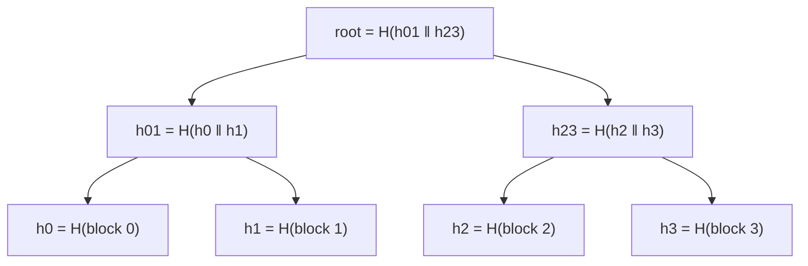

Two replicas of a 500 GB table have drifted: one missed a few writes during a network partition. You need to find the rows that differ and copy them across. Comparing the tables row by row means shipping 500 GB over the network to check what is, in all likelihood, a few kilobytes of difference. A single hash of the whole table tells you *whether* they differ but not *where*. You need something in between: a structure whose summaries can be compared top-down so that the search narrows to the differing rows in a logarithmic number of exchanges.

A second, unrelated-looking problem: a network driver receives packets on one core and a parser consumes them on another, at millions per second. A mutex-protected queue costs a lock acquisition per packet and a cache-line ping-pong between the cores. You need a queue where the producer and the consumer never contend, which means a structure where each side owns the state it writes.

The two structures that solve these are both small and both everywhere. The Merkle tree is under Git, Cassandra repair, Amazon's Dynamo, Bitcoin and Certificate Transparency. The ring buffer is under `io_uring`, every NIC driver, the kernel log, audio pipelines and the LMAX Disruptor. This lesson traces a proof through a Merkle tree hash by hash, walks a ring buffer's indices through wrap-around, and opens the real layouts.

## Merkle trees

A Merkle tree (hash tree) is a binary tree of hashes over a list of data blocks. Leaves hold `H(block)`. Each internal node holds `H(left ‖ right)`, the hash of its two children's hashes concatenated. The root is a single hash that commits to every block and to their order.



Three properties follow from the construction:

1. **Any change anywhere changes the root.** Modify block 2 and `h2`, `h23` and the root all change. Two lists with the same root are, for a collision-resistant hash, the same list.
2. **Difference localisation is O(log n) comparisons.** Compare roots; if they differ, compare the two children; descend into the child that differs; repeat. With `n` leaves, `log₂ n` rounds pinpoint one differing leaf. For a table with 2³⁰ rows, that is 30 rounds per divergent row, and the exchange carries hashes, not rows.
3. **Membership proofs are O(log n) hashes.** To prove block 2 is in the tree with a known root, send `h3` and `h01`: the verifier recomputes `h2 = H(block 2)`, `h23 = H(h2 ‖ h3)`, `root = H(h01 ‖ h23)` and checks the root. Twenty hashes prove membership in a million-block tree without sending the tree.

### A proof traced

Use 32-bit FNV-1a as the hash and, to keep the arithmetic visible, join two child hashes as decimal strings with a colon (the convention the exercises use). Four blocks, `tx1` … `tx4`:

| Node | Input | Hash |
|---|---|---|
| `h0` | `"tx1"` | 3761637072 |
| `h1` | `"tx2"` | 3811969929 |
| `h2` | `"tx3"` | 3795192310 |
| `h3` | `"tx4"` | 3845525167 |
| `h01` | `"3761637072:3811969929"` | 3738159390 |
| `h23` | `"3795192310:3845525167"` | 3883132443 |
| root | `"3738159390:3883132443"` | **4112606006** |

A prover claims `tx3` is in the tree with root 4112606006 and sends the proof `[3845525167, 3738159390]`: the sibling at each level, bottom up. The verifier, who knows only `tx3`, its index (2) and the root:

| Step | Index | Sibling | Which side | Compute | Result |
|---|---|---|---|---|---|
| 0 | 2 | | | `H("tx3")` | 3795192310 |
| 1 | 2 (even, so I am the left child) | 3845525167 | right | `H("3795192310:3845525167")` | 3883132443 |
| 2 | 1 (odd, so I am the right child) | 3738159390 | left | `H("3738159390:3883132443")` | 4112606006 = root ✓ |

The index tells the verifier which side each sibling goes on, and halves at each level. Tamper with anything and the chain breaks: the leaf `"tx3x"` with the same proof yields 2668202685; the correct leaf with its first sibling placed on the wrong side (as if its index were 3) yields 398464203. Neither is the root, so both are rejected. The proof is two hashes for four leaves, twenty for a million.

An odd number of nodes at some level needs a rule. Bitcoin duplicates the last node (`H(h4 ‖ h4)`); Certificate Transparency promotes it unchanged to the next level. Both work; the point is that both sides must use the same rule, or the same data yields different roots.

### Under the hood: domain separation and real object formats

Hashing `left ‖ right` with the same function used for leaves opens a **second-preimage** hole: an attacker who can present the 64-byte concatenation `h0 ‖ h1` *as a leaf* produces a two-leaf tree with the same root as the four-leaf one. Certificate Transparency (RFC 6962) closes it by prefixing leaves with the byte `0x00` and internal nodes with `0x01` before hashing, so no leaf hash can equal a node hash. Bitcoin's Merkle tree has no such separator and, worse, its duplicate-the-last-node rule means a block with transactions `[a, b, c]` and one with `[a, b, c, c]` have the same root; CVE-2012-2459 exploited exactly that to make nodes reject a valid block after seeing a malformed twin with the same root. The fix was to detect the duplicated pair, not to change the tree, because the tree's rule was consensus-critical by then.

**Git** is a Merkle DAG rather than a strict tree, and its hashes are over typed, length-prefixed objects: a blob is `SHA-1("blob <size>\0<content>")`, a tree object hashes a sorted list of `<mode> <name>\0<20-byte hash>` entries, and a commit hashes `tree <hash>\nparent <hash>\n…` plus author, committer and message. The type-and-length prefix is Git's domain separation; the commit ID therefore commits to the entire history and every byte of every file in it. That is why `git fetch` can exchange a few object IDs to discover what the other side lacks, why a corrupted object is detected on read, and why rewriting one old commit changes every descendant's ID. Git 2.29 added SHA-256 repositories (experimental at first) with the same layout and 32-byte hashes.

**Bitcoin** puts the Merkle root of a block's transactions (double SHA-256 at every node) in the 80-byte block header, so a light client with only headers can verify a transaction's inclusion from a `log₂(n)` proof. **Certificate Transparency** logs are append-only Merkle trees; a "consistency proof" shows that a newer root extends an older one without dropping entries, which is how auditors catch a log that rewrote history.

### Anti-entropy: Merkle trees between replicas

**Cassandra repair** builds a Merkle tree per token range on each replica (leaves cover slices of the token range and hash the rows in that slice), exchanges the trees, and streams only the slices whose hashes differ. Building the tree means reading the whole range, which is why full repair is expensive I/O and why incremental repair tracks which SSTables have already been repaired. **Amazon's Dynamo** paper describes the same mechanism for divergent replicas; Riak and Cassandra inherited it. It is the "anti-entropy" half of the [gossip and anti-entropy lesson](/learn/system-design/distributed-systems/gossip-and-anti-entropy): gossip spreads *that* something changed, Merkle comparison finds *what*.

The design trade is leaf granularity. Coarse leaves (each covering a million rows) mean a small tree and a cheap exchange, but a single differing row forces a million-row stream. Fine leaves localise precisely but cost memory and time to build. Cassandra's trees are capped in depth (on the order of 2¹⁵–2²⁰ leaves per range, sized from the estimated partition count) for this reason, and "overstreaming" from coarse leaves is a recognised repair cost.

## Ring buffers

A ring buffer (circular buffer) is a fixed-size array with two indices: `head`, where the next item is removed, and `tail`, where the next item is added. Both advance modulo the capacity, so the array is reused forever without allocation, shifting or reallocation. That fixed footprint is the whole appeal in kernels, drivers and audio code, where allocating on the hot path is either forbidden or too slow.

```text
capacity 8, head = 2, tail = 6: tail − head = 4 items queued.

index:  0   1   2   3   4   5   6   7
       [ ] [ ] [C] [D] [E] [F] [ ] [ ]
                ^head             ^tail
```

`push(x)`: write `buf[tail]`, then `tail = (tail + 1) % cap`. `pop()`: read `buf[head]`, then `head = (head + 1) % cap`. Both are O(1) with no branching beyond the wrap and no memory traffic beyond the slot itself.

### The indices traced through a wrap

Capacity 4, using a count to distinguish full from empty:

| Op | Slot touched | head | tail | count | Buffer (`_` empty) | Returns |
|---|---|---|---|---|---|---|
| push A | write 0 | 0 | 1 | 1 | `A _ _ _` | true |
| push B | write 1 | 0 | 2 | 2 | `A B _ _` | true |
| push C | write 2 | 0 | 3 | 3 | `A B C _` | true |
| pop | read 0 | 1 | 3 | 2 | `· B C _` | A |
| push D | write 3 | 1 | 0 (wrapped) | 3 | `· B C D` | true |
| push E | write 0 | 1 | 1 | 4 | `E B C D` | true |
| push F | full | 1 | 1 | 4 | unchanged | false |
| pop | read 1 | 2 | 1 | 3 | `E · C D` | B |
| pop, pop, pop | read 2, 3, 0 | 1 | 1 | 0 | `· · · ·` | C, D, E |

After `push E` the two indices are equal and the buffer is full; after the last three pops they are equal again and it is empty. That is the ambiguity the next section is about. With **unmasked indices** the same sequence keeps `head` and `tail` growing (five successful pushes and five pops leave both at 5), the slot is always `index & 3`, size is `tail − head`, full is `size == 4`, and the wrap never needs a comparison.

### The full-versus-empty ambiguity

With only `head` and `tail`, an empty buffer and a full one look identical: `head == tail`. There are three standard fixes, and which one an implementation uses tells you what it cares about.

| Fix | Mechanism | Cost |
|---|---|---|
| **Count field** | Keep `count`; full when `count == cap`, empty when `count == 0` | Both producer and consumer write `count`, so it is shared state: fine single-threaded, bad for lock-free |
| **One-slot gap** | Full when `(tail + 1) % cap == head`; capacity is effectively `cap − 1` | Wastes one slot; producer and consumer each write only their own index |
| **Unmasked indices** | Let `head` and `tail` grow without bound; index with `i & (cap − 1)` where `cap` is a power of two; size is `tail − head`, full when it equals `cap` | Requires power-of-two capacity; the fastest and the one kernels use, with wraparound of the integer being harmless because subtraction is modular too |

The exercise below uses a count for clarity. Production SPSC queues use one of the other two.

### From ring buffer to lock-free SPSC queue

Restrict to **one producer and one consumer**, each on its own thread, and the ring buffer becomes a lock-free queue with no compare-and-swap at all. The key idea is *ownership*: the producer is the only writer of `tail`; the consumer is the only writer of `head`. Each side *reads* the other's index but never modifies it, so there is no read-modify-write race to resolve.

```viz
{"type": "concurrency", "scenario": "producer-consumer",
 "title": "One producer, one consumer, one ring",
 "caption": "The producer checks for space by reading head, writes the slot, then publishes by advancing tail. The consumer mirrors it. Neither index has two writers, so no lock or CAS is needed."}
```

What *is* needed is memory ordering. The producer writes the item into the slot and then advances `tail`; the consumer reads `tail`, sees the new value, and reads the slot. On a weakly ordered CPU (ARM, POWER) and under compiler reordering, the consumer could observe the new `tail` before the slot's bytes are visible. The fix is a **release** store on `tail` (everything before it in the producer is visible to anyone who **acquires** it) and an **acquire** load of `tail` in the consumer. Symmetrically for `head`. In Rust:

```rust
// producer
let t = self.tail.load(Ordering::Relaxed);          // only I write tail
if t.wrapping_sub(self.head.load(Ordering::Acquire)) == CAP { return Err(Full); }
unsafe { self.slots[t & (CAP - 1)].write(item); }   // write the slot
self.tail.store(t.wrapping_add(1), Ordering::Release); // publish

// consumer
let h = self.head.load(Ordering::Relaxed);
if self.tail.load(Ordering::Acquire) == h { return None; }
let item = unsafe { self.slots[h & (CAP - 1)].read() };
self.head.store(h.wrapping_add(1), Ordering::Release);
Some(item)
```

No loop, no retry, no CAS: this queue is *wait-free* for both sides, which is a stronger property than lock-free and is why it appears wherever latency must be bounded. The [atomics and lock-free lesson](/learn/systems/concurrency/atomics-and-lock-free) covers the ordering model in depth; for a queue with multiple producers, `tail` gets two writers and you are back to CAS loops or the Disruptor's per-producer claim sequence.

### False sharing: the bug that halves your throughput

`head` and `tail` are two machine words. Declare them next to each other in a struct and they land in the same 64-byte cache line. Now every `tail` store by the producer invalidates the line in the consumer's core, which was only reading `head`, and vice versa. The two threads are not sharing data, but they are sharing a cache line, and the coherence protocol bounces it between cores on every operation. The loss is often several-fold (the [CPU caches lesson](/learn/systems/performance-engineering/cpu-caches-and-memory-layout) measured 2.6× with two threads on one line) and is invisible in the code.

```viz
{"type": "concurrency", "scenario": "false-sharing",
 "title": "Two independent counters, one cache line",
 "caption": "Writes to head and tail from different cores force the shared line to migrate on every update even though neither thread reads the other's counter as often."}
```

The fix is padding: put each index on its own cache line (`#[repr(align(64))]` in Rust, `alignas(64)` in C++, `@Contended` on the JVM). The LMAX Disruptor's `Sequence` class pads its `long` with 56 bytes of unused fields on each side (seven `long`s in 3.x, 56 `byte`s in current versions), so that no other field can share its line. Three further micro-optimisations turn up in serious implementations: each side keeps a *cached copy* of the other's index and re-reads the shared one only when the cached value says the queue looks full or empty (which cuts the cross-core reads by a factor of the queue's average occupancy); the capacity is a power of two so the modulo is a mask; and slots are sized so that an item never straddles two lines. The [CPU caches lesson](/learn/systems/performance-engineering/cpu-caches-and-memory-layout) explains why each of these matters.

```viz
{"type": "memory", "scenario": "cache-lines",
 "title": "Why padding the indices works",
 "caption": "Memory moves between cores in 64-byte lines. Putting head and tail on separate lines means each core's writes invalidate only its own line."}
```

### Under the hood: io_uring, NIC rings and the Disruptor

**`io_uring`** (Linux 5.1+) is two SPSC rings shared between user space and the kernel through one `mmap`. The submission queue holds 64-byte submission queue entries (opcode, file descriptor, buffer address, length, offset, user data); the application is its producer and the kernel its consumer. The completion queue holds 16-byte entries (user data, result, flags); the kernel produces, the application consumes. Each ring exposes `head`, `tail`, `ring_mask` and `ring_entries` in the shared memory, uses unmasked indices with power-of-two sizes, and relies on exactly the release/acquire discipline above (`io_uring_smp_store_release` on the tail). No syscall is needed to enqueue, and with `SQPOLL` none is needed to submit either: that is the entire performance argument.

**NIC drivers** hand the hardware a ring of descriptors (16 bytes each in Intel's legacy format, 256 to a few thousand per queue) pointing at packet buffers; the card writes packets and advances its index in a device register, the driver consumes. Interrupt coalescing and NAPI are policies over that ring, and a "ring full" condition on receive is a dropped packet, which is the drop-newest policy in hardware.

**The kernel log** (`dmesg`) is a ring that overwrites the oldest entries rather than block, which is the *other* full-queue policy: drop the old instead of refusing the new. Tracing buffers make the policy a setting: LTTng channels run in discard mode (drop the newest, count the loss) or overwrite "flight recorder" mode, and `perf record` overwrites only with `--overwrite`. **Audio** callbacks run on a real-time thread that must never block or allocate; the application fills a ring and the callback drains it. The **LMAX Disruptor** is a multi-producer ring with sequence barriers that let several consumers process the same slots in a dependency graph, used in trading systems for sub-microsecond handoff.

Kafka is worth naming as the thing a ring buffer is *not*: a Kafka partition is an unbounded, durable log with retention, consumed at each reader's own pace. A ring buffer is bounded, in memory, and its slot is reused as soon as the consumer moves past it. When someone says "we'll use a ring buffer for the event stream", ask what happens when the consumer falls behind by more than the capacity.

## Failure modes

| Symptom | Diagnosis | Fix |
|---|---|---|
| Two different data sets produce the same Merkle root; a verifier accepts a forged inclusion | No domain separation between leaf and node hashing, or a duplicate-last-node rule that makes `[a, b, c]` and `[a, b, c, c]` collide (Bitcoin's CVE-2012-2459) | Prefix leaves and nodes with distinct bytes (RFC 6962's `0x00`/`0x01`), include lengths, and promote rather than duplicate odd nodes |
| Cassandra repair streams gigabytes to fix a handful of rows | Coarse Merkle leaves: one mismatched leaf covers a large slice and the whole slice is streamed | Smaller ranges per repair session (subrange repair), incremental repair so already-repaired data is excluded |
| Repair on two replicas reports every leaf as different although the data matches | The two sides hash rows in different orders or with different tombstone handling, so equal data yields unequal hashes | Canonical row ordering and a versioned hashing scheme; never compare trees built by different code versions |
| An SPSC queue moves 5 million items per second on one core and 1.5 million across two | False sharing: `head` and `tail` share a cache line and bounce between cores | Pad each index to its own 64-byte line; cache the peer's index locally |
| Items occasionally come out corrupted or duplicated on ARM but never on x86 | Relaxed stores on the indices: the consumer sees the new `tail` before the slot's bytes | Release store on publish, acquire load on read; test on a weakly ordered machine or under a model checker such as loom |
| A ring "works" for weeks and then returns wrong items | Unmasked indices with a capacity that is not a power of two, so `index & (cap − 1)` is not a modulo; or 32-bit indices wrapped after 2³² operations while size arithmetic assumed no wrap | Enforce power-of-two capacity at construction; use `wrapping_sub` for size, or 64-bit indices |
| A telemetry consumer that fell behind silently loses hours of events | Drop-oldest policy chosen for a stream where completeness mattered | Decide the full-buffer policy explicitly: block, drop-newest with a counter, or drop-oldest with a gap marker the consumer can detect |

## Interviewer follow-ups

**"Two replicas differ in one row out of a billion. How much data crosses the network to find it?"** Model answer: with a Merkle tree over the rows, about 30 rounds of two hashes each, a few kilobytes; with leaves covering row slices, the same rounds find the slice and then the slice itself is streamed, so leaf granularity sets the tail cost. Common wrong answer: "one hash per row", which is a billion hashes and misses the tree.

**"Why does Certificate Transparency prefix leaf hashes with 0x00 and node hashes with 0x01?"** Model answer: so that a leaf can never be mistaken for an internal node; without the prefix, presenting the concatenation of two child hashes as a leaf gives a different tree with the same root, a second-preimage attack. Common wrong answer: "to tell the tree depth", which the proof already carries by its length.

**"Why does an SPSC ring need no CAS but still needs atomics?"** Model answer: each index has exactly one writer, so there is no read-modify-write race; but the slot write and the index publish must be ordered, which is what a release store and an acquire load provide, on x86 nearly free, on ARM a real barrier. Common wrong answer: "because `head` and `tail` are read by both threads" (that is why they are atomic, not why ordering is required).

**"Your queue is slower with two cores than with one. What is the first thing you check?"** Model answer: false sharing of `head` and `tail`; pad them onto separate cache lines and measure again, then check whether the sides are re-reading the peer's index on every operation instead of caching it. Common wrong answer: "the modulo operation".

**"How would you extend the ring to multiple producers?"** Model answer: producers must claim slots atomically, with a CAS loop or fetch-add on a claim counter, and then publish in order, which the Disruptor does with a per-slot sequence so consumers can tell which claimed slots are filled; the queue is no longer wait-free. Common wrong answer: "put a mutex around push", which is correct and throws away the reason the ring existed.

## What mid-level engineers get wrong

- **Hashing leaves and nodes with the same function and no prefix**, then discovering the second-preimage attack in a security review.
- **Assuming a Merkle tree finds differences for free.** Building it reads every row; the saving is in the exchange, not the build.
- **Comparing `head == tail` to decide full versus empty.**
- **Publishing with a relaxed store** because "it works on my laptop", which is x86 and strongly ordered.
- **Putting `head` and `tail` in adjacent fields.**
- **Calling Kafka a ring buffer**, and calling a ring buffer a message queue without saying what happens when it is full.

## Exercises

```exercise
id: ring-buffer
title: Implement a bounded ring buffer
prompt: |
  Implement `RingBuffer` as a fixed-capacity FIFO backed by an array with
  `head` and `tail` indices. The runner constructs it with no arguments and
  then calls:

  - `set_capacity(n)` allocates `n` slots and resets the buffer. Returns `None`/`null`.
  - `push(x)` appends `x` and returns `True`/`true`, or returns `False`/`false`
    without modifying anything if the buffer is full.
  - `pop()` removes and returns the oldest item, or `None`/`null` if empty.
  - `size()` returns the number of items queued.

  Use modular index arithmetic; do not shift elements or grow the array.
languages: [python, javascript]
entry: RingBuffer
starter:
  python: |
    class RingBuffer:
        def __init__(self):
            self.buf = []
            self.cap = 0
            self.head = 0   # index of the oldest item
            self.tail = 0   # index where the next item goes
            self.count = 0

        def set_capacity(self, n):
            # TODO
            return None

        def push(self, x):
            # TODO
            return False

        def pop(self):
            # TODO
            return None

        def size(self):
            return self.count
  javascript: |
    class RingBuffer {
      constructor() {
        this.buf = [];
        this.cap = 0;
        this.head = 0;   // index of the oldest item
        this.tail = 0;   // index where the next item goes
        this.count = 0;
      }
      set_capacity(n) {
        // TODO
        return null;
      }
      push(x) {
        // TODO
        return false;
      }
      pop() {
        // TODO
        return null;
      }
      size() { return this.count; }
    }
tests:
  - args: [["set_capacity",3],["push",1],["push",2],["push",3],["push",4],["size"],["pop"],["push",4],["pop"],["pop"],["pop"],["pop"],["size"]]
    expected: [null, true, true, true, false, 3, 1, true, 2, 3, 4, null, 0]
    label: fills, refuses, then wraps
  - args: [["set_capacity",1],["pop"],["push",7],["push",8],["pop"],["push",8],["pop"]]
    expected: [null, null, true, false, 7, true, 8]
    label: capacity one
  - args: [["set_capacity",2],["push","a"],["push","b"],["pop"],["push","c"],["pop"],["pop"],["size"]]
    expected: [null, true, true, "a", true, "b", "c", 0]
    label: wraparound preserves FIFO order
  - args: [["set_capacity",3],["push",0],["pop"],["pop"]]
    expected: [null, true, 0, null]
    label: a falsy item is still an item
  - args: [["set_capacity",4],["push",1],["push",2],["push",3],["pop"],["pop"],["push",4],["push",5],["push",6],["push",7],["size"],["pop"],["pop"],["pop"],["pop"],["pop"]]
    expected: [null, true, true, true, 1, 2, true, true, true, false, 4, 3, 4, 5, 6, null]
    hidden: true
    label: several wraps
hints:
  - "Advance an index with `(i + 1) % cap`; never compare `head == tail` alone to decide full versus empty, use `count`."
  - "In `pop`, read the slot before advancing `head`; in `push`, write the slot before advancing `tail`. That order is what makes the lock-free version correct too."
```

```exercise
id: merkle-root
title: Compute a Merkle root
prompt: |
  Implement `merkle_root(leaves)` for a list of ASCII strings using the
  32-bit FNV-1a hash provided in the starter. Return the root as an integer.

  - Each leaf hash is `fnv1a(leaf)`.
  - Build the tree bottom-up: a parent's hash is `fnv1a(str(left) + ":" + str(right))`,
    where `left` and `right` are the children's hashes written as decimal numbers.
  - If a level has an odd number of nodes, duplicate the last node so it
    pairs with itself.
  - The root of a single leaf is that leaf's hash. The root of an empty
    list is `0`.
languages: [python, javascript]
entry: merkle_root
starter:
  python: |
    def fnv1a(s):
        h = 0x811c9dc5
        for b in s.encode("utf-8"):
            h ^= b
            h = (h * 0x01000193) & 0xFFFFFFFF
        return h

    def merkle_root(leaves):
        # TODO
        return 0
  javascript: |
    function fnv1a(str) {
      let h = 0x811c9dc5;
      for (let i = 0; i < str.length; i++) {
        h ^= str.charCodeAt(i);
        h = Math.imul(h, 0x01000193) >>> 0;
      }
      return h;
    }

    function merkle_root(leaves) {
      // TODO
      return 0;
    }
tests:
  - args: [["a", "b"]]
    expected: 1928464449
    label: two leaves
  - args: [["a"]]
    expected: 3826002220
    label: single leaf is its own root
  - args: [[]]
    expected: 0
    label: empty list
  - args: [["a", "b", "c"]]
    expected: 1946579929
    label: odd level duplicates the last node
  - args: [["tx1", "tx2", "tx3", "tx4"]]
    expected: 4112606006
  - args: [["b", "a"]]
    expected: 2200810001
    hidden: true
    label: order matters
  - args: [["k1", "k2", "k3", "k4", "k5"]]
    expected: 1126660421
    hidden: true
    label: two odd levels
hints:
  - "Start with `level = [fnv1a(s) for s in leaves]` and loop while `len(level) > 1`, building the next level pairwise."
  - "Append a copy of the last hash when the level's length is odd, before pairing."
  - "Use `String(n)` in JS and `str(n)` in Python so both produce plain decimal digits for the parent's input."
```

```exercise
id: merkle-proof-verify
title: Verify a Merkle inclusion proof
prompt: |
  Implement `merkle_proof_verify(leaf, index, proof, root)` using the same
  FNV-1a hash and `str(left) + ":" + str(right)` parent rule as the
  `merkle_root` exercise (the tree also duplicates the last node of an odd
  level). `leaf` is the leaf's string, `index` its position among the
  leaves (0-based), `proof` the list of sibling hashes from the leaf's level
  up to the level below the root, and `root` the expected root.

  Start with `h = fnv1a(leaf)`. For each sibling: if `index` is even, `h` is
  the left child, so `h = fnv1a(str(h) + ":" + str(sibling))`; if odd, `h` is
  the right child, so `h = fnv1a(str(sibling) + ":" + str(h))`. Then halve
  `index` (integer division). Return `true` if the final `h` equals `root`.
languages: [python, javascript]
entry: merkle_proof_verify
starter:
  python: |
    def fnv1a(s):
        h = 0x811c9dc5
        for b in s.encode("utf-8"):
            h ^= b
            h = (h * 0x01000193) & 0xFFFFFFFF
        return h

    def merkle_proof_verify(leaf, index, proof, root):
        # TODO
        return False
  javascript: |
    function fnv1a(str) {
      let h = 0x811c9dc5;
      for (let i = 0; i < str.length; i++) {
        h ^= str.charCodeAt(i);
        h = Math.imul(h, 0x01000193) >>> 0;
      }
      return h;
    }

    function merkle_proof_verify(leaf, index, proof, root) {
      // TODO
      return false;
    }
tests:
  - args: ["tx3", 2, [3845525167, 3738159390], 4112606006]
    expected: true
    label: the proof traced in the lesson
  - args: ["tx1", 0, [3811969929, 3883132443], 4112606006]
    expected: true
    label: leftmost leaf
  - args: ["b", 1, [3826002220], 1928464449]
    expected: true
    label: right child of a two-leaf tree
  - args: ["a", 0, [], 3826002220]
    expected: true
    label: single leaf, empty proof
  - args: ["tx9", 2, [3845525167, 3738159390], 4112606006]
    expected: false
    label: wrong leaf
  - args: ["tx3", 3, [3845525167, 3738159390], 4112606006]
    expected: false
    hidden: true
    label: wrong index puts the siblings on the wrong side
  - args: ["k5", 4, [2621277965, 203102679, 1987276883], 1126660421]
    expected: true
    hidden: true
    label: five leaves, the duplicated node appears in the proof
  - args: ["k2", 1, [2554167489, 392846691, 1300682421], 1126660421]
    expected: true
    hidden: true
    label: five leaves, an inner leaf
hints:
  - "The parity of `index` at each level says which side the current hash sits on; halve it after each step with integer division."
  - "Compare with the root only after consuming every sibling; a proof of the wrong length must fail naturally."
```

## Senior signals

- You describe Merkle comparison as "log n rounds of hash exchange to localise a difference" and can trace a two-hash proof for a four-leaf tree by hand, saying which side each sibling goes on and why.
- You know Git commit IDs are Merkle-DAG hashes over type-and-length-prefixed objects, and can explain from that why history rewrites cascade and why fetches are cheap.
- You can name the second-preimage hole in a tree without domain separation, RFC 6962's fix, and Bitcoin's duplicate-node weakness.
- You state the full-versus-empty ambiguity and pick the fix based on whether the buffer is shared across threads, and you can walk the indices through a wrap.
- You explain why an SPSC ring needs no CAS (single writer per index) but does need release/acquire ordering, and you name false sharing as the first thing to check when it is slow.
- You know `io_uring` is two such rings with 64-byte submission and 16-byte completion entries, and why that removes the syscall from the hot path.
- You distinguish "drop oldest" rings (logs, telemetry) from "refuse newest" rings (queues with backpressure) and ask which one a design needs.
- You do not call Kafka a ring buffer.

## Check yourself

```quiz
- q: >-
    Two replicas each hold 2^24 rows and differ in exactly one row. Using a Merkle tree with one row per leaf, roughly how many hash values must be exchanged to identify that row?
  options: ["One: the roots differ, so the whole range is streamed", "About 2^24: one hash per row, compared leaf by leaf", "About 48: two child hashes at each of 24 levels", "About 2^12: one hash per slice of 4,096 rows"]
  answer: 2
  explanation: >-
    Each round compares a node's two children and descends into the differing one; 24 levels reach the leaf, so about 24 rounds of two hashes. In practice leaves cover row slices, so the exchange finds a slice and streams it, but the number of rounds is still logarithmic in the number of leaves. Exchanging one hash per row or per slice ignores the tree entirely.
- q: >-
    Why does a Merkle inclusion proof for one leaf need only about log n hashes rather than the whole tree?
  options: ["Leaves are sorted, so a binary search finds the leaf in log n steps", "The root hash embeds every leaf hash, so only the root is needed", "The verifier rehashes up to the root using one sibling per level", "Only the leaf's own subtree is sent, and it has log n nodes"]
  answer: 2
  explanation: >-
    Given the leaf and the sibling at each level, the verifier hashes upward and compares the result with the trusted root. Anything not on the path is summarised by those siblings, so the proof size is the tree height. Sorting plays no part; a Merkle tree commits to order but is not searched.
- q: >-
    A Merkle tree hashes leaves and internal nodes with the same function and no prefix byte. What does that allow?
  options: ["A two-leaf tree whose leaves are the child hashes yields the same root as the original", "The root changes whenever leaves are reordered, so proofs cannot be verified", "Proofs become twice as long because the verifier cannot tell the levels apart", "Odd levels can no longer be paired, so the tree must have a power-of-two size"]
  answer: 0
  explanation: >-
    Without domain separation, presenting the concatenation of two sibling hashes as a leaf reproduces their parent's hash, so a different data set has the same root and a forged inclusion proof verifies. RFC 6962 prefixes leaves with 0x00 and nodes with 0x01 to close it. Order sensitivity is a feature, proof length is unchanged, and odd levels are handled by a pairing rule either way.
- q: >-
    A single-producer, single-consumer ring buffer stores the item into the slot and then increments tail with a plain (relaxed) store. What can go wrong on a weakly ordered CPU?
  options: ["The consumer can read a torn tail value that is half updated", "Nothing, because each index has exactly one writer and needs no CAS", "The consumer can see the new tail before the item and read garbage", "The producer can overwrite a slot the consumer has not read yet"]
  answer: 2
  explanation: >-
    Ownership removes the need for CAS but not for ordering. Without a release store on tail and an acquire load in the consumer, the two writes can become visible out of order. Overwriting is prevented by the fullness check, and even a relaxed atomic store is never torn.
- q: >-
    Your SPSC queue moves 5 million items per second in a benchmark, but only 1.5 million when the producer and consumer run on different cores. The most likely cause is:
  options: ["The modulo on every index costs a slow division on each operation", "The buffer is too small, so the producer keeps finding it full", "The consumer needs a mutex to read tail safely across the cores", "head and tail share a cache line that bounces between the cores"]
  answer: 3
  explanation: >-
    That pattern, fast on one core and slow across two, is false sharing. Padding head and tail onto separate 64-byte lines is the fix; the modulo, a mutex, or capacity would not produce a slowdown that appears only when cores are separated.
- q: >-
    A telemetry library writes events into a fixed ring and the consumer is temporarily slow. Which behaviour is appropriate for telemetry, and what is its cost?
  options: ["Overwrite the oldest unread events; cost is silently lost old events", "Grow the ring on demand; cost is allocation on the hot path", "Drop the newest events; cost is losing the most recent data", "Block the producer until space frees; cost is stalled application threads"]
  answer: 0
  explanation: >-
    Telemetry must never stall the application, so the ring overwrites the oldest entries and the consumer sees a gap. That is the right trade for logs and traces; a work queue would instead refuse or block, because losing items is not acceptable there.
```
