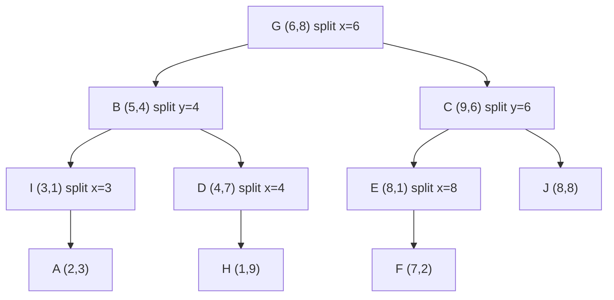

A rider opens the app in central Paris and the dispatcher must find the ten nearest available drivers among 500,000 in the region, while every driver reports a new position every four seconds. A scan computes 500,000 distances per request: measured in CPython 3.14 on 100,000 points, a brute-force nearest-neighbour query takes 8.6 ms, and a busy city issues thousands of such queries a second.

Spatial indexes solve it in two ways. **Space-partitioning trees** (quadtrees, k-d trees) and **data-partitioning trees** (R-trees) keep the geometry and prune whole regions that cannot contain an answer. **Cell systems** (geohash, S2, H3) turn a location into a cell ID so that an ordinary sorted set, B-tree or hash map does the storage, and a query becomes a handful of ID lookups.

## Why a one-dimensional index fails

Index drivers by latitude in a B-tree and ask for everyone within 500 m of a rider. The index returns a horizontal band 1 km tall across the whole region, and every row in it must then be filtered by longitude. With drivers spread uniformly over a 30 × 30 km area, the band holds 1/30 of them: 16,667 rows read to find about 556 inside the 1 × 1 km box. A composite index on `(lat, lng)` does no better: it sorts by latitude first, so the longitude condition only filters within the band.

## Quadtrees: split a square into four

A point-region (PR) quadtree covers a square. A leaf holds up to `CAPACITY` points; when one more arrives, the leaf splits into four equal quadrants (NW, NE, SW, SE) and pushes its points down. Density decides depth: a quiet suburb stays one big leaf, a busy station subdivides.

```python
class QuadTree:
    """Point-region quadtree over the square [x0, x0+size) x [y0, y0+size)."""
    CAPACITY, MAX_DEPTH = 2, 20

    def __init__(self, x0=0.0, y0=0.0, size=100.0, depth=0):
        self.x0, self.y0, self.size, self.depth = x0, y0, size, depth
        self.points = []            # (x, y, name) while this node is a leaf
        self.children = None        # [NW, NE, SW, SE] after a split

    def _child_for(self, x, y):
        half = self.size / 2
        east, north = x >= self.x0 + half, y >= self.y0 + half
        return self.children[(0 if north else 2) + (1 if east else 0)]

    def insert(self, x, y, name):
        if self.children is not None:
            return self._child_for(x, y).insert(x, y, name)
        self.points.append((x, y, name))
        if len(self.points) > self.CAPACITY and self.depth < self.MAX_DEPTH:
            half = self.size / 2
            self.children = [QuadTree(self.x0, self.y0 + half, half, self.depth + 1),          # NW
                             QuadTree(self.x0 + half, self.y0 + half, half, self.depth + 1),   # NE
                             QuadTree(self.x0, self.y0, half, self.depth + 1),                 # SW
                             QuadTree(self.x0 + half, self.y0, half, self.depth + 1)]          # SE
            for p in self.points:                   # push the points down one level
                self._child_for(p[0], p[1]).insert(*p)
            self.points = []

    def query(self, qx0, qy0, qx1, qy1, out):
        """Collect names of points inside the box [qx0, qx1] x [qy0, qy1]."""
        if qx1 < self.x0 or qx0 >= self.x0 + self.size or qy1 < self.y0 or qy0 >= self.y0 + self.size:
            return out                              # the box misses this square: prune it
        if self.children is None:
            out += [n for x, y, n in self.points if qx0 <= x <= qx1 and qy0 <= y <= qy1]
            return out
        for child in self.children:
            child.query(qx0, qy0, qx1, qy1, out)
        return out

qt = QuadTree()
for x, y, name in [(10, 80, "A"), (70, 70, "B"), (60, 20, "C"), (80, 90, "D"), (90, 60, "E")]:
    qt.insert(x, y, name)
print(qt.query(55, 55, 95, 95, []))                 # ['D', 'B', 'E']
```

Insert five points into `[0, 100)²` with capacity 2:

| insert | what happens | leaves afterwards |
|---|---|---|
| A (10, 80) | root leaf has room | root: A |
| B (70, 70) | root leaf has room | root: A, B |
| C (60, 20) | third point: **split the root** at (50, 50); A → NW, B → NE, C → SE | NW: A · NE: B · SW: – · SE: C |
| D (80, 90) | NE has room | NW: A · NE: B, D · SE: C |
| E (90, 60) | NE overflows: **split NE** at (75, 75); B → NE.SW `[50,75)²`, D → NE.NE, E → NE.SE | NW: A · NE.NE: D · NE.SW: B · NE.SE: E · SE: C |

The query for the box `[55, 95]²` prunes NW, SW and SE at the root because the box misses their squares, descends only into NE and checks its four children: 9 nodes examined, 3 points returned. The same shape is a trie over coordinates: each level consumes one bit of `x` and one bit of `y`, which is why a quadtree node's path from the root reads like a geohash prefix.

`MAX_DEPTH` is not decoration. Insert `(70.001, 70.001)` and `(70.002, 70.002)` next to B and the leaf must split until the three points separate: the tree reaches depth 14. Three copies of the same point never separate, and without a depth cap the insert recurses until the stack overflows; with it, the deepest leaf holds more than `CAPACITY` points, which is the correct outcome.

## k-d trees: split at the median, alternate the axis

A k-d tree is a [binary search tree](/learn/data-structures/trees/binary-search-trees) whose comparison key changes with depth: level 0 compares `x`, level 1 compares `y`, level 2 `x` again. Building from a static set, each node is the **median** along its axis, so the tree is balanced with depth `⌈log₂(n + 1)⌉`. Ten points:

`A(2,3) B(5,4) C(9,6) D(4,7) E(8,1) F(7,2) G(6,8) H(1,9) I(3,1) J(8,8)`

| step | points in this subtree | split on | sorted order | median (node) |
|---|---|---|---|---|
| root | all ten | `x` | H1 A2 I3 D4 B5 **G6** F7 E8 J8 C9 | G, `x = 6` |
| left of G | H A I D B | `y` | I1 A3 **B4** D7 H9 | B, `y = 4` |
| left of B | A I | `x` | A2 **I3** | I, `x = 3`; A below it |
| right of B | D H | `x` | H1 **D4** | D, `x = 4`; H below it |
| right of G | F E J C | `y` | E1 F2 **C6** J8 | C, `y = 6` |
| left of C | F E | `x` | F7 **E8** | E, `x = 8`; F below it |
| right of C | J | | | J |



Every node owns a rectangle: B's subtree is `x < 6`; D's is `x < 6, y ≥ 4`. Build is `O(n log n)` with a linear-time median selection, or `O(n log² n)` sorting at every level as the code below does. Inserting after the build is an ordinary BST insert and unbalances the tree; production k-d trees are rebuilt, not rebalanced, because a rotation would break the alternating-axis rule.

## Nearest-neighbour search with pruning, traced

Walk down to the leaf region that contains the query, keeping the best distance so far. On the way back up, at each node ask one question: **is the splitting line closer to the query than the best distance?** If not, no point on the other side can win, and the whole far subtree is skipped.

```python
import math

def build_kd(points, depth=0):
    """points: list of (x, y, name). Returns (point, axis, left, right) tuples or None."""
    if not points:
        return None
    axis = depth % 2                                   # 0 splits on x, 1 on y
    points = sorted(points, key=lambda p: p[axis])
    m = len(points) // 2                               # the median becomes this node
    return (points[m], axis,
            build_kd(points[:m], depth + 1),
            build_kd(points[m + 1:], depth + 1))

def nearest(node, q, best=None):
    """best = (distance, point); returns the closest point to q."""
    if node is None:
        return best
    point, axis, left, right = node
    d = math.dist(point[:2], q)
    if best is None or d < best[0]:
        best = (d, point)
    diff = q[axis] - point[axis]
    near, far = (left, right) if diff < 0 else (right, left)
    best = nearest(near, q, best)                      # search the side q is on first
    if abs(diff) < best[0]:                            # the splitting line is closer than the best:
        best = nearest(far, q, best)                   # the far side may hold something nearer
    return best

pts = [(2, 3, "A"), (5, 4, "B"), (9, 6, "C"), (4, 7, "D"), (8, 1, "E"),
       (7, 2, "F"), (6, 8, "G"), (1, 9, "H"), (3, 1, "I"), (8, 8, "J")]
print(nearest(build_kd(pts), (5.5, 7.5)))              # (0.707..., (6, 8, 'G'))
```

Query `q = (5.5, 7.5)`:

| step | at | distance to `q` | best after | decision |
|---|---|---|---|---|
| 1 | G (6,8) | 0.707 | G, 0.707 | `q.x = 5.5 < 6`: go left to B first |
| 2 | B (5,4) | 3.536 | G, 0.707 | `q.y = 7.5 ≥ 4`: go right to D first |
| 3 | D (4,7) | 1.581 | G, 0.707 | `q.x ≥ 4`: right child is empty |
| 4 | back at D | | | line `x = 4` is 1.5 away ≥ 0.707: **prune H** |
| 5 | back at B | | | line `y = 4` is 3.5 away ≥ 0.707: **prune I and A** |
| 6 | back at G | | | line `x = 6` is 0.5 away < 0.707: must search C's side |
| 7 | C (9,6) | 3.808 | G, 0.707 | `q.y = 7.5 ≥ 6`: go right to J |
| 8 | J (8,8) | 2.550 | G, 0.707 | leaf |
| 9 | back at C | | | line `y = 6` is 1.5 away ≥ 0.707: **prune E and F** |

Five distances computed instead of ten, and step 6 shows why the check cannot be skipped: G is already the answer, but only the geometry proves it, because a point 0.6 units across `x = 6` would have been closer.

```viz
{"type": "ml", "algorithm": "knn", "k": 1, "query": [5.5, 7.5],
 "points": [[2, 3, 0], [5, 4, 0], [4, 7, 0], [1, 9, 0], [3, 1, 0], [9, 6, 1], [8, 1, 1], [7, 2, 1], [6, 8, 1], [8, 8, 1]],
 "title": "The same ten points and query, by brute force",
 "caption": "Brute force measures all ten distances. Colours mark the two sides of the root split x = 6. The k-d tree trace reaches the same answer, G at 0.707, after five distance computations."}
```

Two limits matter in production. The worst case is `O(n)`, every splitting line close to the query, and in high dimension that becomes the typical case (see the interviewer follow-ups). And on raw latitude and longitude a k-d tree measures degrees, not metres, so project to metres first.

## R-trees: bounding rectangles that may overlap

Quadtrees and k-d trees partition *space*; every point belongs to exactly one region. Roads, parcels and delivery zones are shapes, not points, and a shape can straddle any split line. The R-tree (Guttman, 1984) partitions the *data* instead. It is a [B-tree](/learn/advanced-data-structures/balanced-trees/b-trees-and-b-plus-trees) for rectangles: every node holds between `m` and `M` entries, all leaves are at the same depth, and each entry stores a **minimum bounding rectangle (MBR)**, the smallest axis-aligned box around its child's contents. Sibling MBRs may overlap, and that is both the flexibility and the cost: a query descends into *every* child whose MBR intersects the query box, so overlap means several root-to-leaf paths.

Insertion descends from the root choosing, at each level, the child whose MBR needs the **least area enlargement** to include the new rectangle (ties go to the smaller MBR), appends it to the leaf, and enlarges the MBRs on the way back up. When a node exceeds `M` entries it splits, and the split heuristic decides how much the two halves overlap.

## The quadratic split, traced

Guttman's quadratic split with `M = 4`, `m = 2`. A leaf holds four rectangles and a fifth arrives; rectangles are `(x1, y1, x2, y2)`:

`R1 (0,0,2,2)`, `R2 (1,1,3,3)`, `R3 (8,7,10,9)`, `R4 (9,0,10,1)`, `R5 (2,8,3,10)`.

**PickSeeds.** For every pair, the waste is the area of their joint bounding box minus both areas; the pair that wastes the most would be the worst pair to keep together, so each seeds one group.

| pair | joint box area | minus areas | waste |
|---|---|---|---|
| R1, R2 | 9 | 4 + 4 | 1 |
| R1, R3 | 90 | 4 + 4 | **82** |
| R4, R5 | 80 | 1 + 2 | 77 |
| R2, R3 | 72 | 4 + 4 | 64 |
| (six other pairs) | | | 12–24 |

Group 1 starts as `{R1}` with MBR `(0,0,2,2)`, group 2 as `{R3}` with MBR `(8,7,10,9)`.

**PickNext.** For each remaining rectangle, `d1` and `d2` are the area enlargements each group's MBR would need to absorb it. Assign next the rectangle with the largest `|d1 − d2|`, the one with the strongest preference, to the group it enlarges less.

| round | candidates (`d1`, `d2`) | chosen | goes to | MBR 1 | MBR 2 |
|---|---|---|---|---|---|
| 1 | R2 (5, 68), R5 (26, 20), R4 (16, 14) | R2, difference 63 | group 1 | `(0,0,3,3)`, area 9 | `(8,7,10,9)`, area 4 |
| 2 | R4 (21, 14), R5 (21, 20) | R4, difference 7 | group 2 | `(0,0,3,3)`, area 9 | `(8,0,10,9)`, area 18 |
| 3 | R5 (21, 62) | R5 | group 1 | `(0,0,3,10)`, area 30 | `(8,0,10,9)`, area 18 |

The result is `{R1, R2, R5}` under `(0,0,3,10)` and `{R3, R4}` under `(8,0,10,9)`: two MBRs that do not overlap, so a query on either side of `x = 5` descends into one child only. If one group ever needs all the remaining rectangles to reach `m`, they are assigned to it without scoring. Pairwise seeding makes the split `O(M²)` per split, which is where the name comes from; the linear split picks seeds from the extreme sides in `O(M)` and produces more overlap.

Production R-trees add two refinements. The **R\*-tree** (Beckmann, Kriegel, Schneider and Seeger, 1990) chooses subtrees by overlap enlargement near the leaves, splits along the axis with the smallest total margin, and on the first overflow at each level removes and **reinserts** about 30% of the entries (Boost.Geometry's `rstar` defaults to `0.3 · M`), which tidies the tree as it grows. **Bulk loading** by Sort-Tile-Recursive sorts a static dataset by `x`, cuts it into vertical slices, sorts each slice by `y` and packs full leaves, giving nearly 100% fill and little overlap in one `O(n log n)` pass.

## Geohash: interleave the bits, then base-32

Geohash turns a location into a string by halving the longitude range and the latitude range alternately, writing 1 for "upper half" and 0 for "lower half", and packing every five bits into one character of the alphabet `0123456789bcdefghjkmnpqrstuvwxyz` (no `a`, `i`, `l` or `o`). Encode the Eiffel Tower, `48.8584° N, 2.2945° E`:

| bit | refines | range before | midpoint | value vs midpoint | bit |
|---|---|---|---|---|---|
| 1 | lng | [−180, 180) | 0 | 2.2945 ≥ 0 | 1 |
| 2 | lat | [−90, 90) | 0 | 48.8584 ≥ 0 | 1 |
| 3 | lng | [0, 180) | 90 | below | 0 |
| 4 | lat | [0, 90) | 45 | above | 1 |
| 5 | lng | [0, 90) | 45 | below | 0 |
| 6 | lat | [45, 90) | 67.5 | below | 0 |
| 7 | lng | [0, 45) | 22.5 | below | 0 |
| 8 | lat | [45, 67.5) | 56.25 | below | 0 |
| 9 | lng | [0, 22.5) | 11.25 | below | 0 |
| 10 | lat | [45, 56.25) | 50.625 | below | 0 |
| 11 | lng | [0, 11.25) | 5.625 | below | 0 |
| 12 | lat | [45, 50.625) | 47.8125 | above | 1 |
| 13 | lng | [0, 5.625) | 2.8125 | below | 0 |
| 14 | lat | [47.8125, 50.625) | 49.21875 | below | 0 |
| 15 | lng | [0, 2.8125) | 1.40625 | above | 1 |

Bits 1–5 are `11010` = 26 = `u`; bits 6–10 are `00000` = 0 = `0`; bits 11–15 are `01001` = 9 = `9`. Carrying on to 45 bits gives **`u09tunquc`**, a cell 4.8 m tall and 3.1 m wide at this latitude.

```python
BASE32 = "0123456789bcdefghjkmnpqrstuvwxyz"

def geohash_encode(lat, lng, precision):
    lat_lo, lat_hi, lng_lo, lng_hi = -90.0, 90.0, -180.0, 180.0
    chars, value, nbits, use_lng = [], 0, 0, True     # bit 1 refines longitude
    while len(chars) < precision:
        if use_lng:
            mid = (lng_lo + lng_hi) / 2
            bit = lng >= mid
            lng_lo, lng_hi = (mid, lng_hi) if bit else (lng_lo, mid)
        else:
            mid = (lat_lo + lat_hi) / 2
            bit = lat >= mid
            lat_lo, lat_hi = (mid, lat_hi) if bit else (lat_lo, mid)
        value, nbits, use_lng = (value << 1) | bit, nbits + 1, not use_lng
        if nbits == 5:                                 # five bits make one base-32 character
            chars.append(BASE32[value]); value, nbits = 0, 0
    return "".join(chars)

print(geohash_encode(48.8584, 2.2945, 9))              # u09tunquc
```

## Cell sizes and the Z-order curve

Each character adds five bits, alternately three for longitude and two for latitude or the reverse, so cells alternate between roughly square and 2:1. Heights are fixed; widths shrink with the cosine of the latitude:

| length | cell height | width at the equator | width at 48.9° N (Paris) |
|---|---|---|---|
| 5 | 4.9 km | 4.9 km | 3.2 km |
| 6 | 611 m | 1.2 km | 805 m |
| 7 | 153 m | 153 m | 101 m |
| 8 | 19 m | 38 m | 25 m |
| 9 | 4.8 m | 4.8 m | 3.1 m |

Interleaving is a **Z-order** (Morton) curve: sorting cells by geohash visits them in nested Z shapes. Its useful property is the prefix: every point inside cell `u09tun` has a geohash starting with `u09tun`, so "everything in this cell" is one range scan, `WHERE gh >= 'u09tun' AND gh < 'u09tuo'`, on any B-tree or sorted set, and shorter prefixes are coarser cells ([tries](/learn/data-structures/tries-and-string-structures/tries) store exactly this shape).

## Prefix queries and the edge of the cell

The converse does not hold: points that are close need not share a prefix. At precision 7 the Eiffel Tower's cell `u09tunq` ends 20 m east of the tower, and a point 29 m east, `(48.8584, 2.2949)`, is in `u09tunr`. Worse, at a boundary high in the hierarchy the shared prefix vanishes: `(51.4779, −0.0015)` and `(51.4779, 0.0015)`, 208 m apart on either side of the Greenwich meridian, encode as **`gcpuzgqb`** and **`u10hb530`**, which share no character at all, because the very first bit (longitude above or below 0) differs.

```viz
{"type": "trie", "algorithm": "prefix-autocomplete",
 "operations": [["insert", "u09tunq"], ["insert", "u09tunr"], ["insert", "u09tunm"], ["insert", "u09tunw"], ["insert", "u09tuq5"], ["insert", "gcpuzgq"], ["insert", "u10hb53"], ["prefix", "u09tun"]],
 "title": "Geohash cells as a trie: a prefix is a region",
 "caption": "u09tun collects four cells around the Eiffel Tower. gcpuzgq and u10hb53 are 208 m apart across the Greenwich meridian and share no prefix at all."}
```

A radius search therefore picks the precision whose cell is at least as large as the radius, then searches the cell containing the query **plus its 8 neighbours**. A circle of radius `r` around a point anywhere in the centre cell cannot leave the 3 × 3 block when the cell's shorter side is at least `r`, because the point is at least one full cell from the block's outer edge in every direction. For the tower at precision 7 the block is:

| | west | centre | east |
|---|---|---|---|
| north | `u09tunt` | `u09tunw` | `u09tunx` |
| centre | `u09tunm` | **`u09tunq`** | `u09tunr` |
| south | `u09tunj` | `u09tunn` | `u09tunp` |

Neighbours are found by decoding the cell's box, stepping one cell height or width from its centre and re-encoding, with longitude wrapped at ±180°. The block is nine range scans, and it over-reads: with square cells of side `r` the block's area is `9r²` against the circle's `πr²`, 2.9 times the candidates you keep, and at side `2r` it is 11.5 times. Whole characters make it worse, because one more character divides one side by 4 and the other by 8: a 160 m radius cannot use 153 m cells and falls back to 611 m × 1.2 km ones at the equator. Redis, below, steps one bit per axis instead, which keeps the cell side between `r` and `2r`.

## S2: a Hilbert curve on the faces of a cube

The Z-order curve jumps diagonally between quadrants, so cells consecutive in ID order can be far apart and a compact region can need many separate ranges. A **Hilbert curve** visits the cells so that consecutive cells always share an edge, and a compact region maps to fewer, longer ranges.

Google's S2 library projects the sphere onto the six faces of a cube and orders each face's cells along a Hilbert curve. A cell ID is a 64-bit integer: 3 bits of face, then 2 bits per level for up to 30 levels, then a single 1 bit that marks where the ID ends, so a parent's ID range contains all of its descendants. Level 13 cells average 1.27 km², level 16 about 20,000 m², and level 30 leaf cells 0.74 cm² (from the [S2 cell statistics table](https://s2geometry.io/resources/s2cell_statistics.html)).

A query region (a circle, a polygon) is approximated by a **covering**: `S2RegionCoverer` picks at most `max_cells` cells (8 by default) of mixed levels that together contain the region, big cells in the middle and small ones at the edges. Each cell is one contiguous ID range, so a radius search becomes up to eight range scans on any ordered store instead of geohash's nine fixed-size ones. CockroachDB's spatial indexes, a special kind of inverted (GIN) index, key their entries by S2 cell IDs this way.

## H3: hexagons, and why ride-sharing uses them

Uber's H3 (open-sourced in 2018) tiles an icosahedron-projected sphere with **hexagons** at 16 resolutions. Resolution 0 has 122 cells, 110 hexagons and exactly 12 pentagons (which exist at every resolution, at the icosahedron's vertices); each finer resolution has about seven times as many cells, down to 4.8 billion at resolution 9, where a hexagon averages 0.105 km². Hexagons do not subdivide exactly into seven children, so H3's hierarchy is approximate: a child can poke out of its parent.

A square grid has two kinds of neighbour: four sharing an edge at distance 1 and four sharing a corner at distance √2. A hexagon's six neighbours all share an edge and all sit at the same centre-to-centre distance. That is the main reason Uber gives for using H3 in pricing and dispatch:

- **Rings are nearly circles.** "Cells within `k` steps" (`grid_disk`) is a breadth-first search on the hexagon adjacency graph, `1 + 3k(k + 1)` cells: 7 for `k = 1`, 19 for `k = 2`.
- **Smoothing is even.** Surge pricing counts supply and demand per hexagon and blends each cell with its neighbours so prices do not jump at a boundary; with six equidistant neighbours the blend has no preferred direction.
- **Cells are comparable.** Hexagon areas at one resolution stay within about a factor of two ([H3's tables](https://h3geo.org/docs/core-library/restable): 0.064 to 0.127 km² at resolution 9), so "requests per cell per minute" compares across cells, which geohash's latitude-dependent widths do not allow.

```viz
{"type": "graph", "algorithm": "bfs", "directed": false, "start": "c", "nodes": [{"id": "b12", "x": 12, "y": 50}, {"id": "b11", "x": 21, "y": 66}, {"id": "b10", "x": 31, "y": 83}, {"id": "b1", "x": 21, "y": 34}, {"id": "a6", "x": 31, "y": 50}, {"id": "a5", "x": 40, "y": 66}, {"id": "b9", "x": 50, "y": 83}, {"id": "b2", "x": 31, "y": 17}, {"id": "a1", "x": 40, "y": 34}, {"id": "c", "x": 50, "y": 50}, {"id": "a4", "x": 60, "y": 66}, {"id": "b8", "x": 69, "y": 83}, {"id": "b3", "x": 50, "y": 17}, {"id": "a2", "x": 60, "y": 34}, {"id": "a3", "x": 69, "y": 50}, {"id": "b7", "x": 79, "y": 66}, {"id": "b4", "x": 69, "y": 17}, {"id": "b5", "x": 79, "y": 34}, {"id": "b6", "x": 88, "y": 50}], "edges": [{"from": "b12", "to": "b11"}, {"from": "b12", "to": "b1"}, {"from": "b12", "to": "a6"}, {"from": "b11", "to": "b10"}, {"from": "b11", "to": "a6"}, {"from": "b11", "to": "a5"}, {"from": "b10", "to": "a5"}, {"from": "b10", "to": "b9"}, {"from": "b1", "to": "a6"}, {"from": "b1", "to": "b2"}, {"from": "b1", "to": "a1"}, {"from": "a6", "to": "a5"}, {"from": "a6", "to": "a1"}, {"from": "a6", "to": "c"}, {"from": "a5", "to": "b9"}, {"from": "a5", "to": "c"}, {"from": "a5", "to": "a4"}, {"from": "b9", "to": "a4"}, {"from": "b9", "to": "b8"}, {"from": "b2", "to": "a1"}, {"from": "b2", "to": "b3"}, {"from": "a1", "to": "c"}, {"from": "a1", "to": "b3"}, {"from": "a1", "to": "a2"}, {"from": "c", "to": "a4"}, {"from": "c", "to": "a2"}, {"from": "c", "to": "a3"}, {"from": "a4", "to": "b8"}, {"from": "a4", "to": "a3"}, {"from": "a4", "to": "b7"}, {"from": "b8", "to": "b7"}, {"from": "b3", "to": "a2"}, {"from": "b3", "to": "b4"}, {"from": "a2", "to": "a3"}, {"from": "a2", "to": "b4"}, {"from": "a2", "to": "b5"}, {"from": "a3", "to": "b7"}, {"from": "a3", "to": "b5"}, {"from": "a3", "to": "b6"}, {"from": "b7", "to": "b6"}, {"from": "b4", "to": "b5"}, {"from": "b5", "to": "b6"}],
 "title": "A k-ring is a breadth-first search over hexagons",
 "caption": "Start at hexagon c. Depth 1 reaches its six neighbours a1–a6; depth 2 reaches the twelve cells b1–b12. grid_disk(2) is these 19 cells, a near-circle of radius two cells."}
```

The [ride-sharing case study](/learn/system-design/case-studies/ride-sharing) builds the dispatch index on exactly this: a dictionary from resolution-9 cell to the drivers in it, updated when a driver crosses a cell boundary, and queried ring by ring.

## Under the hood: Redis GEO

Redis has no spatial tree. `GEOADD key longitude latitude member` stores the member in an ordinary [sorted set](/learn/advanced-data-structures/balanced-trees/treaps-skip-lists-and-splay) whose score is a **52-bit interleaved geohash**: 26 bits of longitude and 26 of latitude, which a `double` holds exactly because its mantissa has 53 bits. Latitude is limited to ±85.05112878°, the Web Mercator bounds. At the equator the finest cell is 5.4 × 10⁻⁶° of longitude by 2.5 × 10⁻⁶° of latitude, about 0.60 m by 0.28 m.

`GEOSEARCH key FROMLONLAT lng lat BYRADIUS 500 m ASC COUNT 10` (Redis 6.2+, replacing `GEORADIUS`) runs the cell-plus-neighbours algorithm at bit granularity:

1. Estimate a **step** (bits per axis, at most 26) so that one cell is at least as large as the radius, lowering it near the poles where cells narrow.
2. Compute the query's cell at that step and its 8 neighbours, and drop neighbours the search box cannot reach.
3. Shift each cell's hash left by `52 − 2 × step` bits: the cell becomes a score interval `[h, h + 2^(52 − 2·step))`, and each interval is one ordered range scan in the skip list, `O(log M + N)`.
4. Compute the exact great-circle distance for every candidate, discard those outside the radius, sort and truncate.

Its cost is set by how many members fall in those (at most nine) cells. `GEOHASH` re-encodes the score as the standard 11-character string.

## Under the hood: PostGIS and GiST

PostGIS indexes geometry with `CREATE INDEX ON places USING GIST (geom)`. GiST (Generalized Search Tree) is PostgreSQL's framework for balanced trees whose keys are predicates; an operator class supplies `consistent` (can this subtree match the query?), `union`, `penalty` (the cost of inserting here) and `picksplit`. PostGIS's 2D class stores a bounding box per entry and uses area enlargement as the penalty, so a GiST geometry index is an R-tree on disk pages.

The index is lossy by design: it knows boxes, not shapes. `WHERE ST_DWithin(geom, :point, 500)` or `ST_Intersects` expands into an index test on bounding boxes (`&&`) followed by a **recheck** of the exact geometry on each candidate row: filter, then refine. Nearest-neighbour queries use GiST's ordered scan: `ORDER BY geom <-> :point LIMIT 10` walks the tree best-first by distance and stops after ten rows instead of sorting the table (index-assisted since PostGIS 2.0; exact distances on recheck since 2.2 with PostgreSQL 9.5). PostgreSQL's SP-GiST offers the space-partitioning alternatives for its built-in `point` type, a quadtree (`quad_point_ops`) and a k-d tree (`kd_point_ops`).

## Range and k-nearest queries: what they cost

| structure | range query (box or radius) | k nearest | update a moving point |
|---|---|---|---|
| Brute force | `O(n)` | `O(n)`, or `O(n log k)` with a heap | `O(1)` |
| Quadtree | depth × boundary cells + `k` results; depth grows with density, not only `n` | best-first over squares | delete and reinsert, `O(depth)` |
| k-d tree (static, balanced) | `O(√n + k)` in 2D, worst case | about `O(log n)` expected in low dimension, `O(n)` worst | rebuild; inserts unbalance it |
| R-tree | depends on MBR overlap; `O(log n)` paths when overlap is low | best-first by MBR distance | `O(log n)` with splits |
| Geohash / Redis GEO | 9 range scans + exact filter; 2.9–11.5 × over-read | expand the radius and repeat | `O(log n)` re-score per report (any move over about 0.6 m changes the score) |
| H3 or S2 cells in a hash map | `grid_disk` or covering cells + filter | ring by ring until `k` found | `O(1)` move between cell buckets |

Measured on one core of a Ryzen 9 9950X3D with CPython 3.14, 100,000 points spread uniformly over a 30 × 30 km square, 2,000 random queries for the single nearest point:

| method | time per query | notes |
|---|---|---|
| scan with `min()` | 8.6 ms | 100,000 distance computations |
| k-d tree from this lesson | 4.8 µs | 23 nodes visited on average; build 0.17 s |
| 250 m grid cells in a `dict`, 3 × 3 block, widened until proven | 11.1 µs | about 7 points per cell; the same answers as the k-d tree |

The grid loses to the k-d tree on a static set and wins the moment drivers move: an update is a dictionary delete and insert when the cell changes and nothing otherwise, and at 10 m/s a driver crosses a resolution-9 hexagon (about 350–400 m across) in 35–40 seconds, so about one 4-second report in nine changes cell. Cheap updates for slightly dearer queries is why dispatch indexes moving vehicles with cells and keeps trees for static geometry such as roads, parcels and zones.

## Trade-offs

| | Quadtree | k-d tree | R-tree (PostGIS GiST) | Geohash (Redis GEO) | S2 | H3 |
|---|---|---|---|---|---|---|
| Stores | points | points | rectangles and shapes | points | points, regions | points, regions |
| Adapts to density | yes, by splitting | yes, by medians | yes, by splits | no, fixed cells | covering picks levels | no, fixed resolution |
| Neighbour cells | 4 edge + 4 corner | n/a | n/a | 8, uneven sizes | 8, near-uniform | 6, equidistant |
| Needs a special engine | yes | yes | yes (GiST) | no: any sorted set or B-tree | no: any ordered store | no: any hash map |
| Distortion | projection-dependent | projection-dependent | projection-dependent | width shrinks with `cos(lat)` | low (cube faces) | low (icosahedron) |

## Failure modes

| Symptom | Diagnosis | Fix |
|---|---|---|
| Stores in Paris show up in the Indian Ocean east of Somalia | Latitude and longitude swapped: Redis `GEOADD`, GeoJSON and PostGIS `ST_MakePoint` take longitude first | Name the fields (`lat=`, `lng=`) at every boundary; assert latitude within ±90 and a bounding box for your market |
| "Nearest driver" misses a driver 30 m away while offering one 400 m away | Prefix or single-cell search: the close driver is in the neighbouring cell | Search the cell plus its 8 neighbours (or an H3 ring), then filter by exact distance |
| One shard of a geo-sharded store is at 100% CPU during events | Sharding by a coarse cell puts a stadium or an airport on one node | Split hot cells to a finer level, or shard by a covering of fine cells (S2) rather than one coarse cell |
| Insert throughput collapses and recursion errors appear on a quadtree | Many identical or near-identical points force endless splits (the quadtree section's depth-14 case) | A maximum depth or a minimum cell size, and leaves that may exceed capacity |
| Radius searches at high latitude return too few results, or scan far too many | Cell width shrinks with `cos(latitude)`: a precision chosen at the equator is 2× too narrow at 60° | Choose precision from the radius and the latitude, or use S2/H3, whose cells vary far less |
| Nearest results are wrong east–west but right north–south | Euclidean distance on raw degrees; a degree of longitude is 73 km at 49° N against 111 km for latitude | Project to metres (or use haversine) before comparing distances |
| PostGIS radius query does a sequential scan | `ST_Distance(geom, p) < 500` cannot use an index; also `geography` versus `geometry` units (metres versus degrees) mixed | `ST_DWithin`, which adds the indexable bounding-box test; check units and the plan with `EXPLAIN` |

## Interviewer follow-ups

**"Design 'find the nearest 10 drivers' for 500,000 drivers updating every 4 seconds."** Model answer: 125,000 updates per second rule out rebuilding trees; key drivers by H3 or geohash cell in memory, move a driver only when its cell changes, search widening rings until ten candidates lie within the proven radius, filter by exact or road distance, and shard by coarse cell, splitting hot cells. Common wrong answer: a k-d tree over all drivers, which must be rebuilt as they move.

**"When would you choose an R-tree over cells?"** Model answer: for shapes (roads, parcels, delivery zones) that straddle cell boundaries under "which polygons intersect?" queries; an R-tree stores each shape's box once and rechecks exact geometry, while cells duplicate the shape into every cell it touches. Common wrong answer: "R-trees are always faster", which ignores update cost and overlap.

**"Why does a k-d tree stop helping for 768-dimensional embeddings?"** Model answer: in `d` dimensions the query ball crosses more splitting hyperplanes, and beyond roughly 10–20 dimensions it crosses almost all of them, so pruning fails and the search visits most nodes; embeddings use approximate graph indexes such as HNSW, or quantisation ([vector databases](/learn/databases/nosql-and-specialised/graph-time-series-and-vector-databases)). Common wrong answer: "use a deeper tree".

**"Why does Uber's H3 use hexagons?"** Model answer: equidistant, edge-sharing neighbours give near-circular k-rings and direction-free smoothing, and areas stay within about 2×; the costs are an approximate hierarchy and 12 pentagons per resolution. Common wrong answer: "hexagons nest perfectly", which they do not.

## What mid-level engineers get wrong

- **Indexing latitude and longitude separately** for a radius query.
- **Trusting a shared geohash prefix as a proximity test**, or lengthening it "for precision", which shrinks cells and multiplies edge misses.
- **Measuring distance in raw degrees**, or **swapping latitude and longitude** at an API boundary.
- **Choosing a tree for moving objects**, then rebuilding it per position update.
- **Forgetting the refine step**: the index returns candidates, not answers.

## Exercises

```exercise
id: geohash-encode
title: Encode a latitude and longitude as a geohash
prompt: |
  Return the geohash of (`lat`, `lng`) with `precision` characters.

  Start with the ranges [-90, 90] for latitude and [-180, 180] for
  longitude. Produce bits one at a time, alternating, starting with
  longitude: compare the value with the midpoint of its current range,
  emit 1 and keep the upper half if the value is greater than or equal to
  the midpoint, otherwise emit 0 and keep the lower half. Every 5 bits,
  most significant first, make one character of the alphabet
  `0123456789bcdefghjkmnpqrstuvwxyz`.
languages: [python, javascript]
entry: geohash_encode
starter:
  python: |
    BASE32 = "0123456789bcdefghjkmnpqrstuvwxyz"

    def geohash_encode(lat, lng, precision):
        # alternate bits, longitude first; 5 bits per character
        return ""
  javascript: |
    const BASE32 = "0123456789bcdefghjkmnpqrstuvwxyz";

    function geohash_encode(lat, lng, precision) {
      // alternate bits, longitude first; 5 bits per character
      return "";
    }
tests:
  - args: [48.8584, 2.2945, 9]
    expected: "u09tunquc"
    label: the Eiffel Tower, as traced in the lesson
  - args: [48.8584, 2.2945, 1]
    expected: "u"
    label: one character
  - args: [51.4779, -0.0015, 8]
    expected: "gcpuzgqb"
    label: west of the Greenwich meridian
  - args: [51.4779, 0.0015, 8]
    expected: "u10hb530"
    label: 208 m east, no shared prefix
  - args: [0, 0, 5]
    expected: "s0000"
    label: midpoints go to the upper half
  - args: [37.7749, -122.4194, 7]
    expected: "9q8yyk8"
    hidden: true
  - args: [-33.8568, 151.2153, 7]
    expected: "r3gx2ux"
    hidden: true
    label: southern and eastern hemispheres
  - args: [-90, -180, 3]
    expected: "000"
    hidden: true
    label: the south-west corner of the world
hints:
  - "Keep lo and hi for each axis and a flag saying which axis the next bit refines."
  - "Accumulate bits into an integer: value = value * 2 + bit; after 5 bits append BASE32[value] and reset."
  - "Use >= for the comparison so a value exactly on the midpoint goes to the upper half."
```

```exercise
id: kd-tree-nearest
title: Nearest neighbour with a k-d tree
prompt: |
  `points` is a non-empty list of distinct `[x, y]` integer points and
  `query` is `[x, y]`. Return the point of `points` closest to `query`
  (Euclidean distance); the tests never contain ties.

  Build a 2-d tree by median split, alternating x and y by depth, then
  search it: descend to the side of each splitting line that contains the
  query, and on the way back visit the other side only if the splitting
  line is closer to the query than the best distance found so far. A scan
  passes the tests but is not the point of the exercise.
languages: [python, javascript]
entry: kd_nearest
starter:
  python: |
    def kd_nearest(points, query):
        # 1. build: sort by axis = depth % 2, median is the node
        # 2. search: near side first; far side only if (query[axis] - split)^2 < best
        return points[0]
  javascript: |
    function kd_nearest(points, query) {
      // 1. build: sort by axis = depth % 2, median is the node
      // 2. search: near side first; far side only if (query[axis] - split)^2 < best
      return points[0];
    }
tests:
  - args: [[[2,3],[5,4],[9,6],[4,7],[8,1],[7,2],[6,8],[1,9],[3,1],[8,8]], [5.5, 7.5]]
    expected: [6, 8]
    label: the lesson's trace
  - args: [[[2,3],[5,4],[9,6],[4,7],[8,1],[7,2],[6,8],[1,9],[3,1],[8,8]], [4.5, 4.5]]
    expected: [5, 4]
  - args: [[[2,3],[5,4],[9,6],[4,7],[8,1],[7,2],[6,8],[1,9],[3,1],[8,8]], [0, 0]]
    expected: [3, 1]
    label: query outside the points' bounding box
  - args: [[[7, -3]], [100, 100]]
    expected: [7, -3]
    label: single point
  - args: [[[2,3],[5,4],[9,6],[4,7],[8,1],[7,2],[6,8],[1,9],[3,1],[8,8]], [9.5, 2.5]]
    expected: [8, 1]
    hidden: true
  - args: [[[-18,-9],[-25,-20],[-26,-36],[-13,10],[21,28],[-20,-32],[21,30],[34,14],[-50,-15],[-47,13],[-28,-26],[14,-1],[-27,-8],[-9,-35],[-39,20],[49,-17],[18,10],[-24,-22],[-26,-41],[-40,-25]], [10.5, -3.25]]
    expected: [14, -1]
    hidden: true
    label: twenty points with negative coordinates
  - args: [[[-18,-9],[-25,-20],[-26,-36],[-13,10],[21,28],[-20,-32],[21,30],[34,14],[-50,-15],[-47,13],[-28,-26],[14,-1],[-27,-8],[-9,-35],[-39,20],[49,-17],[18,10],[-24,-22],[-26,-41],[-40,-25]], [-40.5, 44.75]]
    expected: [-39, 20]
    hidden: true
    label: the answer is far from the query
hints:
  - "Represent a node as (point, axis, left, right); axis = depth % 2 and the median of the sorted list is the node."
  - "Compare squared distances to avoid square roots: visit the far side only if (query[axis] - point[axis])**2 < best."
  - "Search the near side before the far side, so the best distance is as small as possible when you test the far side."
```

## Senior signals

- You explain why a B-tree on latitude fails a radius query and name the two families: trees that prune regions, cells that linearise space.
- You can trace a quadtree split, a k-d tree search with its splitting-line test, and an R-tree quadratic split.
- You encode a geohash by hand, know that a shared prefix implies proximity but not the reverse, and search the 3 × 3 block before an exact refine.
- You know what Redis GEO stores (a 52-bit interleaved score in a sorted set) and what PostGIS stores (GiST boxes, recheck, `<->` ordered scans).
- You pick cells for moving objects and trees for static shapes, and check units and axis order at every boundary.

## Check yourself

```quiz
- q: >-
    A k-d tree search for the nearest point is back at a node that splits on x = 6. The query is (5.5, 7.5) and the best distance so far is 0.707. What must happen?
  options: ["Search the far side, since the line x = 6 is only 0.5 away", "Skip the far side, since the current best lies on the near side", "Search the far side only if it holds more points than the near side", "Skip the far side, since the near side was searched to a leaf"]
  answer: 0
  explanation: >-
    The splitting line is 0.5 from the query, less than the best distance 0.707, so a point on the other side of the line could be closer; the far subtree must be searched. Where the best point lies is irrelevant, and subtree sizes play no part in the pruning test.
- q: >-
    Two points 208 m apart near London have geohashes gcpuzgqb and u10hb530. What does this show?
  options: ["The encoding is wrong: points this close must share a prefix", "Geohash loses accuracy at high latitudes, so switch to S2", "Close points can share no prefix; search the neighbouring cells", "Precision 8 is too coarse to separate points only 208 m apart"]
  answer: 2
  explanation: >-
    The points sit either side of the Greenwich meridian, so the very first longitude bit differs and nothing after it can be shared. Prefix sharing implies proximity, but proximity does not imply a shared prefix, which is why radius searches use the cell plus its neighbours and an exact-distance filter.
- q: >-
    In Guttman's quadratic split, which two rectangles become the seeds of the two groups?
  options: ["The two with the largest areas, so each group starts big", "The first two entries in the node's current order", "The pair whose centres are the closest of all the pairs", "The pair whose joint bounding box wastes the most area"]
  answer: 3
  explanation: >-
    PickSeeds computes, for every pair, the area of their joint box minus both areas; the pair that would waste the most if kept together is split apart. In the trace R1 and R3 wasted 82 and seeded the groups, and the result had no overlap. Largest-area or closest-centre choices are not the rule.
- q: >-
    How does Redis GEO store a member added with GEOADD?
  options: ["As a node in an R-tree maintained beside the keyspace", "As two sorted sets, one scored by latitude and one by longitude", "As an 11-character geohash string stored in a hash field", "As a sorted-set member scored by a 52-bit interleaved geohash"]
  answer: 3
  explanation: >-
    The score interleaves 26 bits of longitude and 26 of latitude, which a double represents exactly. A radius search turns the query cell and its neighbours into score ranges and filters candidates by exact distance. The 11-character string is what the GEOHASH command computes on demand.
- q: >-
    Why do ride-sharing systems prefer H3 hexagons to square cells for dispatch and surge pricing?
  options: ["Hexagons tile the sphere with no pentagons and no distortion at all", "Hexagons nest exactly, so parent cells are sums of their children", "All six neighbours are equidistant, so rings are near-circular", "Hexagon IDs follow a Hilbert curve, so every ring is one range scan"]
  answer: 2
  explanation: >-
    Each neighbour shares an edge at the same centre distance, so k-rings grow evenly in every direction and smoothing across neighbours has no directional bias. H3's hierarchy is approximate, every resolution has 12 pentagons, and Hilbert ordering is S2's property.
- q: >-
    500,000 drivers report positions every 4 seconds. Which index fits the driver locations best?
  options: ["A geohash prefix index queried with the rider's own cell only", "A k-d tree over all drivers, rebuilt after each batch of updates", "A PostGIS GiST index updated in place on every position report", "Cells in memory, moving a driver only when its cell changes"]
  answer: 3
  explanation: >-
    125,000 updates per second favour cells: most updates stay inside the same cell and cost nothing, and a crossing is a delete and an insert. A k-d tree must be rebuilt as points move; per-update disk index maintenance is expensive at this rate; and a query on one cell misses drivers across its edge.
```
