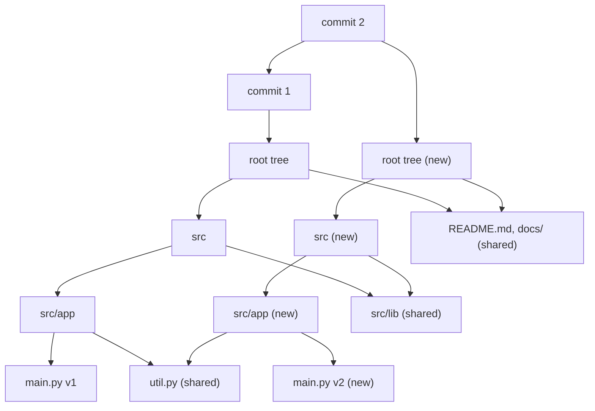

An editor keeps undo history for a document of a million elements; a Redux store keeps every state so a developer can step back through time; a database hands a long analytics query a snapshot while writes continue. The obvious implementation copies the structure for each version. Measured on CPython 3.14, copying a list of 2²⁰ integers takes 2.2 ms and 8.4 MB, so a thousand versions cost 8.4 GB.

A **persistent** structure keeps every previous version readable after an update without copying it. An update creates only the nodes that differ and shares everything else with the version it came from. On the same million-element sequence, a 32-way persistent vector makes a new version in 1.6 µs and 1.4 KB, and a thousand versions fit in 1.4 MB. This lesson traces exactly which nodes are new and which are shared, then follows the idea through hash array mapped tries, the collections of Clojure, Scala and Immutable.js, Git's object store, and copy-on-write databases.

## Ephemeral, persistent, immutable

An **ephemeral** structure (a Python `list`, a Java `HashMap`) is changed in place: after an update the old version is gone. A **persistent** one keeps old versions. There are degrees:

- **partially persistent**: every version can be read, only the newest can be updated (undo history, database snapshots);
- **fully persistent**: any version can be updated, creating a branch (editor branches, Git);
- **confluently persistent**: two versions can be merged into a new one (Git merges, CRDT documents).

**Immutable** is the implementation discipline that makes persistence safe: a node, once published, is never written again. Immutability alone is not persistence done well. A Python `tuple` is immutable, but `t + (x,)` copies all of `t`: 3.1 ms for a million elements, measured. Persistence is immutability plus **structural sharing**, so that an update costs what changed, not the size of the whole.

## Path copying on a BST, traced

Take the perfect binary search tree of the keys 1–15 (version 1) and insert 16. Walk the search path from the root, and instead of changing a node on the path, allocate a copy that points to the new child and to the old, untouched other child.

```viz
{"type": "tree", "algorithm": "bst-insert", "values": [8, 4, 12, 2, 6, 10, 14, 1, 3, 5, 7, 9, 11, 13, 15, 16],
 "title": "The path an insert walks is the path it copies",
 "caption": "Inserting 16 walks 8, 12, 14, 15. Path copying allocates new versions of exactly those four nodes plus the new leaf; every other node is shared with the old version."}
```

| node on the path | version 1 node | version 2 node | its left child in version 2 | its right child in version 2 |
|---|---|---|---|---|
| 8 (root) | `8` | new `8′` | `4`, shared (7-node subtree) | `12′` |
| 12 | `12` | new `12′` | `10`, shared (3-node subtree) | `14′` |
| 14 | `14` | new `14′` | `13`, shared | `15′` |
| 15 | `15` | new `15′` | none | `16`, new |

Version 2 reaches 16 nodes: 5 new (`8′`, `12′`, `14′`, `15′`, `16`) and 11 shared with version 1 (the subtrees under 4, 10 and 13). Both roots stay valid: searching version 1 from `8` never meets 16, searching version 2 from `8′` finds it. Memory for both versions is 20 nodes instead of 31 for two full copies.

Now insert 0 into **version 1** (not 2): the path is 8, 4, 2, 1, so `8″`, `4″`, `2″`, `1″` and the leaf `0` are new, and the 12-subtree (7 nodes), the 6-subtree (3) and node 3 are shared. Version 3 is a sibling of version 2, not a descendant: that is full persistence, and it costs the same five nodes.

```python
class Node:
    __slots__ = ("key", "left", "right")          # never written after construction
    def __init__(self, key, left=None, right=None):
        self.key, self.left, self.right = key, left, right

def insert(node, key):
    """Return the root of a new version; the old root stays valid."""
    if node is None:
        return Node(key)
    if key == node.key:
        return node                                # nothing changes: share the whole subtree
    if key < node.key:
        return Node(node.key, insert(node.left, key), node.right)   # copy, reuse right
    return Node(node.key, node.left, insert(node.right, key))       # copy, reuse left

def nodes(root):
    return set() if root is None else {id(root)} | nodes(root.left) | nodes(root.right)

v1 = None
for k in [8, 4, 12, 2, 6, 10, 14, 1, 3, 5, 7, 9, 11, 13, 15]:
    v1 = insert(v1, k)
v2 = insert(v1, 16)
v3 = insert(v1, 0)
print(len(nodes(v2) - nodes(v1)), len(nodes(v2) & nodes(v1)))   # 5 11
print(len(nodes(v3) - nodes(v1)), len(nodes(v2) & nodes(v3)))   # 5 8
```

The last line shows the three versions sharing among themselves: versions 2 and 3 have eight nodes in common (the subtrees under 6 and 10, and the leaves 3 and 13), all inherited from version 1.

## Balance survives, sortedness does not

Path copying costs one node per level, so the tree must stay shallow. A balanced tree keeps it `O(log n)`: the rotations and recolourings of a [red-black](/learn/advanced-data-structures/balanced-trees/red-black-trees) or [AVL](/learn/advanced-data-structures/balanced-trees/avl-trees) insert touch only nodes on or next to the search path, so they are copied too, still `O(log n)` per update. Clojure's `sorted-map` and Scala's `TreeMap` are persistent red-black trees; Haskell's `Data.Map` is a persistent weight-balanced tree.

An unbalanced persistent BST fed sorted keys degenerates into a chain, and every insert copies the whole chain: inserting 1 to 5 in order allocates 1, 2, 3, 4 and 5 nodes, `n²/2` in total, and all versions stay alive. Measured on CPython 3.14, one insert into a balanced persistent BST of 2²⁰ keys allocates 21 nodes of 56 bytes, 1,185 bytes per version, and takes 17.8 µs.

## Fat nodes and node copying

Path copying pays `O(log n)` new nodes per update. **Fat nodes** (Driscoll, Sarnak, Sleator and Tarjan, 1989) pay `O(1)` space instead: nothing is copied, and every field keeps a list of `(version, value)` modifications. Reading a field at version `v` finds the last modification with a version at most `v`.

| operation | fat-node record written | nodes allocated |
|---|---|---|
| v2: insert 16 under 15 | node 15, field `right`: `[(v2, → 16)]` | 1 (the leaf 16) |
| v3: insert 17 under 16 | node 16, field `right`: `[(v3, → 17)]` | 1 |
| v4: delete 16 | node 15, field `right`: `[(v2, → 16), (v4, → 17)]` | 0 |
| read node 15's `right` at v3 | last record with version ≤ 3 is `(v2, → 16)` | |

The price moves to reads: a field with `m` modifications needs a binary search, so every pointer dereference costs `O(log m)` and a search costs `O(log n · log m)`. **Node copying**, from the same paper, bounds that: each node carries a fixed number of spare modification slots (one is enough when every node has at most one incoming pointer, as in a tree). The first change to a node fills its slot; the next change copies the node with its current fields and records the copy in its parent's slot, which may in turn copy the parent. Every node copy is paid for by the slots it consumed, so the amortised cost is `O(1)` space and time per change for partial persistence, and reads cost `O(1)` per pointer. It is how the textbook proofs get `O(1)` overhead. Both techniques also reach full persistence in the [same paper](https://www.cs.cmu.edu/~sleator/papers/making-data-structures-persistent.pdf): versions then form a tree rather than a line, so the paper keeps them in a totally ordered version list that makes "the last modification at or before `v`" meaningful again, fat nodes keep `O(1)` space and `O(log m)` access, and a variant of node copying called node splitting keeps `O(1)` amortised. Production libraries use path copying anyway, because it needs no version numbers in the nodes and makes every node immutable.

## Persistent vectors: a 32-way trie over the index

Clojure's `PersistentVector` (Rich Hickey, 2007) stores a sequence as a trie with 32 children per node. The index itself is the path: each level consumes 5 bits, most significant first. In a vector of 2²⁰ elements the tree has four levels, and element 777,777 is found at slots 23, 23, 17, 17 (`777,777 = 23·32³ + 23·32² + 17·32 + 17`). An update copies one 32-slot array per level.

```python
BITS, MASK = 5, 31

class PVector:
    """A persistent vector: a 32-way trie of Python lists; set() copies one node per level."""
    __slots__ = ("root", "shift")
    def __init__(self, root, shift):
        self.root, self.shift = root, shift

    @classmethod
    def from_list(cls, items):
        level, shift = [items[i:i + 32] for i in range(0, len(items), 32)], 0
        while len(level) > 1:
            level, shift = [level[i:i + 32] for i in range(0, len(level), 32)], shift + BITS
        return cls(level[0], shift)

    def get(self, i):
        node, shift = self.root, self.shift
        while shift > 0:
            node = node[(i >> shift) & MASK]        # 5 bits of the index choose the child
            shift -= BITS
        return node[i & MASK]

    def set(self, i, value):
        def copy_path(node, shift):
            node = node[:]                           # copy this node: 32 references
            if shift == 0:
                node[i & MASK] = value
            else:
                j = (i >> shift) & MASK
                node[j] = copy_path(node[j], shift - BITS)
            return node
        return PVector(copy_path(self.root, self.shift), self.shift)

v1 = PVector.from_list(list(range(1 << 20)))
v2 = v1.set(777_777, -1)
print(v1.get(777_777), v2.get(777_777), v1.root[0] is v2.root[0])   # 777777 -1 True
```

`v2` owns four new arrays (the root and the nodes reached through slots 23, 23 and 17) and shares the other 33,821 of the tree's 33,825 nodes with `v1`. Measured on CPython 3.14: `set` takes 1.6 µs and allocates about 1,370 bytes per version (four 312-byte lists plus the version object), `get` takes 0.28 µs, and a full list copy takes 2.2 ms and 8.4 MB. The real Clojure vector adds a **tail**: the last up-to-32 elements live in a separate array, so 31 of every 32 appends touch only the tail, and the 32nd pushes the full tail into the tree. **Transients** go the other way for batch work: `(transient v)` lets one thread at a time mutate nodes the transient created itself (Clojure 1.7 dropped the check that it be the creating thread, to suit pooled threads such as `core.async` go blocks), and `persistent!` seals the result, turning a million-element build into in-place writes.

## HAMTs: a 32-way trie over the hash

A hash array mapped trie (Bagwell, 2001) does the same for maps, as a [trie](/learn/data-structures/tries-and-string-structures/tries) over hash bits instead of characters: hash the key to 32 bits and use 5 bits per level as the child index, least significant first. A node with all 32 slots would waste memory in a sparse map, so each node stores a 32-bit **bitmap** of occupied slots and a compact array of only the occupied ones. The array position of slot `c` is the number of occupied slots below it:

`present = bitmap & (1 << c)`, `index = popcount(bitmap & ((1 << c) − 1))`

`popcount` is one instruction on x86-64 (`POPCNT`), a vector `CNT` plus a horizontal add on baseline ARM64, and a scalar `CNT` on cores with Armv8.9's CSSC extension; `Integer.bitCount` on the JVM compiles to it, and Python has `int.bit_count()` since 3.10. Trace a root holding four keys, with 32-bit FNV-1a hashes:

| key | FNV-1a | level-0 chunk (`h & 31`) | level-1 chunk |
|---|---|---|---|
| `principal` | `0xcfa1ba29` | 9 | 17 |
| `staff` | `0x675ca4d1` | 17 | 6 |
| `senior` | `0xd6e12155` | 21 | 10 |
| `ascend` | `0x2b696a57` | 23 | 18 |
| `netflix` | `0xe9487c6b` | 11 | 3 |

| step | slot | bit set? | occupied slots below | array index | result |
|---|---|---|---|---|---|
| version 1 root | | | | | bitmap `{9, 17, 21, 23}` = 10,617,344; array `[principal, staff, senior, ascend]` |
| get `senior` | 21 | yes | 9, 17 | 2 | `senior` |
| set `netflix` | 11 | no | 9 | 1 | new node: bitmap 10,619,392, array `[principal, netflix, staff, senior, ascend]` |
| get `senior` in version 2 | 21 | yes | 9, 11, 17 | **3** | `senior`: its index shifted because slot 11 filled |
| get `netflix` in version 1 | 11 | no | | | absent: version 1's node was copied, not changed |

When two keys land in the same slot, the slot holds a child node and both move one level down, where the next 5 bits usually separate them; keys whose 32-bit hashes collide entirely end in a small collision list. With `n` keys the trie is about `log₃₂ n` levels deep, four at a million keys, so an update copies about four small arrays.

```python
def fnv1a32(key):
    h = 0x811C9DC5
    for byte in key.encode():
        h = ((h ^ byte) * 0x01000193) & 0xFFFFFFFF
    return h

class HamtNode:
    """bitmap: which of the 32 slots are occupied; items: only those, in slot order.
    Each item is a (key, value) pair or a child HamtNode."""
    __slots__ = ("bitmap", "items")
    def __init__(self, bitmap=0, items=()):
        self.bitmap, self.items = bitmap, items

def hamt_get(node, key, h=None, shift=0):
    h = fnv1a32(key) if h is None else h
    bit = 1 << ((h >> shift) & 31)                 # this level's 5-bit chunk picks a slot
    if not node.bitmap & bit:
        return None
    item = node.items[(node.bitmap & (bit - 1)).bit_count()]   # popcount of the lower slots
    if isinstance(item, HamtNode):
        return hamt_get(item, key, h, shift + 5)
    return item[1] if item[0] == key else None

def hamt_set(node, key, value, h=None, shift=0):
    """Return a new root; `node` is never modified. Assumes no full 32-bit hash collisions."""
    h = fnv1a32(key) if h is None else h
    bit = 1 << ((h >> shift) & 31)
    idx = (node.bitmap & (bit - 1)).bit_count()
    items = list(node.items)                       # copy this node's compact array
    if not node.bitmap & bit:
        items.insert(idx, (key, value))            # a new slot: the array grows by one
        return HamtNode(node.bitmap | bit, tuple(items))
    item = items[idx]
    if isinstance(item, HamtNode):
        items[idx] = hamt_set(item, key, value, h, shift + 5)
    elif item[0] == key:
        items[idx] = (key, value)
    else:                                          # two keys share this slot: push both down
        child = hamt_set(HamtNode(), item[0], item[1], None, shift + 5)
        items[idx] = hamt_set(child, key, value, h, shift + 5)
    return HamtNode(node.bitmap, tuple(items))

v1 = HamtNode()
for k in ["ascend", "senior", "staff", "principal"]:
    v1 = hamt_set(v1, k, len(k))
v2 = hamt_set(v1, "netflix", 7)
print(hamt_get(v2, "netflix"), hamt_get(v1, "netflix"), hamt_get(v2, "senior"))   # 7 None 6
```

Scala 2.13 replaced its HAMT with **CHAMP** (Steindorfer and Vinju, 2015), which keeps two bitmaps per node, one for inline key-value pairs and one for child nodes, and stores all pairs before all children. Iteration then walks contiguous data first, and every map has one canonical shape, so equality can compare structure directly.

## Clojure, Scala, Immutable.js, and Python's lack of them

| language / library | sequence | map | sorted map | batch escape hatch |
|---|---|---|---|---|
| Clojure (core) | `PersistentVector`, 32-way trie with tail | `PersistentHashMap`, HAMT | `PersistentTreeMap`, red-black | transients |
| Scala 2.13 (`immutable`) | `Vector`, radix-balanced 32-way tree with prefix and suffix arrays; `List`, a cons list | `HashMap`, CHAMP | `TreeMap`, red-black | builders |
| Immutable.js | `List`, 32-way vector trie | `Map`, HAMT | none (`OrderedMap` keeps insertion order) | `withMutations` |
| Haskell (`containers`, `unordered-containers`) | `Data.Sequence`, finger tree | `Data.HashMap`, HAMT | `Data.Map`, weight-balanced | `ST` monad |
| Python stdlib | none: `tuple` copies on every change | none: `d \| {k: v}` copies the dict (0.48 ms at 10⁵ keys) | none | |

Python's built-ins are either mutable or immutable without sharing. `types.MappingProxyType` is a read-only *view* of a dict that still sees the dict's later mutations, so it is not a snapshot at all. Persistent collections exist as third-party packages (`pyrsistent`'s `pvector` and `pmap`); CPython itself has used a HAMT internally since 3.7 to back `contextvars`, where copying a context must be cheap, but does not expose it as a public type. In JavaScript, a Redux reducer that returns `{...state, todos: [...state.todos, t]}` is path copying written by hand, and Immer's `produce` records writes against a draft and builds the same path copies for you.

## Git's object model: a persistent Merkle tree

Git stores a repository as immutable objects named by the SHA-1 of their content. SHA-256 repositories have existed since Git 2.29 (2020), still without interoperability with SHA-1 ones; the planned Git 3.0, which has no release date at the time of writing, is to make SHA-256 the default for new repositories. Three kinds of object matter here: a **blob** is a file's bytes, a **tree** lists `(mode, name, object id)` for one directory, and a **commit** names a root tree, its parent commits, the author and the message. The name is the hash of `"<type> <size>\0<content>"`: the blob for `hello\n` is `ce013625…`, the SHA-1 of `blob 6\0hello\n`, whoever computes it. A directory's name therefore depends on the names of everything below it, which makes the object graph a [Merkle tree](/learn/advanced-data-structures/log-structured-and-disk-structures/merkle-trees-and-ring-buffers), and a commit is a version of that tree.

Changing a file is path copying: a new blob, a new tree for every directory on its path up to the root (each must list a new child hash), and a new commit. Everything else is shared by name. Measured on a five-file repository, committing an edit to `src/app/main.py`:

| object | commit 1 | commit 2 |
|---|---|---|
| commit | `f9b8df8` | new, parent `f9b8df8` |
| root tree | `3b60be6` | new `a7353db` |
| `src/` | `1c6228c` | new `fff9f24` |
| `src/app/` | `d826d5a` | new `ddba6b6` |
| `src/app/main.py` | `c471b2f` | new `3d6edeb` |
| `src/app/util.py`, `src/lib/` and `db.py`, `docs/` and `guide.md`, `README.md` | 6 objects | the same 6 objects |

Commit 1 wrote 11 objects; commit 2 added 5, one blob plus three trees for a file at depth two plus the commit, and shares 6. With the default `files` ref backend a branch is a 41-byte file holding a commit ID (40 hex digits and a newline), so creating one is `O(1)`. `git diff` between two commits compares tree entries and skips any subtree whose hash matches, so its cost follows the changed paths, not the repository size. Delta compression in packfiles (storing the new `main.py` as a diff against the old) is a separate, physical layer under this logical sharing.



## Snapshots and undo

The same mechanism gives you versions wherever a root pointer can be kept:

- **Undo and redo** become a list of roots: an edit appends the new root, undo moves back one, and memory is the sum of the path copies, about 1.4 KB per edit on the vector above. Many editors keep a log of inverse operations instead, which is smaller but cannot hand an old version to another thread while editing continues.
- **UI state.** Redux and React compare state by reference: an unchanged subtree is the same object, so `useSelector` and `React.memo` skip it in `O(1)` without a deep comparison. A mutation in place breaks this silently, because the reference does not change.
- **Databases.** LMDB is a copy-on-write [B+tree](/learn/advanced-data-structures/balanced-trees/b-trees-and-b-plus-trees): a write transaction copies the pages from each modified leaf up to the root into free pages and commits by writing the new root into one of two alternating meta pages. A reader keeps the root it started with, so readers never block the writer and never see half a transaction. Pages freed by a commit are reused only once no reader holds an older root.
- **File systems.** Btrfs and ZFS are copy-on-write trees; a snapshot records the current root in constant time, and later writes path-copy away from it.

Postgres takes a different route to snapshots: [MVCC](/learn/databases/relational-fundamentals/mvcc-and-locking) keeps whole row versions in the heap and filters them by transaction ID, and `VACUUM` removes dead ones. That is versioning by duplication at row granularity, not structural sharing of a tree.

## Measured: what structural sharing costs

CPython 3.14, one core of a Ryzen 9 9950X3D:

| operation | time per new version | memory per new version | 1,000 versions |
|---|---|---|---|
| copy a list of 2²⁰ ints, then assign | 2.2 ms | 8.4 MB | 8.4 GB |
| `PVector.set` (32-way, 4 levels) | 1.6 µs | about 1.37 KB | 1.37 MB |
| persistent BST insert (2²⁰ keys, 21 levels) | 17.8 µs | 1,185 bytes | about 1.2 MB |
| `d \| {k: v}` on a 10⁵-key dict | 0.48 ms | a full dict | |
| `t + (x,)` on a 10⁶-element tuple | 3.1 ms | a full tuple | |

Reads pay too: `PVector.get` walks four arrays (0.28 µs) where a list index is one. The trade is a constant factor on reads and single updates in exchange for `O(log n)` versions, free snapshots and cheap equality. It is worth it when versions are actually kept or shared between threads, and not for a hot loop that owns its data.

## Trade-offs

| | Full copy | Path copying (balanced tree) | Fat nodes | Node copying | 32-way trie / HAMT | Copy-on-write B+tree | Mutable + undo log |
|---|---|---|---|---|---|---|---|
| Space per update | `O(n)` | `O(log n)` nodes | `O(1)` | `O(1)` amortised | about `log₃₂ n` arrays of 32 | `O(height)` pages | `O(1)` log entry |
| Read cost | `O(1)` extra | none | `O(log m)` per pointer | `O(1)` | `log₃₂ n` hops | none | none |
| Old versions readable concurrently | yes | yes | yes | yes | yes | yes | no |
| Update any old version | yes | yes | with a version list | via node splitting | yes | no | no |
| Where | small data | Clojure/Scala sorted maps, Haskell | textbooks | textbooks | Clojure, Scala, Immutable.js | LMDB, Btrfs, ZFS | editors, command pattern |

## Failure modes

| Symptom | Diagnosis | Fix |
|---|---|---|
| Memory grows steadily during a long session and never falls | Every version is reachable: an unbounded undo stack, a cache or a log holding old roots | Cap history, drop old roots, or periodically compact to one version |
| An LMDB file keeps growing while the live data stays the same size | A long-lived read transaction pins an old root, so pages freed since then cannot be reused | Keep read transactions short; check the reader table with `mdb_stat -r` (`-rr` also clears stale entries) |
| A React view does not update, or an "old" undo state shows new data | Someone mutated a shared node in place (`state.todos.push(t)`): the reference did not change, and every version sharing that node changed | Freeze state in development (`Object.freeze`, Immer's automatic freezing), lint for mutation, return new objects on the changed path |
| Inserts into a persistent BST slow down and memory explodes | Sorted input turned the unbalanced tree into a chain, so each insert copies `O(n)` nodes | A balanced persistent tree (red-black, weight-balanced) or a HAMT keyed by hash |
| Throughput drops several-fold after switching a bulk loader to immutable collections | Every single-element update allocates `O(log n)` fresh nodes | Transients or builders for the batch, then publish one persistent result |
| A persistent queue built from two stacks is slow on some workloads | Its amortised `O(1)` assumed each costly reversal happens once, but an old version can be dequeued again and again, redoing the same `O(n)` reversal each time | A real-time queue or a lazily evaluated one (Okasaki), or a finger tree |

## Interviewer follow-ups

**"Undo and redo for a document of a million elements, keeping 10,000 edits."** Model answer: a persistent vector or rope, with history as a list of roots; each edit costs about 1.4 KB of path copies, so 10,000 versions take about 14 MB where full copies would take 84 GB; undo is moving a pointer. If old versions never need to be read while editing continues, an inverse-operation log is smaller still. Common wrong answer: deep-copying the document per edit.

**"Why can amortised bounds break in a persistent structure?"** Model answer: amortisation assumes each expensive step is paid for once by cheap steps before it; with persistence you can return to the version immediately before the expensive step and trigger it again, repeatedly. Okasaki's fix is lazy evaluation with memoisation, so the expensive work is shared by every version that forces it, or scheduling it to get worst-case bounds. Common wrong answer: "the average still holds because each operation is cheap on average".

**"What does a Git commit share with its parent?"** Model answer: every blob and tree whose content did not change, by hash; an edit at depth `d` creates one blob, `d + 1` trees and one commit, and a diff skips any subtree with equal hashes. Common wrong answer: "Git stores each commit as a diff", which describes packfile compression, not the object model.

**"Python has no persistent map. What would you use for cheap snapshots?"** Model answer: for small dicts, copy on write (`d | {k: v}` is 0.48 ms at 10⁵ keys); for large ones, `pyrsistent`'s `pmap`, or restructure so snapshots are taken rarely and in bulk; never `MappingProxyType`, which is a live view. Common wrong answer: `frozenset` or `MappingProxyType` as a snapshot.

**"How do LMDB readers get a consistent snapshot without taking locks?"** Model answer: the B+tree is copy-on-write; a commit publishes a new root through a meta page, and a reader holds the root it began with, so the pages it can reach are never overwritten while it runs. Common wrong answer: "readers take a shared lock on the tree".

## What mid-level engineers get wrong

- **Calling a structure persistent because it is immutable.** A tuple is immutable; every update still copies it.
- **Mutating a shared node "only once"** inside an immutable state tree, which corrupts every version that shares the node and hides the change from reference-equality checks.
- **Keeping every version by accident**, through an undo stack or a closure, and reading the result as a memory leak in the library.
- **Using an unbalanced persistent tree**, which copies `O(n)` nodes per insert on sorted input.
- **Assuming amortised bounds survive persistence.**
- **Believing Git stores diffs**, and missing why branching is `O(1)` and diffs skip unchanged directories.

## Exercises

```exercise
id: persistent-bst
title: A path-copying BST with version access
prompt: |
  Implement `PersistentBST`. Version 0 is the empty tree. Methods:

  - `insert(version, key)` — create a new version equal to `version` plus
    `key`, using path copying (copy only the nodes on the search path and
    share every other node). The new version's number is the number of
    versions that existed before the call (so the first insert creates
    version 1, the next version 2, and so on). Return the number of nodes
    allocated for the new version: the copied path plus the new leaf, or
    0 if `key` was already present (the new version then shares the old
    root).
  - `contains(version, key)` — whether `key` is in that version.
  - `inorder(version)` — the keys of that version in increasing order.

  Old versions must be unaffected by later inserts. Do not rebalance: the
  tests count the nodes a plain BST insert copies.
languages: [python, javascript]
entry: PersistentBST
starter:
  python: |
    class Node:
        __slots__ = ("key", "left", "right")
        def __init__(self, key, left=None, right=None):
            self.key, self.left, self.right = key, left, right

    class PersistentBST:
        def __init__(self):
            self.roots = [None]          # roots[v] is the root of version v

        def insert(self, version, key):
            # TODO: copy the search path, share the rest; append the new root
            return 0

        def contains(self, version, key):
            # TODO
            return False

        def inorder(self, version):
            # TODO
            return []
  javascript: |
    class PersistentBST {
      constructor() {
        this.roots = [null];               // roots[v] is the root of version v
      }
      insert(version, key) {
        // TODO: copy the search path, share the rest; push the new root
        return 0;
      }
      contains(version, key) {
        // TODO
        return false;
      }
      inorder(version) {
        // TODO
        return [];
      }
    }
tests:
  - args: [["insert",0,8],["insert",1,4],["insert",2,12],["inorder",3],["inorder",1],["contains",2,12],["contains",3,12]]
    expected: [1, 2, 2, [4, 8, 12], [8], false, true]
    label: each version keeps its own keys
  - args: [["insert",0,8],["insert",1,4],["insert",2,12],["insert",3,2],["insert",4,6],["insert",5,10],["insert",6,14],["insert",7,1],["insert",8,3],["insert",9,5],["insert",10,7],["insert",11,9],["insert",12,11],["insert",13,13],["insert",14,15],["insert",15,16],["insert",15,0],["inorder",16],["inorder",17],["contains",16,0],["contains",17,16],["contains",15,16]]
    expected: [1, 2, 2, 3, 3, 3, 3, 4, 4, 4, 4, 4, 4, 4, 4, 5, 5, [1, 2, 3, 4, 5, 6, 7, 8, 9, 10, 11, 12, 13, 14, 15, 16], [0, 1, 2, 3, 4, 5, 6, 7, 8, 9, 10, 11, 12, 13, 14, 15], false, false, false]
    label: the lesson's trace, with a branch from version 15
  - args: [["insert",0,5],["insert",1,3],["insert",2,5],["inorder",3],["contains",3,3]]
    expected: [1, 2, 0, [3, 5], true]
    label: inserting an existing key allocates nothing
  - args: [["inorder",0],["contains",0,7],["insert",0,7],["contains",0,7],["contains",1,7]]
    expected: [[], false, 1, false, true]
    label: version 0 stays empty
  - args: [["insert",0,1],["insert",1,2],["insert",2,3],["insert",3,4],["insert",4,5],["inorder",5],["inorder",2]]
    expected: [1, 2, 3, 4, 5, [1, 2, 3, 4, 5], [1, 2]]
    hidden: true
    label: sorted keys copy the whole chain
  - args: [["insert",0,50],["insert",1,30],["insert",2,70],["insert",2,20],["insert",3,60],["insert",4,65],["inorder",5],["inorder",6],["contains",6,70],["contains",5,30],["insert",6,40],["inorder",7]]
    expected: [1, 2, 2, 3, 3, 2, [30, 50, 60, 70], [20, 30, 50, 65], false, true, 3, [20, 30, 40, 50, 65]]
    hidden: true
    label: branches from older versions
hints:
  - "insert(node, key): if node is None return a new leaf; if key == node.key return node; otherwise return a NEW node with the same key whose child on the search side is insert(child, key) and whose other child is the old one."
  - "Count allocations with a counter that the recursive helper increments each time it creates a node."
  - "Append the new root to self.roots even when nothing was allocated, so version numbers stay sequential."
```

```exercise
id: hamt-slot
title: Find a HAMT child with a bitmap and popcount
prompt: |
  A HAMT node stores a 32-bit `bitmap` (bit `c` set means slot `c` is
  occupied) and a compact array holding only the occupied slots, in slot
  order. Given `bitmap` (an integer from 0 to 2^32 - 1) and a slot `chunk`
  (0 to 31), return `[present, index]`: whether the slot is occupied, and
  the position the slot has, or would have, in the compact array (the
  number of occupied slots below `chunk`).

  In JavaScript, bitwise operators work on signed 32-bit integers; make
  sure bit 31 is handled (`>>> 0` converts back to unsigned).
languages: [python, javascript]
entry: hamt_slot
starter:
  python: |
    def hamt_slot(bitmap, chunk):
        # present: is bit `chunk` set?  index: popcount of the bits below it
        return [False, 0]
  javascript: |
    function hamt_slot(bitmap, chunk) {
      // present: is bit `chunk` set?  index: popcount of the bits below it
      return [false, 0];
    }
tests:
  - args: [10617344, 21]
    expected: [true, 2]
    label: senior in the lesson's root, slots 9, 17, 21, 23
  - args: [10617344, 11]
    expected: [false, 1]
    label: netflix is absent and would go at index 1
  - args: [10619392, 21]
    expected: [true, 3]
    label: after slot 11 fills, senior's index shifts
  - args: [0, 5]
    expected: [false, 0]
    label: empty node
  - args: [10617344, 0]
    expected: [false, 0]
    label: slot 0
  - args: [4294967295, 31]
    expected: [true, 31]
    hidden: true
    label: every slot occupied
  - args: [2147483648, 31]
    expected: [true, 0]
    hidden: true
    label: only bit 31 set
  - args: [2147483649, 16]
    expected: [false, 1]
    hidden: true
    label: bits 0 and 31 set
hints:
  - "present is (bitmap >> chunk) & 1; the bits below chunk are bitmap & ((1 << chunk) - 1)."
  - "Count set bits with int.bit_count() in Python, or in JavaScript by clearing the lowest set bit (x &= x - 1) until x is 0."
  - "In JavaScript, (1 << 31) is negative; compute the mask on unsigned values, for example (2 ** chunk) - 1, and use >>> 0 after bitwise operations."
```

## Senior signals

- You define persistence as immutability plus structural sharing, and you can say why a Python `tuple` is immutable but not efficiently persistent.
- You can count a path-copying insert on a perfect 15-node BST (5 new nodes, 11 shared) and explain full persistence as branching from an old root.
- You know the three techniques and their prices: path copying `O(log n)` space, fat nodes `O(1)` space but `O(log m)` reads, node copying `O(1)` amortised for partial persistence.
- You can trace a HAMT lookup with `popcount(bitmap & ((1 << c) − 1))` and a persistent vector index split into 5-bit digits, and quote the cost: about four copied arrays per update at a million elements, 1.4 KB and 1.6 µs in CPython against 8.4 MB and 2.2 ms for a copy.
- You describe Git as a persistent Merkle tree (one blob, `d + 1` trees and a commit per edit at depth `d`) and LMDB, Btrfs and ZFS as copy-on-write trees whose snapshots are old roots.
- You know the failure modes: retained versions, mutation of shared nodes, unbalanced trees, and amortised bounds that do not survive persistence.

## Check yourself

```quiz
- q: >-
    You insert 16 with path copying into a perfect BST holding 1 to 15. How many nodes does the new version allocate, and how many does it share with the old one?
  options: ["16 new and 0 shared", "5 new and 11 shared", "4 new and 12 shared", "1 new and 15 shared"]
  answer: 1
  explanation: >-
    The search path is 8, 12, 14, 15; each is copied so it can point to the new child, and the new leaf 16 is allocated: 5 nodes. The subtrees under 4, 10 and 13, 11 nodes in all, are shared. Allocating only the leaf would require changing node 15 in place, which would alter the old version.
- q: >-
    A HAMT node's bitmap has slots 9, 17, 21 and 23 set. Where in the node's compact array is slot 21's entry?
  options: ["At index 1: one occupied slot lies above 21", "At index 3: three slots are occupied in total", "At index 21: the slot number is the position", "At index 2: two occupied slots lie below 21"]
  answer: 3
  explanation: >-
    The compact array stores only occupied slots, in order, so an entry's position is popcount(bitmap & ((1 << 21) - 1)), which counts slots 9 and 17. Using the slot number directly would need a 32-entry array, which is what the bitmap exists to avoid.
- q: >-
    Compared with path copying, what do fat nodes trade?
  options: ["Faster pointer reads for O(n) space on every update", "O(1) space per update for O(log m) work per pointer read", "Full persistence for a cap on how many versions exist", "Cheaper updates for needing a tracing garbage collector"]
  answer: 1
  explanation: >-
    Each field keeps a list of (version, value) modifications, so an update adds one record instead of copying a path, but every read must find the right record, a binary search over m modifications. They put no cap on versions, and the same paper extends them to full persistence with an ordered version list.
- q: >-
    A commit changes only src/app/main.py in a repository whose other files are untouched. How many new objects does Git create?
  options: ["2: a new blob and the new commit", "5: a blob, three trees and the commit", "All of them: a full snapshot per commit", "1: a delta against the parent's blob"]
  answer: 1
  explanation: >-
    The new file content is a new blob; src/app, src and the root tree must each list a new child hash, so each gets a new tree; and the commit names the new root. Every other blob and tree is shared by hash. Deltas exist only in packfile compression, below the object model.
- q: >-
    Why is t + (x,) on a Python tuple not an efficient persistent update?
  options: ["Tuples are mutable, so the old version changes as well", "It shares the old tuple, so later edits leak back into it", "It raises TypeError, because tuples cannot be extended", "It copies all n references, so every version costs O(n)"]
  answer: 3
  explanation: >-
    The tuple is immutable, so the old version is safe, but nothing is shared: the new tuple holds a fresh copy of every reference, 3.1 ms for a million elements in the lesson's measurement. Persistence needs structural sharing as well as immutability.
- q: >-
    An LMDB database file keeps growing although the amount of live data is stable. What is the most likely cause?
  options: ["One new meta page is appended for every committed write", "A long-lived read transaction pins an old root and its pages", "The B+tree never merges pages that become half empty", "Path copying doubles the space used by every single write"]
  answer: 1
  explanation: >-
    Pages replaced by copy-on-write can be reused only when no reader still holds a root that reaches them; one old read transaction keeps them all alive, so new writes take fresh pages. A write copies one root-to-leaf path, not the file, and LMDB alternates between two meta pages.
```
