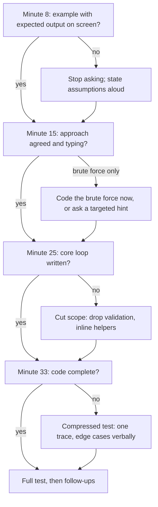

A 45-minute coding interview is not 45 minutes of problem solving. Take off three minutes of introductions at the start and four for your questions at the end, and you have about 38 minutes for a problem the interviewer expects to see understood, solved, coded, tested and extended. Most candidates who fail a round they "nearly had" did not fail on the algorithm. They spent fourteen minutes circling the approach, finished typing at minute 41, never traced a single input, and never reached the follow-up question where the interviewer had planned to find out whether they were senior. The feedback says "ran out of time", and the people making the hiring decision read that as "could not deliver".

The fix is not typing faster. It is a budget: a fixed sequence of phases, a deliverable for each, and checkpoints at which you look at the clock and deliberately change course if you are behind. This lesson gives you that budget, the sentences that move you between phases, and a compressed run of a full round so you can hear how it sounds. The [problem-solving loop](/learn/foundations/problem-solving/the-problem-solving-loop) gave you the *order* of the steps; this lesson gives you the *clock*.

## Where the 45 minutes go

| Clock | Phase | Minutes | You leave the phase with |
|---|---|---|---|
| 0–3 | Introductions | 3 | A 30-second summary of who you are |
| 3–8 | Understand and clarify | 5 | The problem restated, the constraints that matter, one worked example with its expected output |
| 8–15 | Approach | 7 | Brute force named with its cost, a better approach agreed with the interviewer, complexity stated |
| 15–30 | Code | 15 | Complete code for the agreed approach |
| 30–36 | Test | 6 | The example traced, edge cases checked, your own bugs fixed |
| 36–41 | Follow-ups | 5 | At least one extension discussed: scale, streaming, a changed constraint |
| 41–45 | Your questions | 4 | One or two genuine questions answered |

Three things about this table are not obvious.

**Coding gets only a third of the time.** Candidates practise by writing code, so they assume the interview is mostly code. It is not. Fifteen minutes is plenty for 20–40 lines of interview code if you knew what you were going to write before you started. It is nowhere near enough if you are designing while you type. The seven minutes of approach are what make fifteen minutes of code possible.

**Testing is a fixed slot, not whatever is left.** If testing gets whatever time is left, it gets none. Most company rubrics score testing as its own item, and so does Ascend's mock interviewer. It is also the item candidates most often leave blank.

**Follow-ups are where level is decided.** The interviewer usually has one or two extensions planned: "now the input doesn't fit in memory", "now it's a stream", "now make it thread-safe". Mid-level and senior candidates often write the same code for the base problem and only diverge on the follow-up. If you finish at minute 44, nobody asks you one.

## Variants of the clock

The single-problem 45-minute round is the most common format, but not the only one. When the format changes, change the budget and keep the order of phases.

- **60-minute rounds.** Usually the same problem with deeper follow-ups, or a second part. Keep the first 36 minutes identical and spend the extra time in follow-ups.
- **Two problems in one round.** Common in phone screens: a warm-up and a medium. Budget roughly 15 and 25 minutes. The trap is polishing problem one. A correct, tested first answer at minute 14 that is not optimal beats an elegant one at minute 22.
- **Multi-part practical problems.** Increasingly common in senior loops: "implement a key-value store with expiry", then "add snapshots", then "handle concurrent writers". The interviewer wants to see your part-one code absorb part two. Aim to finish part one by minute 20, and write it so the next part is an addition rather than a rewrite.
- **No code execution.** In a shared document or on a whiteboard, testing means tracing by hand, which is slower. Take two minutes from coding and give them to testing.
- **Code execution available.** Running tests is fast, so the risk flips: candidates run code instead of thinking. Say what you expect the output to be before you press run.

## The phases, with what to say

### 0–3: introductions

The interviewer introduces themselves and asks for a brief background. Give 30 seconds, not three minutes. Save the career story for the behavioural round.

> "I'm Sam. I've spent five years at a payments company, mostly on backend services in Go and Kotlin, and for the last two I've led the team that owns our ledger service. Happy to jump in."

Then stop. If they want more, they will ask.

### 3–8: understand and clarify

Restate the problem in one sentence, ask the handful of questions that change the approach, and write one example with its expected output before you think about the algorithm. [Clarifying and scoping](/learn/interview-patterns/interview-execution/clarifying-and-scoping) covers which questions matter.

**Checkpoint at minute 8:** you can state the input, the output and the size, and there is one example with a correct expected answer on the screen. If you are still asking questions at minute 9, stop asking and state your assumptions instead.

### 8–15: approach

Say the brute force in one sentence with its cost. Name the bottleneck. Propose the better approach, its complexity and what it costs you. Then ask for buy-in:

> "So that's O(n log n) time for the sort and O(n) space for the output. Does that sound reasonable, or would you like me to look for something better before I code?"

That last sentence may be the most valuable one in the round. It lets the interviewer redirect you *before* you spend fifteen minutes coding an approach they were going to reject. Interviewers almost always answer it honestly: "sounds good", "can you do better than n log n?", or "let's go with that and see". Every one of those answers saves you time.

**Checkpoint at minute 15:** you should be typing. If you have only a brute force and no route to anything better, say so and pick one of two options: code the brute force now and optimise afterwards, or spend two more minutes and ask a targeted hint. [Getting unstuck](/learn/interview-patterns/interview-execution/getting-unstuck) has the decision rule.

### 15–30: code

Describe the structure in a sentence or two, then write it top-down: the main function first, calling helpers you fill in afterwards. Narrate decisions, not keystrokes. Around minute 22, give a one-line progress marker ("main loop's done; next is the helper that merges two blocks") so the interviewer knows where you are.

If you hit a detail that is not central, leave a marker and move on:

```python
def top_k_users(lines, k):
    counts = count_requests(lines)   # TODO: malformed lines skipped for now
    return select_top_k(counts, k)
```

Say it out loud: "I'm skipping malformed-line handling; I'll come back to it if we have time." That is a scope decision, and scope decisions are senior behaviour. Skipping it silently is a bug.

**Checkpoint at minute 25:** the core loop or recursion is written. If it is not, cut scope now: drop input validation, inline the helper, choose the simpler of two data structures.

### 30–36: test

Announce it ("let me test this before we move on"). Trace the example you wrote at minute 6, then the smallest degenerate input, then an input aimed at the line you trust least. [Testing live](/learn/interview-patterns/interview-execution/testing-live) covers the technique in full.

**Checkpoint at minute 33:** if you are only now finishing the code, do a compressed test. Trace one input, then name each edge case in a sentence and point to the line that handles it.

### 36–41: follow-ups

Often the interviewer drives this. If they do not, offer: "Would it be useful to talk about how this changes if the input arrives as a stream?" Follow-up answers are mostly talk, not code: what changes, which data structure replaces which, and what the new complexity is.

### 41–45: your questions

Have two real questions ready. Good ones are about the work: "What's a technical decision your team revisited recently?", "What does on-call look like for this team?" Do not ask how you did. The interviewer cannot tell you, and asking costs you a little.

## Checkpoints as a decision procedure

The checkpoints are the part people skip, and they are what make the protocol work under pressure. When you are behind, the instinct is to keep going and hope. The protocol says: at each checkpoint, compare where you are with where you should be, and if you are behind, make a named cut.



Every cut is said out loud. "I'm going to skip validation so we get to testing" tells the interviewer you are managing the clock. The same cut made silently looks like an oversight.

## A full run, compressed

Here is a round on [Merge Intervals](/practice/merge-intervals), cut down to its key lines, with timestamps.

> **[03:00] Interviewer:** Given a list of intervals, merge all the overlapping ones and return the result.
>
> **[03:20] Candidate:** So I get a list of `[start, end]` pairs and return a list where no two intervals overlap, covering the same points. A few questions. Is the input sorted? Do intervals that touch, like `[1, 4]` and `[4, 5]`, count as overlapping? Roughly how many intervals, and can I modify the input list?
>
> **[04:10] Interviewer:** Not sorted. Touching ones merge. Up to about 10⁵. Don't worry about mutating it.
>
> **[04:30] Candidate:** Example: `[[1,3],[8,10],[2,6],[15,18]]` gives `[[1,6],[8,10],[15,18]]`. And `[[1,4],[4,5]]` gives `[[1,5]]`, because touching merges.
>
> **[06:00] Candidate:** Brute force: compare every pair and merge any that overlap, repeating until nothing changes. That's at least O(n²) per pass, too slow for 10⁵. The difficulty is that overlapping intervals can be anywhere in the list. If I sort by start, anything that overlaps the current merged block must come right after it, so one pass after the sort is enough. O(n log n) for the sort, O(n) for the pass and the output. Does that sound reasonable?
>
> **[07:30] Interviewer:** Go ahead.
>
> **[08:00] Candidate:** I'll sort by start and compare each interval with the last one in the output: if it starts at or before that one's end, extend the end with a max; otherwise append it. Writing into the last output element directly means there's no separate "current" block to flush at the end.
>
> *[08:30–14:00: about ten lines of code]*
>
> **[14:00] Candidate:** Let me test. After sorting: `[1,3]` goes in; `[2,6]` starts at 2, which is ≤ 3, so the end becomes 6; `[8,10]` starts after 6, append; `[15,18]`, append. Matches. Empty input returns early. One interval comes back unchanged. The line I trust least is the max: for containment, `[[1,10],[2,3]]`, the end is `max(10, 3) = 10`, which is right; without the max it would shrink to 3.
>
> **[18:00] Interviewer:** What if intervals arrive one at a time and I want the merged set after each one?
>
> **[18:20] Candidate:** Re-sorting each time is O(n log n) per arrival. I'd keep the merged intervals in a sorted structure keyed by start. A new interval binary-searches to its position and absorbs neighbours on either side. Each interval can be absorbed only once, so with a balanced tree that's O(log n) amortised per arrival. With a plain Python list it's O(n) per arrival because of the shifting, which is essentially [Insert Interval](/practice/insert-interval).

This candidate finished the base problem at minute 18, which is typical for a medium you recognise: the example made the sort obvious and the approach phase took two minutes. The spare time went into follow-ups, which is where the senior signal was earned. On a harder problem the same protocol stretches to fill the budget, but the order stays the same.

## Sentences that move the round forward

Transitions are where minutes leak away. Have a sentence ready for each one.

| Moment | Sentence |
|---|---|
| Understanding → approach | "I think I have the problem. Let me start with the obvious approach and then improve it." |
| Approach → code | "I'll code this now, unless you'd like me to look at anything else first." |
| Mid-code | "The main loop's done; next is the helper that merges two blocks." |
| Cutting scope | "I'm going to skip input validation so we get to testing; it would go at the boundary." |
| Code → test | "Let me test this before we move on." |
| Stuck | "I'm stuck on how to avoid rescanning. Let me think quietly for thirty seconds." |
| Behind the clock | "We have about ten minutes. Would you rather I optimise this or test what I have?" |

The last one is underrated. Offering the interviewer the choice when time is short shows you understand the trade-off, and it turns them into a partner in the decision rather than a judge of the outcome.

## Keeping the clock visible

You cannot manage time you are not watching. Put a clock where your eyes already are: a small timer beside the editor, or a watch on the desk. Look at it at each transition, not constantly. In Ascend's mock interviews at `/interviews`, the timer sits in the header and turns red in the last five minutes.

For your first few mocks, write the checkpoint minutes (8, 15, 25, 33) on a sticky note and compare them with your actual times afterwards. Most people find the same pattern: the approach phase runs long, testing gets squeezed, and follow-ups never happen.

## Practising the protocol

Reading a budget does not install it. Three practice loops do.

1. **Timed solo mocks.** Start a solo coding interview on `/interviews` at medium difficulty. Solo mode locks the AI coach for the duration, as in a real round. The report scores five dimensions: problem understanding and clarification, algorithmic approach and complexity, code quality and correctness, testing and edge cases, and communication. Afterwards, open the transcript and note when you started coding and when you started testing. Those two timestamps predict your score better than anything else.
2. **Transition-only drills.** Take a problem you already know, such as [Top K Frequent Elements](/practice/top-k-frequent), and run only minutes 3–15 aloud: restate, clarify, example, brute force, optimise, buy-in. Seven minutes, no code. Five of these in an evening train the part of the round that most often runs over.
3. **Two-problem drills.** Pair an easy problem with a medium and give yourself 40 minutes for both. This trains the "good enough, move on" decision that phone screens reward.

## Senior signals

- You ask for buy-in on the approach before coding, so the interviewer can redirect you while it is cheap.
- You treat testing and follow-ups as budgeted phases and reach them in nearly every round.
- You make scope cuts out loud, with a reason, and say where the skipped code would go.
- You offer the interviewer a choice when time is short instead of deciding silently.
- In multi-part problems, you write part one so that part two is an addition rather than a rewrite.
- You keep introductions and closing questions short, because the round's time belongs to the problem.

## Check yourself

```quiz
- q: >-
    At minute 16 you have only an O(n²) brute force for a problem with n up to 10⁵, and no idea how to improve it. What is the best move?
  options: ["Keep thinking silently until the optimisation comes", "Say what you are stuck on, then either code the brute force now or ask a targeted hint, and say which you chose", "Start coding an O(n log n) idea you are not sure is correct", "Ask the interviewer to switch to a different problem"]
  answer: 1
  explanation: >-
    Minute 15 is the checkpoint where you should be typing. Naming the blocker and making an explicit choice keeps the round moving and shows you are managing the clock. Silent thinking past the checkpoint is the most common way rounds run out of time, and coding an unverified idea risks fifteen minutes on something that does not work.
- q: >-
    Why ask "does that sound reasonable?" after describing your approach and before coding?
  options: ["It is polite and interviewers expect it", "It lets the interviewer redirect you before you spend fifteen minutes on an approach they would reject", "It makes the interviewer give you the optimal answer", "Rubrics award points for asking questions"]
  answer: 1
  explanation: >-
    The question buys information at the cheapest possible moment. If the interviewer wanted a better complexity, you find out at minute 12 rather than minute 30. It does not extract the answer, and asking questions for their own sake is not rewarded.
- q: >-
    In a phone screen with two problems in 45 minutes, you have a correct, tested O(n log n) solution to the warm-up at minute 14 and you can see how to make it O(n). What do you do?
  options: ["Implement the O(n) version now", "Describe the O(n) idea in a sentence or two and move on to problem two", "Ask the interviewer to skip problem two", "Rewrite the solution in a faster language"]
  answer: 1
  explanation: >-
    In a two-problem round the budget for the warm-up is about 15 minutes. Mentioning the improvement shows you see it; implementing it costs time that problem two needs. An unfinished second problem is a much bigger negative than a warm-up that is correct but not optimal.
- q: >-
    You finish coding at minute 33. Which testing plan fits the time left?
  options: ["Skip testing and go straight to follow-ups", "Trace one input fully, then name each edge case and the line that handles it", "Write a randomised test harness", "Re-read the code silently for five minutes"]
  answer: 1
  explanation: >-
    The compressed test proves the main path and covers the edge cases verbally in about three minutes, leaving room for a follow-up. Skipping testing leaves a scored dimension blank; a harness takes too long; silent re-reading gives the interviewer nothing to evaluate.
- q: >-
    Two candidates write identical, correct code for the base problem. What most often separates a senior rating from a mid-level one?
  options: ["Typing speed", "The language they chose", "How they handle follow-ups and trade-offs, which requires reaching them with time to spare", "Whether they used helper functions"]
  answer: 2
  explanation: >-
    Base-problem code is often the same for both levels. The follow-ups (scale, streaming, concurrency) are where interviewers test judgement, and a candidate who finishes at minute 44 never gets asked. Language and helpers matter far less than getting to that conversation.
```
