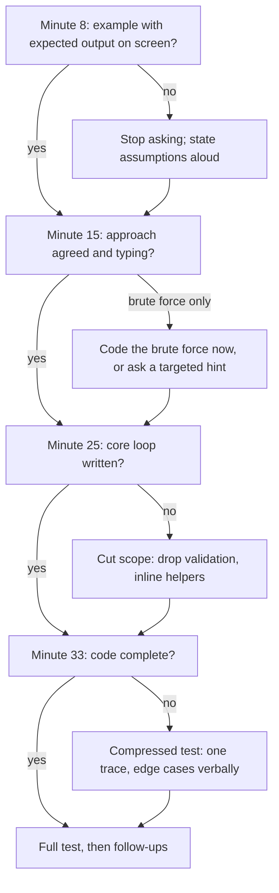

A 45-minute coding interview is not 45 minutes of problem solving. Take off three minutes of introductions at the start and four for your questions at the end, and you have about 38 minutes for a problem the interviewer expects to see understood, solved, coded, tested and extended. Most candidates who fail a round they "nearly had" did not fail on the algorithm. They spent fourteen minutes circling the approach, finished typing at minute 41, never traced a single input, and never reached the follow-up question where the interviewer had planned to find out whether they were senior. The feedback says "ran out of time", and the people making the hiring decision read that as "could not deliver".

The fix is not typing faster. It is a budget: a fixed sequence of phases, a deliverable for each, and checkpoints at which you look at the clock and deliberately change course if you are behind. The [problem-solving loop](/learn/foundations/problem-solving/the-problem-solving-loop) gave you the *order* of the steps; this lesson gives you the *clock*.

## Where the 45 minutes go

| Clock | Phase | Minutes | You leave the phase with |
|---|---|---|---|
| 0–3 | Introductions | 3 | A 30-second summary of who you are |
| 3–8 | Understand and clarify | 5 | The problem restated, the constraints that matter, one worked example with its expected output |
| 8–15 | Approach | 7 | Brute force named with its cost, a better approach agreed with the interviewer, complexity stated |
| 15–30 | Code | 15 | Complete code for the agreed approach |
| 30–36 | Test | 6 | The example traced, edge cases checked, your own bugs fixed |
| 36–41 | Follow-ups | 5 | At least one extension discussed: scale, streaming, a changed constraint |
| 41–45 | Your questions | 4 | One or two genuine questions answered |

Three things about this table are not obvious.

**Coding gets only a third of the time.** Fifteen minutes is plenty for 20–40 lines of interview code if you knew what you were going to write before you started, and nowhere near enough if you are designing while you type. The seven minutes of approach are what make fifteen minutes of code possible.

**Testing is a fixed slot, not whatever is left.** Left to the remainder, it gets none. Most rubrics score testing as its own item, and it is the one candidates most often leave blank.

**Follow-ups are where level is decided.** The interviewer usually has one or two extensions planned ("now it doesn't fit in memory", "now it's a stream", "now make it thread-safe"), and mid-level and senior candidates often write the same base code and diverge only there.

## Variants of the clock

The single-problem 45-minute round is the most common format, but not the only one. When the format changes, change the budget and keep the order of phases.

- **60-minute rounds.** Usually the same problem with deeper follow-ups, or a second part. Keep the first 36 minutes identical and spend the extra time in follow-ups.
- **Two problems in one round.** Common in phone screens: a warm-up and a medium. Budget roughly 15 and 25 minutes. The trap is polishing problem one. A correct, tested first answer at minute 14 that is not optimal beats an elegant one at minute 22.
- **Multi-part practical problems.** Increasingly common in senior loops: "implement a key-value store with expiry", then "add snapshots", then "handle concurrent writers". The interviewer wants to see your part-one code absorb part two. Aim to finish part one by minute 20, and write it so the next part is an addition rather than a rewrite.
- **No code execution.** In a shared document or on a whiteboard, testing means tracing by hand, which is slower. Take two minutes from coding and give them to testing.
- **Code execution available.** Running tests is fast, so the risk flips: candidates run code instead of thinking. Say what you expect the output to be before you press run.

## The phases, with what to say

### 0–3: introductions

The interviewer introduces themselves and asks for a brief background. Give 30 seconds, not three minutes. Save the career story for the behavioural round.

> "I'm Sam. I've spent five years at a payments company, mostly on backend services in Go and Kotlin, and for the last two I've led the team that owns our ledger service. Happy to jump in."

Then stop. If they want more, they will ask.

### 3–8: understand and clarify

Restate the problem in one sentence, ask the handful of questions that change the approach, and write one example with its expected output before you think about the algorithm. [Clarifying and scoping](/learn/interview-patterns/interview-execution/clarifying-and-scoping) covers which questions matter.

**Checkpoint at minute 8:** you can state the input, the output and the size, and there is one example with a correct expected answer on the screen. If you are still asking questions at minute 9, stop asking and state your assumptions instead.

### 8–15: approach

Say the brute force in one sentence with its cost. Name the bottleneck. Propose the better approach, its complexity and what it costs you. Then ask for buy-in:

> "So that's O(n log n) time for the sort and O(n) space for the output. Does that sound reasonable, or would you like me to look for something better before I code?"

That last sentence lets the interviewer redirect you *before* you spend fifteen minutes coding an approach they were going to reject. Every honest answer to it ("sounds good", "can you do better than n log n?", "let's see") saves you time.

**Checkpoint at minute 15:** you should be typing. If you have only a brute force and no route to anything better, say so and pick one of two options: code the brute force now and optimise afterwards, or spend two more minutes and ask a targeted hint. [Getting unstuck](/learn/interview-patterns/interview-execution/getting-unstuck) has the decision rule.

### 15–30: code

Describe the structure in a sentence or two, then write it top-down: the main function first, calling helpers you fill in afterwards. Narrate decisions, not keystrokes. Around minute 22, give a one-line progress marker so the interviewer knows where you are.

If you hit a detail that is not central, leave a marker and move on:

```python
def top_k_users(lines, k):
    counts = count_requests(lines)   # TODO: malformed lines skipped for now
    return select_top_k(counts, k)
```

Say it out loud: "I'm skipping malformed-line handling; I'll come back to it if we have time." That is a scope decision, and scope decisions are senior behaviour. Skipping it silently is a bug.

**Checkpoint at minute 25:** the core loop or recursion is written. If it is not, cut scope now: drop input validation, inline the helper, choose the simpler of two data structures.

### 30–36: test

Announce it ("let me test this before we move on"). Trace the example you wrote at minute 6, then the smallest degenerate input, then an input aimed at the line you trust least. [Testing live](/learn/interview-patterns/interview-execution/testing-live) covers the technique in full.

**Checkpoint at minute 33:** if you are only now finishing the code, do a compressed test. Trace one input, then name each edge case in a sentence and point to the line that handles it.

### 36–41: follow-ups

Often the interviewer drives this. If they do not, offer: "Would it be useful to talk about how this changes if the input arrives as a stream?" Follow-up answers are mostly talk, not code: what changes, which data structure replaces which, and what the new complexity is.

### 41–45: your questions

Have two real questions ready. Good ones are about the work: "What's a technical decision your team revisited recently?", "What does on-call look like for this team?" Do not ask how you did. The interviewer cannot tell you, and asking costs you a little.

## Checkpoints as a decision procedure

At each checkpoint, compare where you are with where you should be, and if you are behind, make a named cut instead of keeping going and hoping.



### The minute-15 decision, costed

The checkpoint that decides most rounds is minute 15 with a brute force and nothing better. You have four moves, and they are not equal.

| Move | Time it costs | Effect on the algorithm score (commonly reported) | What it guarantees | Choose it when |
|---|---|---|---|---|
| Code the brute force, optimise after | 8–10 minutes to working code | Capped below "strong" unless the optimisation follows | Tested code by minute 26; code-quality and testing credit | n is small enough to defend it, or you have no lead at all |
| Think two or three more minutes, aloud | 2–3 minutes | Neutral if the idea arrives; costly if it does not | Nothing | You have a specific lead ("the repeated work is the rescans") |
| Ask a targeted hint | 1 minute | A nudge is usually noted without much penalty; a core-idea hint weighs more | Progress within a minute | Minute 17 with no lead, or the lead has not paid off |
| Code an unverified optimisation | 10–15 minutes | Strong if it works; the worst outcome of the four if not, because nothing is tested | Nothing | Only when you can state the invariant that makes it correct |

The second row is the trap: "two more minutes" becomes eight because nothing forces the stop. If you take it, say the deadline out loud: "Give me until minute 18; if I haven't got it I'll code the quadratic version."

## A full run, compressed

Here is a round on [Merge Intervals](/practice/merge-intervals), cut down to its key lines, with timestamps.

> **[03:00] Interviewer:** Given a list of intervals, merge all the overlapping ones and return the result.
>
> **[03:20] Candidate:** So I get a list of `[start, end]` pairs and return a list where no two intervals overlap, covering the same points. A few questions. Is the input sorted? Do intervals that touch, like `[1, 4]` and `[4, 5]`, count as overlapping? Roughly how many intervals, and can I modify the input list?
>
> **[04:10] Interviewer:** Not sorted. Touching ones merge. Up to about 10⁵. Don't worry about mutating it.
>
> **[04:30] Candidate:** Example: `[[1,3],[8,10],[2,6],[15,18]]` gives `[[1,6],[8,10],[15,18]]`. And `[[1,4],[4,5]]` gives `[[1,5]]`, because touching merges.
>
> **[06:00] Candidate:** Brute force: compare every pair and merge any that overlap, repeating until nothing changes. That's at least O(n²) per pass, too slow for 10⁵. The difficulty is that overlapping intervals can be anywhere in the list. If I sort by start, anything that overlaps the current merged block must come right after it, so one pass after the sort is enough. O(n log n) for the sort, O(n) for the pass and the output. Does that sound reasonable?
>
> **[07:30] Interviewer:** Go ahead.
>
> **[08:00] Candidate:** I'll sort by start and compare each interval with the last one in the output: if it starts at or before that one's end, extend the end with a max; otherwise append it. Writing into the last output element directly means there's no separate "current" block to flush at the end.
>
> *[08:30–14:00: about ten lines of code]*
>
> **[14:00] Candidate:** Let me test. After sorting: `[1,3]` goes in; `[2,6]` starts at 2, which is ≤ 3, so the end becomes 6; `[8,10]` starts after 6, append; `[15,18]`, append. Matches. Empty input returns early. One interval comes back unchanged. The line I trust least is the max: for containment, `[[1,10],[2,3]]`, the end is `max(10, 3) = 10`, which is right; without the max it would shrink to 3.
>
> **[18:00] Interviewer:** What if intervals arrive one at a time and I want the merged set after each one?
>
> **[18:20] Candidate:** Re-sorting each time is O(n log n) per arrival. I'd keep the merged intervals in a sorted structure keyed by start. A new interval binary-searches to its position and absorbs neighbours on either side. Each interval can be absorbed only once, so with a balanced tree that's O(log n) amortised per arrival. With a plain Python list it's O(n) per arrival because of the shifting, which is essentially [Insert Interval](/practice/insert-interval).

The base problem was done at minute 18, typical for a medium you recognise, and the spare time went into the follow-up, which is where the senior signal was earned.

## A second run, with a wrong turn

Most rounds are not recognised on sight. Here is one on [Top K Frequent Elements](/practice/top-k-frequent) where the candidate takes a wrong turn, recovers, and then finds their own bug in testing. Read it for *where* each recovery sits on the clock.

### Minutes 3–10: clarify, approach, wrong turn

> **[03:00] Interviewer:** Given an array of integers and a number k, return the k values that appear most often.
>
> **[03:15] Candidate:** So I count each value and return the k with the highest counts. Three questions. How long is the array, and what's the value range? Can two values tie at the k-th place, and what do I return if so? Does the output need an order?
>
> **[03:50] Interviewer:** Up to 10⁵ elements, values within plus or minus 10⁴. The input is chosen so there's no tie at the boundary. Any order.
>
> **[04:10] Candidate:** Example: `[4,4,4,5,5,6,6,6,6]` with k = 2. Counts 4 → 3, 5 → 2, 6 → 4, so `[6, 4]`. Edge: k equal to the number of distinct values returns all of them. I'll assume k is between 1 and the distinct count.
>
> **[05:30] Candidate:** Counting is one hash-map pass, O(n). Then I need the k largest counts. Sorting the d distinct values by count is O(d log d), which is O(n log n) when every value is distinct. Does that sound reasonable, or would you like something faster before I code?
>
> **[06:20] Interviewer:** See if you can beat the sort.
>
> **[06:30] Candidate:** The sort orders all d counts and I only need the top k. I'll put every count in a max-heap and pop k times: heapify is O(d), k pops are O(k log d), so O(n + k log d).
>
> **[07:40] Candidate:** *(writing)* `heap = [(-c, v) for v, c in counts.items()]`, heapify, pop k times...
>
> **[08:30] Candidate:** Wait. Let me check that against what I claimed. It beats the sort, but the heap holds all d entries, so it's O(d) extra memory, and if k is anywhere near d the pops cost about what the sort did. I asked the wrong question earlier: is k small compared with the number of distinct values?
>
> **[08:50] Interviewer:** Assume k is small.
>
> **[09:00] Candidate:** Then a min-heap of size k is the right shape: push each `(count, value)`, and pop the smallest whenever the heap exceeds k. Each operation is O(log k), so O(n + d log k) in total, and with k around 10 that's log₂ 10 ≈ 3.3 comparisons per distinct value instead of log₂ 10⁵ ≈ 17 for a sort. Extra memory is O(k), which is also the shape that survives a stream. For completeness, frequencies are integers from 1 to n, so bucketing by frequency is O(n) with no comparisons at all, at the cost of an n-slot array. I'll code the heap because it generalises to any score. Shall I go ahead?
>
> **[10:10] Interviewer:** Go ahead.

### Minutes 10–28: code, test, follow-ups

*[10:10–16:30: about twelve lines of code]*

```python
import heapq

def top_k_frequent(nums, k):
    counts = {}
    for x in nums:
        counts[x] = counts.get(x, 0) + 1
    heap = []                                    # min-heap, never more than k entries
    for value, count in counts.items():
        heapq.heappush(heap, (value, count))     # the bug is on this line
        if len(heap) > k:
            heapq.heappop(heap)
    return [v for c, v in heap]
```

> **[16:30] Candidate:** Let me test before we go on. The example: counts in insertion order are 4 → 3, 5 → 2, 6 → 4. I'll track the heap after each push.

| Push | Heap after push | Over k? | Heap after pop |
|---|---|---|---|
| `(4, 3)` | `[(4,3)]` | no | `[(4,3)]` |
| `(5, 2)` | `[(4,3), (5,2)]` | no | `[(4,3), (5,2)]` |
| `(6, 4)` | `[(4,3), (5,2), (6,4)]` | yes, pops `(4,3)` | `[(5,2), (6,4)]` |
| return | `[v for c, v in heap]` → `[2, 4]` | | expected `[6, 4]` |

> **[18:00] Candidate:** That's wrong, and 2 isn't even in the input, so I'm returning counts. The tuple is `(value, count)`: the heap orders by value and the comprehension reads the wrong field. One root cause, two symptoms. The fix is to push `(count, value)`. Re-tracing: `(3,4)`, `(2,5)`, then `(4,6)` makes three, pop the smallest, `(2,5)`, leaving `[(3,4), (4,6)]`, values `[4, 6]`. Matches, in any order.
>
> **[19:00] Candidate:** Degenerate cases. `[1]` with k = 1: one push, size 1 is not over 1, `[1]`. k equal to the distinct count, `[1,2,3,4,5]` with k = 5: never pops, returns all five. The line I trust least is `len(heap) > k`; with `>=` the heap would hold k − 1 entries. `[5,5,5,5]` with k = 1: one push, 1 > 1 is false, `[5]`. Good. Complexity of what I wrote, not what I planned: O(n) counting, d pushes and at most d pops at O(log k) each, so O(n + d log k) time and O(d + k) space.
>
> **[21:00] Interviewer:** You said this beats O(n log n). Prove it.
>
> **[21:15] Candidate:** d ≤ n, so d log k ≤ n log k, which is O(n) for fixed k. The caveat: as k approaches d the heap becomes a sort in disguise, and at k = d I'd return every key with no heap. If you need O(n) regardless of k, that's the bucket version, because it never compares counts.
>
> **[23:30] Interviewer:** Now the values arrive as an unbounded stream and I want the top k at any moment.
>
> **[23:45] Candidate:** The size-k heap doesn't survive as is: a value already in it changes its count after insertion, and a value outside it can climb past the heap's minimum without my knowing. So the count map must persist, and it grows with the number of distinct values. Two exact options: rebuild the size-k heap from the map at query time, O(1) per arrival and O(d log k) per query; or keep a count-ordered structure, O(log d) per arrival and O(k) per query. If memory must be bounded, the map is what breaks, and the fix is approximate: a Count-Min sketch for counts plus a small candidate heap, which can over-count but never under-counts. The choice depends on query rate versus arrival rate and whether approximate is acceptable. The [top-k lesson](/learn/interview-patterns/sequence-patterns/top-k-elements) has the variants.
>
> **[28:00] Interviewer:** Good. Let's stop there. Do you have questions for me?

### What the interviewer wrote down

A plausible version of this interviewer's notes, in the phrases that recur in write-ups; every line is a moment the candidate controlled.

| Time | What the candidate did | The note |
|---|---|---|
| 03:15 | Asked size, tie rule and output order before anything else | "clarified constraints unprompted" |
| 04:10 | Example with expected output; named the k = d edge | "worked an example before proposing an approach" |
| 05:30 | Baseline with its cost; asked before coding | "named the brute force; asked for buy-in" |
| 06:30–08:30 | Started a full heap; caught the mismatch with their own claim | "self-corrected before coding" |
| 09:00 | Size-k heap for a stated reason; buckets named as the O(n) option | "chose for a reason; knew the alternative and its cost" |
| 16:30–18:00 | Traced the example; found the tuple-order bug | "tested unprompted; found and fixed own bug" |
| 19:00–21:15 | Degenerate cases, the `>` line, complexity from the code, the bound's assumption | "chose tests deliberately; stated the assumption behind the complexity" |
| 23:45 | Exact versus approximate streaming, with costs | "handled the follow-up with trade-offs" |
| overall | Announced every transition; never needed prompting | "drove the session" |

## What the interviewer writes down

Write-ups vary by company, but their vocabulary is stable. These phrases, or close paraphrases, are commonly reported by people who have written and read many of them. None of this is any particular company's internal rubric; it is the shared dialect of interview feedback, and each phrase is produced by a behaviour you can practise.

| Phrase | Dimension | Reads as |
|---|---|---|
| "drove the session" / "managed their own time" | Communication | Senior |
| "clarified constraints unprompted" | Problem understanding | Senior |
| "named the brute force and its cost, then improved on it" | Algorithm | Solid at any level |
| "needed a small nudge" / "needed a hint on the core idea" | Algorithm | The first is minor; the second commonly caps the dimension around a mid-level pass |
| "led through the approach" / "required multiple hints" | Algorithm | Below the bar for that dimension |
| "self-corrected before coding" | Algorithm, communication | Positive; often quoted as evidence of judgement |
| "readable; extracted a helper; no over-engineering" | Code quality | Senior |
| "tested unprompted with chosen cases" / "found and fixed own bug" | Testing | Senior / neutral-to-positive |
| "bug found by interviewer" / "did not test" / "ran out of time before testing" | Testing | Negative; the last two are also read as delivery risk |
| "stated complexity with its assumptions" | Algorithm | Senior |
| "handled the follow-up with trade-offs" | Algorithm, communication | The most common phrase in a senior-consistent write-up |
| "answered with a technology name, no mechanism" / "had to be prompted at each phase" | Communication | Mid-level |

The phrases are evidence, not scores: "found and fixed own bug at 18:00" can be checked against the transcript and compared across candidates, which a 3-out-of-4 cannot. Absence is recorded too; a dimension with no evidence cannot be earned back.

## Under the hood: how a round becomes a decision

You are optimising for a document you will never see, so it helps to know how it is produced. Details differ between companies; the commonly reported shape is this.

During the round, the interviewer keeps timestamped notes: what you asked, what you proposed, when you started typing, who found each bug, what you said to the follow-up. Anything they did not hear or see cannot appear. That is why silent progress earns nothing and why narrating a decision ("a max here, because a later interval can be contained") is not chatter.

Within about a day those notes become written feedback: a rating per dimension with a sentence of evidence each, and an overall recommendation, often with a level ("hire, senior-consistent", "hire at the level below", "leaning no"). Interviewers are typically asked to submit before seeing anyone else's, so your round is judged on its own transcript.

Then every round's write-up is read side by side in a debrief or by a hiring committee, by people who were not in the room. A coding write-up saying "correct code; needed a hint on the core idea; did not reach testing" next to a strong design round produces the question "is the coding a concern?", and that question is what pulls level down. "Drove the session; found own bug; handled the streaming follow-up with trade-offs" answers it before it is asked. The clock matters because "ran out of time" is a recorded fact; announced decisions matter because only announced decisions get written; the follow-up matters because it is the only phase whose evidence is specifically about level.

## Sentences that move the round forward

Transitions are where minutes leak away. Have a sentence ready for each one.

| Moment | Sentence |
|---|---|
| Understanding → approach | "I think I have the problem. Let me start with the obvious approach and then improve it." |
| Approach → code | "I'll code this now, unless you'd like me to look at anything else first." |
| Mid-code | "The main loop's done; next is the helper that merges two blocks." |
| Cutting scope | "I'm going to skip input validation so we get to testing; it would go at the boundary." |
| Code → test | "Let me test this before we move on." |
| Stuck | "I'm stuck on how to avoid rescanning. Let me think quietly for thirty seconds." |
| Behind the clock | "We have about ten minutes. Would you rather I optimise this or test what I have?" |
| Changing direction | "Let me check that against what I claimed. It doesn't hold, so I'm switching; the counting code carries over." |

The "behind the clock" one is underrated. Offering the interviewer the choice when time is short shows you understand the trade-off, and it turns them into a partner in the decision rather than a judge of the outcome. The last one is the sentence from 08:30 in the second transcript; rehearse it, because the moment it belongs to feels like failure and reads as judgement.

## Keeping the clock visible

You cannot manage time you are not watching. Put a clock where your eyes already are: a small timer beside the editor, or a watch on the desk. Look at it at each transition, not constantly.

For your first few mocks, write the checkpoint minutes (8, 15, 25, 33) on a sticky note and compare them with your actual times afterwards.

A few numbers make the budget concrete. Typing 25–30 lines you have already designed takes three to five minutes for most people, depending on typing speed and how much you narrate; if coding is taking fifteen, the other ten are design happening at the keyboard. Tracing one heap push or one loop iteration aloud takes roughly fifteen to twenty seconds, so the four-row table above fits in under two minutes, and a six-operation class sequence takes three to four. The widely quoted window of visible effort before asking for a hint is three to five minutes; it varies between interviewers, but none report rewarding eight minutes of silence.

## Failure modes of a round

Each of these is a line that appears in feedback, what usually caused it, and the change that removes it. Diagnose from your own mock transcripts, not from memory of how the round felt.

**Symptom: "ran out of time before testing."** Diagnosis: check when typing started. In most such rounds it was after minute 18, because the approach was designed silently in the candidate's head, or a first idea was coded, abandoned and restarted. Fix: the minute-15 checkpoint with a named move from the table above, plus transition-only drills so the approach phase becomes a rehearsed seven minutes.

**Symptom: "solved a slightly different problem."** Diagnosis: no restatement and no example with an expected output. The interviewer checks your expected output against their notes at minute 4, and a mismatch there costs thirty seconds instead of twenty minutes. Fix: never leave the clarifying phase without an example whose output the interviewer has confirmed.

**Symptom: "needed a hint on the core idea" after a long pause.** Diagnosis: two or more minutes with nothing new on screen, usually because the candidate was trying to remember a trick rather than derive one. Fix: name the stuck point aloud within a minute, run one tool from the [getting-unstuck toolbox](/learn/interview-patterns/interview-execution/getting-unstuck), and ask a specific question by minute 17 if it has not paid off.

**Symptom: "correct code, but had to be prompted at each phase" or "rewrote at minute 28."** Diagnosis: the transitions were the interviewer's ("shall we test it?"), or the candidate coded without buy-in and the interviewer waited for the code to finish before asking for a better complexity. Fix: the sentence table, and the buy-in question at minute 12, every round.

## Interviewer follow-ups

These are questions the Top K interviewer asked or could have. Each has a model answer and the common wrong one.

**"Prove that this is faster than O(n log n)."** Model answer: d ≤ n distinct values, each pushed and popped at most once at O(log k), so O(n + d log k), which is O(n) for small k; the bound weakens as k approaches d, where the heap is a sort with worse constants, and the bucket approach is O(n) unconditionally because it never compares counts. Common wrong answer: "heap operations are O(log n), so it's O(n log n) as well", which confuses the heap's size with the input's.

**"Values arrive as a stream. What changes?"** Model answer: the count map persists and grows with distinct values; the size-k heap cannot be maintained incrementally because counts change after insertion; rebuild it on demand at O(d log k) per query, keep a count-ordered structure at O(log d) per arrival, or bound memory with a Count-Min sketch and a candidate heap, which is approximate. Common wrong answer: "push each arrival into the size-k heap", which silently drops values whose counts later overtake the heap's minimum.

**"Two values tie at the k-th place."** Model answer: define the rule (say, the smaller value wins), then encode it in the heap key with the direction reversed, because a min-heap of `(count, value)` evicts the *smallest* value on a tie, so the key must be `(count, -value)`; record the rule in the assumption ledger. Common wrong answer: "ties don't matter because output order is free", which is true of the order and false of the membership.

**"You spent two minutes on the full-heap version. Was that wasted?"** Model answer: the plan was checked against the claim made for it before any code existed, so the salvage was total and the check is exactly what those minutes were for. Common wrong answer: apologising, or arguing that the full heap was fine after all.

## What mid-level engineers get wrong

- **Typing at minute 4 with the first approach.** The interviewer rejects it at minute 20, or the tie or memory question exposes it at minute 30, and the write-up says "rewrote".
- **Treating "does that sound reasonable?" as weakness.** It is the cheapest information in the round; skipping it turns a two-minute redirect into a fifteen-minute one.
- **Testing by running the example once.** The example rarely exercises the boundary lines; the interviewer's "what about `[[1,10],[2,3]]`?" then produces "bug found by interviewer".
- **Going silent to think, or narrating every keystroke.** Both leave the notes empty of reasoning; narrate decisions at transitions and at the lines that carry risk.
- **Finishing at minute 44 and feeling relieved.** No follow-up was reached, so no level evidence exists; the round can confirm the bar but not the level.
- **Polishing problem one in a two-problem screen.** The O(n) rewrite costs the minutes problem two needed, and an unfinished second problem is the heavier line.
- **Making cuts silently.** "Skipped validation" said aloud is time management; discovered by the interviewer it is an omission.

## Practising the protocol

Reading a budget does not install it. Three practice loops do.

1. **Timed solo mocks.** Start a solo coding interview on `/interviews` at medium difficulty; solo mode locks the AI coach, as in a real round. Afterwards, note in the transcript when you started coding and when you started testing. Those two timestamps predict your score better than anything else.
2. **Transition-only drills.** Take a problem you already know, such as [Top K Frequent Elements](/practice/top-k-frequent), and run only minutes 3–15 aloud: restate, clarify, example, brute force, optimise, buy-in. Seven minutes, no code. Five of these in an evening train the part of the round that most often runs over.
3. **Two-problem drills.** Pair an easy problem with a medium and give yourself 40 minutes for both. This trains the "good enough, move on" decision that phone screens reward.

After each mock, write the interviewer's notes yourself, in the phrase vocabulary above, with timestamps. If no moment would produce "found and fixed own bug" or "handled the follow-up with trade-offs", you know what the next mock is for.

## Senior signals

- You ask for buy-in on the approach before coding, so the interviewer can redirect you while it is cheap.
- You treat testing and follow-ups as budgeted phases and reach them in nearly every round.
- You make scope cuts out loud, with a reason, and say where the skipped code would go.
- You offer the interviewer a choice when time is short instead of deciding silently.
- In multi-part problems, you write part one so that part two is an addition rather than a rewrite.
- You check a plan against the claim you made for it before coding it, and when they disagree you say so, switch, and keep what carries over.
- You know the vocabulary of the write-up ("drove the session", "found and fixed own bug", "needed a hint on the core idea") and can point to the minute in your own transcript that produced each line.
- At the minute-15 checkpoint you name which of the four moves you are taking and give yourself a deadline for it.

## Check yourself

```quiz
- q: >-
    At minute 16 you have only an O(n²) brute force for a problem with n up to 10⁵, and no idea how to improve it. What is the best move?
  options: ["Start coding an O(n log n) idea you are not sure is correct", "Ask the interviewer to switch you to a different problem", "Name the blocker, then code the brute force or ask a hint", "Keep thinking silently until the optimisation comes to you"]
  answer: 2
  explanation: >-
    Minute 15 is the checkpoint where you should be typing. Saying what you are stuck on and making an explicit choice, out loud, keeps the round moving and shows you are managing the clock. Silent thinking past the checkpoint is the most common way rounds run out of time, and coding an unverified idea risks fifteen minutes on something that does not work.
- q: >-
    Why ask "does that sound reasonable?" after describing your approach and before coding?
  options: ["It lets them redirect you before you spend time coding", "It prompts the interviewer to reveal the optimal answer", "It is polite, and interviewers expect to be asked it", "Rubrics award points for every question a candidate asks"]
  answer: 0
  explanation: >-
    The question buys information at the cheapest possible moment. If the interviewer wanted a better complexity, you find out at minute 12 rather than after fifteen minutes of coding at minute 30. It does not extract the answer, and asking questions for their own sake is not rewarded.
- q: >-
    In a phone screen with two problems in 45 minutes, you have a correct, tested O(n log n) solution to the warm-up at minute 14 and you can see how to make it O(n). What do you do?
  options: ["Ask the interviewer whether to skip problem two", "Rewrite the solution in a faster language first", "Mention the O(n) idea briefly, then start problem two", "Implement the O(n) version now, while the idea is fresh"]
  answer: 2
  explanation: >-
    In a two-problem round the budget for the warm-up is about 15 minutes. Mentioning the improvement shows you see it; implementing it costs time that problem two needs. An unfinished second problem is a much bigger negative than a warm-up that is correct but not optimal.
- q: >-
    You finish coding at minute 33. Which testing plan fits the time left?
  options: ["Trace one input; name each edge case and its line", "Re-read the whole program silently for five minutes", "Skip testing and go straight to the follow-ups", "Write a quick randomised test harness and run it"]
  answer: 0
  explanation: >-
    The compressed test proves the main path and covers the edge cases verbally in about three minutes, leaving room for a follow-up. Skipping testing leaves a scored dimension blank; a harness takes too long; silent re-reading gives the interviewer nothing to evaluate.
- q: >-
    Two candidates write identical, correct code for the base problem. What most often separates a senior rating from a mid-level one?
  options: ["Whether they split the code into helper functions", "Typing speed, which frees up extra time at the end", "The language they chose and how idiomatic it is", "Their follow-up answers, which need time to spare"]
  answer: 3
  explanation: >-
    Base-problem code is often the same for both levels. The follow-ups (scale, streaming, concurrency) are where interviewers test judgement and trade-offs, and a candidate who finishes at minute 44 never gets asked. Typing speed, language and helpers matter far less than getting to that conversation.
- q: >-
    In the Top K transcript the candidate began a full max-heap of all counts at 06:30, then at 08:30 said "let me check that against what I claimed" and switched to a size-k heap before writing code. How does that moment typically appear in the write-up?
  options: ["As a negative, since two minutes were spent on an abandoned idea", "As a hint, because the interviewer's question prompted the switch", "As neutral, because only the final approach is recorded in notes", "As a positive, noted as self-correcting before any code was written"]
  answer: 3
  explanation: >-
    Interviewers record the detour and the recovery, and a candidate who checks a plan against their own claim and switches before coding is credited with judgement; the phrase is close to "self-corrected before coding". The interviewer's "assume k is small" answered a question the candidate asked, which is not a hint on the core idea. Had the candidate coded the full heap and only discovered its cost at the streaming follow-up, the note would have been a nudge and the follow-up would have arrived too late.
```
