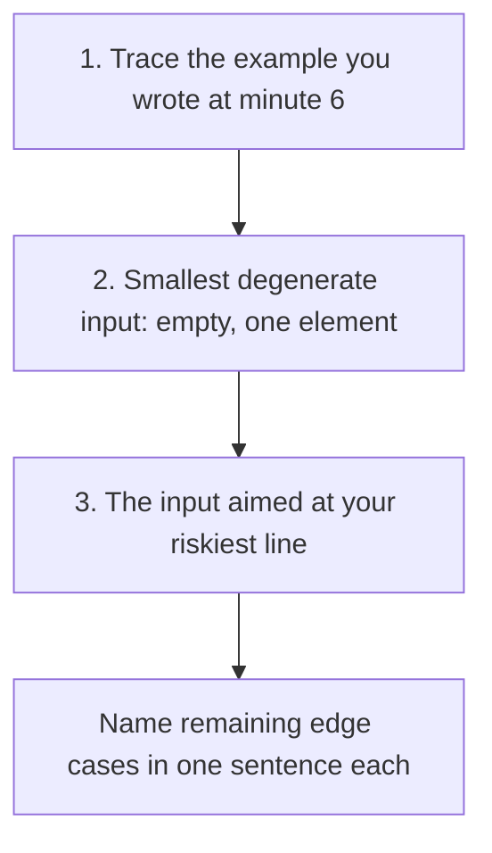

You finish typing, lean back and say "I think that works." The interviewer pauses and asks, "What does it return for an empty list?" Everything about how that question is asked tells you they saw the bug a while ago and have been waiting to find out whether you would see it too. You did not. Whatever happens next, the notes will say "bug found by interviewer", and at a senior bar that is a much worse line than "found and fixed own bug".

Testing in an interview is not a ritual that proves your code is right. It is a demonstration of a habit interviewers care about more than almost anything else: whether you check your own work before someone else has to. The [testing lesson in Foundations](/learn/foundations/problem-solving/testing-your-own-code) gives you the edge-case taxonomy and the hand-trace technique. This lesson is about using them under a clock, in front of someone: which three tests to run in which order, how to find the line most likely to be wrong, and how to handle the moment the interviewer finds a bug before you do.

## What the interviewer writes down

Most coding rubrics have a testing item, and Ascend's mock interviewer scores "testing and edge cases" as one of five dimensions. What goes into that score is more specific than "did they test":

- **Did testing start unprompted?** Waiting to be asked is a mid-level signal.
- **Were the cases chosen, or random?** "Let me try the containment case, because the end update is the riskiest line" beats trying whatever input comes to mind.
- **Who found each bug?** Interviewers record this. A bug you find and fix is close to neutral, and sometimes positive, because it shows the habit. A bug the interviewer has to point out is a clear negative.
- **Was the fix a root-cause fix?** Patching the symptom with a special case is noted.

There is also a correctness score, and testing feeds it directly. Code that has been traced on three well-chosen inputs is far more likely to be correct.

## The three-pass test order

When you have six minutes, run three passes in this order.



1. **The example.** It proves the main path and exercises most of the code. Trace it all the way to the return statement; many bugs live in the last step.
2. **The degenerate input.** Empty, a single element, or whatever is smallest. It catches crashes on `a[0]`, `max([])` and loops that assume at least one iteration.
3. **The adversarial input.** Choose it by reading your own code for risk (next section), not by picking a "hard-looking" input.

Then list the other edge cases in a sentence each, pointing to the line that handles them: "Duplicates: the `<=` on line 6 handles equal starts. Negative values: nothing here assumes sign."

## Reading your own code for risk

The best third test targets the line you are least sure of. Certain code shapes produce the same bugs again and again, so learn to spot the shape.

| Code shape | Bug it invites | Test that exposes it |
|---|---|---|
| A loop that builds groups and emits one when the group changes | The last group is never emitted | The given example traced to the very end; an input with a single group |
| `<` versus `<=` in a comparison | Equal or touching values handled wrongly | Two items equal at the boundary |
| Overwriting a running value (`end = e`) | A missing `max`/`min` | A later item that is contained in, or smaller than, the current one |
| `a[0]`, `a[-1]`, `max(a)` | A crash on empty input | Empty input |
| Binary search updates of `lo`, `hi`, `mid` | Infinite loop or off-by-one | Arrays of size 1 and 2; the target at each end |
| Two pointers moving towards each other | Skipping or double-counting | All values equal |
| Recursion | A missing base case; deep recursion | Size 0 and 1; a degenerate tree shaped like a list |
| `[[0] * n] * m` in Python | Every row is the same list | Write one cell, then read the same column in another row |
| Removing from a list while iterating over it | Skipped elements | Two adjacent elements that both need removing |
| A default mutable argument, `def f(x, acc=[])` | State leaking between calls | Call the function twice |
| `//` and `%` with negatives | Python floors toward −∞; JavaScript's `%` keeps the dividend's sign | A negative input |
| Sorting the input | Lost indices; the caller's list mutated | A test that checks indices or the caller's list afterwards |

You do not need to memorise the table. What you need is the reflex it builds: after coding, glance over your code and ask "which line would I bet against?" Then test that line.

## A worked session: four bugs in eleven lines

Here is a plausible first draft of [Merge Intervals](/practice/merge-intervals), written quickly in an interview. Touching intervals merge, per the clarification.

```python
def merge(intervals):
    intervals.sort()
    out = []
    cur_s, cur_e = intervals[0]
    for s, e in intervals[1:]:
        if s < cur_e:
            cur_e = e
        else:
            out.append([cur_s, cur_e])
            cur_s, cur_e = s, e
    return out
```

It looks reasonable. It has four bugs. Watch the three-pass order find all of them.

### Pass 1: trace the example

Input `[[1,3],[2,6],[8,10],[15,18]]`, expected `[[1,6],[8,10],[15,18]]`. Trace only the variables that change:

| Step | `(s, e)` | `s < cur_e`? | `(cur_s, cur_e)` after | `out` after |
|---|---|---|---|---|
| start | | | (1, 3) | `[]` |
| 1 | (2, 6) | 2 < 3, yes | (1, 6) | `[]` |
| 2 | (8, 10) | 8 < 6, no | (8, 10) | `[[1,6]]` |
| 3 | (15, 18) | 15 < 10, no | (15, 18) | `[[1,6],[8,10]]` |
| return | | | | `[[1,6],[8,10]]` |

The last interval is missing. The loop emits a block only when the *next* block starts, so the final block is never emitted. This is the first row of the risk table, and many candidates miss it because they stop tracing when the loop "looks right", before they reach the `return`.

Say it: "The final block never gets appended; I need to flush after the loop." Add `out.append([cur_s, cur_e])` after the loop.

### Pass 2: the degenerate input

`merge([])`: `intervals[0]` raises `IndexError`. Add `if not intervals: return []` at the top.

### Pass 3: the riskiest line

Reading the code for risk, two lines stand out: `s < cur_e` (the `<` versus `<=` shape) and `cur_e = e` (the overwritten running value). Test each one with the smallest input that exercises it.

Containment, `[[1,10],[2,3],[4,5]]`, expected `[[1,10]]`. After `(2,3)`: `2 < 10`, so `cur_e = 3`, and the block shrinks. Then `(4,5)`: `4 < 3` is false, so `[1,3]` is emitted. The output is `[[1,3],[4,5]]`. The fix is `cur_e = max(cur_e, e)`.

Touching, `[[1,2],[2,3]]`, expected `[[1,3]]`. `2 < 2` is false, so the intervals stay separate. The fix is `s <= cur_e`.

### The fix that removes a class of bug

You could apply the four patches. A better move, if you have a minute, is to restructure so that two of the bugs cannot exist: write into the last output element directly, so there is no separate "current" block to flush.

```python
def merge(intervals):
    if not intervals:
        return []
    out = []
    for s, e in sorted(intervals, key=lambda iv: iv[0]):
        if out and s <= out[-1][1]:
            out[-1][1] = max(out[-1][1], e)
        else:
            out.append([s, e])
    return out
```

No flush step, no `intervals[0]` access, and `sorted` leaves the caller's list untouched. Say why you restructured: "Keeping the current block inside `out` removes the flush-at-the-end bug entirely." Choosing code shapes that make bugs impossible is something interviewers notice. Then re-run the earlier traces quickly, because any change can break a case that passed.

Four bugs, all found by the candidate, in about five minutes. The interviewer's notes now say "traced systematically, found and fixed own bugs, including the containment case", which is a strong line.

## When you can run code

Many interviews now provide an editor that runs code, including Ascend's mock interview room. That makes testing faster and introduces a new failure mode: running the code instead of thinking about it. Two habits prevent it.

**Say what you expect before you run.** "I expect `[[1,6],[8,10],[15,18]]`." If you cannot predict the output, you do not understand your code well enough to judge the result.

**Write the cases as data, not as ad-hoc print statements.** A small table of cases takes a minute and can be re-run after every fix:

```python
cases = [
    ([[1, 3], [2, 6], [8, 10], [15, 18]], [[1, 6], [8, 10], [15, 18]]),
    ([], []),
    ([[1, 4]], [[1, 4]]),
    ([[1, 2], [2, 3]], [[1, 3]]),          # touching
    ([[1, 10], [2, 3], [4, 5]], [[1, 10]]),  # containment
]
for given, want in cases:
    got = merge([iv[:] for iv in given])
    assert got == want, (given, got, want)
print("all passed")
```

When a case fails, do not start editing at random. Read the actual and expected output, shrink the input to the smallest one that still fails, state a hypothesis ("I think the end is being overwritten rather than extended"), check it by tracing that one line, fix the cause, and re-run *all* the cases. One change per run. Shotgun edits under pressure are how a one-bug program becomes a three-bug program.

## When the interviewer finds the bug first

It will happen. How you respond is scored as much as the bug.

**Weak:**

> **Interviewer:** What does this return for `[[1,10],[2,3]]`?
>
> **Candidate:** Hmm, it should work… oh, wait. I'll add `if e < cur_e: continue` before the assignment.

The candidate patched the symptom without explaining the cause, added a special case instead of fixing the logic, and did not re-test anything else.

**Strong:**

> **Candidate:** Let me trace it. The current block is (1, 10). Then (2, 3) overlaps, and I set the end to 3, so the block shrinks. That's the bug: I'm assigning the new end instead of taking the max, so any contained interval truncates the block. The fix is `cur_e = max(cur_e, e)`. Let me re-run my first example to check nothing else moved… still `[[1,6],[8,10],[15,18]]`. That's the containment case; it should have been one of my edge cases.

The strong answer traces rather than guesses, names the root cause in a sentence, fixes the logic rather than the input, runs a regression check, and names the missed test category without grovelling. Being gracious about the catch matters too. Defensiveness ("well, it's an unusual input") costs more than the bug did.

One more cue to learn: when an interviewer points at a specific line and asks "can you walk me through this part?", they have almost always seen something there. Treat it as a hint to trace that line with a concrete input.

## Complexity is part of testing

After correctness, check the complexity of the code you actually wrote, not the one you planned. Interview code often hides an extra factor of n:

- `if x in seen` where `seen` is a list: O(n) per check, so the loop is O(n²). Use a set.
- `queue.pop(0)` on a Python list: O(n) per pop. Use `collections.deque`.
- Building a string with `s += ch` in a loop: quadratic in many languages. CPython sometimes optimises it in place, but do not rely on that; collect the pieces and `join` them.
- Slicing inside recursion (`solve(nums[1:])`): O(n) copy per call, so O(n²) overall. Pass indices.
- Sorting inside a loop.

Say it: "I said O(n log n); checking the code, the sort dominates and the loop body is O(1), so that holds."

## The two-minute version

If the clock has run down to two or three minutes, compress the protocol: trace the example at the level of "which branch fires for each item", name the three edge cases and the lines that handle them, and name the line you are least sure of. "I haven't traced the containment case; the max on line 7 is what should handle it" is honest and useful. Claiming the code is correct without testing it is neither.

## Practising

Testing is the easiest dimension to improve quickly, because it is mostly habit. In your next few mock interviews on `/interviews`, set yourself one rule: never say "I think it works". Say "let me test it" instead, and run the three passes. Then read the report's "testing and edge cases" notes and the transcript to see who found each bug. Between mocks, take solutions you have already written on the [practice list](/practice/valid-parentheses), and before running the tests, predict which of the risk-table shapes each solution contains and which input would break it.

## Senior signals

- You start testing unprompted and announce it as a phase.
- You choose test cases deliberately: the example, the degenerate case, then the case aimed at the line you trust least.
- You trace to the `return` statement, because the last step is where emit-and-flush bugs hide.
- When you fix a bug, you name the root cause, fix the logic rather than the input, and re-run earlier cases.
- You prefer code shapes that make a class of bug impossible, and say why.
- You re-check the complexity of the code as written, catching hidden linear operations inside loops.

## Check yourself

```quiz
- q: >-
    You have six minutes to test. In what order should you run your tests?
  options: ["Random inputs until one fails", "The largest input you can think of, to check performance", "The example you wrote, then the smallest degenerate input, then an input aimed at the line you trust least", "Only the edge cases, since the example obviously works"]
  answer: 2
  explanation: >-
    The example proves the main path and often exposes end-of-loop bugs; the degenerate input catches crashes; the targeted input catches the logic error you were least sure about. Skipping the example is risky because many bugs, such as a missing final flush, appear only when you trace the normal case to the return statement.
- q: >-
    Your loop emits a group whenever the next group starts. Which bug does this shape invite, and which test exposes it?
  options: ["The final group is never emitted; trace the example all the way to the return", "An off-by-one at the start; test with two elements", "Integer overflow; test with large values", "A crash on duplicates; test with all-equal values"]
  answer: 0
  explanation: >-
    If a group is only emitted when the next one begins, the last group has no successor and is never emitted unless you flush after the loop. Tracing the given example to the end usually shows it. Restructuring to write into the last output element removes the bug class entirely.
- q: >-
    The interviewer asks what your code returns for a specific input, and you realise it is wrong. What is the strongest response?
  options: ["Add an if-statement that handles that input specifically", "Trace the input, name the root cause, fix the logic, and re-run your earlier tests", "Explain that the input is unusual and unlikely in practice", "Rewrite the whole solution with a different approach"]
  answer: 1
  explanation: >-
    Interviewers score how you handle a found bug as well as the bug itself. A root-cause fix with a regression check shows the debugging habit they want. Special-casing the input or arguing about its likelihood are both clear negatives, and a full rewrite is rarely needed for a local bug.
- q: >-
    Your code runs in the interview editor. Which habit best prevents "run and pray" debugging?
  options: ["Running the code after every line you write", "Relying on the hidden tests to tell you what is wrong", "Adding print statements everywhere", "Stating the expected output before each run and changing one thing per run"]
  answer: 3
  explanation: >-
    Predicting the output shows you understand the code, and it makes a mismatch informative. One change per run keeps cause and effect clear. Constant running and scattered prints replace reasoning with trial and error, which is what the interviewer is watching for.
- q: >-
    You claimed O(n) time. Your loop body contains "if x in seen:" where seen is a Python list you append to. What is the real complexity?
  options: ["O(n)", "O(n log n)", "O(n²)", "O(1)"]
  answer: 2
  explanation: >-
    Membership testing on a list is a linear scan, and the list grows to size n, so n iterations each cost up to O(n). Switching seen to a set restores O(n) expected time. Re-checking the complexity of the code you actually wrote is part of testing.
```
