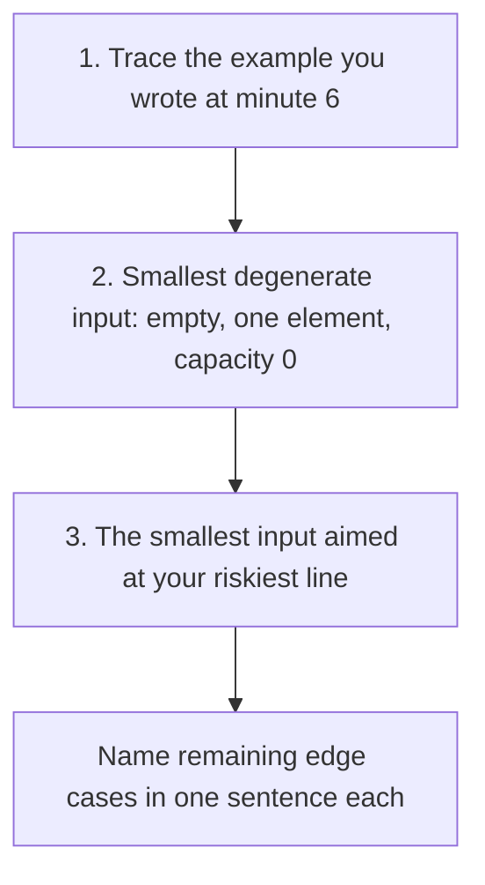

You finish typing, lean back and say "I think that works." The interviewer pauses and asks, "What does it return for an empty list?" Everything about how that question is asked tells you they saw the bug a while ago and have been waiting to find out whether you would see it too. You did not. Whatever happens next, the notes will say "bug found by interviewer", and at a senior bar that is a much worse line than "found and fixed own bug".

Testing in an interview is a demonstration of one habit: whether you check your own work before someone else has to. The [testing lesson in Foundations](/learn/foundations/problem-solving/testing-your-own-code) gives you the edge-case taxonomy and the hand-trace technique. This lesson is about using them under a clock, in front of someone: which three tests to run in which order, how to find the line most likely to be wrong, how to trace a stateful class so the bug shows up at the operation that causes it rather than three operations later, what the hidden linear costs in your code measure at, and what the interviewer writes while you do all this.

## The three-pass test order

When you have six minutes, run three passes in this order.



1. **The example.** It proves the main path and exercises most of the code. Trace it all the way to the return statement; many bugs live in the last step.
2. **The degenerate input.** Empty, a single element, capacity zero, whatever is smallest. It catches crashes on `a[0]`, `max([])`, sentinel nodes treated as data, and loops that assume at least one iteration.
3. **The adversarial input.** Choose it by reading your own code for risk (next section), and make it the *smallest* input that reaches the risky line, because every extra element is another row to trace.

Then list the other edge cases in a sentence each, pointing to the line that handles them: "Duplicates: the `<=` on line 6 handles equal starts. Negative values: nothing here assumes sign."

## Reading your own code for risk

The best third test targets the line you are least sure of. Certain code shapes produce the same bugs again and again, so learn to spot the shape.

| Code shape | Bug it invites | Test that exposes it |
|---|---|---|
| A loop that builds groups and emits one when the group changes | The last group is never emitted | The given example traced to the very end; an input with a single group |
| `<` versus `<=` in a comparison | Equal or touching values handled wrongly | Two items equal at the boundary |
| Overwriting a running value (`end = e`) | A missing `max`/`min` | A later item contained in, or smaller than, the current one |
| `a[0]`, `a[-1]`, `max(a)` | A crash on empty input | Empty input |
| Binary search updates of `lo`, `hi`, `mid` | Infinite loop or off-by-one | Arrays of size 1 and 2; the target at each end |
| Two pointers moving towards each other | Skipping or double-counting | All values equal |
| A method with an "exists already" branch (update, re-insert) | The existing-key path skips a step the new-key path does | Insert, update the same key, then force the next step (eviction, resize) |
| Sentinel or dummy nodes | A sentinel treated as data | Capacity 0, or an operation on an empty structure |
| Recursion | A missing base case; deep recursion | Size 0 and 1; a degenerate tree shaped like a list |
| `[[0] * n] * m` in Python | Every row is the same list | Write one cell, then read the same column in another row |
| Removing from a list while iterating over it | Skipped elements | Two adjacent elements that both need removing |
| `//` and `%` with negatives | Python floors toward −∞; JavaScript's `%` keeps the dividend's sign | A negative input |
| Sorting the input | Lost indices; the caller's list mutated | A test that checks indices or the caller's list afterwards |

You do not need to memorise the table. What you need is the reflex it builds: after coding, glance over the code and ask "which line would I bet against?" Then test that line.

### One shape traced: binary search on two elements

The binary-search row says "sizes 1 and 2, target at each end". Here is why. A lower-bound search, first index `i` with `nums[i] >= target`, written quickly:

```python
def lower_bound(nums, target):
    lo, hi = 0, len(nums) - 1
    while lo < hi:
        mid = (lo + hi) // 2
        if nums[mid] < target:
            lo = mid
        else:
            hi = mid
    return lo
```

`[1, 3, 3, 7]` with target 3 looks like the natural test, and it hangs; `[1, 3]` with target 3 is the smallest input that shows why:

| Iteration | `lo` | `hi` | `mid` | `nums[mid] < 3`? | Update |
|---|---|---|---|---|---|
| 1 | 0 | 1 | 0 | 1 < 3, yes | `lo = 0` |
| 2 | 0 | 1 | 0 | yes | `lo = 0` |

Row 2 equals row 1, so the loop never ends: with two elements `mid` rounds down to `lo`, and `lo = mid` makes no progress. The fix is `lo = mid + 1`, which is safe because `nums[mid] < target` rules `mid` out. Then the other end, `[1, 3]` with target 5: `mid = 0`, `lo = 1`, loop exits, returns 1, but the answer is 2 (past the end), because `hi` started at `len(nums) - 1` and the range never contained 2. Fix: `hi = len(nums)`. Two bugs, both found by two-row traces, neither by the four-element example that merely hangs. The [binary search lesson](/learn/algorithms/sorting-searching/binary-search) derives the invariant that makes both fixes forced rather than guessed.

## Session 1: four bugs in eleven lines

A plausible first draft of [Merge Intervals](/practice/merge-intervals), written quickly. Touching intervals merge, per the clarification.

```python
def merge(intervals):
    intervals.sort()
    out = []
    cur_s, cur_e = intervals[0]
    for s, e in intervals[1:]:
        if s < cur_e:
            cur_e = e
        else:
            out.append([cur_s, cur_e])
            cur_s, cur_e = s, e
    return out
```

It has four bugs. The three-pass order finds all of them.

### Pass 1: trace the example

Input `[[1,3],[2,6],[8,10],[15,18]]`, expected `[[1,6],[8,10],[15,18]]`. Trace only the variables that change:

| Step | `(s, e)` | `s < cur_e`? | `(cur_s, cur_e)` after | `out` after |
|---|---|---|---|---|
| start | | | (1, 3) | `[]` |
| 1 | (2, 6) | 2 < 3, yes | (1, 6) | `[]` |
| 2 | (8, 10) | 8 < 6, no | (8, 10) | `[[1,6]]` |
| 3 | (15, 18) | 15 < 10, no | (15, 18) | `[[1,6],[8,10]]` |
| return | | | | `[[1,6],[8,10]]` |

The last interval is missing. The loop emits a block only when the *next* block starts, so the final block is never emitted. Candidates miss it because they stop tracing when the loop "looks right", before the `return`. Say it: "The final block never gets appended; I need to flush after the loop."

### Pass 2: the degenerate input

`merge([])`: `intervals[0]` raises `IndexError`. Add `if not intervals: return []`.

### Pass 3: the riskiest lines

Two lines stand out: `s < cur_e` (the `<` versus `<=` shape) and `cur_e = e` (the overwritten running value). Test each with the smallest input that reaches it.

Containment, `[[1,10],[2,3],[4,5]]`, expected `[[1,10]]`. After `(2,3)`: `2 < 10`, so `cur_e = 3` and the block shrinks. Then `4 < 3` is false, so `[1,3]` is emitted. Fix: `cur_e = max(cur_e, e)`.

Touching, `[[1,2],[2,3]]`, expected `[[1,3]]`. `2 < 2` is false, so they stay separate. Fix: `s <= cur_e`.

### The fix that removes a class of bug

Instead of four patches, restructure so two of the bugs cannot exist: write into the last output element, so there is no separate "current" block to flush.

```python
def merge(intervals):
    out = []
    for s, e in sorted(intervals, key=lambda iv: iv[0]):
        if out and s <= out[-1][1]:
            out[-1][1] = max(out[-1][1], e)
        else:
            out.append([s, e])
    return out
```

No flush step, no `intervals[0]`, and `sorted` leaves the caller's list untouched. Say why: "Keeping the current block inside `out` removes the flush bug entirely." Then re-run the earlier traces, because any change can break a case that passed.

## Session 2: a stateful class, where the return values lie late

Stateful classes hide bugs differently. A wrong line corrupts the *structure*, and the return values only go wrong several operations later. Here is an [LRU Cache](/practice/lru-cache) whose author thought about updates for the eviction check and forgot them everywhere else.

```python
class Node:
    __slots__ = ("key", "val", "prev", "next")
    def __init__(self, key=0, val=0):
        self.key, self.val = key, val
        self.prev = self.next = None

class LRUCache:
    def __init__(self, capacity):
        self.cap = capacity
        self.map = {}                                 # key -> node
        self.head, self.tail = Node(), Node()         # head.next is least recent
        self.head.next, self.tail.prev = self.tail, self.head

    def _unlink(self, node):
        node.prev.next, node.next.prev = node.next, node.prev

    def _append(self, node):                          # insert before tail: most recent
        node.prev, node.next = self.tail.prev, self.tail
        self.tail.prev.next = node
        self.tail.prev = node

    def get(self, key):
        node = self.map.get(key)
        if node is None:
            return -1
        self._unlink(node)
        self._append(node)
        return node.val

    def put(self, key, value):
        if len(self.map) == self.cap and key not in self.map:
            lru = self.head.next
            self._unlink(lru)
            del self.map[lru.key]
        node = Node(key, value)                       # existing key gets a second node
        self.map[key] = node
        self._append(node)
```

### Choosing the tests

The degenerate pass is capacity 0: `LRUCache(0).put(1, 1)` finds `len(map) == cap`, treats `head.next`, which is the tail sentinel, as the least recently used node, and crashes with `AttributeError` inside `_unlink`. That is the sentinel row of the risk table; the fix is `if self.cap <= 0: return` at the top of `put`.

For the adversarial pass, read `put` for risk. It has two cases, new key and existing key, but only the first line distinguishes them. So the risky path is the existing key, and the smallest input that reaches it and then exercises the consequence is: fill the cache, update one key, force an eviction, read both keys.

### Tracing state, not only returns

Capacity 2. The trace records the map's keys and the list from least to most recent after every operation, plus one invariant: every node in the list is the one the map points to, and there are as many nodes as keys.

| # | Operation | Returns (expected) | Map keys | List, LRU → MRU | Invariant |
|---|---|---|---|---|---|
| 1 | `put(1, 1)` | | {1} | 1:1 | holds |
| 2 | `put(2, 2)` | | {1, 2} | 1:1, 2:2 | holds |
| 3 | `put(1, 10)` | | {1, 2} | 1:1 (stale), 2:2, 1:10 | **3 nodes, 2 keys** |
| 4 | `put(3, 3)` | | {2, 3} | 2:2, 1:10 (orphan), 3:3 | broken |
| 5 | `get(2)` | 2 (−1) | {2, 3} | 1:10 (orphan), 3:3, 2:2 | broken |
| 6 | `get(1)` | −1 (10) | {2, 3} | unchanged | broken |
| 7 | `get(3)` | 3 (3) | {2, 3} | 1:10 (orphan), 2:2, 3:3 | broken |
| 8 | `put(4, 4)` | `KeyError: 1` | | | |

Row 3 is the cause: the update appended a second node for key 1 and left the old one in the list. Row 4 is where it bites: eviction took the stale `1:1` node from the front and ran `del self.map[1]`, deleting the entry for the *live* node `1:10`. The returns first go wrong at row 5 (key 2 should have been evicted), again at row 6 (key 1 was lost), and the program crashes at row 8 when the orphan reaches the front and its map entry no longer exists. One root cause, three symptoms, two to five operations after the line that caused them.

A candidate who traces only returns finds "get(2) returned 2" and starts looking at eviction, which is where the damage landed, not where it began. A candidate who traces the list sees three nodes for two keys at row 3 and fixes the right line: in `put`, look the key up first; if it exists, update the value, unlink and append, and return.

There is a second lesson in this trace. The simpler bug "update the value in place but forget to move it to the end" produces exactly the same outputs at rows 5 to 7: 2, −1, 3. Return values alone cannot tell the two root causes apart; the list column can.

### The invariant as a test

With an editor that runs code, turn the invariant column into a function and call it after every operation of every test:

```python
def check(cache):
    count, node = 0, cache.head.next
    while node is not cache.tail:
        assert cache.map.get(node.key) is node, f"stale node for key {node.key}"
        count, node = count + 1, node.next
    assert count == len(cache.map) <= cache.cap, (count, len(cache.map))
```

Run on the buggy class, it fails at operation 3 with `stale node for key 1`, two operations before the first wrong return value. Writing it takes about two minutes, and saying "I'm checking the structure after each operation, not only the answers" is a strong line on its own.

## How long hand-tracing takes

No one has measured your tracing speed but you, so treat these as orders of magnitude and time yourself in a mock. Tracing one loop iteration aloud with two or three changing variables takes roughly 10 to 20 seconds; one row of a stateful trace with a map and a list takes 20 to 40 seconds; typing each row into a comment roughly doubles either. The cost depends on the number of variables per row, whether the code is fresh in your head, and whether you are tracing what is on the screen (slow, correct) or what you meant to write (fast, useless).

With a six-minute testing phase, that is a budget of about 15 to 25 spoken rows. The Merge Intervals example is five rows, the degenerate case one, and each risky-line input three or four: about 13 rows, which fits. The LRU trace above is eight rows of state, three to five minutes on its own. That arithmetic is why pass 3 uses the smallest input that reaches the line, and why a stateful class gets one long sequence rather than several.

## When you can run code

Many interviews provide an editor that runs code, including Ascend's mock interview room. That makes testing faster and adds a failure mode: running the code instead of thinking about it. Two habits prevent it.

**Say what you expect before you run.** "I expect `[[1,6],[8,10],[15,18]]`." If you cannot predict the output, you do not understand the code well enough to judge the result.

**Write the cases as data** so they re-run after every fix:

```python
cases = [
    ([[1, 3], [2, 6], [8, 10], [15, 18]], [[1, 6], [8, 10], [15, 18]]),
    ([], []),
    ([[1, 4]], [[1, 4]]),
    ([[1, 2], [2, 3]], [[1, 3]]),            # touching
    ([[1, 10], [2, 3], [4, 5]], [[1, 10]]),  # containment
]
for given, want in cases:
    got = merge([iv[:] for iv in given])
    assert got == want, (given, got, want)
print("all passed")
```

When a case fails, do not edit at random. Read actual against expected, shrink to the smallest failing input, state a hypothesis ("the end is being overwritten rather than extended"), check it by tracing that one line, fix the cause, and re-run *all* the cases. One change per run.

With time left, a **randomised differential test** compares your code against a brute force you trust on hundreds of small random inputs:

```python
import random

def merge_brute(intervals):                        # O(n^3), slow but easy to trust
    ivs = [list(iv) for iv in intervals]
    changed = True
    while changed:
        changed = False
        for i in range(len(ivs)):
            for j in range(i + 1, len(ivs)):
                a, b = ivs[i], ivs[j]
                if a[0] <= b[1] and b[0] <= a[1]:  # overlap or touch
                    ivs[i] = [min(a[0], b[0]), max(a[1], b[1])]
                    del ivs[j]
                    changed = True
                    break
            if changed:
                break
    return sorted(ivs)

rng = random.Random(0)
for trial in range(2000):
    ivs = [[s, s + rng.randint(0, 4)] for s in (rng.randint(0, 10) for _ in range(rng.randint(0, 6)))]
    assert merge([iv[:] for iv in ivs]) == merge_brute(ivs), ivs
print("2000 random cases agree")
```

Measured against single-bug variants of `merge` over 20 random seeds, this loop found the touching bug (`<` for `<=`) within 13 trials every time and the containment bug (no `max`) within 19. Small value ranges (starts 0 to 10, lengths 0 to 4) are what make it fast: collisions and touching endpoints happen constantly.

## When the interviewer finds the bug first

It will happen. How you respond is scored as much as the bug.

**Weak:**

> **Interviewer:** What does this return for `[[1,10],[2,3]]`?
>
> **Candidate:** Hmm, it should work… oh, wait. I'll add `if e < cur_e: continue` before the assignment.

The candidate patched the symptom, added a special case instead of fixing the logic, and re-tested nothing.

**Strong:**

> **Candidate:** Let me trace it. The block is (1, 10). Then (2, 3) overlaps and I set the end to 3, so the block shrinks. I'm assigning the new end instead of taking the max, so any contained interval truncates the block. Fix: `cur_e = max(cur_e, e)`. Re-running my first example… still `[[1,6],[8,10],[15,18]]`. Containment should have been one of my edge cases.

The strong answer traces rather than guesses, names the root cause in a sentence, fixes the logic rather than the input, runs a regression check, and names the missed test category without grovelling. Defensiveness ("that's an unusual input") costs more than the bug did.

Interviewers rarely say "there is a bug". They signal it, and the signal tells you how close they are to writing it down:

| Cue | What it usually means | Your move |
|---|---|---|
| "How would you test this?" | Testing has not started and they want to see it | Start the three passes now; do not ask which case they mean |
| "What happens if the list is empty?" | They have seen a specific failure | Trace exactly that input aloud, then fix |
| "Can you walk me through this part?" (pointing) | The bug is on or near that line | Trace that line with the smallest concrete input |
| "Are you sure about the `<`?" | They are one step from telling you | Test the boundary case at once; name the root cause |
| "Let's move on" with a bug still present | They have recorded it | Say "one known issue: containment; the fix is a max on line 5" in a sentence |

The last row matters. A bug you name and cannot fix in time reads far better than one you never mention, because the note becomes "identified remaining bug and its fix" rather than "left bug in code".

## Complexity is part of testing, measured

After correctness, check the complexity of the code you wrote, not the one you planned. Interview code often hides an extra factor of n. Measured on CPython 3.14 on a Ryzen 9 9950X3D desktop under WSL2 (best of three; a laptop is slower, and the ratios are what matter):

| Hidden cost | n | Slow version | Fixed version | When n doubles |
|---|---|---|---|---|
| Dedupe with `if x not in seen_list` | 10⁴ / 2 × 10⁴ | 0.188 s / 0.769 s | set: 0.3 ms / 0.5 ms | × 4.1: quadratic |
| Drain a queue with `list.pop(0)` | 10⁵ / 2 × 10⁵ | 0.21 s / 0.93 s | `deque.popleft()`: 2.2 ms / 4.9 ms | × 4.5 |
| Build a string by prepending, `s = ch + s` | 10⁵ / 2 × 10⁵ | 0.042 s / 0.156 s | collect parts, `"".join`: 0.9 ms at 10⁵ | × 3.7 |
| `s += ch` while another name holds `s` | 10⁵ | 0.043 s | `s += ch` with no other reference: 1.6 ms | quadratic |
| Recurse on `nums[1:]` | 2,000 / 4,000 / 8,000 | 5.9 / 41 / 178 ms | pass an index: 0.19 / 0.39 / 0.81 ms | × 4 to 7 |

A fourfold increase when n doubles is the signature of O(n²): each operation does work proportional to what is left. `pop(0)` and the list scan are the textbook cases. The string rows need the mechanism. CPython can extend a string in place when the only reference to it is the variable being assigned, so a bare `s += ch` loop is linear; any second reference (an alias, a list that holds it, a debugger watch) forces a full copy per step, and prepending always copies. Do not rely on that optimisation; collect parts and `join`.

Node 24 on the same machine: `Array.prototype.shift()` drained 10⁵ and 2 × 10⁵ elements in 0.21 s and 0.94 s, matching `pop(0)` almost to the millisecond, because both move every remaining slot down one position per call; a head index made it 2.4 ms. `includes` on an array was 20 ms at 10⁴ against 0.5 ms for `Set.has`, and `slice(1)` recursion was quadratic (0.7, 9.9, 68 ms). String building went the other way: V8 represents concatenations as ropes, so both `s += ch` and `s = ch + s` were linear (4.8 and 10.8 ms at 10⁶). Here the language changes the answer, which is worth one sentence in the round. [Amortised analysis](/learn/foundations/complexity/amortized-analysis) covers why `append` is O(1) and `pop(0)` is not.

Say the check aloud: "I said O(n log n); in the code, the sort dominates and the loop body is O(1), so that holds."

## The two-minute version

With two or three minutes left, compress: trace the example at the level of "which branch fires for each item", name the three edge cases and the lines that handle them, and name the line you are least sure of. "I haven't traced the containment case; the `max` on line 5 is what should handle it" is honest and useful. Claiming the code is correct without testing it is neither.

## Choosing a technique

| Technique | Time in the round | Catches | Needs execution | Reads as |
|---|---|---|---|---|
| Trace the example to the return | 1–2 min | Main-path and end-of-loop bugs | No | The minimum |
| Smallest input aimed at the riskiest line | 30–60 s each | Boundaries, overwritten values, empty input | No | "chose tests deliberately" |
| Cases as data, re-run after each fix | 1 min to write, seconds per run | Regressions from your own fixes | Yes | "systematic" |
| Invariant check after every operation | About 2 min | State corruption at the operation that causes it | Helps; can be done by hand | Senior, on stateful problems |
| Randomised differential against a brute force | 3–4 min | Anything the brute force gets right | Yes | Senior, if time allows after the above |

## Under the hood: how testing is graded

Many rubrics have a testing item (Ascend's mock interviewer scores "testing and edge cases" 1 to 5 and quotes moments as evidence), and it is fed by facts that are easy to write down with a timestamp. The [45-minute protocol](/learn/interview-patterns/interview-execution/the-45-minute-protocol) has the general phrase vocabulary; what matters here is how the testing lines are produced. Two plausible sets of notes on the Merge Intervals draft:

```text
Candidate A
14:00  "let me test" - unprompted
14:10  traced example to the return; found missing flush (own)
15:20  empty input -> IndexError (own); guard added
16:00  containment case "because end = e is the line I trust least" -> found (own)
16:40  touching case -> < vs <= (own); restructured to write into out[-1]
17:30  re-ran all four cases after restructuring
       4 bugs, 4 found by candidate

Candidate B
14:00  "I think that works"
14:30  I asked about the empty list -> IndexError, added a guard
15:30  I asked [[1,10],[2,3]] -> added `if e < cur_e: continue`
16:30  did not re-run the example; flush bug still present at end of round
```

In the debrief the testing rating is argued from four facts, in roughly this order of weight, as commonly reported. **Who found each bug**: candidate-found bugs are close to neutral and often positive, because they show the habit; interviewer-found bugs are negative. **Where the bug was**: a missed bug on the main path (Candidate B's flush, which breaks the example itself) weighs more than one on an exotic edge. **Whether the fix was a root-cause fix**: a special case for the reported input is recorded as such. **What state the code was left in**: "known bug still present at end" is the heaviest line, because it says the candidate stopped checking. Candidate A and Candidate B wrote the same eleven lines. A's write-up says "tested unprompted with chosen cases, found all four of own bugs, root-cause fixes"; B's says "bugs found by interviewer, patch-style fixes, did not re-test". The code was not the difference.

On platforms that run a hidden suite after the round, the pass count often goes into the notes too ("7/9 hidden tests"), and a failing hidden test on a case the candidate named but did not trace reads worse than one on a case nobody mentioned.

When the editor runs code, the notes gain a second kind of line, about *how* the runs were used:

```text
Candidate C (execution enabled)
15:10  predicted output before first run; matched
15:40  wrote 5 cases as data incl. touching + containment
16:05  containment failed -> shrank to [[1,10],[2,3]], said "end overwritten", fixed max, re-ran all
       3 runs total, one change per run

Candidate D (execution enabled)
15:10  ran without predicting; output wrong
15:10-19:30  11 runs; 2-3 edits between runs; added prints; reverted twice
19:40  passes visible cases; could not say why the last edit fixed it
```

D may end with correct code and still collect "trial-and-error debugging" and "could not explain fix", which pull the testing and communication ratings down together. The number of runs is not the problem; unexplained change between runs is.

## Failure modes

**Symptom: "bug found by interviewer", although the candidate did test.** Diagnosis: only the example was traced, and the example does not reach the risky line (most examples have no containment and no touching endpoints). Fix: the third pass, chosen from the risk table, with the smallest input that reaches the line.

**Symptom: the trace says the code is correct, and the code is wrong.** Diagnosis: the trace followed what the candidate meant, not what is on the screen: `<` read as `<=`, or a variable given a value the code never assigns. Fix: read each value off the screen, write the row in a comment, and point at the line you are executing as you say it.

**Symptom: a fix breaks a case that passed earlier.** Diagnosis: no regression run; the second edit was made while the first was still being tested. Fix: cases as data, one change per run, re-run all of them.

**Symptom: a stateful class passes each single-operation check but fails a sequence, and the failure seems to be in unrelated code.** Diagnosis: only return values were traced, so the corruption (a stale node, a count that drifted) was invisible until it reached a return two or more operations later. Fix: trace the state per operation and state the invariant; with execution, run a `check` after every operation.

**Symptom: testing takes ten minutes and the follow-up is never reached.** Diagnosis: a large input traced with every variable, or several long sequences on a class. Fix: budget 15 to 25 spoken rows; smallest inputs; only the variables that change.

## Interviewer follow-ups

**"If you had an hour, how would you test this properly?"** Model answer: a randomised differential test against a brute force on small value ranges, plus property checks (output sorted, pairwise disjoint and non-touching, same points covered); measured on Merge Intervals, it caught each single bug within 19 random trials. Common wrong answer: "write more examples by hand", which scales linearly with effort and misses the cases you did not think of.

**"What's the invariant of your LRU structure, and how would you check it?"** Model answer: every node in the list is the node the map holds for its key, the list and map have the same size, the size is at most the capacity, and the list order is recency order; the first three can be asserted after every operation. Common wrong answer: "`get` returns the right value", which is a consequence of the invariant and, as the trace shows, lags the corruption by several operations.

**"Your tests pass. How confident are you?"** Model answer: confident on the example, empty, touching and containment cases because each was traced; not yet on negative starts or duplicates, and not on performance at 10⁵, which the complexity argument covers but no run has checked. Common wrong answer: "a hundred percent", which the interviewer then tests.

**"You never tried a large input. Why not?"** Model answer: large inputs cannot be traced by hand and rarely find logic bugs; scale is covered by the complexity check of the written code; with execution available, I would time n = 10⁵ against the budget. Common wrong answer: running a large input and reading the output, which proves nothing if you cannot say what it should be.

**"Which of your tests would you keep in CI?"** Model answer: the ones aimed at bug classes, each labelled (touching, containment, empty, update-then-evict), plus the differential test with a fixed seed so a failure is reproducible. Common wrong answer: the example alone, which is the test least likely to catch a regression.

## What mid-level engineers get wrong

- **Stopping the trace before the `return`.** The emit-on-change loop looks correct until the final line; the missing flush is found by the interviewer.
- **Testing whatever input comes to mind.** "Let me try `[[5,7],[1,2]]`" exercises no risky line; the interviewer's containment case then finds the bug.
- **Tracing return values of a stateful class and ignoring the state.** The stale node at operation 3 goes unseen, and the fix goes into eviction, where the damage landed.
- **Patching the reported input.** `if e < cur_e: continue` fixes one case and leaves the root cause; the write-up says "patch-style fix".
- **Editing several things between runs.** Two changes and one new failure: which one caused it is now a guess.
- **Claiming O(n) with `x in list` in the loop.** At 2 × 10⁴ the measured dedupe was 0.77 s against 0.5 ms with a set, and a hidden test at 10⁵ times out.

## Practising

Testing is the easiest dimension to improve quickly, because it is mostly habit. In your next few mock interviews on `/interviews`, set one rule: never say "I think it works"; say "let me test it" and run the three passes. Afterwards, read the transcript and mark who found each bug and at which minute; that pair of facts is what the testing rating is argued from. Between mocks, take solutions you have already written on the practice list, such as [Valid Parentheses](/practice/valid-parentheses) and [LRU Cache](/practice/lru-cache), and before running any tests, predict which risk-table shapes each solution contains and write the smallest input that would break each one. Then time yourself tracing one of them aloud: the number of seconds per row you measure is the number to plan your testing phase with.

## Exercise

```exercise
id: merge-intervals-hidden-cases
title: Merge intervals that survive the risky-line tests
prompt: |
  Given a list of intervals [start, end] with start <= end, merge every pair
  that overlaps or touches (so [1, 2] and [2, 3] become [1, 3]) and return
  the merged intervals sorted by start. The input may be unsorted and may be
  empty. Do not modify the caller's list.

  Before running, write down which line of your code handles each of these:
  touching endpoints, an interval contained in another, and empty input.
  The hidden tests aim at exactly those lines.
languages: [python, javascript]
entry: merge
starter:
  python: |
    def merge(intervals):
        # your code here
        return []
  javascript: |
    function merge(intervals) {
      // your code here
      return [];
    }
tests:
  - args: [[[1, 3], [2, 6], [8, 10], [15, 18]]]
    expected: [[1, 6], [8, 10], [15, 18]]
  - args: [[]]
    expected: []
    label: empty input
  - args: [[[1, 4]]]
    expected: [[1, 4]]
    label: single interval
  - args: [[[5, 6], [1, 2], [3, 4]]]
    expected: [[1, 2], [3, 4], [5, 6]]
    label: unsorted and disjoint
  - args: [[[1, 2], [2, 3]]]
    expected: [[1, 3]]
    hidden: true
    label: touching endpoints merge
  - args: [[[1, 10], [2, 3], [4, 5]]]
    expected: [[1, 10]]
    hidden: true
    label: containment keeps the larger end
  - args: [[[2, 3], [1, 10], [2, 2], [11, 12]]]
    expected: [[1, 10], [11, 12]]
    hidden: true
    label: containment after sorting, zero-length interval
hints:
  - "Sort a copy by start, then compare each interval with the last one in the output."
  - "Overlap-or-touch is start <= last_end, not start < last_end."
  - "Extend with max(last_end, end): a contained interval must not shrink the block."
```

## Senior signals

- You start testing unprompted and announce it as a phase.
- You choose test cases deliberately: the example, the degenerate case, then the smallest input aimed at the line you trust least.
- You trace to the `return`, because the last step is where emit-and-flush bugs hide.
- On a stateful class you trace the state and state the invariant, so the bug is found at the operation that causes it.
- When you fix a bug, you name the root cause, fix the logic rather than the input, and re-run earlier cases.
- You prefer code shapes that make a class of bug impossible, and say why.
- You re-check the complexity of the code as written and know what the hidden linear costs measure at, including where the language changes the answer (V8's string ropes, CPython's in-place concatenation).

## Check yourself

```quiz
- q: >-
    An LRU cache's put appends a new node for an existing key without unlinking the old one. Tracing only return values, when does the bug first become visible in the sequence put(1,1), put(2,2), put(1,10), put(3,3), get(2), get(1)?
  options: ["At get(2), two operations after the cause", "Never, since every return value is right", "At put(3,3), since eviction then raises", "At put(1,10), the operation with the bug"]
  answer: 0
  explanation: >-
    put(1,10) leaves three nodes for two keys, but returns nothing. put(3,3) evicts the stale node and deletes the live map entry for key 1, also silently. The first wrong return is get(2), which returns 2 instead of -1. Tracing the state (map keys and list order) or asserting that list size equals map size exposes the bug at put(1,10) itself.
- q: >-
    Draining a Python list with pop(0) took 0.21 s at n = 10⁵ and 0.93 s at n = 2 × 10⁵. What does the ratio tell you?
  options: ["The loop is n log n, since the list re-sorts itself", "The loop is linear, with a large constant factor", "The timings are noise; the loop is O(1) per pop", "The loop is quadratic: each pop shifts the rest"]
  answer: 3
  explanation: >-
    Doubling n multiplied the time by about 4.5, the signature of O(n²): each pop(0) moves every remaining pointer down one slot, so n pops move about n²/2 slots. deque.popleft measured 2.2 ms and 4.9 ms, a factor of about two, which is linear.
- q: >-
    In CPython 3.14, s += ch in a loop measured 1.6 ms at n = 10⁵ but 43 ms when another variable also referred to s. Why?
  options: ["Aliased strings are interned, and interning is slow", "The garbage collector runs on every aliased step", "A second reference blocks the in-place resize", "The alias forces s to be re-encoded as UTF-16"]
  answer: 2
  explanation: >-
    CPython can grow a string in place when the variable being assigned holds the only reference; any other reference forces a full copy on each step, which is quadratic. That is why the advice is to collect parts and join rather than rely on the optimisation. In V8 both appending and prepending were linear, because concatenation builds ropes.
- q: >-
    You have six minutes to test Merge Intervals. Which third input gives the most value per traced row?
  options: ["A 10⁵-element input to check the speed", "[[1,10],[2,3]], aimed at the end-update line", "A random list of 30 intervals from your head", "The example again, traced more slowly"]
  answer: 1
  explanation: >-
    Spoken tracing costs roughly 10 to 20 seconds a row, so six minutes is about 15 to 25 rows. The two-interval containment case reaches the riskiest line (end = e instead of a max) in two rows. A 30-interval list costs 30 rows and reaches no specific line; a 10⁵ input cannot be traced by hand, and scale is covered by the complexity check.
- q: >-
    The interviewer asks what your merge returns for [[1,10],[2,3]], and it is wrong. What is the strongest response?
  options: ["Rewrite the whole solution using another approach", "Point out the input is unusual and unlikely to occur", "Add an if-statement for that particular input", "Trace it, fix the root cause, re-run earlier cases"]
  answer: 3
  explanation: >-
    How a found bug is handled is recorded alongside the bug. Tracing, naming the root cause (assigning the end instead of taking the max), fixing the logic and running a regression check show the habit interviewers want. A special case is noted as a patch-style fix, arguing about the input reads as defensive, and a rewrite is rarely needed for a local bug.
- q: >-
    With time left and an editor that runs code, why add a randomised test that compares merge against a brute force on small value ranges?
  options: ["Interviewers score the number of tests that ran", "Small ranges hit touching and nested cases often", "Random inputs find performance problems quickly", "It replaces the need to trace the example by hand"]
  answer: 1
  explanation: >-
    With starts from 0 to 10 and lengths from 0 to 4, collisions, touching endpoints and containment occur constantly; measured over 20 seeds, the loop caught the touching bug within 13 trials and the containment bug within 19. It checks logic, not speed, and it complements the hand trace rather than replacing it, because you still need to predict what correct output looks like.
```
