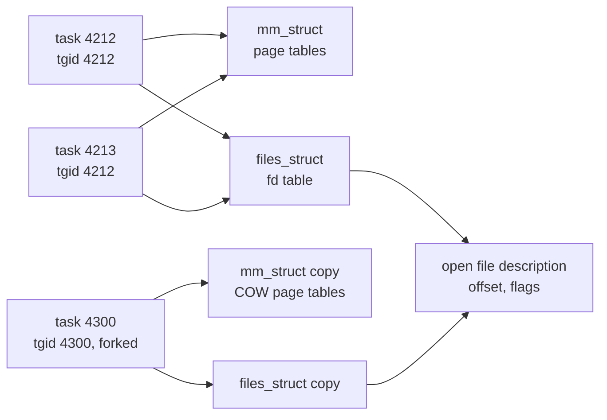

Your API server handles 2,000 requests per second on an 8-core box at 40% CPU. You double the traffic. CPU goes to 95%, but throughput only reaches 3,100 requests per second and p99 latency triples. Nothing in your code is slow. What changed is that the kernel is now spending a meaningful fraction of every core deciding which of your 400 threads runs next, and each of those decisions throws away the cache state the previous thread built up.

The precise model is short: one kernel structure, a handful of flags that say what is shared, a page-table trick that makes `fork` cheap until it is not, and a scheduler whose fairness rule you can trace by hand. Every number below was measured on a Ryzen 9 9950X3D running Linux 6.18 under WSL2, and the lesson says where the virtual machine changes the answer.

## A process is an address space plus resources

A process is the kernel's unit of isolation. It owns:

- An **address space**: a private mapping from virtual addresses to physical memory (the [next lesson](/learn/systems/operating-systems/virtual-memory) covers how). Two processes can both use address `0x7ffd1000` and they refer to different bytes of RAM.
- A table of **file descriptors**: small integers that index open files, sockets, pipes and devices.
- **Credentials** (user, group, capabilities), a working directory, signal handlers, resource limits, namespaces and a cgroup.
- One or more **threads**.

The address space makes processes safe from each other: a wild pointer in one cannot corrupt another. The price is that sharing data between processes goes through the kernel (pipes, sockets, shared-memory segments), at least one copy and often one system call per exchange.

## A thread is a schedulable stack inside a process

A thread is the kernel's unit of *execution*. It has its own:

- **User stack**: 8 MiB of reserved address space by default for glibc threads, backed by physical pages only as they are touched.
- **Kernel stack**: 16 KiB on x86-64, used while the thread is inside a system call or an interrupt.
- **Register state**, including the instruction pointer, the stack pointer and the thread-local-storage base register (`fs` on x86-64).
- **Scheduling state**: runnable, running, sleeping, a weight and the CPUs it may run on.

Everything else, most importantly the heap and the global variables, is shared with every other thread in the process. That is the reason threads exist and the reason they are dangerous.

```viz
{"type": "memory", "algorithm": "stack-heap", "values": [4, 8, 15],
 "title": "Each thread has its own stack; every thread sees the same heap",
 "caption": "Stack frames are private to the thread that pushed them. Anything reachable through a heap pointer is visible to every thread in the process, which is what makes sharing cheap and races possible."}
```

## Under the hood: one task_struct, many clone flags

Linux has no separate "process" and "thread" objects. It has one structure, `struct task_struct` (several kilobytes, the exact size depends on the kernel configuration), per schedulable entity. The fields that matter here are pointers to separately reference-counted resources:

| `task_struct` field | Points to | Holds |
|---|---|---|
| `mm` | `struct mm_struct` | The address space: the list of mapped regions and the root of the page tables (`pgd`) |
| `files` | `struct files_struct` | The file descriptor table |
| `fs` | `struct fs_struct` | Current directory, root directory, umask |
| `sighand`, `signal` | Handler table, shared signal state | Signal dispositions, pending process-wide signals |
| `cred` | `struct cred` | UIDs, GIDs, capabilities |
| `nsproxy`, `cgroups` | Namespaces, cgroup set | What the task can see, what it is charged to |
| `se` | `struct sched_entity` (embedded) | Weight and virtual runtime for the scheduler |
| `thread` | `struct thread_struct` (embedded) | Saved kernel stack pointer and segment bases during a switch |
| `pid`, `tgid` | Integers | The task's own ID, and its thread group's ID |

## Clone flags decide what is shared

Creating a task is `clone()`, and its flags decide, pointer by pointer, whether the child *shares* the parent's structure (bumps a reference count) or gets a *copy*. Here is `strace` on this machine, catching CPython 3.14 starting a thread and then calling `os.fork()`:

```text
clone3({flags=CLONE_VM|CLONE_FS|CLONE_FILES|CLONE_SIGHAND|CLONE_THREAD|CLONE_SYSVSEM|
        CLONE_SETTLS|CLONE_PARENT_SETTID|CLONE_CHILD_CLEARTID,
        stack=0x7a391e8de000, stack_size=0x7fff80, tls=0x7a391f0de6c0}) = 515106
clone(child_stack=NULL, flags=CLONE_CHILD_CLEARTID|CLONE_CHILD_SETTID|SIGCHLD) = 515107
```

`CLONE_VM` shares `mm` (same address space, same page tables). `CLONE_FILES` shares the descriptor table, so a socket opened by one thread is usable by all. `CLONE_FS` and `CLONE_SIGHAND` share the directory state and handler table. `CLONE_THREAD` puts the child in the parent's thread group, so `getpid()` returns the group ID (`tgid`) in both and `gettid()` returns the task's own ID. `CLONE_SETTLS` loads the new thread's `fs` base, which is how thread-local variables work. The glibc-allocated stack (`stack_size=0x7fff80`, 8 MiB minus a guard page) is passed in from user space. `CLONE_CHILD_CLEARTID` tells the kernel to zero a word and wake a futex on it when the thread exits, and that futex is what `pthread_join` sleeps on.

The second line is `fork`: no sharing flags at all, only `SIGCHLD` as the exit signal. Every resource is copied. Container runtimes use a third set of flags on the same call: `CLONE_NEWPID`, `CLONE_NEWNS`, `CLONE_NEWNET` and friends give the child new namespaces. CPython's `subprocess` uses a fourth variant, `vfork` (`CLONE_VM|CLONE_VFORK`), which lends the child the parent's address space until it calls `execve`.

This is why `ps -eLf` and `top -H` list threads individually, each with its own ID.



The last arrow is worth staring at: after `fork` the descriptor *table* is copied, but each entry points at the same kernel open file description, so parent and child share file offsets.

## The same bug in three languages

Sharing the address space is what makes this code wrong:

```python
import threading

counter = 0
def work():
    global counter
    for _ in range(100_000):
        counter += 1          # load, add, store: three steps on shared memory

threads = [threading.Thread(target=work) for _ in range(4)]
for t in threads: t.start()
for t in threads: t.join()
print(counter)                # can be < 400000; free-threaded builds lose updates far more often
```

```go
package main

import (
	"fmt"
	"sync"
)

func main() {
	var counter int
	var wg sync.WaitGroup
	for i := 0; i < 4; i++ {
		wg.Add(1)
		go func() { // a goroutine, multiplexed onto OS threads
			defer wg.Done()
			for j := 0; j < 100_000; j++ {
				counter++
			}
		}()
	}
	wg.Wait()
	fmt.Println(counter) // data race; go run -race flags it
}
```

```rust
use std::thread;

fn main() {
    let mut counter = 0;
    let handles: Vec<_> = (0..4)
        .map(|_| thread::spawn(|| { for _ in 0..100_000 { counter += 1; } }))
        .collect();
    for h in handles { h.join().unwrap(); }
    println!("{counter}");
}
// Does not compile: the closure borrows `counter` mutably, and `thread::spawn`
// requires 'static data that is safe to send. You must reach for
// Arc<Mutex<i32>> or AtomicI32 before the program runs.
```

CPython's GIL hides this race most of the time, Go ships a race detector, and Rust refuses to compile it; the [races lesson](/learn/systems/concurrency/races-mutexes-and-invariants) traces the lost update instruction by instruction.

## What fork copies and what copy-on-write defers

`fork` must give the child a private copy of a possibly huge address space, and copying gigabytes would take seconds. The kernel copies the *page tables* instead and makes both copies read-only.

### Copy-on-write, one page at a time

Here is one page through its life:

1. Before `fork`, the parent's page-table entry for virtual page `0x7f00a000` points at physical frame 5000, writable. Frame 5000's map count is 1.
2. `fork` copies the entry into the child's page table and clears the writable bit in *both* entries. Frame 5000's map count is 2. No data has moved.
3. The child writes to the page. The MMU sees a write to a present, read-only page and raises a page fault.
4. The kernel checks the region: it is private and writable in principle, so this is a copy-on-write fault, not a bug. The frame is shared (count 2), so it allocates frame 7311, copies 4 KiB, points the child's entry at 7311 with the writable bit set, and drops frame 5000's count to 1.
5. The parent writes to the same page later. Another fault; this time the count is 1, so the kernel sets the writable bit on the existing entry and copies nothing.

What `fork` does with each resource:

| Resource | After `fork` |
|---|---|
| Private memory (heap, stacks, globals) | Page tables copied, pages shared read-only until written |
| Shared file mappings (`MAP_SHARED`) | Shared; page tables often not copied at all, refaulted on demand |
| File descriptor table | Copied; entries point at the *same* open file descriptions (shared offsets) |
| Other threads | Not copied: the child has exactly one thread, the one that called `fork` |
| Locks held by other threads | Copied in the locked state, with no thread left to unlock them |
| Pending signals, timers, `fcntl` record locks | Not inherited |

### What it costs

Measured on this machine with a C program (`fork` plus `_exit` plus `waitpid`, averaged over thousands of iterations):

| Operation | Time |
|---|---|
| `fork` + exit + wait, small process | 207 µs |
| `fork` + `exec /bin/true` + wait | 542 µs |
| `posix_spawn /bin/true` + wait | 461 µs |
| `fork` + exit + wait, parent has 1 GiB touched in 4 KiB pages | 31 ms |
| `posix_spawn`, same 1 GiB parent | 486 µs |
| `fork`, then the child writes every page of the 1 GiB | 530 ms |

The fourth row is the page-table copy: 262,144 entries to duplicate and 262,144 frame reference counts to bump, about 120 ns per page. The last row is 262,144 copy-on-write faults at roughly 2 µs each. `posix_spawn` (glibc implements it with `CLONE_VM|CLONE_VFORK`) does not copy page tables, so it costs the same with a 1 GiB parent as with a tiny one. Launch programs from a large process with `posix_spawn` or `subprocess`, not raw `fork`.

Redis is the textbook victim. Its background snapshot forks: at the rate measured here a 25 GiB dataset spends around three quarters of a second in `fork` with the main thread stopped (Redis reports it as `latest_fork_usec`), and a write-heavy workload during the snapshot copies page after page until memory use approaches double.

### Locks held by threads that no longer exist

The locks row is the other trap. If another thread holds the `malloc` arena lock or a logging lock at the instant of `fork`, the child inherits the lock held by a thread that does not exist in the child, and the child's first `malloc` or log call hangs forever. This is why POSIX only allows async-signal-safe calls between `fork` and `exec` in a multithreaded program, why CPython 3.12 started warning when you fork a process that has threads, and why CPython 3.14 changed `multiprocessing`'s default start method on Linux from `fork` to `forkserver`.

## What a context switch costs

The scheduler runs a thread until it blocks (on I/O, a lock, a sleep), a waking thread should preempt it, or its slice expires. Then `schedule()` calls `context_switch()`:

1. Save the outgoing thread's user registers (already on its kernel stack from the syscall or interrupt entry).
2. Pick the next task from the run queue.
3. If the next task has a different `mm`, write the new page-table root to `CR3`. With PCID (process-context identifiers) the CPU keeps TLB entries tagged by address space, so the switch need not flush the TLB. Two threads of one process share `mm`, so this step is skipped.
4. Switch kernel stacks (`__switch_to`), load the new thread's `fs` base; the floating-point and vector registers are restored lazily on the way back to user mode.
5. Return to user space in the new thread.

### Measured

Two tasks bounce one byte through a pair of pipes. Each hop is a `write`, a wake-up, a switch and a `read` returning:

| Measurement (this machine) | Per hop |
|---|---|
| `getppid()` system call, no switch | 128 ns |
| `clock_gettime` (vDSO, no kernel entry) | 15 ns |
| Pipe ping-pong, two threads pinned to one CPU | 2.07 µs |
| Pipe ping-pong, two processes pinned to one CPU | 2.26 µs |
| Pipe ping-pong, threads on different CPUs | 25.4 µs |
| Go channel ping-pong between two goroutines | 90–98 ns |
| `pthread_create` + `pthread_join` | 78 µs |

Three readings. The direct cost of a switch on one core is around 2 µs including the two system calls, and a process switch costs only about 10% more than a thread switch here because PCID avoids the TLB flush and the working set is tiny. The cross-CPU row is the virtual machine talking: waking a thread on another vCPU sends an inter-processor interrupt through the hypervisor to a vCPU that is halted, so the hop costs 25 µs. On bare metal the same test typically lands in single-digit microseconds, depending on how deeply the idle core sleeps. And a goroutine switch is 20 times cheaper than a kernel switch because it never enters the kernel.

### The indirect cost

The indirect cost is larger than any of these and harder to see: the incoming thread starts with cold L1 and L2 caches and, after a process switch without PCID, a cold TLB. A thread that would finish a request in 200 µs hot may take 300 µs after being switched in. Now redo the opening's arithmetic: 400 threads on 8 cores, each blocking every few hundred microseconds, is tens of thousands of switches per second per core. At 20,000 switches per second and 2 µs each, 4% of the core goes to switching directly and more to the cache misses that follow. `vmstat 1` shows the rate in the `cs` column, and `/proc/<pid>/status` splits it into `voluntary_ctxt_switches` (the thread blocked) and `nonvoluntary_ctxt_switches` (it was preempted, a sign of CPU contention).

## The scheduler's policy, traced

Linux's fair scheduler (CFS from 2.6.23, replaced by EEVDF in 6.6; this machine runs EEVDF) gives each runnable task CPU in proportion to its **weight**. `nice 0` is weight 1024, and each nice step changes the weight by about 1.25×, so `nice 3` is 526 and `nice 19` is 15. The mechanism is a per-task **virtual runtime**: when a task runs for $\Delta t$, its vruntime grows by

$$\Delta v = \Delta t \times \frac{1024}{w}$$

and the scheduler prefers the runnable task with the smallest vruntime (EEVDF refines "smallest" into "earliest virtual deadline among tasks that are owed time", which mainly helps latency-sensitive tasks with short slices). A heavy task's clock runs slowly, so it keeps being the smallest and gets picked more often.

### A hand trace

Trace three CPU-bound tasks on one core with 3 ms slices: A and B at `nice 0` (weight 1024, vruntime grows 3.00 per slice) and C at `nice 3` (weight 526, grows 3 × 1024 / 526 = 5.84 per slice). Ties go to the earlier task.

| Time (ms) | vruntime A / B / C before | Runs | vruntime after |
|---|---|---|---|
| 0 | 0 / 0 / 0 | A | A = 3.00 |
| 3 | 3.00 / 0 / 0 | B | B = 3.00 |
| 6 | 3.00 / 3.00 / 0 | C | C = 5.84 |
| 9 | 3.00 / 3.00 / 5.84 | A | A = 6.00 |
| 12 | 6.00 / 3.00 / 5.84 | B | B = 6.00 |
| 15 | 6.00 / 6.00 / 5.84 | C | C = 11.68 |
| 18 | 6.00 / 6.00 / 11.68 | A | A = 9.00 |
| 21 | 9.00 / 6.00 / 11.68 | B | B = 9.00 |
| 24 | 9.00 / 9.00 / 11.68 | A | A = 12.00 |
| 27 | 12.00 / 9.00 / 11.68 | B | B = 12.00 |

Over a long run C gets 526 / (1024 + 1024 + 526) ≈ 20% of the core and A and B about 40% each. A task that wakes after sleeping is placed near the current minimum vruntime rather than at its old small value, so a thread that slept for an hour cannot monopolise the CPU on return. The base slice is 0.75 ms, scaled up with the CPU count to 3 ms on machines with eight or more CPUs. The exercise at the end asks you to implement this pick-the-minimum loop.

### Consequences for a service owner

**Load average is a queue length.** Linux's load average counts tasks that are runnable *or* in uninterruptible sleep (state `D`, usually waiting on disk or NFS). A load of 24 on 8 cores means about 16 tasks waiting at any moment, and that waiting is added to request latency.

**Wake-up latency is real.** A thread woken by an arriving packet does not run until a core is free and, if it lands on an idle core, until that core wakes (25 µs per hop measured above under WSL2). Trading systems and packet processors avoid it by pinning a thread to a core and spinning.

**The slice is not the latency.** A CPU-bound neighbour at equal weight can delay your thread by a whole slice, 3 ms here, per wake-up when the core is contended.

## CPU quotas in containers

A container with a CPU limit of 2 does not get two cores. The CFS bandwidth controller gives its cgroup 200 ms of CPU time per 100 ms period, spent on any cores. To see what that does, a C program started N threads that spin for 3 seconds, each recording the longest gap between two consecutive clock reads, run under `systemd-run --user --scope -p CPUQuota=200%`:

| Threads | Longest stall | Stalls over 5 ms per thread | `nr_throttled` / `nr_periods` | `throttled_usec` |
|---|---|---|---|---|
| 2 | 3.1 ms | 0 | 3 / 30 | 6,304 |
| 32 | 290 ms | 30.6 | 31 / 31 | 88,728,033 |

With 32 runnable threads the quota is gone after about 200 / 32 ≈ 6 ms of each period and every thread freezes for the remaining ~94 ms; some threads miss whole periods, hence the 290 ms worst case. Average CPU for the container is exactly its limit and looks healthy. The request-level symptom is a p99 with a flat top near the period length.

The fix is to size concurrency to the quota, and runtimes disagree about what the quota is. Under the same `CPUQuota=200%` on this 32-CPU machine:

| Runtime call | Reported |
|---|---|
| `nproc` | 32 |
| Python 3.14 `os.cpu_count()` and `os.process_cpu_count()` | 32 and 32 |
| Node 24 `os.cpus().length` / `os.availableParallelism()` | 32 / 2 |
| Go 1.27 `runtime.NumCPU()` / `GOMAXPROCS` default | 32 / 2 |

Go reads the cgroup limit for `GOMAXPROCS` since Go 1.25, and the JVM has read it for `availableProcessors()` since JDK 10 (and 8u191). Python does not, so a `ProcessPoolExecutor()` with the default worker count starts 32 processes to share two CPUs' worth of time. `cat /sys/fs/cgroup/cpu.stat` inside the container shows `nr_throttled` climbing; the fixes are an explicit worker count, a higher limit, or no CPU limit with a request-based share.

## Green threads, goroutines and M:N scheduling

A goroutine, a Java virtual thread, an Erlang process and a Tokio task are **user-space threads**: a small stack or state object plus saved registers, managed by the language runtime rather than the kernel. The runtime multiplexes many of them (M) onto a small set of OS threads (N, about one per core). Measured with Go 1.27: a channel hop between goroutines costs 90–98 ns, spawning and finishing a goroutine about 100 ns, and a parked goroutine's stack about 2 KiB. The kernel-thread equivalents above are 2 µs, 78 µs and 8 MiB of reserved address space.

The catch is that the kernel cannot see them. When a goroutine makes a blocking system call, the OS thread carrying it blocks. Go's scheduler detaches that thread's logical processor (a "P") and hands it, with its queue of runnable goroutines, to another OS thread; its `sysmon` monitor thread does this for calls that unexpectedly take long. Java virtual threads "unmount" from their carrier at blocking points in the JDK; Node and Tokio avoid the problem by never making blocking calls on the loop thread. Since Go 1.14 a goroutine that computes in a tight loop for more than about 10 ms is preempted with a signal, so one busy goroutine cannot starve the others on its thread. The [async lesson](/learn/systems/concurrency/async-and-event-loops) covers what goes wrong when code breaks the "do not block" rule.

## What a container is

A container is an ordinary process tree started with:

- **Namespaces**: separate views of process IDs, mounts, network interfaces, hostnames, IPC, users, cgroups and clocks. On this machine `unshare -Urpf --mount-proc ps` prints a process list containing one line, `ps` as PID 1.
- **cgroups**: accounting and limits on CPU time, memory, I/O and number of tasks (`pids.max`).
- A **root filesystem** assembled from image layers with an overlay filesystem.
- Optionally seccomp filters and dropped capabilities restricting which system calls it may make.

Nothing about scheduling or memory management changes: container threads are threads, and the memory limit is a cgroup number that the OOM killer enforces even when the host has 200 GiB free. PID 1 inside a PID namespace is also special: the kernel installs no default signal actions for it, so a `SIGTERM` it has no handler for is ignored, and it is expected to reap orphaned children.

## Threads, processes and user-space threads compared

| | OS threads | Processes | Goroutines / virtual threads / async tasks |
|---|---|---|---|
| Creation (measured) | 78 µs create + join | 207 µs `fork`, 461 µs spawn + exec | ~100 ns |
| Switch (measured) | ~2 µs same core | ~2.3 µs same core, more with TLB misses | ~90 ns |
| Memory per unit | 8 MiB reserved stack, pages touched | Full address space, copy-on-write | ~2 KiB stack or a state object |
| Failure isolation | One segfault kills all | One crash kills one | None beyond the process |
| Communication | A pointer, plus locks | Syscall and copy, or shared mapping | A pointer or a channel |
| Parallelism in CPython | Limited by the GIL unless free-threaded | Full | Single loop per thread |
| Blocking syscalls | Block only that thread | Block only that process | Must be detected or offloaded by the runtime |

Use threads (or goroutines, or tasks) when work shares state and needs cheap coordination. Use processes when a crash must be contained, when code is untrusted or leaks (browser tabs, worker pools recycled every N jobs), or when the runtime cannot run threads in parallel. PostgreSQL and nginx are process-per-worker for isolation; the JVM and Go put everything in one process for sharing.

## Failure modes in production

**Symptom: `multiprocessing` workers occasionally hang at start-up, forever, with 0% CPU.** Diagnosis: `py-spy dump` or `gdb` on the child shows it blocked in a lock acquire inside `malloc`, logging or an SSL library; the parent had other threads (a metrics exporter, a gRPC client) when it forked. Fix: use the `forkserver` or `spawn` start method (the default on Linux since 3.14), or fork before starting any thread.

**Symptom: every few minutes all requests to a Redis primary stall for several hundred milliseconds.** Diagnosis: the stalls line up with background saves, and `INFO` shows `latest_fork_usec` in the hundreds of thousands: the page-table copy scales with resident memory, about 31 ms per GiB here. Fix: persist from a replica, keep instances smaller, and make sure transparent huge pages are off so copy-on-write copies 4 KiB rather than 2 MiB.

**Symptom: a JVM or Go service logs `pthread_create failed: Resource temporarily unavailable` while memory is free.** Diagnosis: count threads with `grep Threads /proc/<pid>/status` and compare `/sys/fs/cgroup/pids.current` against `pids.max`; Kubernetes pod PID limits, `ulimit -u` and `kernel.threads-max` all count threads, not processes. Fix: bound the pools that create threads per request or per connection.

**Symptom: p99 latency with a flat top near 100 ms while average CPU is well under the limit.** Diagnosis: `nr_throttled` rising in the container's `cpu.stat`, and a worker count derived from the host's cores. Fix: size pools to the quota, or raise the limit.

**Symptom: a container takes exactly 30 seconds to stop on every deploy, and `ps` inside it shows `<defunct>` entries.** Diagnosis: the application runs as PID 1, ignores `SIGTERM` because PID 1 has no default handlers, and never reaps orphans, so Kubernetes waits out the grace period and sends `SIGKILL`. Fix: handle `SIGTERM` explicitly, or run a minimal init (`tini`, `docker run --init`) as PID 1.

## Interviewer follow-ups

**"What is the difference between a process and a thread on Linux?"** Model answer: both are `task_struct`s created by `clone`; a thread is created with flags that share the address space, descriptor table and signal handlers (`CLONE_VM`, `CLONE_FILES`, `CLONE_SIGHAND`, `CLONE_THREAD`), a process without them, so the difference is which resources are shared, not a different kind of object. Common wrong answer: "a thread is a lightweight process with its own memory".

**"Why is `fork` slow in a large process, and what would you use instead?"** Model answer: `fork` copies page tables and bumps a count per resident page (about 31 ms per GiB measured here), then pays a fault per page the child or parent writes; to run another program use `posix_spawn` or `vfork`-based spawning, which does not copy page tables. Common wrong answer: "fork copies all of memory", which ignores copy-on-write.

**"A service at 30% average CPU in Kubernetes has 100 ms latency spikes. What do you check first?"** Model answer: CFS throttling in `cpu.stat`, the pool sizes against the quota, and whether the runtime derives its worker count from the host's cores. Common wrong answer: "garbage collection", which does not produce a ceiling at the period length.

**"What happens when a goroutine makes a blocking system call?"** Model answer: the OS thread blocks in the kernel; the Go scheduler hands that thread's P and its run queue to another OS thread so other goroutines keep running, and the thread rejoins later. Common wrong answer: "all goroutines on that core stop".

**"Is a process context switch much slower than a thread switch?"** Model answer: directly, only a little on CPUs with PCID (2.26 µs versus 2.07 µs measured here); the real difference is the TLB and cache state the next task must rebuild, which grows with its working set. Common wrong answer: "processes flush the whole cache on every switch".

## What mid-level engineers get wrong

- **Sizing pools from `os.cpu_count()` inside a container.** Consequence: 32 workers on a 2-CPU quota, throttled every period.
- **Forking a process that already has threads.** Consequence: children that hang on an inherited lock, only in production where the extra threads exist.
- **Reading load average as CPU percentage.** Consequence: missing a run queue of 16 waiting tasks because "CPU is only 60%".
- **Launching subprocesses with raw `fork` from a multi-gigabyte service.** Consequence: tens of milliseconds of stall per launch, plus copy-on-write growth.
- **Treating goroutines or virtual threads as free.** Consequence: an unbounded fan-out that holds a million stacks, sockets and downstream requests at once.
- **Running the application as PID 1 without signal handling.** Consequence: slow deploys and zombie accumulation until `pids.max` is hit.

## Exercise

```exercise
id: fair-scheduler
title: Trace a fair scheduler
prompt: |
  Simulate a single core running CPU-bound tasks under a simplified fair
  scheduler. `tasks` is a list of `[name, weight]` pairs (nice 0 is weight
  1024). Every task starts with virtual runtime 0 and is always runnable.

  Repeat `slices` times: pick the task with the smallest virtual runtime
  (break ties by the task's position in `tasks`, earliest first), run it for
  one slice of `slice_us` microseconds, and add
  `floor(slice_us * 1024 / weight)` to its virtual runtime.

  Return the list of task names in the order they ran.
languages: [python, javascript]
entry: fair_schedule
starter:
  python: |
    def fair_schedule(tasks, slice_us, slices):
        order = []
        # your code here
        return order
  javascript: |
    function fair_schedule(tasks, slice_us, slices) {
      const order = [];
      // your code here
      return order;
    }
tests:
  - args: [[["A", 1024], ["B", 1024], ["C", 526]], 3000, 10]
    expected: ["A", "B", "C", "A", "B", "C", "A", "B", "A", "B"]
    label: the lesson's trace
  - args: [[["A", 1024]], 3000, 3]
    expected: ["A", "A", "A"]
    label: one task
  - args: [[["A", 1024], ["B", 1024]], 1000, 0]
    expected: []
    label: zero slices
  - args: [[["hi", 2048], ["lo", 1024]], 1000, 6]
    expected: ["hi", "lo", "hi", "hi", "lo", "hi"]
    label: double weight runs twice as often
  - args: [[["x", 15], ["y", 1024]], 1000, 5]
    expected: ["x", "y", "y", "y", "y"]
    hidden: true
    label: nice 19 against nice 0
  - args: [[["a", 1024], ["b", 820], ["c", 1277]], 1000, 8]
    expected: ["a", "b", "c", "c", "a", "b", "c", "a"]
    hidden: true
hints:
  - "Keep a list of virtual runtimes parallel to `tasks`; each step, scan for the index with the smallest value, taking the first on ties."
  - "Use integer arithmetic: Python `slice_us * 1024 // weight`, JavaScript `Math.floor(slice_us * 1024 / weight)`."
```

## Senior signals

- You describe processes and threads as `task_struct`s that differ in which resources `clone` shares, and you can read a `clone3` line from `strace` flag by flag.
- You know what `fork` copies (page tables, descriptor table, one thread, held locks) and what copy-on-write defers, and you quote its cost in terms of resident memory.
- You quote measured orders of magnitude: a syscall around 100 ns, a same-core switch around 2 µs, a goroutine switch around 100 ns, a thread creation in tens of microseconds, and you know a VM inflates cross-CPU wake-ups.
- You can trace vruntime by hand, read load average as a run-queue length, and connect wake-up latency and slices to tail latency.
- You check CPU throttling first when a container's p99 has a flat top, and you know which runtimes read the cgroup quota (Go, the JVM, Node's `availableParallelism`) and which do not (Python's `os.cpu_count`).
- You choose processes for isolation and threads for sharing, you know why forking a threaded process is unsafe, and you run a real init as PID 1.

## Check yourself

```quiz
- q: >-
    strace shows a new task created with clone3 and the flags CLONE_VM, CLONE_FILES, CLONE_SIGHAND and CLONE_THREAD. What was created?
  options: ["A thread sharing memory and descriptors", "A container with its own PID namespace", "A vfork child that borrows memory until exec", "A process with a copy-on-write address space"]
  answer: 0
  explanation: >-
    CLONE_VM shares the mm_struct, CLONE_FILES the descriptor table, CLONE_SIGHAND the handlers, and CLONE_THREAD puts the task in the caller's thread group so getpid returns the same value: that is pthread_create. fork passes none of these and copies everything; a container adds CLONE_NEW* namespace flags; vfork uses CLONE_VM with CLONE_VFORK, not CLONE_THREAD.
- q: >-
    A 1 GiB process forks a child that exits immediately. Measured here, that takes about 31 ms, while posix_spawn takes about 0.5 ms from the same parent. Where does fork spend the time?
  options: ["Writing the parent's dirty pages to swap first", "Copying 1 GiB of memory into the child's new frames", "Copying page-table entries for every resident page", "Flushing every CPU's TLB for the parent's pages"]
  answer: 2
  explanation: >-
    fork duplicates the page tables and bumps a reference count per resident page, about 120 ns for each of 262,144 pages here; no data is copied until someone writes (copy-on-write). posix_spawn uses CLONE_VM with CLONE_VFORK, so there are no page tables to copy. There is no swap involvement, and TLB work is small compared with the per-page walk.
- q: >-
    A service runs 300 threads on an 8-core host, and each thread blocks on a downstream call roughly every 200 µs. What is the most likely dominant cost?
  options: ["Context switches and the cache misses that follow them", "Run-queue insertion, which is O(n) in the thread count", "Stack memory, with 300 threads each committing 8 MiB", "Page-table copies on every switch between the threads"]
  answer: 0
  explanation: >-
    Thousands of switches per core per second cost about 2 µs each directly and more in cold caches. Stacks are reserved virtually and committed lazily, so they do not commit 8 MiB each; threads of one process share page tables, so nothing is copied on a switch; and run-queue operations are logarithmic and cheap at this scale.
- q: >-
    A Python service in a container with a CPU limit of 2 on a 32-core host uses ProcessPoolExecutor() with its default worker count. Latency spikes with a flat top near 100 ms while average CPU looks fine. Why?
  options: ["The GIL serialises the 32 worker processes onto one core", "It sees 32 CPUs, so 32 busy workers burn the quota early", "The kernel swaps the idle workers out between requests", "Each worker's fork copies the parent's page tables per request"]
  answer: 1
  explanation: >-
    CPython's CPU count ignores the cgroup quota, so the pool starts 32 processes. Together they burn 200 ms of CPU per 100 ms period within a few milliseconds, and the whole cgroup is throttled until the period ends. Processes do not share a GIL, idle workers are not swapped out by the quota, and a pool forks once at start-up, not per request.
- q: >-
    Tasks A (weight 1024) and C (weight 526) are both CPU-bound on one core under a fair scheduler. Why does C run less often?
  options: ["C is only picked when A blocks or its slice expires early", "C gets a slice about half as long each time it is picked", "C's vruntime grows about 1.95 times faster per ms of CPU", "C is placed at the back of a FIFO queue after each slice"]
  answer: 2
  explanation: >-
    vruntime grows by runtime times 1024 divided by weight, so C's virtual clock advances 5.84 per 3 ms slice against A's 3.00. The scheduler picks the smallest vruntime, so C is chosen about half as often and gets about a third of the core against A's two thirds. Slices are not halved, and there is no FIFO order or strict priority.
- q: >-
    Why is a goroutine switch around 90 ns when an OS-thread switch on the same core is around 2 µs?
  options: ["Goroutine switches skip saving floating-point registers only", "Go pins every goroutine to a core, so caches stay warm", "Goroutines share one stack, so no registers are saved", "The Go runtime switches it in user space with no kernel entry"]
  answer: 3
  explanation: >-
    Goroutines are user-space threads: the runtime saves a few registers and swaps stack pointers inside the process, with no system call, no scheduler entry and no page-table work. Each goroutine has its own small, growable stack, goroutines migrate between OS threads freely, and a kernel switch's cost is dominated by the kernel entry, wake-up and scheduling, not by floating-point state alone.
```
