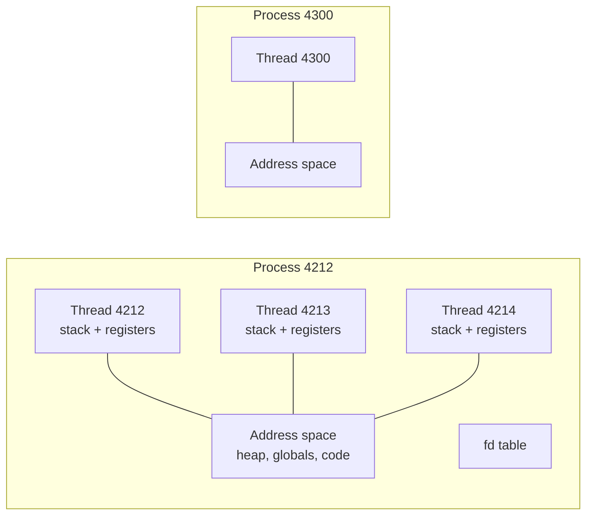

Your API server handles 2,000 requests per second on an 8-core box at 40% CPU. You double the traffic. CPU goes to 95%, but throughput only reaches 3,100 requests per second and p99 latency triples. Nothing in your code is slow. What changed is that the kernel is now spending a meaningful fraction of every core deciding which of your 400 threads gets to run next, and each of those decisions throws away the cache state the previous thread built up.

To reason about that you need a precise model of what a process is, what a thread is, what the scheduler does with them, and what each switch costs. Most engineers carry a vague version ("threads are lightweight processes"). The precise version is not much longer and it explains a surprising number of production graphs.

## A process is an address space plus resources

A process is the kernel's unit of isolation. It owns:

- An **address space**: a private mapping from virtual addresses to physical memory (the [next lesson](/learn/systems/operating-systems/virtual-memory) covers how). Two processes can both use address `0x7ffd1000` and they refer to different bytes of RAM.
- A table of **file descriptors**: small integers that index open files, sockets, pipes and devices.
- **Credentials** (user, group, capabilities), a working directory, signal handlers, resource limits.
- One or more **threads**.

The address space is what makes processes safe from each other. A bug that writes through a wild pointer in one process cannot corrupt another. That safety costs something: to share data between processes you have to go through the kernel (pipes, sockets, shared-memory segments), and every byte crossing that boundary is at least one copy and often one system call.

## A thread is a schedulable stack inside a process

A thread is the kernel's unit of *execution*. It has its own:

- **Stack** (typically 8 MiB of reserved virtual address space on Linux, committed lazily one page at a time).
- **Register state**, including the instruction pointer and stack pointer.
- Scheduling state: runnable, running, sleeping, and a priority.

Everything else, most importantly the heap and the global variables, is shared with every other thread in the process. That is the entire reason threads exist and the entire reason they are dangerous.

```viz
{"type": "memory", "algorithm": "stack-heap", "values": [4, 8, 15],
 "title": "Each thread has its own stack; every thread sees the same heap",
 "caption": "Stack frames are private to the thread that pushed them. Anything reachable through a heap pointer is visible to every thread in the process, which is what makes sharing cheap and races possible."}
```

On Linux the distinction is thinner than the textbook suggests. The kernel schedules *tasks*; a process is just a group of tasks that share an address space, and `clone()` takes flags saying what to share. A "thread" is a task created with `CLONE_VM | CLONE_FILES | CLONE_SIGHAND`. A "process" is a task created without them. This is why `ps -eLf` shows threads with their own IDs and why a thread can pin itself to a core with `sched_setaffinity` independently of its siblings.



Here is what sharing looks like in practice, and the price of it, in the three languages this track keeps returning to:

```python
import threading

counter = 0
def work():
    global counter
    for _ in range(100_000):
        counter += 1          # read-modify-write on shared memory

threads = [threading.Thread(target=work) for _ in range(4)]
for t in threads: t.start()
for t in threads: t.join()
print(counter)                # frequently < 400000 on free-threaded builds
```

```go
var counter int
var wg sync.WaitGroup
for i := 0; i < 4; i++ {
    wg.Add(1)
    go func() {               // a goroutine, multiplexed onto OS threads
        defer wg.Done()
        for j := 0; j < 100_000; j++ { counter++ }
    }()
}
wg.Wait()
fmt.Println(counter)          // data race; go run -race will flag it
```

```rust
use std::thread;
let mut counter = 0;
let handles: Vec<_> = (0..4).map(|_| {
    thread::spawn(move || { for _ in 0..100_000 { counter += 1; } })
}).collect();
// This does not compile: `counter` is moved into the first closure and the
// borrow checker refuses to let four threads mutate it. You are forced to
// reach for Arc<Mutex<i32>> or AtomicI32 before the program runs.
```

Python's classic build has the global interpreter lock, which serialises bytecode execution and hides this race most of the time; Go lets it happen and gives you a race detector; Rust refuses to compile it. The [races lesson](/learn/systems/concurrency/races-mutexes-and-invariants) goes into the mechanism. For now, the point is that threads are the OS's way of giving you shared memory, and every language then has to decide how much to protect you from it.

## What a context switch actually costs

The scheduler runs a thread until one of three things happens: the thread blocks (waiting on I/O, a lock, a sleep), a higher-priority thread becomes runnable, or the thread's time slice expires (a few milliseconds on Linux by default). Then it performs a context switch:

1. Save the running thread's registers into its kernel-side task struct.
2. Pick the next thread to run.
3. If the next thread belongs to a different process, switch page tables by loading a new root into the `CR3` register on x86. This invalidates most of the TLB (the cache of virtual-to-physical translations), unless the CPU supports tagged TLB entries.
4. Restore the new thread's registers and jump to its instruction pointer.

The direct cost of steps 1, 2 and 4 is on the order of 1–2 microseconds. The *indirect* cost is bigger and is the one that shows up in your graphs: the new thread starts with cold L1 and L2 caches and a partly flushed TLB. Its first few thousand memory accesses miss. A thread that would have finished a request in 200 µs of hot-cache execution might take 300 µs after being switched in.

A useful order-of-magnitude table, for a modern server CPU:

| Event | Approximate cost |
|---|---|
| Function call | ~1 ns |
| System call (enter and return, no work) | ~100–300 ns |
| Thread context switch, same process | ~1–2 µs direct, plus cache warm-up |
| Process context switch | ~2–5 µs direct, plus TLB refill |
| Thread creation | ~10–50 µs plus an 8 MiB stack reservation |
| Process creation (`fork` + `exec`) | ~100 µs to milliseconds |

Now redo the maths from the opening. 400 threads on 8 cores, each blocking on a database call every few hundred microseconds, means tens of thousands of context switches per second per core. `vmstat 1` will show that in the `cs` column, and `perf stat -e context-switches` will confirm it. At 20,000 switches per second per core with a 2 µs direct cost, you are spending 4% of the core on switching and considerably more on cache misses caused by switching. That is where the missing throughput went.

The fix is not "fewer threads" as a slogan; it is matching the number of runnable threads to the number of cores and using non-blocking I/O to wait, which is exactly what [I/O and system calls](/learn/systems/operating-systems/io-and-syscalls) and [thread pools](/learn/systems/concurrency/thread-pools-and-work-stealing) are about.

## The scheduler's actual policy

Linux has used variants of a fair scheduler for years (CFS, replaced by EEVDF in recent kernels). Ignoring the details, the policy is: every runnable thread should get a share of CPU proportional to its weight, and the scheduler picks the thread that has received the least CPU time relative to its share. Priorities (`nice` values) adjust the weight, not the ordering.

Three consequences matter for a service owner:

**Runnable versus running.** `top` shows load average, which counts threads that are runnable *or* in uninterruptible sleep, not threads actually consuming CPU. A load average of 24 on an 8-core box means an average of 16 threads were waiting for a core at any moment. Requests spend that wait time doing nothing, and it goes straight into your latency distribution. Load average is a queue length, and queue length is the number that tail latency is made of.

**Wake-up latency.** When a thread blocks on a socket and data arrives, the kernel marks it runnable, but it does not run until a core is free. Under load that gap is tens to hundreds of microseconds. Latency-sensitive systems (trading, real-time audio) avoid it by never blocking: they pin a thread to a core and spin.

**CPU quotas in containers.** A container with a CPU limit of 2 on a 32-core host does not get two dedicated cores. It gets 200 ms of CPU time per 100 ms period, across all cores. If your 32 threads all become runnable, they burn the quota in the first ~6 ms of the period and the whole container is throttled for the remaining 94 ms. `cat /sys/fs/cgroup/cpu.stat` shows `nr_throttled` climbing. The symptom is a service that looks idle (average CPU 30%) but has a p99 of 100 ms with a suspicious flat top. Either set the quota generously, size your thread pool to the quota rather than to `nproc`, or use `cpuset` pinning.

## fork, exec and copy-on-write

`fork()` creates a new process that is a copy of the caller. Copying a 4 GiB address space would be absurd, so the kernel copies only the page tables and marks every page **copy-on-write**: both processes share the physical pages read-only, and the first write to a page by either side triggers a fault that copies that one page. `exec()` then throws the whole address space away and loads a new program.

This is why `fork` is fast in the common `fork`-then-`exec` case and why it is a trap in a large process. A 20 GiB Redis instance that forks to write a snapshot shares everything at first, but as the parent keeps taking writes it copies pages one at a time; under a write-heavy load the child can end up duplicating a large fraction of the heap, and the fork itself takes hundreds of milliseconds just to copy 20 GiB worth of page tables. `posix_spawn` and `vfork` exist to skip the page-table copy when you only want to launch a program.

Python's `multiprocessing` on Linux uses `fork` by default (the default is changing to `forkserver` because forking a multithreaded process is unsafe: any lock held by another thread at the moment of the fork is held forever in the child, whose copy of that thread does not exist).

## Threads versus processes: the real decision

| | Threads | Processes |
|---|---|---|
| Share memory | Yes, by default | Only via explicit shared mappings |
| Failure isolation | One segfault kills all | One crash kills one |
| Creation cost | ~tens of µs | ~hundreds of µs and up |
| Communication cost | A pointer | A syscall and a copy |
| Parallelism in CPython | Limited by the GIL (unless free-threaded build) | Full |
| Memory footprint | Shared heap, one stack each | Full copy after writes |

The senior-level heuristic: use threads (or goroutines, or Tokio tasks) when the work shares state or needs cheap coordination; use processes when you want a crash to be contained, when you need to run untrusted or leak-prone code (browser tabs, worker pools that get recycled every N jobs), or when your runtime cannot parallelise threads. Nginx and PostgreSQL are process-per-worker for isolation; the JVM and Go are thread-per-everything for sharing.

## Green threads, goroutines and M:N scheduling

A goroutine, a Java virtual thread, an Erlang process and a Tokio task are all **user-space threads**: a stack (often starting at a few KiB) and a saved register set managed by the language runtime, not the kernel. The runtime multiplexes many of them (M) onto a small pool of OS threads (N, usually one per core). Switching between them costs roughly 100 ns because it is a function call inside the runtime, not a trip into the kernel.

The catch is that the kernel cannot see them. If a goroutine makes a blocking system call, the OS thread carrying it blocks, and the runtime has to notice and hand the other goroutines to a different OS thread. Go does this with a monitor thread; Java's virtual threads do it by "unmounting" at known blocking points; Node and Tokio avoid the problem by never making blocking calls on the loop thread at all. The [async lesson](/learn/systems/concurrency/async-and-event-loops) covers what goes wrong when you break that rule.

## What a container is

A container is not a virtual machine and not a process type. It is an ordinary process (or tree of processes) started with:

- **Namespaces**: separate views of process IDs, mount points, network interfaces, hostnames and users. The process sees itself as PID 1 in a filesystem that is its image.
- **cgroups**: accounting and limits on CPU time, memory, I/O bandwidth and PIDs.
- A **root filesystem** assembled from image layers with an overlay filesystem.
- Optionally seccomp and capability filters that restrict which system calls it may make.

Nothing about the kernel's scheduling or memory management changes. The scheduler sees your container's threads as threads; the memory limit is a cgroup number; the OOM killer respects the cgroup's limit rather than the host's. This is why a container with a 512 MiB memory limit can be killed while the host has 200 GiB free, and why `nproc` inside the container reports the host's core count unless you configure it otherwise, which is how JVMs and thread pools end up creating 64 threads to run under a quota of 2 cores.

## Senior signals

- You describe a process as an address space plus resources and a thread as a schedulable stack, and you know Linux implements both as tasks created by `clone` with different sharing flags.
- You can quote the order of magnitude of a syscall, a context switch and a thread creation, and you know the indirect cache cost of a switch usually exceeds the direct cost.
- You read load average as a run-queue length, not a CPU percentage, and you connect it to tail latency.
- You know what CPU quota throttling looks like (`nr_throttled`, flat-topped p99 at low average CPU) and that thread-pool sizing must follow the quota, not the host core count.
- You can explain copy-on-write fork, why forking a large or multithreaded process is a trap, and why Python is moving away from `fork` as the default start method.
- You choose processes for isolation and threads for sharing, and you can say which one nginx, Postgres, Go and the JVM chose and why.

## Check yourself

```quiz
- q: >-
    Two threads in the same process each call malloc and receive pointers with the same numeric value. Two processes each call malloc and receive pointers with the same numeric value. Which statement is correct?
  options: ["Both pairs refer to the same physical memory", "The threads' pointers refer to the same memory; the processes' pointers do not", "Neither pair refers to the same memory", "The processes' pointers refer to the same memory; the threads' pointers do not"]
  answer: 1
  explanation: >-
    Threads share one address space, so equal virtual addresses are the same bytes (and malloc would never hand out the same live block twice). Processes have private address spaces, so equal virtual addresses map to different physical pages.
- q: >-
    A service runs 300 threads on an 8-core host. Each thread blocks on a downstream call roughly every 200 µs. The most likely dominant cost is:
  options: ["Thread stack memory exhaustion", "Context-switch overhead and the cache misses that follow each switch", "The scheduler's O(log n) run-queue insertion", "Page-table copying"]
  answer: 1
  explanation: >-
    Thousands of switches per core per second cost a few µs each directly and far more in cold caches. 300 stacks are only committed lazily, so memory is not the issue; the run-queue cost is negligible at this scale; page tables are not copied on thread switches.
- q: >-
    A container has a CPU limit of 2 on a 48-core host. Its Java thread pool is sized from Runtime.availableProcessors() and shows p99 latency spikes with a flat top near 100 ms, while average CPU looks low. What is happening?
  options: ["The JVM garbage collector is pausing", "The pool created ~48 threads that exhaust the 200 ms-per-100 ms-period quota early in each period and are throttled for the rest of it", "The kernel is swapping the container's heap", "Two cores are not enough to run Java"]
  answer: 1
  explanation: >-
    CFS bandwidth control gives 2 cores' worth of time per 100 ms period across all cores. Many runnable threads burn it in a few ms and everything stalls until the period resets; that stall is the flat top. Sizing the pool to the quota fixes it.
- q: >-
    Why is fork() usually fast even for a process with a multi-gigabyte heap?
  options: ["The kernel compresses the heap before copying", "Pages are shared copy-on-write, so only page tables are copied at fork time", "fork only copies the stack", "Modern kernels implement fork as a thread creation"]
  answer: 1
  explanation: >-
    Copy-on-write marks shared pages read-only and copies a page only when one side writes to it. The page-table copy itself still scales with heap size, which is why very large processes see fork take hundreds of milliseconds.
- q: >-
    Which of these is true of a goroutine but not of an OS thread?
  options: ["It has its own stack", "It can run in parallel on another core", "Switching to another one does not require entering the kernel", "It can make system calls"]
  answer: 2
  explanation: >-
    Goroutines are user-space threads multiplexed by the Go runtime; switching between them is a runtime function call. They do have stacks, can run in parallel on the runtime's OS threads, and can make syscalls (which the runtime has to work around).
```
