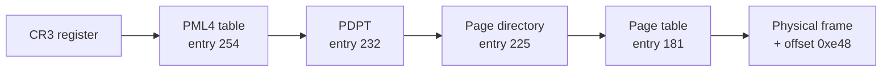

Your Java service runs in a container with a 2 GiB memory limit and `-Xmx1536m`. The JVM's metrics say the heap holds 900 MiB. Twice a day Kubernetes restarts it with `OOMKilled` and exit code 137, and there is no `OutOfMemoryError` in the logs, because the JVM never got the chance to throw one. On the same fleet, `ps` reports that a Go sidecar has a virtual size of 34 GiB on a 16 GiB machine, and nothing bad ever happens to it.

Both puzzles have one explanation: the numbers you are looking at measure different layers of virtual memory. The heap is a region of an address space. An address space is mostly promises. Physical memory is handed out one 4 KiB page at a time, on first touch, by a page fault. And the kernel kills processes based on pages actually backed by RAM, which include far more than your heap. To debug either case you need the mechanism, and the mechanism also explains huge pages, `mmap`, cold-start latency and why most databases refuse to let the kernel manage their data pages through `mmap`.

## Every address you have ever printed is virtual

When your program dereferences a pointer, the CPU's memory management unit (MMU) translates the virtual address into a physical address before the load reaches the cache. The translation works in units of **pages**, 4 KiB on x86-64 and on most ARM servers. The low 12 bits of an address are the offset inside the page and pass through unchanged. The remaining high bits are the **virtual page number** (VPN), which the MMU maps to a **physical frame number** (PFN).

That indirection buys four things, and every one of them shows up later in this lesson:

- **Isolation.** Each process has its own mapping, so address `0x7ffd5a3c1f38` in one process and the same number in another are different bytes of RAM.
- **Laziness.** A mapping can say "not present". The kernel only finds a physical frame when the page is first touched, so reserving memory is nearly free.
- **Sharing.** One physical frame can appear in many address spaces: libc's code in every process, copy-on-write pages after `fork`, shared memory segments.
- **Files as memory.** A mapping can be backed by a file, so a memory access becomes file I/O.

You can see a process's mappings directly. Each line of `/proc/<pid>/maps` is a **VMA** (virtual memory area): a range, its permissions, and what backs it.

```text
55d4c8a00000-55d4c8a2c000 r--p 00000000 103:02 1835021   /usr/bin/myapp
55d4c8a2c000-55d4c8b91000 r-xp 0002c000 103:02 1835021   /usr/bin/myapp
55d4ca1f3000-55d4ca214000 rw-p 00000000 00:00 0         [heap]
7f3a1c000000-7f3a20000000 rw-p 00000000 00:00 0
7f3a2c1e0000-7f3a2c208000 r--p 00000000 103:02 2621560   /usr/lib/x86_64-linux-gnu/libc.so.6
7ffd5a3a2000-7ffd5a3c3000 rw-p 00000000 00:00 0         [stack]
```

`VSZ` in `ps` is the sum of these ranges. `RSS` (resident set size) is the number of pages in them that currently have a physical frame. Runtimes such as Go and the JVM reserve large ranges up front and touch them gradually, so a 34 GiB VSZ with a 300 MiB RSS is normal and harmless. VSZ tells you almost nothing about memory pressure.

## The page table walk

x86-64 uses 48-bit virtual addresses (57-bit with five-level paging on recent CPUs). The 36 bits above the offset are split into four 9-bit indices, one per level of a tree of page tables. Each table is itself one 4 KiB page holding 512 eight-byte entries, which is exactly why each level consumes 9 bits: $2^9 = 512$.

Take the address `0x7f3a1c2b5e48`, somewhere in an `mmap` region:

```text
bits:     47..39     38..30     29..21     20..12      11..0
        011111110  011101000  011100001  010110101  111001001000
index:     254        232        225        181       3656 (0xe48)
level:     PML4       PDPT        PD         PT       offset
```

The walk starts from the physical address in the `CR3` register (the root of the current process's tree), reads entry 254 of the top table to find the next table, reads entry 232 of that, then 225, then 181, which finally holds the PFN. The physical address is `PFN × 4096 + 3656`.



Each entry holds a PFN plus flag bits, and those flags are how the kernel implements almost everything else in this module: **present** (lazy allocation and swap), **writable** (copy-on-write is a writable region mapped read-only), **user** (kernel memory is invisible to user code), **accessed** and **dirty** (set by hardware, read by the kernel to choose what to evict and what to write back), and **no-execute** (why your heap cannot run shellcode).

The tree is sparse: tables exist only for regions that are mapped. But it is not free. Mapping 1 TiB with 4 KiB pages needs $2^{28}$ leaf entries, which is 2 GiB of page tables, and every process that maps a shared region builds its own. That is why PostgreSQL recommends huge pages for large `shared_buffers`: with hundreds of backend processes each mapping the same 64 GiB buffer pool, the page tables alone can reach gigabytes.

## The TLB, and why huge pages exist

A full walk is four dependent memory reads before the load you actually wanted. Paying that on every access would make memory several times slower, so the CPU caches translations in the **TLB** (translation lookaside buffer). A current server core has a first-level data TLB of around 64 entries and a second-level TLB of one to a few thousand. A TLB hit is effectively free; a miss triggers a hardware page walk costing tens of cycles if the page-table entries are in cache and hundreds if they are not.

The number to reason with is **TLB reach**: entries times page size. 1,536 entries × 4 KiB covers 6 MiB. A service that touches a 20 GiB heap at random misses the TLB on nearly every access, and `perf stat -e dTLB-load-misses` will show it. With **2 MiB huge pages**, where the page-directory entry points straight at a 2 MiB frame and the last level disappears, the same TLB covers 3 GiB. There are 1 GiB pages too.

Linux offers huge pages two ways:

| | Explicit (hugetlbfs) | Transparent huge pages (THP) |
|---|---|---|
| How | Reserved via `vm.nr_hugepages`; app asks with `MAP_HUGETLB` | Kernel promotes aligned 2 MiB regions automatically |
| Who uses it | PostgreSQL `huge_pages=on`, JVM `-XX:+UseLargePages`, DPDK | Anything, silently |
| Risk | Reserved memory is unavailable to anyone else | Compaction stalls on allocation, memory bloat, bigger copy-on-write copies |

THP is the one that bites. To create a 2 MiB page the kernel may have to compact memory first, and that can stall an allocation for milliseconds. A 2 MiB page backing 8 KiB of real data wastes the rest. And after `fork`, one write to a huge page copies 2 MiB instead of 4 KiB. Redis logs a warning at startup if THP is set to `always`, and many database vendors recommend `madvise` or `never`:

```bash
cat /sys/kernel/mm/transparent_hugepage/enabled
# always [madvise] never
```

Two more TLB effects matter in production. Threads of one process share a page table, so switching between them keeps the TLB; switching processes loads a new `CR3`, and only CPUs with tagged TLB entries (PCID on x86) avoid a flush. And when a multithreaded process unmaps or re-protects memory, every other core running one of its threads must drop the stale entries: the kernel sends inter-processor interrupts, a **TLB shootdown**, costing microseconds each. Allocators that return memory to the OS aggressively can generate thousands per second.

## Page faults: minor, major and fatal

When the MMU finds a not-present entry or a permission violation, it raises a page fault and the kernel looks up the VMA containing the address. There are three outcomes:

| Fault | What happened | Cost |
|---|---|---|
| **Minor** | Page can be provided without I/O: first touch of anonymous memory (hand out a zeroed frame), page already in the page cache, copy-on-write break | On the order of 1 µs |
| **Major** | Page must be read from disk: swapped out, or a file page not in the page cache | ~100 µs from NVMe, ~10 ms from a spinning disk |
| **Invalid** | No VMA covers the address, or the access violates its permissions | `SIGSEGV` (or `SIGBUS` for a mapped file that shrank or hit an I/O error) |

Laziness is easy to demonstrate:

```c
#include <stdlib.h>

int main(void) {
    size_t n = 1UL << 30;            /* 1 GiB */
    char *p = malloc(n);             /* returns in microseconds: only address space */
    for (size_t i = 0; i < n; i += 4096)
        p[i] = 1;                    /* every first touch is a minor fault */
    return p[12345];
}
```

```text
$ /usr/bin/time -v ./touch
    ...
    Maximum resident set size (kbytes): 1050132
    Major (requiring I/O) page faults: 0
    Minor (reclaiming a frame) page faults: 262208
    ...
```

1 GiB / 4 KiB is 262,144 pages, and there they are: one minor fault each, a quarter of a second of system time, all paid in the loop rather than in `malloc`. Three production consequences follow.

**Cold starts are partly page faults.** A freshly started process faults in its heap, its stacks and its code pages. The latter are minor faults if the binary is in the page cache and major faults if it is not, which is why the first deploy to a new node is slower than the tenth.

**You can pay up front instead.** `-XX:+AlwaysPreTouch` makes the JVM touch its whole heap at startup; `MAP_POPULATE` does the same for an `mmap`; `mlock` pins pages so they are never evicted. You trade startup time and memory for no faults on the request path.

**Steady major faults are a red flag.** A service with no swap that shows `majflt/s` above zero in `sar -B` is re-reading file-backed pages (its own code, or files it maps) that the kernel evicted under memory pressure. The process is not out of memory yet, but it is close enough that the kernel is dropping its working set.

The animation below plays a reference string through a machine with only three physical frames. Every access to a page that is not resident is a fault, and once the frames are full, loading one page means evicting another.

```viz
{"type": "memory", "algorithm": "virtual-memory-paging", "values": [1, 2, 3, 4, 1, 2, 5, 1, 2, 3, 4, 5], "n": 3,
 "title": "Page faults with 3 frames and FIFO eviction",
 "caption": "Twelve accesses, nine faults. Note which page FIFO throws out: the oldest loaded, even when it was just used."}
```

Now give the same program one more frame:

```viz
{"type": "memory", "algorithm": "virtual-memory-paging", "values": [1, 2, 3, 4, 1, 2, 5, 1, 2, 3, 4, 5], "n": 4,
 "title": "The same reference string with 4 frames",
 "caption": "Ten faults. More memory, more faults: Belady's anomaly, which FIFO suffers and LRU cannot."}
```

## When physical memory runs out

The kernel treats two kinds of page differently when it needs to free frames.

**File-backed pages** (the page cache: file data you read, executable code, `mmap`ed files) have a copy on disk. A clean one can be dropped instantly and re-read later; a dirty one must be written back first.

**Anonymous pages** (heap, stacks) have no file behind them. The only way to reclaim one is to write it to swap. On a host with no swap, which is the common configuration for Kubernetes nodes, anonymous memory cannot be reclaimed at all; only file pages can.

Choosing *which* page to evict is the caching problem you already know. The optimal policy evicts the page that will be used furthest in the future, which requires knowing the future. LRU approximates it, but exact LRU would mean updating a list on every memory access, which no hardware does. Instead the kernel samples the **accessed bit** the MMU sets on each use: the classic **clock** (second-chance) algorithm sweeps the frames, clears the bit on pages that have it and evicts the first page found with it already clear. Linux keeps active and inactive lists for each kind of page (newer kernels use a multi-generational variant), promoting pages that are seen accessed repeatedly and evicting from the cold end. The same design shows up in the [LRU cache lesson](/learn/advanced-data-structures/caches-and-eviction/lru-cache), and the page cache is the most heavily used LRU approximation in your fleet.

FIFO, the simplest policy, has the pathology the two animations showed: **Belady's anomaly**, where adding frames increases faults. LRU is a *stack algorithm*: the set of pages it holds with $k$ frames is always a subset of what it holds with $k + 1$, so more memory can never hurt it. The exercise below asks you to verify both claims.

When the working set is larger than RAM and swap exists, the result is **thrashing**: nearly every access is a major fault, CPUs sit idle waiting on disk, and the machine appears hung. `vmstat 1` shows it in the `si`/`so` (swap in/out) columns:

```text
procs -----------memory---------- ---swap-- -----io---- -system-- ------cpu-----
 r  b   swpd   free   buff  cache   si   so    bi    bo   in   cs us sy id wa st
 1 14 3912044  81232   1024  60120 9812 11420 10244 11800 4120 6100  2  6  8 84  0
```

Fourteen threads blocked (`b`), 84% of CPU time waiting on I/O (`wa`), megabytes per second moving through swap. Many production fleets run without swap, or with very little, precisely because a process killed quickly and restarted is better than a node that takes ten minutes to die.

When reading memory graphs, two more distinctions matter. In `free -h`, the `free` column is supposed to be small (idle RAM is wasted RAM, so the kernel fills it with page cache); the number that tells you how much memory is really available is `available`, which adds reclaimable cache. And RSS double-counts shared pages: twenty prefork workers sharing 200 MiB of code and copy-on-write heap each report it in their RSS. **PSS** (proportional set size, in `/proc/<pid>/smaps_rollup`) divides shared pages among the processes sharing them and is the number to add up.

## mmap: files as memory

`mmap` on a file creates a VMA backed by that file. The first access to each page faults; the kernel finds the page in the page cache (reading it from disk if needed) and maps that same physical frame into your address space. There is no `read()` system call and no copy into a user buffer: your process and the page cache share the frame.

```python
import mmap

with open("events.bin", "rb") as f, \
     mmap.mmap(f.fileno(), 0, access=mmap.ACCESS_READ) as m:
    header = m[:16]              # a page fault, not a read() call
    pos = m.find(b"\x00\xff")    # scans the file as if it were bytes in RAM
```

Lucene's `MMapDirectory`, LMDB, Kafka's offset index files, Prometheus's TSDB blocks and model-weight loaders such as llama.cpp all rely on this. The attractions are real: zero copies, the kernel manages caching, pages are shared across processes, and the code is trivially simple.

Most databases still refuse to use it for their main data files, for reasons that come straight from the mechanism:

- **Faults block invisibly.** A memory access can take 10 ms if it misses the page cache, and there is no way to make it asynchronous or even notice it in advance. An event-loop thread that touches a cold page stalls every connection it owns.
- **The kernel decides eviction and write-back.** It may evict a hot page you needed, and it may write a dirty page to disk at any moment, including before the write-ahead log record that describes it. Correct write-ahead logging needs that ordering under the database's control.
- **Errors become signals.** An I/O error on a mapped page arrives as `SIGBUS`, not as an error code you can handle.
- **Eviction in a multithreaded process means TLB shootdowns.**

The 2022 CIDR paper "Are You Sure You Want to Use MMAP in Your Database Management System?" makes this case in detail, and MongoDB replaced its original mmap-based storage engine with WiredTiger. The rule of thumb: `mmap` is excellent for read-mostly, immutable files (index segments, model weights, lookup tables) and risky for mutable data whose write ordering matters.

Anonymous `mmap` (no file) is how allocators get memory from the kernel in the first place. glibc `malloc` serves small requests from heaps it grows with `brk` or `mmap`, and gives each allocation above a threshold (128 KiB initially, raised dynamically as such blocks are freed) its own `mmap`, which is `munmap`ed on `free`. Memory that goes back to the kernel has to be faulted in again when it is reused: an allocator or runtime that returns 1 MiB buffers eagerly pays a system call, 256 minor faults and possibly a TLB shootdown every time it gets one back. Pooling buffers avoids it.

## Overcommit and the OOM killer

Linux **overcommits** by default: `malloc` and `mmap` succeed for any request that is not absurd, because most reservations are never fully touched. The bill arrives later, at page-fault time. If a fault needs a frame and reclaim cannot find one, the kernel cannot return an error from a memory access; there is no error path for `p[i] = 1`. Instead it invokes the **OOM killer**, which picks the process with the highest `oom_score` (roughly its memory footprint, adjusted by `oom_score_adj` from −1000 to 1000) and sends it `SIGKILL`. Exit code 137 is 128 + 9. The kernel log records it:

```text
Memory cgroup out of memory: Killed process 48213 (java) total-vm:5832104kB,
anon-rss:2081244kB, file-rss:21560kB, shmem-rss:0kB, UID:1000 pgtables:4652kB oom_score_adj:936
```

In a container, the limit is a memory cgroup (`memory.max` in cgroup v2). The cgroup is charged for anonymous memory, for page cache pages it brought in, and for some kernel memory such as socket buffers. At the limit the kernel first reclaims the cgroup's page cache; if that is not enough, it kills a process *inside the cgroup*, even when the host has 200 GiB free.

Now return to the opening. The kernel does not know what a heap is. The container's anonymous RSS is:

- The Java heap, up to the full 1,536 MiB once the collector has touched it. "Used: 900 MiB" is a garbage collector statistic; the committed pages stay resident.
- Metaspace and the JIT's code cache.
- Thread stacks: 200 threads with a few hundred KiB touched each.
- GC bookkeeping (card tables, remembered sets), often 5–10% of the heap.
- Direct `ByteBuffer`s, which Netty and gRPC use heavily.
- glibc malloc arenas used by native libraries; glibc creates up to 8 per core and each can retain freed memory.

That sum crosses 2 GiB without any leak. The fixes are all about budgeting: set the heap as a fraction of the container limit (`-XX:MaxRAMPercentage=60` to `75`), cap direct memory (`-XX:MaxDirectMemorySize`), set `MALLOC_ARENA_MAX=2` for glibc, and measure what is left with Native Memory Tracking (`-XX:NativeMemoryTracking=summary`, then `jcmd <pid> VM.native_memory summary`). Alert on the cgroup's `anon` figure in `memory.stat` approaching the limit, not on "heap used".

The same analysis applies to every runtime: Go's `GOMEMLIMIT` and Node's `--max-old-space-size` bound only the memory the language runtime manages, and everything outside it (native libraries, buffers, the runtime's own overhead) is still charged to the container.

## Exercises

```exercise
id: page-table-indices
title: Split an address into page-table indices
prompt: |
  On x86-64 with 4-level paging and 4 KiB pages, a 48-bit virtual address is
  split into four 9-bit table indices and a 12-bit page offset:

  bits 47..39 = PML4 index, 38..30 = PDPT index, 29..21 = PD index,
  20..12 = PT index, 11..0 = offset.

  Return `[pml4, pdpt, pd, pt, offset]` for the non-negative integer `addr`
  (always below 2^48).

  JavaScript note: bitwise operators work on 32-bit integers, so `addr >> 39`
  silently gives the wrong answer for real addresses. Use `Math.floor` and `%`
  (or `BigInt`).
languages: [python, javascript]
entry: page_table_indices
starter:
  python: |
    def page_table_indices(addr):
        # your code here
        return [0, 0, 0, 0, 0]
  javascript: |
    function page_table_indices(addr) {
      // your code here
      return [0, 0, 0, 0, 0];
    }
tests:
  - args: [0]
    expected: [0, 0, 0, 0, 0]
    label: address zero
  - args: [4096]
    expected: [0, 0, 0, 1, 0]
    label: second page
  - args: [2097152]
    expected: [0, 0, 1, 0, 0]
    label: 2 MiB boundary
  - args: [139887557434952]
    expected: [254, 232, 225, 181, 3656]
    label: 0x7f3a1c2b5e48 from the lesson
  - args: [140737488355327]
    expected: [255, 511, 511, 511, 4095]
    label: top of user space
  - args: [140726117343032]
    expected: [255, 501, 209, 449, 3896]
    hidden: true
  - args: [94372387361332]
    expected: [171, 339, 69, 1, 564]
    hidden: true
hints:
  - "The offset is addr mod 4096. The page number is addr divided by 4096 (integer division)."
  - "Each index is (page number divided by 512^k) mod 512 for k = 3, 2, 1, 0."
  - "In Python, (addr >> 39) & 511 works. In JavaScript use Math.floor(addr / 2 ** 39) % 512."
```

```exercise
id: count-page-faults
title: FIFO versus LRU page replacement
prompt: |
  Simulate a machine with `frames` physical frames, initially empty, running
  the page reference string `refs`. Every reference to a page that is not
  resident is a fault; if all frames are full, evict one page first.

  `policy` is `"fifo"` (evict the page that was loaded earliest; hits do not
  change the order) or `"lru"` (evict the page whose most recent use is
  oldest; every hit refreshes the page).

  Return the number of faults. The tests include Belady's anomaly.
languages: [python, javascript]
entry: count_page_faults
starter:
  python: |
    def count_page_faults(refs, frames, policy):
        # your code here
        return 0
  javascript: |
    function count_page_faults(refs, frames, policy) {
      // your code here
      return 0;
    }
tests:
  - args: [[1, 2, 3, 4, 1, 2, 5, 1, 2, 3, 4, 5], 3, "fifo"]
    expected: 9
  - args: [[1, 2, 3, 4, 1, 2, 5, 1, 2, 3, 4, 5], 4, "fifo"]
    expected: 10
    label: Belady's anomaly, more frames and more faults
  - args: [[1, 2, 3, 4, 1, 2, 5, 1, 2, 3, 4, 5], 3, "lru"]
    expected: 10
  - args: [[1, 2, 3, 4, 1, 2, 5, 1, 2, 3, 4, 5], 4, "lru"]
    expected: 8
    label: LRU never gets worse with more frames
  - args: [[], 3, "lru"]
    expected: 0
    label: empty reference string
  - args: [[7, 7, 7], 1, "fifo"]
    expected: 1
  - args: [[7, 0, 1, 2, 0, 3, 0, 4, 2, 3, 0, 3, 2], 3, "fifo"]
    expected: 10
    hidden: true
  - args: [[7, 0, 1, 2, 0, 3, 0, 4, 2, 3, 0, 3, 2], 3, "lru"]
    expected: 9
    hidden: true
hints:
  - "Keep the resident pages in a list ordered from 'evict next' to 'evict last'."
  - "On a hit under LRU, move the page to the 'evict last' end; under FIFO, leave the order alone."
  - "On a fault, if the list already holds `frames` pages, remove the first one, then append the new page."
```

## Senior signals

- You read VSZ as reserved address space, RSS as resident pages and PSS as the fair share, and you never add up RSS across processes that share memory.
- You can walk a four-level translation by hand, state the TLB reach of 4 KiB versus 2 MiB pages, and explain why Redis and many databases want transparent huge pages off while PostgreSQL wants explicit huge pages on.
- You know a minor fault costs about a microsecond and a major fault costs a disk read, you watch `majflt` on services without swap, and you pre-fault memory when first-request latency matters.
- You can argue both sides of `mmap`: zero-copy and simplicity for immutable files, invisible blocking and lost write ordering for a database's mutable pages.
- You explain an `OOMKilled` container as a cgroup charge for anonymous memory plus page cache, not a heap problem, and you budget heap, direct buffers, stacks, metaspace and allocator arenas against the limit.

## Check yourself

```quiz
- q: >-
    On a Linux host with 4 GiB of RAM, no swap and default overcommit settings, a program calls malloc for 8 GiB and the call succeeds. What happens next?
  options: ["malloc zeroed all 8 GiB up front, so the page cache is already being evicted", "Pages get frames on first touch; the OOM killer acts if they run out", "Nothing more; the kernel has already reserved 8 GiB of frames", "The next malloc returns NULL because the host is overcommitted"]
  answer: 1
  explanation: >-
    With overcommit, a successful malloc only reserves address space; no frames are reserved or zeroed yet. Frames are assigned on first touch by minor faults. When touched memory exceeds what the kernel can reclaim, a fault cannot be satisfied and there is no error path for a memory store, so the OOM killer sends SIGKILL to the highest-scoring process, which may not even be this one.
- q: >-
    A service does random lookups over a 16 GiB in-memory index. Switching the index to 2 MiB huge pages makes it noticeably faster. What mostly improved?
  options: ["The L1 data cache hit rate rises because each page is contiguous", "The 16 GiB index now fits in RAM because its page tables shrank", "The hardware prefetches each 2 MiB page into cache on first access", "TLB reach grows from MiB to GiB, so most page walks disappear"]
  answer: 3
  explanation: >-
    Huge pages do not change which cache lines are fetched, so data-cache behaviour is similar, and there is no whole-page prefetch. They change how much memory the TLB covers: around 1,500 entries cover about 6 MiB with 4 KiB pages and about 3 GiB with 2 MiB pages, removing most page walks on random access.
- q: >-
    A JVM in a 2 GiB container runs with -Xmx1536m, reports 900 MiB of heap used, and is repeatedly OOMKilled with exit code 137. Which is the most accurate diagnosis?
  options: ["Exit code 137 means the JVM itself crashed with a segfault", "Kubernetes counts the virtual size, which is well above 2 GiB", "Heap plus all non-heap resident memory exceeds the cgroup's 2 GiB", "The heap is leaking and will throw OutOfMemoryError before long"]
  answer: 2
  explanation: >-
    Used heap is a GC statistic. The cgroup charges resident anonymous memory: committed heap pages (which stay resident), metaspace, thread stacks, direct buffers, GC structures and malloc arenas, which together easily pass 2 GiB. 137 is 128 plus SIGKILL, the OOM killer's signal, not a segfault (which would be 139). Virtual size is not charged.
- q: >-
    With the same reference string, giving a FIFO page-replacement policy one extra frame increased the number of faults. Which statement is true?
  options: ["It is impossible, so the simulation must contain a bug", "Past some threshold, more frames mean more faults under any policy", "This is Belady's anomaly; LRU is a stack algorithm and avoids it", "This is Belady's anomaly, and LRU shows it more often than FIFO"]
  answer: 2
  explanation: >-
    FIFO can hold a different, not larger, set of pages with more frames, so faults can rise. Under LRU the pages resident with k frames are always a subset of those resident with k plus one, so faults never increase with memory.
- q: >-
    A service on a swapless Kubernetes node shows a steady 300 major page faults per second. Where are those faults coming from?
  options: ["Anonymous heap pages being read back in from the swap device", "Evicted file-backed pages, such as code, being read back in", "Copy-on-write breaks in child processes forked by the service", "First touches of heap memory that the service has just allocated"]
  answer: 1
  explanation: >-
    Without swap, anonymous pages cannot be evicted, so nothing is read back from swap; first touches and copy-on-write breaks are minor faults. Major faults therefore mean file pages (the binary's code, shared libraries or mmapped files) are being dropped and re-read, a sign the container or node is close to its memory limit.
- q: >-
    Why do most databases avoid mmap for their main, mutable data files?
  options: ["mmap needs huge pages, which most database hosts leave disabled", "Reads through mmap copy each page twice, via the page cache", "The kernel, not the database, controls eviction, write-back and stalls", "mmap cannot map a data file that is larger than physical RAM"]
  answer: 2
  explanation: >-
    mmap maps files larger than RAM fine, needs no huge pages and avoids copies. The problem is control: write-ahead logging needs pages to reach disk only after their log records, faults block threads invisibly, and I/O errors arrive as SIGBUS, none of which the database can manage when the kernel services faults and write-back on its own schedule.
```
