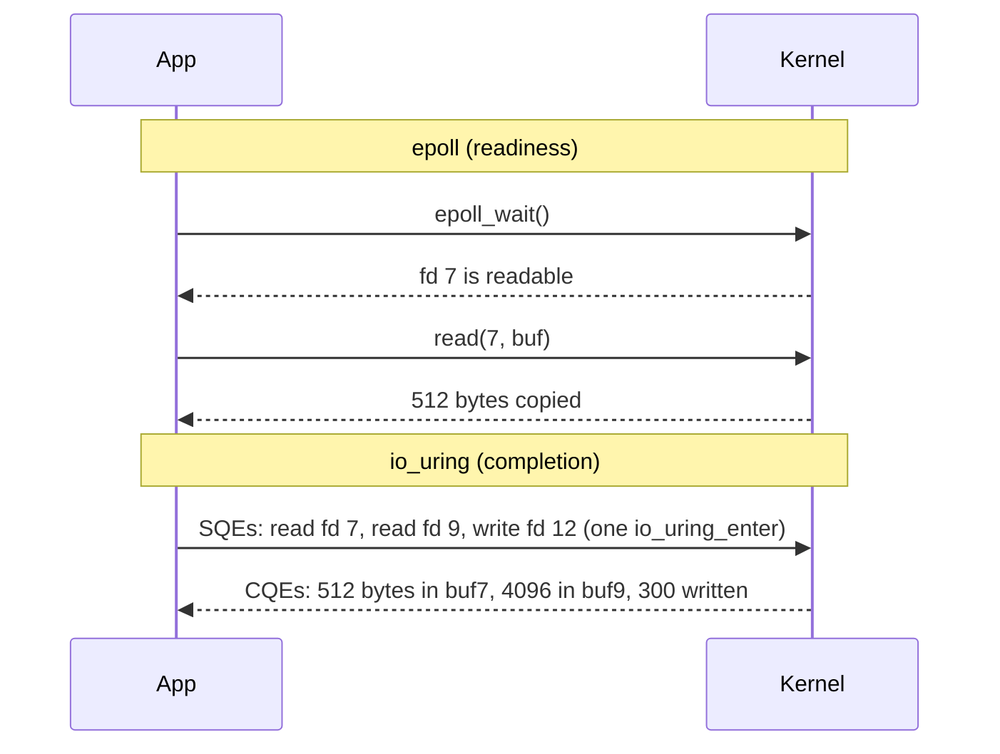

Your notification gateway holds one WebSocket per logged-in user. It was written thread-per-connection: accept, spawn a thread, loop on a blocking `read`. At 2,000 users it was fine. At 20,000 it uses several gigabytes of memory, `vmstat` shows 150,000 context switches a second, and a heartbeat that touches every connection takes 400 ms. Almost every connection is idle. The machine is spending its effort on 20,000 sleeping threads that each wake up to read 30 bytes.

Every high-connection server has converged on the same fix: stop dedicating a thread to *waiting*. One thread asks the kernel "which of these 20,000 sockets has data?", handles the ready ones and asks again. To see why that works, where it stops working (disk files, CPU-heavy callbacks) and what replaced it, you need to look at the boundary your code crosses on every byte of I/O: the system call.

## What a system call costs

Your process cannot touch hardware. To read a socket it executes a `syscall` instruction, which switches the CPU to kernel mode, jumps to the kernel's entry point, runs the requested operation against kernel data structures and returns. The round trip with no real work is on the order of 100 ns, and more on CPUs that need speculative-execution mitigations on every kernel entry. That is 100 times a function call. A few calls cost nothing; a million cost a noticeable fraction of a second.

Some calls never enter the kernel: `clock_gettime` and `gettimeofday` are served from the **vDSO**, a page of kernel-provided code mapped into every process. That is why reading the clock is cheap on Linux, and why `clock_gettime` showing up as a real system call in a profile usually means the VM's clock source does not support the vDSO fast path, not that your code reads the clock too often.

The cheapest syscall is the one you do not make. This is what I/O buffering is for, and languages disagree about whether you get it by default:

```rust
use std::fs::File;
use std::io::{BufWriter, Write};

let mut f = File::create("out.log")?;
for i in 0..1_000_000 {
    writeln!(f, "event {i}")?;          // File is unbuffered: one write(2) per line
}

let mut w = BufWriter::new(File::create("out.log")?);
for i in 0..1_000_000 {
    writeln!(w, "event {i}")?;          // fills an 8 KiB buffer: ~1,600 write(2) calls
}
w.flush()?;
```

Rust's `File` and Go's `os.File` are unbuffered; you add `BufWriter` or `bufio.Writer` yourself. Python's `open()` and C's `stdio` buffer by default. Standard output is line-buffered on a terminal and block-buffered in a pipe, which is why a program's output can appear in a different order, or much later, when you pipe it. `strace -c` counts the difference:

```text
$ strace -c ./unbuffered
% time     seconds  usecs/call     calls    errors syscall
------ ----------- ----------- --------- --------- ----------------
 99.71    2.104337           2   1000000           write
  0.11    0.002301          38        60           mmap
...
------ ----------- ----------- --------- --------- ----------------
100.00    2.110425           2   1000112         4 total
```

Treat the timings from `strace` with suspicion: it stops the process via `ptrace` on every syscall and can slow it by 10–100×. It is excellent for *what* a process is doing and dangerous to attach to a production process at peak. `perf trace -s` or an eBPF tool such as `syscount` gives the same counts at a fraction of the overhead.

## File descriptors

Every open file, socket, pipe, `epoll` instance, timer and event counter your process holds is a **file descriptor**: a small integer indexing a per-process table. Entry 3 points to an *open file description* in the kernel, which holds the current offset and flags and points on to the inode, socket or pipe. Descriptors 0, 1 and 2 are stdin, stdout and stderr by convention.

Three facts about that structure cause real incidents:

- **Descriptors are limited.** The per-process soft limit (`ulimit -n`) defaults to 1,024 on many distributions. Every connection and every open file uses one. A leak, such as an HTTP client response body you never close (`resp.Body.Close()` in Go), ends in `EMFILE: Too many open files` hours after deploy. `ls /proc/<pid>/fd | wc -l` or `lsof -p <pid>` shows the count; the fix is closing, and then raising the limit (`LimitNOFILE=` in systemd) for servers that legitimately hold many connections.
- **Duplicates share state.** After `fork` or `dup`, two descriptors point at the same open file description and share one offset. Two processes writing to one inherited log descriptor advance the same offset and do not overwrite each other; two that each `open` the file separately have separate offsets and can overwrite each other unless they use `O_APPEND`.
- **Descriptors leak into children.** A descriptor without `O_CLOEXEC` survives `exec`, so a subprocess you launch can keep your listening socket open after you restart. Modern runtimes set close-on-exec by default; C code has to ask.

## Blocking I/O and thread-per-connection

A `read` on a socket whose receive buffer is empty puts the calling thread to sleep on the socket's wait queue. When a packet arrives, the network card raises an interrupt, the kernel's TCP stack appends the payload to the receive buffer, marks the thread runnable, and the scheduler eventually runs it. The thread's `read` returns with the data.

That model is simple and good. Code reads top to bottom, errors come back where they happened, and a stack trace shows what a connection is doing. Up to a few thousand connections it is often the right choice: classic Java servlet containers, Apache's worker model and PostgreSQL's process-per-connection all use it.

The costs are per connection, not per request. Each thread holds a 16 KiB kernel stack plus the pages of its user stack it has touched. Each message costs a wake-up, a context switch and a cold cache. The scheduler's run queue fills with threads that will run for 5 µs and sleep again. Dan Kegel named this the **C10K problem** in 1999: serving ten thousand concurrent clients was hard not because of bandwidth but because of the per-connection overhead of the thread model.

## Non-blocking I/O and readiness

Set `O_NONBLOCK` on a socket and `read` never sleeps: when there is no data it fails immediately with `EAGAIN`. Now a single thread can juggle many sockets, but it needs to know *which* ones to try. Calling `read` on 20,000 sockets to find the three with data is 19,997 wasted syscalls. So the kernel offers **readiness notification**.

| API | How you ask | Cost per call | Limits |
|---|---|---|---|
| `select` | Pass bitmaps of fds; kernel scans all of them; bitmaps copied in and out every call | O(watched fds) | `FD_SETSIZE`, usually 1,024 |
| `poll` | Pass an array of `pollfd` structs | O(watched fds) | None, but the same scan |
| `epoll` (Linux) | Register each fd once with `epoll_ctl`; `epoll_wait` returns only ready fds | O(ready fds) | None practical |
| `kqueue` (BSD, macOS) | Register filters once; `kevent` returns events | O(ready events) | Also covers timers, signals, process exit |

`epoll` wins because the kernel keeps a ready list. Registering a socket hooks a callback onto its wait queue; when data arrives the callback appends the socket to the `epoll` instance's ready list; `epoll_wait` just drains that list. Watching 100,000 idle connections costs nothing per call. Python's `selectors` module picks the best mechanism for the platform:

```python
import selectors, socket

sel = selectors.DefaultSelector()          # epoll on Linux, kqueue on macOS
srv = socket.socket()
srv.bind(("0.0.0.0", 9000)); srv.listen(1024); srv.setblocking(False)
sel.register(srv, selectors.EVENT_READ)

while True:
    for key, _ in sel.select():            # epoll_wait: sleep until something is ready
        sock = key.fileobj
        if sock is srv:
            conn, _ = srv.accept()         # ready, so this does not block
            conn.setblocking(False)
            sel.register(conn, selectors.EVENT_READ)
        else:
            data = sock.recv(4096)         # returns what is there, or b"" at EOF
            if data:
                sock.send(data)            # may accept only part of it (see below)
            else:
                sel.unregister(sock)
                sock.close()
```

Under `strace`, the whole server is a loop of a handful of calls:

```text
epoll_wait(3, [{events=EPOLLIN, data={u32=5, u64=5}}], 3, -1) = 1
accept4(5, {sa_family=AF_INET, sin_port=htons(51522), sin_addr=inet_addr("10.0.0.7")}, [16], SOCK_CLOEXEC) = 6
epoll_ctl(3, EPOLL_CTL_ADD, 6, {events=EPOLLIN, data={u32=6, u64=6}}) = 0
epoll_wait(3, [{events=EPOLLIN, data={u32=6, u64=6}}], 4, -1) = 1
recvfrom(6, "hello\n", 4096, 0, NULL, NULL) = 6
sendto(6, "hello\n", 6, 0, NULL, 0) = 6
```

This loop is the engine inside Node, nginx, Redis, Netty, Tokio and Python's `asyncio`. A runtime adds timers, a task queue and a nicer programming model on top, but the thread still spends its life alternating between "wait for readiness" and "run the callbacks for whatever became ready". Everything it runs, it runs on that one thread, which is why one slow callback delays every connection:

```viz
{"type": "concurrency", "algorithm": "event-loop",
 "title": "One thread, many callbacks",
 "caption": "The host (kernel via epoll, plus timers) decides what is ready; the loop runs each callback to completion on one thread. A 200 ms callback delays every socket by 200 ms."}
```

### Level-triggered versus edge-triggered

By default `epoll` is **level-triggered**: `epoll_wait` keeps reporting a socket as long as unread data remains. With `EPOLLET` it becomes **edge-triggered**: it reports a socket only when new data *arrives*. Edge-triggering means fewer wake-ups when several threads share one `epoll` instance, but it has a sharp edge: if you read 4 KiB of an 8 KiB arrival and go back to `epoll_wait`, you will not be told about the remaining 4 KiB until the peer sends more, which for a request-response protocol may be never. With edge-triggered `epoll`, you read until `EAGAIN`, every time.

## A read returns what is there, not what you asked for

TCP is a byte stream, not a message stream. One 10 KB `send` on the client may arrive as three `recv` results on the server, and two small sends may arrive in one. `recv(fd, buf, 4096)` returns anything from 1 to 4,096 bytes, or 0 at end of stream, or fails with `EAGAIN`. Every protocol therefore needs **framing** (a delimiter such as a newline, a length prefix, or HTTP's `Content-Length` and chunked encoding), and every reader needs a per-connection buffer that holds the incomplete tail of the last read until the rest arrives.

Writes have the mirror-image problem. A non-blocking `send` copies as much as fits in the socket's send buffer and returns the count. If a client reads slowly, the buffer fills and `send` returns less than you gave it. The correct response is to keep the unsent bytes, register interest in `EPOLLOUT` and resume when the socket is writable. The two incorrect responses are both common: switching the socket to blocking (which stalls the whole event loop behind one slow client) and appending to an unbounded per-connection output buffer (which turns a slow client into a memory leak). Bounding that buffer and pausing the producer is **backpressure**, covered in [I/O-bound versus CPU-bound](/learn/systems/performance-engineering/io-bound-vs-cpu-bound).

```exercise
id: frame-lines
title: Reassemble lines from partial reads
prompt: |
  A non-blocking socket delivers a newline-delimited protocol. `chunks` is the
  sequence of results from successive `recv` calls: each element is a string
  (the bytes that call returned, in any split) or `null`/`None` (the call
  failed with EAGAIN: no data yet).

  Return an object `{"lines": [...], "rest": "..."}` where `lines` holds every
  complete line in order, without its trailing "\n", and `rest` is the
  incomplete data after the last newline, which a real server would keep in
  the connection's buffer until more arrives. Empty lines count as lines.

  Production note: scan only newly appended data for "\n", or a client that
  trickles one byte at a time makes your parser quadratic.
languages: [python, javascript]
entry: frame_lines
starter:
  python: |
    def frame_lines(chunks):
        lines = []
        rest = ""
        # your code here
        return {"lines": lines, "rest": rest}
  javascript: |
    function frame_lines(chunks) {
      const lines = [];
      let rest = "";
      // your code here
      return { lines, rest };
    }
tests:
  - args: [["PING\n"]]
    expected: {"lines": ["PING"], "rest": ""}
  - args: [["GET /a", " HTTP/1.1\nHost: x\n"]]
    expected: {"lines": ["GET /a HTTP/1.1", "Host: x"], "rest": ""}
    label: a line split across two reads
  - args: [["a\nb\nc"]]
    expected: {"lines": ["a", "b"], "rest": "c"}
    label: incomplete tail is kept
  - args: [["he", null, "llo\nwor", null, "ld\n"]]
    expected: {"lines": ["hello", "world"], "rest": ""}
    label: EAGAIN between reads
  - args: [[]]
    expected: {"lines": [], "rest": ""}
    label: no reads
  - args: [["\n\n"]]
    expected: {"lines": ["", ""], "rest": ""}
    label: empty lines
  - args: [["x", "y", "z"]]
    expected: {"lines": [], "rest": "xyz"}
    hidden: true
  - args: [["one\ntwo\nthr", "ee\nfo"]]
    expected: {"lines": ["one", "two", "three"], "rest": "fo"}
    hidden: true
hints:
  - "Keep a buffer. Skip null chunks, append the others to the buffer."
  - "After each append, repeatedly split off everything before the first newline as a complete line."
  - "Whatever is left in the buffer at the end is `rest`."
```

## Disk files are always "ready"

Readiness notification works for sockets and pipes because they have a meaningful "no data yet" state. A regular file does not: its data is always "there", just possibly not in memory. `select` and `poll` report regular files as always readable, `epoll_ctl` refuses to add them (`EPERM`), and a `read` that misses the page cache blocks the calling thread for the disk read no matter what `O_NONBLOCK` says.

So every readiness-based runtime handles disk I/O with threads:

- **Node** (libuv) runs file system calls, `dns.lookup` (which calls the blocking `getaddrinfo`), and some crypto and compression work on a thread pool of 4 threads by default (`UV_THREADPOOL_SIZE`). A service that does heavy file I/O and many DNS lookups can saturate those four threads and stall while the CPU sits idle.
- **Tokio**'s `tokio::fs` wraps blocking calls in `spawn_blocking`, a separate thread pool.
- **Go** lets a goroutine block its OS thread in the syscall; the scheduler notices and moves the other goroutines to another thread.
- **Python** `asyncio` has no async files at all; `open().read()` inside a coroutine blocks the loop unless you use `run_in_executor` or a thread-backed library.

### io_uring: completion instead of readiness

`io_uring` (Linux 5.1, 2019) changes the question from "tell me when I *can* read" to "do this read and tell me when it is *done*". It consists of two ring buffers in memory shared between your process and the kernel. You write **submission queue entries** (read this fd at this offset into this buffer; accept on this socket; write these bytes) into the submission ring and make one `io_uring_enter` call to submit a whole batch. The kernel performs the operations, on files as well as sockets, and posts **completion queue entries** into the completion ring, which you read without a syscall. With `SQPOLL`, a kernel thread polls the submission ring and even the submit call disappears.



The two rings are fixed-size circular queues with one producer and one consumer each, coordinated only by head and tail indices and memory barriers; [Design Circular Queue](/practice/design-circular-queue) is the data structure at their core.

`io_uring` is fast and general, and it has real costs. Completion-based I/O means the kernel writes into your buffer *later*, so the buffer must stay allocated and unmoved until the completion arrives. That is natural in C and awkward in Rust's borrowed-buffer async model, where dropping a future cancels the operation from Rust's point of view while the kernel may still write into the buffer; Rust's io_uring runtimes therefore take ownership of buffers for the duration of each operation. It has also been a rich source of kernel vulnerabilities, and several container runtimes' default seccomp profiles and some large operators disable it. Use it through a library (liburing, a runtime that supports it) and check that it is actually available where you deploy.

## Zero-copy: sendfile and friends

Serving a file over a socket with `read` and `write` moves every byte four times: disk to page cache (DMA), page cache to your buffer (CPU copy), your buffer to the socket buffer (CPU copy), socket buffer to the network card (DMA), with two syscalls per chunk. The two CPU copies are pure overhead; your code never looks at the bytes.

`sendfile(socket, file, offset, count)` tells the kernel to send file bytes straight from the page cache to the socket. No user-space copy, one syscall for the whole file, and with a scatter-gather network card the page-cache pages are DMAed directly to the wire.

```python
with open("video.mp4", "rb") as f:
    conn.sendfile(f)              # os.sendfile under the hood: no copy through Python
```

nginx has `sendfile on;`. Go's `io.Copy` from an `*os.File` to a `*net.TCPConn` uses `sendfile` automatically on Linux. Kafka serves consumers with Java's `FileChannel.transferTo`, which is `sendfile`: a consumer reading recent messages is served from the page cache without the data entering the JVM heap, which is a large part of why Kafka brokers need little heap and lean on the page cache instead.

TLS breaks the trick, because encryption requires the CPU to read and transform every byte. **Kernel TLS** (kTLS) moves the symmetric encryption into the kernel (or the network card) after the handshake, so `sendfile` works again for encrypted traffic. Netflix's Open Connect appliances, which serve video from FreeBSD, rely on in-kernel TLS for exactly this reason. Related tools: `splice` moves data between a pipe and another descriptor without a user copy, and `MSG_ZEROCOPY` lets `send` transmit from user memory without copying, which only pays off for large sends (roughly 10 KB and up) because it replaces the copy with page pinning and a completion notification.

## What your runtime is doing

| Runtime | Network I/O | Disk I/O | What blocks everything |
|---|---|---|---|
| Node | libuv event loop over epoll/kqueue | libuv thread pool (4 threads default) | Any synchronous CPU work or `*Sync` call on the main thread |
| Python asyncio | Event loop over `selectors` | Blocks the loop unless sent to an executor | Any non-async library call (`requests`, most DB drivers) |
| Go | Netpoller (epoll) under goroutines; code looks blocking | Blocks an OS thread; runtime compensates | Rarely the whole process; heavy cgo or syscalls can exhaust threads |
| Rust Tokio | mio over epoll/kqueue | `spawn_blocking` pool | CPU-heavy or blocking code inside `async fn` on a worker thread |
| Java Netty | epoll per event-loop thread | Separate executor | Blocking in a channel handler |
| nginx | One epoll loop per worker process | Optional thread pools for blocking reads | Slow modules or blocking upstream calls |

The column that matters in a design review is the last one. The event-loop model is only as good as the promise that nothing on the loop thread blocks, and that promise is broken by one synchronous database driver, one large JSON parse or one DNS lookup. The [async lesson](/learn/systems/concurrency/async-and-event-loops) goes into how to find and prevent those stalls.

## Senior signals

- You can state that a syscall costs around 100 ns, count syscalls with `strace -c` or `perf trace`, and know that `strace` itself can slow the target by an order of magnitude.
- You know which languages buffer file writes by default (Python, C stdio) and which do not (Rust `File`, Go `os.File`).
- You explain `epoll` by its ready list (cost per call proportional to ready descriptors, not watched ones) and know the edge-triggered rule: read until `EAGAIN`.
- You treat every `recv` and `send` as partial, design framing explicitly, and bound per-connection output buffers.
- You know regular files do not fit readiness-based I/O, so Node, Tokio and asyncio use thread pools for disk and DNS, and you can describe how that pool becomes a hidden bottleneck.
- You can explain what `io_uring` changes (completion, batched submission, shared rings), its buffer-ownership and security costs, and where `sendfile` and kTLS remove copies.

## Check yourself

```quiz
- q: >-
    A Rust service writes 2 million small log lines per minute to a file using File directly, and perf shows most of its CPU time in the kernel. What is the cheapest fix?
  options: ["Call fsync less often so the kernel can batch the disk flushes", "Wrap the File in a BufWriter so many lines share one write call", "Open the file with O_DIRECT so writes skip the page cache", "Switch the writes to io_uring so they bypass the syscall path entirely"]
  answer: 1
  explanation: >-
    Rust's File is unbuffered, so every writeln is a write syscall. BufWriter batches them into buffer-sized writes, cutting syscalls by three orders of magnitude. io_uring would still submit one operation per line unless you batch, and it does not remove the kernel's work; fsync and O_DIRECT are unrelated to syscall count.
- q: >-
    Why does epoll scale to 100,000 mostly idle connections when poll does not?
  options: ["poll is capped at 1,024 descriptors by the size of FD_SETSIZE", "A kernel ready list makes each wait O(ready), not O(watched)", "epoll runs on a dedicated kernel thread that polls the sockets", "epoll indexes descriptors in a hash table, so lookups are O(1)"]
  answer: 1
  explanation: >-
    poll passes and scans the whole descriptor array on every call, O(watched). epoll registers interest once, per-socket callbacks append sockets to a kernel-side ready list when data arrives, and epoll_wait just drains that list. The 1,024 FD_SETSIZE limit belongs to select, not poll.
- q: >-
    A server uses edge-triggered epoll. It reads up to 4 KiB each time a socket is reported readable. Clients occasionally hang waiting for a response to a large request. Why?
  options: ["Bytes past 4 KiB never cause a new edge, so they sit unread", "Edge-triggered epoll drops packets that arrive between two waits", "The receive buffer is too small, so large requests get truncated", "The kernel coalesces two requests into one, confusing the parser"]
  answer: 0
  explanation: >-
    Edge-triggered notification fires on the transition to readable. When more than 4 KiB arrives at once, the leftover data does not create a new transition, so the server never reads the remainder until the peer sends more. Nothing is dropped or truncated. The rule is to read until EAGAIN; level-triggered mode would have reported the socket again.
- q: >-
    A Node service with low CPU usage shows rising latency on endpoints that read small files and resolve hostnames with dns.lookup. What is the likely bottleneck?
  options: ["libuv's 4-thread pool, shared by fs and getaddrinfo", "The epoll ready list growing faster than it drains", "V8 garbage collection pausing the main event-loop thread", "TCP congestion control throttling DNS responses"]
  answer: 0
  explanation: >-
    Regular files and getaddrinfo cannot use readiness-based I/O, so libuv runs them on a thread pool of 4 threads by default. When those threads are busy, new fs and DNS work queues behind them while the main thread and CPU are idle; GC pauses would show up as CPU time. Raising UV_THREADPOOL_SIZE or using a non-blocking DNS resolver helps.
- q: >-
    What does sendfile save compared with a read and write loop when serving a static file over plain TCP?
  options: ["The TCP checksum work, since the kernel reuses stored checksums", "The two CPU copies through a user buffer, and most of the syscalls", "The disk read, since the file is streamed from the page cache", "The page-cache lookup, since bytes go straight from disk to NIC"]
  answer: 1
  explanation: >-
    The data still has to come from disk (or the page cache, which sendfile reads from) and go to the NIC. sendfile skips copying it into and back out of user space and does the transfer in one call. With TLS the CPU must encrypt the bytes, which is why kernel TLS is needed to keep the benefit.
```
