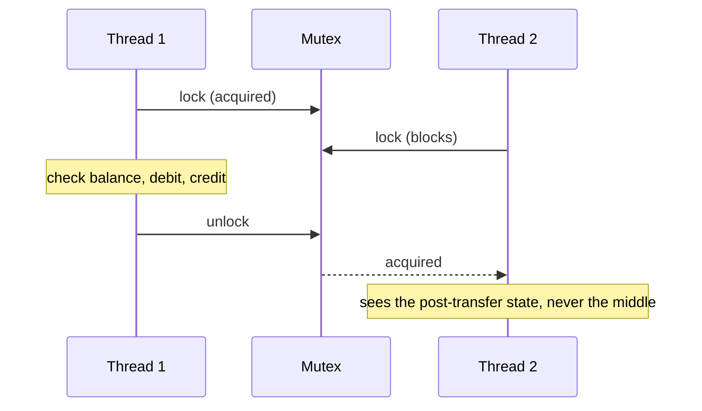

Your service keeps an in-memory count of active sessions. Request threads increment it on login and decrement it on logout. After a day of traffic the dashboard shows −1,312 active sessions. No request failed, nothing was logged, and the code is two lines long. Every lost update came from the same place: `active += 1` is not one operation, and two threads executed it at the same time.

A race is not a rare event you can wait out. At a million increments a second, an interleaving with a one-in-a-million chance happens every second. The fix is also not "add a lock" as a reflex. The fix is knowing *what the lock protects*, which is almost never a single variable. This lesson builds that model from the instructions up: why the update is lost, what a mutex does to prevent it, what it costs, and how Python, Go and Rust each decide how much of this is your problem.

## Three instructions, not one

`counter += 1` reads like an atomic action. It compiles to three:

```text
load   r1, [counter]     ; read the current value into a register
add    r1, 1             ; increment the private copy
store  [counter], r1     ; write it back
```

CPython does the same thing one level up. The bytecode for a global increment is a load, an add and a store, and the interpreter may switch threads between any two bytecodes:

```text
LOAD_GLOBAL   counter
LOAD_CONST    1
BINARY_OP     +=
STORE_GLOBAL  counter
```

Even when an x86 compiler emits a single `add dword ptr [counter], 1`, the CPU still performs a read, a modify and a write. Without a `lock` prefix, another core can read the same old value in between.

The register is private to each thread; memory is shared. So two threads can each read the same value, each add one to their private copy, and each write back the same result. Here is that interleaving with the counter starting at 41:

| Step | Thread A | Thread B | `counter` in memory |
|---|---|---|---|
| 1 | load → 41 | | 41 |
| 2 | | load → 41 | 41 |
| 3 | add → 42 | | 41 |
| 4 | | add → 42 | 41 |
| 5 | store 42 | | 42 |
| 6 | | store 42 | 42 |

Two increments ran and one survived. This is the **lost update**. Step through it:

```viz
{"type": "concurrency", "algorithm": "race-condition", "threads": 2,
 "title": "Two threads, one counter, one lost update",
 "caption": "Each increment is load, add, store. When both loads happen before either store, both threads write the same value and one increment vanishes."}
```

The number of lost updates depends on how often the scheduler (or two cores running truly in parallel) splits a load from its store. On one core with preemptive scheduling it is rare; on many cores it is constant. Four threads each incrementing a million times on a multicore machine will typically finish well short of four million, and the exact number changes every run. That non-determinism is what makes races expensive: the test that passed yesterday proves nothing.

## Data races versus race conditions

Engineers use these two phrases interchangeably. They are different bugs, and the difference matters for which tool can find them.

A **data race** is a property of memory accesses: two threads access the same memory location, at least one access is a write, and nothing orders them (no lock, no atomic, no channel operation establishes that one *happens before* the other). The lost update above is a data race.

A **race condition** is a property of your logic: the program's correctness depends on the relative timing of operations. You can have a race condition with no data race at all:

```python
class Account:
    def __init__(self, balance):
        self._lock = threading.Lock()
        self._balance = balance

    def balance(self):
        with self._lock:
            return self._balance

    def set_balance(self, value):
        with self._lock:
            self._balance = value

def withdraw(account, amount):
    if account.balance() >= amount:                       # check (locked)
        account.set_balance(account.balance() - amount)   # act (locked)
```

Every access to `_balance` is locked, so there is no data race, and a race detector will stay silent. But two threads withdrawing 80 from a balance of 100 can both pass the check before either acts. Both withdrawals succeed and the balance ends at 20 (or at −60 with a slightly different interleaving) after 160 was paid out. The lock protects each access; nothing protects the *decision*. This is the **check-then-act** race, and its cousin **read-modify-write** is what `counter += 1` is.

How languages treat the narrower bug, the data race, varies enormously:

| Language | What a data race means |
|---|---|
| C, C++ | Undefined behaviour. The compiler may assume races never happen and optimise accordingly (hoisting a read out of a loop so it never sees the other thread's write). |
| Rust (safe code) | A compile error. The type system rejects unsynchronised shared mutation. |
| Go | Detectable at runtime with `-race`. Races on multiword values (interfaces, slices, strings) can produce torn values that no thread ever wrote. |
| Java | Defined but weak: you may read stale or reordered values, but never a value out of thin air. |
| CPython with the GIL | Individual bytecodes and built-in C operations are atomic relative to each other; anything spanning several bytecodes races. |

Race detectors find data races. Race conditions need you to find them, by naming the invariant.

## A lock protects an invariant

An **invariant** is a statement about your data that must be true whenever another thread might look. "The session count equals the number of live sessions." "Every key in the map has exactly one node in the LRU list." "The sum of all account balances is constant." Invariants usually span more than one variable, and every update breaks them briefly: a transfer debits one account before it credits the other.

A **critical section** is the stretch of code during which the invariant may be false. A mutex's job is to make sure no other thread can observe or modify the data during that stretch. That gives you the rule that separates correct locking from decorative locking:

> Every access to the data an invariant covers, reads included, goes through the same lock, and the lock is held for the whole span in which the invariant is broken.

Take a transfer of 100 from account A (balance 500) to account B (balance 300). The invariant is `A + B == 800`.

```python
class Bank:
    def __init__(self):
        self._lock = threading.Lock()
        self._balances = {"A": 500, "B": 300}

    def transfer(self, src, dst, amount):
        with self._lock:                      # invariant may break inside
            if self._balances[src] < amount:
                raise ValueError("insufficient funds")
            self._balances[src] -= amount     # A = 400, B = 300: total 700
            self._balances[dst] += amount     # A = 400, B = 400: total 800
        # invariant holds again once the lock is released

    def total(self):
        with self._lock:                      # reads need the lock too
            return sum(self._balances.values())
```

If `total()` skipped the lock "because it only reads", an auditor thread could run between the two updates and report 700. Nothing crashed and no data was corrupted, but your reconciliation job just paged someone. Readers need the lock because the lock is not about protecting memory from corruption; it is about never letting anyone see a broken invariant.

Notice also that the check (`< amount`) is inside the same critical section as the act. That is what fixes the `withdraw` bug from the previous section: the decision and the update are one atomic step from every other thread's point of view.



## What a mutex actually does

A mutex is a word of memory plus a promise from the kernel. The design Linux uses (a **futex**, "fast userspace mutex") makes the common case cheap:

```python
# Sketch of a futex-based mutex. state: 0 = unlocked, 1 = locked, 2 = locked with waiters.
def lock(m):
    if compare_and_swap(m.state, 0, 1):         # fast path: one atomic instruction
        return
    while exchange(m.state, 2) != 0:            # mark "someone is waiting"
        futex_wait(m.state, 2)                  # syscall: sleep until woken

def unlock(m):
    if exchange(m.state, 0) == 2:               # were there waiters?
        futex_wake(m.state, 1)                  # syscall: wake one of them
```

Three things follow from that sketch:

1. **An uncontended lock never enters the kernel.** It is one atomic compare-and-swap to lock and one atomic exchange to unlock. Rust's `std::sync::Mutex` on Linux, glibc's `pthread_mutex_t` and Go's `sync.Mutex` all have this shape.
2. **Contention is what costs.** When the lock is held, the loser eventually calls `futex_wait`, which is a system call, a context switch and later a wake-up that waits for a free core. Many implementations spin for a short while first, betting the holder will release within a microsecond; Go's `sync.Mutex` spins briefly before parking the goroutine.
3. **A mutex also orders memory.** Acquiring is an *acquire* operation and releasing is a *release*: everything the previous holder wrote before `unlock` is visible to the next holder after `lock`. A plain boolean flag you set and check yourself provides neither exclusion nor visibility. [Atomics and lock-free programming](/learn/systems/concurrency/atomics-and-lock-free) covers why.

Order-of-magnitude costs on a modern server:

| Situation | Approximate cost |
|---|---|
| Lock and unlock, uncontended, cache line already local | ~10–25 ns |
| Uncontended, but the lock's cache line was last touched by another core | ~50–150 ns |
| Contended: the waiter sleeps and is woken | several µs (syscalls, a context switch, wake-up latency) |

```viz
{"type": "concurrency", "algorithm": "mutex", "threads": 3,
 "title": "The same increments, serialised by a mutex",
 "caption": "Load, add and store now run as one indivisible step from the other threads' point of view. Correctness is restored; the price is that the threads queue behind each other."}
```

## The same bug in Python, Go and Rust

### Python: the GIL is not a lock for your data

Classic CPython has a **global interpreter lock**: one thread executes Python bytecode at a time. The GIL is released when a thread blocks on I/O, and the interpreter asks the running thread to drop it every 5 ms (`sys.getswitchinterval()`). A switch can land between `LOAD_GLOBAL` and `STORE_GLOBAL`, so `counter += 1` can lose updates even with the GIL.

In practice, recent CPython versions only check for a pending switch at particular points in the bytecode (such as loop back-edges and calls), so the simple counter loop rarely loses an update on a GIL build. That is the worst possible outcome for learning: people run the experiment, see the right answer, and conclude it is safe. It is not, and the free-threaded build removes the illusion.

Python 3.13 shipped an optional **free-threaded** build (PEP 703) with no GIL, and 3.14 promoted it from experimental to supported, although it is still a separate build rather than the default. Threads there really run Python in parallel on different cores, and the counter loop loses updates freely. Built-in containers keep their per-operation guarantees through per-object locks, so a single `list.append` or `dict[key] = value` from many threads is still safe. Compound operations (`d[k] = d.get(k, 0) + 1`, `if k not in d: d[k] = v`) were never atomic and still are not. The fix is the same on both builds:

```python
import threading

lock = threading.Lock()
counter = 0

def work():
    global counter
    for _ in range(100_000):
        with lock:
            counter += 1
```

### Go: cheap goroutines and a race detector

Go lets you write the race, then gives you a tool to catch it. Put the mutex next to the data it guards and keep both unexported:

```go
type Counter struct {
    mu sync.Mutex // guards n
    n  int
}

func (c *Counter) Inc() {
    c.mu.Lock()
    defer c.mu.Unlock()
    c.n++
}
```

Run your tests with `go test -race`. The race detector (built on ThreadSanitizer) records, for every memory access, which synchronisation events preceded it, and reports two conflicting accesses that are not ordered by happens-before, with both stack traces. Its limits are what a senior engineer knows about it: it slows execution by roughly 2–20x and uses 5–10x the memory, and it only reports races that *actually execute* during the run. A clean `-race` run over a test suite that never exercises concurrent access proves nothing. Run it in CI on tests that genuinely run things in parallel, and consider a small canary fleet with it enabled.

Go also has one race it catches unconditionally: concurrent writes to a built-in `map` crash the process with `fatal error: concurrent map writes`. That is a deliberate, best-effort check, and it is not recoverable.

### Rust: the mutex owns the data

Rust refuses to compile the unsynchronised version. The idiomatic fix puts the data *inside* the mutex:

```rust
use std::sync::{Arc, Mutex};
use std::thread;

fn main() {
    let counter = Arc::new(Mutex::new(0u64));
    let handles: Vec<_> = (0..4)
        .map(|_| {
            let c = Arc::clone(&counter);
            thread::spawn(move || {
                for _ in 0..100_000 {
                    *c.lock().unwrap() += 1; // the guard unlocks at the end of the statement
                }
            })
        })
        .collect();
    for h in handles {
        h.join().unwrap();
    }
    println!("{}", *counter.lock().unwrap()); // always 400000
}
```

Two marker traits make this work. A type is **`Send`** if it is safe to move to another thread, and **`Sync`** if it is safe for several threads to hold `&T` at once. `thread::spawn` requires its closure to be `Send + 'static`. `Rc<T>` is neither `Send` nor `Sync` (its reference count is not atomic), so capturing an `Rc` in a spawned closure is a compile error. `RefCell<T>` is `Send` but not `Sync`. `Mutex<T>` is `Sync` whenever `T: Send`, because it serialises access, and that is how shared mutation is allowed at all.

The deeper win is that `lock()` returns a guard, and the only way to reach the data is through the guard. The association "this lock protects this data", which is a comment in Go and in Python, is part of the type in Rust. If a thread panics while holding the guard, the mutex is marked **poisoned** and later `lock()` calls return an error, because the invariant may have been left broken halfway through.

What Rust does not do is just as important: it does not prevent race conditions. The `withdraw` bug compiles fine if `balance()` and `set_balance()` each lock separately. It also does not prevent deadlock, which is the [next lesson](/learn/systems/concurrency/deadlock).

## Lock granularity: correctness first, then contention

A lock is correct when it covers the invariant. It is fast when it is rarely contended. The two pull in opposite directions, and the first tool for reasoning about it is simple arithmetic.

If every request holds a lock for 2 µs, then at most 1 / 2 µs = 500,000 requests per second can pass through that lock, no matter how many cores you add. Contention makes the real ceiling lower, because each handoff moves the lock's cache line between cores and may involve a sleep and a wake-up. A 32-core box that could otherwise serve 1.6 million requests per second will plateau somewhere well below 500,000 and show idle CPU while it does. Amdahl's law says the same thing more generally: if 5% of the work is serialised, 64 cores give at most 1 / (0.05 + 0.95/64) ≈ 15x speedup.

The techniques, in the order you should reach for them:

1. **Shrink the critical section.** Compute outside the lock and lock only to read or publish. Never hold a lock across a network call, disk I/O, a sleep, or a callback into code you do not control (it may take other locks, which is how deadlocks are born).
2. **Split the lock by data (striping or sharding).** Keep N locks and pick one by `hash(key) % N`. Java's `ConcurrentHashMap` started with 16 lock segments and later moved to per-bucket locking with compare-and-swap for empty buckets. The cost: any operation that spans shards (a consistent snapshot, a cross-key transaction) needs several locks and a rule about their order.
3. **Shard the data per thread.** A hot counter can be one counter per thread or per core, summed on read. Java's `LongAdder` does this; the Linux kernel uses per-CPU counters for the same reason.
4. **Publish immutable snapshots.** Readers take a reference to an immutable version; a writer builds a new version and swaps the reference. Readers never block. This is the idea behind read-copy-update in the kernel and `arc-swap` in Rust.
5. **Do not share.** Give the state a single owner thread and send it messages. [Actors, channels and CSP](/learn/systems/concurrency/actors-channels-and-csp) covers the trade-offs.

Here is the most common granularity mistake, a cache that holds its lock across a database call:

```python
# Wrong: every other request waits 20 ms for this one's database call.
def get(key):
    with lock:
        if key not in cache:
            cache[key] = fetch_from_db(key)
        return cache[key]

# Better: check under the lock, do the slow work outside it, publish under it.
def get(key):
    with lock:
        if key in cache:
            return cache[key]
    value = fetch_from_db(key)              # may run twice for the same key
    with lock:
        return cache.setdefault(key, value) # first writer wins; everyone returns the same value
```

The second version allows two requests for the same missing key to both hit the database. If that duplicate work matters (an expensive query, a thundering herd after a cache flush), the fix is **single-flight**: the first caller for a key registers an in-flight future, later callers wait on that future instead of issuing their own query. Go ships this as `golang.org/x/sync/singleflight`.

## Exercise: replay an interleaving

Real threads are non-deterministic, which makes races hard to reason about and impossible to unit-test directly. The standard trick is to make the scheduler an input: describe the interleaving explicitly and replay it. Tools such as Rust's `loom` do exactly this, exhaustively, for small programs.

```exercise
id: replay-interleaving
title: Replay a schedule and count lost updates
prompt: |
  Several threads increment one shared counter (starting at 0). Thread `i`
  performs `increments[i]` increments, and every increment is three steps:

  1. **load**: copy the shared counter into the thread's private register
  2. **add**: add 1 to the register
  3. **store**: write the register back to the shared counter

  `schedule` is a list of thread indices. Each entry executes the *next* step
  of that thread. Entries naming a thread that has finished all its
  increments are ignored. If the schedule runs out before every thread has
  finished, run the remaining steps of thread 0 to completion, then thread 1,
  and so on.

  Return the final value of the shared counter.
languages: [python, javascript]
entry: final_counter
starter:
  python: |
    def final_counter(increments, schedule):
        # Track, per thread: which step comes next, its register, and how
        # many increments it has completed.
        return 0
  javascript: |
    function final_counter(increments, schedule) {
      // Track, per thread: which step comes next, its register, and how
      // many increments it has completed.
      return 0;
    }
tests:
  - args: [[1, 1], [0, 0, 0, 1, 1, 1]]
    expected: 2
    label: serial schedule loses nothing
  - args: [[1, 1], [0, 1, 0, 1, 0, 1]]
    expected: 1
    label: both load before either stores
  - args: [[3, 2], []]
    expected: 5
    label: empty schedule runs threads in order
  - args: [[1, 1, 1], [0, 1, 2, 0, 1, 2, 0, 1, 2]]
    expected: 1
  - args: [[1, 1], [0, 0, 0, 0, 0, 1, 1, 1]]
    expected: 2
    label: steps for a finished thread are ignored
  - args: [[2, 2], [0, 1, 0, 1, 0, 1, 1, 1, 1, 0, 0, 0]]
    expected: 3
    hidden: true
  - args: [[3, 3], [0, 1, 1, 1, 1, 1, 1, 0, 0, 1, 0, 0, 0, 0, 0, 0, 1, 1]]
    expected: 2
    hidden: true
    label: six increments, final value 2
hints:
  - "Keep three arrays indexed by thread: next step (0, 1 or 2), register value, and increments completed."
  - "A thread is finished when its completed count equals increments[i]; skip schedule entries for it."
  - "Only the store step changes the shared counter, and only the store step completes an increment."
```

The last hidden test is worth tracing by hand. Thread 0 loads 0 and stalls. Thread 1 completes two full increments (counter = 2). Thread 0 adds and stores 1, wiping them out. Thread 1 loads 1 for its third increment and stalls. Thread 0 completes its last two increments (counter = 3). Thread 1 finally stores 2. Six increments, final value 2. With two threads and at least two increments each, 2 is the minimum possible result, which is why "the count is off by a little" is not a safe assumption about a race.

## Senior signals

- You distinguish a **data race** (unordered conflicting accesses, found by tools) from a **race condition** (timing-dependent logic, found by naming the invariant), and you know a program can have the second with none of the first.
- You describe a lock by the **invariant** it protects, insist that readers take it too, and put checks and the acts that depend on them in the same critical section.
- You know the mutex fast path is one atomic instruction and that **contention**, not locking, is the cost; you can compute the throughput ceiling of a lock from its hold time.
- You never hold a lock across I/O or a callback into foreign code, and you reach for single-flight when duplicate work outside the lock matters.
- You can explain why the GIL never made compound operations thread-safe, what the free-threaded build changes, and why "it works on my machine" is especially misleading on a GIL build.
- You run Go tests with `-race` and know its blind spot (only executed interleavings); you can explain `Send` and `Sync` and why Rust stops data races but not deadlocks or check-then-act bugs.

## Check yourself

```quiz
- q: >-
    Two threads each run `x += 1` 1,000 times on a free-threaded Python build, with x starting at 0 and no lock. Which range of final values is possible?
  options: ["Anywhere from 2 to 2000", "Anywhere from 0 to 2000", "Exactly 2000 every time", "Anywhere from 1000 to 2000"]
  answer: 0
  explanation: >-
    1000 is the tempting floor, but a single stale store can erase many increments. Thread A loads 0 and stalls; B completes 999 increments; A stores 1; B loads 1 and stalls; A completes its remaining 999 (x = 1000); B stores 2. The floor is 2: every store writes a loaded value plus one, and each thread's final load happens after its own earlier stores, so the last store overall writes at least 2.
- q: >-
    A Bank class locks correctly inside transfer(). A new total() method reads all balances without the lock "because it only reads". What can go wrong?
  options: ["Balances can go negative when it races with transfer()", "It can see a transfer halfway through and report a false total", "It can deadlock with transfer() when both run at once", "Nothing, because reads alone cannot corrupt shared data"]
  answer: 1
  explanation: >-
    Between the debit and the credit the invariant (the sum is constant) is false. A reader outside the lock can see that intermediate state and report a sum that was never true. Nothing is corrupted, but locks exist to hide broken invariants from every observer, readers included. No deadlock is possible with a reader that takes no lock.
- q: >-
    Which bug does safe Rust's type system rule out at compile time?
  options: ["Holding a lock across a slow network call", "Check-then-act where each step takes the lock", "Deadlock between two threads taking two mutexes", "A data race on a plain counter shared by two threads"]
  answer: 3
  explanation: >-
    Send, Sync and the borrow checker forbid unsynchronised shared mutation, which is exactly a data race. Deadlock, check-then-act across two lock() calls and slow critical sections all compile happily; they are logic and performance bugs, not memory-safety bugs.
- q: >-
    Each request holds a global lock for 5 µs. The team wants 400,000 requests per second through it on a 32-core machine. What should you tell them?
  options: ["Fine, once enough threads keep the lock busy at all times", "Fine: 32 cores × 200,000 per core gives 6.4 million per second", "Impossible: one lock caps it near 200,000 per second at best", "Fine, as long as a spinlock replaces the blocking mutex"]
  answer: 2
  explanation: >-
    A lock serialises its holders, so throughput is at most 1 / hold time = 200,000 per second regardless of core count, and handoff costs push the real ceiling lower. Cores do not multiply a serial section. Spinning changes the waiting strategy, not the serialisation; the fix is to shrink or shard the critical section.
- q: >-
    Your Go service's tests pass with go test -race. What have you learned?
  options: ["The program has no data races and cannot deadlock", "The program has no data races on any possible code path", "The program has no data races or race conditions", "No race occurred in the interleavings tested"]
  answer: 3
  explanation: >-
    The race detector is dynamic: it tracks happens-before for accesses that really happen during the run, so a clean run only says no data race occurred on the paths and interleavings those tests executed. Untested paths, or tests that never run things concurrently, are invisible to it. It never claims anything about race conditions without a data race, or about deadlocks.
```
