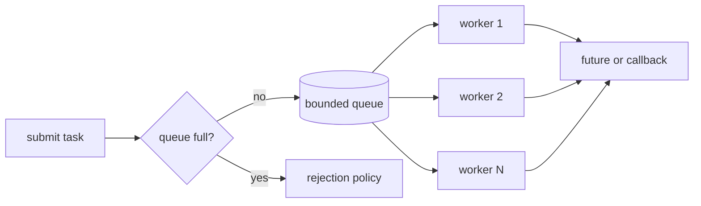
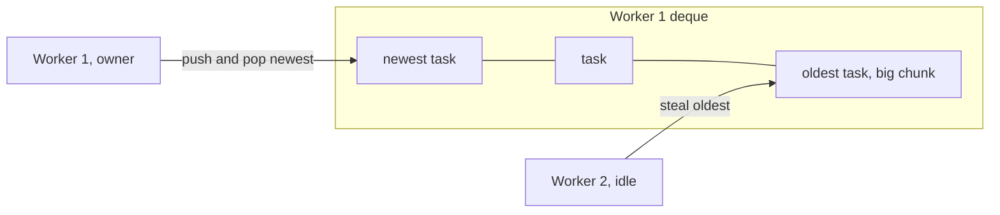

A checkout service handles each request on a thread from a pool of 200, with an unbounded queue in front of it. One afternoon the payment provider slows from 50 ms to 2 seconds per call. Within a minute all 200 threads are blocked on payment calls, the queue holds 90,000 requests, the heap is climbing, and every request, including the ones that never touch payments, waits minutes for a thread. When the provider recovers, the service spends another ten minutes working through requests whose clients gave up long ago.

Nothing in that story is a bug in the thread pool. It is the pool's *design*: its size, its queue, what it does when the queue is full, and the fact that one dependency could consume every thread. Those four decisions determine how your service behaves under overload, and overload is the only condition in which a thread pool's design is ever tested.

## Why pools exist

Creating an OS thread costs tens of microseconds and reserves a stack; a thread per request is affordable at 100 requests per second and ruinous at 10,000. Worse, thread-per-request means **unbounded concurrency**: under overload you create more threads, which means more context switches, more memory and less throughput, exactly when you can least afford it.

A thread pool is a fixed or bounded set of long-lived worker threads plus a queue of tasks. It amortises thread creation, it **bounds concurrency**, and, most importantly, it gives you one place to measure load and apply a policy when there is too much of it.

```viz
{"type": "concurrency", "algorithm": "thread-pool", "threads": 3, "tasks": 8,
 "title": "Eight tasks, three workers, one queue",
 "caption": "Workers take tasks from the head of the queue and return for the next one when they finish. Total time is set by the work divided among the workers, not by the number of tasks."}
```

## Anatomy of an executor



Every executor, whether it is Java's `ThreadPoolExecutor`, Python's `concurrent.futures`, a Go worker pool built from channels or Tokio's blocking pool, makes the same decisions:

1. **How many workers**, and whether the count can grow.
2. **What kind of queue**: bounded or unbounded, FIFO, LIFO or priority.
3. **What happens when it is full** (the rejection or saturation policy).
4. **How results and errors come back**: futures, callbacks, or nowhere at all.
5. **How it shuts down**: stop accepting, drain with a deadline, then cancel.

## Sizing: how many threads?

**CPU-bound work** wants about one thread per core. More threads cannot add CPU; they only add context switches and evict each other's cache. In CPython with the GIL, CPU-bound threads do not run in parallel at all, so CPU work goes to a `ProcessPoolExecutor` (paying to pickle arguments and results) or to the free-threaded build.

**I/O-bound work** wants more threads than cores, because a thread blocked on a socket uses no CPU. The classic formula, from *Java Concurrency in Practice*, is:

$$N_{threads} = N_{cores} \times U_{target} \times \left(1 + \frac{W}{C}\right)$$

where $W/C$ is the ratio of time spent waiting to time spent computing. Worked example: an 8-core service whose requests spend 5 ms on CPU and 45 ms waiting for the database has $W/C = 9$, so at 100% target utilisation it wants $8 \times 1 \times 10 = 80$ threads.

Cross-check with **Little's law**, $L = \lambda W$: the number of requests in flight equals throughput times latency. Eight cores at 5 ms of CPU per request saturate at 1,600 requests per second; at 50 ms each, that is $1600 \times 0.05 = 80$ requests in flight. Same answer, because the formula *is* Little's law applied to the CPU.

Now the part the formula leaves out. Suppose the database connection pool has 20 connections. At most 20 threads can be talking to the database at once; the other 60 sit blocked waiting for a connection. Throughput is capped at $20 / 45\,\text{ms} \approx 444$ requests per second, whatever the thread count. **The binding constraint is the tightest resource behind the pool**, and a senior engineer sizes the pool from that resource, not from a formula about cores. Two more real-world adjustments:

- In a container, "cores" means the CPU quota, not the host's `nproc` (see [processes and threads](/learn/systems/operating-systems/processes-and-threads) for what quota throttling looks like).
- Know your defaults. Python's `ThreadPoolExecutor` defaults to `min(32, os.cpu_count() + 4)` workers. Java's `ForkJoinPool.commonPool()` uses one fewer thread than the number of available processors.

## The queue: the bound is the feature

An unbounded queue turns overload into latency. Every task still gets done, eventually, after its client has timed out, which means the pool spends its capacity on work nobody will read. Memory grows until something falls over. That is the checkout story.

Queueing theory says how fast latency grows as a pool approaches saturation. For the simplest model (one server, random arrivals, M/M/1), the average time waiting in the queue is:

$$W_q = \frac{\rho}{1-\rho} \times \text{service time}$$

where $\rho$ is utilisation. At 50% utilisation a task waits one service time on average; at 80%, four; at 90%, nine; at 99%, ninety-nine. Multi-worker pools have a sharper knee but the same shape. Two design rules follow:

- **Run pools well below 100% utilisation if you care about latency.** 70–80% at peak is a common target.
- **Bound the queue so that the longest wait is shorter than the caller's timeout.** Ten workers at 100 ms per task drain 100 tasks per second. If clients time out after 2 seconds, a task at position 200 or later in the queue will time out before it starts. A queue bounded at around 100 turns the rest into immediate, cheap rejections the client can retry elsewhere.

When the queue is full, something has to give. The policy is a product decision disguised as a configuration flag:

| Policy | Behaviour | Good for | Bad for |
|---|---|---|---|
| Reject (abort) | Fail the submit immediately; the caller returns 503 or retries elsewhere | Request serving: fail fast | Work that must not be lost |
| Caller runs | The submitting thread runs the task itself | Batch pipelines: slows the producer naturally | Event-loop or accept threads, which must never block |
| Block the submitter | `submit` waits for space | Internal pipelines with a bounded producer | Request threads (turns overload into hung requests) |
| Drop oldest or newest | Discard a task | Telemetry, "latest value wins" updates | Anything with side effects |

Two famous gotchas live here. Java's `ThreadPoolExecutor` only creates threads beyond its core size when the queue *rejects* a task, so with an unbounded `LinkedBlockingQueue` (what `Executors.newFixedThreadPool` uses) the maximum pool size is never reached and the queue grows forever. `Executors.newCachedThreadPool` makes the opposite mistake: a zero-capacity hand-off queue and an unbounded thread count, so overload creates threads without limit. And Python's `ThreadPoolExecutor` uses an unbounded internal queue, so `submit` never blocks: submitting a million tasks allocates a million work items up front. Put a `threading.BoundedSemaphore` around `submit` if the producer can outrun the pool.

The same principle at the system level is [backpressure](/learn/system-design/building-blocks/resilience-patterns): a bound is what makes overload visible at the edge, where it can be handled, instead of deep inside, where it becomes a timeout everywhere.

## Bulkheads: one pool per dependency

The checkout service had a second problem: payments and everything else shared one pool. A slow payment provider held all 200 threads, so the catalogue and account pages failed too. The fix is a **bulkhead**, named after a ship's watertight compartments: a separate pool (or a semaphore, which is cheaper) per downstream dependency. If the payments pool has 40 threads, a payment outage can block at most 40, and the rest of the service keeps serving. Netflix's Hystrix library made thread-pool-per-dependency isolation mainstream in the JVM world.

```viz
{"type": "system", "scenario": "bulkhead",
 "title": "Separate pools contain a slow dependency",
 "caption": "Each dependency gets its own compartment. When one dependency slows down, it exhausts only its own threads; other requests keep their capacity."}
```

The cost is utilisation: idle threads in the catalogue pool cannot help a busy payments pool. That is the point.

## When a pool deadlocks itself

A task that blocks waiting for another task *on the same bounded pool* can deadlock the pool:

```python
from concurrent.futures import ThreadPoolExecutor

pool = ThreadPoolExecutor(max_workers=2)

def child(x):
    return x * 2

def parent(x):
    return pool.submit(child, x).result()   # a worker blocks waiting on the queue

futures = [pool.submit(parent, i) for i in range(2)]
print([f.result() for f in futures])        # usually hangs forever
```

With the usual timing, both workers pick up a `parent` before either child is queued; both submit a `child` and block on its result, and both children sit in the queue with no free worker to run them. It depends on timing, which is exactly why it passes in tests and hangs under load. This **thread-starvation deadlock** is common in real code, usually disguised: a request handler that fans out to "the shared executor" and waits, running on a thread from that same executor. The fixes: never block a pool thread on work submitted to the same pool; use separate pools for separate stages; compose futures asynchronously (`thenCompose` in Java, `await` in async code) instead of blocking on `.result()`; or use a fork-join pool, whose `join()` runs other queued tasks while it waits.

## Work stealing

A single shared queue has two scaling problems. Every submit and every take touches the same lock and the same cache lines, so with 64 workers and small tasks the queue itself becomes the bottleneck. And a task's data is usually hot in the cache of the core that created it, but a shared FIFO hands it to whichever worker happens to be free.

**Work stealing** fixes both. Each worker owns a double-ended queue:

- The owner pushes new tasks and pops its next task at the **same end** (LIFO). The newest task is the one whose data is hottest in cache, and the owner's operations almost never contend with anyone.
- An idle worker **steals** from the **other end** of a random victim's deque (FIFO). In divide-and-conquer work the oldest task is the biggest unsplit chunk, so one steal buys a lot of work and steals stay rare.



The deque needs synchronisation only when owner and thief compete for the last element, which the Chase–Lev deque handles with a single compare-and-swap. Work stealing is how most modern schedulers work:

- **Java's `ForkJoinPool`**, behind parallel streams and the default executor for `CompletableFuture`'s async methods.
- **The Go scheduler.** Each logical processor (P, one per `GOMAXPROCS`) has a local run queue of goroutines; an idle P steals half of another P's queue, and every P occasionally checks a global queue so nothing starves there.
- **Tokio's multi-threaded runtime**, with per-worker queues, a global injection queue, and a "LIFO slot" that runs a just-woken task next on the same worker to keep its data in cache.
- **Rayon** in Rust, where parallelism is one method call away:

```rust
use rayon::prelude::*;

fn count_primes(limit: u64) -> usize {
    (2..limit).into_par_iter().filter(|&n| is_prime(n)).count()
}
```

Rayon splits the range recursively; idle threads steal the larger halves. You get close to linear speedup on CPU-bound work without choosing a chunk size.

In Go you rarely build a pool at all, because goroutines are cheap enough to create per task. What you still need is a **bound on concurrency**, which `errgroup` provides:

```go
g, ctx := errgroup.WithContext(ctx)
g.SetLimit(16) // at most 16 in flight; g.Go blocks while the limit is reached
for _, id := range ids {
    g.Go(func() error { // Go 1.22+: each iteration has its own id
        return process(ctx, id)
    })
}
if err := g.Wait(); err != nil {
    return err // the first error; ctx was cancelled for the others
}
```

## An executor checklist

The difference between a pool that behaves under overload and one that pages you is a list of unglamorous details:

- **Name the threads** (`payments-worker-7`). Thread dumps and profiles are unreadable otherwise.
- **Bound the queue and choose the rejection policy on purpose.** Export rejections as a metric.
- **Measure queue wait time separately from run time.** Wait time is what correlates with user-visible latency and with saturation; average CPU does not.
- **Drop work whose deadline has passed** before starting it. Running a task whose client has gone is pure waste during the exact period you have none to spare.
- **Propagate context** (trace IDs, deadlines, auth) into tasks, and clear thread-locals after each task so one request's context never leaks into the next.
- **Surface errors.** An exception inside a Python future or a Java `Future` disappears silently unless someone calls `result()`/`get()`. Log failures from a completion callback.
- **Shut down deliberately.** Stop accepting, let in-flight work finish within a deadline, then cancel.

## Exercise: simulate a bounded pool

```exercise
id: bounded-pool-simulation
title: Simulate a pool with a bounded queue
prompt: |
  Simulate a thread pool with `workers` identical workers and a FIFO queue
  that holds at most `queue_capacity` waiting tasks (possibly 0).

  `tasks[i] = [arrival, duration]`, with arrivals in non-decreasing order and
  positive integer durations. At any time `t`, events happen in this order:

  1. Workers whose task finishes at `t` become free. Each free worker
     immediately starts the task at the head of the queue (if any) at time `t`.
  2. Tasks arriving at `t` are then admitted one by one, in index order: if a
     worker is idle, the task starts at once; otherwise, if the queue holds
     fewer than `queue_capacity` tasks, it joins the back of the queue;
     otherwise it is **rejected**.

  Return a list with, for each task, the time it finishes, or `-1` if it was
  rejected.
languages: [python, javascript]
entry: pool_finish_times
starter:
  python: |
    from collections import deque

    def pool_finish_times(workers, queue_capacity, tasks):
        free_at = [0] * workers      # when each worker next becomes free
        queue = deque()              # indices of waiting tasks
        result = [None] * len(tasks)
        # your code here
        return result
  javascript: |
    function pool_finish_times(workers, queue_capacity, tasks) {
      const freeAt = new Array(workers).fill(0); // when each worker next becomes free
      const queue = [];                          // indices of waiting tasks
      const result = new Array(tasks.length).fill(null);
      // your code here
      return result;
    }
tests:
  - args: [2, 1, [[0, 4], [0, 4], [1, 2], [2, 1], [4, 1]]]
    expected: [4, 4, 6, -1, 5]
  - args: [1, 0, [[0, 3], [1, 1], [3, 2]]]
    expected: [3, -1, 5]
    label: no queue at all
  - args: [3, 5, [[0, 2], [0, 2], [0, 2], [0, 2], [0, 2], [0, 2]]]
    expected: [2, 2, 2, 4, 4, 4]
  - args: [1, 2, [[0, 5], [1, 1], [2, 1], [3, 1], [6, 1]]]
    expected: [5, 6, 7, -1, 8]
    label: queued tasks start before a new arrival
  - args: [2, 3, []]
    expected: []
    hidden: true
  - args: [2, 2, [[0, 10], [0, 1], [0, 1], [0, 1], [0, 1], [1, 1]]]
    expected: [10, 1, 2, 3, -1, 4]
    hidden: true
hints:
  - "Before admitting each arrival at time t, repeatedly take the worker that frees earliest; if it is free at or before t and the queue is non-empty, start the queue head at that worker's free time."
  - "After the last arrival, drain the queue the same way with t = infinity."
  - "A task can only be queued when every worker is busy, so the worker that later picks it up always frees after the task arrived."
```

## Senior signals

- You size a pool from the **tightest downstream resource** and Little's law, not from a rule of thumb about cores, and you size to the container quota.
- You treat the **queue bound and rejection policy** as the most important settings, and you can explain why an unbounded queue converts overload into timeouts and memory growth.
- You know the utilisation curve ($\rho/(1-\rho)$) and keep latency-sensitive pools well below saturation.
- You isolate dependencies with **bulkheads** and recognise thread-starvation deadlock when a pool waits on itself.
- You can explain **work stealing**: owner LIFO for locality, thief FIFO for big chunks, and name where it runs (ForkJoinPool, Go's scheduler, Tokio, Rayon).
- You know the traps in your stack: Java's core/max/queue interaction, Python's unbounded executor queue, Go's need for an explicit concurrency limit.

## Check yourself

```quiz
- q: >-
    An 8-core service spends 5 ms of CPU and 45 ms waiting on the database per request. The database connection pool has 20 connections. What limits throughput?
  options: ["Nothing yet; add threads until the latency starts to rise", "The connection pool: 20 / 45 ms is only about 444 per second", "CPU: 8 cores / 5 ms caps it at 1,600 requests per second", "Thread count: 80 threads by the formula give 1,600 per second"]
  answer: 1
  explanation: >-
    The formula N = cores × (1 + W/C) gives 80 threads and a CPU ceiling of 1,600 per second, but only 20 requests can hold a database connection at once, each for 45 ms, so throughput tops out near 444 per second. Extra threads just queue for connections. Size from the tightest resource.
- q: >-
    A pool runs at 90% utilisation with a mean service time of 20 ms. Using the M/M/1 approximation, roughly how long does a task wait in the queue on average?
  options: ["About 20 ms", "About 1,800 ms", "About 180 ms", "About 2 ms"]
  answer: 2
  explanation: >-
    W_q = ρ/(1-ρ) × service time = 0.9/0.1 × 20 ms = 180 ms. At 50% utilisation the wait would be 20 ms; the curve is what makes the last 10–20% of utilisation so expensive for latency.
- q: >-
    A Java ThreadPoolExecutor has corePoolSize 10, maximumPoolSize 100 and an unbounded LinkedBlockingQueue. Under heavy load, how many threads run?
  options: ["One per queued task, up to the 100-thread maximum", "10, as the unbounded queue never rejects a task", "Between 10 and 100, depending on CPU utilisation", "100, once the load is high enough to need them"]
  answer: 1
  explanation: >-
    ThreadPoolExecutor prefers queueing to growing: beyond the core size it creates threads only when offer() to the queue fails. With an unbounded queue that never happens, so the pool stays at 10 and the queue grows without limit. Use a bounded queue if you want the maximum to matter.
- q: >-
    A request handler running on a shared executor with 8 threads submits 3 subtasks to that same executor and blocks on their results. Under load the service hangs. What is happening?
  options: ["Lock-ordering deadlock between the handler threads", "Every worker waits on queued subtasks that no free worker can run", "The executor's queue is too small to hold the subtasks", "Livelock, as the handlers keep retrying their subtasks"]
  answer: 1
  explanation: >-
    This is thread-starvation deadlock: when all 8 workers are handlers waiting on their own subtasks, the subtasks sit in the queue and can never be scheduled. No locks or retries are involved. Separate pools per stage, asynchronous composition, or a fork-join pool whose join helps run queued work avoid it; a bigger queue does not.
- q: >-
    Why does a work-stealing worker pop its own tasks from one end of its deque while thieves steal from the other end?
  options: ["It keeps strict FIFO fairness across all of the tasks", "Owners get cache-hot tasks; thieves take the biggest chunks", "Thieves are lower priority, so they should get the older work", "The deque can only be made lock-free with two separate ends"]
  answer: 1
  explanation: >-
    LIFO for the owner gives it the newest, cache-hot task and keeps owner operations uncontended; FIFO stealing grabs the oldest task, which in divide-and-conquer is the biggest unsplit subproblem, so each steal transfers a lot of work and steals stay rare. Fairness is explicitly traded away, and priority has nothing to do with it.
```
