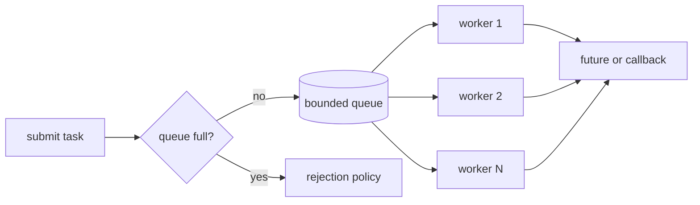
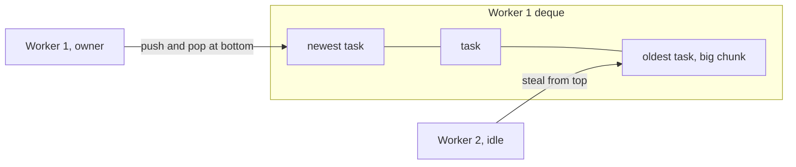

A checkout service handles each request on a thread from a pool of 200, with an unbounded queue in front of it. One afternoon the payment provider slows from 50 ms to 2 seconds per call. Within a minute all 200 threads are blocked on payment calls, the queue holds 90,000 requests, the heap is climbing, and every request, including the ones that never touch payments, waits minutes for a thread. When the provider recovers, the service spends another ten minutes working through requests whose clients gave up long ago.

Nothing in that story is a bug in the thread pool. It is the pool's *design*: its size, its queue, what it does when the queue is full, and the fact that one dependency could consume every thread. Those four decisions determine how your service behaves under overload, and overload is the only condition in which a pool's design is ever tested. Measurements below used CPython 3.14 and Go 1.27 on a 16-core Ryzen 9 9950X3D under WSL2.

## Why pools exist

Creating an OS thread costs tens of microseconds (78 µs for create plus join, measured in the [processes and threads lesson](/learn/systems/operating-systems/processes-and-threads)) and reserves a stack; a thread per request is affordable at 100 requests per second and ruinous at 10,000. Worse, thread-per-request means **unbounded concurrency**: under overload you create more threads, which means more context switches, more memory and less throughput, exactly when you can least afford it.

A thread pool is a bounded set of long-lived workers plus a queue of tasks. It amortises thread creation, it **bounds concurrency**, and it gives you one place to measure load and apply a policy when there is too much.

```viz
{"type": "concurrency", "algorithm": "thread-pool", "threads": 3, "tasks": 8,
 "title": "Eight tasks, three workers, one queue",
 "caption": "Workers take tasks from the head of the queue and return for the next one when they finish. Total time is set by the work divided among the workers, not by the number of tasks."}
```

A pool is not free either. Measured with `ThreadPoolExecutor(8)` and a function that returns its argument: submitting and waiting for one task at a time cost 63–72 µs per task (two cross-CPU wake-ups on this VM), while submitting 20,000 and then collecting cost 3.7–4.2 µs per task. `ProcessPoolExecutor.map` cost 248 µs per task with the default `chunksize=1` and 0.9 µs with `chunksize=500`, because every chunk is pickled, sent through a pipe and unpickled. Tasks must be much larger than the dispatch overhead, or you must batch them.

## Anatomy of an executor



Every executor, whether Java's `ThreadPoolExecutor`, Python's `concurrent.futures`, a Go worker pool built from channels or Tokio's blocking pool, makes the same decisions: **how many workers** and whether the count can grow; **what kind of queue** (bounded or unbounded, FIFO, LIFO or priority); **what happens when it is full**; **how results and errors come back** (futures, callbacks or nowhere); and **how it shuts down** (stop accepting, drain with a deadline, cancel).

## Sizing: how many threads?

**CPU-bound work** wants about one thread per core; more threads add only context switches and cache eviction. With the GIL, CPU-bound Python threads do not run in parallel, so CPU work goes to a `ProcessPoolExecutor` or the free-threaded build.

**I/O-bound work** wants more threads than cores, because a thread blocked on a socket uses no CPU. The formula from *Java Concurrency in Practice*:

$$N_{threads} = N_{cores} \times U_{target} \times \left(1 + \frac{W}{C}\right)$$

where $W/C$ is waiting time over computing time. An 8-core service whose requests spend 5 ms on CPU and 45 ms waiting on the database has $W/C = 9$, so at 100% target utilisation it wants $8 \times 1 \times 10 = 80$ threads. Cross-check with **Little's law**, $L = \lambda W$: eight cores at 5 ms of CPU per request saturate at 1,600 requests per second, and at 50 ms each that is $1600 \times 0.05 = 80$ in flight. Same answer, because the formula *is* Little's law applied to the CPU.

Now the part the formula leaves out. If the database connection pool has 20 connections, at most 20 threads can talk to the database at once and the other 60 wait for a connection. Throughput is capped at $20 / 45\,\text{ms} \approx 444$ requests per second whatever the thread count. **The binding constraint is the tightest resource behind the pool.** Two more adjustments: in a container, "cores" means the CPU quota, not the host's count; and know your defaults. Python's `ThreadPoolExecutor` defaults to `min(32, os.process_cpu_count() + 4)` workers, which was 32 on this machine whatever the container quota. Java's `ForkJoinPool.commonPool()` uses one fewer thread than the available processors.

## The queue: the bound is the feature

An unbounded queue turns overload into latency. Every task still gets done, eventually, after its client has timed out, so the pool spends its capacity on work nobody will read while memory grows.

Queueing theory says how fast waiting grows near saturation. For one server with random arrivals and service times (M/M/1), the mean wait in the queue is $W_q = \frac{\rho}{1-\rho} \times$ service time, where $\rho$ is utilisation. A discrete-event simulation of 400,000 tasks per row confirms the formula and shows the tail, which the formula hides:

| Utilisation $\rho$ | M/M/1 mean wait | M/M/1 p99 wait | 8 workers (M/M/8) mean wait | M/M/8 p99 wait |
|---|---|---|---|---|
| 0.50 | 1.0 × service | 7.9 × | 0.02 × | 0.45 × |
| 0.80 | 4.0 × | 21.9 × | 0.28 × | 2.4 × |
| 0.90 | 9.1 × | 45.4 × | 0.89 × | 5.3 × |
| 0.95 | 20.8 × | 109 × | 2.3 × | 13.4 × |
| 0.99 | about 100 × (slow to converge) | 384 × | 13.4 × | 47.7 × |

Up to 0.9 the simulated values match the exact ones (for M/M/1 the p99 wait is $\ln(100\rho)/(1-\rho)$ service times: 7.8, 21.9, 45.0). Closer to saturation a 400,000-task run has not converged: the exact p99 waits are 91× and 460× for one worker and 11× and 57× for eight at 0.95 and 0.99. More workers flatten the curve at moderate load (pooling), but every row still explodes as $\rho \to 1$. Two design rules follow. **Run latency-sensitive pools well below 100% utilisation**; 70–80% at peak is a common target. **Bound the queue so the longest wait is shorter than the caller's timeout**: ten workers at 100 ms per task drain 100 tasks per second, so with a 2-second client timeout a task at queue position 200 will time out before it starts. A queue bounded at about 100 turns the rest into immediate, cheap rejections the client can retry elsewhere.

### When the queue is full

Something has to give. The policy is a product decision disguised as a configuration flag:

| Policy | Behaviour | Good for | Bad for |
|---|---|---|---|
| Reject (abort) | Fail the submit; the caller returns 503 or retries elsewhere | Request serving: fail fast | Work that must not be lost |
| Caller runs | The submitting thread runs the task itself | Batch pipelines: slows the producer | Event-loop or accept threads, which must never block |
| Block the submitter | `submit` waits for space | Internal pipelines with a bounded producer | Request threads (overload becomes hung requests) |
| Drop oldest or newest | Discard a task | Telemetry, latest-value-wins updates | Anything with side effects |

Two famous gotchas live here. Java's `ThreadPoolExecutor` creates threads beyond its core size only when the queue *rejects* a task, so with an unbounded `LinkedBlockingQueue` (what `Executors.newFixedThreadPool` uses) the maximum is never reached and the queue grows forever; `Executors.newCachedThreadPool` makes the opposite mistake, a zero-capacity hand-off queue with unbounded threads. Python's `ThreadPoolExecutor` has an unbounded internal queue, so `submit` never blocks; put a `threading.BoundedSemaphore` around `submit` if the producer can outrun the pool. The same principle at the system level is [backpressure](/learn/system-design/building-blocks/resilience-patterns).

## Bulkheads: one pool per dependency

The checkout service had a second problem: payments and everything else shared one pool, so a slow provider held all 200 threads and the catalogue failed too. A **bulkhead**, named after a ship's watertight compartments, gives each downstream dependency its own pool (or a cheaper semaphore). With 40 payment threads, a payment outage blocks at most 40, and the rest of the service keeps serving. Netflix's Hystrix library made thread-pool-per-dependency isolation mainstream on the JVM.

```viz
{"type": "system", "scenario": "bulkhead",
 "title": "Separate pools contain a slow dependency",
 "caption": "Each dependency gets its own compartment. When one dependency slows down, it exhausts only its own threads; other requests keep their capacity."}
```

The cost is utilisation: idle catalogue threads cannot help a busy payments pool. That is the point.

## When a pool deadlocks itself

A task that blocks waiting for another task *on the same bounded pool* can deadlock it:

```python
from concurrent.futures import ThreadPoolExecutor

pool = ThreadPoolExecutor(max_workers=2)

def child(x):
    return x * 2

def parent(x):
    return pool.submit(child, x).result()   # a worker blocks waiting on the queue

futures = [pool.submit(parent, i) for i in range(2)]
print([f.result() for f in futures])        # hangs
```

Both workers pick up a `parent`, both submit a `child` and block on its result, and both children sit in the queue with no free worker. Run five times here with a one-second timeout on the inner `result()`, it deadlocked five times out of five. This **thread-starvation deadlock** is usually disguised: a request handler that fans out to "the shared executor" and waits, while running on a thread from that same executor. Fixes: never block a pool thread on work submitted to the same pool; separate pools per stage; compose futures asynchronously (`thenCompose`, `await`) instead of blocking; or use a fork-join pool, whose `join()` runs other queued tasks while it waits.

## Work stealing

A single shared queue has two scaling problems: every submit and take touches the same lock and cache lines, so with many workers and small tasks the queue itself is the bottleneck; and a task's data is hot in the cache of the core that created it, but a shared FIFO hands it to whichever worker is free.

**Work stealing** gives each worker its own double-ended queue. The owner pushes and pops at the **bottom** (LIFO: the newest task, whose data is hottest in cache, with no contention). An idle worker **steals** from the **top** of a random victim's deque (FIFO: the oldest task, which in divide-and-conquer is the biggest unsplit chunk, so one steal buys a lot of work).



### The Chase–Lev deque, traced

The standard lock-free deque (Chase and Lev, 2005) is an array with two indices: `top`, advanced only by thieves via CAS, and `bottom`, written only by the owner. Owner and thieves conflict only over the last element.

| Step | Actor and operation | `top` | `bottom` | Contents (top → bottom) | Result |
|---|---|---|---|---|---|
| 1 | Owner pushes T1, T2, T3 | 0 | 3 | T1 T2 T3 | |
| 2 | Owner pops: `bottom = 2`; `top` 0 < 2, so no conflict possible | 0 | 2 | T1 T2 | T3, no CAS |
| 3 | Thief steals: reads `top = 0`, `bottom = 2`, takes T1, `CAS(top, 0, 1)` succeeds | 1 | 2 | T2 | T1 |
| 4 | Owner pops: `bottom = 1`; now `top == bottom`, the last element, so it must race | 1 | 1 | T2 | |
| 5 | Owner `CAS(top, 1, 2)` succeeds (a concurrent thief's CAS would fail); owner resets `bottom = 2` | 2 | 2 | empty | T2 |

The owner's common path (steps 1 and 2) uses plain loads and stores with a fence; only the last-element pop and every steal pay for a CAS. That is why work stealing scales where a shared queue does not.

### Where it runs

- **Java's `ForkJoinPool`**, behind parallel streams and `CompletableFuture`'s default async executor. External submissions land in shared submission queues; `join()` on an unfinished task helps by running other tasks instead of blocking.
- **Go's scheduler.** Each P (logical processor, one per `GOMAXPROCS`) has a local run queue of 256 goroutines plus a `runnext` slot for the goroutine just readied (so a producer-consumer pair keeps running on one P). An idle P steals half of a random victim's queue, and every 61st scheduling tick a P checks the global queue so nothing starves there.
- **Tokio's multi-threaded runtime**: per-worker queues of 256 tasks, a global injection queue, and a "LIFO slot" that runs a just-woken task next on the same worker to keep its data in cache.
- **Rayon** in Rust: `join(a, b)` pushes `b` on the local deque and runs `a`; if nobody stole `b`, it pops and runs it, otherwise it steals other work while waiting.

```rust
use rayon::prelude::*;

fn is_prime(n: u64) -> bool {
    n >= 2 && (2..).take_while(|d| d * d <= n).all(|d| n % d != 0)
}

fn count_primes(limit: u64) -> usize {
    (2..limit).into_par_iter().filter(|&n| is_prime(n)).count()
}
```

To see why it matters, a Go program ran 800 CPU-bound tasks, the first 100 of them 20 times heavier than the rest, on 8 workers:

| Assignment | Time | Speedup over serial (39 ms) |
|---|---|---|
| Static: worker k gets tasks 100k to 100k+99 | 29 ms | 1.3× |
| Shared queue (a channel) drained by 8 goroutines | 5 ms | 7.4× |
| One goroutine per task (Go's work-stealing scheduler) | 5 ms | 7.3× |

Static partitioning gave worker 0 all the heavy tasks, 74% of the total work, so the best possible speedup was 1.35×. Dynamic assignment, by a shared queue or by stealing, came within 8% of ideal. The second exercise computes both.

In Go you rarely build a pool, because goroutines are cheap enough per task. What you still need is a **bound on concurrency**, which `errgroup` provides:

```go
package batch

import (
	"context"

	"golang.org/x/sync/errgroup"
)

func processAll(ctx context.Context, ids []string, process func(context.Context, string) error) error {
	g, ctx := errgroup.WithContext(ctx)
	g.SetLimit(16) // at most 16 in flight; g.Go blocks while the limit is reached
	for _, id := range ids {
		g.Go(func() error { // Go 1.22+: each iteration has its own id
			return process(ctx, id)
		})
	}
	return g.Wait() // the first error; ctx was cancelled for the others
}
```

## Choosing an executor design

| Design | Contention on submit/take | Load balance with skewed tasks | Cache locality | Overload behaviour | Typical home |
|---|---|---|---|---|---|
| Thread per task | None (no queue) | Perfect | Poor | Unbounded threads, then collapse | Small internal tools |
| Fixed pool, shared bounded FIFO | One lock, hot with many workers | Good | Poor | Rejects at the bound | Request handling, I/O pools |
| Static partition | None | Bad (1.3× measured) | Good | Not applicable | Uniform numeric loops (OpenMP static) |
| Work stealing deques | Rare, only on steals | Good | Good (owner LIFO) | Needs an external bound | ForkJoinPool, Go, Tokio, Rayon |
| Per-dependency bulkheads | Per pool | Within each pool | Varies | Contains one slow dependency | Service clients |

## An executor checklist

- **Name the threads** (`payments-worker-7`); dumps and profiles are unreadable otherwise.
- **Bound the queue and choose the rejection policy on purpose**; export rejections as a metric.
- **Measure queue wait separately from run time.** Wait time is what tracks user-visible latency and saturation.
- **Drop work whose deadline has passed** before starting it.
- **Propagate context** (trace IDs, deadlines, auth) into tasks and clear thread-locals after each task.
- **Surface errors.** An exception inside a Python future or a Java `Future` disappears unless someone calls `result()`/`get()`.
- **Shut down deliberately**: stop accepting, finish in-flight work within a deadline, then cancel.

## Failure modes in production

**Symptom: during a dependency slowdown, every endpoint's latency climbs to the client timeout and memory grows.** Diagnosis: all workers blocked on one dependency and an unbounded queue behind them; queue length and wait time climb while CPU falls. Fix: bulkheads per dependency, a bounded queue sized from the timeout, rejection at the edge.

**Symptom: the service hangs under load with every worker alive, CPU idle, and the queue non-empty.** Diagnosis: thread dumps show workers blocked in `result()`/`get()` on futures submitted to the same pool. Fix: never block a worker on its own pool; separate stages or compose asynchronously.

**Symptom: a Java pool configured with max 100 threads never exceeds 10, and latency grows.** Diagnosis: `corePoolSize` 10 with an unbounded queue; threads beyond core are created only on rejection. Fix: a bounded queue, or set core equal to max.

**Symptom: a parallel job on 8 cores is only 30–40% faster than serial.** Diagnosis: static partitioning of skewed work; per-worker busy time shows one worker running long after the others finish. Fix: dynamic assignment (a shared queue, work stealing, smaller chunks) and big tasks first.

**Symptom: a Python batch job's `ProcessPoolExecutor` is slower than a loop.** Diagnosis: per-task pickling and pipe overhead (248 µs per task measured) exceeds the work. Fix: `chunksize`, or larger tasks.

## Interviewer follow-ups

**"How many threads should this pool have?"** Model answer: for CPU-bound work about the core count (the quota, in a container); for I/O-bound work cores × (1 + W/C), then cap by the tightest downstream resource, since 20 database connections allow 20 concurrent queries whatever the thread count. Common wrong answer: "as many as possible, threads are cheap".

**"Why bound the queue if it means rejecting requests?"** Model answer: an unbounded queue converts overload into latency and memory growth, so work is done after its client left; a bound sized from the client timeout makes overload visible and cheap to handle. Common wrong answer: "a bigger queue absorbs spikes, so unbounded is safest".

**"Explain work stealing."** Model answer: per-worker deques, owner LIFO at the bottom for locality with no contention, thieves FIFO from the top for big chunks, CAS only on steals and the last element; used by ForkJoinPool, Go, Tokio and Rayon. Common wrong answer: "workers steal from a shared queue when idle".

**"What happens at 90% utilisation?"** Model answer: for one server the mean wait is nine service times and p99 around 45 (simulated above); multi-worker pools fare better but the curve still explodes near 1, so latency-sensitive pools run at 70–80%. Common wrong answer: "90% utilisation means 10% headroom, so latency is fine".

## What mid-level engineers get wrong

- **Sizing from cores alone.** Consequence: threads that queue on a 20-connection database pool.
- **Unbounded queues on request paths.** Consequence: work done for clients that already timed out, and memory growth during incidents.
- **One shared pool for every dependency.** Consequence: one slow dependency takes down unrelated endpoints.
- **Blocking a worker on its own pool.** Consequence: a hang that appears only under load.
- **Static partitioning of uneven work.** Consequence: 1.3× on 8 cores in the measurement above.
- **Ignoring dispatch overhead.** Consequence: pools slower than loops for tiny tasks.

## Exercises

```exercise
id: bounded-pool-simulation
title: Simulate a pool with a bounded queue
prompt: |
  Simulate a thread pool with `workers` identical workers and a FIFO queue
  that holds at most `queue_capacity` waiting tasks (possibly 0).

  `tasks[i] = [arrival, duration]`, with arrivals in non-decreasing order and
  positive integer durations. At any time `t`, events happen in this order:

  1. Workers whose task finishes at `t` become free. Each free worker
     immediately starts the task at the head of the queue (if any) at time `t`.
  2. Tasks arriving at `t` are then admitted one by one, in index order: if a
     worker is idle, the task starts at once; otherwise, if the queue holds
     fewer than `queue_capacity` tasks, it joins the back of the queue;
     otherwise it is **rejected**.

  Return a list with, for each task, the time it finishes, or `-1` if it was
  rejected.
languages: [python, javascript]
entry: pool_finish_times
starter:
  python: |
    from collections import deque

    def pool_finish_times(workers, queue_capacity, tasks):
        free_at = [0] * workers      # when each worker next becomes free
        queue = deque()              # indices of waiting tasks
        result = [None] * len(tasks)
        # your code here
        return result
  javascript: |
    function pool_finish_times(workers, queue_capacity, tasks) {
      const freeAt = new Array(workers).fill(0); // when each worker next becomes free
      const queue = [];                          // indices of waiting tasks
      const result = new Array(tasks.length).fill(null);
      // your code here
      return result;
    }
tests:
  - args: [2, 1, [[0, 4], [0, 4], [1, 2], [2, 1], [4, 1]]]
    expected: [4, 4, 6, -1, 5]
  - args: [1, 0, [[0, 3], [1, 1], [3, 2]]]
    expected: [3, -1, 5]
    label: no queue at all
  - args: [3, 5, [[0, 2], [0, 2], [0, 2], [0, 2], [0, 2], [0, 2]]]
    expected: [2, 2, 2, 4, 4, 4]
  - args: [1, 2, [[0, 5], [1, 1], [2, 1], [3, 1], [6, 1]]]
    expected: [5, 6, 7, -1, 8]
    label: queued tasks start before a new arrival
  - args: [2, 3, []]
    expected: []
    hidden: true
  - args: [2, 2, [[0, 10], [0, 1], [0, 1], [0, 1], [0, 1], [1, 1]]]
    expected: [10, 1, 2, 3, -1, 4]
    hidden: true
hints:
  - "Before admitting each arrival at time t, repeatedly take the worker that frees earliest; if it is free at or before t and the queue is non-empty, start the queue head at that worker's free time."
  - "After the last arrival, drain the queue the same way with t = infinity."
  - "A task can only be queued when every worker is busy, so the worker that later picks it up always frees after the task arrived."
```

```exercise
id: static-vs-dynamic
title: Static partitioning versus dynamic scheduling
prompt: |
  All tasks are available at time 0 and `durations[i]` is task i's run time.
  Return the makespan (the time the last task finishes) on `workers`
  identical workers.

  - `"static"`: split the list into consecutive chunks of
    `ceil(len(durations) / workers)` tasks; worker k runs chunk k. The
    makespan is the largest chunk sum.
  - `"dynamic"`: tasks are taken in list order; each task goes to the worker
    that becomes free earliest (ties go to the lowest-numbered worker).

  An empty list has makespan 0.
languages: [python, javascript]
entry: makespan
starter:
  python: |
    def makespan(durations, workers, mode):
        # your code here
        return 0
  javascript: |
    function makespan(durations, workers, mode) {
      // your code here
      return 0;
    }
tests:
  - args: [[20, 20, 1, 1, 1, 1, 1, 1], 4, "static"]
    expected: 40
    label: both heavy tasks land in one chunk
  - args: [[20, 20, 1, 1, 1, 1, 1, 1], 4, "dynamic"]
    expected: 20
  - args: [[], 3, "dynamic"]
    expected: 0
    label: no tasks
  - args: [[5], 4, "static"]
    expected: 5
    label: fewer tasks than workers
  - args: [[3, 3, 3, 3, 3, 3], 3, "static"]
    expected: 6
    label: uniform tasks, same either way
  - args: [[1, 1, 1, 1, 1, 1, 1, 10], 2, "dynamic"]
    expected: 13
    hidden: true
    label: the big task arrives last, so dynamic cannot help
  - args: [[7, 2, 2, 2, 2, 2, 2, 2, 2, 2], 3, "dynamic"]
    expected: 9
    hidden: true
  - args: [[7, 2, 2, 2, 2, 2, 2, 2, 2, 2], 3, "static"]
    expected: 13
    hidden: true
hints:
  - "Static: chunk size is the ceiling of n / workers; sum each slice and take the maximum."
  - "Dynamic: keep each worker's next free time; give each task to the minimum (a heap, or a scan for small inputs)."
```

## Senior signals

- You size a pool from the **tightest downstream resource** and Little's law, to the container quota, and you know the per-task dispatch overhead of your executor.
- You treat the **queue bound and rejection policy** as the most important settings and can explain why an unbounded queue converts overload into timeouts and memory growth.
- You know the utilisation curve, including its tail (p99 of 45 service times at 90% for one server), and keep latency-sensitive pools well below saturation.
- You isolate dependencies with **bulkheads** and recognise thread-starvation deadlock when a pool waits on itself.
- You can trace a Chase–Lev deque, explain owner LIFO and thief FIFO, and say where work stealing runs (ForkJoinPool, Go's P run queues, Tokio, Rayon).
- You know the traps in your stack: Java's core/max/queue interaction, Python's unbounded executor queue and `chunksize`, Go's need for an explicit concurrency limit.

## Check yourself

```quiz
- q: >-
    An 8-core service spends 5 ms of CPU and 45 ms waiting on the database per request. The database connection pool has 20 connections. What limits throughput?
  options: ["Nothing yet; add threads until latency starts to rise", "The connection pool: 20 / 45 ms is about 444 per second", "CPU: 8 cores at 5 ms each cap it at 1,600 per second", "Threads: 80 threads by the formula give 1,600 per second"]
  answer: 1
  explanation: >-
    The formula gives 80 threads and a CPU ceiling of 1,600 per second, but only 20 requests can hold a database connection at once, each for 45 ms, so throughput tops out near 444 per second. Extra threads only queue for connections. Size from the tightest resource.
- q: >-
    A single-server pool runs at 90% utilisation with a mean service time of 20 ms. Roughly how long does a task wait in the queue on average, and what about the p99?
  options: ["About 180 ms on average, with a p99 near 900 ms", "About 2 ms on average, with a p99 near 20 ms", "About 20 ms on average, with a p99 near 40 ms", "About 18 ms on average, with a p99 near 180 ms"]
  answer: 0
  explanation: >-
    W_q = ρ/(1-ρ) × service time = 0.9/0.1 × 20 ms = 180 ms, and the simulation put the p99 at about 45 service times, roughly 900 ms. At 50% utilisation the mean would be 20 ms. The curve is why the last 10–20% of utilisation is so expensive for latency.
- q: >-
    A Java ThreadPoolExecutor has corePoolSize 10, maximumPoolSize 100 and an unbounded LinkedBlockingQueue. Under heavy load, how many threads run?
  options: ["One per queued task, up to the 100-thread maximum", "10, because the unbounded queue never rejects a task", "Between 10 and 100, depending on CPU utilisation", "100, once the load is high enough to need them"]
  answer: 1
  explanation: >-
    ThreadPoolExecutor prefers queueing to growing: beyond the core size it creates threads only when offer() to the queue fails. With an unbounded queue that never happens, so the pool stays at 10 and the queue grows without limit.
- q: >-
    A request handler running on a shared executor with 8 threads submits 3 subtasks to that executor and blocks on their results. Under load the service hangs. What is happening?
  options: ["Livelock, as the handlers keep resubmitting their subtasks", "A lock-ordering deadlock between the handler threads", "Every worker waits on queued subtasks no free worker can run", "The executor's queue is too small to hold the subtasks"]
  answer: 2
  explanation: >-
    This is thread-starvation deadlock: when all 8 workers are handlers waiting on their own subtasks, the subtasks sit in the queue and can never be scheduled; the lesson's two-worker version hung five times out of five. Separate pools per stage, asynchronous composition, or a fork-join pool whose join helps run queued work avoid it; a bigger queue does not.
- q: >-
    In a Chase–Lev work-stealing deque, when does the owner's pop need a compare-and-swap?
  options: ["Only for the last element, which a thief may also take", "On every pop, because thieves may modify the bottom index", "Never, because only thieves ever write to the shared array", "Only when the deque is full and must be resized first"]
  answer: 0
  explanation: >-
    The owner alone writes bottom, and thieves advance top by CAS, so the two ends conflict only when one element remains; then the owner CASes top to claim it, and a concurrent thief's CAS fails. Ordinary pops use plain loads and stores with a fence. Resizing is a separate concern.
- q: >-
    800 tasks run on 8 workers; the first 100 are 20 times heavier. Static contiguous partitioning gave 1.3× speedup; a shared queue gave 7.4×. Why?
  options: ["The shared queue let tasks run faster by using SIMD", "Contiguous blocks cause false sharing between the workers", "Worker 0 received all the heavy tasks, most of the total work", "Static partitioning disables Go's goroutine preemption"]
  answer: 2
  explanation: >-
    The heavy tasks were 2,000 of 2,700 work units and all fell in worker 0's block, so the others finished early and idled; the best static speedup was 2,700 / 2,000 ≈ 1.35×. Dynamic assignment lets free workers keep taking tasks. False sharing, SIMD and preemption are unrelated.
```
