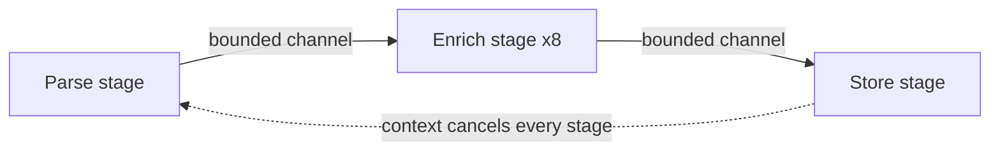

A team rewrites a lock-heavy Go service in the spirit of "share memory by communicating". The mutexes disappear and the code reads beautifully. Three weeks later the service's memory grows by a couple of hundred megabytes a day, and a goroutine dump shows over a million goroutines, all parked on the same line: a send on an unbuffered channel whose receiver had already returned because of a timeout.

Message passing is a genuinely better model for a lot of concurrent code. It gives each piece of state one owner, so the invariants from [the races lesson](/learn/systems/concurrency/races-mutexes-and-invariants) are protected by construction rather than by discipline. But it does not remove concurrency bugs; it changes their shape. Deadlocks become cycles of blocked sends. Races become leaked goroutines. Unbounded buffers become unbounded mailboxes. This lesson covers the two main message-passing models, CSP and actors, as Go, Rust, Python and Erlang implement them, and how to choose between them and a plain mutex.

## Two families of message passing

With **shared memory**, threads touch the same data and locks keep them from seeing each other's half-finished work. With **message passing**, each piece of state has exactly one owner, and everyone else sends the owner a message. Nobody else can see the state half-updated, because nobody else can see it at all.

Two models dominate:

- **CSP** (Communicating Sequential Processes, Tony Hoare, 1978). Anonymous processes communicate over named **channels**. In the original model a send and a receive happen together, as a rendezvous. Go's goroutines and channels are CSP; so are Rust's channels and Clojure's `core.async`.
- **Actors** (Carl Hewitt, 1973; made practical by Erlang in the late 1980s). Named **actors** each have private state and a **mailbox**. Sending is asynchronous: you drop a message in an actor's mailbox by its address and carry on. The actor processes messages one at a time.

| | Shared memory + locks | CSP (Go, Rust) | Actors (Erlang/Elixir, Akka, Orleans) |
|---|---|---|---|
| You address | Memory | A channel | An actor (by identity) |
| Send | n/a | Blocks until received (unbuffered) or until buffer space exists | Asynchronous; returns immediately |
| Backpressure | n/a | Built in: a full channel blocks the sender | Not by default: mailboxes grow |
| Failure | A crash can leave invariants broken under a lock | A panicking goroutine crashes the whole Go process unless recovered | Actors crash independently; supervisors restart them |
| Distribution | One machine | One process | Designed to span machines |

## Go channels: the semantics that matter

A Go channel carries values of one type between goroutines. The rules that matter in production:

- An **unbuffered** channel (`make(chan T)`) is a rendezvous: a send blocks until a receiver takes the value. The handoff is also a synchronisation point: everything the sender did before the send *happens before* everything the receiver does after the receive.
- A **buffered** channel (`make(chan T, n)`) lets a send complete without a receiver while fewer than `n` values are waiting. When it is full, sends block again.
- **Only the sender closes.** Receiving from a closed channel returns the zero value immediately (`v, ok := <-ch` reports `ok == false`), and `for v := range ch` ends. Sending on a closed channel, or closing it twice, panics.
- A **nil** channel blocks forever on both send and receive, which is useful for switching off a case inside `select`.
- `select` waits on several channel operations at once and picks uniformly at random among those that are ready, so no case can starve the others.

```viz
{"type": "concurrency", "algorithm": "channels",
 "title": "Unbuffered versus buffered channels",
 "caption": "An unbuffered send waits for the receiver: sender and receiver move in lock-step. A buffered channel lets the sender run ahead by its capacity, then blocks again. The buffer delays backpressure; it does not remove it."}
```

The classic structure is a **pipeline**: stages connected by channels, each stage owning the values it is currently working on. Fan work out to several workers reading one channel and fan results back in to one channel:

```go
func pipeline(ctx context.Context, ids []int) <-chan Result {
    jobs := make(chan int)
    go func() {
        defer close(jobs) // the only sender closes
        for _, id := range ids {
            select {
            case jobs <- id:
            case <-ctx.Done(): // downstream gave up: stop instead of blocking forever
                return
            }
        }
    }()

    results := make(chan Result)
    var wg sync.WaitGroup
    for i := 0; i < 8; i++ { // fan out to 8 workers
        wg.Add(1)
        go func() {
            defer wg.Done()
            for id := range jobs {
                select {
                case results <- process(id):
                case <-ctx.Done():
                    return
                }
            }
        }()
    }
    go func() {
        wg.Wait()
        close(results) // closed once, after every sender has finished
    }()
    return results
}
```

Notice that every blocking send sits in a `select` with `ctx.Done()`. That is not decoration. It is the answer to the opening story.

### Goroutine leaks

Here is the bug that produced a million parked goroutines:

```go
func fetchWithTimeout(url string) (Resp, error) {
    ch := make(chan Resp) // unbuffered
    go func() { ch <- fetch(url) }()
    select {
    case r := <-ch:
        return r, nil
    case <-time.After(time.Second):
        return Resp{}, errTimeout // nobody will ever receive from ch again
    }
}
```

After a timeout, the inner goroutine finishes `fetch` and blocks forever on `ch <- ...`, because the only receiver has gone. A goroutine costs only a few kilobytes of stack, but it also keeps alive everything it references (here, a whole response), and at thousands of timeouts an hour that is the memory growth in the story. The fix is tiny, `make(chan Resp, 1)`, so the send always completes and the goroutine exits. Better still, pass a `context` into `fetch` so the abandoned work stops early.

The rule: **every goroutine you start needs a known way to finish.** Export `runtime.NumGoroutine()` as a metric, read the goroutine profile from `pprof` when it climbs, and use `go.uber.org/goleak` in tests to fail any test that leaves goroutines behind. The Go runtime's deadlock detector, as the [deadlock lesson](/learn/systems/concurrency/deadlock) explains, only fires when *every* goroutine is blocked, so a leak in a server is never reported for you.

### Channels are not magic

Inside the runtime, a Go channel is a struct with a **mutex**, a ring buffer, and queues of waiting senders and receivers. A channel operation costs tens of nanoseconds uncontended and more under contention, which is more than a mutex-protected increment. Channels are the right tool for transferring ownership, distributing work and signalling (completion, cancellation); a mutex is the right tool for protecting a small piece of shared state. The Go project's own guidance says the same: use whichever is simpler for the problem.

Channels also do not stop data races. Sending a pointer transfers the pointer, not exclusive access to what it points at; if the sender keeps using the struct after sending it, the race detector will rightly complain.

## Rust channels: ownership makes the model enforceable

In Rust, sending a value through a channel **moves** it. The sender cannot use it afterwards, and the compiler checks that:

```rust
use std::sync::mpsc;
use std::thread;

fn main() {
    let (tx, rx) = mpsc::sync_channel::<Vec<u8>>(16); // bounded: send blocks when 16 are queued
    let producer = thread::spawn(move || {
        for i in 0..100u8 {
            let buf = vec![i; 1024];
            tx.send(buf).unwrap();
            // println!("{}", buf.len()); // error[E0382]: borrow of moved value: `buf`
        }
        // tx is dropped here, which closes the channel
    });
    for buf in rx {          // ends once every sender has been dropped
        consume(buf);
    }
    producer.join().unwrap();
}
```

"Share memory by communicating" is a convention in Go; in Rust it is a type-checked fact. The value's type must also be `Send`, so you cannot pass an `Rc` to another thread through a channel any more than you could capture it in a spawned closure.

Closing is structural too. A channel closes when every sender has been dropped; there is no explicit `close` to call twice and no panic on sending to a closed channel. `send` returns an error if the receiver is gone, which forces the sender to decide what to do. The standard library's `mpsc` channel is multi-producer, single-consumer (since Rust 1.67 it is implemented on top of the crossbeam-channel design); `crossbeam-channel` adds multi-consumer channels and a `select!` macro; Tokio provides async `mpsc` (bounded by default), `oneshot` for a single reply, `broadcast` for fan-out and `watch` for "latest value" state.

## Python: queues and sentinels

Python's message-passing tools are queues: `queue.Queue` between threads, `asyncio.Queue` between tasks, `multiprocessing.Queue` between processes (where every object is pickled and copied, which is the real cost). There is no `select` over several queues, so shutdown is usually done with a **sentinel** ("poison pill"), one per consumer:

```python
import queue
import threading

jobs = queue.Queue(maxsize=100)   # bounded: producers block when consumers fall behind
STOP = object()

def worker():
    while True:
        item = jobs.get()
        if item is STOP:
            return
        handle(item)

workers = [threading.Thread(target=worker) for _ in range(4)]
for w in workers:
    w.start()
for item in source():
    jobs.put(item)
for _ in workers:
    jobs.put(STOP)                # one sentinel per worker
for w in workers:
    w.join()
```

Python 3.13 added `Queue.shutdown()` to both `queue.Queue` and `asyncio.Queue`, which makes blocked `get` and `put` calls raise instead of needing sentinels.

## Actors: identity, mailboxes and supervision

An actor is private state plus a mailbox plus a function that handles one message at a time. Because it processes messages sequentially, its state needs no lock; the actor *is* the serialisation point. In response to a message an actor can update its state, send messages to actors whose addresses it knows, and create new actors.

Erlang (and Elixir, on the same BEAM virtual machine) is the reference implementation. A counter as an Elixir `GenServer`:

```text
defmodule Counter do
  use GenServer
  def init(n), do: {:ok, n}
  def handle_call(:get, _from, n), do: {:reply, n, n}    # synchronous request/reply
  def handle_cast(:inc, n), do: {:noreply, n + 1}        # asynchronous message
end
```

What makes the BEAM distinctive is not the syntax but the runtime:

- **Processes are tiny**: a few kilobytes each, so a single node routinely runs hundreds of thousands to millions of them, one per connection, session or device.
- **Each process has its own heap and garbage collector.** Collection is per process, so there is no global stop-the-world pause. Messages are copied between heaps (large binaries are reference-counted instead).
- **Scheduling is preemptive**, by counting "reductions" (roughly, function calls), so one busy process cannot starve the others.
- **Failure is local and supervised.** Processes can be linked or monitored; a **supervisor** restarts crashed children according to a strategy (`one_for_one`, `one_for_all`, `rest_for_one`). The philosophy is "let it crash": do not litter a process with defensive code; let it die and restart from a known-good state.

On the JVM, Akka provides typed actors (its 2022 licence change led to the Apache Pekko fork), and Microsoft Orleans offers **virtual actors** that are activated on demand by identity and can live on any node in a cluster.

### How actor systems fail

- **Mailbox growth.** Sending is asynchronous and mailboxes are unbounded by default, so a slow actor silently accumulates messages until the node runs out of memory. Actors have no built-in backpressure; you add it with demand-driven protocols (Elixir's GenStage, Akka Streams) or bounded mailboxes that drop.
- **Hot actors.** One actor per entity is elegant until one entity is hot: a celebrity's timeline, a global rate counter, a popular chat room. Every message to it is serialised through one process on one core. Shard the entity's state across several actors.
- **Call cycles.** If actor A makes a synchronous call to B while B makes a synchronous call to A, both wait for replies that never come: a deadlock with no locks in sight. Erlang's `gen_server:call` has a default 5-second timeout, which turns the deadlock into a crash that supervision can recover from; the real fix is to avoid synchronous calls in cycles.
- **Selective receive.** Erlang lets a process wait for a message matching a pattern, skipping others. With a long mailbox, each such receive scans past everything else, and a process that is already behind falls further behind.
- **Ordering assumptions.** Erlang guarantees that messages from one sender to one receiver arrive in the order sent. Nothing orders messages from different senders.

## Choosing between locks, channels and actors

Ask one question first: **who owns this data?**

- **Everyone, briefly** (a cache, a counter, a configuration map): use a **mutex**. It is the cheapest, simplest and easiest to read, as long as critical sections are short.
- **One stage at a time**, handed along a pipeline (a request being parsed, enriched, stored): use **channels**. Ownership transfer is the whole point, and bounded channels give you backpressure for free.
- **One long-lived entity with an identity and its own lifecycle** (a user session, a device connection, a game room), especially if entities may live on different machines or must fail independently: use **actors**.



Most real systems mix them: an actor per session that uses a mutex-protected cache internally, or a channel pipeline whose stages share a connection pool guarded by a semaphore. What they share is the rule from the thread pools lesson: **every queue needs a bound**, whether it is called a channel, a mailbox or a work queue.

## Exercise: when does the producer get blocked?

```exercise
id: channel-backpressure
title: Send completion times on a bounded channel
prompt: |
  One producer sends items to one consumer over a channel of the given
  `capacity`.

  - The producer spends `produce[i]` time units creating item `i`, then sends
    it. It starts creating item 0 at time 0, and starts item `i + 1` only when
    the send of item `i` has completed.
  - The consumer receives item `i` as soon as the item is available and it
    has finished processing item `i - 1` (it is idle at time 0), then spends
    `consume[i]` time units processing it.
  - With `capacity == 0` (unbuffered), a send completes at the moment the
    consumer receives that item.
  - With `capacity >= 1`, a send completes when the item enters the buffer,
    which requires fewer than `capacity` items to be waiting in it, that is,
    item `i - capacity` must already have been received. A receive at the same
    instant counts as having freed the slot.

  `produce` and `consume` have the same length. Return the list of times at
  which each send completes.
languages: [python, javascript]
entry: send_completion_times
starter:
  python: |
    def send_completion_times(capacity, produce, consume):
        sent = []        # when each send completed
        received = []    # when the consumer received each item
        # your code here
        return sent
  javascript: |
    function send_completion_times(capacity, produce, consume) {
      const sent = [];      // when each send completed
      const received = [];  // when the consumer received each item
      // your code here
      return sent;
    }
tests:
  - args: [0, [1, 1, 1], [3, 3, 3]]
    expected: [1, 4, 7]
    label: unbuffered, the producer runs at the consumer's pace
  - args: [2, [1, 1, 1], [3, 3, 3]]
    expected: [1, 2, 3]
    label: a buffer lets the producer run ahead
  - args: [2, [1, 1, 1, 1, 1], [3, 3, 3, 3, 3]]
    expected: [1, 2, 3, 4, 7]
    label: once the buffer fills, backpressure returns
  - args: [1, [0, 0, 0, 10], [2, 2, 2, 2]]
    expected: [0, 0, 2, 12]
    label: a burst is absorbed, then the consumer catches up
  - args: [3, [], []]
    expected: []
    hidden: true
  - args: [0, [2, 0, 5, 1], [1, 4, 1, 1]]
    expected: [2, 3, 8, 9]
    hidden: true
  - args: [1, [1, 1, 1, 1], [5, 1, 1, 1]]
    expected: [1, 2, 6, 7]
    hidden: true
hints:
  - "Process items in order and keep three lists: when each send completed, when each item was received, and when the consumer finished each item."
  - "Item i is ready at (send time of i - 1) + produce[i]. For capacity 0, receive = max(ready, consumer done with i - 1) and the send completes at that receive. For capacity b >= 1, send = max(ready, receive time of item i - b if it exists), then receive = max(send, consumer done with i - 1)."
```

The third test is the point of the exercise. A buffer of 2 lets the producer finish its first four sends almost immediately, but by the fifth it is back to waiting on the consumer. A buffer absorbs **bursts**; it cannot absorb a consumer that is slower **on average**. Only more consumers, or a slower producer, fixes that.

## Senior signals

- You frame the choice as **ownership**: shared briefly (mutex), handed along (channel), owned by a long-lived identity (actor).
- You know Go's channel rules cold (who closes, nil channels in `select`, send on closed panics) and you put every blocking send in a `select` with cancellation.
- You treat goroutine count as a metric and every goroutine as needing a defined exit; you reach for a buffer of one when a result may be abandoned.
- You can explain why Rust channels enforce message passing (moves, `Send`, close-on-drop) where Go's rely on convention.
- You know the actor failure modes: unbounded mailboxes, hot actors, synchronous call cycles, and that supervision recovers from crashes but not from overload.
- You insist on a bound for every queue, whatever it is called.

## Check yourself

```quiz
- q: >-
    A function starts a goroutine that sends its result on an unbuffered channel, then selects on that channel and a one-second timer. Under load, memory grows steadily. Why?
  options: ["Late goroutines block forever on a send that nobody will receive", "The select statement starves its channel case under load", "Unbuffered channels allocate a fresh buffer on every send", "time.After leaks one timer per call that is never collected"]
  answer: 0
  explanation: >-
    An unbuffered send needs a receiver. Once the caller has returned on the timeout, the goroutine can never complete its send, never exits, and pins everything it references. A buffer of 1 lets the send complete and the goroutine finish; a context lets the work stop early. The growth tracks timeouts, not calls, which rules out a per-call allocation.
- q: >-
    Which statement about Go channels is true?
  options: ["Receiving from a closed channel panics, so receivers must check", "Sending on a closed channel panics, so only the sender closes", "A nil channel returns the zero value immediately on receive", "select always picks the first ready case in source order"]
  answer: 1
  explanation: >-
    Sends on a closed channel panic, which is why closing is the sender's job. Receives on a closed channel return the zero value with ok == false. A nil channel blocks forever, which is useful to disable a select case. select chooses pseudo-randomly among ready cases.
- q: >-
    What does Rust's type system add to channel-based designs compared with Go?
  options: ["Sending moves the value, so the sender cannot reuse it", "Rust channels cannot deadlock, as the compiler checks cycles", "Rust channels are unbounded, so a sender never blocks", "Rust channels are lock-free, so they cannot contend"]
  answer: 0
  explanation: >-
    Ownership transfer is checked at compile time (and the value must be Send), turning "share memory by communicating" from a convention into a guarantee. Rust channels can still deadlock (two threads each waiting to receive from the other), and bounded variants such as sync_channel block senders by design.
- q: >-
    An Erlang system gives every chat room its own process. One room with a celebrity guest becomes slow and its node's memory climbs. What is happening?
  options: ["The supervisor keeps restarting the crashed room process", "Messages from different senders arrive out of order", "Stop-the-world garbage collection is pausing the node", "One process serialises the room; its mailbox grows"]
  answer: 3
  explanation: >-
    An actor is a serialisation point by design: the room's process handles messages one at a time. A hot entity pushes more messages than one process can handle, and because sends are asynchronous with unbounded mailboxes, the backlog accumulates in memory. Shard the hot entity or add flow control. BEAM garbage collection is per process, not stop-the-world.
- q: >-
    A consumer processes items at 100 per second on average. A producer emits 150 per second on average. A teammate proposes raising the channel buffer from 100 to 100,000. What will that do?
  options: ["Nothing, because Go caps channel buffers at a small size", "It speeds up the consumer by letting it batch its reads", "It fixes it, because the producer no longer needs to block", "It only delays blocking, adding memory and latency"]
  answer: 3
  explanation: >-
    A buffer absorbs bursts, not a sustained rate difference. The buffer fills at 50 items per second, and then the producer is throttled exactly as before, except that each item now waits behind up to 100,000 others. The rate mismatch remains: add consumers, slow or shed the producer, or accept the backpressure.
```
