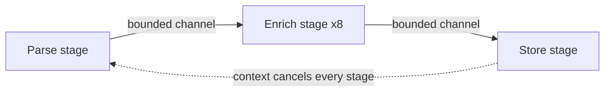

A team rewrites a lock-heavy Go service in the spirit of "share memory by communicating". The mutexes disappear and the code reads beautifully. Three weeks later the service's memory grows by a couple of hundred megabytes a day, and a goroutine dump shows over a million goroutines, all parked on the same line: a send on an unbuffered channel whose receiver had already returned because of a timeout.

Message passing is a genuinely better model for a lot of concurrent code. It gives each piece of state one owner, so the invariants from [the races lesson](/learn/systems/concurrency/races-mutexes-and-invariants) are protected by construction rather than by discipline. But it does not remove concurrency bugs; it changes their shape. Deadlocks become cycles of blocked sends. Races become leaked goroutines. Unbounded buffers become unbounded mailboxes. This lesson covers the two main models, CSP and actors, as Go, Rust, Python and Erlang implement them, what they cost, and how to choose between them and a plain mutex. Measurements used Go 1.27 and CPython 3.14 on a Ryzen 9 9950X3D under WSL2.

## Two families of message passing

With **shared memory**, threads touch the same data and locks keep them from seeing each other's half-finished work. With **message passing**, each piece of state has exactly one owner and everyone else sends the owner a message. Nobody can see the state half-updated, because nobody else can see it at all.

- **CSP** (Communicating Sequential Processes, Tony Hoare, 1978). Anonymous processes communicate over named **channels**; in the original model a send and a receive happen together, as a rendezvous. Go's goroutines and channels, Rust's channels and Clojure's `core.async` are CSP.
- **Actors** (Carl Hewitt, 1973; made practical by Erlang in the late 1980s). Named **actors** each have private state and a **mailbox**. Sending is asynchronous: you drop a message in an actor's mailbox by its address and carry on. The actor processes messages one at a time.

| | Shared memory + locks | CSP (Go, Rust) | Actors (Erlang/Elixir, Akka, Orleans) |
|---|---|---|---|
| You address | Memory | A channel | An actor (by identity) |
| Send | n/a | Blocks until received (unbuffered) or until buffer space exists | Asynchronous; returns immediately |
| Backpressure | n/a | Built in: a full channel blocks the sender | Not by default: mailboxes grow |
| Failure | A crash can leave invariants broken under a lock | A panicking goroutine crashes the whole Go process unless recovered | Actors crash independently; supervisors restart them |
| Distribution | One machine | One process | Designed to span machines |

## Go channels: the semantics that matter

- An **unbuffered** channel (`make(chan T)`) is a rendezvous: a send blocks until a receiver takes the value. Everything the sender did before the send *happens before* everything the receiver does after the receive.
- A **buffered** channel (`make(chan T, n)`) lets a send complete without a receiver while fewer than `n` values wait; when full, sends block.
- **Only the sender closes.** Receiving from a closed channel returns the zero value immediately (`v, ok := <-ch` gives `ok == false`), and `for v := range ch` ends. Sending on a closed channel, or closing it twice, panics.
- A **nil** channel blocks forever on send and receive, which switches off a case inside `select`.
- `select` picks uniformly at random among ready cases, so no case can starve the others.

```viz
{"type": "concurrency", "algorithm": "channels",
 "title": "Unbuffered versus buffered channels",
 "caption": "An unbuffered send waits for the receiver: sender and receiver move in lock-step. A buffered channel lets the sender run ahead by its capacity, then blocks again. The buffer delays backpressure; it does not remove it."}
```

## Under the hood: what a channel is

A Go channel is a pointer to a runtime `hchan` struct: a **mutex**, a circular buffer (`buf`, capacity `dataqsiz`, count `qcount`, indices `sendx` and `recvx`), a `closed` flag, and two FIFO queues of parked goroutines, `sendq` and `recvq`, each entry a `sudog` recording the goroutine and where its value lives. Every operation takes the mutex and then follows one of three paths.

**Send**: (1) if a receiver is parked in `recvq`, copy the value *directly onto that goroutine's stack*, bypassing the buffer, and make it runnable; (2) else if the buffer has room, copy into `buf[sendx]` and advance `sendx`; (3) else park the sender in `sendq`. **Receive** mirrors it, with one twist: if the buffer is full *and* a sender is parked, the receiver takes `buf[recvx]` and moves the parked sender's value into the slot it just freed, preserving FIFO order. **Close** sets the flag and wakes everyone: parked receivers get the zero value with `ok == false`, parked senders panic.

### A channel of capacity 2, traced

Trace a channel of capacity 2:

| Step | Operation | Path | `buf` | `sendq` | `recvq` |
|---|---|---|---|---|---|
| 1 | A: `<-ch` | Buffer empty, no sender: A parks | [] | | A |
| 2 | P: `ch <- 1` | Receiver waiting: direct handoff, A gets 1 | [] | | |
| 3 | P: `ch <- 2` | Room: into buffer | [2] | | |
| 4 | P: `ch <- 3` | Room: into buffer | [2, 3] | | |
| 5 | Q: `ch <- 4` | Full: Q parks with 4 | [2, 3] | Q(4) | |
| 6 | B: `<-ch` | Takes 2, moves Q's 4 into the freed slot, wakes Q | [3, 4] | | |
| 7 | B: `<-ch` ×2 | Takes 3, then 4 | [] | | |
| 8 | B: `<-ch` | Empty: B parks | [] | | B |

The first exercise replays exactly this.

### What it costs

The mutex explains the costs, measured with one producer and one consumer goroutine moving 2 million integers:

| Transfer | Per item |
|---|---|
| Unbuffered channel | 90–98 ns |
| Buffered, capacity 1 | 71–73 ns |
| Buffered, capacity 128 | 25–27 ns |
| Mutex-protected slice, push and pop, one goroutine | 22 ns |

An unbuffered channel forces a goroutine switch per item (the direct-handoff path); a large buffer lets each side run a batch before switching. Channels are the right tool for transferring ownership, distributing work and signalling; a mutex is the right tool for protecting a small piece of shared state, and the Go project's guidance is to use whichever is simpler. Channels also do not stop data races: sending a pointer transfers the pointer, not exclusive access to what it points at.

## Pipelines and goroutine leaks

The classic structure is a **pipeline**: stages connected by channels, each stage owning the values it is working on, fanning out to workers and back in:

```go
package pipeline

import (
	"context"
	"sync"
)

type Result struct{ ID int }

func process(id int) Result { return Result{ID: id} }

func Run(ctx context.Context, ids []int) <-chan Result {
	jobs := make(chan int)
	go func() {
		defer close(jobs) // the only sender closes
		for _, id := range ids {
			select {
			case jobs <- id:
			case <-ctx.Done(): // downstream gave up: stop instead of blocking forever
				return
			}
		}
	}()

	results := make(chan Result)
	var wg sync.WaitGroup
	for i := 0; i < 8; i++ { // fan out to 8 workers
		wg.Add(1)
		go func() {
			defer wg.Done()
			for id := range jobs {
				select {
				case results <- process(id):
				case <-ctx.Done():
					return
				}
			}
		}()
	}
	go func() {
		wg.Wait()
		close(results) // closed once, after every sender has finished
	}()
	return results
}
```

Every blocking send sits in a `select` with `ctx.Done()`. That is the answer to the opening story, whose bug looked like this:

```go
func fetchWithTimeout(url string) (Resp, error) {
	ch := make(chan Resp) // unbuffered
	go func() { ch <- fetch(url) }()
	select {
	case r := <-ch:
		return r, nil
	case <-time.After(time.Second):
		return Resp{}, errTimeout // nobody will ever receive from ch again
	}
}
```

After a timeout, the inner goroutine finishes `fetch` and parks forever in `sendq`, because the only receiver has gone. Measured with 2,000 calls whose 20 ms fetch outlived a 5 ms timeout, each fetch returning a 64 KiB body: the unbuffered version left 2,000 goroutines behind and 128 MiB of heap in use after a GC; with `make(chan Resp, 1)` the send lands in the buffer, every goroutine exits, and the heap was 3 MiB. Better still, pass a `context` into `fetch` so abandoned work stops early.

The rule: **every goroutine you start needs a known way to finish.** Export `runtime.NumGoroutine()` as a metric, read the goroutine profile from `pprof` when it climbs, and run `go.uber.org/goleak` in tests. The runtime's deadlock detector fires only when *every* goroutine is blocked ([the deadlock lesson](/learn/systems/concurrency/deadlock)), so a leak in a server is never reported for you.

## Rust channels: ownership makes the model enforceable

In Rust, sending a value through a channel **moves** it, and the compiler checks that the sender does not use it afterwards:

```rust
use std::sync::mpsc;
use std::thread;

fn consume(buf: Vec<u8>) -> usize { buf.len() }

fn main() {
    let (tx, rx) = mpsc::sync_channel::<Vec<u8>>(16); // bounded: send blocks when 16 are queued
    let producer = thread::spawn(move || {
        for i in 0..100u8 {
            let buf = vec![i; 1024];
            tx.send(buf).unwrap();
            // println!("{}", buf.len()); // error[E0382]: borrow of moved value: `buf`
        }
        // tx is dropped here, which closes the channel
    });
    let total: usize = rx.into_iter().map(consume).sum(); // ends once every sender is dropped
    producer.join().unwrap();
    println!("{total}");
}
```

"Share memory by communicating" is a convention in Go; in Rust it is a type-checked fact, and the value must be `Send`. Closing is structural: a channel closes when every sender is dropped, so there is no double close and no send-on-closed panic; `send` returns an error if the receiver is gone. The standard `mpsc` channel has been based on the crossbeam-channel design since Rust 1.67; `crossbeam-channel` adds multi-consumer channels and `select!`.

**Tokio's `mpsc`** is where bounded versus unbounded becomes explicit in the API. `mpsc::channel(n)` is bounded: its capacity is a semaphore of `n` permits, `send().await` first acquires a permit (suspending the task when none are free, which is backpressure without blocking a thread), and values are stored in a linked list of fixed-size blocks (32 slots each). `mpsc::unbounded_channel()` has no semaphore: `send` is a plain synchronous call that always succeeds, so a slow receiver means unbounded memory. Tokio also provides `oneshot` for a single reply, `broadcast` for fan-out with lagging receivers told how many messages they missed, and `watch` for latest-value state.

## Python: queues and sentinels

Python's message-passing tools are queues: `queue.Queue` between threads, `asyncio.Queue` between tasks, `multiprocessing.Queue` between processes, where every object is pickled, written to a pipe and unpickled. Measured with a bound of 128: 1.21 µs per item between threads, 0.30 µs between asyncio tasks, 5.3 µs per small integer between processes and 9.9 µs per 2 KB dictionary. With no `select` over several queues, shutdown uses a **sentinel**, one per consumer:

```python
import queue
import threading

jobs = queue.Queue(maxsize=100)   # bounded: producers block when consumers fall behind
STOP = object()

def handle(item):
    pass

def worker():
    while True:
        item = jobs.get()
        if item is STOP:
            return
        handle(item)

workers = [threading.Thread(target=worker) for _ in range(4)]
for w in workers:
    w.start()
for item in range(1000):
    jobs.put(item)
for _ in workers:
    jobs.put(STOP)                # one sentinel per worker
for w in workers:
    w.join()
```

Python 3.13 added `Queue.shutdown()` to `queue.Queue` and `asyncio.Queue`, which makes blocked `get` and `put` calls raise instead of needing sentinels.

## Actors: identity, mailboxes and supervision

An actor is private state plus a mailbox plus a function that handles one message at a time. Because it processes messages sequentially its state needs no lock; the actor *is* the serialisation point. Erlang (and Elixir, on the same BEAM virtual machine) is the reference implementation. A counter as an Elixir `GenServer`:

```text
defmodule Counter do
  use GenServer
  def init(n), do: {:ok, n}
  def handle_call(:get, _from, n), do: {:reply, n, n}    # synchronous request/reply
  def handle_cast(:inc, n), do: {:noreply, n + 1}        # asynchronous message
end
```

What makes the BEAM distinctive is the runtime (described from its documentation; no BEAM was available to measure here):

- **Processes are tiny**: a few hundred words of memory at spawn, so one node routinely runs hundreds of thousands to millions of them, one per connection, session or device.
- **Each process has its own heap and garbage collector**, so there is no global stop-the-world pause. A send **copies** the message into the receiver's heap (large binaries are reference-counted instead), which is what makes processes isolated and messages safe, and what makes big messages expensive.
- **The mailbox is a queue in the receiving process.** `receive` scans it from the oldest message for the first that matches a pattern (**selective receive**) and leaves non-matching messages in place.
- **Scheduling is preemptive**, by counting "reductions" (roughly function calls; a process is switched out after about 4,000), so one busy process cannot starve the others.
- **Failure is local and supervised.** Linked or monitored processes learn of each other's deaths; a **supervisor** restarts crashed children by strategy (`one_for_one`, `one_for_all`, `rest_for_one`). The philosophy is "let it crash": restart from a known-good state instead of littering code with defensive checks.

On the JVM, Akka provides typed actors (its 2022 licence change led to the Apache Pekko fork), and Microsoft Orleans offers **virtual actors** activated on demand by identity on any node of a cluster.

### How actor systems fail

- **Mailbox growth.** Sends are asynchronous and mailboxes unbounded, so a slow actor silently accumulates messages until the node runs out of memory. Backpressure has to be added: demand-driven protocols (Elixir's GenStage, Akka Streams) or bounded mailboxes that drop.
- **Hot actors.** One actor per entity is elegant until one entity is hot: a celebrity's timeline, a global rate counter, a popular chat room. Every message to it is serialised through one process on one core. Shard the entity's state.
- **Call cycles.** If A makes a synchronous call to B while B calls A, both wait for replies that never come. Erlang's `gen_server:call` has a default 5-second timeout, turning the deadlock into a crash that supervision can recover from; the real fix is no synchronous calls in cycles.
- **Selective receive on a long mailbox.** Each receive rescans past non-matching messages, so a process that is already behind falls further behind (the runtime optimises the common request/reply pattern by remembering where a fresh reference was created).
- **Ordering assumptions.** Messages from one sender to one receiver arrive in order; nothing orders messages from different senders.

## Bounded versus unbounded, and backpressure

Every one of these systems is a set of queues, and the most important property of a queue is whether it has a bound.

```viz
{"type": "system", "scenario": "backpressure", "requests": 20,
 "title": "A bounded queue pushes back on a fast producer",
 "caption": "When the consumer is slower than the producer, a bounded buffer fills and then blocks or rejects the producer, so memory stays flat and the overload is visible at the source. An unbounded buffer hides it until memory runs out."}
```

A buffer absorbs **bursts**; it cannot absorb a consumer that is slower **on average**. If a producer emits 150 items per second and a consumer handles 100, a buffer of 100,000 fills at 50 per second and then the producer is throttled exactly as before, except that each item now waits behind 100,000 others. The second exercise lets you watch a buffer absorb a burst and then hand the backpressure back.

| Queue | Bound | When full | Memory under overload | Overload visible where |
|---|---|---|---|---|
| Go unbuffered channel | 0 | Sender parks | Flat | At the sender, immediately |
| Go buffered channel | n | Sender parks | Flat | At the sender, after n |
| Tokio `mpsc::channel(n)` | n permits | `send().await` suspends the task | Flat | At the sender |
| Tokio `unbounded_channel`, Erlang mailbox, Akka default mailbox | None | Never full | Grows until out of memory | Nowhere, until the crash |
| Python `queue.Queue(maxsize=n)` | n | `put` blocks (or raises with a timeout) | Flat | At the sender |
| Bounded mailbox that drops | n | Message discarded | Flat | In a drop counter |

## Choosing between locks, channels and actors

Ask one question first: **who owns this data?** **Everyone, briefly** (a cache, a counter, a configuration map): a **mutex**, the cheapest and simplest as long as critical sections are short. **One stage at a time**, handed along a pipeline: **channels**, where ownership transfer is the point and bounded channels give backpressure for free. **One long-lived entity with an identity and its own lifecycle** (a session, a device connection, a game room), especially across machines or with independent failure: **actors**.



| | Mutex | Channels (CSP) | Actors |
|---|---|---|---|
| Cost per operation (measured) | 7.6–8.4 ns uncontended | 25–98 ns per item in Go | A message copy plus a mailbox operation |
| Who owns state | Everyone, under the lock | The current stage | The actor, forever |
| Backpressure | Not applicable | Built in when bounded | Must be added |
| Typical bug | Lock held too long, deadlock | Goroutine leak, send on closed | Mailbox growth, hot actor, call cycle |
| Failure isolation | None | None within a process | Per actor, with supervision |
| Distribution | No | No | Yes (Erlang, Akka Cluster, Orleans) |

Most real systems mix them: an actor per session that uses a mutex-protected cache internally, or a channel pipeline whose stages share a semaphore-guarded pool. What they share is the rule from the [thread pools lesson](/learn/systems/concurrency/thread-pools-and-work-stealing): **every queue needs a bound**.

## Failure modes in production

**Symptom: memory and goroutine count climb steadily, tracking timeouts.** Diagnosis: the `pprof` goroutine profile shows thousands parked on one send (`chan send`) whose receiver returned. Fix: a buffer of one for abandonable results, a `select` with `ctx.Done()` on every blocking send, `goleak` in tests.

**Symptom: a Go process crashes with `panic: send on closed channel` during shutdown.** Diagnosis: a receiver or a second party closed a channel that other goroutines still send on. Fix: only the sender closes; with several senders, close from a goroutine that waits on a `WaitGroup` of all of them.

**Symptom: an actor-based service's memory climbs during a traffic spike and the node is OOM-killed, with no errors before.** Diagnosis: one actor's mailbox length (Erlang `process_info(Pid, message_queue_len)`, Akka mailbox metrics) grows without bound. Fix: demand-driven flow control or bounded mailboxes, and shard hot entities.

**Symptom: two services that call each other synchronously time out together under load.** Diagnosis: a request cycle, the distributed form of an actor call cycle; traces show A waiting on B waiting on A. Fix: remove the cycle (asynchronous messages or a third owner) and bound each hop's time.

**Symptom: a `multiprocessing` pipeline is slower than the single-process version.** Diagnosis: per-item pickling and pipe costs (5–10 µs per item measured) dominate small tasks. Fix: batch items per message, or share memory for large arrays.

## Interviewer follow-ups

**"What happens inside a Go channel send?"** Model answer: take the channel's mutex; if a receiver is parked, copy the value straight to it and wake it; else if the buffer has room, copy into the ring; else park in `sendq` until a receiver arrives. Common wrong answer: "channels are lock-free queues".

**"When would you use a mutex rather than a channel in Go?"** Model answer: for protecting a small piece of shared state accessed briefly by many goroutines (a cache, a counter), where a mutex is cheaper and clearer; channels for transferring ownership, pipelines and signalling. Common wrong answer: "never; Go says share memory by communicating".

**"How do actors provide backpressure?"** Model answer: by default they do not, because sends are asynchronous and mailboxes unbounded; you add demand signalling (GenStage, Reactive Streams) or bounded mailboxes with a drop policy. Common wrong answer: "the mailbox blocks the sender when full".

**"A producer is faster than its consumer. Will a bigger buffer help?"** Model answer: only for bursts; with a sustained rate difference the buffer fills and backpressure returns, now with more memory and latency; add consumers, slow the producer or shed load. Common wrong answer: "yes, make it large enough".

## What mid-level engineers get wrong

- **Starting goroutines with no defined exit.** Consequence: leaks that only show as slow memory growth, 128 MiB per 2,000 timeouts in the measurement above.
- **Closing a channel from the receiving side.** Consequence: send-on-closed panics.
- **Replacing every mutex with a channel.** Consequence: slower, harder-to-read code for simple shared state.
- **Unbounded channels or mailboxes "to be safe".** Consequence: overload becomes an OOM kill instead of backpressure.
- **Assuming message passing prevents deadlock.** Consequence: cycles of blocked sends or synchronous calls.
- **Sending pointers and continuing to use them.** Consequence: data races through a channel.

## Exercises

```exercise
id: go-channel-trace
title: Replay a Go channel's internals
prompt: |
  Simulate a Go channel of the given `capacity` (0 means unbuffered). `ops`
  are applied in order: `["send", g, value]`, `["recv", g]` or `["close"]`,
  where `g` names a goroutine.

  - **send**: if the channel is closed, the program panics (stop). If a
    receiver is parked, hand the value directly to the earliest one (it
    completes with `[receiver, value, true]`). Else, if the buffer holds fewer
    than `capacity` values, append it. Else park the sender with its value.
  - **recv**: if the buffer is non-empty, take the front value; then, if a
    sender is parked, move the earliest parked sender's value into the buffer
    (that sender completes). Else, if a sender is parked (unbuffered case),
    take its value directly. Else, if closed, complete with
    `[g, null, false]`. Else park the receiver.
  - **close**: closing twice panics. Otherwise mark closed; every parked
    receiver completes with `[r, null, false]`; if any sender is parked, the
    program panics.

  Return `{"received": [...], "blocked": [...], "panic": bool}`: completed
  receives in order as `[goroutine, value, ok]`, the goroutines still parked
  at the end (parked senders first, then parked receivers, each in FIFO
  order), and whether the program panicked.
languages: [python, javascript]
entry: chan_trace
starter:
  python: |
    from collections import deque

    def chan_trace(capacity, ops):
        buf, recvq, sendq = deque(), deque(), deque()
        closed = False
        received = []
        # your code here
        return {"received": received, "blocked": [], "panic": False}
  javascript: |
    function chan_trace(capacity, ops) {
      const buf = [], recvq = [], sendq = [], received = [];
      let closed = false;
      // your code here
      return { received, blocked: [], panic: false };
    }
tests:
  - args: [2, [["recv", "A"], ["send", "P", 1], ["send", "P", 2], ["send", "P", 3], ["send", "Q", 4], ["recv", "B"], ["recv", "B"], ["recv", "B"], ["recv", "B"]]]
    expected: {"received": [["A", 1, true], ["B", 2, true], ["B", 3, true], ["B", 4, true]], "blocked": ["B"], "panic": false}
    label: the lesson's trace
  - args: [0, [["recv", "C"], ["send", "P", 7]]]
    expected: {"received": [["C", 7, true]], "blocked": [], "panic": false}
    label: unbuffered, receiver first
  - args: [0, [["send", "P", 7], ["recv", "C"], ["recv", "C"]]]
    expected: {"received": [["C", 7, true]], "blocked": ["C"], "panic": false}
    label: unbuffered, sender first
  - args: [1, [["send", "P", 1], ["close"], ["recv", "A"], ["recv", "B"]]]
    expected: {"received": [["A", 1, true], ["B", null, false]], "blocked": [], "panic": false}
    label: buffered values survive close
  - args: [2, []]
    expected: {"received": [], "blocked": [], "panic": false}
    label: no operations
  - args: [0, [["recv", "A"], ["recv", "B"], ["close"]]]
    expected: {"received": [["A", null, false], ["B", null, false]], "blocked": [], "panic": false}
    hidden: true
  - args: [1, [["send", "P", 1], ["send", "Q", 2], ["close"]]]
    expected: {"received": [], "blocked": ["Q"], "panic": true}
    hidden: true
    label: closing with a parked sender panics
  - args: [1, [["close"], ["send", "P", 1]]]
    expected: {"received": [], "blocked": [], "panic": true}
    hidden: true
hints:
  - "Keep a buffer, a queue of parked receivers and a queue of parked (goroutine, value) senders; each operation checks the paths in the order given."
  - "A receive from a full buffer with a parked sender both returns the front value and refills the freed slot from the sender, which keeps FIFO order."
```

```exercise
id: channel-backpressure
title: Send completion times on a bounded channel
prompt: |
  One producer sends items to one consumer over a channel of the given
  `capacity`.

  - The producer spends `produce[i]` time units creating item `i`, then sends
    it. It starts creating item 0 at time 0, and starts item `i + 1` only when
    the send of item `i` has completed.
  - The consumer receives item `i` as soon as the item is available and it
    has finished processing item `i - 1` (it is idle at time 0), then spends
    `consume[i]` time units processing it.
  - With `capacity == 0` (unbuffered), a send completes at the moment the
    consumer receives that item.
  - With `capacity >= 1`, a send completes when the item enters the buffer,
    which requires fewer than `capacity` items to be waiting in it, that is,
    item `i - capacity` must already have been received. A receive at the same
    instant counts as having freed the slot.

  `produce` and `consume` have the same length. Return the list of times at
  which each send completes.
languages: [python, javascript]
entry: send_completion_times
starter:
  python: |
    def send_completion_times(capacity, produce, consume):
        sent = []        # when each send completed
        received = []    # when the consumer received each item
        # your code here
        return sent
  javascript: |
    function send_completion_times(capacity, produce, consume) {
      const sent = [];      // when each send completed
      const received = [];  // when the consumer received each item
      // your code here
      return sent;
    }
tests:
  - args: [0, [1, 1, 1], [3, 3, 3]]
    expected: [1, 4, 7]
    label: unbuffered, the producer runs at the consumer's pace
  - args: [2, [1, 1, 1], [3, 3, 3]]
    expected: [1, 2, 3]
    label: a buffer lets the producer run ahead
  - args: [2, [1, 1, 1, 1, 1], [3, 3, 3, 3, 3]]
    expected: [1, 2, 3, 4, 7]
    label: once the buffer fills, backpressure returns
  - args: [1, [0, 0, 0, 10], [2, 2, 2, 2]]
    expected: [0, 0, 2, 12]
    label: a burst is absorbed, then the consumer catches up
  - args: [3, [], []]
    expected: []
    hidden: true
  - args: [0, [2, 0, 5, 1], [1, 4, 1, 1]]
    expected: [2, 3, 8, 9]
    hidden: true
  - args: [1, [1, 1, 1, 1], [5, 1, 1, 1]]
    expected: [1, 2, 6, 7]
    hidden: true
hints:
  - "Process items in order and keep three lists: when each send completed, when each item was received, and when the consumer finished each item."
  - "Item i is ready at (send time of i - 1) + produce[i]. For capacity 0, receive = max(ready, consumer done with i - 1) and the send completes at that receive. For capacity b >= 1, send = max(ready, receive time of item i - b if it exists), then receive = max(send, consumer done with i - 1)."
```

In the third test a buffer of 2 lets the producer finish its first four sends almost immediately, but by the fifth it is back to waiting on the consumer. Only more consumers, or a slower producer, fixes a consumer that is slower on average.

## Senior signals

- You frame the choice as **ownership**: shared briefly (mutex), handed along (channel), owned by a long-lived identity (actor), and you know what each costs per operation.
- You can describe `hchan` (mutex, ring buffer, `sendq`, `recvq`, direct handoff to a parked receiver) and trace a send and receive through it.
- You know Go's channel rules cold (who closes, nil channels in `select`, send on closed panics) and put every blocking send in a `select` with cancellation; you treat goroutine count as a metric.
- You can explain why Rust channels enforce message passing (moves, `Send`, close-on-drop) and how Tokio's bounded `mpsc` turns capacity into semaphore permits.
- You know the actor failure modes (unbounded mailboxes, hot actors, synchronous call cycles, selective receive) and that supervision recovers from crashes but not from overload.
- You insist on a bound for every queue, whatever it is called, and can explain why a bigger buffer only delays backpressure.

## Check yourself

```quiz
- q: >-
    A function starts a goroutine that sends its result on an unbuffered channel, then selects on that channel and a one-second timer. Under load, memory grows steadily. Why?
  options: ["Late goroutines park forever on a send nobody will receive", "The select statement starves its channel case under load", "Unbuffered channels allocate a fresh buffer on every send", "time.After leaks one timer per call that is never collected"]
  answer: 0
  explanation: >-
    An unbuffered send needs a receiver. Once the caller returns on the timeout, the goroutine parks in the channel's sendq forever and pins everything it references; the lesson's measurement left 2,000 goroutines and 128 MiB behind. A buffer of 1 lets the send complete and the goroutine exit; a context lets the work stop early. The growth tracks timeouts, not calls.
- q: >-
    A goroutine receives from a channel of capacity 2 whose buffer is full while another goroutine is parked trying to send. What does the runtime do?
  options: ["Returns the oldest buffered value and moves the parked sender's value into the freed slot", "Returns the parked sender's value directly and leaves the buffer untouched", "Grows the buffer by one slot so both the sender and receiver can proceed", "Wakes the sender first and makes the receiver wait for its send to finish"]
  answer: 0
  explanation: >-
    Taking the parked sender's value directly would break FIFO order, since two older values are buffered. The receiver takes buf[recvx] and copies the sender's value into the slot it just freed, completing the sender in the same operation. Channel buffers never grow.
- q: >-
    Which statement about Go channels is true?
  options: ["Receiving from a closed channel panics, so receivers must check", "Sending on a closed channel panics, so only the sender closes", "A nil channel returns the zero value immediately on receive", "select always picks the first ready case in source order"]
  answer: 1
  explanation: >-
    Sends on a closed channel panic, which is why closing is the sender's job. Receives on a closed channel return the zero value with ok == false. A nil channel blocks forever, which is useful to disable a select case. select chooses pseudo-randomly among ready cases.
- q: >-
    A Tokio service switches from mpsc::channel(1000) to mpsc::unbounded_channel() because senders were occasionally waiting. What changes under a sustained overload?
  options: ["Throughput rises, because the receiver can batch its reads", "Nothing, because Tokio caps unbounded channels at 1,000 items", "Senders never wait, and the queue grows until memory runs out", "Senders block their OS thread instead of suspending the task"]
  answer: 2
  explanation: >-
    The bounded channel's capacity is a semaphore; waiting for a permit was the backpressure. The unbounded channel has no semaphore, so send always succeeds and a slower receiver means unbounded memory growth and latency. There is no hidden cap, and neither variant blocks an OS thread on send.
- q: >-
    An Erlang system gives every chat room its own process. One room with a celebrity guest becomes slow and its node's memory climbs. What is happening?
  options: ["The supervisor keeps restarting the crashed room process", "Messages from different senders arrive out of order", "Stop-the-world garbage collection is pausing the node", "One process serialises the room; its mailbox grows"]
  answer: 3
  explanation: >-
    An actor is a serialisation point by design: the room's process handles messages one at a time. A hot entity receives more messages than one process can handle, and because sends are asynchronous into unbounded mailboxes, the backlog accumulates in memory. Shard the hot entity or add flow control. BEAM garbage collection is per process, not stop-the-world.
- q: >-
    A consumer processes 100 items per second on average and a producer emits 150. A teammate proposes raising the channel buffer from 100 to 100,000. What will that do?
  options: ["It speeds up the consumer by letting it batch its reads", "It fixes it, because the producer no longer needs to block", "It only delays blocking, adding memory and latency", "Nothing, because Go caps channel buffers at a small size"]
  answer: 2
  explanation: >-
    A buffer absorbs bursts, not a sustained rate difference. It fills at 50 items per second and then the producer is throttled exactly as before, except that each item now waits behind up to 100,000 others. Add consumers, slow or shed the producer, or accept the backpressure.
```
