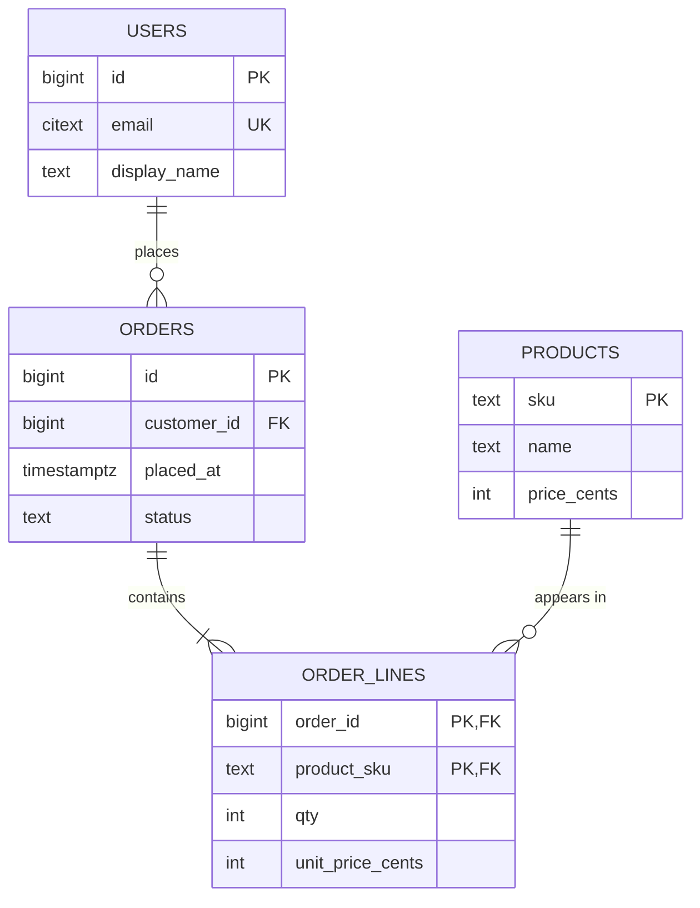

A customer changes their email address. Your `orders` table stores the customer's email on every order row, because that was convenient when the checkout page was written. There are 40,000 rows carrying the old address, a support agent updates the customer record, and next month's invoice still goes to the dead mailbox. Nothing crashed. No test failed. The database did exactly what the schema allowed.

That is an *update anomaly*, and the relational model exists to make it impossible by construction. Every rule in this lesson (keys, functional dependencies, normal forms) is a mechanism for putting each fact in exactly one place so the database enforces your invariants instead of your code hoping to. The lesson also puts prices on those rules, measured on PostgreSQL 17 with a 100,000-user, 2-million-order, 4-million-line schema: what a row costs on a page, what a foreign key costs per insert, and what a missing index on a foreign key costs per delete.

## What a relation is

A relation is a set of tuples over a fixed set of named, typed attributes. Three consequences of "set" matter in production:

1. **No duplicate rows.** Two identical rows carry no more information than one. SQL tables are *bags* (duplicates allowed), which is why `SELECT DISTINCT` and the `UNION` versus `UNION ALL` distinction exist. A table without a primary key is a bag by design, and it is almost always a mistake: you cannot update or delete exactly one of two identical rows without resorting to the physical address (`ctid`).
2. **No inherent order.** `SELECT * FROM orders` with no `ORDER BY` returns rows in whatever order the executor found them. That order changes after a `VACUUM` frees space that new rows reuse, after a plan switches from a sequential scan to an index scan, or when a parallel scan's workers interleave. Code that relies on "the order they were inserted" breaks in production on a Tuesday.
3. **Every cell is atomic with respect to how you query it.** A column holding `"red,green,blue"` is legal SQL, but you cannot index, join or constrain the individual colours.

Relational algebra gives a small set of closed operators (select σ, project π, join ⋈, union, difference) whose results are themselves relations, so operators compose. Closure is why the optimiser in [SQL and query plans](/learn/databases/relational-fundamentals/sql-and-query-plans) can rewrite your query: σ<sub>customer_id=42</sub>(orders ⋈ users) and σ<sub>customer_id=42</sub>(orders) ⋈ users are provably equal, and the planner evaluates the filter first because it shrinks the join input from 2 million rows to 12.

SQL adds one thing the model does not have: `NULL`, and with it three-valued logic. `NULL = NULL` is not true, it is unknown; `WHERE status <> 'cancelled'` silently excludes rows whose status is `NULL`; and `NOT IN` against a subquery that returns a single `NULL` returns no rows at all. On the lab schema, `SELECT count(*) FROM users WHERE id NOT IN (SELECT customer_id FROM orders UNION ALL SELECT NULL)` returns 0, while the equivalent `NOT EXISTS` returns the one user who has no orders. Each `x NOT IN (a, b, NULL)` expands to `x <> a AND x <> b AND x <> NULL`, and the last term is unknown, so the whole predicate can never be true.

## Under the hood: what a row costs on a page

A schema decision is also a storage decision, so it helps to know what Postgres does with a row. Every table is a heap file of 8 KiB pages. Each page starts with a 24-byte header, then an array of 4-byte **line pointers** growing forwards, then free space, then the tuples themselves growing backwards from the end. `pageinspect` shows it for the lab `orders` table, whose row is `(id bigint, customer_id bigint, placed_at timestamptz, status text, total_cents int)`:

```sql
CREATE EXTENSION IF NOT EXISTS pageinspect;
SELECT lower, upper, special, pagesize FROM page_header(get_raw_page('orders', 0));
--  lower | upper | special | pagesize
--    504 |   512 |    8192 |     8192
SELECT lp, lp_off, lp_len, t_hoff FROM heap_page_items(get_raw_page('orders', 0)) LIMIT 2;
--  lp | lp_off | lp_len | t_hoff
--   1 |   8128 |     60 |     24
--   2 |   8064 |     60 |     24
```

Trace the arithmetic, because every number is accounted for:

1. **Tuple header: 23 bytes**, padded to `t_hoff = 24`. It holds `xmin`, `xmax` (the transactions that created and deleted this version, the subject of [MVCC and locking](/learn/databases/relational-fundamentals/mvcc-and-locking)), a command id, the tuple's own `ctid`, flag bits and the header length. A null bitmap, one bit per column, fits in the padding byte for tables of up to eight columns.
2. **Data: 36 bytes.** Three 8-byte values (24), `'shipped'` as text (1-byte length header plus 7 bytes = 8), and a 4-byte int. Header plus data is 60 bytes, the `lp_len` above.
3. **Alignment.** Tuples start on 8-byte boundaries, so each occupies 64 bytes, which is why consecutive `lp_off` values differ by 64.
4. **The page.** `lower = 504` is the header (24) plus 120 line pointers (480). `upper = 512` is where the lowest tuple starts: 120 × 64 = 7,680 = 8,192 − 512. Eight bytes are left over, so the page holds exactly **120 rows**, and 2 million rows need 16,667 pages (130 MB).

Two consequences for modelling. First, the fixed overhead per row is 28 bytes (header plus line pointer) before any data, so a narrow junction table such as `post_tags(post_id bigint, tag_id bigint)` spends 28 of every 44 bytes on overhead (a 40-byte tuple plus its line pointer, for 16 bytes of data); splitting a table into many thin tables is not free. Second, column order changes size: `pg_column_size(ROW(1::int, 2::bigint, 3::int, 4::bigint))` is 56 bytes but `ROW(2::bigint, 4::bigint, 1::int, 3::int)` is 48, because each `bigint` after an `int` is padded to an 8-byte boundary. On a billion-row table, putting fixed-width 8-byte columns first saves gigabytes.

## Keys

A **candidate key** is a minimal set of attributes whose values identify exactly one tuple; minimal means removing any attribute breaks uniqueness. A table can have several candidate keys: pick one as the **primary key** and declare the rest as **unique constraints**.

```sql
CREATE TABLE users (
    id           bigint GENERATED ALWAYS AS IDENTITY PRIMARY KEY,
    email        citext NOT NULL UNIQUE,          -- second candidate key
    display_name text NOT NULL,
    created_at   timestamptz NOT NULL DEFAULT now()
);
```

`id` is a **surrogate key**: it carries no meaning, never changes, and is 8 bytes in every table that references it. `email` is a **natural key**: it means something, which is exactly why it is dangerous as a primary key. Users change emails and companies are acquired and re-domained, and every foreign key would have to cascade the change. Use natural keys as unique constraints and surrogate keys for identity.

The surrogate's type is a physical decision. A `bigint` sequence is 8 bytes and always inserts at the right edge of the primary-key B-tree. A random UUIDv4 is 16 bytes and inserts into a random leaf. The [indexes lesson](/learn/databases/relational-fundamentals/indexes) measures the difference on a million rows: the UUIDv4 index ends up 71% full instead of 90%, and after a checkpoint 100,000 random inserts wrote 43 MB of WAL against 15 MB for time-ordered keys. UUIDv7 puts a millisecond timestamp in its leading 48 bits, so it keeps global uniqueness (useful when IDs are generated by clients or several services) while inserting almost as locally as a sequence. This app generates its UUID primary keys with `Uuid::now_v7()`, for example `comments.id` in `CommentService::create`. The same idea is older than UUIDv7: Twitter's Snowflake IDs (41 bits of milliseconds, 10 of machine, 12 of sequence) and Instagram's sharded Postgres IDs (41 bits of milliseconds, 13 of logical shard, 10 of sequence) put time in the high bits of a 64-bit key so that IDs from many writers still sort, and insert, roughly in time order.

## Foreign keys and what they cost

A **foreign key** is a promise that a value in one table exists as a key in another. Postgres implements it with system triggers, and knowing which query each trigger runs tells you exactly what it costs:

- On every `INSERT` or key `UPDATE` of `orders`, a row-level trigger runs, in effect, `SELECT 1 FROM ONLY users x WHERE id = $1 FOR KEY SHARE OF x`: one primary-key probe plus a lightweight row lock that stops the parent being deleted before you commit.
- On every `DELETE` or key `UPDATE` of `users`, a trigger runs `SELECT 1 FROM ONLY orders x WHERE customer_id = $1 FOR KEY SHARE OF x` to find referencing rows.

Measured on the lab schema, copying the same 2 million orders into a table without a foreign key took **0.67 s**; into an identical table with `REFERENCES users(id)` it took **28.8 s**. That is about **14 µs per row** for the per-row trigger, a 43× slowdown for a bulk load. For an OLTP insert of one row it is noise; for a nightly import of 50 million rows it is the difference between minutes and hours, which is why bulk loaders sometimes load into a staging table, validate with one set-based anti-join, and then insert.

The delete side hides a worse trap: **Postgres does not index the referencing column for you**. It indexes primary keys and unique constraints, but `orders.customer_id` gets nothing unless you create it.

```sql
BEGIN;
EXPLAIN (ANALYZE, BUFFERS) DELETE FROM users WHERE id = 100001;
-- Trigger for constraint orders_customer_id_fkey: time=41.743 calls=1   (no index: sequential scan of 2M orders)
ROLLBACK;
CREATE INDEX orders_customer_id_idx ON orders (customer_id);
-- same DELETE:
-- Trigger for constraint orders_customer_id_fkey: time=0.294 calls=1    (index probe)
```

42 ms against 0.3 ms on a 130 MB table that was already in memory. On a 300-million-row table that does not fit in memory, each user deletion becomes a multi-second sequential scan, run while holding the row lock on the user, and a GDPR batch deleting 10,000 users becomes a day-long job. Create the index in the same migration as the constraint.

The `ON DELETE` action is a domain decision, not a default to accept:

| Action | What happens to referencing rows | Use when |
|---|---|---|
| `NO ACTION` (the default) | Delete fails if any remain at end of statement; deferrable | The parent must not disappear while referenced |
| `RESTRICT` | Same, but checked immediately and never deferrable | As above, when you want the check never postponed |
| `CASCADE` | Deleted too, recursively | The child is meaningless without the parent (order lines) |
| `SET NULL` / `SET DEFAULT` | Keep the row, clear the reference | The child has value of its own |

This app made that change in migration `m0007_integrity`: `comments.user_id` went from `NOT NULL` with `CASCADE` to nullable with `SET NULL`, because deleting a user cascaded to their comments and, through `comments.parent_id`, to other people's replies. The comment list now renders those rows as "deleted user".

## Functional dependencies and the anomalies

A **functional dependency** X → Y says: whenever two rows agree on X, they agree on Y. Normalisation is the process of making every functional dependency follow from a key. Take the denormalised table from the opening:

| order_id | customer_id | customer_email | product_sku | product_name | qty |
|---|---|---|---|---|---|
| 1 | 42 | ana@example.com | SKU-7 | Kettle | 1 |
| 2 | 42 | ana@example.com | SKU-9 | Toaster | 2 |
| 3 | 77 | raj@example.com | SKU-7 | Kettle | 1 |

Assume one product per order line and the key `(order_id, product_sku)`. The dependencies are `order_id → customer_id`, `customer_id → customer_email`, `product_sku → product_name` and `(order_id, product_sku) → qty`. Only the last one follows from the key, and the other three produce three concrete failures:

- **Update anomaly.** Ana changes her email; every row with `customer_id = 42` must change, and one missed row leaves the table contradicting itself.
- **Insert anomaly.** You cannot record product `SKU-11 "Blender"` until someone orders one, because `order_id` is part of the key and cannot be null.
- **Delete anomaly.** Raj's only order is deleted, and with it the only record that Raj's email is `raj@example.com`.

## Closure: the algorithm under every normal form

Every normal-form question reduces to one computation: the **closure** X⁺ of a set of attributes X under the dependencies F, meaning every attribute X determines. X is a superkey exactly when X⁺ is the whole relation. The algorithm is a fixpoint loop: start with X; for each dependency whose left side is contained in the current set, add its right side; repeat until nothing changes.

Trace it for `{order_id}` on the table above:

| Step | Current set | Dependency applied | Added |
|---|---|---|---|
| 0 | {order_id} | (start) | |
| 1 | {order_id, customer_id} | order_id → customer_id | customer_id |
| 2 | {order_id, customer_id, customer_email} | customer_id → customer_email | customer_email |
| 3 | unchanged | product_sku → product_name needs product_sku; (order_id, product_sku) → qty needs product_sku | nothing: fixpoint |

`{order_id}⁺` lacks `product_sku`, `product_name` and `qty`, so `order_id` is not a superkey, and `order_id → customer_id` violates BCNF. Now `{order_id, product_sku}`: step 1 adds `customer_id` and `product_name`, step 2 adds `customer_email` and `qty`; the result is every attribute, so it is a superkey, and since neither attribute alone is one, it is a candidate key. Each loop pass is linear in the size of F, and there are at most as many passes as attributes, so closure is cheap enough to run by hand on a whiteboard, which is what an interviewer asking "is this in BCNF?" wants to see.

## The normal forms, mechanically

**First normal form (1NF).** Every attribute is atomic; no repeating groups. `phone_numbers text` holding `"555-1234; 555-9876"` violates it; the fix is a `user_phones(user_id, number)` table. The modern exception is a genuinely opaque leaf: a `jsonb` settings blob you never filter by key is fine, one you filter on is a schema hiding in a string.

**Second normal form (2NF).** 1NF plus: no non-key attribute depends on only *part* of a candidate key. It only bites with composite keys. In `order_lines(order_id, product_sku, product_name, qty)`, `product_name` depends on `product_sku` alone. Move it to `products`.

**Third normal form (3NF).** 2NF plus no transitive dependencies: for every non-trivial X → A, either X is a superkey or A is part of some candidate key. `orders(id, customer_id, customer_email)` has `id → customer_id → customer_email`; move `customer_email` to `users`.

### BCNF, and the dependency it can lose

**Boyce-Codd normal form (BCNF).** For every non-trivial X → Y, X is a superkey. This closes 3NF's loophole for right-hand sides that are key attributes. Take `bookings(room, slot, tutor)` where each tutor teaches in one room (`tutor → room`) and each room holds one tutor per slot (`(room, slot) → tutor`). Candidate keys are `(room, slot)` and `(tutor, slot)`. It is in 3NF, because `room` belongs to a candidate key, but not BCNF, because `{tutor}⁺ = {tutor, room}`. The anomaly is real: moving a tutor to a new room means updating every one of their bookings.

Decompose on the violating dependency: `tutor_rooms(tutor, room)` and `tutor_slots(tutor, slot)`. The decomposition is **lossless** because the shared attribute `tutor` is a key of `tutor_rooms`, so joining them back reproduces exactly the original rows. But it is not **dependency-preserving**: `(room, slot) → tutor` now spans two tables, and no single-table `UNIQUE` constraint can stop two tutors who share a room from booking the same slot. That is the real trade between 3NF and BCNF. 3NF decomposition can always preserve dependencies; BCNF cannot. When the lost dependency matters, you keep the 3NF table, or enforce the rule with a trigger or a [serialisable transaction](/learn/databases/relational-fundamentals/isolation-levels-and-anomalies).

Beyond BCNF, **4NF** removes multi-valued dependencies: `employee_skills_languages(emp, skill, language)` with independent skills and languages forces every skill-language combination to be stored (3 skills × 4 languages = 12 rows for one employee); split into `emp_skills` and `emp_languages`. **5NF** handles join dependencies across three or more tables and rarely comes up.



`order_lines.unit_price_cents` looks like a 3NF violation (`product_sku → price`), but it is not: the price *at the moment of purchase* is a fact about the order line. Prices change; invoices must not. Distinguishing a copy of a current value (an anomaly) from a historical fact that looks like a copy (correct) is the most common normalisation judgement in real systems.

## What normalisation costs

Every decomposition turns one row read into a join. "The last ten order lines for customer 42 with names and products" is a four-table join, and on the lab schema it is cheap:

```sql
EXPLAIN (ANALYZE, BUFFERS)
SELECT o.id, o.placed_at, u.display_name, p.name, ol.qty, ol.unit_price_cents
FROM orders o
JOIN users u        ON u.id = o.customer_id
JOIN order_lines ol ON ol.order_id = o.id
JOIN products p     ON p.sku = ol.product_sku
WHERE o.customer_id = 42
ORDER BY o.placed_at DESC
LIMIT 10;
-- three nested loops over index scans; Buffers: shared hit=70
-- Planning Time: 2.657 ms   Execution Time: 0.209 ms
```

Seventy buffer hits and 0.2 ms of execution. The surprise is the other number: **planning took 13 times longer than execution**, because the planner considers join orders and algorithms for four tables. For a hot query, a prepared statement matters more than the join itself: Postgres plans its first five executions individually, then switches to a cached generic plan if that plan's estimated cost is not much worse, and from then on skips planning. The real costs of normalisation are elsewhere:

- **Query complexity** that ORMs paper over badly, producing the N+1 pattern measured in [ORMs and N+1](/learn/databases/data-modeling-and-evolution/orms-and-n-plus-one).
- **Aggregations across large joins.** Revenue per customer over 200 million order lines is a large join and a large `GROUP BY` regardless of indexes.
- **Fan-out once the data is sharded.** A join across shards is a network scatter-gather; see [partitioning and sharding](/learn/databases/storage-and-scale/partitioning-and-sharding).

## When a senior engineer denormalises

Denormalisation reintroduces redundancy for read speed, and it is only correct when you also own the mechanism that keeps the copies consistent.

| Form | Consistency mechanism | Staleness | Write cost | Failure when the mechanism breaks |
|---|---|---|---|---|
| Derived column (`orders.total_cents`) updated in the same transaction as `order_lines` | Atomicity of one transaction | None | One extra row update per write | Only if a code path bypasses the transaction |
| Counter cache (`posts.comment_count`) | Increment in the same transaction, or a trigger | None, but one hot row | Row lock contention on popular rows | Drift if an increment is skipped |
| Materialised view refreshed on a schedule | `REFRESH MATERIALIZED VIEW` | Up to the refresh interval | Full recomputation per refresh | Silent staleness if the refresh job dies |
| Attribute copied across a service boundary | Event stream, [change data capture](/learn/big-data/streaming/change-data-capture) or outbox | Seconds, unbounded when the consumer lags | One event per change | The opening email bug |

The rule: normalise until a measured query hurts, then denormalise that query's data and write down what keeps the copy correct. "We denormalised for performance" without a named consistency mechanism is the sentence that precedes the wrong-address invoice. The [modelling for access patterns](/learn/databases/data-modeling-and-evolution/modelling-for-access-patterns) lesson works through this from the query list outwards.

## Constraints are the cheapest tests you will write

The database enforces a constraint on every path that writes the row: the API, a backfill script, a psql session at 2 a.m. Prefer, in this order:

- `NOT NULL` on everything genuinely required, which also removes the three-valued-logic traps above.
- `CHECK` for domain rules: `qty > 0`, `status IN ('pending','paid','shipped','cancelled')`.
- `UNIQUE` for every natural key, including composite ones such as `(user_id, lesson_slug)`.
- Foreign keys with an explicit `ON DELETE`, plus the index on the referencing column.
- `EXCLUDE` for "no overlapping intervals", which application code gets wrong under concurrency: `EXCLUDE USING gist (room_id WITH =, during WITH &&)`. The `=` on a plain integer inside a GiST index needs the `btree_gist` extension, which the [range types documentation](https://www.postgresql.org/docs/17/rangetypes.html) uses for exactly this room-booking example.

A constraint costs an index probe or an expression evaluation per write, microseconds, as measured above. The incident it prevents costs a data repair.

## Failure modes

| Symptom | Diagnosis | Fix |
|---|---|---|
| Deleting a user takes seconds and blocks other writers; `pg_stat_user_tables.seq_scan` climbs on `orders` | Foreign-key check with no index on `orders.customer_id` scans the child table per deleted parent | `CREATE INDEX CONCURRENTLY` on every referencing column; add a lint that flags unindexed FKs |
| Reports and screens disagree about a customer's email or name | A denormalised copy drifted because one write path skipped the sync, or an event consumer lagged | Name the sync mechanism, reconcile with a nightly anti-join, or remove the copy |
| A nightly import that took 10 minutes now takes 7 hours after "adding integrity" | Per-row RI triggers at about 14 µs a row on tens of millions of rows | Load into a staging table, validate once with a set-based `NOT EXISTS`, insert in one statement; or drop the FK for the load and re-add it, which checks the whole table with one outer-join query (`NOT VALID` then `VALIDATE CONSTRAINT` runs that check under a lock that does not block writes) |
| Deleting a user removed other people's content | `ON DELETE CASCADE` chained through a self-reference (`parent_id`) | Choose `SET NULL` for shared content, as this app's `m0007` migration did |
| A filter such as `WHERE id NOT IN (subquery)` suddenly returns nothing | One `NULL` in the subquery makes every comparison unknown | Use `NOT EXISTS`, and make the column `NOT NULL` if nulls are not meaningful |

## Interviewer follow-ups

**"Is this table in BCNF? How do you know?"** Model answer: list the functional dependencies, compute the closure of each left-hand side, and check whether each is a superkey; any non-trivial dependency whose left side is not a superkey is a violation. Common wrong answer: "yes, it has a primary key", which says nothing about the other dependencies.

**"Why not always normalise to BCNF?"** Model answer: BCNF decomposition can lose a dependency (the tutor example loses `(room, slot) → tutor`), after which the rule needs a cross-table check; 3NF keeps it enforceable with a single unique constraint. Also, reads that need the joined shape pay for joins. Common wrong answer: "joins are slow", which is false at the 0.2 ms scale measured above and misses the dependency-preservation point.

**"UUID or bigint for primary keys?"** Model answer: bigint when a single database issues IDs, because it is 8 bytes and right-edge inserts keep the B-tree dense; UUIDv7 when IDs must be generated in several places, because its time prefix keeps inserts local; avoid UUIDv4 on high-insert tables because random leaves cost density, cache misses and full-page WAL images. Common wrong answer: "UUIDs are slow because they are 16 bytes", when width is a minor factor next to randomness.

**"What does a foreign key cost?"** Model answer: a per-row trigger that probes the parent's primary key and takes a `FOR KEY SHARE` lock on insert (about 14 µs a row measured here), plus a probe of the child on parent delete that needs an index you must create yourself. Common wrong answer: "nothing, the database checks it for free", or "they are too slow for production", which throws away the cheapest correctness check you have.

## What mid-level engineers get wrong

- **Adding a foreign key without an index on the referencing column.** Parent deletes become sequential scans under a lock.
- **Treating every copy as a normalisation bug.** `unit_price_cents` on the order line is a historical fact; "fixing" it with a join rewrites past invoices.
- **Using a natural key as the primary key.** The first email change cascades through every referencing table.
- **Denormalising without naming the sync mechanism.** The copy drifts, and nobody knows which side is right.
- **Relying on row order without `ORDER BY`.** It works until a vacuum or a plan change reorders the output.
- **Writing `NOT IN` against a nullable column.** One null returns an empty result.

## Exercise

The closure loop is the whole machinery of normalisation. Implement it and use it to find BCNF violations.

```exercise
id: bcnf-violations
title: Find the dependencies that violate BCNF
prompt: |
  Implement `bcnf_violations(attributes, fds)`.

  `attributes` is the list of a relation's attribute names. `fds` is a list of
  functional dependencies, each `[lhs, rhs]` where `lhs` and `rhs` are lists
  of attribute names.

  A dependency violates BCNF when it is non-trivial (at least one attribute of
  `rhs` is not in `lhs`) and `lhs` is not a superkey: the closure of `lhs`
  under all of `fds` does not contain every attribute.

  The closure of a set X is computed by repeating, until nothing changes:
  for every dependency whose `lhs` is a subset of the current set, add its
  `rhs` to the set.

  Return the violating dependencies exactly as given, in input order.
languages: [python, javascript]
entry: bcnf_violations
starter:
  python: |
    def bcnf_violations(attributes, fds):
        # write closure(xs) first, then test each dependency
        return []
  javascript: |
    function bcnf_violations(attributes, fds) {
      // write closure(xs) first, then test each dependency
      return [];
    }
tests:
  - args: [["room", "slot", "tutor"], [[["tutor"], ["room"]], [["room", "slot"], ["tutor"]]]]
    expected: [[["tutor"], ["room"]]]
    label: tutor bookings, 3NF but not BCNF
  - args: [["order_id", "customer_id", "customer_email", "product_sku", "product_name", "qty"], [[["order_id"], ["customer_id"]], [["customer_id"], ["customer_email"]], [["product_sku"], ["product_name"]], [["order_id", "product_sku"], ["qty"]]]]
    expected: [[["order_id"], ["customer_id"]], [["customer_id"], ["customer_email"]], [["product_sku"], ["product_name"]]]
    label: the denormalised orders table
  - args: [["id", "email", "name"], [[["id"], ["email", "name"]], [["email"], ["id"]]]]
    expected: []
    label: two candidate keys, already BCNF
  - args: [["a", "b", "c"], [[["a", "b"], ["a"]]]]
    expected: []
    label: trivial dependency ignored
  - args: [["a", "b"], []]
    expected: []
    label: no dependencies
  - args: [["a", "b", "c"], [[["a"], ["b"]], [["b"], ["c"]]]]
    expected: [[["b"], ["c"]]]
    hidden: true
    label: transitive chain, only the non-key side violates
  - args: [["a", "b", "c", "d"], [[["a"], ["b"]], [["b"], ["c"]], [["c"], ["d"]], [["d"], ["a"]]]]
    expected: []
    hidden: true
    label: every attribute is a key through the cycle
  - args: [["a", "b", "c"], [[["a"], ["a", "b"]]]]
    expected: [[["a"], ["a", "b"]]]
    hidden: true
    label: partly trivial right side still counts
hints:
  - "Closure is a loop: keep a set, and on each pass add the rhs of every fd whose lhs is a subset; stop when a pass adds nothing."
  - "A dependency is trivial when every rhs attribute is already in lhs; skip those before computing closures."
```

## Senior signals

- You explain each normal form by the anomaly it prevents and can run the closure algorithm on a whiteboard to prove a violation, including the tutor/room case that is 3NF but not BCNF.
- You know BCNF can lose a dependency and 3NF cannot, and you choose based on which rule must stay enforceable by a single constraint.
- You price schema decisions: 28 bytes of overhead per row, alignment padding by column order, about 14 µs per foreign-key check, and a sequential scan per parent delete when the referencing column is unindexed.
- You distinguish a copy of a current value from a historical fact, and when you denormalise you name the mechanism and staleness window that keep the copy honest.
- You pick `ON DELETE` actions per relationship and know a cascade through a self-reference can delete other people's data.
- You reach for `NOT NULL`, `CHECK`, `UNIQUE` and `EXCLUDE` before validation code, and you write `NOT EXISTS` instead of `NOT IN`.

## Check yourself

```quiz
- q: >-
    A table order_lines(order_id, product_sku, product_name, qty) has primary key (order_id, product_sku). Which normal form does it violate, and what is the anomaly?
  options: ["None; every column depends on the full composite key", "3NF; qty depends transitively on product_name via product_sku", "2NF; product_name depends on product_sku, part of the key", "1NF; product_name repeats on every line that sells it"]
  answer: 2
  explanation: >-
    product_name is determined by product_sku alone, a partial dependency on the composite key, which is the 2NF case. Renaming a product means updating every line that ever sold it, and one missed row leaves the table contradicting itself. The value is atomic, so 1NF holds, and qty has no dependency on product_name.
- q: >-
    bookings(room, slot, tutor) has dependencies tutor -> room and (room, slot) -> tutor. You decompose it into tutor_rooms(tutor, room) and tutor_slots(tutor, slot). What have you lost?
  options: ["Losslessness; joining the two tables back creates spurious rows", "Nothing; BCNF decomposition preserves every dependency", "The key; neither new table has a candidate key at all", "The (room, slot) -> tutor rule, now unenforceable in one table"]
  answer: 3
  explanation: >-
    The split is lossless because tutor is a key of tutor_rooms, so the join reproduces the original rows exactly. But the dependency (room, slot) -> tutor now spans two tables, so no single UNIQUE constraint can stop two tutors sharing a room from taking the same slot. That is why BCNF is not always the right target: 3NF keeps every dependency enforceable.
- q: >-
    orders.customer_id REFERENCES users(id) on a 300-million-row orders table with no other index on customer_id. What does DELETE FROM users WHERE id = 5 do?
  options: ["It cascades by default and removes the customer's orders", "It scans orders to look for referencing rows before it can finish", "It fails at once because rows with foreign keys cannot be deleted", "It is fast because Postgres indexes foreign key columns itself"]
  answer: 1
  explanation: >-
    Postgres indexes primary keys and unique constraints but not the referencing side of a foreign key, so the delete trigger's lookup on orders.customer_id becomes a sequential scan, run while holding the lock on the user row. On the 2-million-row lab table that took 42 ms against 0.3 ms with an index. The default action is NO ACTION, which only raises an error if a referencing row exists.
- q: >-
    Copying 2 million rows into a table with a foreign key took 28.8 s; without the foreign key it took 0.67 s. What explains the difference?
  options: ["A row-level trigger probes the parent key and locks it per row", "The foreign key forces a full-page WAL image for every row", "Rows with foreign keys are stored wider, so fewer fit on a page", "The foreign key makes Postgres rebuild the parent index per batch"]
  answer: 0
  explanation: >-
    Referential integrity is enforced by system triggers. Each inserted row runs a primary-key lookup on the parent with FOR KEY SHARE, about 14 microseconds per row in the lab. Row width and page layout are identical in both tables, and the parent index is only read, never rebuilt. Bulk loads therefore validate once with a set-based query, or add the constraint after the load, which Postgres checks with a single outer-join query instead of one trigger call per row.
- q: >-
    An orders table stores unit_price_cents on each order line although products has a price column. A reviewer calls it a 3NF violation. What is the right response?
  options: ["Move it into a materialised view that is refreshed from products daily", "Keep it and sync it with a trigger whenever the product price changes", "Remove it; the current price can always be joined from products", "Keep it; the price at purchase is a fact about the line, not a copy"]
  answer: 3
  explanation: >-
    The purchase price is an attribute of the order line: it must not change when the product's current price changes. Joining to products, or syncing with a trigger, would silently rewrite past invoices. Telling historical facts apart from redundant copies of current values is the core normalisation judgement.
- q: >-
    Why is a random UUIDv4 primary key worse than a bigint sequence or UUIDv7 for a table taking 5,000 inserts per second?
  options: ["Postgres cannot build a B-tree on uuid, so each lookup must scan the heap", "Random keys hit a random leaf per insert, so pages split and cache poorly", "Its 16 bytes make every index comparison twice as slow as a bigint", "Random 122-bit values start to collide at thousands of inserts per second"]
  answer: 1
  explanation: >-
    Ordered keys append to the rightmost leaf, which stays in cache and fills to 90%. Random keys touch any leaf, so the whole index is the working set, pages split in the middle and settle near 70% full, and each first touch after a checkpoint logs a full-page image. UUIDv7 is also 16 bytes but time-ordered, which shows width is not the main cost; collisions are negligible at any realistic rate.
```
