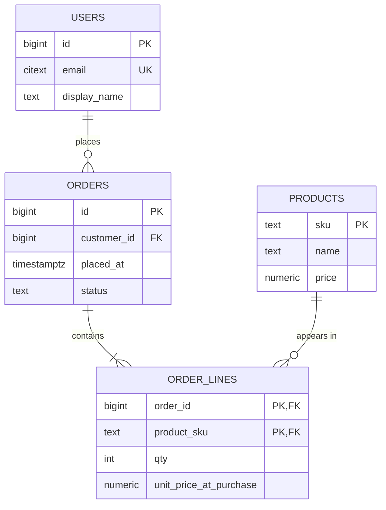

A customer changes their email address. Your `orders` table stores the customer's email on every order row, because that was convenient when the checkout page was written. Now there are 40,000 rows carrying the old address, a support agent updates the customer record, and next month's invoice still goes to the dead mailbox. Nothing crashed. No test failed. The database did exactly what the schema allowed.

That is an *update anomaly*, and the relational model exists to make it impossible by construction. Every rule in this lesson (keys, functional dependencies, normal forms) is a mechanism for putting each fact in exactly one place so the database can enforce your invariants instead of your code hoping to.

## What a relation is

A relation is a set of tuples over a fixed set of named, typed attributes. Three consequences of "set" matter in practice:

1. **No duplicate rows.** Two identical rows carry no more information than one. SQL tables are technically *bags* (duplicates allowed), which is why `SELECT DISTINCT` and the `UNION` vs `UNION ALL` distinction exist. A table without a primary key is a bag by design, and it is almost always a mistake.
2. **No inherent order.** `SELECT * FROM orders` with no `ORDER BY` returns rows in whatever order the executor found them, which changes after a `VACUUM`, an index rebuild or a plan change. Code that relies on "the order they were inserted" breaks in production on a Tuesday.
3. **Every cell is atomic** with respect to how you query it. A column containing `"red,green,blue"` is legal SQL but you cannot index, join or constrain the individual colours.

Relational algebra gives you a small set of closed operators (select, project, join, union, difference) where every result is itself a relation, so operators compose. That closure is why the query optimiser in [SQL and query plans](/learn/databases/relational-fundamentals/sql-and-query-plans) can rewrite your query freely: `σ_{a}(R ⋈ S)` and `σ_{a}(R) ⋈ S` are provably equivalent, and the planner picks whichever is cheaper.

## Keys

A **candidate key** is a minimal set of attributes whose values identify exactly one tuple. Minimal means removing any attribute breaks uniqueness. A table can have several candidate keys; you pick one as the **primary key** and the rest become **unique constraints**.

```sql
CREATE TABLE users (
    id          bigint GENERATED ALWAYS AS IDENTITY PRIMARY KEY,
    email       citext NOT NULL UNIQUE,          -- second candidate key
    display_name text NOT NULL,
    created_at  timestamptz NOT NULL DEFAULT now()
);
```

`id` is a **surrogate key**: it carries no meaning, never changes, and is cheap to store in foreign keys. `email` is a **natural key**: it means something, which is exactly why it is dangerous as a primary key. Users change emails, companies get acquired and re-domained, and every foreign key in the system would have to cascade. Use natural keys as unique constraints and surrogate keys for identity. The one place this is debated is whether the surrogate should be a sequence (`bigint`, 8 bytes, monotonically increasing, tightly packed in the B-tree) or a UUID (16 bytes, random, scatters index inserts across pages). This app uses UUIDv7 for `comments.id`, which is time-ordered and so keeps the insert locality of a sequence while remaining globally unique; random UUIDv4 primary keys on a hot insert table are a known cause of write amplification in [indexes](/learn/databases/relational-fundamentals/indexes).

A **foreign key** is a promise that a value in one table exists as a key in another. The database checks it on every insert, update and delete, which costs an index lookup per check, and it is the reason `orders.customer_id = 9182` cannot point at a customer who was deleted last week.

```sql
CREATE TABLE orders (
    id           bigint GENERATED ALWAYS AS IDENTITY PRIMARY KEY,
    customer_id  bigint NOT NULL REFERENCES users(id) ON DELETE RESTRICT,
    placed_at    timestamptz NOT NULL DEFAULT now(),
    status       text NOT NULL CHECK (status IN ('pending','paid','shipped','cancelled'))
);
CREATE INDEX ON orders (customer_id);   -- Postgres does NOT auto-index FK columns
```

The last line is a trap that bites every few months in some team: Postgres creates an index for the primary key and for unique constraints, but not for the referencing side of a foreign key. Without it, `DELETE FROM users WHERE id = 9182` has to scan all of `orders` to verify nothing references the row, and it holds a lock while doing so.

## Functional dependencies and the anomalies

A **functional dependency** `X → Y` says: whenever two rows agree on `X`, they agree on `Y`. In `orders`, `id → customer_id, placed_at, status`. Normalisation is the process of making every functional dependency follow from a key.

Take the denormalised table from the opening:

| order_id | customer_id | customer_email | product_sku | product_name | qty |
|---|---|---|---|---|---|
| 1 | 42 | ana@example.com | SKU-7 | Kettle | 1 |
| 2 | 42 | ana@example.com | SKU-9 | Toaster | 2 |
| 3 | 77 | raj@example.com | SKU-7 | Kettle | 1 |

The dependencies are `order_id → customer_id`, `customer_id → customer_email` and `product_sku → product_name`. Only the first follows from the key. The other two produce three concrete failure modes:

- **Update anomaly.** Ana changes her email; you must update every row where `customer_id = 42`, and if one update is missed the table contradicts itself.
- **Insert anomaly.** You want to add product `SKU-11 "Blender"` to the catalogue, but there is nowhere to put it until someone orders one.
- **Delete anomaly.** Raj cancels order 3 and the row is deleted. That was the only row mentioning that Raj exists, so his email is gone.

Every normal form removes a class of these.

## The normal forms, mechanically

**First normal form (1NF).** Every attribute is atomic; no repeating groups. `phone_numbers text` holding `"555-1234; 555-9876"` violates it. The fix is a `phone_numbers(user_id, number)` table. The modern exception is a genuinely opaque leaf: a `jsonb` column of settings you never query by individual key is fine; one you filter on is a schema hiding in a string.

**Second normal form (2NF).** 1NF plus: no non-key attribute depends on only *part* of a composite key. It only bites with composite keys. In `order_lines(order_id, product_sku, product_name, qty)`, `product_name` depends on `product_sku` alone, not on the pair. Move it to `products`.

**Third normal form (3NF).** 2NF plus: no non-key attribute depends on another non-key attribute (no transitive dependencies). `orders(id, customer_id, customer_email)` has `id → customer_id → customer_email`. Move `customer_email` to `users`.

**Boyce-Codd normal form (BCNF).** For every non-trivial dependency `X → Y`, `X` is a superkey. This is 3NF with one loophole closed: 3NF permits a dependency whose right side is part of a candidate key. The classic case is a table `bookings(room, slot, tutor)` where each tutor teaches in only one room (`tutor → room`) and `(room, slot)` and `(tutor, slot)` are both candidate keys. It is in 3NF (`room` is a key attribute) but not BCNF (`tutor` is not a superkey), and it still has an update anomaly: moving a tutor to a new room means touching every booking. Decompose into `tutor_rooms(tutor, room)` and `bookings(tutor, slot)`.

Here is the normalised version of the running example:



Notice `unit_price_at_purchase` on `order_lines`. That looks like a 3NF violation (`product_sku → price`), but it is not: the price *at the moment of purchase* is a fact about the order line, not about the product. Prices change; the invoice must not. Distinguishing "a copy of a current value" (anomaly) from "a historical fact that happens to look like a copy" (correct) is the single most common normalisation judgement call in real systems.

Beyond BCNF there are 4NF (multi-valued dependencies: do not store independent one-to-many facts in one table) and 5NF (join dependencies). They come up rarely; if you can explain BCNF with the tutor example, you are past the interview bar.

## What normalisation costs

Every decomposition turns one row read into a join. In the normalised schema, "show the last ten orders with customer name and line items" is a three-table join:

```sql
SELECT o.id, o.placed_at, u.display_name,
       p.name, ol.qty, ol.unit_price_at_purchase
FROM orders o
JOIN users u        ON u.id = o.customer_id
JOIN order_lines ol ON ol.order_id = o.id
JOIN products p     ON p.sku = ol.product_sku
WHERE o.customer_id = 42
ORDER BY o.placed_at DESC
LIMIT 10;
```

With the right indexes this is a handful of B-tree lookups per row and runs in well under a millisecond. The cost of normalisation is not that joins are slow; on an indexed, memory-resident schema they are not. The costs are:

- **Query complexity** that ORMs paper over badly, producing the N+1 patterns in [ORMs and N+1](/learn/databases/data-modeling-and-evolution/orms-and-n-plus-one).
- **Aggregations across large joins.** "Total revenue per customer this year" over 200 million order lines is a big join and a big `GROUP BY` regardless of indexes.
- **Read fan-out at scale.** When the data no longer fits one machine, a join across shards becomes a network scatter-gather. See [partitioning and sharding](/learn/databases/storage-and-scale/partitioning-and-sharding).

## When a senior engineer denormalises

Denormalisation is a deliberate reintroduction of redundancy in exchange for read speed, and it is only correct when you also own the mechanism that keeps the copies consistent. Four forms are common, in increasing order of risk:

1. **Derived columns maintained in the same transaction.** `orders.total_cents` computed from `order_lines` and updated in the same transaction that changes lines. Redundant, but the transaction boundary keeps it exact. Add a `CHECK` or a periodic reconciliation job.
2. **Counter caches.** `posts.comment_count` incremented on comment insert. Fast reads; under high concurrency the single row becomes a lock hotspot (see [MVCC and locking](/learn/databases/relational-fundamentals/mvcc-and-locking)). At scale you shard the counter or accept an approximate count.
3. **Materialised views.** `CREATE MATERIALIZED VIEW revenue_by_day AS ...` refreshed on a schedule. Explicitly stale, which is fine for dashboards and wrong for balances.
4. **Copying an attribute across a service boundary.** Storing `customer_email` on the order because the orders service must not call the users service on the read path. Now consistency depends on an event stream and you have signed up for [change data capture](/learn/big-data/streaming/change-data-capture) or an outbox.

The rule of thumb: normalise until it hurts, then denormalise where a measured query needs it, and write down what keeps the copy correct. "We denormalised for performance" without a named consistency mechanism is the phrase that precedes the emailing-the-wrong-address bug.

## Constraints are the cheapest tests you will ever write

The point of a schema is that the database enforces the invariants, always, regardless of which code path wrote the row. Prefer, in this order:

- `NOT NULL` on everything that is genuinely required. Nullable columns silently permit three-valued logic (`NULL = NULL` is not true) that breaks `WHERE status <> 'cancelled'`.
- `CHECK` constraints for domain rules (`qty > 0`, `status IN (...)`).
- `UNIQUE` for every natural key, including composite ones like `(user_id, lesson_slug)`.
- Foreign keys with an explicit `ON DELETE` policy. `RESTRICT` by default; `CASCADE` only when the child is meaningless without the parent (order lines without an order).
- `EXCLUDE` constraints for "no overlapping intervals" rules, which application code gets wrong under concurrency every single time.

Constraints cost an index probe per write. That is almost always cheaper than the incident.

## Senior signals

- You explain normal forms by the anomaly each one prevents (update, insert, delete), not by reciting definitions, and you can give the tutor/room BCNF example without notes.
- You distinguish a redundant copy of a current value (a bug waiting to happen) from a historical snapshot (`unit_price_at_purchase`) that only looks redundant.
- You know Postgres does not index the referencing side of a foreign key and you add that index when you add the constraint.
- You choose surrogate keys for identity and natural keys for uniqueness constraints, and you can say why random UUIDv4 primary keys hurt insert-heavy B-trees while UUIDv7 does not.
- When you denormalise you name the mechanism that keeps the copies consistent (same transaction, trigger, CDC, scheduled refresh) and the staleness window it implies.
- You reach for `CHECK`, `UNIQUE`, `NOT NULL` and `EXCLUDE` before writing validation code, because the database enforces them on every path.

## Check yourself

```quiz
- q: >-
    A table `order_lines(order_id, product_sku, product_name, qty)` has primary key (order_id, product_sku). Which normal form does it violate, and what is the concrete anomaly?
  options: ["2NF; product_name depends on product_sku, only part of the key", "3NF; qty depends transitively on product_name through product_sku", "None; each non-key column depends on the full composite key", "1NF; product_name is a repeating group copied onto every line"]
  answer: 0
  explanation: >-
    product_name depends on part of the composite key (product_sku), which is exactly the 2NF partial-dependency case. The update anomaly is that renaming a product means updating every line that ever sold it, and one missed row leaves the table contradicting itself. It is not a 1NF issue (the value is atomic), and qty has no dependency on product_name.
- q: >-
    An orders table stores unit_price_at_purchase on each order line even though products has a price column. A reviewer flags it as a 3NF violation. What is the correct response?
  options: ["Remove it; the current price can always be joined from products", "Keep it, but sync it by trigger whenever products.price changes", "Move it into a materialised view refreshed from products nightly", "Keep it; it is a historical fact about the line, not a copy"]
  answer: 3
  explanation: >-
    The price at purchase time is an attribute of the order line, not a copy of the product's current price, and product prices change over time. Joining to products would silently change past invoices when prices change. A trigger that keeps it in sync would reintroduce exactly that bug.
- q: >-
    You add `customer_id bigint REFERENCES users(id)` to a 300-million-row orders table in Postgres and nothing else. What happens the next time someone runs DELETE FROM users WHERE id = 5?
  options: ["It cascades by default and deletes all of the customer's orders", "It sequentially scans orders to check for referencing rows", "It fails at once, because foreign keys forbid deleting parents", "It is fast; Postgres indexes foreign key columns automatically"]
  answer: 1
  explanation: >-
    Postgres indexes primary keys and unique constraints but not the referencing side of a foreign key, so the referential check on delete becomes a sequential scan of orders, holding a lock on the users row while it runs. The default action is RESTRICT, which errors only if a referencing row is found, and CASCADE only applies if you asked for it.
- q: >-
    Which denormalisation carries the least consistency risk?
  options: ["posts.comment_count incremented by the application right after each comment insert", "orders.total_cents recomputed inside the transaction that modifies order_lines", "A revenue-by-day materialised view refreshed from the base tables every hour", "customer_email copied onto each order row and kept current by an event consumer"]
  answer: 1
  explanation: >-
    A derived value maintained in the same transaction as its inputs is exact by the atomicity guarantee. The materialised view is explicitly stale, the counter cache drifts if the increment is skipped or the insert rolls back separately, and the cross-service copy depends on an event pipeline never dropping a message.
- q: >-
    Why is a random UUIDv4 primary key a worse choice than a bigint sequence or UUIDv7 for a table receiving 5,000 inserts per second?
  options: ["Random 122-bit values begin to collide at several thousand inserts per second", "A 16-byte key makes every index comparison twice as costly as a bigint", "Random keys scatter inserts across the whole B-tree instead of the one hot leaf", "Postgres cannot use a B-tree on uuid columns, so each lookup scans"]
  answer: 2
  explanation: >-
    B-tree inserts with monotonically increasing keys hit the same rightmost leaf page, which stays hot in cache. Random keys touch a random leaf each time, so the working set is the whole index and every insert may cause a page read, a page write and a full-page WAL image. Key width is not the problem: UUIDv7 is also 16 bytes, but it is time-ordered and so avoids the scatter while staying globally unique.
```
