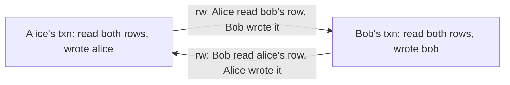

Every new account gets one welcome credit. The code is careful and runs in a transaction:

```sql
BEGIN;
SELECT count(*) FROM credits WHERE user_id = 42 AND kind = 'welcome';   -- 0
INSERT INTO credits (user_id, kind, cents) VALUES (42, 'welcome', 1000);
COMMIT;
```

A user double-clicks the button. Two requests arrive 3 ms apart, both run the `SELECT`, both see zero, both insert. The user has two credits. Under Postgres's default isolation level this is allowed. Under `REPEATABLE READ` it is still allowed. Only `SERIALIZABLE`, or a constraint, stops it.

"We use transactions" is not a concurrency strategy. A transaction guarantees atomicity; how much it is protected from other transactions running at the same time depends on the isolation level, and the default in almost every database permits anomalies that break real invariants. This lesson shows each anomaly as the interleaving that produces it, then what each level actually prevents in Postgres, and how to decide.

## The anomalies, one timeline each

Read each table top to bottom as wall-clock time. Session A and Session B are two connections running concurrently.

### Dirty reads: never in Postgres

A dirty read is seeing another transaction's uncommitted write. If that transaction then rolls back, you acted on data that never existed. Postgres never allows dirty reads, even if you ask for `READ UNCOMMITTED` (which it silently treats as `READ COMMITTED`). The MVCC visibility rules make it impossible: a row version whose creating transaction is still in progress is invisible to everyone else.

### Non-repeatable reads and read skew

Under `READ COMMITTED`, every *statement* takes a fresh snapshot. Two reads of the same row in one transaction can disagree:

| # | Session A (read committed) | Session B |
|---|---|---|
| 1 | `BEGIN;` | |
| 2 | `SELECT balance_cents FROM accounts WHERE id = 1;` → 10000 | |
| 3 | | `BEGIN;` |
| 4 | | `UPDATE accounts SET balance_cents = balance_cents - 4000 WHERE id = 1;` |
| 5 | | `UPDATE accounts SET balance_cents = balance_cents + 4000 WHERE id = 2;` |
| 6 | | `COMMIT;` |
| 7 | `SELECT balance_cents FROM accounts WHERE id = 2;` → 4000 | |
| 8 | `COMMIT;` | |

Session A was computing total holdings. Account 1 was read before the transfer (10,000) and account 2 after it (4,000 instead of 0), so A reports 14,000 when the true total at every instant was 10,000. That is **read skew**: each read is correct, but they come from different moments. It is how nightly reports, balance reconciliations and `pg_dump`-by-hand scripts produce totals that never existed. It is fixed by running the reader at `REPEATABLE READ`, where one snapshot is taken at the first statement and used for the whole transaction.

### Phantoms

A phantom is the same problem for a *set* of rows: a query re-run within a transaction returns rows that another transaction inserted in the meantime. `SELECT count(*) FROM bookings WHERE room_id = 3 AND day = '2026-10-01'` returns 0, then 1. Under `READ COMMITTED` phantoms happen; under Postgres's `REPEATABLE READ` they do not, because the snapshot does not include rows committed after it was taken. (The SQL standard permits phantoms at `REPEATABLE READ`; Postgres is stricter than it needs to be.)

### Lost updates

Two transactions read a value, compute a new one in the application, and write it back:

| # | Session A | Session B |
|---|---|---|
| 1 | `BEGIN;` | `BEGIN;` |
| 2 | `SELECT stock FROM items WHERE id = 7;` → 10 | |
| 3 | | `SELECT stock FROM items WHERE id = 7;` → 10 |
| 4 | `UPDATE items SET stock = 9 WHERE id = 7;` | |
| 5 | | `UPDATE items SET stock = 9 WHERE id = 7;` (blocks on A's row lock) |
| 6 | `COMMIT;` | |
| 7 | | unblocks, writes 9 · `COMMIT;` |

Two items sold, stock decremented once. Under `READ COMMITTED` this commits silently. It is the database version of the unsynchronised counter from the [concurrency track](/learn/systems/concurrency/races-mutexes-and-invariants):

```viz
{"type": "concurrency", "scenario": "race-condition", "threads": 2,
 "title": "A lost update is a read-modify-write race",
 "caption": "Both threads read the same value, both compute value + 1, both write it back; one increment disappears. Two database sessions doing SELECT then UPDATE with a value computed in application code interleave in exactly this way."}
```

Under `REPEATABLE READ`, step 7 fails instead:

```text
ERROR:  could not serialize access due to concurrent update
```

B tried to update a row that was changed by a transaction that committed after B's snapshot was taken. Postgres refuses (first updater wins) and B must retry from the start, at which point it reads 9 and writes 8.

There is a subtlety in `READ COMMITTED` that makes the atomic form safe. If step 5 had been `UPDATE items SET stock = stock - 1 WHERE id = 7 AND stock > 0`, then when B unblocks, Postgres re-reads the *newly committed* version of the row and re-evaluates the `WHERE` clause and the `SET` expression against it. B computes 9 − 1 = 8. This re-check is why single-statement read-modify-write is correct at the default level while the two-statement version is not. It only re-checks rows the `UPDATE` had already found, though; rows that start matching the predicate because of the other transaction are not picked up, which is one reason complex multi-row `UPDATE`s under `READ COMMITTED` can surprise you.

### Write skew

Now the anomaly that survives `REPEATABLE READ`. A hospital requires at least one doctor on call per shift. Alice and Bob are both on call for shift 7 and both feel unwell:

| # | Session A (Alice) | Session B (Bob) |
|---|---|---|
| 1 | `BEGIN ISOLATION LEVEL REPEATABLE READ;` | `BEGIN ISOLATION LEVEL REPEATABLE READ;` |
| 2 | `SELECT count(*) FROM on_call WHERE shift_id = 7 AND active;` → 2 | |
| 3 | | `SELECT count(*) FROM on_call WHERE shift_id = 7 AND active;` → 2 |
| 4 | `UPDATE on_call SET active = false WHERE shift_id = 7 AND doctor = 'alice';` | |
| 5 | | `UPDATE on_call SET active = false WHERE shift_id = 7 AND doctor = 'bob';` |
| 6 | `COMMIT;` | |
| 7 | | `COMMIT;` → succeeds |

Nobody is on call. Each transaction checked the invariant against its snapshot, and the check was true. Each wrote a *different* row, so there was no write-write conflict for first-updater-wins to catch. Snapshot isolation only compares write sets, and these write sets are disjoint.

That is **write skew**: two transactions read overlapping data, make disjoint writes, and each write invalidates the premise of the other. The welcome-credit bug from the opening is the same shape with a twist: the writes are *inserts*, so there is not even an existing row either transaction could have locked. Double-booked meeting rooms, usernames claimed twice, two admins each demoting the other so the organisation has no admin, overlapping shifts, overspent budgets split across several rows: all write skew.

## What each level actually prevents

The SQL standard defines levels by the anomalies they forbid. Postgres implements them with snapshots and is stricter than the standard at `REPEATABLE READ`:

| Postgres level | Snapshot | Dirty read | Non-repeatable / read skew | Phantom | Lost update (two-statement) | Write skew |
|---|---|---|---|---|---|---|
| `READ UNCOMMITTED` | Same as read committed | Prevented | Possible | Possible | Possible | Possible |
| `READ COMMITTED` (default) | New per statement | Prevented | Possible | Possible | Possible | Possible |
| `REPEATABLE READ` | One per transaction | Prevented | Prevented | Prevented | Aborts with `40001` | **Possible** |
| `SERIALIZABLE` | One per transaction, plus conflict tracking | Prevented | Prevented | Prevented | Aborts with `40001` | Aborts with `40001` |

Two cross-database warnings. First, the same name means different things elsewhere. MySQL's InnoDB defaults to `REPEATABLE READ`, but its plain `SELECT`s read a snapshot while its `UPDATE`s and locking reads act on the latest committed version, so the two-statement lost update above commits silently there, where Postgres would abort it. Oracle's `SERIALIZABLE` is snapshot isolation and permits write skew. Never assume a level's name tells you its guarantees; read that database's documentation or test the interleaving.

Second, the snapshot in Postgres's `REPEATABLE READ` is taken at the first statement after `BEGIN`, not at `BEGIN` itself. A transaction that runs `BEGIN`, does nothing for a second and then reads gets a snapshot from the moment of the read, including everything committed during that second.

## Three ways to stop write skew, and one trap

**1. Run at `SERIALIZABLE`.** In the doctor example, step 7 becomes:

```text
ERROR:  could not serialize access due to read/write dependencies among transactions
DETAIL:  Reason code: Canceled on identification as a pivot, during commit attempt.
HINT:  The transaction might succeed if retried.
```

Bob's retry sees one doctor on call and refuses to go off shift. This works for the phantom (insert) variant too, with no schema changes. The cost is covered below.

**2. Materialise the conflict with a lock.** If both transactions must lock the same row before deciding, they serialise. For the doctors, lock every row you read:

```sql
SELECT doctor FROM on_call WHERE shift_id = 7 AND active FOR UPDATE;
```

Bob's `SELECT ... FOR UPDATE` now blocks until Alice commits, then sees one active doctor. This works at `READ COMMITTED`. For the insert variant there is no row to lock yet, so you lock a parent row that always exists (`SELECT 1 FROM users WHERE id = 42 FOR UPDATE` before checking credits) or take an [advisory lock](/learn/databases/relational-fundamentals/mvcc-and-locking) on the key.

**3. Make the database enforce the invariant.** Many write-skew invariants can be written as constraints, which are checked atomically regardless of isolation level:

```sql
-- At most one welcome credit per user.
CREATE UNIQUE INDEX credits_one_welcome ON credits (user_id) WHERE kind = 'welcome';

-- No overlapping bookings for the same room.
CREATE EXTENSION IF NOT EXISTS btree_gist;
ALTER TABLE bookings ADD CONSTRAINT bookings_no_overlap
  EXCLUDE USING gist (room_id WITH =, during WITH &&);
```

When one exists, a constraint is the best fix: it cannot be forgotten by the next engineer who writes a new code path.

**The trap: folding the check into the write.** It is tempting to make the write conditional on the read: `UPDATE on_call SET active = false WHERE shift_id = 7 AND doctor = 'alice' AND (SELECT count(*) FROM on_call WHERE shift_id = 7 AND active) > 1`. It looks atomic and is not. Under `READ COMMITTED` the subquery reads a statement snapshot that does not include Bob's uncommitted change, the two `UPDATE`s touch different rows so neither blocks the other, and both still commit. It is only reliable combined with a lock or a constraint.

## How Postgres serialisable works

Postgres's `SERIALIZABLE` is **serialisable snapshot isolation** (SSI). It runs exactly like `REPEATABLE READ`, with no extra blocking, and additionally records what each transaction read so it can detect the dependency pattern that every non-serialisable execution must contain.

It tracks **rw-antidependencies**: T1 → T2 when T1 read a version of some data that T2 later overwrote (so T1 did not see T2's write and must logically come *before* T2). Reads are recorded as `SIRead` locks, which block nothing; they are bookkeeping. The theory (Fekete, Cahill and others) says every anomaly under snapshot isolation involves a **dangerous structure**: two consecutive rw-antidependencies, T1 → T2 → T3, where T3 commits first. T1 and T3 may be the same transaction, which is exactly write skew:



When Postgres sees a dangerous structure forming, it aborts one participant with `40001`. Three practical consequences:

- **False positives.** SSI is conservative. It may abort transactions whose particular interleaving happened to be harmless, especially when read tracking is coarse. A sequential scan records a lock on the whole table, so any concurrent write to that table creates a dependency; an index scan records locks on index pages, which is much finer. Good indexes reduce serialisation failures.
- **Everyone must participate.** The guarantee only covers transactions running at `SERIALIZABLE`. A `READ COMMITTED` transaction writing the same tables is invisible to the conflict tracking and can still produce an anomaly.
- **Retries are mandatory.** Every transaction needs a retry wrapper that re-runs the whole function on `40001`. Long read-only reports can avoid aborts entirely with `BEGIN ISOLATION LEVEL SERIALIZABLE READ ONLY DEFERRABLE`, which waits for a snapshot that is guaranteed safe and then cannot fail.

The overhead in CPU and memory is modest in most workloads. The real cost is the abort rate under contention: a hot row or a table scanned by many transactions can push it high enough that throughput collapses into retries.

## Choosing

There are two defensible strategies, and a senior engineer can argue either.

**Read committed plus discipline.** Keep the default. Use single-statement atomic updates and upserts for read-modify-write, `SELECT ... FOR UPDATE` when a decision depends on rows you will write, constraints for every invariant that can be expressed as one, and advisory locks or parent-row locks for the rest. This is fast and is what most Postgres shops do. Its weakness is that correctness depends on every engineer spotting every race on every new code path, and write skew is invisible in code review unless you are looking for it.

**Serialisable plus retries.** Set `default_transaction_isolation = 'serializable'` for the application role, wrap every transaction in a retry loop, and treat `40001` as routine. Correctness no longer depends on spotting races. The costs are the retry machinery, some throughput under contention, and the discipline of keeping transactions short and free of side effects (a retried transaction must not have already sent the email). Money movement, inventory, and anything with a regulator attached often justify it.

Whichever you pick, write the invariant down, name the interleaving that would break it, and say which mechanism stops that interleaving. That sentence is what a design reviewer wants to hear.

```exercise
id: detect-write-skew
title: Find write skew in a schedule
prompt: |
  A schedule is a list of operations in wall-clock order. Each operation is
  `[txn, "r", item]` (read), `[txn, "w", item]` (write) or `[txn, "c"]`
  (commit). Every transaction commits exactly once, after its last read or write.

  The database runs snapshot isolation: a transaction's snapshot is taken at its
  first operation, and if two concurrent transactions write the same item, one is
  aborted (first committer wins).

  Return every pair of transactions that exhibits write skew, i.e. both commit
  under snapshot isolation yet no serial order explains the result. A pair
  `[a, b]` qualifies when:
  - they are concurrent: each one's first operation comes before the other's commit;
  - their write sets are disjoint (otherwise one would be aborted);
  - `a` reads at least one item that `b` writes, and `b` reads at least one item
    that `a` writes.

  Return the pairs as `[a, b]` with `a < b` (string comparison), sorted. Names
  are `T1` to `T9`.
languages: [python, javascript]
entry: find_write_skew
starter:
  python: |
    def find_write_skew(schedule):
        return []
  javascript: |
    function find_write_skew(schedule) {
      return [];
    }
tests:
  - args: [[["T1", "r", "alice"], ["T1", "r", "bob"], ["T2", "r", "alice"], ["T2", "r", "bob"], ["T1", "w", "alice"], ["T2", "w", "bob"], ["T1", "c"], ["T2", "c"]]]
    expected: [["T1", "T2"]]
    label: doctors on call
  - args: [[["T1", "r", "alice"], ["T1", "r", "bob"], ["T1", "w", "alice"], ["T1", "c"], ["T2", "r", "alice"], ["T2", "r", "bob"], ["T2", "w", "bob"], ["T2", "c"]]]
    expected: []
    label: serial, not concurrent
  - args: [[["T1", "r", "x"], ["T2", "r", "x"], ["T1", "w", "x"], ["T2", "w", "x"], ["T1", "c"], ["T2", "c"]]]
    expected: []
    label: same item written, so snapshot isolation aborts one
  - args: [[["T1", "r", "x"], ["T2", "w", "x"], ["T1", "w", "y"], ["T1", "c"], ["T2", "c"]]]
    expected: []
    label: dependency in one direction only
  - args: [[["T1", "r", "a"], ["T2", "r", "c"], ["T3", "r", "b"], ["T1", "w", "b"], ["T3", "w", "a"], ["T2", "w", "c"], ["T1", "c"], ["T2", "c"], ["T3", "c"]]]
    expected: [["T1", "T3"]]
    hidden: true
  - args: [[["T1", "r", "a"], ["T1", "w", "b"], ["T1", "c"], ["T2", "r", "b"], ["T2", "w", "a"], ["T2", "c"]]]
    expected: []
    hidden: true
  - args: [[["T1", "r", "x"], ["T2", "r", "y"], ["T3", "r", "p"], ["T4", "r", "q"], ["T1", "w", "y"], ["T2", "w", "x"], ["T3", "w", "q"], ["T4", "w", "p"], ["T4", "c"], ["T3", "c"], ["T2", "c"], ["T1", "c"]]]
    expected: [["T1", "T2"], ["T3", "T4"]]
    hidden: true
hints:
  - "One pass over the schedule can record, per transaction, the index of its first operation, the index of its commit, its read set and its write set."
  - "Then check every pair of transactions against the three conditions."
```

## Senior signals

- You name the anomaly by its interleaving (read skew, lost update, write skew, phantom) rather than saying "race condition", and you can draw the two-session timeline on a whiteboard.
- You know Postgres's `READ COMMITTED` re-evaluates an `UPDATE`'s `WHERE` against the latest row version, which is why `SET x = x - 1` is safe and `SELECT` then `UPDATE` is not.
- You know `REPEATABLE READ` in Postgres is snapshot isolation: no phantoms, lost updates abort, write skew commits.
- You fix write skew with the cheapest mechanism that works: a constraint (unique partial index, exclusion constraint) first, then a lock on a row both transactions must touch, then `SERIALIZABLE`.
- You know SSI needs every participating transaction at `SERIALIZABLE`, needs a retry loop for `40001`, and aborts more when reads are sequential scans.
- You do not trust isolation level names across databases: InnoDB's repeatable read and Oracle's serialisable both behave differently from Postgres's.

## Check yourself

```quiz
- q: >-
    Two sessions at Postgres REPEATABLE READ each run SELECT count(*) FROM bookings WHERE room = 3 AND day = '2026-10-01' (result 0) and then INSERT a booking for that room and day. What happens?
  options: ["Both commit, since the inserts share no row; the room is double-booked", "The second INSERT blocks on the first's row lock, then fails at commit", "The second COMMIT fails with 40001, since both read the same predicate", "The second SELECT sees the first INSERT, so it never inserts a booking"]
  answer: 0
  explanation: >-
    This is write skew through phantoms. Each snapshot legitimately showed zero bookings; the writes are new rows, so snapshot isolation's first-updater-wins has no write-write conflict to compare. Aborting on a shared read predicate is what SERIALIZABLE adds, not REPEATABLE READ. An exclusion or unique constraint would reject the second insert at any level.
- q: >-
    Why is UPDATE items SET stock = stock - 1 WHERE id = 7 safe against lost updates under READ COMMITTED, while SELECT stock followed by UPDATE items SET stock = <value computed in the app> is not?
  options: ["It is not safe either; both forms can lose updates under READ COMMITTED", "READ COMMITTED silently promotes single statements to SERIALIZABLE", "A single UPDATE takes a table lock, so no other writer can interleave with it", "A blocked UPDATE re-reads the newly committed row and recomputes stock - 1"]
  answer: 3
  explanation: >-
    Under READ COMMITTED an UPDATE that was blocked on another transaction's row lock re-checks its row against the latest committed version, so stock - 1 is computed from the current value. In the two-statement form, the application computed the new value from a read that is out of date by the time it writes. The UPDATE takes only a row lock, not a table lock.
- q: >-
    A nightly job sums balances across 2 million accounts with one SELECT per batch of 10,000 rows, inside one transaction at READ COMMITTED, while transfers run. The total is occasionally wrong. What is the anomaly and the fix?
  options: ["Lost updates from the transfers; read each batch with SELECT ... FOR UPDATE", "Dirty reads of uncommitted transfers; run the job at SERIALIZABLE instead", "Phantom rows appearing mid-scan; add an index so each batch is bounded", "Read skew; run the whole job at REPEATABLE READ so batches share a snapshot"]
  answer: 3
  explanation: >-
    READ COMMITTED takes a snapshot per statement, so a transfer committed between batches is counted on one side only. REPEATABLE READ (or SERIALIZABLE READ ONLY DEFERRABLE) gives the whole report one consistent snapshot without blocking writers. Postgres never allows dirty reads, and the job writes nothing, so there is no lost update.
- q: >-
    A team switches to SERIALIZABLE and sees a high rate of 40001 errors on a table that is queried by sequential scans. What is the most likely contributor?
  options: ["READ COMMITTED sessions on the same table are counted as conflicts too", "SERIALIZABLE takes exclusive locks on every single row a transaction reads", "Sequential scans take relation-level SIRead locks, so any table write conflicts", "The retry loop is too aggressive, so each retry collides with the last"]
  answer: 2
  explanation: >-
    SSI's SIRead locks block nothing but determine conflict detection. A sequential scan records a relation-level lock, the coarsest granularity, so almost every concurrent write to the table forms an rw-dependency, including false positives. Index scans lock index pages instead, so adding suitable indexes cuts the abort rate. READ COMMITTED transactions are invisible to SSI tracking, not extra conflicts.
- q: >-
    Which invariant can a constraint enforce, removing the need for SERIALIZABLE?
  options: ["A user may hold at most one active subscription", "An account balance must equal the sum of its ledger entries", "The sum of line items must equal the order total", "A shift must always have at least one active doctor"]
  answer: 0
  explanation: >-
    At most one active subscription per user is a unique partial index: CREATE UNIQUE INDEX ON subscriptions (user_id) WHERE status = 'active'. At least one doctor and the aggregate invariants span multiple rows in ways a single-row CHECK or uniqueness constraint cannot express; they need locks, SERIALIZABLE, or a redesigned schema.
```
