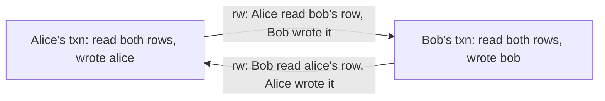

Every new account gets one welcome credit. The code is careful and runs in a transaction:

```sql
BEGIN;
SELECT count(*) FROM credits WHERE user_id = 42 AND kind = 'welcome';   -- 0
INSERT INTO credits (user_id, kind, cents) VALUES (42, 'welcome', 1000);
COMMIT;
```

A user double-clicks. Two requests arrive 3 ms apart, both run the `SELECT`, both see zero, both insert. The user has two credits. Under Postgres's default isolation level this is allowed. Under `REPEATABLE READ` it is still allowed. Only `SERIALIZABLE`, or a constraint, stops it.

A transaction guarantees atomicity. How much it is protected from other transactions running at the same time depends on the isolation level, and the default in almost every database permits anomalies that break real invariants. This lesson reproduces each anomaly on PostgreSQL 17 with two real sessions interleaved step by step, shows the mechanism that permits or prevents it, compares with MySQL's InnoDB, and measures what the strict levels cost.

## How the timelines were produced

Two sessions have to interleave precisely, including one blocking on the other. The lab drives both from a third psql session with the `dblink` extension: `dblink_exec('a', ...)` runs a statement on session A and waits; `dblink_send_query('b', ...)` starts a statement on B without waiting, so the controller can observe that B is blocked (`dblink_is_busy('b')` returns 1), commit A, and then collect B's result with `dblink_get_result`. Every result quoted below is what those sessions returned.

## Dirty reads: never in Postgres

A dirty read is seeing another transaction's uncommitted write; if that transaction rolls back, you acted on data that never existed. Session A ran `BEGIN ISOLATION LEVEL READ UNCOMMITTED`; B updated account 1 from 10,000 to 0 without committing; A read account 1 and got **10000**, while `SHOW transaction_isolation` reported `read uncommitted`. Postgres accepts the level and implements it as `READ COMMITTED`, because MVCC visibility makes dirty reads impossible: a version whose creating transaction is still in progress is invisible to everyone else. InnoDB does implement `READ UNCOMMITTED` and returns the dirty value.

## Read skew and phantoms

Under `READ COMMITTED` every *statement* takes a fresh snapshot, so two reads in one transaction can come from different moments:

| # | Session A | Session B | A sees at READ COMMITTED | A sees at REPEATABLE READ |
|---|---|---|---|---|
| 1 | `BEGIN;` read account 1 | | 10000 | 10000 |
| 2 | | Move 4,000 from account 1 to account 2; `COMMIT` | | |
| 3 | read account 2 | | **4000** | 0 |

At read committed, A's total is 14,000, a figure that existed at no instant. That is **read skew**: each read is correct, but they come from different moments. It is how nightly reports and reconciliation scripts produce totals that never existed, and it is fixed by running the reader at `REPEATABLE READ`, where one snapshot, taken at the transaction's first statement (not at `BEGIN`), serves every statement.

A **phantom** is the same problem for a set of rows. A counted bookings for room 3 on 1 October, B inserted one and committed, A counted again: **0 then 1** at read committed, **0 then 0** at repeatable read. The SQL standard permits phantoms at `REPEATABLE READ`; Postgres is stricter because its snapshot does not contain rows committed after it was taken.

## Lost updates

Two transactions read a value, compute a new one in the application, and write it back. Measured with `items.stock = 10`:

| # | Session A | Session B |
|---|---|---|
| 1 | `BEGIN;` read stock → 10 | `BEGIN;` read stock → 10 |
| 2 | `UPDATE items SET stock = 9 WHERE id = 7;` | |
| 3 | | `UPDATE items SET stock = 9 WHERE id = 7;` blocks on A's row lock (`dblink_is_busy` = 1) |
| 4 | `COMMIT;` | |
| 5 | | at READ COMMITTED: `UPDATE 1`, `COMMIT`, final stock **9** |
| 5′ | | at REPEATABLE READ: `ERROR: could not serialize access due to concurrent update` |

Two items sold, stock decremented once, and at read committed nothing complained. It is the database version of the unsynchronised counter in the [concurrency track](/learn/systems/concurrency/races-mutexes-and-invariants):

```viz
{"type": "concurrency", "scenario": "race-condition", "threads": 2,
 "title": "A lost update is a read-modify-write race",
 "caption": "Both threads read the same value, both compute value + 1, both write it back; one increment disappears. Two database sessions doing SELECT then UPDATE with a value computed in application code interleave in exactly this way."}
```

Change B's statement to the atomic form, `UPDATE items SET stock = stock - 1 WHERE id = 7 AND stock > 0 RETURNING stock`, keep read committed, and B returns **8**. The mechanism is Postgres's **EvalPlanQual** re-check: when an `UPDATE` at read committed finds its target row locked, it waits; when the locker commits, it fetches the *newly committed* version, re-evaluates the `WHERE` clause against it, and computes `SET` from it. That is why a single-statement read-modify-write is correct at the default level while the two-statement version is not. The re-check only covers rows the statement had already found; rows that begin to match the predicate because of the other transaction are not picked up, which is why complex multi-row `UPDATE`s at read committed can still surprise you.

This app relies on the atomic form in several places. `InterviewService::finish` updates the interview `WHERE id = $1 AND status IN ('active', 'grading')` and returns the row; two racing "finish" calls both reach the update, the second re-checks the now-committed row, finds it `completed`, updates nothing, and is reported as a conflict. The integration test runs two concurrent finishes and asserts exactly one succeeds. The same shape freezes a transcript for grading: `begin_grading` moves `active` to `grading` in one conditional `UPDATE`, after which `append_transcript`, whose `WHERE` requires `status = 'active'`, refuses a reply that is still streaming in.

## Write skew

The anomaly that survives `REPEATABLE READ`. A hospital requires at least one doctor on call per shift; Alice and Bob are both on call for shift 7 and both feel unwell:

| # | Session A (Alice) | Session B (Bob) |
|---|---|---|
| 1 | `BEGIN ISOLATION LEVEL REPEATABLE READ;` | `BEGIN ISOLATION LEVEL REPEATABLE READ;` |
| 2 | count active doctors on shift 7 → 2 | count active doctors on shift 7 → 2 |
| 3 | `UPDATE on_call SET active = false WHERE shift_id = 7 AND doctor = 'alice';` | `UPDATE on_call SET active = false WHERE shift_id = 7 AND doctor = 'bob';` |
| 4 | `COMMIT` → COMMIT | `COMMIT` → COMMIT |
| 5 | Doctors on call now: **0** | |

Each transaction checked the invariant against its snapshot, and the check was true. Each wrote a *different* row, so first-updater-wins had nothing to compare: snapshot isolation only detects write-write conflicts, and these write sets are disjoint. That is **write skew**: two transactions read overlapping data, make disjoint writes, and each write invalidates the other's premise.

The welcome credit is the same shape with inserts: at repeatable read both sessions counted 0, both inserted, both committed, and user 42 had **2** credits. With inserts there is not even an existing row either transaction could have locked. Double-booked rooms, usernames claimed twice, two admins each demoting the other, overspent budgets split across rows: all write skew.

Rerun both at `SERIALIZABLE` and the first commit succeeds while the second fails:

```text
ERROR:  could not serialize access due to read/write dependencies among transactions
DETAIL:  Reason code: Canceled on identification as a pivot, during commit attempt.
HINT:  The transaction might succeed if retried.
```

One doctor stays on call; one credit is granted. Bob's retry sees one active doctor and refuses to go off shift.

## What each level prevents, in Postgres and in MySQL

| Anomaly | Postgres: lowest level that prevents it | InnoDB (MySQL): lowest level that prevents it |
|---|---|---|
| Dirty read | Every level (read uncommitted runs as read committed) | Read committed |
| Read skew / non-repeatable read | Repeatable read | Repeatable read, for plain `SELECT`s |
| Phantom | Repeatable read (snapshot) | Repeatable read: snapshot for plain reads, next-key locks for locking reads |
| Lost update, two-statement | Repeatable read (the second writer aborts with `40001`) | Serialisable only; at repeatable read the second `UPDATE` reads the latest version and overwrites silently |
| Write skew | Serialisable (SSI aborts one transaction) | Serialisable (plain reads become `FOR SHARE` locks; conflicts block or deadlock) |

The InnoDB column is documented behaviour, not measured in this lab, and it shows why level names do not travel. InnoDB's default is `REPEATABLE READ`, but only plain `SELECT`s read the snapshot; `UPDATE`, `DELETE` and locking reads act on the latest committed version and take next-key locks (the row plus the gap before it). So the two-statement lost update that Postgres aborts at repeatable read commits silently on InnoDB at the same level. InnoDB's `SERIALIZABLE` is two-phase locking: in the welcome-credit case, both `SELECT count(*)` statements take shared locks on the gap where user 42's credit would go, both `INSERT`s wait for the other's gap lock, and InnoDB's deadlock detector aborts one with error 1213. Oracle's `SERIALIZABLE` extends statement-level read consistency to the whole transaction and fails a write to a row changed since the transaction began (`ORA-08177`): that is snapshot isolation, so it permits write skew. Read the documentation or test the interleaving; never infer guarantees from the name.

## Three ways to stop write skew, and one trap

**1. Make the database enforce the invariant.** Many write-skew invariants are constraints, which hold at every isolation level:

```sql
CREATE UNIQUE INDEX credits_one_welcome ON credits (user_id) WHERE kind = 'welcome';

CREATE EXTENSION IF NOT EXISTS btree_gist;
ALTER TABLE bookings ADD CONSTRAINT bookings_no_overlap
  EXCLUDE USING gist (room_id WITH =, during WITH &&);
```

This app does it for interviews: `uq_interviews_one_active_per_user`, a unique partial index on `interviews (user_id) WHERE status = 'active'`, replaced a check-then-insert that could race. A constraint cannot be forgotten by the next engineer who writes a new code path.

**2. Materialise the conflict with a lock.** If both transactions must lock the same row before deciding, they serialise. For the doctors, lock the rows you read: `SELECT doctor FROM on_call WHERE shift_id = 7 AND active FOR UPDATE`. Bob now blocks until Alice commits, then sees one doctor. For the insert variant there is no row yet, so lock a parent row that always exists (`SELECT 1 FROM users WHERE id = 42 FOR UPDATE`) or take an [advisory lock](/learn/databases/relational-fundamentals/mvcc-and-locking) on the key.

**3. Run at `SERIALIZABLE`**, with a retry loop, as shown above.

**The trap: folding the check into the write.** `UPDATE on_call SET active = false WHERE shift_id = 7 AND doctor = 'alice' AND (SELECT count(*) FROM on_call WHERE shift_id = 7 AND active) > 1` looks atomic and is not. At read committed the subquery reads a snapshot without Bob's uncommitted change, the two updates touch different rows so neither blocks, and EvalPlanQual re-checks only the updated row, not the subquery's rows. Both commit.

## Under the hood: how serialisable snapshot isolation works

Postgres's `SERIALIZABLE` is **serialisable snapshot isolation** (SSI, Cahill, Röhm and Fekete, 2008). It runs exactly like repeatable read, with no extra blocking, and additionally records what each transaction read so it can detect the pattern every non-serialisable execution must contain.

It tracks **rw-antidependencies**: T1 → T2 when T1 read a version that T2 later overwrote, so T1 did not see T2's write and must come before T2 in any equivalent serial order. Reads are recorded as **SIRead locks**, which block nothing. The theory proves every snapshot-isolation anomaly contains a **dangerous structure**: two consecutive rw-antidependencies T1 → T2 → T3 where T3 commits first. T1 and T3 can be the same transaction, which is write skew:



The middle transaction is the **pivot**; when a structure completes, Postgres aborts a participant, which is exactly the "identification as a pivot, during commit attempt" message above. Practical consequences:

- **Granularity creates false positives.** SIRead locks start at tuple level and are promoted to page and then relation level when a transaction holds more than `max_pred_locks_per_page` (2) on a page or `max_pred_locks_per_relation` on a table (32 with defaults). A sequential scan takes a relation-level lock at once, so any concurrent write to the table forms a dependency. Index scans lock index pages, which is much finer: good indexes cut serialisation failures.
- **Everyone must participate.** Only transactions running at `SERIALIZABLE` are tracked; a read committed writer on the same tables can still produce an anomaly.
- **Test the guarantee, do not assume it.** [Jepsen's June 2020 analysis of PostgreSQL 12.3](https://jepsen.io/analyses/postgresql-12.3) found a bug in conflict detection that let serializable transactions commit a G2-item anomaly, a dependency cycle of exactly this kind; the fix shipped in the August 2020 minor releases. Isolation is implemented code, and independent testing is how such bugs surface.
- **Read-only reports can avoid aborts.** `BEGIN ISOLATION LEVEL SERIALIZABLE READ ONLY DEFERRABLE` waits for a snapshot that cannot be part of a dangerous structure, then runs without tracking and cannot fail.

## What the strict levels cost, measured

Sixteen `pgbench` clients ran transfers (read one balance, update two accounts in ascending id order) for 6 seconds, with `--max-tries=50` retrying serialisation failures:

| Level | 1,000 accounts: throughput, retried | 10 accounts: throughput, retried, failed after 50 tries |
|---|---|---|
| Read committed | 19,243 per second, 0% | 8,233 per second, 0%, 0% |
| Repeatable read | 18,173 per second, 4.2% | 3,287 per second, 53%, 0.4% |
| Serializable | 17,586 per second, 4.3% | 2,239 per second, 60%, 1.9% |

With low contention the strict levels cost under 10% of throughput; the retries come from the concurrent-update rule (two transactions touching the same account), not from SSI bookkeeping. With ten hot accounts, read committed keeps queuing on row locks and re-checking, while the snapshot levels abort more than half their attempts, and a few transactions exhaust 50 retries. SSI's CPU and memory overhead is modest; its real cost is the abort rate on hot data, which is a property of your workload, not a constant. (With the updates in random rather than ascending order, the same ten-account workload at read committed collapsed to 6.7 transactions per second from deadlocks; the [next lesson](/learn/databases/relational-fundamentals/mvcc-and-locking) explains why.)

## Isolation beyond one session: replicas, pools and caches

Isolation levels describe one server's snapshots, and three things in a real architecture sit outside them.

**Replicas.** A query on a hot standby sees the standby's snapshot, which trails the primary by the replication lag. Two reads in one "transaction" that your code splits between primary and replica can show read skew at any isolation level, because they are two databases. Postgres also refuses `SERIALIZABLE` on a standby (`cannot use serializable mode in a hot standby`, with a hint to use `REPEATABLE READ`), since SSI needs to see every concurrent transaction's reads and writes, and the primary's are invisible to it. [Replication](/learn/databases/storage-and-scale/replication) covers read-your-writes routing.

**Connection pools.** `SET TRANSACTION ISOLATION LEVEL` applies to one transaction; `SET default_transaction_isolation` applies to a session. Behind a transaction-mode pooler your next transaction may run on a different server session, so set the level per transaction (`BEGIN ISOLATION LEVEL SERIALIZABLE`) or per role (`ALTER ROLE app SET default_transaction_isolation = 'serializable'`), never with a session-level `SET` that leaks to whichever client gets that connection next.

**Caches.** A value read from Redis was read outside every database snapshot. A transaction that decides based on a cached balance has no isolation at all for that read, whatever level it runs at. Decisions that protect invariants must read from the database inside the transaction; the cache is for display.

## Choosing

**Read committed plus discipline.** Keep the default. Use single-statement updates and conditional upserts for read-modify-write, `SELECT ... FOR UPDATE` when a decision depends on rows you will write, constraints for every invariant that can be one, and advisory or parent-row locks for the rest. Fast, and what most Postgres shops do. Its weakness: correctness depends on every engineer spotting every race on every new code path, and write skew is invisible in review unless you look for it.

**Serialisable plus retries.** Set `default_transaction_isolation = 'serializable'` for the application role, wrap every transaction in a retry loop, and treat `40001` as routine. Correctness no longer depends on spotting races. The costs are the retry machinery, throughput on hot rows, and the discipline of keeping transactions short and free of side effects (a retried transaction must not have already sent the email). Money movement, inventory, and anything with a regulator attached often justify it.

Whichever you pick, write the invariant down, name the interleaving that breaks it, and say which mechanism stops it. That sentence is what a design reviewer wants to hear.

## Failure modes

| Symptom | Diagnosis | Fix |
|---|---|---|
| A duplicate welcome credit or double booking a few times a week | Write skew through inserts: check-then-insert at read committed or repeatable read | A unique partial or exclusion constraint; failing that, a parent-row lock or `SERIALIZABLE` |
| A nightly total that is off by exactly one in-flight transfer | Read skew: the report ran as many statements at read committed | Run it at `REPEATABLE READ` or `SERIALIZABLE READ ONLY DEFERRABLE` |
| Stock or counters short by a few units per day | Lost update: application-computed values written back | Atomic `SET x = x - 1` with a guard in `WHERE`, or `FOR UPDATE` |
| `40001` rate climbs after enabling serialisable | Relation-level SIRead locks from sequential scans, or hot rows | Indexes for the hot queries; shorter transactions; reduce contention on hot rows |
| A migration from MySQL starts aborting transactions that "never failed before" | Postgres's repeatable read aborts the concurrent-update case InnoDB silently allowed | Add retries; the old system was losing those updates |

## Interviewer follow-ups

**"Your service runs at repeatable read. Is it safe from lost updates?"** Model answer: in Postgres yes for two-statement read-modify-write on the same row (the second writer aborts with `40001` and must be retried), but not from write skew; in InnoDB no, because updates read the latest version. Common wrong answer: "repeatable read means nothing changes under you", ignoring both write skew and engine differences.

**"Why is `SET stock = stock - 1` safe at read committed?"** Model answer: EvalPlanQual: the blocked update re-reads the committed row, re-checks `WHERE` and recomputes `SET`, so the decrement applies to the current value. Common wrong answer: "single statements are serialisable", which is false; only the re-check on the targeted row makes it work.

**"How does Postgres detect write skew without blocking?"** Model answer: SIRead locks record reads, rw-antidependencies connect transactions, and a dangerous structure of two consecutive rw-edges with the pivot's successor committed first triggers an abort. Common wrong answer: "it takes shared locks on everything it reads", which is InnoDB's serialisable.

**"Serialisable doubled your abort rate. What do you look at?"** Model answer: whether hot queries are sequential scans (relation-level predicate locks), transaction length, and hot rows; add indexes, shorten transactions, and keep a jittered retry loop. Common wrong answer: "switch back to read committed", which reintroduces the anomalies silently.

## What mid-level engineers get wrong

- **Saying "race condition" instead of naming the anomaly**, and so not knowing which mechanism prevents it.
- **Believing repeatable read prevents all anomalies.** Write skew commits.
- **Assuming isolation names mean the same everywhere.** InnoDB's repeatable read loses updates Postgres would abort.
- **Folding the check into the write** and calling it atomic.
- **Running some transactions at serialisable and others at read committed** on the same tables, expecting protection.
- **Retrying a serialisation failure after side effects**, sending the email twice.

```exercise
id: detect-write-skew
title: Find write skew in a schedule
prompt: |
  A schedule is a list of operations in wall-clock order. Each operation is
  `[txn, "r", item]` (read), `[txn, "w", item]` (write) or `[txn, "c"]`
  (commit). Every transaction commits exactly once, after its last read or write.

  The database runs snapshot isolation: a transaction's snapshot is taken at its
  first operation, and if two concurrent transactions write the same item, one is
  aborted (first committer wins).

  Return every pair of transactions that exhibits write skew, i.e. both commit
  under snapshot isolation yet no serial order explains the result. A pair
  `[a, b]` qualifies when:
  - they are concurrent: each one's first operation comes before the other's commit;
  - their write sets are disjoint (otherwise one would be aborted);
  - `a` reads at least one item that `b` writes, and `b` reads at least one item
    that `a` writes.

  Return the pairs as `[a, b]` with `a < b` (string comparison), sorted. Names
  are `T1` to `T9`.
languages: [python, javascript]
entry: find_write_skew
starter:
  python: |
    def find_write_skew(schedule):
        return []
  javascript: |
    function find_write_skew(schedule) {
      return [];
    }
tests:
  - args: [[["T1", "r", "alice"], ["T1", "r", "bob"], ["T2", "r", "alice"], ["T2", "r", "bob"], ["T1", "w", "alice"], ["T2", "w", "bob"], ["T1", "c"], ["T2", "c"]]]
    expected: [["T1", "T2"]]
    label: doctors on call
  - args: [[["T1", "r", "alice"], ["T1", "r", "bob"], ["T1", "w", "alice"], ["T1", "c"], ["T2", "r", "alice"], ["T2", "r", "bob"], ["T2", "w", "bob"], ["T2", "c"]]]
    expected: []
    label: serial, not concurrent
  - args: [[["T1", "r", "x"], ["T2", "r", "x"], ["T1", "w", "x"], ["T2", "w", "x"], ["T1", "c"], ["T2", "c"]]]
    expected: []
    label: same item written, so snapshot isolation aborts one
  - args: [[["T1", "r", "x"], ["T2", "w", "x"], ["T1", "w", "y"], ["T1", "c"], ["T2", "c"]]]
    expected: []
    label: dependency in one direction only
  - args: [[["T1", "r", "a"], ["T2", "r", "c"], ["T3", "r", "b"], ["T1", "w", "b"], ["T3", "w", "a"], ["T2", "w", "c"], ["T1", "c"], ["T2", "c"], ["T3", "c"]]]
    expected: [["T1", "T3"]]
    hidden: true
  - args: [[["T1", "r", "a"], ["T1", "w", "b"], ["T1", "c"], ["T2", "r", "b"], ["T2", "w", "a"], ["T2", "c"]]]
    expected: []
    hidden: true
  - args: [[["T1", "r", "x"], ["T2", "r", "y"], ["T3", "r", "p"], ["T4", "r", "q"], ["T1", "w", "y"], ["T2", "w", "x"], ["T3", "w", "q"], ["T4", "w", "p"], ["T4", "c"], ["T3", "c"], ["T2", "c"], ["T1", "c"]]]
    expected: [["T1", "T2"], ["T3", "T4"]]
    hidden: true
hints:
  - "One pass over the schedule can record, per transaction, the index of its first operation, the index of its commit, its read set and its write set."
  - "Then check every pair of transactions against the three conditions."
```

## Senior signals

- You name an anomaly by its interleaving (read skew, phantom, lost update, write skew) and can reproduce it with two sessions rather than only describe it.
- You know Postgres's read committed re-checks a blocked update against the committed row (EvalPlanQual), which is why `SET x = x - 1` is safe and `SELECT` then `UPDATE` is not.
- You know Postgres's repeatable read is snapshot isolation (no phantoms, lost updates abort, write skew commits) and that InnoDB's repeatable read behaves differently for writes.
- You fix write skew with the cheapest mechanism that works: a constraint first, then a lock both transactions must take, then `SERIALIZABLE`.
- You can explain SSI's SIRead locks, rw-antidependencies and pivots, and why sequential scans raise the abort rate.
- You measure the cost of stricter isolation on your contention profile rather than quoting a constant.

## Check yourself

```quiz
- q: >-
    Two sessions at Postgres REPEATABLE READ each count bookings for room 3 on a day (0) and then insert a booking for it. What happens?
  options: ["The second COMMIT fails with 40001 because both read one predicate", "Both commit, since the inserts share no row; the room is double-booked", "The second count sees the first insert, so it never inserts at all", "The second INSERT blocks on the first's row lock, then fails at commit"]
  answer: 1
  explanation: >-
    This is write skew through phantoms, reproduced in the lab with welcome credits: both snapshots legitimately show zero, and the writes are new rows, so first-updater-wins has no write-write conflict to detect. Aborting on a shared read predicate is what SERIALIZABLE adds. A unique or exclusion constraint rejects the second insert at any level.
- q: >-
    Why does UPDATE items SET stock = stock - 1 WHERE id = 7 end at 8 after two concurrent runs at READ COMMITTED, while SELECT then UPDATE ... SET stock = 9 ends at 9?
  options: ["Single statements are silently promoted to SERIALIZABLE by Postgres", "The atomic form takes a table lock, so the two runs cannot overlap", "Neither is safe; the atomic form only happened to win the race", "A blocked UPDATE re-reads the committed row, recomputing stock - 1"]
  answer: 3
  explanation: >-
    When the second UPDATE finds the row locked, it waits, then fetches the newly committed version, re-evaluates WHERE and computes SET from it (EvalPlanQual), returning 8. In the two-statement form the value 9 was computed from a read that is stale by the time it is written. Only a row lock is taken, and no promotion happens.
- q: >-
    A nightly job sums balances with one SELECT per batch of 10,000 accounts, inside one READ COMMITTED transaction, while transfers run. Totals are occasionally wrong. What is the fix?
  options: ["Run the job at REPEATABLE READ so every batch shares one snapshot", "Add an index so each batch is bounded and phantoms cannot appear", "Run the job at READ UNCOMMITTED so it sees transfers in progress", "Read each batch with SELECT ... FOR UPDATE to block the transfers"]
  answer: 0
  explanation: >-
    Read committed takes a snapshot per statement, so a transfer committed between batches is counted on one side only: read skew, reproduced in the lab as 10,000 plus 4,000. One snapshot for the whole job fixes it without blocking writers. Locking every row would stall transfers, and Postgres treats read uncommitted as read committed anyway.
- q: >-
    An application moves from MySQL to Postgres, both at REPEATABLE READ, and starts seeing could not serialize access due to concurrent update. What does that tell you?
  options: ["Read-modify-writes that InnoDB overwrote silently now abort", "The migration switched the default to SERIALIZABLE for all sessions", "Postgres takes gap locks that InnoDB avoids, so inserts now conflict", "Postgres detects write skew at repeatable read, which InnoDB permits"]
  answer: 0
  explanation: >-
    InnoDB's repeatable read lets UPDATE act on the latest committed version, so a stale read followed by a write overwrites the other transaction's change without error. Postgres's first-updater-wins rule aborts the second writer instead. The errors reveal lost updates the old system was committing. Write skew still commits at Postgres repeatable read, and next-key gap locks are InnoDB's mechanism.
- q: >-
    A team enables SERIALIZABLE and sees many 40001 errors on a table that most transactions read with sequential scans. What is the most likely contributor?
  options: ["SERIALIZABLE takes an exclusive lock on every row a transaction reads", "The retry loop is too eager, so each retry collides with the one before", "Sequential scans take relation-level SIRead locks, so writes conflict", "READ COMMITTED sessions on the same table are counted as conflicts too"]
  answer: 2
  explanation: >-
    SIRead locks block nothing but drive conflict detection; a sequential scan records the coarsest, relation-level lock, so nearly every concurrent write forms an rw-dependency, including false positives. Index scans lock index pages instead, so suitable indexes cut aborts. Transactions not running at serializable are invisible to SSI.
- q: >-
    With 16 clients and 1,000 accounts, SERIALIZABLE retried 4.3% of transfers; with 10 accounts it retried 60%. What does that show?
  options: ["SERIALIZABLE is broken for small tables and should not be used there", "The pgbench retry option itself causes most of the serialisation failures", "Retries are driven by contention on hot rows, not by a fixed SSI cost", "SSI bookkeeping is expensive and grows with the number of accounts"]
  answer: 2
  explanation: >-
    Fewer accounts means more transactions touching the same rows at once, so more concurrent-update conflicts and dangerous structures. At low contention the strict levels cost under 10% of throughput. The abort rate is a property of the workload, which is why you measure on your own contention profile rather than quoting a fixed overhead.
```
