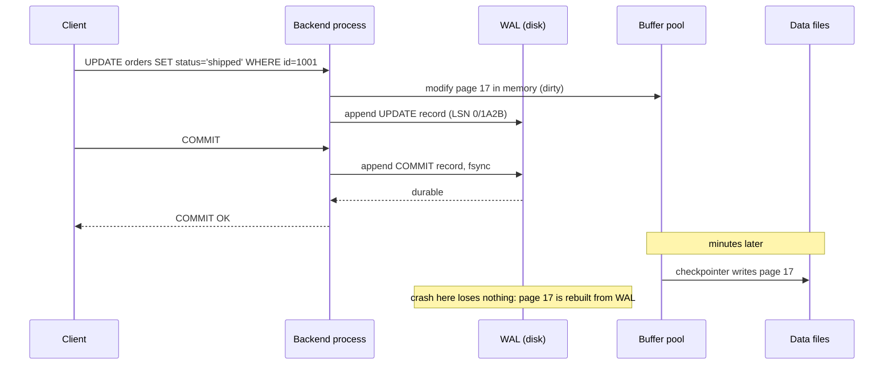

A query that touches 200 rows takes 2 ms one minute and 400 ms the next, with the same plan. A `COMMIT` of a single-row `UPDATE` sometimes stalls for 30 ms. A machine loses power mid-transaction and comes back with every committed row intact and every uncommitted row gone. None of these is explained by SQL. They are explained by the storage engine: the layer that turns rows into bytes on disk, decides which bytes are in memory, and orders its writes so that a crash at any instant is recoverable.

You do not need to read the Postgres source to reason about it. You need four mechanisms: the page, the buffer pool, the write-ahead log, and the checkpoint. Everything else in this lesson is those four interacting.

## Pages: the unit of everything

Postgres stores a table as a *heap file*: a sequence of 8 KiB pages, numbered from zero, with no ordering between rows. Every I/O the engine does is a whole page. Every buffer in memory is a page. Every lock on physical storage is a page lock. If you take one thing from this lesson, take that: the cost of a query is roughly the number of pages it touches.

A page has three regions:

```text
+-----------------------------------------------------------+
| page header (24 B): LSN of last change, free-space ptrs   |
| line pointers: [ (offset, len) ] growing downward         |
|           ...free space...                                |
| tuples (rows): growing upward from the end of the page    |
+-----------------------------------------------------------+
```

The **line pointer** array is why a row's physical address is `(page, item)`, called a *ctid* (`(1234, 7)` means page 1234, item 7). Indexes point at ctids, not at byte offsets, so the engine can move a tuple within a page during compaction without touching any index.

Each tuple carries a 23-byte header before your columns: the inserting and deleting transaction ids (`xmin`, `xmax`), a null bitmap, and flag bits. That header is the physical substrate of [MVCC](/learn/databases/relational-fundamentals/mvcc-and-locking): an `UPDATE` does not overwrite a tuple, it writes a new tuple with a new `xmin` and stamps the old one's `xmax`. Two consequences follow immediately. A table of 100-byte rows is really a table of 123-byte rows plus a 4-byte line pointer each, so about 60 rows fit per page rather than 80. And a heavily updated table accumulates dead tuples that occupy page space until `VACUUM` reclaims it.

You can see the physical layout directly:

```sql
SELECT ctid, xmin, xmax, id, status
FROM orders
WHERE id IN (1001, 1002);
```

```text
  ctid   |  xmin  | xmax |  id  | status
---------+--------+------+------+---------
 (17,3)  | 481902 |    0 | 1001 | shipped
 (17,4)  | 481955 |    0 | 1002 | pending
```

Rows 1001 and 1002 live on the same page, so a query fetching both costs one page read, not two. That locality is accidental for a heap (it happens because they were inserted close in time), and it is the reason `CLUSTER` and `pg_repack` exist: they rewrite the heap in index order so a range scan touches contiguous pages.

A tuple cannot span pages. A column value larger than roughly 2 KiB is compressed and, if still too big, moved out of line into a **TOAST** table and replaced with a pointer. Selecting that column costs extra page reads; selecting other columns from the same row does not. This is why a `SELECT *` on a table with a large `jsonb` column is far slower than selecting the three columns you need, even with the same plan.

## The buffer pool

Disk is slow and memory is finite, so the engine keeps a cache of pages in shared memory: the **buffer pool**, sized by `shared_buffers`. Every page read goes through it. When a query needs page 1234 of `orders`, the engine hashes `(relation, fork, 1234)` into a buffer lookup table. A hit costs a hash probe and a pin on the buffer, well under a microsecond. A miss costs a `read()` syscall, which may itself be served from the operating system's page cache (tens of microseconds) or go to the SSD (about 100 microseconds) or a network disk (a millisecond or more).

That double caching is a Postgres peculiarity. `shared_buffers` sits above the kernel page cache rather than replacing it, so a page can be in memory twice. The conventional starting point of 25% of RAM for `shared_buffers` exists because the other 75% is doing useful work as the OS cache. MySQL's InnoDB uses `O_DIRECT` by default and bypasses the OS cache, so its buffer pool is set to 70–80% of RAM instead.

Eviction uses **clock sweep**, an approximation of LRU that avoids a global lock. Each buffer has a small usage counter, incremented on access (capped at 5). A clock hand walks the buffer array; each buffer it passes has its counter decremented, and the first buffer it finds at zero is evicted. A page you touched once gets one chance; a page touched five times survives five sweeps. Sequential scans of large tables deliberately use a small ring of buffers so a one-off report does not flush your working set.

If the evicted buffer is **dirty** (modified since it was read), it must be written to disk first. That write is not what makes your commit durable; the WAL does that. It is housekeeping, and a background writer does most of it ahead of time so that a foreground query rarely has to evict a dirty page itself.

`EXPLAIN (ANALYZE, BUFFERS)` shows you the pool at work:

```sql
EXPLAIN (ANALYZE, BUFFERS)
SELECT * FROM orders WHERE customer_id = 42 AND created_at > now() - interval '30 days';
```

```text
Index Scan using orders_customer_created_idx on orders
    (cost=0.43..58.21 rows=14 width=96) (actual time=0.031..0.412 rows=17 loops=1)
  Index Cond: ((customer_id = 42) AND (created_at > (now() - '30 days'::interval)))
  Buffers: shared hit=9 read=12
Planning:
  Buffers: shared hit=3
Execution Time: 0.451 ms
```

`shared hit=9 read=12` means 21 pages were touched: 9 were already in the pool, 12 had to be read from the OS (or disk). Run it again and you will see `hit=21 read=0` with a lower time. The variance you were chasing at the top of this lesson is usually here: the same plan, a different hit ratio. Whole-database hit ratio is visible in `pg_statio_user_tables` and, from Postgres 16, `pg_stat_io`:

```sql
SELECT relname,
       heap_blks_hit,
       heap_blks_read,
       round(100.0 * heap_blks_hit / nullif(heap_blks_hit + heap_blks_read, 0), 1) AS hit_pct
FROM pg_statio_user_tables
ORDER BY heap_blks_read DESC
LIMIT 5;
```

A production OLTP database should show a hit ratio above 99% on its hot tables. Below 95% and you are either short of memory or a report is scanning something it should not.

## The write-ahead log

Here is the durability problem. A transaction updates three rows on three different pages. Making that durable by writing all three pages to disk means three random 8 KiB writes and three `fsync` calls, and if the power fails after the second, the table is half-updated with no record of what the third write should have been.

The write-ahead log replaces that with one rule: **before any modified page reaches disk, a record describing the modification must be on disk in the log**. The log is append-only, so all the random page writes turn into one sequential stream. `COMMIT` then means "append a commit record and `fsync` the log", which on an SSD is a few hundred microseconds and on a cloud block device is closer to a millisecond. The dirty pages themselves can stay in memory for minutes.

```viz
{"type": "system", "scenario": "wal", "title": "A commit through the write-ahead log",
 "caption": "Each change is appended to the log and fsynced before the transaction is acknowledged; the modified data pages stay dirty in the buffer pool and are written later by the checkpointer. On crash, the engine replays the log from the last checkpoint."}
```

Every WAL record has a **log sequence number** (LSN), a 64-bit byte position in the log, displayed as `0/1A2B3C4D`. Each page header stores the LSN of the last record that modified it. That single field lets recovery decide, page by page, whether a log record has already been applied: if the page's LSN is at or beyond the record's LSN, skip it. The LSN is also the unit of [replication](/learn/databases/storage-and-scale/replication): a replica is "at" an LSN, and lag is a difference of two LSNs in bytes.

Two details separate people who have read the docs from people who have run the system.

**Full-page writes.** An 8 KiB page write is not atomic on most disks; power can fail after 4 KiB. A page with the first half new and the second half old is garbage that redo cannot fix from a small delta record. Postgres therefore logs the *entire page* the first time it is modified after each checkpoint, and only deltas after that. This is why WAL volume spikes right after a checkpoint and why `checkpoint_timeout` is a trade-off rather than a free lunch: more frequent checkpoints mean more full-page images.

**Group commit.** If 200 transactions commit within the same millisecond, the engine does not do 200 `fsync` calls. Whoever reaches the flush first flushes everything written so far; the others find their records already durable when they wake. This is why commit throughput on a single disk can reach tens of thousands per second even though a single `fsync` takes a millisecond: the latency of one commit and the throughput of many commits are decoupled. `commit_delay` lets you deliberately wait a few microseconds to batch more, which is almost never worth it on SSDs.

`synchronous_commit = off` removes the `fsync` from the commit path entirely. The transaction is still atomic and consistent; it just might be lost if the server crashes in the next few hundred milliseconds. For a click-tracking table that is a fine trade. For an orders table it is not, and the setting can be changed per transaction:

```sql
SET LOCAL synchronous_commit = off;   -- this transaction only
INSERT INTO page_views (user_id, path) VALUES (42, '/learn/databases');
COMMIT;
```

## Checkpoints

The WAL cannot grow forever, and recovery cannot replay a week of log. A **checkpoint** writes every dirty page in the buffer pool to disk and records in the log that "everything before LSN X is on disk". After that, log before X is no longer needed for crash recovery and can be recycled or archived.

Checkpoints happen every `checkpoint_timeout` (default 5 minutes) or when `max_wal_size` (default 1 GiB) of log has accumulated, whichever is first. Writing gigabytes of dirty pages in one burst would starve foreground queries of disk bandwidth, so the checkpointer spreads the writes over `checkpoint_completion_target` (default 0.9) of the interval. A checkpoint that finishes early is fine; one that is triggered by `max_wal_size` before the previous one finished is a sign you are writing faster than the disk can absorb, and Postgres logs a warning suggesting you raise `max_wal_size`.

```sql
SELECT checkpoints_timed,
       checkpoints_req,          -- forced by max_wal_size; should be rare
       checkpoint_write_time,    -- ms spent writing
       buffers_checkpoint,       -- pages written by checkpoints
       buffers_backend           -- pages written by foreground queries (bad)
FROM pg_stat_bgwriter;
```

A healthy shape is `checkpoints_timed` much greater than `checkpoints_req`, and `buffers_backend` small relative to `buffers_checkpoint`. When `buffers_backend` climbs, foreground queries are evicting dirty pages themselves, and that is the 30 ms stall on a single-row `UPDATE`: the query needed a buffer, the only candidates were dirty, and it had to write one before it could proceed. In Postgres 17 these columns moved to `pg_stat_checkpointer` and `pg_stat_io`, but the diagnosis is the same.

## Crash recovery

Now the power fails. At restart, the engine finds the last completed checkpoint record in the log and replays every record after it, in order, against the pages on disk. Records for transactions that later committed are applied; the effects of transactions with no commit record are simply never made visible, because MVCC already treats their tuples as belonging to an aborted transaction id. There is no undo phase in Postgres, which is one reason its recovery is simpler than InnoDB's, where in-place updates require rolling back uncommitted changes from the undo log.

The recovery time is proportional to the WAL written since the last checkpoint, which is what `checkpoint_timeout` and `max_wal_size` really control: not durability, but how long you are down after a crash. A 5-minute interval on a busy system might mean 20–60 seconds of replay. Set it to an hour and recovery could take many minutes.



Watch the order in the diagram. The client hears "OK" after the WAL `fsync` and before the data page is written. That gap, sometimes minutes wide, is normal and safe. The invariant is only that the log reaches disk first.

## The contrast: log-structured engines

Postgres and InnoDB are *update-in-place* engines: the B-tree and heap pages are the primary copy, and the log is a recovery aid. RocksDB, Cassandra and LevelDB invert that. Writes go to an in-memory sorted table (memtable) plus a log for durability; when the memtable fills, it is flushed as an immutable sorted file (an SSTable). Reads must check the memtable and then each level of SSTables, newest first, and background **compaction** merges files to bound the number of places a key can hide.

```viz
{"type": "system", "scenario": "lsm-tree", "title": "Writes and reads in a log-structured merge tree",
 "caption": "Writes land in the memtable and are flushed to sorted files; reads check newer levels first; compaction merges levels in the background. Compare the write path with the WAL animation above: both start with a sequential log, but here the log-structured files are the database, not a recovery aid."}
```

The trade is write amplification against read amplification. A B-tree rewrites a whole 8 KiB page to change 100 bytes (and logs a full page image after a checkpoint); an LSM writes the 100 bytes once to the log and once per compaction level it passes through, sequentially. That makes LSMs win on write-heavy workloads and on SSDs where random writes wear the device. B-trees win on point reads and range scans that must be fast the first time, and on workloads where the data fits in memory anyway. The full comparison is in [B-tree vs LSM](/learn/advanced-data-structures/log-structured-and-disk-structures/b-tree-vs-lsm), and [wide-column stores](/learn/databases/nosql-and-specialised/wide-column-stores) shows the engine in a distributed setting.

## What you can now diagnose

| Symptom | Mechanism | Where to look |
|---|---|---|
| Same query, variable latency | Buffer pool miss vs hit | `EXPLAIN (ANALYZE, BUFFERS)`: `read` vs `hit` |
| Periodic latency spike every 5 minutes | Checkpoint I/O burst | `pg_stat_bgwriter`, `log_checkpoints = on` |
| Single-row write stalls | Backend evicting dirty pages | `buffers_backend` rising |
| WAL disk fills | Checkpoints too infrequent, or a replication slot holding WAL | `pg_stat_replication`, `max_wal_size` |
| Table 3x larger than its rows | Dead tuples, bloat | `pg_stat_user_tables.n_dead_tup`, `VACUUM` |
| `SELECT *` slow, `SELECT id` fast | TOAST detoasting large columns | Column sizes, `pg_column_size()` |

The engine is not a black box. Each of these is a page, a buffer, a log record or a checkpoint doing exactly what it was designed to do, and each has a catalogue view that shows it doing so. [Write-ahead logs](/learn/advanced-data-structures/log-structured-and-disk-structures/write-ahead-logs) goes deeper into the data structure; [filesystems and storage](/learn/systems/operating-systems/filesystems-and-storage) covers what `fsync` actually promises at the kernel and device level, which is less than most people assume.

## Senior signals

- You describe a query's cost in **pages touched**, and you read `Buffers: shared hit/read` in `EXPLAIN` before you read the timing.
- You can say why `COMMIT` is fast: it is one sequential `fsync` of the WAL, not a write of the modified pages, and group commit means throughput is not bounded by `fsync` latency.
- You know a checkpoint trades recovery time against WAL volume and I/O bursts, and that **full-page writes** are why WAL spikes right after one.
- You set `synchronous_commit = off` per transaction for data you can afford to lose, never globally by accident.
- You explain `shared_buffers` at 25% of RAM as a consequence of double caching with the OS, and you know InnoDB and RocksDB make a different choice.
- You can explain when an LSM engine's write amplification beats a B-tree's, and you do not claim one is simply faster.

## Check yourself

```quiz
- q: >-
    A single-row UPDATE that normally takes 1 ms occasionally takes 30 ms with the same plan and no lock waits. pg_stat_bgwriter shows buffers_backend growing steadily. What is the most likely mechanism?
  options: ["The row's large column was TOASTed and had to be detoasted on update", "The WAL fsync stalled because a checkpoint was saturating the disk", "The backend had to write out a dirty page before reusing the buffer", "A checkpoint was in progress and held the page lock for the whole write"]
  answer: 2
  explanation: >-
    buffers_backend counts pages written by foreground processes, which happens when a backend needs a free buffer and the candidates are dirty. That write is the stall. Checkpoints do not block writers; a slow WAL fsync would affect every commit, not occasional ones; TOAST affects reads of large columns.
- q: >-
    Why does Postgres log the entire 8 KiB page the first time it is modified after a checkpoint, rather than only the changed bytes?
  options: ["A crash can tear a page write, and a small delta cannot repair a torn page", "A full image compresses better than deltas, so WAL volume goes down", "The buffer pool does not track which bytes changed within a page", "Replicas need whole pages because they cannot apply byte-level deltas"]
  answer: 0
  explanation: >-
    Disks do not guarantee atomic 8 KiB writes. If a crash tears a page, redo needs a full image to reconstruct it; after the first full-page write in a checkpoint interval, deltas are safe because recovery will first restore the full image. Full-page writes increase, not reduce, WAL volume, and replicas apply the same delta records the primary's recovery does.
- q: >-
    You raise checkpoint_timeout from 5 minutes to 60 minutes on a write-heavy database. Which consequence should you expect?
  options: ["WAL volume rises, since pages are logged in full more often", "The buffer pool hit ratio drops, since dirty pages crowd it out", "Crash recovery takes longer, because more WAL must be replayed first", "Commits become less durable, since pages reach disk less often"]
  answer: 2
  explanation: >-
    Durability comes from the WAL fsync at commit, not from checkpoints. Longer intervals mean fewer full-page writes and smoother I/O, but everything since the last checkpoint must be replayed after a crash, so recovery time grows. The hit ratio is unrelated.
- q: >-
    EXPLAIN (ANALYZE, BUFFERS) on a query shows Buffers shared hit=2 read=480 and 40 ms; running it again shows hit=482 read=0 and 3 ms. What does this tell you?
  options: ["The second run chose a better plan once the first had warmed statistics", "Statistics were stale on the first run and refreshed by the query itself", "The first run hit a cold cache; the second found every page in the pool", "The first run paid for planning, which the second reused from a plan cache"]
  answer: 2
  explanation: >-
    Same plan, same page count; the only difference is where the pages came from, and planning cost is far below 37 ms. If this query's pages are regularly evicted between runs, users see the 40 ms figure, and the fix is more memory, a smaller working set (fewer pages per query, e.g. a covering index), or accepting the cold cost.
- q: >-
    Which workload favours a log-structured (LSM) engine over a B-tree engine like Postgres?
  options: ["Read-mostly traffic whose whole working set fits comfortably in memory", "Point reads and range scans that must be fast on the very first try", "Sustained heavy writes on SSDs, where random page rewrites are costly", "Complex multi-way joins over tables with many secondary indexes"]
  answer: 2
  explanation: >-
    LSMs turn every write into sequential appends plus background compaction, which is what a write-heavy SSD workload wants. B-trees win on reads that must be fast the first time, on join-heavy relational workloads, and when the data is in memory anyway so write amplification barely matters.
```
