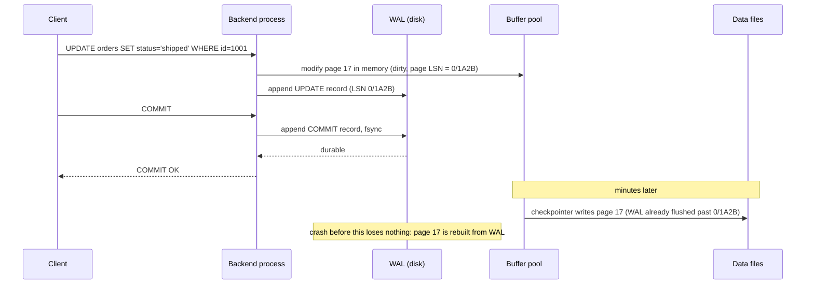

A query that touches 12,000 pages takes 8 ms one minute and 53 ms the next, with the same plan. A single-row `UPDATE` right after a checkpoint writes 33 KB of log instead of 300 bytes. A machine loses power mid-transaction and comes back with every committed row intact and every uncommitted row gone. None of these is explained by SQL. They are explained by the storage engine: the layer that turns rows into bytes on disk, decides which bytes stay in memory, and orders its writes so that a crash at any instant is recoverable.

You need four mechanisms to reason about it: the page, the buffer pool, the write-ahead log and the checkpoint. This lesson opens each on PostgreSQL 17 with `pageinspect`, `pg_buffercache`, `pg_walinspect` and `pg_controldata`, contrasts InnoDB's clustered design, and measures what each mechanism costs. The lab tables are the ones from the [relational fundamentals module](/learn/databases/relational-fundamentals/the-relational-model): 2 million orders (130 MB) and 4 million order lines (224 MB), with `shared_buffers` at its default of 128 MB.

## Under the hood: pages, the unit of everything

Postgres stores a table as a **heap file**: a sequence of 8 KiB pages with no ordering between rows. Every I/O is a whole page, every buffer is a page, and the cost of a query is roughly the number of pages it touches. A page has three regions:

```text
+-----------------------------------------------------------+
| page header (24 B): LSN of last change, lower, upper, ... |
| line pointers, 4 B each, growing forwards  -> lower       |
|           ...free space...                                |
| upper <- tuples, growing backwards from the end           |
+-----------------------------------------------------------+
```

On the first page of `orders`, `page_header()` reports `lower = 504` and `upper = 512`: 24 bytes of header plus 120 line pointers of 4 bytes, and 120 tuples of 64 bytes each (a 24-byte tuple header, 36 bytes of data, padded to an 8-byte boundary) filling the 7,680 bytes from 512 to 8,192. Eight bytes are free. That arithmetic generalises:

$$\text{rows per page} = \left\lfloor \frac{8192 - 24 - \text{reserved}}{\text{align}_8(24 + \text{data}) + 4} \right\rfloor$$

where `reserved` is the free space `fillfactor` keeps back for updates (819 bytes at 90). For `orders` it gives 120 rows and 16,667 pages for 2 million rows, which is exactly `pg_class.relpages`; at `fillfactor = 90` it predicts 108 rows and 18,519 pages, and a copy of the table created with that setting measured exactly 18,519.

The **line pointer** array is why a row's physical address is `(page, item)`, the `ctid`. Indexes point at `ctid`s, not byte offsets, so vacuum can compact a page, moving tuples, without touching an index, and a heap-only update can leave a redirect line pointer in place of a dead version (traced in [MVCC and locking](/learn/databases/relational-fundamentals/mvcc-and-locking)).

**A tuple cannot span pages.** A row wider than about 2 KiB (`TOAST_TUPLE_THRESHOLD`, a quarter of a page) has its large values compressed and, if still too big, moved into a separate **TOAST** table in chunks of up to 1,996 bytes, leaving an 18-byte pointer behind. Measured on a table of 20,000 documents with a 9.9 KB incompressible `body`:

| Query | Heap | TOAST | Buffers | Time |
|---|---|---|---|---|
| `SELECT sum(length(title)) FROM docs` | 1.2 MB | untouched | 148 | 1.3 ms |
| `SELECT sum(length(body)) FROM docs` | 1.2 MB | 195 MB, 5 chunks per value | 80,148 | 457 ms |

The heap is tiny because the bodies live elsewhere; selecting them costs 340 times more. This is why `SELECT *` on a table with a large `jsonb` or `text` column is far slower than selecting the three columns you need with the same plan.

## Heap versus clustered: Postgres and InnoDB

InnoDB (MySQL) makes the opposite layout choice. The table *is* its primary-key B+tree: leaf pages (16 KiB by default) hold the full rows in primary-key order. A secondary index stores the indexed columns plus the **primary key** instead of a physical address. Trace a lookup by a secondary column for a 100-million-row table, where each B+tree is three or four levels deep:

| Step | Postgres (heap + TID) | InnoDB (clustered) |
|---|---|---|
| 1 | Descend the secondary index: about 4 pages | Descend the secondary index: about 4 pages |
| 2 | Follow the TID: 1 heap page | Take the primary key from the entry, descend the clustered index: about 4 pages |
| Total pages | about 5 | about 8 |
| Range scan by primary key | Rows scattered over the heap unless recently `CLUSTER`ed | Rows contiguous in leaf order |

The upper levels are cached in both engines, so the real difference is one heap-page read against one clustered-leaf read, plus InnoDB's extra descent in CPU. The structural consequences matter more:

| | Postgres heap | InnoDB clustered index |
|---|---|---|
| Primary-key range scan | Random heap pages unless the table is physically ordered | Sequential leaf pages |
| Secondary-index lookup | Index then one heap page | Index then a second B+tree descent |
| Wide primary key | Costs only the primary-key index | Copied into every secondary index |
| Random primary keys (UUIDv4) | Hurt the primary-key index | Hurt the whole table: rows land in random leaves, which split |
| Update of an indexed column | New tuple version; every index gets an entry unless HOT | In place, old value to the undo log; only indexes on changed columns are touched |
| Old versions | Dead tuples in the heap, removed by vacuum | Undo log, removed by purge |

InnoDB's choice is why MySQL schemas care so much about short, ascending primary keys, and why a Postgres table's physical order drifts away from any index over time.

## The buffer pool

Every page read goes through the buffer pool, `shared_buffers` in size. The engine hashes `(relation, fork, block)` into a lookup table; a hit costs a hash probe and a pin, well under a microsecond. A miss costs a `read()` system call, which the operating system may serve from its own page cache or from the device.

That difference is measurable. A bitmap scan touching 12,261 pages of `orders`, run with none of them in the buffer pool (all served from the OS page cache), took **52.7 ms**; the same query immediately again, all 12,261 now hits, took **8.3 ms**. That is about 3.6 µs extra per page for the system call and copy. Had the pages come from an NVMe drive at roughly 100 µs per random read, the same query would have taken over a second; from network block storage, several. Same plan, same page count, three orders of magnitude of latency: the variance at the top of this lesson.

Postgres caches twice. `shared_buffers` sits above the kernel page cache instead of replacing it, so a page can be in memory in both. The conventional 25% of RAM for `shared_buffers` exists because the other 75% is doing useful work as OS cache. InnoDB is normally run with `innodb_flush_method = O_DIRECT` (the default since MySQL 8.4), bypassing the OS cache, and is typically given 70–80% of RAM for `innodb_buffer_pool_size`.

### Eviction, and why a big scan does not flush the pool

**Eviction is clock sweep**, an approximation of LRU without a global lock. Each buffer has a usage count, incremented on access and capped at 5. A clock hand walks the buffer array, decrementing counts, and evicts the first unpinned buffer it finds at zero. A page touched once survives one pass of the hand; a page touched five times survives five.

**Large sequential scans bypass the pool.** A scan of a table bigger than a quarter of `shared_buffers` uses a private **ring** of 32 buffers (256 kB), recycling them instead of evicting everyone else's pages. After `SELECT count(*) FROM order_lines` read all 28,649 pages of that 224 MB table, `pg_buffercache` showed exactly 32 of them in the pool, while the 36-page `products` table, scanned right after, was cached entirely:

```sql
SELECT c.relname, count(*) AS buffers, pg_size_pretty(count(*) * 8192) AS cached
FROM pg_buffercache b JOIN pg_class c ON b.relfilenode = pg_relation_filenode(c.oid)
WHERE c.relname IN ('order_lines', 'products') GROUP BY c.relname;
--    relname   | buffers | cached
--  products    |      36 | 288 kB
--  order_lines |      32 | 256 kB
```

A nightly report that scans a large table therefore does not flush your working set. A report that walks a large *index* does, since index scans do not use the ring.

If the buffer chosen for eviction is **dirty**, it must be written first. Most such writes are done ahead of time by the checkpointer and the background writer. When a query has to do one itself, it stalls on a write it did not cause; Postgres 16 and later count these in `pg_stat_io` under `backend_type = 'client backend'`, `writes`.

## The write-ahead log

The durability problem: a transaction changes three rows on three pages. Writing those pages at commit means three random 8 KiB writes, and a power cut after the second leaves a half-applied transaction with no record of the third. The write-ahead log replaces that with one rule: **before a modified page reaches disk, the log record describing the change must be on disk**. `COMMIT` becomes "append a commit record and flush the log"; the pages can stay dirty in memory for minutes.

```viz
{"type": "system", "scenario": "wal", "title": "A commit through the write-ahead log",
 "caption": "Each change is appended to the log and fsynced before the transaction is acknowledged; the modified data pages stay dirty in the buffer pool and are written later by the checkpointer. On crash, the engine replays the log from the last checkpoint."}
```

Every record has a **log sequence number** (LSN), a 64-bit byte position in the log shown as `4/2D428970`. Every page header stores the LSN of the last record that changed it, which is how the buffer manager enforces the rule (flush WAL up to the page's LSN before writing the page) and how recovery decides whether a record still needs replaying. The LSN is also the unit of [replication](/learn/databases/storage-and-scale/replication): a replica is "at" an LSN, and lag is a difference of LSNs.

The [transactions lesson](/learn/databases/relational-fundamentals/transactions-and-acid) traced the records one transfer writes: two 72-byte `HOT_UPDATE` records and a 34-byte `COMMIT`, 296 bytes in all. The flush at commit costs about 1.4 ms on this lab's virtual disk, and **group commit** amortises it: 16 concurrent clients averaged 7.9 commits per flush.

**Full-page writes.** An 8 KiB page write is not atomic on most devices; power can fail after 4 KiB, leaving a torn page that a small redo record cannot repair. So the first change to each page after a checkpoint logs the *whole page* (`full_page_writes = on`). The cost is large and measurable. Updating 9,950 random rows of a 1-million-row table immediately after a `CHECKPOINT`:

| Run | WAL written |
|---|---|
| First update after the checkpoint | 56 MB |
| Same rows again, no checkpoint between | 2.3 MB |
| First update after a checkpoint, `wal_compression = lz4` (or `pglz`) | 13 MB |

Twenty-four times the log for the same logical change, because the rows were spread over about 4,000 heap pages plus their index pages, each needing an image. Compression recovers most of it for a little CPU. This is also why random-key inserts are expensive (the [indexes lesson](/learn/databases/relational-fundamentals/indexes) measured 32 MB of page images for 100,000 UUIDv4 inserts) and why the checkpoint interval is a trade-off.

## Checkpoints

The log cannot grow forever and recovery cannot replay a week of it. A **checkpoint** writes every dirty buffer to disk and records the position from which recovery would have to start, the **REDO** point. Checkpoints start every `checkpoint_timeout` (5 minutes) or when `max_wal_size` (1 GB) of log has accumulated since the last one, and the checkpointer spreads its writes over `checkpoint_completion_target` (0.9) of the interval to avoid an I/O spike. `pg_controldata` shows the result on the lab cluster:

```text
Latest checkpoint location:           4/4B135A10
Latest checkpoint's REDO location:    4/2D428970
Latest checkpoint's full_page_writes: on
Data page checksum version:           0
wal_log_hints setting:                off
```

The REDO location is 477 MB of WAL *before* the checkpoint record: the checkpoint began at the REDO point, spent its interval writing dirty pages while the workload kept logging, and wrote its record when it finished. A crash now would replay from `4/2D428970`.

Postgres 17 moved checkpoint statistics from `pg_stat_bgwriter` into `pg_stat_checkpointer`:

```sql
SELECT num_timed, num_requested, write_time, sync_time, buffers_written FROM pg_stat_checkpointer;
--  num_timed | num_requested | write_time | sync_time | buffers_written
--        483 |            40 |    2242522 |      8633 |          189612
```

`num_requested` counts checkpoints forced early by `max_wal_size` (plus manual `CHECKPOINT`s, of which the lab ran many). If requested checkpoints dominate in production, WAL is being generated faster than `max_wal_size` allows per interval: raise it, or every checkpoint arrives early and starts a new wave of full-page images.

| `checkpoint_timeout` / `max_wal_size` | Full-page images | I/O pattern | Crash recovery replays |
|---|---|---|---|
| Short (1 min, 256 MB) | Many: every hot page re-imaged each minute | Frequent smaller bursts | Little WAL: seconds |
| Default (5 min, 1 GB) | Moderate | Spread over 4.5 minutes | Up to about 1 GB plus the spread |
| Long (30 min, 16 GB) | Few | Smooth | Up to many GB: minutes |

## Crash recovery

After a power cut, the startup process reads `pg_control`, finds the REDO location, and replays every WAL record from there to the end of valid WAL, in order:

1. Read the next record; it names the pages it touches.
2. For each page, if the record carries a full-page image, restore the image.
3. Otherwise read the page and compare its LSN with the record's. If the page LSN is at or past the record, the change is already on disk: skip. If not, apply the change and set the page LSN.
4. Stop at the first record whose checksum fails or that is incomplete: that is the torn end of the log, and everything after it was never acknowledged.

Transactions with no commit record are never undone. Their tuples carry an `xmin` whose status in `pg_xact` is not committed, so MVCC treats them as invisible and vacuum later removes them. Postgres has no undo phase; InnoDB, which updates in place, must roll uncommitted changes back from its undo log after redo, which is the pattern the ARIES-style exercise in the transactions lesson implements.

Recovery time is proportional to the WAL since the REDO point, bounded by roughly `max_wal_size` plus whatever accumulated while the last checkpoint was spreading its writes (477 MB in the lab snapshot above). Replay is single-threaded, and its speed depends on how many records touch pages that are not in memory. A record carrying a full-page image needs no read at all; a delta record for an uncached page needs one random read, about 100 µs on local NVMe. WAL dominated by page images or by a small hot set of pages replays at the speed of sequential log reading; WAL made of small updates scattered across a table much larger than memory replays at the device's random-read rate, which is why Postgres 15 added `recovery_prefetch` to read ahead in the WAL and prefetch the pages it will need. That is what `checkpoint_timeout` and `max_wal_size` really control, not durability, which the commit flush already provided.



## The contrast: log-structured engines

Postgres and InnoDB update pages in place; the log is a recovery aid. RocksDB, Cassandra and LevelDB invert that: writes go to a memtable plus a log, full memtables are flushed as immutable sorted files, and background compaction merges them.

```viz
{"type": "system", "scenario": "lsm-tree", "title": "Writes and reads in a log-structured merge tree",
 "caption": "Writes land in the memtable and are flushed to sorted files; reads check newer levels first; compaction merges levels in the background. Compare the write path with the WAL animation above: both start with a sequential log, but here the log-structured files are the database, not a recovery aid."}
```

A B-tree rewrites an 8 KiB page (and, after a checkpoint, logs a full image of it) to change 100 bytes; an LSM tree writes those 100 bytes to its log and then once per compaction level, sequentially. LSMs win on sustained writes and on SSD endurance; B-trees win on point reads and range scans that must be fast the first time. [LSM trees and SSTables](/learn/advanced-data-structures/log-structured-and-disk-structures/lsm-trees-and-sstables) traces the compaction arithmetic and [B-tree vs LSM](/learn/advanced-data-structures/log-structured-and-disk-structures/b-tree-vs-lsm) compares the amplification.

| | B-tree heap (Postgres) | Clustered B-tree (InnoDB) | LSM (RocksDB, Cassandra) |
|---|---|---|---|
| Write path | WAL + dirty page, page rewritten at checkpoint | Redo log + dirty page, undo for old versions | WAL + memtable, sequential files |
| Write amplification | Page rewrites and full-page images | Page rewrites, doublewrite buffer | Compaction: roughly 10–30 in leveled mode |
| Point read | Index descent + heap page | Clustered descent | Memtable, then one candidate per level via bloom filters |
| Space overhead | Dead tuples until vacuum | Undo until purge | Obsolete versions until compaction |

## Failure modes

| Symptom | Diagnosis | Fix |
|---|---|---|
| Same plan, latency varies ten-fold | `EXPLAIN (ANALYZE, BUFFERS)` shows `read` instead of `hit`; the working set exceeds `shared_buffers` plus OS cache | More memory, fewer pages per query (covering indexes, narrower rows), or accept the cold cost |
| WAL volume and replica lag spike every few minutes | Full-page images after each checkpoint, worse with frequent requested checkpoints | Raise `max_wal_size`; enable `wal_compression`; avoid random-key write patterns |
| Occasional stalls on single-row writes | Backends evicting dirty buffers themselves (`pg_stat_io` client-backend writes) | Tune the background writer; more `shared_buffers`; faster storage |
| `SELECT *` slow while narrow selects are fast | Detoasting large values: extra buffers on the TOAST relation | Select only needed columns; move large blobs to their own table or object storage |
| Crash recovery takes many minutes | Huge WAL distance from the REDO point because of very long checkpoint intervals | Shorter `checkpoint_timeout`; faster storage; a hot standby to fail over to instead of waiting |
| `pg_rewind` refuses after a failover | Neither data checksums nor `wal_log_hints` were enabled (the lab cluster has both off) | Enable `wal_log_hints` or initialise with checksums before you need them |

## Interviewer follow-ups

**"Why does COMMIT not write the table?"** Model answer: durability comes from flushing the WAL, one sequential write that group commit shares between transactions; the dirty pages are written later by checkpoints and can be rebuilt from the log after a crash. Common wrong answer: "Postgres writes the rows and then the log", which inverts the rule.

**"Why does WAL volume spike after a checkpoint?"** Model answer: full-page writes: the first change to each page after a checkpoint logs an image of the page, so torn pages can be repaired; the lab saw 56 MB against 2.3 MB for the same updates. Common wrong answer: "the checkpoint itself writes to the WAL", when the checkpoint record is tiny.

**"When would you choose InnoDB's clustered layout over a heap?"** Model answer: when most access is by primary key or primary-key ranges, keys are short and ascending, and you want rows physically ordered; the heap wins when there are many secondary indexes, wide or random keys, or frequent updates to indexed columns. Common wrong answer: "clustered is always faster".

**"How long will crash recovery take?"** Model answer: proportional to the WAL between the REDO point and the end of the log, bounded by `max_wal_size` plus checkpoint spread, at a replay speed set by how many replayed pages must be read from disk. Common wrong answer: "it depends on the database size".

## What mid-level engineers get wrong

- **Reading latency without reading buffers.** The same plan can be 8 ms or a second depending on where the pages come from.
- **Treating checkpoints as a durability knob.** Durability is the commit flush; checkpoints trade WAL volume against recovery time.
- **Sizing `shared_buffers` like InnoDB's buffer pool.** Postgres relies on the OS cache too.
- **Putting large blobs in hot rows** and paying for TOAST on every `SELECT *`.
- **Assuming a big report flushes the cache.** Sequential scans use a 256 kB ring; index-driven reports are the ones that do.
- **Leaving `wal_log_hints` and checksums off**, then discovering `pg_rewind` cannot rejoin the old primary.

## Exercise

```exercise
id: heap-page-capacity
title: How many rows fit on a heap page?
prompt: |
  Implement `heap_layout(data_bytes, fillfactor, n_rows)` for an 8 KiB
  Postgres heap page.

  - A tuple is a 24-byte header plus `data_bytes`, rounded up to a
    multiple of 8.
  - Each tuple also needs a 4-byte line pointer.
  - The page has 8192 - 24 = 8168 bytes after its header.
  - `fillfactor` reserves `floor(8192 * (100 - fillfactor) / 100)` bytes
    for future updates.
  - Rows per page = `floor((8168 - reserved) / (tuple + 4))`, but never
    more than 291 (Postgres's MaxHeapTuplesPerPage for 8 KiB pages).

  Return `{"tuple_bytes": t, "rows_per_page": r, "pages": p}` where `p`
  is the number of pages needed for `n_rows` rows (round up; 0 rows need
  0 pages). Use integer arithmetic.
languages: [python, javascript]
entry: heap_layout
starter:
  python: |
    def heap_layout(data_bytes, fillfactor, n_rows):
        return {"tuple_bytes": 0, "rows_per_page": 0, "pages": 0}
  javascript: |
    function heap_layout(data_bytes, fillfactor, n_rows) {
      return { tuple_bytes: 0, rows_per_page: 0, pages: 0 };
    }
tests:
  - args: [36, 100, 2000000]
    expected: {"tuple_bytes": 64, "rows_per_page": 120, "pages": 16667}
    label: the lab orders table, matching relpages
  - args: [36, 90, 2000000]
    expected: {"tuple_bytes": 64, "rows_per_page": 108, "pages": 18519}
    label: fillfactor 90 leaves room for HOT updates
  - args: [100, 100, 1000]
    expected: {"tuple_bytes": 128, "rows_per_page": 61, "pages": 17}
    label: 100-byte rows
  - args: [0, 100, 10]
    expected: {"tuple_bytes": 24, "rows_per_page": 291, "pages": 1}
    label: empty rows hit the line-pointer cap
  - args: [2000, 100, 5]
    expected: {"tuple_bytes": 2024, "rows_per_page": 4, "pages": 2}
    hidden: true
    label: wide rows near the TOAST threshold
  - args: [16, 50, 0]
    expected: {"tuple_bytes": 40, "rows_per_page": 92, "pages": 0}
    hidden: true
    label: zero rows need zero pages
  - args: [13, 100, 1000000]
    expected: {"tuple_bytes": 40, "rows_per_page": 185, "pages": 5406}
    hidden: true
    label: alignment rounds 37 bytes up to 40
hints:
  - "Round up to a multiple of 8 with `(x + 7) // 8 * 8` in Python or `Math.floor((x + 7) / 8) * 8` in JavaScript."
  - "Ceiling division for pages: `(n + r - 1) // r` when r > 0."
```

## Senior signals

- You describe a query's cost in pages touched and where they came from (buffer hit, OS cache, device), and you can put numbers on each: well under a microsecond, a few microseconds, about 100 µs.
- You can derive rows per page from tuple header, alignment, line pointers and fillfactor, and explain TOAST's threshold and cost.
- You compare heap and clustered layouts by the page walk of a secondary lookup and by what random primary keys do to each.
- You know sequential scans use a 256 kB ring, dirty evictions stall backends, and Postgres caches twice.
- You explain full-page writes, what they cost after a checkpoint, and why `wal_compression` and `max_wal_size` are the levers.
- You can walk crash recovery from the REDO point, page LSN by page LSN, and say what bounds its duration.

## Check yourself

```quiz
- q: >-
    A query touching 12,261 pages takes 52.7 ms with none of them in shared_buffers and 8.3 ms when all are hits, with the same plan. What accounts for the difference?
  options: ["Planning ran again on the first execution but was cached for the second", "The first run's read() calls were served from the OS page cache", "The first run had to set hint bits on every page, which forced writes to disk", "The second run used an index-only scan once the visibility map was loaded"]
  answer: 1
  explanation: >-
    Every miss in shared_buffers costs a system call and a copy, about 3.6 microseconds per page here because the OS still had the pages cached; from an NVMe drive it would be around 100 microseconds each and the query would take over a second. Planning takes well under a millisecond, and the plan and page count were identical.
- q: >-
    Why does Postgres log the whole 8 KiB page the first time it is modified after a checkpoint?
  options: ["A crash can tear a page write, and a small redo record cannot repair a torn page", "Full images compress better than deltas, so the WAL ends up smaller overall", "The buffer pool does not track which bytes of a page changed since the last read", "Replicas can only apply whole pages, never byte-level changes from the primary"]
  answer: 0
  explanation: >-
    Devices do not guarantee atomic 8 KiB writes. If a crash tears a page, recovery restores the logged image and then replays later deltas. The cost is real: 56 MB of WAL against 2.3 MB for the same updates without a preceding checkpoint. Replicas apply the same records recovery does, deltas included.
- q: >-
    After SELECT count(*) FROM order_lines reads all 28,649 pages of a 224 MB table, pg_buffercache shows only 32 of its pages cached. Why?
  options: ["The table is TOASTed, so only its pointer pages are kept in shared_buffers", "Clock sweep evicted the pages at once because each had a usage count of zero", "Big sequential scans use a 32-buffer ring to protect the working set", "The scan ran in parallel workers, and their buffers are freed when they exit"]
  answer: 2
  explanation: >-
    A sequential scan of a table larger than a quarter of shared_buffers uses a private ring of 256 kB and recycles it, so a one-off scan cannot evict everyone else's hot pages. Index scans do not use the ring. The table has no large values, and parallelism was not involved.
- q: >-
    You raise checkpoint_timeout from 5 minutes to 60 minutes and max_wal_size accordingly on a write-heavy database. What should you expect?
  options: ["Commits become less durable, because pages reach disk less often", "Fewer full-page images and smoother I/O, but longer crash recovery", "More WAL, because each page is logged in full more often than before", "A lower buffer hit ratio, because dirty pages crowd out clean ones"]
  answer: 1
  explanation: >-
    Durability comes from the WAL flush at commit, not from checkpoints. Fewer checkpoints mean fewer first-touch full-page images and less bursty I/O, but recovery must replay everything since the REDO point, which can now be many gigabytes. The hit ratio is unaffected.
- q: >-
    A lookup by a secondary index returns one row from a 100-million-row table. Which statement compares the engines correctly?
  options: ["Both engines read the same pages, since secondary indexes store heap addresses", "Postgres reads the index then one heap page; InnoDB descends a second B-tree", "InnoDB reads fewer pages, since its secondary index entries contain full rows", "Postgres must descend the primary-key index as well, since it holds the rows"]
  answer: 1
  explanation: >-
    Postgres index entries hold a TID pointing at a heap page. InnoDB secondary entries hold the primary key, so the lookup continues through the clustered primary-key B+tree to the leaf with the row. InnoDB secondary indexes do not hold full rows, and Postgres heaps are not organised by primary key.
- q: >-
    After a crash, how does Postgres decide whether a WAL record still needs to be applied to a page?
  options: ["It compares the page's LSN with the record's and skips if newer", "It replays every record unconditionally, since redo is idempotent", "It checks pg_xact and replays only committed transactions' records", "It reads the checkpoint record, which lists every flushed page"]
  answer: 0
  explanation: >-
    Each page header stores the LSN of the last record applied to it. If the page on disk already reflects the record, the page LSN is at or beyond it and the record is skipped. Records from uncommitted transactions are replayed too; MVCC makes their tuples invisible. The checkpoint record holds the REDO position, not a list of pages.
```
