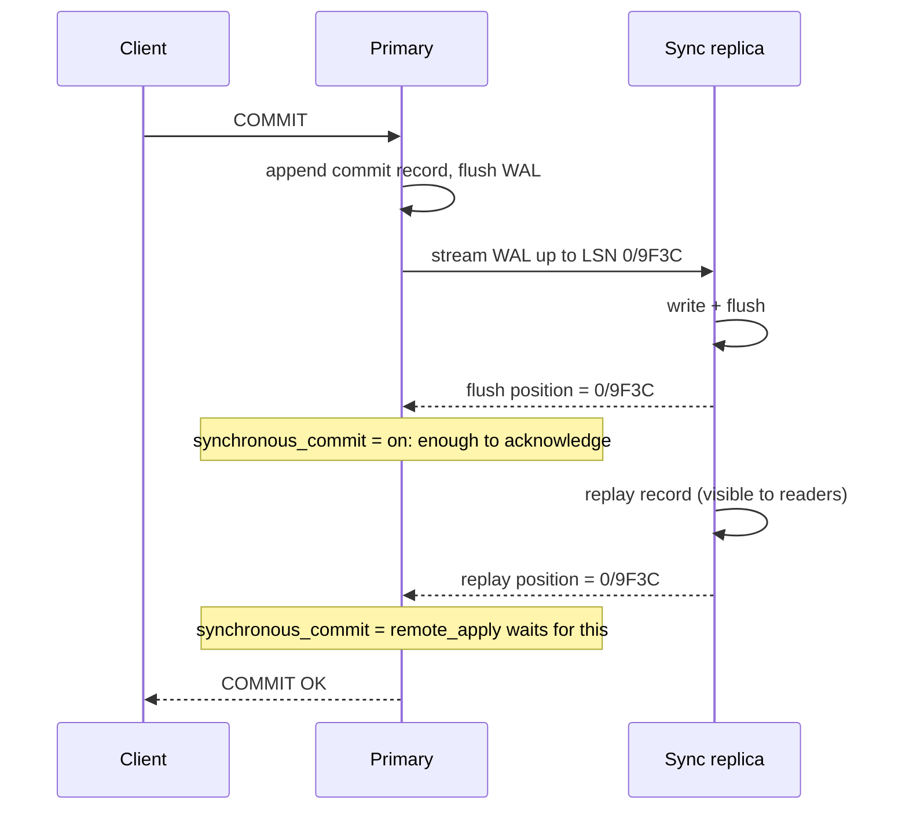

A user saves their profile, the page redirects to `/profile`, and the old name is displayed. They refresh and the new name appears. Nothing in your code is wrong. The `UPDATE` went to the primary, the redirect's `SELECT` went to a replica that had not applied it yet, and the refresh happened to land after it had. This is the most common replication bug in production, and every senior interview about scaling reads eventually arrives at it.

Replication in Postgres is not a subsystem bolted on. It is the write-ahead log from [storage engine internals](/learn/databases/storage-and-scale/storage-engine-internals), sent over a TCP connection and replayed on another machine. Once you see it that way, lag, failover, slots, synchronous commit and read-your-writes all reduce to one question: which LSN has each machine reached? This lesson measures that on PostgreSQL 17, using `pg_receivewal` (a real WAL-streaming client) against a lab primary running 44,000 single-row updates a second.

## Streaming replication is the WAL over a socket

A physical replica starts as a byte-for-byte copy of the primary's data directory, taken with `pg_basebackup` at a known LSN. From then on, three processes cooperate:

1. A **walsender** on the primary reads WAL as it is written and sends it over the replication connection.
2. A **walreceiver** on the replica writes the bytes to its own `pg_wal` and flushes them, reporting its write and flush positions back every `wal_receiver_status_interval` (10 s) or sooner when asked.
3. The **startup process** on the replica replays the records against its pages exactly as crash recovery would, and reports the replay position. A replica is permanently a database in recovery that also accepts read-only queries.

```viz
{"type": "system", "scenario": "replication-leader-follower", "title": "Leader-follower replication through the log",
 "caption": "Writes go to the leader, which appends to its log and streams the records to followers. Followers replay the stream and serve reads. Watch the gap between the leader's write LSN and a follower's replay LSN: that gap is lag, and every read routed to the follower during it sees the past."}
```

Measured: while 8 `pgbench` clients ran 44,614 single-row updates a second with `synchronous_commit = off`, the primary generated **29 MB of WAL in 6 seconds**, about 4.8 MB/s or 110 bytes per update (a `HOT_UPDATE` record and a `COMMIT` record each). A `pg_receivewal` client streaming it over a local socket stayed **8–16 kB behind**, with `write_lag` and `flush_lag` of **7–8 ms**. That is the floor: on a real network add the round trip, and the replica's replay adds its own delay on top.

Because the stream is physical, a replica is an exact copy: same tables, same indexes, same bloat, same major version. It cannot hold a subset of tables, cross a major version, or accept writes.

**Logical replication** decodes the same WAL into row changes (`INSERT` into `orders` with these values) and applies them on subscribers as ordinary SQL. It needs `wal_level = logical` (the lab runs `replica`, so it is not measured here) and a `REPLICA IDENTITY` (usually the primary key) for updates and deletes. A subscriber can run a different major version, have extra indexes or tables, take only some tables, and be written to, with the conflict risks that implies. It is how you do a near-zero-downtime major upgrade, feed a warehouse, or drive [change data capture](/learn/big-data/streaming/change-data-capture). It does not replicate DDL, sequence values or large objects, and it applies changes one transaction at a time on the subscriber (Postgres 16 added parallel apply for large streamed transactions; Postgres 17 can synchronise logical slots to a physical standby so a failover does not lose the subscriber's position).

```sql
CREATE PUBLICATION orders_pub FOR TABLE orders, order_lines;           -- on the primary
CREATE SUBSCRIPTION orders_sub
  CONNECTION 'host=primary dbname=shop user=repl' PUBLICATION orders_pub; -- on the subscriber
```

## Under the hood: four positions and how seconds are computed

`pg_stat_replication` on the primary shows four LSNs per standby: `sent_lsn` (handed to the socket), `write_lsn` (written by the standby, not yet flushed), `flush_lsn` (durable on the standby) and `replay_lsn` (applied and visible to queries there). Lag in **bytes** is the primary's current LSN minus one of them. Lag in **time** (`write_lag`, `flush_lag`, `replay_lag`) is computed differently: the walsender keeps a circular buffer of up to 8,192 `(LSN, timestamp)` samples, recorded as it sends WAL. When the standby reports that it has replayed up to some LSN, the walsender finds the samples that bracket that LSN, interpolates linearly to estimate when the primary was at that position, and subtracts that time from now.

Two consequences follow. First, bytes and seconds disagree whenever the write rate is uneven: 4 MB behind after a burst that ended a second ago is a 1-second lag, while 4 MB behind during a steady 5 MB/s stream is 0.8 seconds. Second, when the primary goes idle, byte lag drops to zero as soon as the replica catches up, even though the last transaction may be minutes old. The exercise at the end implements the interpolation.

On the replica side the equivalents are:

```sql
SELECT now() - pg_last_xact_replay_timestamp() AS since_last_replayed_commit,
       pg_last_wal_receive_lsn(), pg_last_wal_replay_lsn();
```

`since_last_replayed_commit` grows during idle periods even with zero lag, so alert on the primary-side `replay_lag`, or on this value only when writes are known to be flowing.

## Replication slots hold the log for you

A replica that falls behind or disconnects needs WAL that the primary would otherwise recycle after a checkpoint. A **replication slot** is the primary's promise to keep WAL from the slot's `restart_lsn` until the consumer confirms it, and the promise is unconditional. Measured: with the streaming client stopped and the same update workload running, the inactive slot's retained WAL went from 767 kB to **30 MB in 6 seconds**. At that rate an abandoned slot holds 18 GB an hour and 430 GB a day, and the primary stops when its disk fills.

```sql
SELECT slot_name, active, wal_status,
       pg_size_pretty(pg_wal_lsn_diff(pg_current_wal_lsn(), restart_lsn)) AS retained
FROM pg_replication_slots;
--    slot_name    | active | wal_status | retained
--  depth_lab_slot | f      | reserved   | 30 MB
```

`max_slot_wal_keep_size` (Postgres 13 and later; unlimited by default) caps the retention: past it, `wal_status` becomes `lost`, the slot is invalidated, and the consumer must be rebuilt from a fresh base backup. An invalidated slot is a support ticket; a full disk is an outage. Set it, and alert on `retained` long before it.

## What synchronous_commit promises, and what it costs

By default replication is **asynchronous**: `COMMIT` returns once the WAL is flushed locally, and the replica receives it whenever the network delivers it. If the primary is destroyed a moment after acknowledging, that transaction is gone. `synchronous_commit`, with `synchronous_standby_names` configured, decides how far the commit record must travel first:

| Setting | Commit returns after | Survives loss of the primary | Added latency per commit |
|---|---|---|---|
| `off` | WAL in memory; flushed within about 600 ms | No; a crash loses the last fraction of a second | None; lab: 0.16 ms against 1.6 ms |
| `local` | Local flush | No | The local flush (1.4 ms on the lab disk) |
| `remote_write` | Standby wrote it to its OS | Yes, unless the standby's OS also crashes | One network round trip |
| `on` | Standby flushed it | Yes | Round trip plus the standby's flush |
| `remote_apply` | Standby replayed it | Yes, and reads on that standby see it | Round trip, flush and replay |

The round trip is set by geography: typically well under a millisecond within one availability zone, single-digit milliseconds between zones in one region (AWS's [own description](https://docs.aws.amazon.com/whitepapers/latest/aws-fault-isolation-boundaries/availability-zones.html) of zones it places up to about 100 km apart), and tens of milliseconds between regions. Synchronous commit still benefits from group commit: one standby acknowledgement covers every commit record flushed before it, so throughput with many clients degrades far less than single-client latency suggests.



Synchronous replication has a sharp edge: **if the synchronous standby goes away, commits on the primary hang**. The primary was told not to acknowledge without it, and it obeys rather than silently downgrading durability. A single synchronous standby therefore gives *worse* write availability than no replication. Production configurations name several candidates:

```sql
ALTER SYSTEM SET synchronous_standby_names = 'ANY 1 (replica_a, replica_b, replica_c)';
```

```viz
{"type": "system", "scenario": "quorum", "title": "Quorum commit across replicas",
 "caption": "A write is acknowledged once enough replicas confirm it; a read that consults enough replicas is guaranteed to overlap with the latest write. Postgres's ANY n synchronous_standby_names is the write side of this idea; the read side is why a quorum-based store like Cassandra can serve consistent reads without a leader."}
```

When a write needs `W` acknowledgements and a read consults `R` of `N` replicas, reads see the latest write whenever `W + R > N`. Postgres uses the write half for durability and keeps reads on a single node; leaderless stores use both halves, as [wide-column stores](/learn/databases/nosql-and-specialised/wide-column-stores) shows.

## Lag: diagnosing it and doing the catch-up arithmetic

```sql
SELECT application_name, state,
       pg_size_pretty(pg_wal_lsn_diff(pg_current_wal_lsn(), sent_lsn))   AS unsent,
       pg_size_pretty(pg_wal_lsn_diff(pg_current_wal_lsn(), flush_lsn))  AS unflushed,
       pg_size_pretty(pg_wal_lsn_diff(pg_current_wal_lsn(), replay_lsn)) AS unreplayed,
       replay_lag
FROM pg_stat_replication;
```

Which gap is large tells you where to look. Large `unsent` means the primary's walsender or the network cannot keep up. Large `unflushed` with small `unsent` means the replica's disk is slow. Small `unflushed` with large `unreplayed` means the WAL arrived but **replay** is behind: single-threaded replay on an undersized replica, a burst from a bulk load or `VACUUM FULL`, or a query on the replica conflicting with replay.

Catch-up is arithmetic. A replica 112 MB behind, while the primary writes 5 MB/s and the replica can replay 20 MB/s, catches up in 112 / (20 − 5) = 7.5 seconds. If replay capacity is 4 MB/s against 5 MB/s of WAL, lag grows by 1 MB/s, 3.6 GB an hour, and never recovers until the load drops. Replay capacity is the number to know for each replica size, and it is why replicas should not be smaller than the primary.

**Hot standby conflicts.** Replay may need to remove row versions that a query on the replica can still see (vacuum on the primary removed them), or take a lock a query holds. Replay then waits up to `max_standby_streaming_delay` (30 s by default) and cancels the query with `canceling statement due to conflict with recovery`. `hot_standby_feedback = on` makes the replica report its oldest snapshot to the primary so vacuum keeps those versions, trading cancelled replica queries for bloat on the primary, the pinned-horizon problem from [MVCC and locking](/learn/databases/relational-fundamentals/mvcc-and-locking).

## Read-your-writes without remote_apply

Back to the profile bug. Three options, in increasing engineering cost:

**Route by session.** After a user writes, pin that user's reads to the primary for a window longer than p99 lag (say 5 seconds), tracked in the session or a cookie. Cheap and usually enough; when lag spikes past the window, the bug returns.

**Route by LSN.** After the write, capture `pg_current_wal_lsn()` (or `pg_current_wal_insert_lsn()`) and return it to the client in a cookie or header. For the next read, pick a replica whose `pg_last_wal_replay_lsn()` is at least that far, or fall back to the primary:

```sql
SELECT pg_wal_lsn_diff(pg_last_wal_replay_lsn(), '0/9F3C1A20') >= 0 AS caught_up;
```

This is exact rather than a guess. It costs a check per read (or a replica-position cache that a sidecar refreshes every few hundred milliseconds), and it also gives **monotonic reads**: carry the highest LSN the client has seen and never serve it from a replica behind that, so time never runs backwards between two replicas.

**`remote_apply` to a designated replica.** The database enforces it and every write pays for replay. Reasonable when writes are rare and reads many, which is the workload that justifies replicas in the first place.

"Always read from the primary" is what most teams do after the first bug report; it means the replicas exist only for failover. That can be the right decision, but say it out loud.

## Failover, promotion and split brain

When the primary dies, a replica is **promoted** (`pg_promote()`): it stops replaying, opens for writes and starts a new **timeline**, so its history cannot be confused with the old primary's. Clients are repointed through a proxy, a virtual IP or DNS.

Three things go wrong, and they are the heart of the interview follow-up.

**Data loss on asynchronous failover.** Transactions acknowledged by the old primary but not received by the promoted replica are gone, and if the old primary returns it holds rows the new one never saw. Bound it by promoting the most caught-up replica (Patroni refuses to promote one more than `maximum_lag_on_failover`, 1 MB by default, behind) and keep lag low; only synchronous replication removes it.

**Split brain.** The old primary was not dead, only unreachable from the monitor. Two nodes accept writes, and their histories diverge irrecoverably. Preventing it requires **fencing**: the old primary must be unable to write before the new one is promoted. Patroni does it with a lease in a consensus store: the leader must renew a key in etcd every `loop_wait` (10 s) with a `ttl` of 30 s, and a leader that cannot renew demotes itself. The failover therefore takes roughly the TTL plus promotion time, around 30–60 seconds.

```viz
{"type": "system", "scenario": "leader-lease", "title": "A leader lease fences the old primary",
 "caption": "The leader holds a lease with a time-to-live and must renew it before it expires. A leader cut off from the lease store cannot renew, stops accepting writes when its lease lapses, and only then may another node take the lease and be promoted. That ordering is what prevents two writable primaries."}
```

**The old primary cannot rejoin.** Its timeline has diverged. `pg_rewind` can turn it back into a replica by copying the blocks that changed after the divergence point, but only if data checksums or `wal_log_hints` were enabled *before* the incident; the lab cluster, left at defaults, has both off and could not be rewound. Enable them on day one.


| Setup | Data lost on failover (RPO) | Time to recover writes (RTO) | Added commit latency |
|---|---|---|---|
| Async replica, manual failover | Whatever lag existed | Minutes to hours (a human) | None |
| Async, Patroni | Up to `maximum_lag_on_failover` | About 30–60 s | None |
| Sync, `ANY 1` of 2 standbys | Nothing acknowledged | About 30–60 s | One round trip plus a standby flush |
| Sync with `remote_apply` | Nothing acknowledged, and readable on the standby | About 30–60 s | Plus replay time |

Managed services (RDS Multi-AZ, Cloud SQL HA) run this dance for you; AWS documents RDS Multi-AZ failovers as [typically 60–120 seconds](https://docs.aws.amazon.com/AmazonRDS/latest/UserGuide/Concepts.MultiAZ.Failover.html), during which writes fail. Your application's retries and idempotency decide whether that window is a blip or an incident; see [distributed transactions](/learn/system-design/distributed-systems/distributed-transactions).

## Replicas do not scale writes

Every replica applies every write. The lab's 4.8 MB/s of WAL is replayed by each replica, single-threaded, on top of its read load. Adding replicas adds read capacity and zero write capacity; when writes are the bottleneck the next lesson, [partitioning and sharding](/learn/databases/storage-and-scale/partitioning-and-sharding), applies. [Database scaling](/learn/system-design/building-blocks/database-scaling) and [consistency models](/learn/system-design/building-blocks/consistency-models) put both in design-interview context.

## Two more replica shapes

**Cascading replicas** stream from another replica instead of the primary. Each walsender on the primary reads and sends the full WAL stream, 4.8 MB/s per replica at the lab's write rate, so ten replicas means 48 MB/s of outbound replication traffic from the busiest machine. A tree (primary to two regional replicas, each feeding its local read replicas) keeps the primary's cost constant, at the price of one extra hop of lag for the leaves and a single point of failure per branch.

**Delayed replicas** apply WAL only after `recovery_min_apply_delay` (say one hour) has passed since each commit. They receive and flush immediately, so they are durable copies, but their visible state is an hour old. That hour is an undo window for the mistake no other replica protects you from: a `DELETE` without a `WHERE`, replicated everywhere within milliseconds. Pause replay on the delayed replica (`pg_wal_replay_pause()`), copy the lost rows out, and resume. It is cheaper than point-in-time recovery from backups, which must restore the base backup and replay every WAL segment since.

## Failure modes

| Symptom | Diagnosis | Fix |
|---|---|---|
| Users see their own write disappear after a redirect | Read routed to a replica before replay caught up | Session pinning or LSN routing; `remote_apply` for a designated replica |
| Primary disk fills; `pg_wal` is huge | An inactive or slow replication slot retaining WAL (30 MB per 6 s in the lab) | Drop or fix the consumer; set `max_slot_wal_keep_size`; alert on retained WAL |
| Replay lag grows steadily during peak and never recovers | Replay capacity below the WAL rate (single-threaded replay, smaller replica) | Replica at least as large as the primary; reduce WAL (fewer indexes, `wal_compression`) |
| Replica queries fail with "conflict with recovery" | Replay removing versions the query needs, after `max_standby_streaming_delay` | Route long queries to a delayed or dedicated replica; `hot_standby_feedback` if primary bloat is acceptable |
| All writes hang after a replica reboot | A single synchronous standby is unavailable | `ANY 1 (a, b, c)` with several candidates |
| Two primaries after a network partition | Failover without fencing | A lease-based manager (Patroni with etcd), STONITH, or a managed service |

## Interviewer follow-ups

**"Lag is 0 bytes but the dashboard says the replica is 3 minutes behind. Who is right?"** Model answer: probably both: with no writes, byte lag is zero while `now() - pg_last_xact_replay_timestamp()` grows because the last commit is old; use the primary's `replay_lag`, which is only computed while WAL is flowing. Common wrong answer: "the replica is stuck".

**"How would you guarantee read-your-writes with async replicas?"** Model answer: return the commit LSN to the client and serve its reads from a replica whose replay LSN is at least that, else the primary; carry the maximum for monotonic reads. Common wrong answer: "sleep 100 ms before reading".

**"What happens to writes when your only synchronous standby dies?"** Model answer: they hang, because the primary will not downgrade durability; use `ANY 1` of several standbys. Common wrong answer: "Postgres falls back to async".

**"How does Patroni prevent split brain?"** Model answer: the leader holds a lease in etcd with a TTL and demotes itself if it cannot renew; a replica is promoted only after the lease expires, so two leaders never overlap. Common wrong answer: "the monitor kills the old primary", which fails exactly when the monitor cannot reach it.

## What mid-level engineers get wrong

- **Treating replicas as write capacity.** Every replica replays every write.
- **Alerting on byte lag only**, which is zero when idle and misleading during bursts.
- **Configuring one synchronous standby** and turning a replica reboot into a write outage.
- **Leaving slots unbounded** and learning about them from a full disk.
- **Failing over without fencing** because "the old primary is definitely down".
- **Skipping `wal_log_hints` or checksums**, making the old primary unrecoverable except by a full rebuild.

## Exercise

```exercise
id: replay-lag-interpolation
title: Turn replay lag in bytes into lag in seconds
prompt: |
  The primary records samples `[t_ms, lsn]` of its flushed WAL position
  over time (times strictly increasing, LSNs never decreasing). A standby
  reports that it has replayed up to `replay_lsn` at time `now_ms`.

  Implement `replay_lag_ms(samples, replay_lsn, now_ms)` the way the
  walsender estimates `replay_lag`:
  - If `replay_lsn` is at least the last sample's LSN, the standby is
    caught up: return 0.
  - Otherwise find the first sample `i` whose LSN is at least
    `replay_lsn`. If `i` is 0, the primary reached that position at or
    before the first sample: use `t_0`.
  - Otherwise interpolate between samples `i - 1` and `i`:
    `t = t_(i-1) + (replay_lsn - lsn_(i-1)) * (t_i - t_(i-1)) / (lsn_i - lsn_(i-1))`.
  - Return `now_ms - t`, rounded to the nearest integer.
languages: [python, javascript]
entry: replay_lag_ms
starter:
  python: |
    def replay_lag_ms(samples, replay_lsn, now_ms):
        return 0
  javascript: |
    function replay_lag_ms(samples, replay_lsn, now_ms) {
      return 0;
    }
tests:
  - args: [[[0, 0], [1000, 1000000], [2000, 2000000]], 1500000, 2000]
    expected: 500
    label: steady stream, halfway through a sample interval
  - args: [[[0, 0], [1000, 1000000], [2000, 2000000]], 2000000, 2000]
    expected: 0
    label: caught up
  - args: [[[0, 100], [1000, 100], [5000, 100]], 100, 9000]
    expected: 0
    label: idle primary, nothing to replay
  - args: [[[0, 0], [100, 8000000], [1100, 8000000], [1200, 8100000]], 4000000, 1200]
    expected: 1150
    label: 4 MB behind after an old burst is over a second of lag
  - args: [[[500, 1000], [1500, 2000]], 0, 2000]
    expected: 1500
    label: older than the first sample
  - args: [[[0, 0], [1000, 500], [3000, 1500]], 500, 3000]
    expected: 2000
    hidden: true
    label: exactly on a sample's LSN
  - args: [[[0, 0], [3, 10]], 4, 3]
    expected: 2
    hidden: true
    label: rounding a fractional result
  - args: [[[0, 0], [1000, 1000], [2000, 1000], [3000, 3000]], 2000, 3500]
    expected: 1000
    hidden: true
    label: flat stretch before the bracketing samples
hints:
  - "Scan for the first sample whose LSN is at least replay_lsn; the one before it gives the lower bracket."
  - "Keep the interpolation in floating point and round only the final result."
```

## Senior signals

- You describe replication as the WAL streamed and replayed, and lag as a difference of LSNs, with the four positions (sent, write, flush, replay) telling you where the delay is.
- You know how `replay_lag` becomes seconds (interpolated LSN and time samples) and why bytes and seconds disagree during bursts and idle periods.
- You can do catch-up arithmetic from WAL rate and replay capacity, and size replicas so replay keeps up.
- You state what each `synchronous_commit` level guarantees and costs, and use `ANY n` so one standby cannot stop writes.
- You have a read-your-writes strategy (session pinning or LSN routing), not "read from the primary".
- You bound slot retention, fence before promotion, and enable `wal_log_hints` or checksums before you need `pg_rewind`.

## Check yourself

```quiz
- q: >-
    A user updates their display name, is redirected, and sees the old name; a refresh shows the new one. Which fix has the least cost on the write path?
  options: ["Route the user's reads by their write LSN, or to the primary", "Add replicas so that read load, and therefore lag, is spread out", "Set synchronous_commit = remote_apply for every transaction", "Switch to logical replication so that row changes apply faster"]
  answer: 0
  explanation: >-
    Routing by LSN (or pinning briefly to the primary) affects only the user who wrote and adds nothing to commits. remote_apply fixes it by making every commit wait for replay. More replicas do not reduce lag, and logical replication applies changes more slowly, not faster.
- q: >-
    pg_stat_replication shows almost nothing unflushed but 112 MB unreplayed. The primary writes 5 MB/s and the replica can replay 20 MB/s. What is happening, and how long until it catches up?
  options: ["The replica's disk is slow; about 22 seconds at the flush rate", "The slot was invalidated; it cannot catch up without a rebuild", "The WAL arrived but replay is behind; about 7.5 seconds", "The network is saturated; it catches up once the link frees"]
  answer: 2
  explanation: >-
    Flushed but not replayed means the bytes are on the replica and the startup process is behind. It gains 20 - 5 = 15 MB/s, so 112 MB takes about 7.5 s. If replay capacity were below the WAL rate, lag would grow without bound. Network or disk problems would show as unsent or unflushed bytes.
- q: >-
    With the streaming client stopped, an inactive slot's retained WAL grew from 767 kB to 30 MB in 6 seconds. What is the danger, and the guard?
  options: ["Replicas stop streaming at once; restart the walsender to release it", "WAL piles up until disk fills; cap it with max_slot_wal_keep_size", "The slot is dropped after a timeout; raise wal_keep_size to protect it", "Commits slow down as the slot grows; add a second standby to share it"]
  answer: 1
  explanation: >-
    A slot promises to keep WAL until its consumer confirms, and an absent consumer never does: at this rate about 18 GB an hour. Postgres never drops idle slots by itself. max_slot_wal_keep_size invalidates the slot past a limit, turning a disk-full outage into a rebuild of one consumer.
- q: >-
    You configure synchronous_standby_names = 'replica_a' with synchronous_commit = on, and replica_a reboots. What happens to writes on the primary?
  options: ["They fail at once with an error that no standby is available", "They commit locally and queue in the slot for replica_a", "They hang until replica_a returns or the setting is changed", "They continue asynchronously until replica_a reconnects"]
  answer: 2
  explanation: >-
    The primary will not acknowledge without the confirmation it was told to wait for, and it does not silently downgrade durability. That is why one synchronous standby reduces write availability, and why production lists several candidates with ANY 1 so any one of them can confirm.
- q: >-
    The replica is 4 MB behind the primary. In one case the primary is writing a steady 5 MB/s; in the other a 4 MB burst ended a second ago and nothing has been written since. Which statement about replay_lag is right?
  options: ["About 0.8 seconds in the steady case and over a second after the burst", "Both are 0.8 seconds, because lag in seconds is bytes divided by write rate", "Both are zero, because replay_lag only counts commits the primary has not sent", "Neither can be known; replay_lag is only measured when the replica is idle"]
  answer: 0
  explanation: >-
    replay_lag interpolates when the primary was at the replayed LSN from time-stamped samples. In the steady stream, 4 MB of WAL covered 0.8 seconds; after the burst, the primary passed that LSN more than a second ago, so the lag in time is larger even though the bytes are equal. That is why bytes and seconds are both worth watching.
- q: >-
    During a partition, the failover manager promotes a replica while the old primary is still running but cut off from the manager. What must be true for this to be safe?
  options: ["Every replica must first reach the same LSN as the one being promoted", "The old primary must first finish its checkpoint and flush all dirty pages", "The old primary must have stopped accepting writes, e.g. its lease expired", "All replication slots on the old primary must be dropped before promotion"]
  answer: 2
  explanation: >-
    Two writable primaries create divergent histories that cannot be merged. Fencing guarantees at most one writer: with Patroni the leader demotes itself when it cannot renew its lease in etcd, and promotion waits until the lease has expired. LSN equality, checkpoints and slots do not prevent split brain.
```
