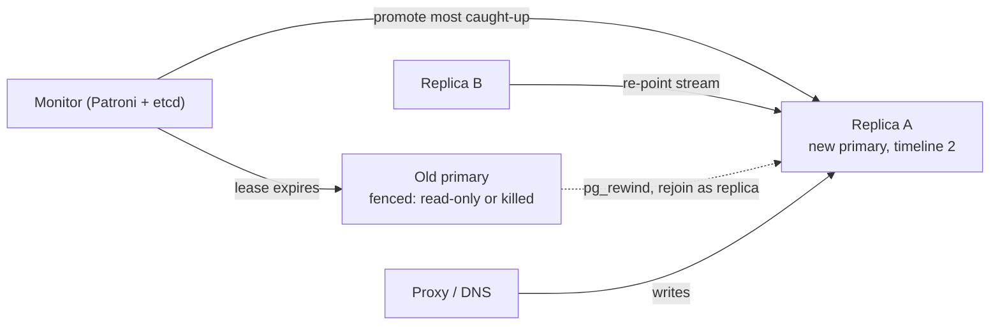

A user saves their profile, the page redirects to `/profile`, and the old name is displayed. They refresh and the new name appears. Nothing in your code is wrong. The `UPDATE` went to the primary, the redirect's `SELECT` went to a replica that had not applied it yet, and the second refresh happened to land after it had. This is the most common replication bug in production, and every senior interview about scaling reads eventually arrives at it.

Replication in Postgres is not a separate subsystem bolted onto the database. It is the write-ahead log from [the previous lesson](/learn/databases/storage-and-scale/storage-engine-internals), sent over a TCP connection and replayed on another machine. Once you see it that way, lag, failover, slots, synchronous commit and read-your-writes all reduce to one question: which LSN has each machine reached?

## Streaming replication is the WAL over a socket

A replica starts as a byte-for-byte copy of the primary's data directory, taken with `pg_basebackup` at a known LSN. From then on, a `walsender` process on the primary streams every WAL record to a `walreceiver` on the replica as soon as it is written, and a startup process on the replica replays those records against its own pages exactly as crash recovery would. The replica is, permanently, a database in recovery mode that also accepts read-only queries.

```viz
{"type": "system", "scenario": "replication-leader-follower", "title": "Leader-follower replication through the log",
 "caption": "Writes go to the leader, which appends to its log and streams the records to followers. Followers replay the stream and serve reads. Watch the gap between the leader's write LSN and a follower's replay LSN: that gap is lag, and every read routed to the follower during it sees the past."}
```

Because the stream is physical (page-level changes), a streaming replica is an exact copy: same tables, same indexes, same bloat, same major version. That is its strength and its limitation. It cannot replicate a subset of tables, cannot replicate between versions, and cannot be written to.

**Logical replication** decodes the same WAL into row-level changes (`INSERT` into `orders` with these column values) and publishes them to subscribers, which apply them as ordinary SQL. A subscriber can be a different major version, can have extra indexes or tables, can subscribe to only some tables, and can be written to (with all the conflict risks that implies). Logical replication is how you do a near-zero-downtime major-version upgrade, feed a data warehouse, or drive [change data capture](/learn/big-data/streaming/change-data-capture). It is also slower to apply than physical replay and does not replicate DDL, sequences or large objects, so it is not what you use for a hot standby.

```sql
-- On the primary: publish two tables.
CREATE PUBLICATION orders_pub FOR TABLE orders, order_items;

-- On the subscriber (a different server, possibly a different version).
CREATE SUBSCRIPTION orders_sub
  CONNECTION 'host=primary dbname=shop user=repl'
  PUBLICATION orders_pub;
```

## Replication slots hold the log for you

A replica that falls behind, or disconnects for an hour, needs WAL that the primary might otherwise have recycled after a checkpoint. A **replication slot** is the primary's promise to keep WAL from a given LSN until the consumer confirms it. That promise is unconditional, which is the trap: a slot whose consumer went away for a weekend holds a weekend of WAL, and the primary's disk fills. Every senior engineer who has run Postgres has a story about a forgotten slot.

```sql
SELECT slot_name, active,
       pg_size_pretty(pg_wal_lsn_diff(pg_current_wal_lsn(), restart_lsn)) AS retained_wal
FROM pg_replication_slots;
```

```text
  slot_name   | active | retained_wal
--------------+--------+--------------
 replica_1    | t      | 2304 kB
 analytics    | f      | 41 GB        <- inactive slot, retaining 41 GB
```

`max_slot_wal_keep_size` (Postgres 13+) caps that retention: past the limit, the slot is invalidated and the consumer must re-sync from a fresh base backup. Set it. An invalidated slot is a support ticket; a full disk is an outage.

## What `synchronous_commit` actually promises

By default replication is **asynchronous**: `COMMIT` returns once the WAL is fsynced locally, and the replica gets the record whenever the network delivers it. If the primary is destroyed a moment after acknowledging, that transaction is gone. For many systems that is acceptable; for a payments ledger it is not.

`synchronous_commit` chooses how far the record must travel before the client hears "OK", and it is a spectrum, not a switch:

| Setting | Commit returns after | Survives primary crash | Survives primary loss | Cost |
|---|---|---|---|---|
| `off` | WAL written to the OS, not fsynced | No (window of ~`wal_writer_delay`) | No | Fastest |
| `local` | Local fsync | Yes | No | One fsync |
| `remote_write` | Replica has received and written to its OS cache | Yes | Yes, unless the replica also crashes | One network RTT |
| `on` (default when synchronous standbys are configured) | Replica has fsynced the WAL | Yes | Yes | RTT plus replica fsync |
| `remote_apply` | Replica has replayed the record, so a read there sees it | Yes | Yes | RTT plus fsync plus apply lag |

`on` protects the data. `remote_apply` additionally guarantees that a read on the synchronous replica, issued after the commit returns, sees the write. That is the only setting that solves read-your-writes at the database level, and it makes every commit wait for the replica's apply latency, which can be tens of milliseconds under load.


Synchronous replication has a failure mode that surprises people: if the synchronous standby goes down, **commits on the primary hang**. The primary has been told not to acknowledge without the replica, and it obeys. This is by design (the alternative is silently downgrading a durability guarantee), but it means a single-replica synchronous setup has *worse* write availability than no replication at all. Production configurations list several candidates so any one can satisfy the quorum:

```sql
-- Any 1 of the 3 named standbys must confirm before COMMIT returns.
ALTER SYSTEM SET synchronous_standby_names = 'ANY 1 (replica_a, replica_b, replica_c)';
```

```viz
{"type": "system", "scenario": "quorum", "title": "Quorum commit across replicas",
 "caption": "A write is acknowledged once enough replicas confirm it; a read that consults enough replicas is guaranteed to overlap with the latest write. Postgres's ANY n synchronous_standby_names is the write side of this idea; the read side is why a quorum-based store like Cassandra can serve consistent reads without a leader."}
```

The general form, where a write needs `W` acknowledgements and a read consults `R` replicas out of `N`, is consistent when `W + R > N`. Postgres uses the write half of that (a write quorum for durability) and leaves reads on a single node; leaderless stores like Cassandra and Dynamo use both halves, which is covered in [replication strategies](/learn/system-design/distributed-systems/replication-strategies).

## Measuring lag

Lag is a difference between LSNs, and there are four positions to compare on the primary side:

```sql
SELECT application_name, state,
       pg_size_pretty(pg_wal_lsn_diff(pg_current_wal_lsn(), sent_lsn))   AS send_lag,
       pg_size_pretty(pg_wal_lsn_diff(pg_current_wal_lsn(), write_lsn))  AS write_lag,
       pg_size_pretty(pg_wal_lsn_diff(pg_current_wal_lsn(), flush_lsn))  AS flush_lag,
       pg_size_pretty(pg_wal_lsn_diff(pg_current_wal_lsn(), replay_lsn)) AS replay_lag,
       replay_lag AS replay_lag_time
FROM pg_stat_replication;
```

```text
 application_name |   state   | send_lag | write_lag | flush_lag | replay_lag | replay_lag_time
------------------+-----------+----------+-----------+-----------+------------+-----------------
 replica_a        | streaming | 0 bytes  | 16 kB     | 16 kB     | 3648 kB    | 00:00:00.41
 replica_b        | streaming | 0 bytes  | 0 bytes   | 8 kB      | 112 MB     | 00:00:19.7
```

`replica_b` has received everything but is 112 MB and 19.7 seconds behind in *applying* it. The usual causes are a long-running query on the replica that conflicts with replay (replay must wait, or cancel the query; `hot_standby_feedback` and `max_standby_streaming_delay` are the two knobs), an undersized replica, or a burst of WAL from a bulk load or a `VACUUM FULL`. Note the unit: lag is bytes and seconds, and either one can be large while the other is small.

On the replica, the equivalent is:

```sql
SELECT now() - pg_last_xact_replay_timestamp() AS replay_delay,
       pg_last_wal_receive_lsn(), pg_last_wal_replay_lsn();
```

Alert on time lag, because that is what users experience. A 10 MB lag on a 100 MB/s stream is 100 ms; a 10 MB lag on a stalled replica is forever.

## Read-your-writes without `remote_apply`

Back to the profile bug. You have three options, in increasing order of engineering cost and decreasing order of user-visible weirdness.

**Route by session.** After a user writes, pin that user's reads to the primary for a window (say 5 seconds) longer than the p99 lag. Store the pin in the session or a cookie. Cheap, and it handles the common case, but it is a guess: if lag spikes to 8 seconds the bug returns.

**Route by LSN.** After the write, capture the primary's LSN and hand it back to the client (in a cookie or a response header). On the next read, choose a replica whose replay LSN is at least that far along, or fall back to the primary:

```sql
-- After COMMIT, on the primary:
SELECT pg_current_wal_lsn();            -- '0/9F3C1A20'

-- Before a read, on a candidate replica:
SELECT pg_wal_lsn_diff(pg_last_wal_replay_lsn(), '0/9F3C1A20') >= 0 AS caught_up;
```

This is exact rather than a guess. It costs one extra round trip per read (or a cached replica-position that a sidecar refreshes every few hundred milliseconds), and it composes naturally with the "monotonic reads" problem: a client that reads from replica A at LSN 100 and then replica B at LSN 90 sees time go backwards. Carry the highest LSN seen and never accept a replica behind it.

**`remote_apply` to a designated replica.** The database enforces it; you pay on every write. Reasonable when writes are rare and reads are many, which is exactly the workload that justifies replicas in the first place.

The wrong option is "read from the primary always", which is what most teams do after the first bug report and which means the replicas exist only for failover. If that is the intent, fine, but say so.

## Failover, promotion and split brain

When the primary dies, a replica is **promoted** (`pg_ctl promote` or `SELECT pg_promote()`): it stops replaying, opens for writes, and starts a new timeline so that its history cannot be confused with the old primary's. Clients must be repointed, which is why production setups put a proxy or a DNS name in front (Patroni with HAProxy, RDS's endpoint, `pgbouncer` with a reconfigured target).

Three things go wrong here, and they are the heart of the interview follow-up.

**Data loss on async failover.** Any transaction acknowledged by the old primary but not yet received by the promoted replica is gone, and worse, if the old primary comes back it has rows the new primary never saw. With asynchronous replication this is an inherent property, not a bug; you bound it by promoting the most-caught-up replica and by keeping lag low. Only synchronous replication eliminates it.

**Split brain.** The old primary was not dead, only unreachable from the monitor. Now two nodes accept writes and their histories diverge irrecoverably. Preventing this requires *fencing*: the old primary must be made unable to serve writes before the new one is promoted, by killing it, revoking its virtual IP, or having it stop itself when it loses its lease with a consensus store. Patroni uses etcd for exactly this: the primary holds a lease with a TTL and demotes itself if it cannot renew. The mechanism is [leader leases](/learn/system-design/distributed-systems/consensus-raft), and a failover system without one is a data corruption incident waiting for a network partition.

**The old primary cannot rejoin.** After promotion the old primary's timeline has diverged. `pg_rewind` can bring it back as a replica by rolling back the divergent blocks using the new primary's WAL, but only if `wal_log_hints` or data checksums were enabled *before* the incident. Enable them on day one.



Failover on a managed service (RDS Multi-AZ, Cloud SQL HA) is this same dance executed for you, typically in 30–120 seconds, during which writes fail. Your application's retry and idempotency behaviour decides whether that window is a blip or an incident; see [distributed transactions](/learn/system-design/distributed-systems/distributed-transactions) for why "retry the payment" is not a safe default.

## Replicas do not scale writes

Every replica applies every write, so adding replicas adds read capacity and zero write capacity. A primary doing 5,000 writes/s means each replica also does 5,000 writes/s of replay, single-threaded in Postgres, on top of its reads. When write volume is the bottleneck, replication is the wrong tool and [partitioning and sharding](/learn/databases/storage-and-scale/partitioning-and-sharding) is the next lesson. When read volume is the bottleneck, replicas are cheap, and the only hard part is the routing you have just read about; [database scaling](/learn/system-design/building-blocks/database-scaling) puts both in the context of a design interview, and [consistency models](/learn/system-design/building-blocks/consistency-models) names the guarantees precisely.

## Senior signals

- You describe replication as **the WAL streamed and replayed**, and lag as a difference between LSNs, in bytes and in seconds.
- You can state what each `synchronous_commit` level guarantees and that only `remote_apply` makes reads on the replica see the commit; you know a single synchronous standby makes writes hang when it dies, so you use `ANY n`.
- You have a **read-your-writes** strategy (session pinning or LSN routing) and you say which one and why, instead of "read from the primary".
- You know a forgotten **replication slot** fills the disk, and you set `max_slot_wal_keep_size`.
- You name **fencing** as the requirement for safe failover and can explain how a lease in etcd provides it.
- You say plainly that replicas do not scale writes, and you reach for sharding when they are the bottleneck.

## Check yourself

```quiz
- q: >-
    A user updates their display name, is redirected, and sees the old name; a refresh shows the new one. Which change fixes the bug with the least write-latency cost?
  options: ["Switch to logical replication, which applies row changes more quickly", "Set synchronous_commit = remote_apply globally so replicas see each commit", "Add more replicas so the read load, and therefore the lag, is spread out", "Pin the user's reads to the primary briefly, or route them by write LSN"]
  answer: 3
  explanation: >-
    remote_apply fixes it but makes every commit wait for replay on the replica. Pinning the user's reads to the primary for a few seconds after a write, or routing reads by the LSN of their last write, is applied only to the user who just wrote, costing nothing on the write path. More replicas do not reduce lag; logical replication is slower to apply, not faster.
- q: >-
    pg_stat_replication shows a replica with flush_lag of 8 kB and replay_lag of 112 MB. What is happening?
  options: ["The replication slot was invalidated, so the replica stopped receiving", "The primary's disk is slow, so its WAL reaches the replica too late", "The network link to the replica is saturated, so WAL arrives in bursts", "WAL has arrived but replay is falling behind, e.g. blocked by a query"]
  answer: 3
  explanation: >-
    Flush lag is tiny, so the bytes arrived and were fsynced. Replay lag is the gap between having the WAL and applying it, which is a replica-side problem: a long query conflicting with replay, single-threaded replay on an undersized replica, or a burst of WAL. Network or primary disk problems would show as send or flush lag.
- q: >-
    You configure synchronous_standby_names = 'replica_a' with synchronous_commit = on, and replica_a crashes. What happens to writes on the primary?
  options: ["They continue asynchronously until replica_a comes back online", "They commit locally and queue in the slot for replica_a to replay", "They fail at once with an error saying no standby is available", "They hang until replica_a returns or the setting is changed"]
  answer: 3
  explanation: >-
    Postgres will not silently downgrade the durability you asked for; commits wait for a confirmation that cannot arrive, rather than failing or proceeding. This is why a single synchronous standby reduces write availability, and why production lists several candidates with ANY n so any one can confirm.
- q: >-
    During an unplanned failover, the monitor promotes a replica while the old primary is still running but partitioned from the monitor. What must happen before the promotion is safe?
  options: ["The old primary must first finish its checkpoint and flush all pages", "All replication slots on the old primary must be dropped beforehand", "Every replica must first reach the same LSN as the one being promoted", "The old primary must be fenced, e.g. by losing the lease it holds"]
  answer: 3
  explanation: >-
    Two writable primaries produce divergent histories that cannot be merged, which is split brain. Fencing (kill it, revoke the VIP, or have it self-demote when it cannot renew its lease in etcd) guarantees at most one writer. Equal LSNs, checkpoints and slots are irrelevant to that safety condition.
- q: >-
    A replication slot for a decommissioned analytics consumer was never dropped. What is the failure you should expect, and when?
  options: ["Nothing much; Postgres drops slots that stay inactive for too long", "Replicas fall behind at once, since the stale slot blocks WAL streaming", "Commits slow steadily, since each one must be checked against the slot", "The primary keeps all WAL since the slot's LSN until its disk fills"]
  answer: 3
  explanation: >-
    A slot is a promise to retain WAL until the consumer confirms it, and an absent consumer never confirms. WAL accumulates silently, possibly for days or weeks, until the disk fills and the primary stops. Postgres does not garbage-collect idle slots; max_slot_wal_keep_size bounds the damage by invalidating the slot instead.
```
