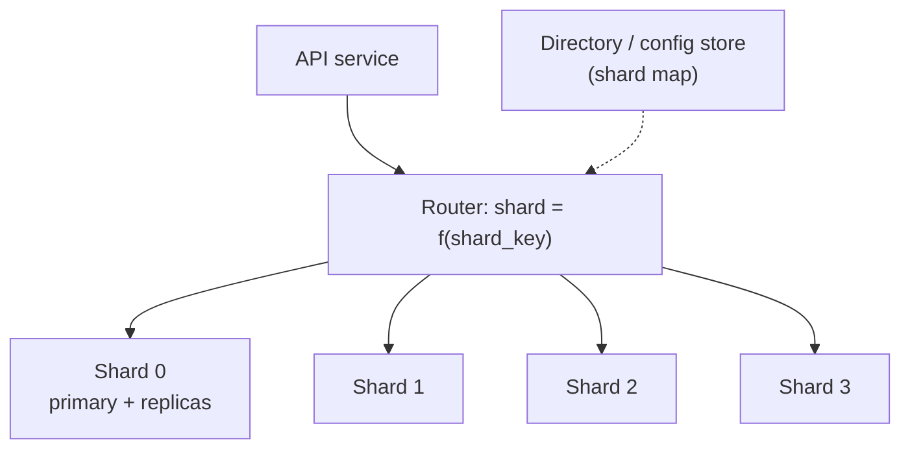

The `events` table has 4 billion rows and 1.2 TB on disk. Deleting last year's data takes nine hours and generates enough WAL to lag every replica. The primary is at 85% CPU during the afternoon peak, and adding another read replica does nothing, because the bottleneck is writes. You have hit the two limits of one table on one machine, and they have two different fixes that are often confused.

**Partitioning** splits one table into pieces *inside* one database. The planner still sees one table; the point is to let it skip pieces and to let maintenance (deletes, vacuums, index builds) operate on pieces. **Sharding** splits a dataset *across* databases. No planner sees the whole thing; your application or a proxy becomes the planner, and the point is to multiply write capacity and storage. Partitioning is a Tuesday-afternoon change. Sharding is a multi-quarter programme that changes how every query is written. This lesson measures the first on PostgreSQL 17 with 2.4 million events in 24 monthly partitions against an identical flat table, and does the arithmetic for the second.

## Declarative partitioning in Postgres

A partitioned table is a parent with no storage and a set of child tables, each holding a disjoint slice of a partition key:

```sql
CREATE TABLE events (
    id          bigint GENERATED ALWAYS AS IDENTITY,
    occurred_at timestamptz NOT NULL,
    user_id     bigint NOT NULL,
    kind        text NOT NULL,
    payload     jsonb,
    PRIMARY KEY (id, occurred_at)      -- the partition key must be in every unique constraint
) PARTITION BY RANGE (occurred_at);

CREATE TABLE events_2026_08 PARTITION OF events FOR VALUES FROM ('2026-08-01') TO ('2026-09-01');
CREATE TABLE events_2026_09 PARTITION OF events FOR VALUES FROM ('2026-09-01') TO ('2026-10-01');
CREATE TABLE events_default PARTITION OF events DEFAULT;
CREATE INDEX ON events (occurred_at);   -- created on every partition
```

`RANGE` suits time and ordered ids, `LIST` a small set of values (`region IN ('eu', 'us')`), and `HASH` spreads rows evenly when there is no natural range (`MODULUS 8, REMAINDER 0..7`). Only range partitioning gives cheap time-based retention, which is why most partitioned tables exist.

The primary-key rule is the first surprise. Uniqueness is enforced per partition, so a unique index must include the partition key. Trying anyway:

```text
CREATE UNIQUE INDEX ON events (id);
ERROR:  unique constraint on partitioned table must include all partitioning columns
DETAIL:  UNIQUE constraint on table "events" lacks column "occurred_at" which is part of the partition key.
```

If `id` alone must be unique, rely on the identity column's sequence or keep a separate lookup table.

## Pruning, measured honestly

The planner removes partitions whose bounds cannot match the `WHERE` clause. Measured on the lab tables, both with an index on `occurred_at`:

| Query | Partitioned (24 partitions) | Flat table |
|---|---|---|
| One week, `occurred_at >= $1 AND occurred_at < $2` and a `kind` filter | Only `ev_2025_09` scanned; 320 buffers, 2.31 ms | Index range scan; 320 buffers, 2.26 ms |
| `WHERE occurred_at::date = '2025-09-20'` | All 24 partitions sequentially scanned; 26,095 buffers, 140.7 ms | Sequential scan of the whole table |
| Prepared statement with a generic plan | `Append` with `Subplans Removed: 23`; 2.8 ms | Index range scan |

The first row is the honest headline: **for a query a good index already serves, pruning buys nothing measurable**. Both plans read the same 320 pages. Pruning is a coarse, free index on the partition key; its performance wins appear when the alternative is a scan (a query that must read a whole month reads one partition instead of the table) or when per-partition indexes are small enough to stay cached while one giant index would not.

The second row is the classic mistake. `occurred_at::date` and `date_trunc('day', occurred_at)` are expressions, not the key, and the planner does not invert them, so every partition is scanned. Rewrite as a half-open range on the column.

The third row is **run-time pruning**. When the bound is a parameter, a subquery or the outer side of a nested loop, the planner keeps all partitions in the plan and the executor removes them once values are known:

```text
Aggregate (actual time=2.786..2.786 rows=1 loops=1)
  ->  Append (actual time=0.030..2.187 rows=23261 loops=1)
        Subplans Removed: 23
        ->  Index Only Scan using ev_2025_09_occurred_at_idx on ev_2025_09 ev_1 ...
              Index Cond: ((occurred_at >= $1) AND (occurred_at < ($1 + '7 days'::interval)))
```

If a plan lists every partition with neither pruning nor `Subplans Removed`, the predicate does not constrain the partition key and partitioning bought nothing for that query.

## Under the hood: three moments when pruning can happen

Postgres's pruning code (`partprune.c`) turns the query's conditions on the partition key into **pruning steps**, and for range partitions each step is a binary search over the sorted array of partition bounds, so finding the matching partition among 1,000 takes about ten comparisons. The steps run at up to three moments, and the plan tells you which one did the work:

1. **Plan time**, when the values are constants: the pruned partitions never appear in the plan at all, as in the first row of the table above.
2. **Executor start-up** ("initial pruning"), when values are known once the query starts but not when it is planned: parameters of a generic plan, and stable functions such as `now()`. `WHERE occurred_at > now() - interval '40 days'` on the lab table printed `Subplans Removed: 20` even under plain `EXPLAIN`, because `now()` cannot be folded at plan time (a cached plan may run tomorrow) but is fixed for the whole statement.
3. **Per scan** ("exec pruning"), when values change during execution, such as the inner side of a nested loop joined on the partition key: each rescan re-runs the steps, and partitions skipped every time show `(never executed)`.

The practical rule: anything the planner can see as a constant, a parameter or a stable expression of the **key column itself** prunes; volatile functions (`random()`, `clock_timestamp()`) and expressions *of* the key do not.

## The real win: retention and maintenance

Deleting one month from the flat table against dropping one partition, with WAL counted per transaction ID through `pg_walinspect`:

| Operation | Time | WAL records | WAL bytes | Table afterwards |
|---|---|---|---|---|
| `DELETE FROM ev_flat WHERE occurred_at` in November (99,692 rows), right after a checkpoint | 37 ms here | 99,694 | 14 MB, 8.6 MB of it full-page images | 204 MB even after `VACUUM`: the space is reusable, not returned |
| `ALTER TABLE ev DETACH PARTITION ev_2024_11; DROP TABLE ev_2024_11;` | about 10 ms | 91 | 14.6 KB | The partition's file is unlinked |

At lab scale the delete is fast; the WAL column is what scales. One month of a 1.2 TB table is about 100 GB of heap: deleting it writes one record per row plus page images, every replica replays it, vacuum then scans it, and the file never shrinks. Dropping the partition writes a few catalogue records regardless of size. That is the nine-hour delete reduced to a lock and an unlink. Use `DETACH PARTITION ... CONCURRENTLY` (Postgres 14 and later) to avoid holding an `ACCESS EXCLUSIVE` lock on the parent while other queries run.

Maintenance improves the same way: vacuum, `REINDEX` and `CLUSTER` run per partition, old partitions become all-visible and frozen once and stay that way, and a partition can be moved to cheaper storage or dropped without touching the rest.

## What partitions cost the planner

Each partition is a real table with real indexes, and the planner and each backend's catalogue cache pay per partition. Measured on tables with 10, 100 and 1,000 range partitions holding the same 100,000 rows:

| Partitions | Pruned point query, planning | Unpruned query, planning (warm session) | Unpruned, first query in a new session | Unpruned execution |
|---|---|---|---|---|
| 10 | 0.03 ms | 0.05 ms | 1.8 ms | 1.9 ms |
| 100 | 0.05 ms | 0.29 ms | 13.3 ms | 2.4 ms |
| 1,000 | 0.04 ms | 9.0 ms | 130 ms | 10.0 ms |

Since Postgres 12, pruning happens before per-partition planning, so pruned queries stay cheap at any count. Unpruned queries pay per partition, and the first query in a fresh session pays to load a catalogue entry for every partition: 130 ms at 1,000 partitions, and the backend's memory contexts grew from 1.3 MB to 12 MB. With short-lived connections and no pooler, that is paid on every connection, which ties this lesson to [connection management](/learn/databases/storage-and-scale/connection-management). Hundreds of partitions are fine; many thousands need every hot query to prune and a pooler in front.

## Sharding: when one database is not enough

Sharding places disjoint subsets of rows on different servers, each a complete Postgres with its own primary and replicas. A routing layer (your code, or Citus or Vitess) decides which shard serves a query.



Everything follows from the **shard key**. A query that includes it goes to one shard and is as fast as before; a query that does not must go to all of them. You choose the key once, and changing it means moving every row.

## Choosing the shard key, with hot-key arithmetic

A good shard key has three properties that pull against each other.

**Even distribution of load, not only rows.** Tenant sizes in multi-tenant systems are heavy-tailed. Model 10,000 tenants whose load follows a Zipf distribution with exponent 1: tenant rank *r* carries a share of 1 / (*r* × H₁₀₀₀₀), where H₁₀₀₀₀ ≈ ln 10,000 + 0.577 ≈ 9.79.

- The largest tenant carries 1 / 9.79 ≈ **10.2%** of all load; the second 5.1%; the top ten together 30%.
- Hashed across 16 shards, each shard's fair share is 6.25%. The shard that receives the largest tenant carries about 10.2% + 89.8% / 16 ≈ **15.8%**, 2.5 times the average.
- If a shard saturates at 10,000 writes a second, the fleet saturates when that one shard does: at about 63,000 total instead of 160,000.

No hash function fixes that: the tenant still lands on exactly one shard. The remedies are a **directory** that can place the big tenant on a dedicated shard, or splitting it by a secondary key (`tenant_id` plus `bucket = hash(user_id) % 8`), which divides its 10.2% into eight 1.3% pieces at the cost of eight-way fan-out for that tenant's cross-user queries.

**Query locality.** Most queries must include the key. In multi-tenant SaaS, `tenant_id` is the natural key because nearly every query is "for this tenant". In a social product, `user_id` serves profiles and timelines but not "who liked this post", so post data may be sharded by `post_id` and timelines by `user_id`, denormalised across both; [modelling for access patterns](/learn/databases/data-modeling-and-evolution/modelling-for-access-patterns) is about exactly this.

**Stability.** A row's key must never change. Sharding by email looks reasonable until a user changes theirs and every row must move.

## Hash versus range, and what moves when you add a shard

```viz
{"type": "system", "scenario": "sharding-hash", "title": "Hash sharding",
 "caption": "The shard is chosen by hashing the key: keys spread evenly regardless of their values, and a point lookup by key goes straight to one shard. Notice that a range of keys is scattered across every shard, so range queries become scatter-gather."}
```

```viz
{"type": "system", "scenario": "sharding-range", "title": "Range sharding",
 "caption": "Contiguous key ranges live together, so range scans hit one or a few shards, and shards can be split at any boundary. Notice the cost: monotonically increasing keys (time, sequential ids) send every new write to the last shard."}
```

| | Hash sharding | Range sharding | Directory (lookup table) |
|---|---|---|---|
| Point lookup by key | One shard | One shard | One cached lookup, then one shard |
| Range query on the key | All shards | One or a few | Depends on how ranges were assigned |
| Sequential keys | Spread evenly | All writes hit the last shard | Spread by policy |
| Adding a shard | `mod N`: most keys move; consistent hashing: about 1/N | Split one range | Move chosen tenants only |
| Hot tenant | Stuck on its shard | Stuck on its shard | Can be moved or isolated |
| Used by | Citus (hash, 32 shards by default), DynamoDB, Cassandra | HBase, CockroachDB, Spanner | Vitess vindexes, most in-house SaaS routers |

Why `mod N` is dangerous: a key stays put when going from N to N + 1 shards only if `h mod N = h mod (N + 1)`, which holds for 1 / (N + 1) of hashes. From 4 to 5 shards, **80% of keys move**; from 16 to 17, 94%. Consistent hashing moves about 1 / (N + 1), 20% and 6% respectively, and [hashing at scale](/learn/data-structures/hashing/hashing-at-scale) builds it. The pragmatic alternative many teams choose is a **directory**, a small replicated table mapping each tenant to a shard, cached in the router: placement becomes explicit, a hot tenant can be moved by hand, and a reshard moves exactly the tenants you choose.

## Cross-shard queries and the tail

Any query without the shard key is a **scatter-gather**: send it to every shard, merge the results. Latency is the *slowest* shard's latency. If each shard answers within 10 ms 99% of the time, a query that waits for all 16 shards sees at least one slow answer with probability 1 − 0.99¹⁶ = **14.9%**; with 64 shards, 47%. The fan-out's median is close to a single shard's p99. `ORDER BY created_at DESC LIMIT 20` across 16 hash shards must fetch 20 rows from each (320) and discard 300, which is the exercise below.

Three things are expensive across shards:

- **Joins** between tables sharded on different keys. Co-locate them (shard `orders` and `order_lines` both by `customer_id`) or join in the application.
- **Uniqueness on non-key columns.** "Email is unique" across users sharded by `user_id` needs a table sharded by email that maps to `user_id`, written in the same logical operation. The same **global secondary index** pattern serves lookups by email as two single-shard queries instead of a scatter.
- **Transactions.** Each shard commits independently; atomicity across them needs two-phase commit or a saga ([distributed transactions](/learn/system-design/distributed-systems/distributed-transactions)). Design the key so the transactions you care about are single-shard, and make the rare cross-shard ones idempotent and retryable.

## Resharding without downtime, with numbers

You will reshard. Take 2 TB moving from 8 shards to 16, with the copy throttled to 50 MB/s so that replicas keep up:

| Step | What happens | Duration for 2 TB |
|---|---|---|
| 1. Provision | New shards empty, schema applied | Hours of setup |
| 2. Dual-write or tail the log | Writes go to old and new locations (application double-write), or the new side tails the old side's binlog or WAL (Vitess VReplication, Citus logical replication) | Starts before the copy, runs to cutover |
| 3. Backfill | Copy history in primary-key chunks, throttled on replica lag | 2 × 10¹² B / 5 × 10⁷ B/s = 40,000 s, about 11 hours |
| 4. Verify | Row counts and checksums per chunk (1 GB chunks: 2,000 comparisons); re-copy mismatches | Hours; the step teams skip |
| 5. Cut over reads | One tenant or one percent at a time, watching errors | Days |
| 6. Cut over writes | Stop writes to the old location; keep it for a rollback window | Minutes of write pause, or zero with a log-tailing tool |
| 7. Clean up | Drop old data after the window | Weeks later |

Vitess, built at YouTube to shard MySQL, automates this as `MoveTables` and `Reshard`; Citus moves shards with logical replication (`citus_rebalance_start()`). The mechanism is always: copy history, stream the tail, verify, swap. Step 4 is where you discover the writes the double-write missed; teams that skip it find out months later that 0.02% of rows exist only on the old shards. [Partitioning and rebalancing](/learn/system-design/distributed-systems/partitioning-and-rebalancing) covers the generic mechanics of moving key ranges.

## Before you shard

Sharding is the last resort, and a senior engineer lists what comes first:

- **Vertical scaling.** One modern Postgres primary on NVMe handles tens of thousands of durable commits a second with group commit (the lab measured 7,749 a second from 16 clients on a virtual disk) and several terabytes. The 96-core machine is cheaper than the sharding programme.
- **Partitioning**, so retention and maintenance stop being the problem.
- **Removing write load**: fewer indexes (six indexes made inserts 16 times slower in the [indexes lesson](/learn/databases/relational-fundamentals/indexes)), batching, moving firehose data to a store built for it.
- **Caching reads** so the primary spends its capacity on writes.
- **Splitting by service before splitting by key**: moving notification tables to their own database is a shard with a trivial router.

When these are exhausted, shard by the key most transactions already include, put a directory in front so tenants can move, and plan the reshard before you need it. [Database scaling](/learn/system-design/building-blocks/database-scaling) frames this for the design interview.

## Failure modes

| Symptom | Diagnosis | Fix |
|---|---|---|
| A partitioned query scans every partition | Predicate on an expression of the key (`::date`, `date_trunc`) or no key at all | Half-open ranges on the key; check for pruning or `Subplans Removed` |
| New connections are slow and backend memory is high after adding partitions | Catalogue cache load for thousands of partitions on first use (130 ms at 1,000 unpruned) | Fewer, larger partitions; a pooler; make hot queries prune |
| One shard at 90% CPU while the rest idle | A hot tenant; load is heavy-tailed even when rows are evenly hashed | Directory placement or a dedicated shard; split the tenant by a secondary key |
| Fan-out endpoints have bad p99 while single-shard ones are fine | Scatter-gather waits for the slowest of N shards | Include the shard key; hedge requests; global secondary index tables |
| Rows exist only on old shards after a reshard | Double-write failures and backfill races, never verified | Chunked checksums before cutover; log-based tailing instead of application double-writes |

## Interviewer follow-ups

**"Partitioning did not make our query faster. Why?"** Model answer: if an index already bounded the query, pruning reads the same pages (320 buffers both ways in the lab); partitioning's wins are retention by `DROP`, per-partition maintenance and scans that become partition-sized. Common wrong answer: "partitioning always speeds up queries".

**"How would you choose between hash and range sharding?"** Model answer: by access pattern: range for range scans and time locality, accepting a hot tail for sequential keys; hash for even point-lookup load, accepting scatter-gather for ranges; a directory on top of either when tenants are heavy-tailed. Common wrong answer: "hash, because it is balanced", ignoring hot keys and range queries.

**"Your largest tenant is 10% of traffic across 16 shards. What happens?"** Model answer: its shard carries about 2.5 times the average and caps fleet throughput; isolate it on its own shard via a directory or split it by a secondary key. Common wrong answer: "add more shards", which leaves the tenant on one shard.

**"How do you move data between shards with no downtime?"** Model answer: copy history in throttled chunks while tailing or double-writing new changes, verify per-chunk checksums, cut reads over gradually, then writes, and keep the old copy for rollback. Common wrong answer: "take a maintenance window and dump/restore", which is hours of downtime at terabyte scale.

## What mid-level engineers get wrong

- **Proposing sharding for a retention problem** that partitioning solves with `DROP TABLE`.
- **Filtering on a function of the partition key** and scanning every partition.
- **Creating thousands of partitions** for one-day granularity over years, then paying for it on every new connection.
- **Hashing tenants and assuming load is even.** Zipf-shaped tenants make one shard the bottleneck.
- **Using `hash mod N`** and moving 80% of the data when adding one shard.
- **Skipping verification** in a reshard.

## Exercise

A cross-shard `ORDER BY ... LIMIT` asks every shard for its own top rows and merges them. Implement the merge and count the waste.

```exercise
id: scatter-gather-top-k
title: Merge per-shard results for ORDER BY ... LIMIT
prompt: |
  Each shard ran `ORDER BY created_at DESC, id DESC LIMIT k` and returned
  its rows as `[created_at, id]` pairs, already sorted that way (a shard may
  return fewer than `k` rows, or none).

  Implement `global_top_k(shard_results, k)` returning
  `{"ids": [...], "fetched": f, "discarded": d}`:
  - `ids`: the ids of the global top `k` rows ordered by `created_at`
    descending, ties broken by `id` descending (ids are strings, compared as
    plain strings);
  - `fetched`: how many rows the router received in total;
  - `discarded`: how many of those were not returned.
languages: [python, javascript]
entry: global_top_k
starter:
  python: |
    def global_top_k(shard_results, k):
        return {"ids": [], "fetched": 0, "discarded": 0}
  javascript: |
    function global_top_k(shard_results, k) {
      return { ids: [], fetched: 0, discarded: 0 };
    }
tests:
  - args: [[[[50, "a1"], [40, "a2"]], [[45, "b1"], [10, "b2"]], [[60, "c1"], [5, "c2"]]], 2]
    expected: {"ids": ["c1", "a1"], "fetched": 6, "discarded": 4}
    label: three shards, top two
  - args: [[[[10, "x"]], [[10, "y"]]], 1]
    expected: {"ids": ["y"], "fetched": 2, "discarded": 1}
    label: equal timestamps break ties by id
  - args: [[[], [[3, "a"]], []], 5]
    expected: {"ids": ["a"], "fetched": 1, "discarded": 0}
    label: empty shards and a short result
  - args: [[[[9, "a"], [7, "b"], [5, "c"]], [[8, "d"], [6, "e"], [4, "f"]]], 3]
    expected: {"ids": ["a", "d", "b"], "fetched": 6, "discarded": 3}
    label: interleaved shards
  - args: [[[[5, "s0"]], [[5, "s1"]], [[5, "s2"]], [[5, "s3"]], [[4, "s4"]], [[4, "s5"]], [[4, "s6"]], [[4, "s7"]]], 3]
    expected: {"ids": ["s3", "s2", "s1"], "fetched": 8, "discarded": 5}
    hidden: true
    label: eight shards with ties
  - args: [[], 3]
    expected: {"ids": [], "fetched": 0, "discarded": 0}
    hidden: true
    label: no shards at all
  - args: [[[[100, "z"], [1, "y"]], [[99, "a"], [98, "b"]]], 4]
    expected: {"ids": ["z", "a", "b", "y"], "fetched": 4, "discarded": 0}
    hidden: true
    label: k equals everything fetched
hints:
  - "Collect every row, sort by (created_at, id) descending, and keep the first k; a k-way heap merge is the efficient version of the same idea."
  - "fetched is the sum of the shard list lengths; discarded is fetched minus the number of ids returned."
```

## Senior signals

- You distinguish partitioning (one database, the planner prunes, retention by `DROP`) from sharding (many databases, you are the planner), and you do not propose sharding for a retention problem.
- You are honest that pruning adds little over a good index, and you point at retention WAL (14 MB against 14.6 KB here) and maintenance as the real wins.
- You know partition counts cost planning time and backend memory, especially on fresh connections.
- You pick a shard key from access patterns, do the hot-key arithmetic for heavy-tailed tenants, and put a directory in front so tenants can move.
- You know `mod N` moves most keys, fan-out inherits the slowest shard's latency, and cross-shard joins, uniqueness and transactions each need a named pattern.
- You describe resharding as copy, tail, verify, cut over, with durations, and you insist on the verify step.

## Check yourself

```quiz
- q: >-
    A 2 TB events table partitioned by month is queried with WHERE date_trunc('day', occurred_at) = '2026-09-20'. EXPLAIN shows every partition scanned. Why?
  options: ["A default partition exists, which switches pruning off for all queries", "Pruning works only for equality on integer keys, never on timestamps", "The filter is on an expression of the key, not on the key itself", "Pruning needs an index on occurred_at in every partition to find the bounds"]
  answer: 2
  explanation: >-
    Pruning compares the predicate with partition bounds; an expression of the key is not the key, and the planner does not invert it. The lab's ::date version scanned all 24 partitions in 140 ms. Rewrite it as a half-open range on occurred_at and one partition remains. Indexes and default partitions do not affect pruning.
- q: >-
    After partitioning a table by month, a one-week query that already used an index on occurred_at is no faster. What does that tell you?
  options: ["Pruning skipped only what the index skipped: same pages read", "The partitions were created wrongly, so pruning did not apply", "Postgres 17 disables pruning when a partitioned index is present", "Partitioned tables are always slower because of the Append node"]
  answer: 0
  explanation: >-
    The lab measured 320 buffers and about 2.3 ms either way: the index already bounded the scan to one week, so skipping other partitions saved nothing. Partitioning pays off for retention, per-partition maintenance and queries that would otherwise scan the whole table. The Append node's overhead is negligible when pruning leaves one partition.
- q: >-
    You drop a month of data by DETACH PARTITION and DROP TABLE instead of DELETE. Why does this matter most on a large, replicated table?
  options: ["DELETE cannot remove rows from a partitioned table without a full scan", "DROP returns disk space only after the next VACUUM FULL has completed", "DROP runs faster because it skips the foreign-key checks that DELETE runs", "DROP writes a few catalogue records instead of one WAL record per row"]
  answer: 3
  explanation: >-
    Deleting 99,692 rows wrote 99,694 WAL records and 14 MB of WAL that every replica replays, and the table did not shrink; the drop wrote 91 records and 14.6 KB. At 100 GB per month that is the difference between hours of WAL and an unlink. DROP returns space at once; DELETE only makes it reusable.
- q: >-
    10,000 tenants have Zipf-distributed load and are hashed across 16 shards. The largest tenant carries about 10% of all traffic. What is the consequence?
  options: ["Its shard carries about 2.5 times the average load and caps the fleet", "Every shard carries about 10% more than it would with uniform tenants", "The fleet needs 17 shards so that the largest tenant can be spread out", "Nothing, because hashing spreads tenants evenly across the 16 shards"]
  answer: 0
  explanation: >-
    Hashing spreads tenants, not load: the largest tenant's 10.2% lands on one shard on top of that shard's 5.6% share of everyone else, about 15.8% against a 6.25% average. The fleet saturates when that shard does. A directory to isolate the tenant, or splitting it by a secondary key, fixes it; more shards do not.
- q: >-
    Each of 16 shards answers within 10 ms 99% of the time. A query must wait for all 16. How often does it take longer than 10 ms?
  options: ["About 16% of the time, sixteen times the single-shard rate", "About 1% of the time, the same as a single shard", "About 50% of the time, since half the shards are always slow", "About 15% of the time, since 1 - 0.99^16 is 0.149"]
  answer: 3
  explanation: >-
    The query is slow if any shard is slow: 1 - 0.99^16 = 0.149. Adding the probabilities (16%) overcounts overlaps, and the single-shard rate ignores the fan-out. With 64 shards it is about 47%, which is why fan-out queries have poor tail latency and why hedged requests or avoiding fan-out matter.
- q: >-
    A router uses hash(key) mod 4 and a fifth shard is added. Roughly what fraction of keys must move, and what avoids it?
  options: ["None; keys keep their shard and only new keys go to the new shard", "About 80%; consistent hashing or a directory moves about a fifth", "About 25%; each old shard hands a quarter of its keys to the new one", "About 20%; only the keys that belong on the new shard have to move"]
  answer: 1
  explanation: >-
    A key stays only if h mod 4 equals h mod 5, which holds for 1 in 5 hashes, so 80% move. Consistent hashing moves about 1/5 of keys, and a directory moves exactly the tenants you choose. Leaving old keys in place would break lookups, since the router computes a different shard for them.
```
