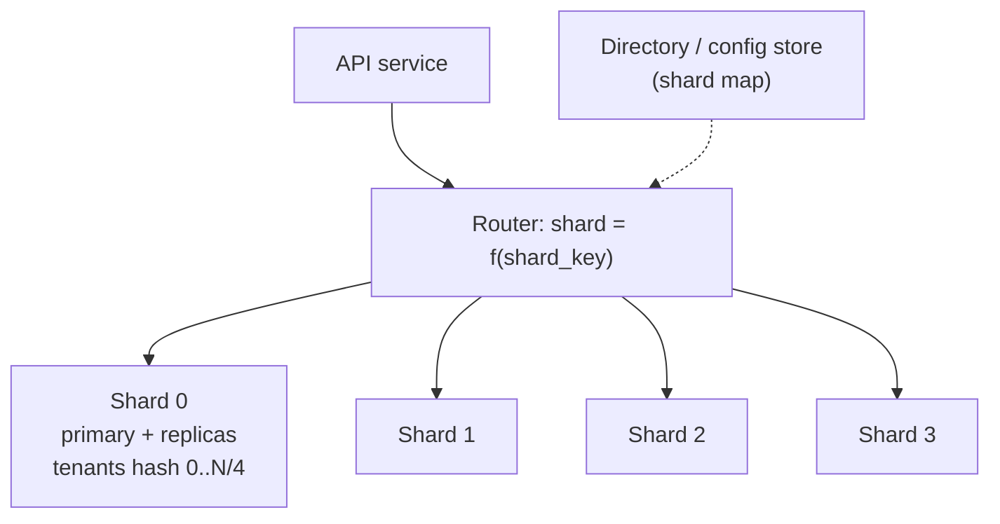

The `events` table has 4 billion rows and 1.2 TB on disk. Deleting last year's data takes nine hours and generates enough WAL to lag every replica. The primary is at 85% CPU during the afternoon peak, and adding another read replica does nothing because the bottleneck is writes. You have hit the two limits of one table on one machine, and they have two different fixes that are often confused.

**Partitioning** splits one table into pieces *inside* one database. The planner still sees one table, and the point is to let it skip pieces and to make maintenance (deletes, vacuums, index builds) operate on pieces. **Sharding** splits a dataset *across* databases. No planner sees the whole thing; your application (or a proxy) becomes the planner, and the point is to multiply write capacity and storage. Partitioning is a Tuesday-afternoon change. Sharding is a multi-quarter programme that changes how every query is written.

## Declarative partitioning in Postgres

A partitioned table is a parent with no storage of its own and a set of child tables, each holding a disjoint slice defined by a partition key:

```sql
CREATE TABLE events (
    id          bigint GENERATED ALWAYS AS IDENTITY,
    occurred_at timestamptz NOT NULL,
    user_id     bigint NOT NULL,
    kind        text NOT NULL,
    payload     jsonb,
    PRIMARY KEY (id, occurred_at)      -- the partition key must be in every unique constraint
) PARTITION BY RANGE (occurred_at);

CREATE TABLE events_2026_08 PARTITION OF events
    FOR VALUES FROM ('2026-08-01') TO ('2026-09-01');
CREATE TABLE events_2026_09 PARTITION OF events
    FOR VALUES FROM ('2026-09-01') TO ('2026-10-01');
CREATE TABLE events_default PARTITION OF events DEFAULT;

CREATE INDEX ON events (user_id, occurred_at);   -- created on every partition
```

Three strategies exist. `RANGE` for time or ordered ids (the common case), `LIST` for a small set of discrete values (`region IN ('eu', 'us', 'apac')`), and `HASH` for spreading rows evenly when there is no natural range (`PARTITION BY HASH (user_id)` with `MODULUS 8, REMAINDER 0..7`). Only range partitioning gives you cheap time-based retention, which is the reason most partitioned tables exist.

The primary-key rule in the DDL above is the first surprise. A unique index on a partitioned table must include the partition key, because uniqueness is enforced per partition and Postgres cannot check across them. If `id` alone must be unique, you enforce it in the application (an identity column is unique by construction) or accept the composite key.

### Pruning is the payoff

The planner removes partitions whose bounds cannot match the query's `WHERE` clause. That is the whole performance story: a query for one week reads one partition of 40 million rows instead of the parent's 4 billion.

```sql
EXPLAIN (ANALYZE, COSTS OFF)
SELECT count(*) FROM events
WHERE occurred_at >= '2026-09-20' AND occurred_at < '2026-09-27' AND kind = 'lesson_completed';
```

```text
Aggregate (actual time=182.4..182.4 rows=1 loops=1)
  ->  Index Scan using events_2026_09_user_id_occurred_at_idx on events_2026_09 events
        (actual time=0.04..171.9 rows=93120 loops=1)
        Index Cond: ((occurred_at >= '2026-09-20') AND (occurred_at < '2026-09-27'))
        Filter: (kind = 'lesson_completed')
        Rows Removed by Filter: 411208
Planning Time: 0.38 ms
Execution Time: 182.5 ms
```

Only `events_2026_09` appears. The other partitions were pruned at plan time. When the value is not known until execution (a parameter, a subquery, a nested-loop join), pruning happens at run time and shows up differently:

```text
Append (actual time=...)
  Subplans Removed: 22
  ->  Index Scan using events_2026_09_... on events_2026_09 events_1 ...
```

`Subplans Removed: 22` means 22 partitions were considered and eliminated once the parameter values were known. If you see neither a single partition nor `Subplans Removed`, and instead a long list of every partition being scanned, the query's predicate does not constrain the partition key, and partitioning bought you nothing for this query. The classic mistake is filtering on `date_trunc('day', occurred_at)` or `occurred_at::date`: a function of the key is not the key, and the planner cannot prune.

Retention becomes metadata:

```sql
ALTER TABLE events DETACH PARTITION events_2025_08 CONCURRENTLY;
DROP TABLE events_2025_08;   -- milliseconds, and almost no WAL
```

That is the nine-hour delete reduced to a lock and an unlink. Compare a `DELETE ... WHERE occurred_at < '2025-09-01'` on an unpartitioned table: every row is marked dead, written to WAL, replicated, and then vacuumed, and the table does not shrink on disk afterwards.

### Costs of partitioning

Each partition is a real table with real indexes, so planning time grows with the partition count (thousands of partitions are a problem; hundreds are fine). Queries that do not filter on the partition key touch every partition and are slightly *slower* than on the flat table because of the `Append`. Foreign keys referencing a partitioned table only became possible in Postgres 12. And **partition-wise joins** (`enable_partitionwise_join`) let two tables partitioned the same way join partition by partition, which is a large win for a fact table joined to a dimension table on the key, and irrelevant otherwise.

## Sharding: when one database is not enough

Sharding places disjoint subsets of rows on different database servers. Each shard is a complete Postgres with its own primary and replicas. Something between the application and the shards, a routing layer in your code or a proxy like Citus or Vitess, decides which shard a query goes to.



Everything about sharding follows from one decision: the **shard key**, the column whose value decides which shard a row lives on. Every query that includes the key goes to one shard and is as fast as before. Every query that does not must go to *all* shards. You choose the key once, and changing it later means moving every row.

### Choosing the shard key

A good shard key has three properties, and the tension between them is the whole design problem.

**High cardinality and even distribution.** Sharding by `country` gives you a US shard doing 60% of the traffic and a Liechtenstein shard doing nothing. Sharding by `user_id` gives millions of values that spread evenly. But even distribution of *rows* is not even distribution of *load*: a single enterprise tenant with 10,000 users and a hot dashboard is a **hot key**, and no hash function fixes that. The remedies are to split the hot tenant across shards by a secondary key, to give it a dedicated shard, or to serve its reads from a cache. Netflix-scale systems name the hot-key problem explicitly in design reviews because it is the failure that makes a sharded system slower than an unsharded one.

**Query locality.** Most queries should include the key. In a multi-tenant SaaS, `tenant_id` is the obvious key because almost every query is "for this tenant". In a social product, `user_id` works for the profile and timeline but not for "who viewed this post", and you may end up with the post data sharded by `post_id` and the timeline sharded by `user_id`, denormalised across both. That is normal; the [next module](/learn/databases/data-modeling-and-evolution/modelling-for-access-patterns) is about modelling from access patterns for exactly this reason.

**Stability.** A user's key must not change. Sharding by `email` looks reasonable until a user changes their email and you must move their rows.

### Hash versus range

```viz
{"type": "system", "scenario": "sharding-hash", "title": "Hash sharding",
 "caption": "The shard is chosen by hashing the key: keys spread evenly regardless of their values, and a point lookup by key goes straight to one shard. Notice that a range of keys is scattered across every shard, so range queries become scatter-gather."}
```

```viz
{"type": "system", "scenario": "sharding-range", "title": "Range sharding",
 "caption": "Contiguous key ranges live together, so range scans hit one or a few shards, and shards can be split at any boundary. Notice the cost: monotonically increasing keys (time, sequential ids) send every new write to the last shard."}
```

| | Hash sharding | Range sharding |
|---|---|---|
| Point lookup by key | One shard | One shard |
| Range query by key | All shards | One or few shards |
| Sequential keys (time, autoincrement) | Spread evenly | All writes hit the last shard (hot tail) |
| Adding a shard | Rehash: most keys move, unless consistent hashing | Split a range: only that range moves |
| Used by | Citus (default), DynamoDB, Cassandra | Vitess (optional), HBase, CockroachDB, Spanner |

Naive hash sharding uses `hash(key) mod N`, and changing `N` from 4 to 5 moves 80% of the keys. **Consistent hashing** places shards and keys on a ring so that adding a shard moves only about `1/N` of the keys, at the cost of needing virtual nodes for balance; [hashing at scale](/learn/data-structures/hashing/hashing-at-scale) builds it up. The pragmatic alternative that many teams use is a **directory**: a small, replicated lookup table mapping each tenant to a shard, so the placement is explicit, hot tenants can be moved by hand, and "which shard" is a cached lookup rather than an arithmetic identity. Vitess's `vindex` and Citus's shard map are both directories with a hash as the default policy.

## Cross-shard queries

Any query without the shard key is a **scatter-gather**: send it to every shard, merge the results. `SELECT count(*) FROM orders WHERE status = 'pending'` becomes N queries plus a sum. Latency is the slowest shard's latency, so p99 gets worse as N grows, and a `LIMIT 20 ORDER BY created_at` must fetch 20 from each shard and merge, throwing away most of what it fetched.

Three things you cannot do cheaply across shards:

- **Joins** between tables sharded on different keys. Either co-locate them (shard `orders` and `order_items` both by `customer_id` so a join stays on one shard) or accept an application-level join.
- **Unique constraints** on non-key columns. "Email must be unique" across a user table sharded by `user_id` needs a separate lookup table sharded by `email`, written in the same logical operation, which brings you to the next point.
- **Transactions** spanning shards. Each shard commits independently; atomicity across them needs two-phase commit (slow, blocks on coordinator failure) or a saga with compensation. Both are covered in [distributed transactions](/learn/system-design/distributed-systems/distributed-transactions). The usual answer is to design the key so that the transactions you care about are single-shard, and to make the rare cross-shard ones idempotent and retryable rather than atomic.

For "look up by a secondary attribute" queries, the standard pattern is a **global secondary index table**: a separate sharded table keyed by the secondary attribute that stores the primary shard key. Looking up by email is then two single-shard queries instead of a scatter to N.

## Resharding without downtime

You will reshard, either because you chose the key wrong or because N shards is no longer enough. The procedure is the same in both cases, and it is the same shape as the online migrations in [schema migrations at scale](/learn/databases/data-modeling-and-evolution/schema-migrations-at-scale):

1. **Provision** the new shards (or the new layout) empty.
2. **Double-write.** Every write goes to the old location and the new one, in that order, with the new write best-effort and logged on failure. Reads still come from the old.
3. **Backfill** existing rows into the new layout in batches, keyed by primary key ranges, throttled to keep replication lag under a threshold. This can run for days.
4. **Verify.** Compare row counts and checksums per key range; re-copy mismatches. This step is where you discover the writes the double-write missed.
5. **Cut over reads**, one tenant or one percent of traffic at a time, watching error rates.
6. **Cut over writes** and stop the double-write. Keep the old data for a rollback window, then drop it.

Vitess automates this as `MoveTables` and `Reshard` using VReplication, which tails the binlog instead of double-writing from the application. Citus rebalances shards between nodes with `citus_rebalance_start()` using logical replication under the hood. Either way, the mechanism is: copy history, stream the tail, swap. The hardest part is step 4, and teams that skip it find out months later that 0.02% of rows exist only on the old shard.

The generic mechanics of moving key ranges between nodes, including what a partition split looks like in a range-sharded system, are in [partitioning and rebalancing](/learn/system-design/distributed-systems/partitioning-and-rebalancing).

## Before you shard

Sharding is the last resort, not a badge of scale, and a senior engineer lists what comes before it:

- Vertical scaling. A single modern Postgres primary handles tens of thousands of writes per second and several terabytes. The 96-core machine is cheaper than the sharding programme.
- Partitioning, so that retention and maintenance stop being the problem.
- Removing write load: batching, dropping unused indexes (each index is a write), moving append-only firehose data (events, logs) to a store built for it, as in [wide-column stores](/learn/databases/nosql-and-specialised/wide-column-stores).
- Caching reads so that the primary spends its capacity on writes; see [caching layers](/learn/databases/data-modeling-and-evolution/caching-layers).
- Splitting by *service* before splitting by *key*: moving the notification tables to their own database is a shard with a trivial router.

When these are exhausted, shard by the key that most of your transactions already include, put a directory in front of the hash so you can move tenants, and plan the reshard before you need it. [Database scaling](/learn/system-design/building-blocks/database-scaling) frames this for the design interview, where the expected answer is not "shard it" but "here is what I would do first, and here is the key I would shard on when I must".

## Senior signals

- You distinguish **partitioning** (one database, planner prunes, cheap retention) from **sharding** (many databases, you are the planner) and you do not propose sharding for a retention problem.
- You check `EXPLAIN` for pruning and you know a function of the partition key defeats it.
- You pick a shard key from **access patterns**, name the hot-key risk, and put a directory in front of the hash so tenants can move.
- You can list what breaks across shards (joins, uniqueness, transactions) and the pattern for each (co-location, index tables, single-shard design plus idempotent retries).
- You describe resharding as double-write, backfill, verify, cut over, and you insist on the verify step.
- You say what you would do **before** sharding, and it starts with a bigger machine.

## Check yourself

```quiz
- q: >-
    A 2 TB events table partitioned by month is queried with WHERE date_trunc('day', occurred_at) = '2026-09-20'. EXPLAIN shows every partition scanned. Why?
  options: ["A default partition exists, which disables pruning for every query", "Pruning works only for equality on integer keys, not on timestamps", "The filter is on a function of the key, so it cannot be matched to bounds", "Pruning needs an index on occurred_at in every partition to find the bounds"]
  answer: 2
  explanation: >-
    Pruning compares the predicate to partition bounds; date_trunc(occurred_at) is an expression, not the key, and the planner does not invert it. Rewrite as occurred_at >= '2026-09-20' AND occurred_at < '2026-09-21' and only one partition remains. Indexes and the default partition are irrelevant.
- q: >-
    A multi-tenant SaaS shards by tenant_id with hash(tenant_id) mod 8. One tenant is 30 times larger than any other and its shard is at 90% CPU while the rest idle. What is the right response?
  options: ["Raise the modulus to 16 so the hot tenant's rows spread over more shards", "Give the hot tenant its own shard via a directory, or split its data further", "Switch to range sharding so the big tenant's rows are split by range", "Add read replicas to every shard so the extra load is spread evenly"]
  answer: 1
  explanation: >-
    A hot key is not fixed by rehashing: the tenant still lands on exactly one shard, whatever the modulus. A directory lets you place that tenant explicitly, or split its data further by a secondary key. Range sharding on tenant_id has the same problem. Replicas help only if the load is reads, and even then only on the one hot shard.
- q: >-
    You need "email must be unique" on a users table sharded by user_id. What is the standard approach?
  options: ["A unique index on email on each shard, since the shards never overlap", "Take a global advisory lock across all the shards around each user insert", "A table keyed by email that maps to user_id, written with the user row", "Route every user insert through one designated shard to serialise them"]
  answer: 2
  explanation: >-
    Per-shard unique indexes only prevent duplicates within a shard; two shards can each hold the same email. A lookup table sharded by email, written together with the user row and checked before insert, makes the uniqueness check single-shard. Routing inserts through one shard recreates the bottleneck you sharded to remove; cross-shard locks are slow and fragile.
- q: >-
    During a reshard you double-write, backfill, and cut over reads. A month later 0.02% of rows are found only on the old shards. Which step was skipped or weak?
  options: ["Provisioning the new shards with enough capacity before double-writing", "Throttling the backfill, which let replication lag grow on the old shards", "Dropping the old data too early, before the rollback window had ended", "Verification of counts and checksums per key range before cutover"]
  answer: 3
  explanation: >-
    Double-writes fail occasionally (the new shard timed out, a deploy raced the backfill window), and the backfill may miss rows updated during copy. Only a systematic comparison finds them. Throttling slows the copy without losing rows, and the rows are still on the old shards, so they were not dropped. Skipping verification means the discrepancy is discovered by users, not by you.
- q: >-
    Which of these is a reason to partition rather than shard?
  options: ["Deleting last year's data takes hours and bloats the table", "A single tenant dominates the load on the primary", "Total data has grown past what one machine can store", "The primary is CPU-bound on writes during the afternoon peak"]
  answer: 0
  explanation: >-
    Retention is the canonical partitioning win: detach and drop a partition instead of deleting rows. Write CPU and total storage beyond one machine are sharding problems (or vertical scaling first). A dominant tenant is a hot-key problem that partitioning does nothing for.
- q: >-
    A query with ORDER BY created_at DESC LIMIT 20 and no shard key runs against 16 hash shards. What does the router have to do?
  options: ["Reject it, since ORDER BY with LIMIT cannot run across hash shards", "Send it only to the shard holding the most recently written rows", "Send it to one random shard, since hashing spreads the rows evenly", "Send it to all 16 shards, fetch 20 from each, merge, and keep 20"]
  answer: 3
  explanation: >-
    Hash sharding scatters time ranges across every shard, so the newest 20 rows can be anywhere. Correctness requires 20 from each shard (320 rows) and a merge, discarding 300. This is why hash sharding makes ORDER BY ... LIMIT expensive and why range sharding by time is sometimes preferred despite the hot-tail write problem.
```
