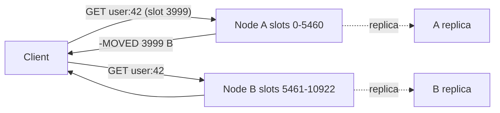

Your Postgres primary serves a session lookup in about a millisecond, and you need it in 50 microseconds because it runs on every request. Your leaderboard query sorts ten million rows and you need the top ten in constant time. Your rate limiter needs an atomic increment with an expiry from two hundred service instances at once. Each of these is a job the relational engine can do and none of them is a job it is good at, because each involves a disk-oriented storage layer, a query planner and MVCC bookkeeping doing work that a hash map in memory does not need.

Redis is what you get when you keep the data structures and throw away the rest. Understanding why that makes it fast also tells you exactly how it becomes slow, how it loses data, and when a single Redis process stops being enough.

## Why a single thread is fast

Redis executes commands on one thread. There is no lock around the keyspace because nothing else touches it. Every command runs to completion before the next one starts, which is what makes `INCR` atomic, `SETNX` a valid lock primitive, and a Lua script an all-or-nothing unit without any transaction machinery.

The reason this is not a bottleneck is that a command touches memory only. A `GET` on a string key is a hash lookup in the main dictionary, a pointer chase to the value, and a write to the client's output buffer. That is a few hundred nanoseconds of CPU. The event loop (`epoll` on Linux) multiplexes thousands of client sockets onto that one thread, so throughput is bounded by how fast one core can parse commands and touch memory: on the order of 100,000 to 1,000,000 simple commands per second per instance depending on hardware and pipelining.

Since Redis 6, network I/O (reading requests from sockets and writing responses back) can be spread over threads, but command execution is still serialised. The mental model holds: one queue, one worker, memory only.

The consequence is the single most important Redis rule. **Any command that takes 10 ms blocks every other client for 10 ms.** A single `KEYS *` on a keyspace of 50 million entries walks the whole dictionary and stalls the instance for seconds. `SMEMBERS` on a set of 5 million members serialises 5 million strings into one response. `DEL` on a huge hash frees millions of allocations synchronously (use `UNLINK`, which frees in a background thread). Redis exposes `SLOWLOG GET` for exactly this reason; the first thing to check when p99 spikes is which command is hogging the loop.

## The data structures and what they cost

A Redis key maps to one of a handful of value types. Each is implemented with two encodings: a compact one for small values and a full data structure for large ones, switched automatically when the value crosses a size threshold (configurable; the defaults are on the order of a hundred elements or a few tens of bytes per element).

| Type | Large encoding | Small encoding | Key commands and cost |
|---|---|---|---|
| String | Raw or embedded SDS (length-prefixed bytes); integers stored as `long` | Same | `GET`/`SET`/`INCR` O(1); `GETRANGE` O(n) |
| List | Quicklist: doubly linked list of listpack nodes | Listpack (one contiguous block) | `LPUSH`/`RPOP` O(1); `LINDEX`/`LRANGE` O(n) into the middle |
| Hash | Hashtable (open chaining, incremental rehash) | Listpack | `HGET`/`HSET` O(1); `HGETALL` O(n) |
| Set | Hashtable, or intset for small integers | Listpack / intset | `SADD`/`SISMEMBER` O(1); `SINTER` O(n·m) |
| Sorted set | Skiplist plus hashtable | Listpack | `ZADD` O(log n); `ZRANGE` O(log n + k); `ZSCORE` O(1) |
| Stream | Radix tree of listpack macro-nodes | Same | `XADD` O(1) amortised; `XRANGE` O(log n + k) |
| HyperLogLog | 12 KiB register array | Sparse | `PFADD`/`PFCOUNT` O(1), ~0.8% error |
| Bitmap | String with bit ops | Same | `SETBIT`/`GETBIT` O(1); `BITCOUNT` O(n) |

The sorted set is the one worth understanding in detail because it is the structure behind leaderboards, rate limiters, delayed queues and time-windowed counters. It is a skiplist (ordered by score, then member) paired with a hash table (member to score). The skiplist gives O(log n) insert and range queries by rank or score; the hash table gives O(1) score lookup for a member. Redis chose a skiplist over a balanced tree because range traversal is a linked-list walk and the implementation is a few hundred lines; the [treaps and skip lists lesson](/learn/advanced-data-structures/balanced-trees/treaps-skip-lists-and-splay) covers the probabilistic balance.

A leaderboard in three commands:

```bash
ZADD leaderboard 1500 alice 1320 bob 2100 carol
ZREVRANGE leaderboard 0 9 WITHSCORES     # top 10, O(log n + 10)
ZREVRANK leaderboard bob                  # bob's position, O(log n)
```

Ten million players, top ten in a few microseconds, and a new score is a `ZADD` that moves one node. The relational equivalent is an `ORDER BY score DESC LIMIT 10` that can use an index, but the rank query (`how many players are above bob?`) is a `COUNT(*)` over an index range and costs O(k) rows scanned.

The small-encoding switch matters for memory. A hash of 50 fields stored as a listpack costs roughly the sum of its bytes plus a small header; the same hash as a hashtable costs an allocation per entry plus pointers, easily 3 to 5 times more. Instagram famously stored hundreds of millions of media-to-user mappings by bucketing them into hashes of about a thousand entries each so every bucket stayed in the compact encoding. If you store many small objects, that pattern is still the cheapest memory you can buy.

## A rate limiter, for real

The sliding-window rate limiter is the canonical Redis use because it needs atomicity across several commands. Without atomicity, two instances read the same count, both allow, and the limit is exceeded.

```python
import time
import redis

r = redis.Redis()

LUA = """
local key, now, window, limit = KEYS[1], tonumber(ARGV[1]), tonumber(ARGV[2]), tonumber(ARGV[3])
redis.call('ZREMRANGEBYSCORE', key, 0, now - window)
local n = redis.call('ZCARD', key)
if n < limit then
  redis.call('ZADD', key, now, now .. '-' .. math.random())
  redis.call('PEXPIRE', key, window)
  return 1
end
return 0
"""
allow = r.register_script(LUA)

def allowed(user_id: str, limit: int = 100, window_ms: int = 60_000) -> bool:
    now = int(time.time() * 1000)
    return allow(keys=[f"rl:{user_id}"], args=[now, window_ms, limit]) == 1
```

The script runs on the single thread, so the remove, count and add cannot interleave with another instance's. `PEXPIRE` means an idle user's key disappears on its own, which is how you stop Redis from becoming a graveyard of every user who ever made one request. The whole thing is O(log n) in the number of requests in the window.

The [Time-based key-value store](/practice/time-based-kv) problem is this same idea in miniature: a sorted structure keyed by timestamp with a floor lookup.

## Persistence: what you actually keep after a crash

Redis is in-memory, so durability is opt-in and every option is a trade.

**RDB snapshots.** Periodically (`save 900 1`, `save 300 10`, and so on), Redis calls `fork()`. The child process writes the entire dataset to a compact binary file while the parent keeps serving. Copy-on-write means the child sees a frozen image without copying memory up front; pages the parent modifies during the snapshot are duplicated by the kernel. The cost is exactly there: on a busy instance with 30 GiB of data, a snapshot can double memory use temporarily and the `fork()` of a large process stalls the main thread for tens of milliseconds while page tables are copied. The failure mode is losing everything since the last snapshot, which is minutes of writes.

**AOF (append-only file).** Every write command is appended to a log. `appendfsync` decides when the file is flushed to disk:

| Setting | Durability | Cost |
|---|---|---|
| `always` | Lose at most one command | An `fsync` per write; throughput drops to disk speed (thousands per second on SSD) |
| `everysec` | Lose at most about one second | An `fsync` per second on a background thread; negligible |
| `no` | Lose whatever the kernel had buffered (often tens of seconds) | None |

The AOF grows without bound, so Redis periodically rewrites it from the current dataset (also via `fork()`). Since Redis 7, the rewrite produces a base RDB file plus incremental AOF segments, which is the hybrid mode: fast to load, bounded loss.

The honest summary a senior engineer gives: with `everysec` (the common default), Redis loses about a second of writes on a power failure. If a second of lost writes is unacceptable, either the data does not belong only in Redis, or you need `always` and accept the throughput. Most production Redis is a cache or a derived store, and a second is fine. Treating it as the system of record for money because "we turned on AOF" is the mistake.

## Eviction: what happens at maxmemory

Set `maxmemory` or Redis grows until the kernel kills it. When the limit is reached, `maxmemory-policy` decides what goes:

- `noeviction`: writes fail with an error. Correct for a store, wrong for a cache.
- `allkeys-lru`: evict the least recently used key from the whole keyspace.
- `volatile-lru`: same, but only among keys with a TTL. If nothing has a TTL, writes fail.
- `allkeys-lfu`: evict the least frequently used, with a decaying counter.
- `volatile-ttl`: evict the key closest to expiry.
- `allkeys-random`: cheap and surprisingly reasonable for uniform access.

The word "LRU" needs a caveat. A true LRU requires a doubly linked list and a hash map with O(1) moves, which is the classic [LRU Cache](/practice/lru-cache) interview design and costs 16 bytes of pointers per key. Redis does not do that. Each key carries a 24-bit last-access clock; on eviction Redis samples `maxmemory-samples` keys (default 5) and evicts the oldest of the sample, keeping a small pool of good candidates between rounds. It is approximately LRU, cheaper, and with 10 samples it is close enough to exact that you cannot tell from the hit rate.

```viz
{"type": "system", "scenario": "lru-cache", "title": "Exact LRU eviction", "caption": "The textbook policy: every access moves the key to the front; eviction takes the tail. Redis approximates this by sampling a handful of keys and evicting the least recently accessed of the sample."}
```

LFU fixes the case LRU gets wrong: a burst scan of cold keys (a nightly report reading every product once) pushes out the hot keys that were used a thousand times. Redis LFU keeps a logarithmic counter per key (a probabilistic increment so 8 bits covers millions of hits) with periodic decay, so a key that was hot yesterday and untouched today loses its protection.

```viz
{"type": "system", "scenario": "lfu-cache", "title": "Frequency-based eviction", "caption": "Keys with high hit counts survive a burst of one-off reads that would flush an LRU cache. The counter must decay, or a key that was hot last week is never evicted."}
```

The [caches and eviction module](/learn/advanced-data-structures/caches-and-eviction/lfu-and-modern-policies) covers why modern caches (Caffeine, Redis LFU) prefer frequency with decay over pure recency.

Expired keys are handled the same lazy way: on access, an expired key is deleted before the read; in the background, Redis samples keys with TTLs and deletes expired ones. A key can therefore be past its TTL and still occupy memory for a while, and a huge batch of keys expiring at the same instant (everything set at deploy time with the same TTL) causes a burst of deletion work. Add jitter to TTLs.

## Cluster mode: when one process is not enough

One Redis process is bounded by one core and one machine's memory. Replication (a replica streams the primary's write log) gives read scaling and failover, and Sentinel automates failover for a single primary. Neither shards the keyspace.

Redis Cluster shards it. The keyspace is divided into 16,384 hash slots; the slot for a key is `CRC16(key) mod 16384`. Each primary owns a range of slots, with replicas per primary. A client sends a command to any node; if that node does not own the slot it replies `-MOVED 3999 10.0.0.7:6379` and the client retries there and caches the mapping. During a slot migration the answer is `-ASK`, meaning "try there for this one command, but the mapping has not settled".



The removal that makes this work: **multi-key operations only work within one slot.** `MGET a b`, `SINTER s1 s2`, a Lua script touching two keys, a `MULTI`/`EXEC` block: all of them fail with `CROSSSLOT` if the keys hash to different slots. Hash tags fix it. Only the part of the key inside the first `{...}` is hashed, so `{user:42}:profile` and `{user:42}:sessions` land together and can be operated on atomically. Design the key names for this before you have data, because renaming a keyspace under load is miserable.

Hot slots are the cluster's version of the hot-partition problem in [sharding](/learn/databases/storage-and-scale/partitioning-and-sharding): a single celebrity key lives on one node and that node's core saturates while the others idle. Client-side caching, replicating the hot key to several keys with a random suffix, or read-from-replica are the standard escapes.

```viz
{"type": "system", "scenario": "consistent-hashing", "title": "Keys distributed across nodes", "caption": "Redis Cluster uses fixed hash slots rather than a consistent-hash ring, but the effect is the same: each key has one owner and moving a node moves only its slots."}
```

Sentinel versus Cluster is a real decision. If the dataset fits in one machine's memory and one core handles the throughput (which describes most caches), a primary with replicas and Sentinel is simpler, supports every multi-key command, and has one fewer class of client bug. Cluster is for when you have outgrown one node's memory or CPU, and it costs you cross-slot operations and a more complex client.

## What Redis is not

Redis is the wrong tool when the working set does not fit in memory (it does not page to disk; it evicts or refuses), when you need secondary indexes or ad hoc queries (you build them yourself out of sets and sorted sets), when you need multi-key transactions across shards, or when the data is the only copy and losing a second of it is a problem. It is the right tool for caches, sessions, rate limits, leaderboards, queues with bounded loss, pub/sub fan-out, and distributed locks with the caveat that a lock in a single Redis is only as safe as that Redis's availability.

## Senior signals

- You explain Redis's speed as "one thread, memory only, no locks" and immediately follow with the consequence: any O(n) command on a big key stalls every client, so you check `SLOWLOG` first and use `SCAN`, `UNLINK` and `HSCAN` instead of `KEYS`, `DEL` and `HGETALL` on large values.
- You know the sorted set is a skiplist plus a hash table and can say why that gives O(log n) range queries and O(1) score lookup, and you reach for it for leaderboards, sliding windows and delayed jobs.
- You state the durability of each persistence setting in units of lost writes: "everysec loses about a second", and you decide from that whether Redis can be the system of record for a given key.
- You know `allkeys-lru` is sampled, not exact, and you choose LFU when a scan of cold keys would flush the cache.
- You design key names with hash tags before adopting Cluster, and you choose Sentinel when one node's memory and core are enough.
- You add jitter to TTLs and cap the size of any single key, because a million keys expiring together or one 2 GiB hash is a self-inflicted outage.

## Check yourself

```quiz
- q: >-
    A service's p99 latency to Redis jumps from 0.3 ms to 40 ms every night at 02:00. CPU on the Redis host is low. The most likely cause is:
  options: ["A scheduled job running one O(n) command, such as KEYS or SMEMBERS", "An RDB snapshot filling the disk, so that each write waits for space", "The backup job saturating the network link between clients and Redis", "The client connection pool being exhausted by nightly batch traffic"]
  answer: 0
  explanation: >-
    Redis executes commands serially on one thread; a single slow command blocks the event loop and delays everyone behind it, and one core being busy barely registers as host CPU. Check SLOWLOG. Pool exhaustion would show as client-side timeouts, not a Redis-side stall correlated with a job.
- q: >-
    You store user sessions in Redis with appendfsync everysec and a nightly RDB. A power failure hits the host. What do you lose?
  options: ["Nothing, because every write is appended to the AOF first", "Roughly the last second or so of acknowledged writes, at most", "Everything written since the last nightly RDB snapshot", "Only the keys that carried a TTL when the power failed"]
  answer: 1
  explanation: >-
    With everysec the AOF is fsynced roughly once per second, so at most about a second of acknowledged writes is lost; appending is not the same as fsyncing. The RDB is irrelevant when a newer AOF exists. Only appendfsync always bounds loss to a single command, at the cost of disk-speed throughput.
- q: >-
    A nightly report reads every product key once. The next morning the cache hit rate for the hot product pages has collapsed. Which change fixes this with the least effort?
  options: ["Switch maxmemory-policy from allkeys-lru to allkeys-lfu", "Increase maxmemory so the report's keys fit alongside the hot ones", "Point the report at Postgres directly so it bypasses the cache", "Switch maxmemory-policy from allkeys-lru to volatile-ttl"]
  answer: 0
  explanation: >-
    The scan touched each cold key once, which under LRU makes them newer than the hot keys and evicts the hot ones. LFU keeps frequency counts with decay, so a single touch does not out-rank a thousand hits. Moving the report also works but is a bigger change; more memory only delays the same effect, and volatile-ttl evicts by expiry, not by use.
- q: >-
    In Redis Cluster, MGET order:1 order:2 fails with CROSSSLOT. The cheapest fix that keeps atomicity is:
  options: ["Wrap the two GETs in a Lua script, which runs atomically", "Rename the keys with a shared hash tag, such as {orders}:1", "Move from Cluster to Sentinel so every key lives on one node", "Retry the MGET against each node in turn until one accepts"]
  answer: 1
  explanation: >-
    Multi-key commands must target one slot; a hash tag makes only the bracketed part hashed, so tagged keys share a slot. A Lua script has the same single-slot restriction. Sentinel would work but abandons sharding entirely.
- q: >-
    Why does Redis implement sorted sets with a skiplist rather than a balanced binary tree?
  options: ["Skiplists use less memory per element than any balanced tree", "Skiplists guarantee worst-case O(log n), which trees cannot", "Balanced trees cannot store members that share the same score", "Range queries are a list walk, and the code is far simpler"]
  answer: 3
  explanation: >-
    A skiplist gives expected O(log n) search and O(k) traversal for a range via the bottom-level linked list, with the same bounds as a tree and far less code than a red-black tree. Its bounds are probabilistic, not guaranteed, and its memory is comparable to a tree's, so those options are wrong.
```
