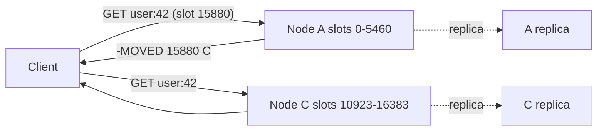

Your Postgres primary serves a session lookup in about a millisecond, and you need it in 50 microseconds because it runs on every request. Your leaderboard query sorts ten million rows and you need the top ten in constant time. Your rate limiter needs an atomic increment with an expiry from two hundred service instances at once. The relational engine can do each of these jobs and is good at none of them, because each involves a disk-oriented storage layer, a query planner and MVCC bookkeeping doing work that a hash map in memory does not need.

Redis is what you get when you keep the data structures and throw away the rest. Why that makes it fast also explains how it becomes slow, loses data, runs out of memory, and outgrows one process. This lesson is written against Redis 7.x. Redis 7.4 (2024) left the BSD licence for source-available ones; the Linux Foundation forked 7.2.4 as Valkey, which keeps the protocol, commands and mechanisms described here, and Redis 8 (2025) added AGPLv3 as an option.

## One thread, one queue, memory only

Redis executes commands on one thread, so the keyspace needs no lock. Every command runs to completion before the next starts, which is what makes `INCR` atomic, `SET key value NX` a valid lock primitive, and a Lua script an all-or-nothing unit with no transaction machinery.

Trace one `GET session:9f3` through the event loop (Redis's own `ae` library over `epoll` on Linux, `kqueue` on BSD and macOS):

1. `epoll_wait` returns: the client's socket is readable.
2. `readQueryFromClient` calls `read()` into the client's query buffer and parses the RESP frame `*2\r\n$3\r\nGET\r\n$11\r\nsession:9f3\r\n`.
3. `processCommand` looks up `GET` in the command table, checks ACLs, arity, `maxmemory` (for writes) and cluster slot ownership, then calls the handler.
4. The handler hashes the key, probes the main dictionary, follows one pointer to the value object and appends `$36\r\n…` to the client's output buffer. This step is a few hundred nanoseconds.
5. Before the next `epoll_wait`, `beforeSleep` writes pending AOF data, then flushes every client's output buffer with `write()`.

Steps 1, 2 and 5 are system calls and parsing; step 4 is the only real work, which is why pipelining matters: 100 commands in one packet share one `read()` and one `write()`. On one modern core, simple commands run at on the order of 100,000–200,000 per second without pipelining and over a million with it; the exact figure depends on value size, TLS and the NIC, so measure with `redis-benchmark` on your hardware. Every `hz` tick (10 per second by default) `serverCron` does housekeeping: expiring keys, incremental rehashing, checking whether a snapshot is due.

```viz
{"type": "concurrency", "algorithm": "event-loop",
 "title": "One loop, many sockets",
 "caption": "The visualiser shows a JavaScript event loop, and Redis's is the same shape: wait for readiness, run each ready callback to completion, never block. A Redis command is one such callback, so one slow command delays every client queued behind it."}
```

### I/O threads, and the rule that follows

Since Redis 6, `io-threads` can spread the socket `read()`/`write()` and RESP parsing across threads (reads also need `io-threads-do-reads yes`), but command execution stays on the main thread. Background threads (`bio`) handle closing files, AOF `fsync` and lazy freeing. The model holds: one executor, memory only.

The consequence is the most important Redis rule. **A command that takes 10 ms blocks every client for 10 ms.** `KEYS *` over 50 million keys walks the whole dictionary and stalls for seconds. `SMEMBERS` on a 5-million-member set serialises 5 million strings into one reply. `DEL` on a hash with millions of fields frees millions of allocations synchronously; `UNLINK` hands that to a background thread. `SLOWLOG GET` (entries over `slowlog-log-slower-than`, 10,000 µs by default) is the first thing to read when p99 spikes, and `SCAN`, `HSCAN` and `SSCAN` replace the O(n) commands with cursors.

## Under the hood: what one key costs

The keyspace is a hash table (`dict`) with power-of-two bucket arrays and chaining. When it needs to grow, Redis allocates the new table and moves entries **incrementally**: each dictionary operation migrates one bucket, and `serverCron` spends up to a millisecond per tick on it, so a resize from 64 million to 128 million buckets never stops the world. While a snapshot child exists, Redis postpones resizing unless the table is badly overloaded, because rehashing would force the kernel to copy every page it touches (see copy-on-write below).

Each key costs, before its payload:

| Piece | Size on 64-bit | What it is |
|---|---|---|
| Bucket slot | 8 bytes (about 1 per key at load factor ≈ 1) | Pointer in the bucket array |
| `dictEntry` | 24 bytes | Key pointer, value pointer, next-in-chain pointer |
| Key string (SDS) | 3-byte header + key bytes + 1 | Length-prefixed, binary-safe string |
| `redisObject` | 16 bytes | 4-bit type, 4-bit encoding, 24-bit LRU/LFU field, refcount, pointer |
| TTL, if any | another `dictEntry` + slot in the `expires` table | Keys with an expiry live in a second dictionary |

jemalloc rounds each allocation up to a size class, so a short string key costs on the order of 50–100 bytes of bookkeeping (`MEMORY USAGE key` reports it): 5–10 GB of overhead for a hundred million small keys before a byte of value. That is the arithmetic behind the compact encodings.

## Encodings and their exact thresholds

Every type has a compact encoding for small values and a full structure for large ones; `OBJECT ENCODING key` shows which. The Redis 7.x defaults:

| Type | Compact encoding | Converts when | Full encoding |
|---|---|---|---|
| String | `int` (fits a 64-bit signed integer; 0–9999 are shared objects) or `embstr` (≤ 44 bytes, one allocation with the object header) | Longer than 44 bytes, or modified by `APPEND`/`SETRANGE` | `raw` (separate SDS allocation, up to 512 MB) |
| Hash | `listpack` | More than `hash-max-listpack-entries` (512) fields, or any field or value over `hash-max-listpack-value` (64 bytes) | `hashtable` |
| Sorted set | `listpack` | More than `zset-max-listpack-entries` (128), or a member over `zset-max-listpack-value` (64 bytes) | `skiplist` (skiplist plus a member→score dict) |
| Set | `intset` (all members integers) up to `set-max-intset-entries` (512); since 7.2, `listpack` up to `set-max-listpack-entries` (128) / 64-byte members | A non-integer member (intset), or the size limits | `hashtable` |
| List | `listpack` for small lists (7.2+) | Exceeds one node's limit | `quicklist`: doubly linked list of listpack nodes, each at most 8 KB (`list-max-listpack-size -2`) |
| Stream | Radix tree of listpack nodes (≤ 4096 bytes or 100 entries each) | — | — |

The 44 is not arbitrary: a 16-byte object header, a 3-byte SDS header, 44 bytes and a terminating NUL add up to exactly 64 bytes, one jemalloc size class. Redis 6.2 and earlier used `ziplist` in place of `listpack`; the old configuration names still work as aliases.

A **listpack** is one contiguous allocation: a 6-byte header (total bytes, element count), entries, and an `0xFF` end byte. Each entry is an encoding byte, the data, and a 1–5 byte back-length so the list can be walked backwards. A small integer costs 2 bytes, a 5-byte string 7. Lookup is a linear scan, which is why the thresholds are small: `HGET` on a 512-field listpack scans up to 1,024 elements, still only microseconds, while the hashtable version of the same hash costs roughly 70 bytes per field (entry, two SDS strings, bucket) against about 13 in the listpack.

Trace a hash crossing the line:

| Step | Command | `OBJECT ENCODING` | Approximate memory |
|---|---|---|---|
| 1 | `HSET u:1 f1 v1 … f512 v512` (short values) | `listpack` | ~7 KB |
| 2 | `HSET u:1 f513 v513` | `hashtable` | ~36 KB: 513 entries rebuilt in one O(n) pass on the main thread |
| 3 | `HDEL` fields down to 10 | `hashtable` | shrinks per field, stays a hashtable |
| 4 | Restart, loading the RDB | `listpack` | the loader re-encodes values that fit |

The conversion itself is one cheap pass. The costs that matter are the fivefold memory step, multiplied across millions of keys, and the one-way ratchet: hashes and sets do not convert back while the server runs (7.2 lists are the exception, converting back when a list shrinks to half the limit, which avoids flapping). Raising the thresholds to 1,000 saves memory and makes each lookup a longer linear scan; Instagram's 2011 write-up did exactly that (with the older `hash-zipmap-max-entries` setting), bucketing hundreds of millions of media-to-user mappings into hashes of 1,000 fields and reporting roughly a fourfold memory saving over one string key per mapping.

## Sorted sets: the structure behind leaderboards

Past 128 members a sorted set is a **skiplist** ordered by (score, member) plus a dict from member to score. The skiplist promotes each node to the next level with probability 1/4, up to 32 levels, and each forward pointer stores a **span** (how many nodes it skips), so summing spans on the way down gives a member's rank in O(log n). The dict gives O(1) `ZSCORE`. Its author [chose a skiplist](https://news.ycombinator.com/item?id=1171423) over a balanced tree because range commands walk the bottom level like a linked list and the simple structure made rank support a small patch; the [treaps and skip lists lesson](/learn/advanced-data-structures/balanced-trees/treaps-skip-lists-and-splay) covers the probabilistic balance.

```bash
ZADD leaderboard 1500 alice 1320 bob 2100 carol
ZREVRANGE leaderboard 0 9 WITHSCORES     # top 10: O(log n + 10)
ZREVRANK leaderboard bob                  # 2 (0-based): O(log n) via spans
ZINCRBY leaderboard 300 bob               # moves one node, O(log n)
```

With ten million players the top ten costs a descent of about 12 levels plus ten steps. The relational equivalent serves the top ten from an index, but "how many players are above bob?" is a `COUNT(*)` over an index range, O(k) in the rows above him. HyperLogLog is the other structure worth knowing by size: 16,384 six-bit registers in 12 KB dense form, a standard error of 0.81%, sparse encoding while small (the [HyperLogLog lesson](/learn/advanced-data-structures/probabilistic-structures/count-min-sketch-and-hyperloglog) derives it).

## A rate limiter, traced

Rate limiting needs atomicity across several operations from many clients. The first version most teams write is a fixed window:

```python
import time
import redis

def allowed_fixed(r: redis.Redis, user_id: str, limit: int = 100) -> bool:
    window = int(time.time() // 60)
    key = f"rl:{user_id}:{window}"
    count = r.incr(key)          # atomic on the server
    if count == 1:
        r.expire(key, 60)        # a second round trip: not atomic with INCR
    return count <= limit
```

Two failures hide in it. If the process dies between `INCR` and `EXPIRE`, the key never expires, and without the window in its name that user is locked out for good. Fix: send both in one `MULTI`/`EXEC` with `EXPIRE key 60 NX` (7.0+) or use a script. The second failure is the boundary: 100 requests at 12:00:59.9 and 100 more at 12:01:00.1 are all allowed, 200 in 0.2 seconds against a limit of 100 a minute.

A sliding-window log closes that gap by storing each accepted request's timestamp in a sorted set, inside one script:

```python
import time, uuid
import redis

r = redis.Redis()

SLIDING_LOG = """
local key, now, window, limit = KEYS[1], tonumber(ARGV[1]), tonumber(ARGV[2]), tonumber(ARGV[3])
redis.call('ZREMRANGEBYSCORE', key, 0, now - window)   -- drop entries at or before now - window
if redis.call('ZCARD', key) < limit then
  redis.call('ZADD', key, now, ARGV[4])                 -- ARGV[4]: unique request id
  redis.call('PEXPIRE', key, window)                    -- idle users' keys disappear
  return 1
end
return 0
"""
allow = r.register_script(SLIDING_LOG)   # EVALSHA with fallback to EVAL

def allowed(user_id: str, limit: int = 100, window_ms: int = 60_000) -> bool:
    now = int(time.time() * 1000)
    return allow(keys=[f"rl:{{{user_id}}}"], args=[now, window_ms, limit, uuid.uuid4().hex]) == 1
```

Trace it with `limit = 3`, `window = 1000` ms:

| t (ms) | Removed (score ≤ t − 1000) | Count before | Decision | Set after |
|---|---|---|---|---|
| 0 | — | 0 | allow | {0} |
| 200 | — | 1 | allow | {0, 200} |
| 400 | — | 2 | allow | {0, 200, 400} |
| 600 | — | 3 | reject (not recorded) | {0, 200, 400} |
| 1100 | 0 | 2 | allow | {200, 400, 1100} |
| 1250 | 200 | 2 | allow | {400, 1100, 1250} |
| 1300 | — | 3 | reject | {400, 1100, 1250} |

The script runs on the single thread, so no other client's remove-count-add can interleave. It costs O(log n) per call and up to `limit` entries per user: at 100 entries of ~40 bytes and a million active users, about 4 GB, where a sliding-window counter or a token bucket in a two-field hash costs constant memory. The hash tag gives the key a well-defined slot in cluster mode. Take the time from one clock (the caller's, or `TIME` in the script), never both. The [rate-limiting algorithms lesson](/learn/networking/network-algorithms/rate-limiting-algorithms) compares the variants; the [Time-based key-value store](/practice/time-based-kv) problem is the same sorted-by-timestamp idea.

## Persistence: RDB snapshots and copy-on-write

**RDB snapshots.** With the 7.x default `save 3600 1 300 100 60 10000` (snapshot after an hour if one key changed, five minutes if 100 did, one minute if 10,000 did), Redis calls `fork()`. The child writes the dataset to a compact file while the parent keeps serving, and **copy-on-write** gives the child a frozen image: parent and child share every page until the parent writes to one, and then the kernel copies that page. The [virtual memory lesson](/learn/systems/operating-systems/virtual-memory) covers the page-table mechanics.

Work it for a 30 GiB instance whose snapshot takes 100 seconds:

1. `fork()` copies the page tables: 30 GiB / 4 KiB = 7.9 million entries × 8 bytes ≈ 60 MiB. Redis's latency documentation measured about 9–13 ms per GB on bare metal and modern VMs (and over 200 ms per GB on old Xen instances), so the main thread stops for roughly 300–400 ms. `INFO stats` reports it as `latest_fork_usec`.
2. During the 100 seconds, 20,000 writes a second land on random keys: 2 million writes. The expected number of distinct 4 KiB pages touched is P(1 − e^(−w/P)) with P = 7.9 million and w = 2 million, about 1.8 million pages: **≈ 6.7 GiB** of extra memory.
3. With transparent huge pages enabled, pages are 2 MiB and there are only 15,360 of them. Two million random writes touch every one: **all 30 GiB** is copied, and the host needs 60 GiB.

That is why Redis warns at startup when THP is enabled, why `vm.overcommit_memory = 1` is required (otherwise the kernel may refuse the fork), and why you leave headroom of 20–50% of the dataset depending on write rate. `INFO persistence` reports `rdb_last_cow_size`, so measure your own number. RDB loses everything since the last completed snapshot: a minute to an hour of writes.

## Persistence: the append-only file

The **AOF** appends every write command to a log, and `appendfsync` decides when the file reaches the disk. Redis writes the AOF buffer to the file in `beforeSleep`, before sending replies, so an acknowledged write is at least in the kernel's page cache and a process crash (OOM kill, segfault) loses nothing acknowledged; `fsync` matters for power loss and kernel crashes. The exception is a stalled disk under `everysec`, when Redis may hold up to two seconds of writes in its own buffer.

| Setting | Power loss or kernel crash loses | Cost |
|---|---|---|
| `always` | No acknowledged writes | One `fsync` per event-loop iteration, grouping all clients' writes; throughput bounded by fsync latency |
| `everysec` (default when AOF is on) | About 1 s; up to about 2 s if the disk stalls | A background-thread `fsync` each second |
| `no` | Whatever the kernel had not flushed: up to ~30 s with Linux's default dirty-page expiry | None |

The AOF grows forever, so when it has doubled since the last rewrite (`auto-aof-rewrite-percentage 100`, minimum 64 MB) Redis forks a child to write the current dataset. Before 7.0 the parent buffered every write made meanwhile and appended it at the end, a memory spike and a stall. **Multi-part AOF** (7.0) uses a base file (RDB format by default), incremental files and a manifest: fresh writes go to a new incremental file while the child writes a new base, and a manifest swap retires the old files.

Replication is asynchronous, so a failover can lose more than the table shows. If that is unacceptable, either the data does not belong only in Redis or you need `always` plus a replica acknowledgement (`WAIT 1 100`). Most production Redis is a cache or a derived store, where a second is fine (see [caching layers](/learn/databases/data-modeling-and-evolution/caching-layers)). The same arithmetic applies to locks: `SET lock:x token NX PX 30000` is a correct lease on one node, and a failover that loses the key hands the lock to a second holder, which is why [distributed locks](/learn/system-design/distributed-systems/distributed-locks-and-coordination) need fencing tokens.

## Eviction at maxmemory

Without `maxmemory` (0, unlimited, on 64-bit) Redis grows until the kernel kills it. At the limit, Redis evicts keys chosen by `maxmemory-policy` before executing a command until it is back under:

| Policy | Candidates | Chooses by |
|---|---|---|
| `noeviction` (default) | none: writes fail with an OOM error | — |
| `allkeys-lru` / `volatile-lru` | all keys / keys with a TTL | approximate least recently used |
| `allkeys-lfu` / `volatile-lfu` | all / with TTL | approximate least frequently used, with decay |
| `allkeys-random` / `volatile-random` | all / with TTL | random |
| `volatile-ttl` | keys with a TTL | nearest expiry |

"LRU" needs a caveat. An exact LRU needs a doubly linked list and a hash map, the classic [LRU Cache](/practice/lru-cache) design, at 16 bytes of pointers per key. Redis instead stores a 24-bit clock (one-second resolution) in each object's header. To evict, it samples `maxmemory-samples` keys (default 5), inserts them into a 16-entry pool of the idlest candidates seen so far, and evicts the idlest in the pool. With 10 samples the hit rate is hard to tell from exact LRU.

```viz
{"type": "system", "scenario": "lru-cache", "title": "Exact LRU eviction", "caption": "The textbook policy: every access moves the key to the front; eviction takes the tail. Redis approximates this by sampling a handful of keys into a small pool and evicting the least recently accessed of the pool."}
```

**LFU** reuses the same 24 bits: 16 bits of last-decrement time in minutes and an 8-bit **logarithmic counter**. A new key starts at 5, so it is not evicted the instant it arrives. Each access increments the counter with probability 1 / ((counter − 5) × `lfu-log-factor` + 1), with the factor at 10 by default:

| Counter | Chance an access at the previous value moves it here | Expected accesses from 5 |
|---|---|---|
| 6 | 1 | 1 |
| 7 | 1/11 | 12 |
| 10 | 1/41 (from 9) | 105 |
| 18 | 1/121 (from 17) | ~790 |
| 255 | — | ~311,000 |

The shipped `redis.conf` tabulates the result at factor 10: 10 after 100 accesses, 18 after 1,000, 142 after 100,000. Every `lfu-decay-time` minute (default 1) of idleness subtracts one, applied lazily when the key is next touched or sampled. A nightly report that reads every product key once moves a cold key from 5 to 6; the hot keys at 18 or more survive, whereas under LRU the report's keys would be the most recent and the hot keys would go.

```viz
{"type": "system", "scenario": "lfu-cache", "title": "Frequency-based eviction", "caption": "Keys with high hit counts survive a burst of one-off reads that would flush an LRU cache. The counter must decay, or a key that was hot last week is never evicted."}
```

Expiry is lazy plus sampled: an expired key is deleted when accessed, and an active cycle samples 20 keys at a time from the TTL dictionary, repeating while more than 10% of a sample has expired, within a quarter of the CPU. A million keys given the same TTL at deploy time all expire in the same second and compete with real traffic, so add jitter. The [caches and eviction module](/learn/advanced-data-structures/caches-and-eviction/lfu-and-modern-policies) covers why modern caches prefer frequency with decay.

## Cluster mode: 16,384 slots

One process is bounded by one core and one machine's memory. Replicas with Sentinel for failover give read scaling and availability, but do not shard. **Redis Cluster** does: the keyspace is 16,384 hash slots, and a key's slot is `CRC16(key) mod 16384` using the XMODEM variant (polynomial 0x1021, initial value 0). The number is a message-size choice: every node's gossip heartbeat carries its slot ownership as a bitmap, 16,384 bits = 2 KB, where 65,536 slots would cost 8 KB per ping, and clusters beyond about 1,000 primaries are not a design target.

Only the part of the key inside the first `{…}` is hashed, if that part is non-empty:

| Key | Hashed bytes | CRC16 | Slot |
|---|---|---|---|
| `foo` | `foo` | 44950 | 12182 |
| `user:42` | `user:42` | 15880 | 15880 |
| `{user:42}:profile` | `user:42` | 15880 | 15880 |
| `{user:42}:sessions` | `user:42` | 15880 | 15880 |
| `foo{bar}{zap}` | `bar` (first tag only) | 37829 | 5061 |
| `foo{}{bar}` | whole key (first tag empty) | 57515 | 8363 |
| `foo{{bar}}zap` | `{bar` | 53167 | 4015 |

Three primaries split the slots as 0–5460, 5461–10922 and 10923–16383. A client sending `GET user:42` to the first node gets `-MOVED 15880 10.0.0.9:6379`, retries on the owner and caches the slot map (refreshed with `CLUSTER SHARDS` in 7.0+). Multi-key operations (`MGET`, `SINTER`, `MULTI`/`EXEC`, a Lua script with two keys) fail with `CROSSSLOT` unless every key is in one slot, which is what hash tags are for. Tag by the entity that must be atomic, such as `{user:42}`; tagging by type (`{orders}:1`, `{orders}:2`) puts every order in slot 105 on one node and turns the cluster back into one Redis.



## Resharding and failover

**Resharding** moves a slot while it serves traffic. Moving slot 15880 from C to a new node D:

1. D: `CLUSTER SETSLOT 15880 IMPORTING <C-id>`; C: `CLUSTER SETSLOT 15880 MIGRATING <D-id>`.
2. Loop: `CLUSTER GETKEYSINSLOT 15880 100` on C, then `MIGRATE` those keys to D. Each key is serialised, restored on D and deleted from C atomically; both nodes block while a key moves, so a 1 GB key is a multi-second stall.
3. Meanwhile C serves keys it still holds; a request for a key already moved (or a new key) gets `-ASK 15880 D`: the client sends `ASKING` then the command to D, once, without updating its slot map.
4. `CLUSTER SETSLOT 15880 NODE <D-id>` on the nodes ends the migration; C now answers `-MOVED`, and clients update their maps.

```viz
{"type": "system", "scenario": "consistent-hashing", "title": "Keys distributed across nodes", "caption": "Redis Cluster uses fixed hash slots rather than a consistent-hash ring, but the effect is the same: each key has one owner and moving a node moves only its slots."}
```

Failover is by majority of primaries: a primary unreachable for `cluster-node-timeout` (15,000 ms by default) is marked failed and one of its replicas is promoted, preferring the one with the most replicated data. Unreplicated writes on the old primary are lost, and a primary cut off on the minority side of a partition keeps accepting writes for up to the node timeout, which are then discarded. Redis's [cluster documentation](https://redis.io/docs/latest/operate/oss_and_stack/management/scaling/) says plainly that Redis Cluster does not guarantee strong consistency.

## Hot keys and big keys, in numbers

A flash sale sends 500,000 reads a second to `product:7`, a 2 KB value, which lives in one slot on one primary whatever the shard count. Two limits bind: CPU (500,000 is several times one core's 100,000–200,000 without pipelining) and bandwidth (500,000 × 2 KB = 1 GB/s, 8 Gbit/s, most of a 10 Gbit NIC; at 10 KB values it would be 41 Gbit/s). The escapes, cheapest first:

- **Client-side caching.** Redis 6+ tracks which keys a client read and pushes invalidations; an in-process copy with a one-second TTL turns 500,000 reads into a few hundred.
- **Read replicas.** Each replica adds a core and a NIC, for bounded staleness.
- **Key splitting.** Store N copies and read a random one: at 75,000 reads a second per node (half of 150,000), N = ⌈500,000 / 75,000⌉ = 7. Check where copies land: `product:7:0` to `product:7:3` hash to slots 14585, 10456, 6331 and 2202, so on three primaries two of the four copies share the middle node. Writes now cost N.

This is the hot-partition problem from [partitioning and sharding](/learn/databases/storage-and-scale/partitioning-and-sharding), concentrated on one key. Big keys are the other asymmetric load: one hash of 10 million fields makes `HGETALL`, `DEL`, `MIGRATE` and replica resynchronisation into multi-second events on one node. `redis-cli --bigkeys` finds them, `--hotkeys` works when an LFU policy is set, and the fix is a key design that caps element counts.

## Choosing a deployment and a durability level

**Sentinel or Cluster?** If the dataset fits in one machine's memory and one core handles the throughput, as for most caches, a primary with replicas and Sentinel is simpler and supports every multi-key command. Cluster is for when one node's memory or CPU is not enough.

| Option | Scales | Multi-key atomicity | Data loss on failure | Operational cost |
|---|---|---|---|---|
| Single node, RDB only | One core, one machine's RAM | Everything | Minutes of writes | Lowest; downtime on host failure |
| Primary + replicas + Sentinel, AOF `everysec` | Reads across replicas | Everything | ~1 s on power loss, plus unreplicated writes | Moderate: Sentinel quorum |
| Redis Cluster | Memory and writes across primaries | Within one slot only | Unreplicated and minority-side writes | Highest: slot planning, resharding, smart clients |
| Memcached | Multi-threaded, client-side sharding | None (strings only) | Everything on restart | Low; Netflix's EVCache is built on it |
| Postgres table as a cache | One primary | Full transactions | None acknowledged | Zero new systems; ~1 ms instead of ~0.1 ms |

## Failure modes

| Symptom | Diagnosis | Fix |
|---|---|---|
| p99 jumps from 0.3 ms to 40 ms at the same time each night; host CPU low | One O(n) command (`KEYS`, `SMEMBERS`, a long Lua script) holds the thread; `SLOWLOG GET` names it | `SCAN` cursors, capped key sizes, `UNLINK` |
| Latency spike of hundreds of ms every few minutes, memory briefly near double | `fork()` for RDB or AOF rewrite (`latest_fork_usec`, `rdb_last_cow_size`); THP enabled | Disable THP, snapshot on a replica, leave headroom |
| Primary restarts and every replica is suddenly empty | No persistence plus auto-restart: it came back empty and replicas synced that | Never auto-restart a primary without persistence; let Sentinel fail over |
| Writes fail with `OOM command not allowed` | `maxmemory` reached under `noeviction`, or `volatile-*` with no TTL'd keys | An `allkeys-*` policy for caches; alert on `used_memory` |
| Memory grows fivefold after a launch, key count unchanged | Values crossed a listpack threshold (a 65-byte field, a 513th hash field, a 129th sorted-set member) | Shorter fields, bucketing or tuned thresholds; check `OBJECT ENCODING` |
| One cluster node at 100% CPU, the others idle | Hot key or hot hash tag on one slot | Client-side caching, replicas, split keys on checked slots, re-tag by entity |
| Acknowledged writes missing after a failover | Asynchronous replication | `WAIT` for critical writes, or keep the record elsewhere |

## Interviewer follow-ups

**"Redis is single-threaded. How does it do a million operations a second, and when does it not?"** Model answer: commands touch memory only, `epoll` multiplexes the sockets, pipelining amortises system calls and `io-threads` offload socket I/O; the ceiling is one core's command execution, and one O(n) command stalls everyone. Common wrong answer: "it has been multi-threaded since Redis 6", which confuses I/O threads with execution.

**"Make a rate limiter correct across 200 app instances."** Model answer: check, increment and expiry in one atomic unit (a Lua script, or `MULTI` with `INCR` and `EXPIRE … NX`), a hash tag so the key has one slot, and a sliding log or token bucket if the boundary burst matters. Common wrong answer: `GET`, compare in the application, then `SET`, which races between instances.

**"Can Redis be the system of record?"** Model answer: state the loss in units: about a second on power failure with `everysec`, plus unreplicated writes on failover, which `WAIT` narrows but does not close; if that is acceptable for the key, yes, otherwise keep the record in a database. Common wrong answer: "yes, turn on AOF", which ignores failover.

**"One key is saturating a shard."** Model answer: find it (`--hotkeys`, `OBJECT FREQ`), then client-side caching, replica reads, or N copies on checked slots, with the write fan-out cost stated. Common wrong answer: "add shards", when one key lives on one shard whatever the cluster size.

## What mid-level engineers get wrong

- **`KEYS` or `HGETALL` in production code**: harmless at 1,000 keys, an outage at 50 million.
- **`INCR` then `EXPIRE` as two calls**: a crash between them strands a key with no TTL.
- **`noeviction` on a cache**, which then rejects writes instead of evicting.
- **Sizing the host at dataset size**, with no copy-on-write headroom.
- **Hash-tagging by type** (`{sessions}:…`), putting every such key on one node.

## Exercises

The first exercise is the function every cluster client implements; the second is the sliding-window script's logic, without Redis.

```exercise
id: redis-cluster-key-slot
title: Compute a Redis Cluster hash slot
prompt: |
  Implement `key_slot(key)`, returning the Redis Cluster hash slot (0-16383)
  for an ASCII key.

  - CRC16 is the XMODEM variant: polynomial 0x1021, initial value 0, no
    reflection, no final XOR. Process each byte by XORing it into the high
    byte of the 16-bit register, then shifting left 8 times, XORing with
    0x1021 whenever the bit shifted out was 1.
  - Hash tags: find the first `{`. If a `}` occurs after it and at least one
    character lies between them, hash only those characters. Otherwise hash
    the whole key.
  - The slot is the CRC16 value mod 16384.
languages: [python, javascript]
entry: key_slot
starter:
  python: |
    def key_slot(key):
        # 1. apply the hash-tag rule
        # 2. CRC16-XMODEM over the bytes
        # 3. mod 16384
        return 0
  javascript: |
    function key_slot(key) {
      // 1. apply the hash-tag rule
      // 2. CRC16-XMODEM over the bytes (charCodeAt for ASCII)
      // 3. mod 16384
      return 0;
    }
tests:
  - args: ["foo"]
    expected: 12182
  - args: ["123456789"]
    expected: 12739
    label: CRC16-XMODEM check value 0x31C3
  - args: ["{user:42}:profile"]
    expected: 15880
    label: hash tag selects user:42
  - args: ["foo{}{bar}"]
    expected: 8363
    label: an empty first tag hashes the whole key
  - args: [""]
    expected: 0
    label: empty key
  - args: ["foo{bar}{zap}"]
    expected: 5061
    hidden: true
    label: only the first tag counts
  - args: ["foo{{bar}}zap"]
    expected: 4015
    hidden: true
    label: the tag is the text between the first open brace and the next close brace
  - args: ["{bar"]
    expected: 4015
    hidden: true
    label: an unclosed brace hashes the whole key
hints:
  - "Keep the register in 16 bits: after each shift, mask with 0xFFFF (Python) or `& 0xffff` (JS)."
  - "Search for `}` starting one position after the `{`, not from the start of the key."
```

```exercise
id: sliding-window-log-limiter
title: Replay a sliding-window-log rate limiter
prompt: |
  Implement `rate_limit(requests, limit, window_ms)`. `requests` is a list of
  `[user, now_ms]` pairs in non-decreasing time order. Return a list of
  booleans, one per request, using the sliding-window-log rule from the
  lesson's Lua script, applied per user:

  1. Remove the user's logged timestamps that are less than or equal to
     `now_ms - window_ms`.
  2. If the user has fewer than `limit` logged timestamps, allow the request
     and log `now_ms`. Otherwise reject it and log nothing.

  Several requests may share a timestamp; each accepted one is logged
  separately.
languages: [python, javascript]
entry: rate_limit
starter:
  python: |
    def rate_limit(requests, limit, window_ms):
        return []
  javascript: |
    function rate_limit(requests, limit, window_ms) {
      return [];
    }
tests:
  - args: [[["u", 0], ["u", 200], ["u", 400], ["u", 600], ["u", 1100], ["u", 1250], ["u", 1300]], 3, 1000]
    expected: [true, true, true, false, true, true, false]
    label: the traced example
  - args: [[["a", 0], ["b", 0], ["a", 10], ["b", 10]], 1, 1000]
    expected: [true, true, false, false]
    label: users are independent
  - args: [[["u", 0], ["u", 1000]], 1, 1000]
    expected: [true, true]
    label: an entry exactly one window old has expired
  - args: [[], 5, 1000]
    expected: []
    label: no requests
  - args: [[["u", 0], ["u", 500], ["u", 999], ["u", 1000]], 1, 1000]
    expected: [true, false, false, true]
    hidden: true
    label: rejected requests are not logged
  - args: [[["u", 5], ["u", 5], ["u", 5]], 2, 1000]
    expected: [true, true, false]
    hidden: true
    label: same-millisecond requests
  - args: [[["u", 900], ["u", 950], ["u", 1000], ["u", 1050], ["u", 1899], ["u", 1950]], 2, 1000]
    expected: [true, true, false, false, false, true]
    hidden: true
    label: no burst at a fixed-window boundary
  - args: [[["u", 0], ["u", 1]], 0, 1000]
    expected: [false, false]
    hidden: true
    label: a limit of zero rejects everything
hints:
  - "Keep a dictionary from user to a list (or deque) of accepted timestamps; since time never goes backwards, expired entries are always at the front."
  - "The removal condition is `ts <= now_ms - window_ms`, matching ZREMRANGEBYSCORE's inclusive bound."
```

## Senior signals

- You explain Redis's speed as one thread, memory only, no locks, and its cost: any O(n) command stalls every client, so you read `SLOWLOG` first and reach for `SCAN` and `UNLINK`.
- You budget memory per key (50–100 bytes of overhead) and know the encoding thresholds: 512 hash fields and 128 sorted-set members for listpacks, 64-byte values, 512 for intsets, 44 bytes for `embstr`.
- You state durability in units of lost writes (the snapshot interval for RDB, about a second for `everysec`, unreplicated writes on any failover), and you do copy-on-write arithmetic with THP disabled before sizing a host.
- You know `allkeys-lru` is sampled and LFU is a decaying logarithmic counter, and you choose LFU when scans would flush the cache.
- You compute a key's slot, tag by entity rather than type, narrate `MOVED` versus `ASK`, and choose Sentinel when one node suffices.
- You do hot-key arithmetic in CPU and bandwidth; adding shards does nothing for one key.

## Check yourself

```quiz
- q: >-
    A service's p99 latency to Redis jumps from 0.3 ms to 40 ms every night at 02:00. CPU on the Redis host is low. What is the most likely cause?
  options: ["A scheduled job running one O(n) command, such as KEYS or SMEMBERS", "The client connection pool being exhausted by nightly batch traffic", "An RDB snapshot filling the disk, so each write waits for space", "The backup job saturating the network between clients and Redis"]
  answer: 0
  explanation: >-
    Redis executes commands serially on one thread; one slow command blocks the event loop and delays everyone behind it, and one busy core barely registers as host CPU. SLOWLOG names the command. Pool exhaustion would appear as client-side timeouts, not a server-side stall that lines up with a job.
- q: >-
    Redis runs with appendonly yes and appendfsync everysec. The OOM killer terminates the process; the host and its disk are fine. After restart, what has been lost?
  options: ["Only the keys that carried a TTL at the moment the process was killed", "Roughly the last second of acknowledged writes, as fsync is per second", "Nothing acknowledged, since replies are sent after the AOF write", "Every write made since the last completed RDB snapshot was written"]
  answer: 2
  explanation: >-
    Redis writes the AOF buffer to the file before sending replies, so every acknowledged write is at least in the kernel page cache, which survives a process crash. fsync only matters when the kernel or the power fails; then everysec loses about a second. The RDB is irrelevant when the AOF is newer.
- q: >-
    A nightly report reads every product key once. The next morning the hit rate for hot product pages has collapsed. Which change fixes this with the least effort?
  options: ["Switch maxmemory-policy from allkeys-lru to allkeys-lfu instead", "Point the report at Postgres directly so that it bypasses the cache", "Switch maxmemory-policy from allkeys-lru to volatile-ttl instead", "Increase maxmemory so the report's keys fit alongside the hot ones"]
  answer: 0
  explanation: >-
    Under LRU each key the scan touched becomes more recent than the hot keys, so the hot keys are evicted. LFU's logarithmic counter moves a cold key from 5 to 6 on one touch while hot keys sit at 18 or more, so they survive. Moving the report also works but is a bigger change; more memory only delays the effect; volatile-ttl evicts by expiry, not by use.
- q: >-
    In Redis Cluster, a MULTI block touching order:1 and order:2 for customer 42 fails with CROSSSLOT. Which key design fixes it without creating a hot spot?
  options: ["Retry the MULTI block on each node until one of them accepts it", "Rename them {orders}:1 and {orders}:2 so all orders share a slot", "Rename them {cust:42}:order:1 and {cust:42}:order:2", "Wrap the two commands in a Lua script, which runs atomically"]
  answer: 2
  explanation: >-
    Only the text inside the first braces is hashed, so tagging by customer puts one customer's keys in one slot while different customers still spread across the cluster. Tagging by type puts every order in the system in slot 105 on one node. A Lua script has the same single-slot rule, and no node accepts keys it does not own.
- q: >-
    A hash grows from 512 to 513 short fields and its MEMORY USAGE jumps about fivefold. Deleting 120 fields later does not bring it back down. Why?
  options: ["Deleted fields become tombstones until the next RDB snapshot is taken", "Field names became raw strings once the hash passed 512 entries", "Jemalloc keeps the freed pages reserved for this key until a restart", "It crossed hash-max-listpack-entries and became a one-way hashtable"]
  answer: 3
  explanation: >-
    At 513 fields the listpack (one contiguous block, about 13 bytes per short field) converts to a hashtable (an entry and two strings per field, roughly 70 bytes). Hashes do not convert back while the server runs; a restart re-encodes values that fit when the RDB is loaded. Redis has no tombstones for hash fields.
- q: >-
    A 30 GiB Redis on a host with 48 GiB is OOM-killed during BGSAVE under steady random writes. Transparent huge pages are enabled. What is happening?
  options: ["Copy-on-write copies 2 MiB pages, so nearly all 30 GiB is duplicated", "fork() copies all memory up front, so the snapshot always needs 2x RAM", "RDB compression buffers the entire snapshot in memory before writing it", "The child process loads a second full copy of the dataset before writing"]
  answer: 0
  explanation: >-
    fork() copies page tables, not data; pages are copied only when the parent writes to them. With 4 KiB pages, 2 million random writes touch about 1.8 million of 7.9 million pages, roughly 7 GiB. With 2 MiB huge pages there are only 15,360 pages and the same writes touch all of them, so the copy approaches the whole dataset. Disable THP and keep headroom.
```
