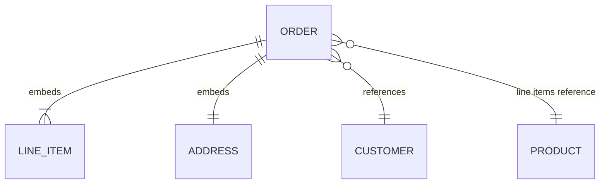

An order has a customer, a shipping address, a list of line items, and a payment record. In a normalised relational schema that is five tables and a four-way join to render one order page. Every developer who has written that join has thought: the order *is* the document, why can I not just store it as one?

A document store lets you. The order becomes one JSON-like record, read and written as a unit, with nested arrays for the line items. The read is a single primary-key lookup instead of a join. The price is that the decisions the relational model made for you (what is a row, what is a foreign key, how to keep two copies of an address consistent) are now yours, and the store will not stop you from getting them wrong. This lesson is about making them right.

## The unit of atomicity is the document

MongoDB stores BSON documents (JSON with extra types: dates, binary, decimal, ObjectId) in collections, with no enforced schema unless you add validation. Every single-document write is atomic: an update that increments a counter and pushes onto an array happens entirely or not at all, even under concurrency. That atomicity boundary is the whole design question. **Data that must change together belongs in one document. Data that changes independently, or is read independently at scale, belongs in separate documents.**



The practical rules that experienced MongoDB modellers use, in order of how often they apply:

1. **One-to-few: embed.** A user's two or three addresses live in an array on the user document. Read together, written together, bounded in size.
2. **One-to-many: reference from the many side or embed an array of ids.** A product with thousands of reviews: reviews are their own collection with a `product_id`, indexed. Embedding thousands of reviews makes the product document grow without bound.
3. **One-to-squillions: never embed, reference from the many side only.** A host with millions of log lines; you cannot even store an array of ids on the host document.
4. **Frequently read together, rarely updated: denormalise a copy.** An order embeds a snapshot of the product name and price at purchase time. That is not a bug; it is the correct semantic (the price you paid, not the current price).
5. **Updated in many places: reference.** A customer's display name shown on ten thousand orders is referenced by id and joined at read time (`$lookup`) or cached in the application, never copied ten thousand times.

Two hard limits shape all of this. A document may not exceed 16 MB. And an array that grows without bound is the single most common MongoDB anti-pattern: every append rewrites a larger document, indexes on the array field (multikey indexes) grow with it, and eventually you hit the limit in production at 3 a.m. If you cannot state an upper bound on the array's length, it should be a collection.

```javascript
// Embedded: an order with a bounded number of line items and a snapshot of the address
db.orders.insertOne({
  _id: ObjectId(),
  customer_id: ObjectId("66f1..."),
  status: "placed",
  placed_at: new Date(),
  ship_to: { line1: "1 High St", city: "Bristol", postcode: "BS1 4DJ" },
  items: [
    { sku: "A-100", name: "Desk lamp", qty: 1, unit_price_pence: 3499 },
    { sku: "B-220", name: "Bulb", qty: 2, unit_price_pence: 399 }
  ],
  total_pence: 4297
});

// Referenced: reviews are unbounded, so they get their own collection
db.reviews.insertOne({ product_sku: "A-100", user_id: ObjectId("..."), stars: 4, body: "Bright." });
```

## Schema-on-read is a loan, not a gift

"Schemaless" means the database does not check the shape; it does not mean there is no schema. The schema moves into the application code, and every document ever written is a version of it. Three years in, a collection has documents with `price` as an integer in pence, `price` as a float in pounds, `price` missing, and `pricing: { amount, currency }`. Every reader carries the union of all historical shapes.

Senior teams mitigate this with a `schema_version` field on every document, JSON Schema validation on the collection (`validator: { $jsonSchema: {...} }`) set to at least `warn`, and a migration discipline that is not much lighter than the relational one covered in [schema migrations at scale](/learn/databases/data-modeling-and-evolution/schema-migrations-at-scale). The flexibility is real and valuable for genuinely heterogeneous data (a product catalogue where each category has different attributes). It is a cost, not a benefit, for data that is in fact regular.

## Indexes and explain

MongoDB indexes are B-trees, the same structure as [Postgres indexes](/learn/databases/relational-fundamentals/indexes), and the same rules apply: an index on `{a: 1, b: 1}` supports queries on `a` and on `a, b`, but not on `b` alone; a query that is not covered by an index scans the collection.

```viz
{"type": "system", "scenario": "b-tree-index", "title": "Index lookup on a document collection", "caption": "The index maps a field value to the document's location in the collection file. Without it, a find() reads every document in the collection, exactly like a sequential scan in Postgres."}
```

The specific rule for compound index column order is **ESR: Equality, Sort, Range.** Put the fields matched by equality first, then the field used for sorting, then the fields used in range conditions. For `find({status: "placed", placed_at: {$gt: cutoff}}).sort({customer_id: 1})`, the right index is `{status: 1, customer_id: 1, placed_at: 1}`. Putting the range field before the sort field forces an in-memory sort of every matching document, which fails outright above a memory threshold (on the order of 100 MB).

Index types beyond the plain compound index:

- **Multikey**: an index on an array field indexes every element. One document with 500 tags contributes 500 index entries. Only one array field may be in a compound index.
- **Partial**: `partialFilterExpression: { status: "open" }` indexes only the documents that match; a small index over the 1% of open orders instead of the 100% of all orders. The query must include the filter predicate to use it.
- **TTL**: `expireAfterSeconds` on a date field; a background thread deletes expired documents once a minute or so. Sessions and event logs use it.
- **Text**: a basic inverted index; usable, but if search is a feature you want a [search engine](/learn/databases/nosql-and-specialised/search-engines).
- **Unique, sparse, wildcard, geospatial**: as named.

Explain output is the tool for proving a query uses an index. The shape you look at:

```javascript
db.orders.find({ status: "placed", customer_id: cid }).explain("executionStats")
// ...
//   winningPlan: { stage: "FETCH", inputStage: { stage: "IXSCAN", indexName: "status_1_customer_id_1", ... } },
//   executionStats: { nReturned: 12, totalKeysExamined: 12, totalDocsExamined: 12, executionTimeMillis: 1 }
```

The three numbers to compare are `nReturned`, `totalKeysExamined` and `totalDocsExamined`. When they are equal, the index is perfect. When `totalDocsExamined` is a thousand times `nReturned`, the index narrowed the search but a filter is being applied after fetching each document, and a better compound index would fix it. When the stage is `COLLSCAN`, there is no usable index, and on a large collection that is your outage. A `SORT` stage in the plan means an in-memory sort the index could have avoided.

## Aggregation: the query language you actually use

`find()` is a filter and projection. Anything with grouping, joins or computed fields is the aggregation pipeline, a sequence of stages each transforming a stream of documents:

```javascript
db.orders.aggregate([
  { $match: { placed_at: { $gte: ISODate("2026-09-01") } } },   // uses an index if first
  { $unwind: "$items" },
  { $group: { _id: "$items.sku", revenue: { $sum: { $multiply: ["$items.qty", "$items.unit_price_pence"] } } } },
  { $sort: { revenue: -1 } },
  { $limit: 10 }
]);
```

Two rules a senior engineer applies. `$match` and `$sort` at the start of a pipeline can use indexes; after a `$group` or `$unwind` nothing can, so filter early. And `$lookup` (a left outer join to another collection) is executed as a nested loop: for each input document, one indexed lookup into the foreign collection. With an index it is fine for hundreds of documents; without one it is a collection scan per input document, and the [N+1 lesson](/learn/databases/data-modeling-and-evolution/orms-and-n-plus-one) applies in full.

## Transactions and why they cost more here

Multi-document ACID transactions exist (since 4.0 on replica sets, 4.2 on sharded clusters) and they work. They are also the feature that most surprises people who expect relational behaviour.

WiredTiger, the storage engine, uses MVCC with snapshot isolation, like [Postgres MVCC](/learn/databases/relational-fundamentals/mvcc-and-locking). A transaction reads from a snapshot taken at its start. Unlike Postgres, where a second writer waits for the first to commit or abort, a WiredTiger write to a document another open transaction has modified fails immediately with a `WriteConflict`, and the driver's callback API retries the whole transaction. Under contention you get retries, not queueing, and each retry re-executes application code.

Transactions also hold their snapshot open, which pins the cache and blocks WiredTiger from reclaiming old versions; the default 60-second transaction lifetime limit exists because long transactions degrade the whole node. And a transaction's writes are buffered in memory until commit, with an aggregate size ceiling.

The design consequence: MongoDB is fast when the document boundary is the transaction boundary. If most of your writes need multi-document transactions, the modelling is wrong, or the workload is relational and the database choice is wrong.

## What a write means: write and read concern

A replica set is one primary plus secondaries replicating its oplog, with automatic election when the primary is unreachable (a Raft-like protocol; a majority of voting members is needed).

```viz
{"type": "system", "scenario": "replication-leader-follower", "title": "Replica set write path", "caption": "The primary applies the write and appends it to the oplog; secondaries pull and apply it. With w:1 the client is acknowledged before any secondary has it, so a failover can lose the write."}
```

`writeConcern` says what "acknowledged" means:

| Concern | Acknowledged when | Failure mode |
|---|---|---|
| `w: 1` | The primary has applied it in memory | Primary crashes before replication: the write is rolled back on failover and silently lost |
| `w: 1, j: true` | The primary has journaled it | Survives a primary crash, not a failover to a secondary that never received it |
| `w: "majority"` | A majority of members have it durably | Survives any single failover; costs one replication round-trip of latency |

`readConcern` mirrors it: `local` reads the primary's latest state, which might be rolled back; `majority` reads only data acknowledged by a majority. `readPreference` picks which member serves reads (`primary`, `secondaryPreferred`), and reading from a secondary is reading stale data by an unbounded amount during lag, the same [read-your-writes problem](/learn/databases/storage-and-scale/replication) as any asynchronous replica.

The default since MongoDB 5.0 is `w: "majority"`, which is the right default. Teams that changed it to `w: 1` "for performance" and then lost writes in a failover have learned what the setting means.

## The honest alternative: JSONB in Postgres

Most of what teams want from a document store is "a table with a flexible column", and Postgres has that. A `jsonb` column stores a decomposed binary document, supports containment queries, and can be indexed with GIN:

```sql
CREATE TABLE products (
  sku        text PRIMARY KEY,
  category   text NOT NULL,
  attrs      jsonb NOT NULL DEFAULT '{}'
);
CREATE INDEX products_attrs_gin ON products USING gin (attrs jsonb_path_ops);

SELECT sku FROM products WHERE attrs @> '{"colour": "red", "wattage": 60}';
```

```text
Bitmap Heap Scan on products  (cost=24.03..118.51 rows=25 width=8)
  Recheck Cond: (attrs @> '{"colour": "red", "wattage": 60}'::jsonb)
  ->  Bitmap Index Scan on products_attrs_gin  (cost=0.00..24.02 rows=25 width=0)
        Index Cond: (attrs @> '{"colour": "red", "wattage": 60}'::jsonb)
```

The `@>` containment operator with a GIN index gives you indexed queries on arbitrary keys without declaring them. For a key you query constantly, an expression B-tree index `ON products ((attrs->>'brand'))` is faster and supports ordering. You keep real transactions, foreign keys for the parts that are relational, and one database to operate.

Where MongoDB genuinely wins: the whole dataset is documents (no relational core to keep), horizontal write scaling via sharding is a built-in rather than a project, the driver ergonomics for nested updates (`$push`, `$inc` on a nested path, array filters) are better than SQL's JSONB functions, and the ops story for replica sets is mature. Where it loses: joins are a pipeline stage rather than a planner's job, transactions are the exception rather than the rule, and the schema debt compounds.

## Senior signals

- You decide embedding versus referencing from cardinality and update pattern, you state the upper bound of every embedded array out loud, and you treat a snapshot copy (price at time of order) as a semantic choice rather than a denormalisation sin.
- You order compound index fields by ESR and read explain output as three numbers: `nReturned`, `totalKeysExamined`, `totalDocsExamined`, and what their ratio says.
- You explain that WiredTiger aborts on write conflict rather than waiting, so contended transactions cost retries, and you know that heavy use of multi-document transactions is a modelling smell.
- You state what `w: 1` loses in a failover and you do not lower write concern from majority without a written reason.
- You reach for JSONB with a GIN index when the relational core is real and only one column needs to be flexible, and you can say precisely what MongoDB would have added.
- You put a `schema_version` on every document from day one and enable validation, because schema-on-read is a loan with interest.

## Check yourself

```quiz
- q: >-
    A product document embeds an array of reviews. It worked for a year; now product pages are slow and one insert failed with a size error. The root cause is:
  options: ["An unbounded one-to-many was embedded, and it hit the 16 MB limit", "The product collection has outgrown one shard and needs sharding", "The reviews array needed a multikey index to keep appends fast", "Review writes should have used w:majority to avoid failed inserts"]
  answer: 0
  explanation: >-
    Reviews per product have no upper bound, which is the rule for referencing from the many side. Embedding means every append rewrites the whole growing document and multikey index entries grow with it, until the 16 MB document limit ends the party. A multikey index would add cost, not remove it, and sharding and write concern do not address document size.
- q: >-
    find({status: "open", created: {$gt: t}}).sort({priority: -1}) is slow and explain shows a SORT stage. Which index fixes it?
  options: ["{status: 1, priority: -1, created: 1}", "{created: 1, status: 1, priority: -1}", "{priority: -1, status: 1, created: 1}", "{status: 1, created: 1, priority: -1}"]
  answer: 0
  explanation: >-
    ESR: equality field first (status), then the sort field (priority) so results come out of the index in order, then the range field (created). Putting the range field before the sort field, as in {status, created, priority}, still forces an in-memory sort. Leading with created or priority means scanning index entries for every status and filtering.
- q: >-
    Under contention, a transaction in MongoDB that updates a document another transaction has just modified will:
  options: ["Escalate to a collection lock so the two transactions run in turn", "Overwrite the other write silently, since the last committer wins", "Block until the other transaction commits, and then apply its own write", "Fail at once with a write conflict, and the whole transaction then retries"]
  answer: 3
  explanation: >-
    WiredTiger uses optimistic concurrency: conflicting writes abort rather than queue, and the callback API retries the transaction from the start. Postgres, by contrast, makes the second writer wait. This is why contended multi-document transactions are expensive in MongoDB.
- q: >-
    A team sets writeConcern w:1 to reduce latency. During a primary failover some acknowledged orders vanish. Why?
  options: ["The failover restarted TTL monitors, which deleted recent documents", "w:1 acks before replication, so a new primary may never have had it", "The oplog was truncated during the election, discarding recent entries", "Secondaries reject writes that were acknowledged by only one member"]
  answer: 1
  explanation: >-
    Acknowledgement with w:1 happens once the primary applies the write, before replication. A newly elected primary is chosen from members that may lack the last writes; when the old primary rejoins, its divergent oplog entries are rolled back. w:majority costs one replication round-trip and prevents this.
- q: >-
    You have a relational schema and one products table whose attributes vary by category. The lowest-risk way to support indexed queries on arbitrary attributes is:
  options: ["Add an entity-attribute-value table holding one row per attribute", "Move the whole system to MongoDB so that every table can be schemaless", "A jsonb column with a GIN index, keeping everything else relational", "Store the attributes in one text column and query them using LIKE"]
  answer: 2
  explanation: >-
    JSONB with GIN gives indexed containment lookups on any key while keeping transactions, foreign keys and one database to run. EAV works but makes every query a self-join; migrating the whole system trades a column problem for a platform migration; LIKE cannot use a B-tree.
```
