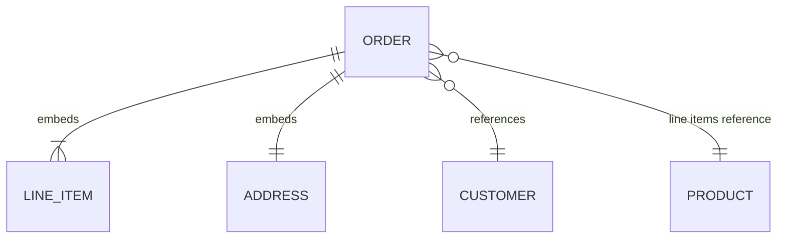

An order has a customer, a shipping address, a list of line items, and a payment record. In a normalised relational schema that is five tables and a four-way join to render one order page. Every developer who has written that join has thought: the order *is* the document, why can I not store it as one?

A document store lets you. The order becomes one JSON-like record, read and written as a unit, with nested arrays for the line items. The read is a single primary-key lookup instead of a join. The price is that the decisions the relational model made for you (what is a row, what is a foreign key, how to keep two copies of an address consistent) are now yours, and the store will not stop you from getting them wrong. This lesson covers MongoDB 6.0–8.0 with the WiredTiger engine, and measures the Postgres alternative on PostgreSQL 17.

## The unit of atomicity is the document

MongoDB stores BSON documents (JSON with extra types: dates, 64-bit integers, decimal, binary, and the 12-byte `ObjectId` made of a 4-byte timestamp, 5 random bytes and a 3-byte counter) in collections, with no enforced schema unless you add validation. Every single-document write is atomic: an update that increments a counter and pushes onto an array happens entirely or not at all, even under concurrency. That boundary is the whole design question. **Data that must change together belongs in one document. Data that changes independently, or is read independently at scale, belongs in separate documents.**



The rules experienced MongoDB modellers use, in order of how often they apply:

1. **One-to-few: embed.** A user's two or three addresses live in an array on the user document. Read together, written together, bounded in size.
2. **One-to-many: reference from the many side, or embed an array of ids.** A product with thousands of reviews: reviews are their own collection with an indexed `product_sku`.
3. **One-to-squillions: reference from the many side only.** A host with millions of log lines cannot even hold an array of their ids.
4. **Read together, rarely updated: denormalise a copy.** An order embeds the product name and price at purchase time. That is the correct semantic (the price you paid, not today's price), not a bug.
5. **Updated in many places: reference.** A customer's display name shown on ten thousand orders is referenced by id and joined at read time, never copied ten thousand times.

```javascript
// Embedded: bounded line items and a snapshot of the address
db.orders.insertOne({
  _id: ObjectId(),
  customer_id: ObjectId("66f1a2b3c4d5e6f708192a3b"),
  status: "placed",
  placed_at: new Date(),
  ship_to: { line1: "1 High St", city: "Bristol", postcode: "BS1 4DJ" },
  items: [
    { sku: "A-100", name: "Desk lamp", qty: 1, unit_price_pence: 3499 },
    { sku: "B-220", name: "Bulb", qty: 2, unit_price_pence: 399 }
  ],
  total_pence: 4297
});

// Referenced: reviews are unbounded, so they get their own collection
db.reviews.insertOne({ product_sku: "A-100", user_id: ObjectId("66f1a2b3c4d5e6f708192a3c"), stars: 4, body: "Bright." });
```

## Sizing an embedded array

A document may not exceed 16 MB (16,777,216 bytes of BSON) or 100 levels of nesting. At 500 bytes per review, that is a hard ceiling of about 33,500 reviews in one product document. The ceiling is not the real problem; the cost curve long before it is.

Work it for a popular product whose embedded reviews have reached 5 MB and which gains 100 reviews a day:

1. Every product-page read loads 5 MB into the cache and, without a projection, sends 5 MB over the network to render a page that shows ten reviews.
2. Every `$push` produces a new version of the whole 5 MB document. The oplog entry is a small diff (the `$v: 2` update format since 5.0), but when WiredTiger writes the page at the next checkpoint it writes the whole document. Spread over the day, 100 pushes write about 500 MB to disk for 50 KB of new reviews.
3. A multikey index on `reviews.stars` holds one entry per array element, so each document contributes thousands of index keys, all rewritten as the array changes.
4. On the day the array crosses 16 MB, inserts fail with `BSONObjectTooLarge` in production.

If you cannot state an upper bound on an array's length, it should be a collection. Two established patterns keep the read benefit without the growth. The **subset pattern** embeds the newest ten reviews for the page render and keeps all reviews in their own collection. The **bucket pattern** groups a fixed number of time-ordered items per document (one document per sensor per hour, with an array of at most 3,600 readings), which is exactly what MongoDB's time-series collections (5.0+) do internally.

## Schema-on-read is a loan, not a gift

"Schemaless" means the database does not check the shape; it does not mean there is no schema. The schema moves into application code, and every document ever written is a version of it. Three years in, a collection has documents with `price` as an integer in pence, `price` as a float in pounds, `price` missing, and `pricing: { amount, currency }`. Every reader carries the union of all historical shapes.

Senior teams mitigate this with a `schema_version` field on every document, JSON Schema validation on the collection (`validator: { $jsonSchema: {...} }` with `validationAction` at least `warn`), and a migration discipline not much lighter than the relational one in [schema migrations at scale](/learn/databases/data-modeling-and-evolution/schema-migrations-at-scale). The flexibility is valuable for genuinely heterogeneous data, such as a catalogue where each category has different attributes. It is a cost for data that is in fact regular.

## Under the hood: WiredTiger

Since 3.2, MongoDB's default storage engine is **WiredTiger**, a B-tree engine (the index visualisation in the next section shows the lookup shape). Each collection and each index is its own B-tree file. The collection's B-tree is keyed by an internal 64-bit **RecordId**, and every index maps its key to that RecordId, not to `_id`, so a lookup by a secondary index is an index descent plus a collection-tree descent. Collection pages are block-compressed with snappy by default; index pages use prefix compression.

What happens on a write:

1. The update is applied in memory: WiredTiger keeps a chain of versions per record, each stamped with the transaction that made it. Readers see the newest version visible to their **snapshot**, so readers never block writers.
2. The change is appended to the **journal**, WiredTiger's write-ahead log. With `j: true` the write waits for that flush; otherwise the journal is flushed every 100 ms (`storage.journal.commitIntervalMs`).
3. Every 60 seconds a **checkpoint** writes dirty pages to new blocks, never overwriting live ones, and the previous checkpoint's blocks are freed. Recovery is the last checkpoint plus journal replay.

Concurrency is **optimistic at document level**. If two operations modify the same document, the second gets a write conflict. Outside a transaction MongoDB retries that internally, so you see it only as a `writeConflicts` count in the slow-query log; inside a multi-document transaction it becomes an error you must handle (traced below).

The **cache** is sized at the larger of 50% of (RAM − 1 GB) or 256 MB: 31.5 GB on a 64 GB host. The remaining memory is not wasted: the filesystem cache holds compressed pages, so a page is often compressed on disk, compressed in the OS cache and uncompressed in WiredTiger's. Eviction threads start at 80% cache use (`eviction_target`) and application threads are drafted into eviction at 95% (`eviction_trigger`), or when dirty data exceeds 20% of the cache. That last condition is the one that turns a working set larger than the cache, or a long transaction pinning old versions, into a latency spike on every operation. Old versions needed by open snapshots spill to a **history store** file (4.4+), so a long-running transaction costs disk and cache, not only memory.

## Indexes: compound, multikey and ESR

MongoDB indexes are B-trees with the same rules as [Postgres indexes](/learn/databases/relational-fundamentals/indexes): an index on `{a: 1, b: 1}` supports queries on `a` and on `a, b`, not on `b` alone.

```viz
{"type": "system", "scenario": "b-tree-index", "title": "Index lookup on a document collection", "caption": "The index maps a field value to the document's RecordId. Without it, a find() reads every document in the collection, exactly like a sequential scan in Postgres."}
```

The rule for compound field order is **ESR: Equality, Sort, Range.** For `find({status: "placed", placed_at: {$gte: cutoff}}).sort({customer_id: 1}).limit(20)`, ESR says `{status: 1, customer_id: 1, placed_at: 1}`. Trace why on 2 million orders, 399,691 of them `placed`, 32,948 of those in the last 30 days (8.2%):

| Index | How it runs | Keys examined | Docs fetched | Blocking sort |
|---|---|---|---|---|
| none | `COLLSCAN`, filter, sort | 0 | 2,000,000 | 32,948 docs |
| `{status, placed_at, customer_id}` (ERS) | Scan the 32,948 in-range keys, fetch, sort | 32,948 | 32,948 | yes |
| `{status, customer_id, placed_at}` (ESR) | Walk `placed` keys in `customer_id` order, check `placed_at` inside the key, stop at 20 | ~243 (20 ÷ 0.082) | 20 | no |

The same B-tree logic holds in any engine, so it can be measured on PostgreSQL 17 with the identical distribution: the ESR index answered in 0.07 ms touching 25 buffers; the ERS index took 21 ms, touching 14,548 buffers and sorting 32,948 rows; no index took 35 ms.

ESR is a heuristic, not a law. Narrow the range to the last hour (36 matching orders) and the ESR walk must pass about 20 ÷ 36 of all 400,000 `placed` keys before it finds 20 matches: measured at 3.5 ms and 1,231 buffers, against 0.15 ms and 39 buffers for the ERS index, which reads 36 keys and sorts 36 rows. When the range is very selective, put it before the sort field. Check with explain on production-shaped data.

Index types beyond the plain compound index:

- **Multikey**: an index on an array field has one entry per element. A compound index may include at most one array field per document, because indexing the cross product of two arrays ("parallel arrays") is refused.
- **Partial**: `partialFilterExpression: {status: "open"}` indexes only matching documents; queries must include the filter predicate to use it.
- **TTL**: `expireAfterSeconds` on a date field; a background monitor deletes expired documents every 60 seconds.
- **Text, wildcard, geospatial, unique, sparse**: as named; if search is a product feature you want a [search engine](/learn/databases/nosql-and-specialised/search-engines).

## Reading explain

The planner generates candidate plans for a new query shape, runs them in a short race (until one produces 101 results or finishes), caches the winner for that shape, and re-plans when the cached plan performs much worse than it did. `explain("executionStats")` shows the winner:

```javascript
db.orders.find({ status: "placed", placed_at: { $gte: ISODate("2026-12-02") } })
  .sort({ customer_id: 1 }).limit(20).explain("executionStats")
// winningPlan: { stage: "LIMIT", inputStage: { stage: "FETCH",
//                inputStage: { stage: "IXSCAN", indexName: "status_1_customer_id_1_placed_at_1" } } }
// executionStats: { nReturned: 20, totalKeysExamined: ~243, totalDocsExamined: 20, ... }   (counts derived above)
```

Read three numbers. When `nReturned`, `totalKeysExamined` and `totalDocsExamined` are close, the index fits the query. When keys examined is far above documents fetched, the index is filtering inside its keys (acceptable up to a point, as in the ESR walk). When documents examined is far above `nReturned`, a predicate is applied after fetching each document, and a better compound index would fix it. A `COLLSCAN` stage on a large collection is an outage in waiting, and a `SORT` stage is an in-memory sort limited to 100 MB: before 4.4 the limit was 32 MB and the query failed; since 6.0 `allowDiskUseByDefault` lets it spill to disk, slowly.

## Aggregation: the query language you actually use

`find()` is a filter and projection. Anything with grouping, joins or computed fields is the aggregation pipeline:

```javascript
db.orders.aggregate([
  { $match: { placed_at: { $gte: ISODate("2026-09-01") } } },   // uses an index only at the start
  { $unwind: "$items" },
  { $group: { _id: "$items.sku", revenue: { $sum: { $multiply: ["$items.qty", "$items.unit_price_pence"] } } } },
  { $sort: { revenue: -1 } },
  { $limit: 10 }
]);
```

`$match` and `$sort` at the start of a pipeline can use indexes; after `$group` or `$unwind` nothing can, so filter early. `$lookup` (a left outer join) runs per input document: with an index on the foreign field it is one index probe per document, without one it is a scan per document (newer versions can pick a hash join instead), and the [N+1 lesson](/learn/databases/data-modeling-and-evolution/orms-and-n-plus-one) applies in full.

## Transactions, traced

Multi-document ACID transactions exist (4.0 on replica sets, 4.2 on sharded clusters) and work. WiredTiger gives them snapshot isolation, like [Postgres MVCC](/learn/databases/relational-fundamentals/mvcc-and-locking), but conflicts behave differently. Two checkouts race for the last unit of stock:

1. T1 starts, reads `{sku: "A-100", qty: 1}` and updates it to `qty: 0`. The new version is uncommitted.
2. T2 starts and tries the same update. WiredTiger sees an uncommitted change by another transaction on that record and refuses: T2 receives `WriteConflict` (code 112) labelled `TransientTransactionError`, and T2 is aborted.
3. T1 commits.
4. The driver's `withTransaction` callback API sees the label and reruns T2's whole callback from the start: it reads `qty: 0`, and the application's check rejects the second checkout.

In Postgres, T2 would wait on T1's row lock and then re-check the row. MongoDB gives you retries instead of a queue, and each retry reruns application code. A write *outside* any transaction that hits a document modified by an open transaction waits for that transaction to finish.

The limits come from the same design. `transactionLifetimeLimitSeconds` (60 by default) aborts older transactions because each open snapshot pins old versions in the cache and history store. A transaction waits at most 5 ms (`maxTransactionLockRequestTimeoutMillis`) for locks before aborting. The documentation advises modifying no more than about 1,000 documents per transaction. A commit that fails with `UnknownTransactionCommitResult` must be retried as a commit, not rerun.

The design consequence: MongoDB is fast when the document boundary is the transaction boundary. If most writes need multi-document transactions, the modelling is wrong, or the workload is relational.

## Write concern, read concern and rollback

A replica set is one primary plus secondaries that pull and apply its **oplog**, with a Raft-like election when the primary is unreachable (`electionTimeoutMillis` is 10,000 ms, and the documentation expects a new primary within about 12 seconds).

```viz
{"type": "system", "scenario": "replication-leader-follower", "title": "Replica set write path", "caption": "The primary applies the write and appends it to the oplog; secondaries pull and apply it. With w:1 the client is acknowledged before any secondary has it, so a failover can lose the write."}
```

| Write concern | Acknowledged when | What survives |
|---|---|---|
| `w: 1` | The primary applied it | Not a failover to a secondary that lacks it |
| `w: 1, j: true` | The primary journaled it | A primary crash and restart; still not a failover |
| `w: "majority"` (default since 5.0) | A majority have it durably | Any single failover; costs one replication round trip |

Trace what `w: 1` loses. P is primary at oplog position 100; S1 and S2 are at 100.

1. A client inserts order A with `w: 1`. P applies it at position 101 and acknowledges. S1 and S2 have not fetched it yet.
2. A network partition isolates P. It can no longer see a majority and steps down.
3. After the election timeout, S1 and S2 elect S1 (term 2). Its last entry is 100.
4. Clients write to S1: new entries 101′ and 102′.
5. The partition heals. P rejoins as a secondary, finds the last entry it shares with S1 (100), and **rolls back** 101: order A is removed from its data and written to a BSON file under `rollback/`, then P replicates 101′ and 102′.

The client was told order A succeeded; the replica set no longer has it, and only an operator reading the rollback files can recover it. With `w: "majority"`, step 1 waits until S1 or S2 holds 101, and an election can only pick a member that has every majority-committed entry, so order A survives.

`readConcern` mirrors this: `local` reads the node's latest data, which may later be rolled back; `majority` reads only majority-committed data; `linearizable` also confirms the primary is still primary; `snapshot` gives a transaction one consistent view. `readPreference: secondary` reads data that lags by an unbounded amount, the [read-your-writes problem](/learn/databases/storage-and-scale/replication) of any asynchronous replica; causally consistent sessions fix it per client.

## Sharding in one page

A sharded cluster splits a collection by a **shard key** into chunks (128 MB by default since 6.0), spread across replica-set shards; `mongos` routers send each query to the shards whose chunks can match, and a background balancer moves chunks to even out counts. The shard key decides everything:

- A query that includes the shard key is **targeted** to one shard; one that does not is **scatter-gather** across all of them, so its latency is the slowest shard's.
- A monotonically increasing key (`ObjectId`, a timestamp) sends every insert to the chunk holding the maximum value, on one shard: a hot shard however many you add. A hashed shard key spreads inserts and gives up range queries on the key.
- A low-cardinality key (`country`) creates chunks that cannot split ("jumbo" chunks) and cannot be balanced.

Keys can be refined (4.4+) and collections resharded online (5.0+), but resharding copies the collection, so choose from the access patterns up front, exactly as in [partitioning and sharding](/learn/databases/storage-and-scale/partitioning-and-sharding).

## The Postgres alternative, measured

Most of what teams want from a document store is "a table with a flexible column", and Postgres has one. `jsonb` stores a parsed binary document, supports containment (`@>`), key-existence (`?`) and JSONPath operators, and can be indexed with GIN, an inverted index from JSON items to rows.

```sql
CREATE TABLE products (
  sku      text PRIMARY KEY,
  category text NOT NULL,
  attrs    jsonb NOT NULL DEFAULT '{}'
);
CREATE INDEX products_attrs_path ON products USING gin (attrs jsonb_path_ops);

SELECT sku FROM products WHERE attrs @> '{"brand": "brand-17", "colour": "red"}';
```

Measured on PostgreSQL 17.11 with 1,000,000 products (a 217 MB heap, 175-byte `attrs` on average: 12 colours, 200 brands, 5 wattages, nested dimensions and tags); the query matches 402 rows:

| Access path | Index size | Build time | Query time (warm) | Buffers |
|---|---|---|---|---|
| No index (parallel sequential scan) | — | — | 44 ms | 27,778 |
| GIN `jsonb_ops` (default) | 25 MB | 2.5 s | 13.1 ms | 974 (576 index) |
| GIN `jsonb_path_ops` | 18 MB | 1.0 s | 1.4 ms | 436 (38 index) |
| B-tree on `(attrs->>'brand')`, filter colour | 7 MB | 0.4 s | 7.9 ms | 4,594 (fetches 5,007 rows) |

The difference between the two GIN operator classes is what they index. `jsonb_ops` indexes every key and every value as separate items, so the query looks up `brand`, `brand-17`, `colour` and `red`, and the `colour` key appears in all million rows. `jsonb_path_ops` indexes one hash per path-and-value (`brand` = `brand-17`, `colour` = `red`), so the lists it intersects hold about 5,000 and 83,000 rows. It is smaller and faster for `@>`, and it cannot answer `attrs ? 'lumens'` (the planner fell back to a sequential scan), which `jsonb_ops` serves in 60 ms for 166,666 matches. For a key you filter and sort on constantly, an expression B-tree is faster still and supports `ORDER BY` (0.03 ms for the first ten rows of one brand).

JSONB shares one cost with documents: an update rewrites the whole value. Measured with `EXPLAIN (ANALYZE, WAL)` on a row whose `jsonb` is 104 KB stored (131 KB as text), `jsonb_set` on one small key wrote **113 KB of WAL** in 158 records; updating a plain `text` column on the same row wrote **130 bytes**, because the large value's TOAST pointer was copied, not the data. Keep fields that change often in their own columns.

## Choosing between them

| | MongoDB | Postgres + `jsonb` | DynamoDB |
|---|---|---|---|
| Unit of atomicity | One document; multi-document transactions as the exception | Any rows, any tables | One item; transactions of up to 100 items |
| Secondary indexes | Compound, multikey, partial, TTL, text | B-tree, GIN, expression, partial | GSIs, eventually consistent |
| Joins | `$lookup` per document | Planned joins | None |
| Horizontal write scaling | Built-in sharding | A project (partitioning, Citus) | Built in, per partition key |
| Schema enforcement | Optional JSON Schema | Columns plus optional checks on `jsonb` | None beyond keys |
| Update cost of a large document | Whole document at checkpoint | Whole value in WAL and heap | Whole item (up to 400 KB), billed per KB |

MongoDB genuinely wins when the whole dataset is documents with no relational core, when horizontal write scaling must be built in, and on nested-update ergonomics (`$push`, `$inc` on a nested path, array filters) that are clumsier with SQL's JSONB functions. It loses when joins are routine, when invariants span entities, and as schema debt compounds.

## Failure modes

| Symptom | Diagnosis | Fix |
|---|---|---|
| Product pages slow down month by month; one insert fails with `BSONObjectTooLarge` | Unbounded embedded array; `Object.bsonsize(doc)` shows megabytes | Move the array to a collection; subset pattern for the page |
| A query that took 2 ms takes 4 s after a release | New query shape has no matching index; slow log shows `planSummary: COLLSCAN` | Add the compound index by ESR, then confirm with explain |
| `Sort exceeded memory limit of 104857600 bytes`, or heavy disk spill | Blocking `SORT` stage because the sort field is not in index order | Put the sort field after the equality fields in the index |
| p99 latency rises across all operations, no slow queries | WiredTiger cache over 95% or dirty over 20%; `serverStatus().wiredTiger.cache` shows application threads evicting | Working set larger than cache: more RAM, fewer or smaller indexes, shorter transactions |
| Acknowledged orders missing after a failover; files appear under `rollback/` | Writes used `w: 1` and were rolled back | `w: "majority"`; recover from the rollback files |
| Checkout transactions abort with `TransientTransactionError` at peak | Optimistic write conflicts on a hot document | Retry with `withTransaction`; move the invariant into one document; reduce contention |
| One shard at 100% during inserts, the others idle | Monotonic shard key sends all inserts to the last chunk | Hashed or compound shard key; reshard |

## Interviewer follow-ups

**"Blog comments: embed or reference?"** Model answer: comments per post are unbounded for popular posts, so a `comments` collection indexed by `(post_id, created_at)`, plus the newest ten embedded for the page render (subset pattern); state the bound out loud. Common wrong answer: "embed, because they are read together", which fails on the first viral post.

**"What does `w: 1` lose, and what does majority cost?"** Model answer: trace the rollback: acknowledged on the primary only, a failover elects a secondary without it, and the old primary rolls it back into a file; majority costs one replication round trip, about a millisecond within a region and tens of milliseconds across regions. Common wrong answer: "`w: 1` with journaling is safe", which survives a crash but not a failover.

**"Explain shows 50,000 keys examined, 50,000 documents examined, 20 returned. What next?"** Model answer: the index narrows only a prefix and the remaining predicate or the sort runs after fetching; extend the index by ESR, or put a very selective range before the sort field, and re-check the three numbers. Common wrong answer: "add RAM", which makes the wasted work faster without removing it.

**"Why not wrap everything in transactions?"** Model answer: conflicts abort rather than wait, so contention becomes retries; open snapshots pin cache and history store; 60-second lifetime and 5 ms lock timeout; design so each invariant lives in one document. Common wrong answer: "MongoDB transactions are not ACID", which has been false since 4.0.

**"When would you choose Postgres JSONB instead?"** Model answer: when there is a relational core and one flexible column; a `jsonb_path_ops` GIN index turns a 44 ms scan into about 1 ms at 18 MB per million rows, you keep transactions and foreign keys, and you put frequently updated fields in their own columns because a `jsonb` update rewrites the value. Common wrong answer: "JSONB cannot be indexed".

## What mid-level engineers get wrong

- **Embedding anything read together** without stating a bound, then meeting the 16 MB limit in production.
- **Indexing fields in the order they appear in the query** instead of equality, sort, range, and never checking explain.
- **Lowering write concern to `w: 1` "for latency"**, then losing acknowledged writes in the first failover.
- **Treating MongoDB transactions like Postgres ones**, without a retry loop for `TransientTransactionError`.
- **Sharding on `_id` or a timestamp**, which makes one shard take every insert.
- **Choosing `jsonb_ops` by default** when every query is containment and `jsonb_path_ops` is smaller and faster.
- **Storing a hot counter inside a large JSONB value**, turning each increment into a 100 KB WAL write.

## Exercise

The ESR rule is a special case of one planner check: can the index deliver rows already in the requested order? Implement that check.

```exercise
id: index-provides-sort
title: Does the index provide the sort?
prompt: |
  Implement `index_provides_sort(index, equality, sort)`.

  - `index` is a list of `[field, direction]` pairs, direction 1 or -1.
  - `equality` is a list of field names that the query matches with equality.
  - `sort` is a list of `[field, direction]` pairs.

  Return `true` if walking the index (forwards or backwards) yields results
  in the sort order without a blocking sort stage, using this rule:

  1. Drop from `sort` every field that is in `equality` (its value is
     constant across the results). If nothing remains, return `true`.
  2. Let `p` be the position in `index` of the first remaining sort field.
     If it is not in the index, return `false`. Every index field before `p`
     must be in `equality`.
  3. The remaining sort fields must equal the index fields at positions
     `p, p + 1, ...`, in order.
  4. Their directions must either all equal the index directions at those
     positions, or all be the opposite.
languages: [python, javascript]
entry: index_provides_sort
starter:
  python: |
    def index_provides_sort(index, equality, sort):
        return False
  javascript: |
    function index_provides_sort(index, equality, sort) {
      return false;
    }
tests:
  - args: [[["status", 1], ["customer_id", 1], ["placed_at", 1]], ["status"], [["customer_id", 1]]]
    expected: true
    label: ESR order
  - args: [[["status", 1], ["placed_at", 1], ["customer_id", 1]], ["status"], [["customer_id", 1]]]
    expected: false
    label: a range field sits before the sort field
  - args: [[["a", 1], ["b", 1]], [], [["a", -1], ["b", -1]]]
    expected: true
    label: walking the index backwards
  - args: [[["a", 1], ["b", 1]], [], [["a", 1], ["b", -1]]]
    expected: false
    label: mixed directions
  - args: [[["a", 1], ["b", 1]], [], []]
    expected: true
    label: no sort requested
  - args: [[["a", 1], ["b", 1]], ["a"], [["a", -1], ["b", 1]]]
    expected: true
    hidden: true
    label: an equality field in the sort is ignored
  - args: [[["a", 1], ["b", 1], ["c", 1]], ["a", "b"], [["c", -1]]]
    expected: true
    hidden: true
    label: two equality fields then a reversed sort
  - args: [[["a", 1], ["b", 1], ["c", 1]], ["a"], [["c", 1]]]
    expected: false
    hidden: true
    label: a gap that is not bound by equality
hints:
  - "Build a set of equality fields first, filter the sort, then find where the first remaining field sits in the index."
  - "Compute a single flag: does the first remaining field's direction match the index or oppose it? Every later field must agree with that flag."
```

## Senior signals

- You decide embedding versus referencing from cardinality and update pattern, you state every embedded array's bound out loud, and you use subset and bucket patterns instead of unbounded arrays.
- You can describe WiredTiger's write path (versions in memory, journal every 100 ms, checkpoint every 60 s), its cache formula and the 80/95/20% eviction thresholds, and you know a long transaction costs cache.
- You order compound index fields by ESR, know when a very selective range should come before the sort, and read explain as keys examined, documents examined and returned.
- You explain that conflicting transactional writes abort rather than wait, so contended transactions cost retries, and heavy use of transactions is a modelling smell.
- You can trace a rollback and state what `w: 1` loses in a failover, and you do not lower write concern without a written reason.
- You reach for Postgres JSONB with the right GIN operator class when the relational core is real, and keep hot fields out of large JSON values.

## Check yourself

```quiz
- q: >-
    A product document embeds an array of reviews. It worked for a year; now product pages are slow and one insert failed with a size error. What is the root cause?
  options: ["An unbounded one-to-many was embedded and grew toward 16 MB", "The product collection has outgrown one shard and needs sharding", "The reviews array needed a multikey index to keep appends fast", "Review writes should have used w:majority to avoid failed inserts"]
  answer: 0
  explanation: >-
    Reviews per product have no upper bound, which is the rule for referencing from the many side. Each append creates a new version of the whole growing document and each read loads all of it, until the 16 MB limit stops inserts. A multikey index would add cost, and sharding or write concern do not change document size.
- q: >-
    find({status: "open", created: {$gt: t}}).sort({priority: -1}).limit(20) is slow and explain shows a SORT stage. The range on created matches about 10% of open documents. Which index fixes it?
  options: ["{created: 1, status: 1, priority: -1}", "{status: 1, priority: -1, created: 1}", "{priority: -1, status: 1, created: 1}", "{status: 1, created: 1, priority: -1}"]
  answer: 1
  explanation: >-
    ESR: the equality field first, then the sort field so the index delivers rows in order, then the range field, checked inside each index key until 20 match (about 200 keys at 10%). Putting created before priority still needs a blocking sort of every match. Only when the range is very selective does range-before-sort win.
- q: >-
    Two MongoDB transactions update the same inventory document. The second one to write will:
  options: ["Escalate to a collection lock so that the two transactions run in turn", "Block until the first transaction commits, and then apply its write", "Fail at once with a write conflict, so the whole transaction retries", "Overwrite the first silently, since the last committer always wins"]
  answer: 2
  explanation: >-
    WiredTiger is optimistic: a write to a record with another transaction's uncommitted change fails with WriteConflict labelled TransientTransactionError, and withTransaction reruns the whole callback. Postgres, by contrast, makes the second writer wait on the row lock. Retries rerun application code, which is why contended transactions are expensive here.
- q: >-
    A team sets writeConcern w:1 to reduce latency. After a primary failover some acknowledged orders are missing, and BSON files appear in a rollback directory. Why?
  options: ["The oplog is truncated during every election, dropping new entries", "Secondaries reject writes that only one member has acknowledged", "w:1 acks before replication, so the new primary never had them", "The failover restarted the TTL monitor, which deleted recent orders"]
  answer: 2
  explanation: >-
    With w:1 the write is acknowledged once the primary applies it. A secondary without it can win the election, and when the old primary rejoins it rolls back its divergent entries into rollback files. w:majority waits for a majority, and elections only choose members holding every majority-committed write.
- q: >-
    A Postgres products table has a jsonb attrs column queried only with @> containment. Which index is the better default, and why?
  options: ["jsonb_ops, because indexing keys and values apart is more selective", "jsonb_ops, because it also supports key-existence queries with ?", "A B-tree on attrs, because GIN cannot answer containment queries", "jsonb_path_ops, since it hashes each path and value into one item"]
  answer: 3
  explanation: >-
    jsonb_path_ops stores one hash per path-and-value pair, so containment intersects short lists; measured on a million rows it was 18 MB and 1.4 ms against 25 MB and 13 ms for jsonb_ops, whose separate key items (a key present in every row) make long lists. jsonb_ops is needed only for ? and similar key operators; a plain B-tree on the whole value cannot serve @>.
- q: >-
    A row holds a 100 KB jsonb document. The application updates one small field inside it with jsonb_set on every page view. What is the main cost?
  options: ["Each update takes a table lock, since jsonb values cannot be locked by row", "Each update is cheap, but VACUUM can never reclaim the older jsonb values", "Each update writes about 100 KB of WAL, since the whole value is rewritten", "Each update writes only the changed key, but it invalidates the GIN index"]
  answer: 2
  explanation: >-
    Postgres stores a jsonb value as one datum, so changing one key writes a new copy of the whole value: measured at 113 KB of WAL for one small change, against 130 bytes for updating a separate text column on the same row. Row locks work normally and vacuum reclaims old versions; the fix is to keep frequently changing fields in their own columns.
```
