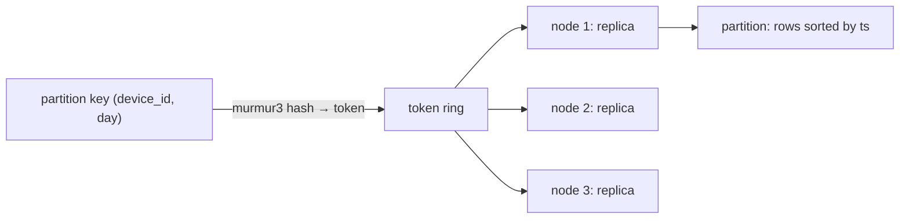

You are ingesting 400,000 sensor readings a second, or a billion user events a day, and you need every one of them stored and readable by device and time window for the next ninety days. A single Postgres primary will take perhaps twenty thousand of those writes a second before the WAL and the B-tree updates saturate the disk, and sharding it yourself means building a routing layer, a rebalancer and a cross-shard query engine.

The Dynamo family of stores (Amazon's original 2007 design, Cassandra, ScyllaDB, DynamoDB the product) was built for exactly this shape: writes that scale linearly with node count, no single point of failure, and reads that are fast for one query pattern per table. The trade is everything else. No joins, no ad hoc queries, no multi-row transactions, and a data model where the schema is the query. Getting that model right is the entire job.

## The partition is the unit of everything

A Cassandra table has a primary key in two parts: the **partition key**, which decides which node(s) store the row, and the **clustering columns**, which decide the order of rows within the partition. Every row with the same partition key lives together, sorted by the clustering columns, on the same replicas.

```sql
CREATE TABLE readings_by_device (
  device_id   uuid,
  day         date,
  ts          timestamp,
  temp_c      float,
  PRIMARY KEY ((device_id, day), ts)
) WITH CLUSTERING ORDER BY (ts DESC);
```

`(device_id, day)` is a composite partition key; `ts` is the clustering column. The query this table is built for is:

```sql
SELECT ts, temp_c FROM readings_by_device
WHERE device_id = ? AND day = '2026-09-26' AND ts > '2026-09-26 08:00:00';
```

That is a single-partition read: hash the partition key, go to the owning replicas, read a contiguous sorted slice. It is fast at any cluster size because it touches one partition regardless of how many billions of rows exist elsewhere. Any query that does not specify the full partition key has to ask every node, and Cassandra refuses to run it without `ALLOW FILTERING`, which is the database telling you that you are about to scan the cluster.

Three rules follow:

1. **One table per query.** If you also need "latest reading for every device in a building", that is a second table, `latest_by_building`, written to at the same time. Storage is cheap; cross-partition reads are not. Denormalisation is not a compromise here; it is the design.
2. **Bound the partition.** A partition is stored and read as a unit on its replicas; the practical ceiling is on the order of 100 MB or 100,000 rows before compaction, repair and reads degrade. That is why `day` is in the partition key above: a device emitting one reading a second makes 86,400 rows a day, and without the time bucket the partition would grow forever. Time-bucketing is the standard fix for any append-only series.
3. **Spread the load.** A partition key with few distinct values, or one value that is much hotter than the rest, puts all its traffic on one set of replicas. A `PRIMARY KEY (country, ...)` table with 60% of users in one country is a hot partition. The [sharding lesson](/learn/databases/storage-and-scale/partitioning-and-sharding) covers the same failure under a different name.



Nodes own ranges of the token ring (virtual nodes spread the ranges), and a partition's token places it with the next N nodes on the ring, where N is the keyspace's replication factor. Adding a node takes over a slice of ranges and streams that data in; nothing else moves. That is the mechanism behind "linear scalability".

```viz
{"type": "system", "scenario": "consistent-hashing", "title": "Partition placement on the ring", "caption": "Each partition key hashes to a token; the token's owner and the next replicas store it. Adding a node moves only the ranges it takes over."}
```

## Why writes are cheap: the LSM engine

Cassandra never updates in place. A write goes to two places: an append to the commit log (sequential disk write, the durability guarantee) and an insert into the in-memory memtable (a sorted structure). Both are cheap. When the memtable fills, it is flushed to disk as an immutable, sorted **SSTable**. A row's latest state may therefore be spread across several SSTables, and a read merges them, newest wins by timestamp.

```viz
{"type": "system", "scenario": "lsm-tree", "title": "Write path through memtable to SSTables", "caption": "Writes append to the commit log and land in the sorted memtable; flushes produce immutable SSTables; compaction merges SSTables so reads consult fewer files."}
```

The [LSM tree lesson](/learn/advanced-data-structures/log-structured-and-disk-structures/lsm-trees-and-sstables) covers the structure in depth. The operational facts to carry:

- **Write amplification is deferred to compaction.** The data is written once at flush and again every time an SSTable is merged. The compaction strategy decides how often:
  - **STCS (size-tiered)**: merge SSTables of similar size. Cheapest on write, worst on read (a row can be in many tables) and needs up to 50% free disk for the merge.
  - **LCS (levelled)**: SSTables per level are non-overlapping, so a read touches about one table per level. Better reads, several times more write I/O. Suits read-heavy, update-heavy tables.
  - **TWCS (time-window)**: group SSTables by the time window their data was written. For time series with TTL, whole windows expire and get dropped without merging. This is the correct choice for the readings table above, and using STCS on it instead is a classic source of disk-full incidents.
- **Reads are merges.** A point read checks the memtable, then each SSTable that might hold the partition. To avoid opening every file, each SSTable has a **bloom filter** of the partition keys it contains; a negative answer skips the file with no I/O. A 1% false-positive rate means about one wasted file open per hundred reads.

```viz
{"type": "system", "scenario": "bloom-filter", "title": "Skipping SSTables that cannot contain the key", "caption": "Each SSTable carries a bloom filter over its partition keys. A definite no avoids a disk read; a maybe costs one index lookup that may find nothing."}
```

The [bloom filter lesson](/learn/advanced-data-structures/probabilistic-structures/bloom-filters) works through the sizing arithmetic.

## Tombstones: the delete that is a write

Because SSTables are immutable, a delete cannot remove anything. It writes a **tombstone**, a marker with a timestamp saying "this cell/row/partition is deleted as of now". Reads see the tombstone and hide the older data; compaction eventually drops both the tombstone and the data it shadows.

Two consequences matter operationally. First, reads over many tombstones are slow: a queue-like table where you insert and delete rows constantly leaves a partition that is mostly tombstones, and a read must scan through all of them to find the few live rows. Cassandra logs a warning past a thousand tombstones per read and aborts past a hundred thousand. **Do not build a queue in Cassandra.** Second, the tombstone must outlive any replica that missed the delete. If node C was down when the delete was written and the tombstone is compacted away on A and B before C returns, C's copy of the old row is now the only copy, and repair "resurrects" the deleted data. The `gc_grace_seconds` setting (default ten days) keeps tombstones alive until every replica has had a chance to be repaired. Lowering it to save space is only safe if you run repair more often than that.

## Tunable consistency: choosing R and W per query

Every keyspace has a replication factor N (3 is typical). Every read and write states a consistency level: how many replicas must respond before the coordinator answers the client.

| Level | Meaning |
|---|---|
| `ONE` | One replica responded. Fastest; may read stale data |
| `QUORUM` | ⌊N/2⌋ + 1 replicas (2 of 3) |
| `LOCAL_QUORUM` | Quorum within the coordinator's datacentre; no cross-region round trip |
| `ALL` | All N; any node down means the operation fails |

The rule that makes it a system: if reads and writes both use quorum, then **R + W > N** and every read intersects with the latest write on at least one replica, so the read returns the newest value (by timestamp) among the replicas it hears from. Write at `ONE` and read at `ONE`, and you may read from a replica the write has not reached yet.

```viz
{"type": "system", "scenario": "quorum", "title": "Quorum read after quorum write, N=3", "caption": "The write is acknowledged by 2 of 3 replicas; the read waits for 2 of 3. The two sets must share a member, and that member has the newest timestamp, so the read is consistent."}
```

Three mechanisms handle the replica that missed a write. **Hinted handoff**: the coordinator stores a hint for a down replica and replays it when the node returns (within a window of a few hours). **Read repair**: when a quorum read sees replicas disagree, the coordinator writes the newest value back to the stale ones. **Anti-entropy repair**: a scheduled job (`nodetool repair`) compares Merkle trees of data ranges between replicas and streams differences; this is what `gc_grace_seconds` is budgeted against.

Timestamps deserve a warning. "Newest wins" uses the write's timestamp, which the client or coordinator sets from its clock. Two writers with clocks 200 ms apart can have the earlier write win. Cassandra has no vector clocks; if your data needs a true ordering under concurrent writes, you need something else, or you need the write to be idempotent and commutative (a counter, a set of ids).

## Lightweight transactions: when you need compare-and-set

`INSERT ... IF NOT EXISTS` and `UPDATE ... IF col = ?` run a Paxos round among the replicas: prepare, promise, propose, accept, commit. That is about four round trips instead of one, and they serialise on the partition, so throughput on a contended partition collapses to a few hundred per second. Use them for the rare case that must be exactly-once (claiming a unique username), never on the hot path. DynamoDB's conditional writes are the same idea with the same cost profile relative to plain writes.

## DynamoDB: the same model, metered

DynamoDB is the same lineage sold as a service: partition key and sort key, items up to 400 KB, a 10 GB / 3,000 read-unit / 1,000 write-unit ceiling per physical partition (orders of magnitude; the service splits partitions adaptively), eventually consistent reads at half the cost of strongly consistent ones, and no scans without paying for every item touched.

What DynamoDB changes is the modelling idiom. **Single-table design** puts every entity type in one table with generic `PK` and `SK` attributes, and encodes the access patterns into key prefixes:

| PK | SK | Item |
|---|---|---|
| `USER#42` | `PROFILE` | the user |
| `USER#42` | `ORDER#2026-09-26T10:00#9f3` | an order (sorted by time under the user) |
| `ORDER#9f3` | `ITEM#1` | a line item |

A `Query` on `PK = USER#42 AND SK BEGINS_WITH ORDER#` returns the user's orders in time order from one partition. Global secondary indexes (GSIs) give a second key on the same items, with their own capacity and eventual consistency relative to the base table. The model is powerful and nearly unreadable to a newcomer; write the access patterns down in a table before you write the key design, and keep that table with the code.

Capacity is the other new concept. You pay per read/write unit (or on demand at a higher rate), and a hot partition key throttles at the partition's limit regardless of the table's total provisioned capacity. The mitigation is the same as Cassandra's: spread the key (write sharding: append a random suffix 0–9 to the partition key and query all ten).

## The anti-patterns, named

- **Secondary indexes as a query engine.** Cassandra's secondary indexes are local to each node, so a query by an indexed non-key column fans out to every node. Fine for low-cardinality columns on small clusters, an outage otherwise. Build another table instead, or use a materialised view with care.
- **`ALLOW FILTERING`.** It is a cluster scan. Its appearance in application code is a modelling bug.
- **Queues.** Insert-then-delete churn produces tombstone-heavy partitions. Use Kafka or Redis.
- **Unbounded partitions.** Anything keyed only by an entity id that accumulates events over time. Add a time bucket.
- **Reading before writing.** Cassandra writes are blind; a read-modify-write pattern is both slow and racy without an LWT. Model updates as new rows or as commutative operations.
- **Many small clusters, each half-understood.** Cassandra's operational load (repair scheduling, compaction tuning, JVM GC, capacity planning) is real. If the write rate fits in Postgres with partitioning, the [choosing a database](/learn/databases/nosql-and-specialised/choosing-a-database) lesson says to stay there.

## Senior signals

- You start a Cassandra or DynamoDB design by listing the queries, and you derive one table per query with an explicit partition-size bound and a time bucket where anything is append-only.
- You explain the write path as commit log plus memtable plus flush, and you pick the compaction strategy from the workload: TWCS for TTL'd time series, LCS for read-heavy updates, STCS as the cheap default.
- You describe a delete as a tombstone write, and you can say why `gc_grace_seconds` and the repair schedule are coupled and what "resurrected data" means.
- You choose consistency levels per operation, state R + W > N when it matters, and you know that last-write-wins by timestamp is not a real conflict resolution.
- You treat LWTs and conditional writes as a rare, expensive tool and never put them on a hot partition.
- You recognise `ALLOW FILTERING`, secondary indexes on high-cardinality columns and insert-delete churn as bugs in the data model, not tuning problems.

## Check yourself

```quiz
- q: >-
    A table stores sensor readings with PRIMARY KEY (device_id, ts). After six months, reads for busy devices time out and compaction falls behind. The fix is:
  options: ["Switch to QUORUM reads", "Add a time bucket such as day to the partition key so partitions stay bounded", "Increase the replication factor", "Add a secondary index on ts"]
  answer: 1
  explanation: >-
    A partition keyed only by device grows forever; past roughly 100 MB every read, compaction and repair on it degrades. Bucketing by day bounds partition size at one day of readings. Consistency level and replication factor do not change partition size; a secondary index on the clustering column is meaningless.
- q: >-
    With replication factor 3, a service writes at consistency ONE and reads at ONE. Users occasionally see their update disappear and reappear. Why?
  options: ["Tombstones are hiding the row", "R + W = 2, which is not greater than N, so a read can hit a replica the write has not reached yet", "Hinted handoff is disabled", "The commit log was not fsynced"]
  answer: 1
  explanation: >-
    Reads and writes at ONE do not guarantee overlap; a read served by a replica that is behind returns the old value until repair or handoff catches it up. QUORUM on both sides (2 + 2 > 3) forces an intersection with the newest write.
- q: >-
    A team lowers gc_grace_seconds from ten days to one hour to reclaim disk faster, and runs repair weekly. What is the likely consequence?
  options: ["Nothing; tombstones are purged sooner and reads speed up", "Deleted rows come back: a replica that missed a delete is repaired after the tombstone is gone, so its old copy is treated as live data", "Writes start failing at QUORUM", "Compaction stops"]
  answer: 1
  explanation: >-
    The tombstone must survive until every replica has been repaired. With a one-hour grace and weekly repair, any replica that was down for the delete keeps the row, and once the tombstone is compacted away the row is resurrected on the next repair.
- q: >-
    Which workload is the worst fit for Cassandra?
  options: ["Append-only time series with a 30-day TTL", "A user activity feed read by user id in time order", "A job queue with rows inserted then deleted within seconds", "Write-heavy event ingestion at 300k events per second"]
  answer: 2
  explanation: >-
    Deletes are tombstone writes; an insert-delete queue leaves partitions that are almost entirely tombstones, and every read scans through them. The other three are exactly what the partition-plus-clustering model and LSM engine are built for.
- q: >-
    A DynamoDB table is provisioned at 10,000 write units but writes to one popular product key throttle at around 1,000 per second. Why, and what fixes it?
  options: ["The table limit is per second and was exceeded; raise it", "The per-partition limit applies to a single hot key; shard the key with a suffix and spread writes across partitions", "GSIs are consuming the capacity; delete them", "Use strongly consistent writes"]
  answer: 1
  explanation: >-
    Capacity is enforced per physical partition, and one key lives in one partition. Provisioning more table capacity does not help a single hot key; write sharding (suffix 0-9, query all ten) spreads it. The same hot-partition problem exists in Cassandra.
```
