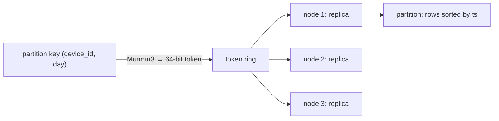

You are ingesting 400,000 sensor readings a second, or a billion user events a day, and you need every one of them stored and readable by device and time window for the next ninety days. A single Postgres primary will take perhaps twenty thousand of those writes a second before the WAL and the B-tree updates saturate the disk, and sharding it yourself means building a routing layer, a rebalancer and a cross-shard query engine.

The Dynamo family (Amazon's 2007 Dynamo paper, Cassandra, ScyllaDB, and in data model if not internals, the DynamoDB service) was built for exactly this shape: writes that scale linearly with node count, no single point of failure, and reads that are fast for one query pattern per table. The trade is everything else. No joins, no ad hoc queries, no multi-row transactions, and a data model where the schema is the query. This lesson uses Cassandra 4.x/5.0 and today's DynamoDB.

## The partition is the unit of everything

A Cassandra table's primary key has two parts: the **partition key**, which decides which nodes store the row, and the **clustering columns**, which decide the order of rows within the partition. Rows with the same partition key live together, sorted by clustering columns, on the same replicas.

```sql
CREATE TABLE readings_by_device (
  device_id   uuid,
  day         date,
  ts          timestamp,
  temp_c      float,
  PRIMARY KEY ((device_id, day), ts)
) WITH CLUSTERING ORDER BY (ts DESC);

SELECT ts, temp_c FROM readings_by_device
WHERE device_id = ? AND day = '2026-09-26' AND ts > '2026-09-26 08:00:00';
```

That is a single-partition read: hash the partition key, go to the owning replicas, read one contiguous sorted slice. It costs the same with ten nodes or a thousand. A query that omits any part of the partition key must ask every node, and Cassandra refuses to run it without `ALLOW FILTERING`, which is the database telling you that you are about to scan the cluster.



The Murmur3 partitioner maps the key to a token between −2⁶³ and 2⁶³ − 1. Each node owns several ranges of that ring (virtual nodes: `num_tokens` is 16 by default since 4.0, 256 before), and a partition is stored on the owner of its token plus the next nodes clockwise, up to the replication factor (RF), skipping to other racks or datacentres under `NetworkTopologyStrategy`. A new node takes over some ranges and streams only that data. That is the mechanism behind "linear scalability".

```viz
{"type": "system", "scenario": "consistent-hashing", "title": "Partition placement on the ring", "caption": "Each partition key hashes to a token; the token's owner and the next replicas store it. Adding a node moves only the ranges it takes over."}
```

## Designing tables from queries, with sizes

Start from the access patterns, not the entities. For 20,000 devices each reporting once a second:

| Query | Frequency | Table | Partition key | Clustering |
|---|---|---|---|---|
| Q1: readings for a device in a time range today | dashboards, constant | `readings_by_device` | `(device_id, day)` | `ts DESC` |
| Q2: latest reading for every device in a building | alerting, every 10 s | `latest_by_building` | `building_id` | `device_id` (upserted) |
| Q3: daily min and max for 90 days | reports | `daily_by_device` | `device_id` | `day DESC` |

Every reading is written to `readings_by_device` and `latest_by_building`; a job writes `daily_by_device` once a day. Denormalisation here is the design, not a compromise: writes are cheap and cross-partition reads are not.

Now size the partitions. A row in the SSTable costs its clustering key (timestamps are delta-encoded), the 4-byte float and per-row overhead for flags and cell timestamps; call it about 30 bytes before compression. At one reading a second:

| Bucket | Rows per partition | Approximate size | Verdict |
|---|---|---|---|
| Day | 86,400 | ~2.6 MB | Comfortable |
| Month | 2,592,000 | ~78 MB | At the edge of the usual limit |
| None (device only) | 31.5 million a year, forever | ~950 MB a year | Broken within weeks |

The working guideline is to keep partitions under about 100 MB and 100,000 rows; Cassandra logs a warning when compaction writes a partition over 100 MB (`compaction_large_partition_warning_threshold`, or the partition-size guardrail in newer versions). Past that, reads of the partition, compaction, repair and streaming all degrade on the replicas that own it. `latest_by_building` holds one row per device, bounded by the building's device count. Two more rules complete the design: spread load (a partition key with few values, or one very hot value, puts all its traffic on RF nodes, the hot-partition problem from [partitioning and sharding](/learn/databases/storage-and-scale/partitioning-and-sharding)), and never read before writing.

## Under the hood: the write path

A client sends a write to any node, which becomes the **coordinator** for that request. The coordinator computes the token, sends the mutation to every replica, and waits for as many acknowledgements as the consistency level requires. On each replica:

1. The mutation is appended to the **commit log**. By default `commitlog_sync` is `periodic` with a 10,000 ms period: the replica acknowledges before `fsync`, so one node's power loss can lose up to ten seconds of acknowledged writes, which RF = 3 is there to cover. `batch` (or `group` in 4.0+) mode fsyncs before acknowledging.
2. The mutation is merged into the **memtable**, a sorted in-memory structure per table. Nothing is read first: a write to an existing row does not look at the old value.
3. When memtable space fills (by default a quarter of the heap) or the commit log reaches its limit, the memtable is flushed to an immutable **SSTable** and the commit log segments it covered are recycled.

```viz
{"type": "system", "scenario": "lsm-tree", "title": "Write path through memtable to SSTables", "caption": "Writes append to the commit log and land in the sorted memtable; flushes produce immutable SSTables; compaction merges SSTables so reads consult fewer files."}
```

Each cell carries a microsecond **write timestamp**, set by the coordinator or the client. A row's current state may be spread across the memtable and several SSTables, and a read merges them cell by cell, newest timestamp wins. The [LSM tree lesson](/learn/advanced-data-structures/log-structured-and-disk-structures/lsm-trees-and-sstables) opens the SSTable format; here the operational facts matter.

## The read path and compaction

A read checks the memtable, then each SSTable that might hold the partition. Each SSTable carries a **bloom filter** over its partition keys (`bloom_filter_fp_chance` is 0.01 by default, 0.1 under leveled compaction), so a definite "no" skips the file without I/O. For a "maybe", a partition index locates the partition's offset, the compression-offset map finds the compressed chunk, and the rows are read and merged.

```viz
{"type": "system", "scenario": "bloom-filter", "title": "Skipping SSTables that cannot contain the key", "caption": "Each SSTable carries a bloom filter over its partition keys. A definite no avoids a disk read; a maybe costs one index lookup that may find nothing."}
```

The number of SSTables a read touches is set by the compaction strategy, chosen per table:

| Strategy | How it merges | Reads touch | Write amplification | Space headroom | Fits |
|---|---|---|---|---|---|
| Size-tiered (STCS, default) | 4 (`min_threshold`) similar-sized SSTables into one | Several per partition | Low (~log₄ of data size) | Up to 50% free for the largest merge | Write-heavy, rarely updated |
| Leveled (LCS) | 160 MB SSTables in levels growing 10× | About one per level | High (10–30×) | ~10% | Read-heavy, update-heavy |
| Time-window (TWCS) | Only within a time window (e.g. one day); old windows never merge | Only windows covering the query | Lowest | One window | Time series with TTL: whole windows are dropped on expiry |

TWCS is the correct choice for `readings_by_device` with a 90-day TTL: each day's data ends up in one SSTable and the whole file is deleted when it expires, with no tombstone scanning. STCS on the same table is a classic disk-full incident, because expired data waits for a large merge. Cassandra 5.0 adds the Unified Compaction Strategy, which can be tuned to behave like either tiered or leveled compaction. The [bloom filter lesson](/learn/advanced-data-structures/probabilistic-structures/bloom-filters) works through the filter sizing.

## Tombstones and resurrection

SSTables are immutable, so a delete writes a **tombstone**: a marker with a timestamp that hides older data for a cell, row, range or whole partition. An expired TTL cell becomes a tombstone too. Compaction drops a tombstone and the data it shadows only after `gc_grace_seconds` (864,000 s, ten days, by default).

Queue-shaped tables are the first casualty: insert and delete constantly, and a partition becomes mostly tombstones that every read must scan. Cassandra warns when one read scans more than 1,000 tombstones (`tombstone_warn_threshold`) and aborts at 100,000 (`tombstone_failure_threshold`). **Do not build a queue in Cassandra.**

The grace period exists because of replicas that missed the delete. Trace it with RF = 3 (replicas A, B, C) and no repair:

1. Day 0: row K is written to A, B and C.
2. Day 1: C's disk fails and C goes down. `DELETE K` at `QUORUM` succeeds on A and B. The coordinator stores a hint for C, but hints are kept only for `max_hint_window` (3 hours by default), and C is down for five days.
3. Day 6: C returns, still holding K with no tombstone.
4. Day 11: gc grace has passed on A and B; compaction purges the tombstone and K's old data.
5. Day 12: someone runs repair. A and B have nothing for K; C has a live K. Repair streams it to A and B. **The deleted row is back.**

Had repair run between day 6 and day 11, C would have received the tombstone. Hence the operational rule: every node must complete repair more often than `gc_grace_seconds`. Lowering the grace period to reclaim space is safe only if repair runs more often than the new value.

## Tunable consistency: the arithmetic

Each keyspace has a replication factor N per datacentre, and each request states a consistency level: how many replicas must respond before the coordinator answers.

| Level | Replicas that must respond |
|---|---|
| `ONE`, `TWO`, `THREE` | That many, anywhere |
| `QUORUM` | ⌊total RF / 2⌋ + 1, across all datacentres |
| `LOCAL_ONE`, `LOCAL_QUORUM` | One, or ⌊local RF / 2⌋ + 1, in the coordinator's datacentre |
| `EACH_QUORUM` (writes only) | A quorum in every datacentre |
| `ALL` | Every replica; one node down fails the request |

If the write was acknowledged by W replicas and the read hears from R, the two sets must share at least W + R − N replicas. When **R + W > N**, that is at least one replica holding the newest timestamp, and the coordinator returns the newest version it hears.

| N | W | R | Guaranteed overlap | Write survives down nodes | Read survives down nodes |
|---|---|---|---|---|---|
| 3 | 1 | 1 | 0: stale reads possible | 2 | 2 |
| 3 | 2 (`QUORUM`) | 2 (`QUORUM`) | 1 | 1 | 1 |
| 3 | 3 (`ALL`) | 1 | 1 | 0 | 2 |
| 5 | 2 | 2 | 0: stale reads possible | 3 | 3 |
| 5 | 3 (`QUORUM`) | 3 (`QUORUM`) | 1 | 2 | 2 |
| 5 | 4 | 2 | 1 | 1 | 3 |

N = 5 buys tolerance of two failures at quorum instead of one, at the cost of two more copies of the data and a slower second-fastest-of-three response becoming a third-fastest-of-five.

```viz
{"type": "system", "scenario": "quorum", "replicas": 3, "title": "Quorum read after quorum write, N=3", "caption": "The write is acknowledged by 2 of 3 replicas; the read waits for 2 of 3. The two sets must share a member, and that member has the newest timestamp, so the read sees the write."}
```

## Two datacentres

With RF 3 in each of two regions (6 replicas), `QUORUM` is ⌊6/2⌋ + 1 = 4, so every operation waits for at least one remote replica: a cross-region round trip, 70–80 ms between the US east coast and western Europe, on every request, and losing one whole region (3 replicas) makes `QUORUM` impossible. That is why multi-region deployments use `LOCAL_QUORUM` (2 of the 3 local replicas): local latency, and a region can fail without the other noticing.

The price is that `LOCAL_QUORUM` writes in one region and `LOCAL_QUORUM` reads in the other have a guaranteed overlap of zero. The write reaches the remote region asynchronously, typically within the cross-region latency plus queueing, and unboundedly during a partition. Writing at `EACH_QUORUM` (2 + 2) restores the overlap for remote `LOCAL_QUORUM` reads at the cost of the cross-region wait on writes. Routing each user to a home region, so their reads follow their writes, is the usual design.

## Consistency level and tail latency

The consistency level also sets the tail. A coordinator sends a write to all N replicas and waits for W acknowledgements, so write latency is the W-th fastest of N. For reads it contacts only R replicas and needs all of them. Assume each replica independently exceeds some latency t with probability 1%, so t is one replica's p99:

| Operation, RF = 3 | Waits for | P(slower than t) | Effect on p99 |
|---|---|---|---|
| Write at `ONE` | fastest of 3 | 0.0001% | Far below one replica's p99 |
| Write at `QUORUM` | 2nd fastest of 3 | 0.03% | Below one replica's p99 |
| Write at `ALL` | slowest of 3 | 2.97% | Worse: t becomes roughly the p97 |
| Read at `ONE` | the 1 replica asked | 1% | Equal to one replica's |
| Read at `QUORUM` | both of the 2 asked | 1.99% | Worse: t becomes roughly the p98 |

The asymmetry is why Cassandra has **speculative retry** (`speculative_retry = '99p'` by default): if a contacted replica has not answered by the table's own p99, the coordinator asks another one. It is also why `ALL` hurts twice, in availability and in latency. The independence assumption fails when replicas are slow together (a shared noisy neighbour, a cluster-wide garbage-collection pause), which is exactly when tails matter most.

## Repairing divergence: three mechanisms

Replicas miss writes all the time: a node restarts, a write times out on one replica, a region is cut off. Nodes learn who is down by gossip: every second each node exchanges state with a random live peer, and a phi-accrual failure detector marks a peer down when its suspicion level passes `phi_convict_threshold` (8 by default), the approach the [gossip and anti-entropy lesson](/learn/system-design/distributed-systems/gossip-and-anti-entropy) covers. Three mechanisms then converge the data.

**Read repair.** Trace a `QUORUM` read with RF = 3. The coordinator sends a full data request to the fastest replica A and a digest (hash) request to B. A returns `{temp: 21.5, ts 1000}`; B's digest differs. The coordinator requests full data from both, B returns `{temp: 20.0, ts 900}`, the newest timestamp wins, and before answering the client the coordinator writes `21.5 @ 1000` to B (blocking read repair, the default in 4.0, which removed the old probabilistic background read repair). C, which was not contacted, stays stale.

**Hinted handoff.** When a replica is down during a write, the coordinator keeps a **hint** and replays it when the node returns, if it returns within `max_hint_window` (3 hours). Hints do not count towards the consistency level.

**Anti-entropy repair.** `nodetool repair` builds a **Merkle tree** per token range on each replica: leaves hash slices of the range, parents hash their children. Replicas compare trees top-down and stream only the slices whose hashes differ, which is how a 1 TB node is compared by exchanging kilobytes. A leaf covers many partitions, though: with 1 billion partitions and 32,768 leaves (the tree size older versions used), each leaf spans about 30,000 partitions, and one differing partition streams all of them. Incremental repair (reliable since 4.0) repairs only data written since the last repair. The [Merkle trees lesson](/learn/advanced-data-structures/log-structured-and-disk-structures/merkle-trees-and-ring-buffers) builds the structure.

## Timestamps and lightweight transactions

"Newest wins" uses write timestamps set from a clock. Two writers whose clocks differ by 200 ms can have the earlier write win, and equal timestamps are broken by comparing the values, not by arrival order. Cassandra has no vector clocks; data that needs ordering under concurrent writers needs idempotent, commutative updates (a set of ids, a counter) or a compare-and-set.

`INSERT … IF NOT EXISTS` and `UPDATE … IF col = ?` are **lightweight transactions**: a Paxos round among the partition's replicas (prepare and promise, read the current value, propose and accept, commit), four round trips instead of one. At about 1 ms per in-region round trip, one LWT costs about 4 ms, and because contended proposals on one partition serialise and retry, throughput on a hot partition falls to hundreds per second. Use them for rare exactly-once claims such as a unique username; the [Paxos lesson](/learn/system-design/distributed-systems/paxos-and-zab-intuition) explains why each phase is needed. Cassandra 4.1 adds an optional Paxos v2 that needs fewer round trips in the uncontended case; the contention behaviour is the same.

Not every "transaction-looking" feature is one. A **logged batch** makes several mutations eventually all-or-nothing across partitions, without isolation; an unlogged batch across partitions is a load spike on one coordinator (the warning threshold is 5 KB of batch, the failure threshold 50 KB).

## DynamoDB: the same model, metered

DynamoDB shares the data model (a partition key, an optional sort key, items up to 400 KB) but not Dynamo's leaderless internals. Its 2022 USENIX paper describes each partition as a three-replica group across availability zones with a Multi-Paxos leader: writes and strongly consistent reads go to the leader, eventually consistent reads to any replica. You pay per request unit:

| Operation | Rule | Example | Units |
|---|---|---|---|
| Strongly consistent read | 1 RCU per 4 KB, rounded up per item | `GetItem` of 5 KB | 2 RCU |
| Eventually consistent read | half | same | 1 RCU |
| Write | 1 WCU per 1 KB, rounded up | `PutItem` of 2.5 KB | 3 WCU |
| Transactional read or write | double | `TransactWriteItems` with that item | 6 WCU |
| `Query` | sizes summed, then rounded to 4 KB | 100 items × 300 B = 30 KB | 8 RCU (4 eventual) |
| `BatchGetItem` | each item rounded separately | the same 100 items | 100 RCU |

Each physical partition serves at most **3,000 RCU and 1,000 WCU** per second and holds about 10 GB. **Adaptive capacity** shifts a table's unused throughput to a hot partition and splits partitions that stay hot, and **burst capacity** banks up to 300 seconds of unused throughput, but no mechanism lets one partition key exceed the per-partition ceiling. A single key taking 1 KB writes throttles near 1,000 a second whatever the table is provisioned at; at 2.5 KB per write, near 333. Write sharding fixes it: append a suffix 0–7 to spread 8,000 writes a second over eight partitions, and read all eight.

Secondary indexes differ in consistency. A **global secondary index** is a separate partitioned table maintained asynchronously, so its reads are eventually consistent, and a GSI short of write capacity throttles writes to the base table. A **local secondary index** shares the base partition key, supports strong reads, must be created with the table, and caps each partition key's item collection at 10 GB.

**Single-table design** puts every entity in one table with generic `PK` and `SK` attributes and encodes access patterns in key prefixes:

| PK | SK | Item |
|---|---|---|
| `USER#42` | `PROFILE` | the user |
| `USER#42` | `ORDER#2026-09-26T10:00#9f3` | an order, sorted by time under the user |
| `ORDER#9f3` | `ITEM#1` | a line item |

`Query PK = USER#42 AND begins_with(SK, "ORDER#")` returns the user's orders in time order from one partition. The model is powerful and nearly unreadable to a newcomer; keep the access-pattern table with the code.

## The anti-patterns, named

- **Secondary indexes as a query engine.** Cassandra's secondary indexes are local to each node, so a query on an indexed non-key column asks every node. Cassandra 5.0's storage-attached indexes are far cheaper, but the fan-out remains. Build a table per query.
- **`ALLOW FILTERING`** in application code: a cluster scan and a modelling bug.
- **Queues.** Insert-then-delete churn produces tombstone-heavy partitions. Use Kafka or Redis.
- **Unbounded partitions.** Anything keyed only by an entity id that accumulates events. Add a time bucket.
- **Read-before-write.** Writes are blind; a read-modify-write is slow and racy without an LWT. Model updates as new rows or commutative operations.
- **Multi-partition unlogged batches** used "for speed", which concentrate load on one coordinator.
- **A cluster nobody owns.** Repair scheduling, compaction tuning, JVM garbage collection and capacity planning are real work. If the write rate fits partitioned Postgres, [choosing a database](/learn/databases/nosql-and-specialised/choosing-a-database) says stay there. The [distributed key-value store case study](/learn/system-design/case-studies/distributed-key-value-store) designs the same machinery from scratch.

## Trade-offs

| | Cassandra / ScyllaDB | DynamoDB | Partitioned Postgres |
|---|---|---|---|
| Write scaling | Linear with nodes, leaderless | Automatic, per-partition ceilings | One primary's WAL |
| Consistency | Per request (`ONE` to `ALL`), LWW, Paxos LWTs | Eventual or strong per read; transactions up to 100 items | Serializable available, full transactions |
| Multi-region writes | Native, `LOCAL_QUORUM` per region | Global tables, last writer wins | Single writer region |
| Query flexibility | One table per query | Key and GSI queries, filter after read | Ad hoc SQL, joins |
| Operational cost | High: repair, compaction, JVM | Low; cost scales with requests | Moderate |

Netflix, one of Cassandra's largest users, has described its viewing-history and key-value data platforms running on it, and in 2024 wrote about a key-value abstraction layer it built over Cassandra so application teams stop modelling partitions by hand.

## Failure modes

| Symptom | Diagnosis | Fix |
|---|---|---|
| Reads on busy devices time out; `nodetool tablehistograms` shows partitions in the gigabytes | No time bucket: partitions grow forever | Add a day or hour bucket to the partition key; migrate by dual-writing |
| Read latency climbs weekly; logs show `tombstone_warn_threshold` warnings | Delete-heavy or queue-shaped table; tombstones kept for `gc_grace_seconds` | Change the model; TWCS with TTL for time series |
| Deleted rows reappear after a repair | A replica missed the delete and gc grace expired before repair reached it | Complete repair within `gc_grace_seconds` on every node; replace long-dead nodes instead of restarting them |
| Disk fills during compaction on a time-series table | STCS merging huge SSTables whose data is mostly expired | TWCS keyed to the TTL; keep 50% headroom under STCS |
| Users see an update vanish and reappear | Writes and reads at `ONE`; R + W ≤ N | `LOCAL_QUORUM` on both sides where it matters |
| One product key throttles in DynamoDB while the table is under its provisioned rate | Per-partition ceiling of 1,000 WCU or 3,000 RCU | Write sharding with suffixes; caching for reads |
| LWT latency in the tens of milliseconds and timeouts under load | Contended Paxos on one partition | Remove LWTs from the hot path; claim ids once, not per request |

## Interviewer follow-ups

**"Design storage for chat messages, newest first per conversation."** Model answer: partition by `(conversation_id, month)` or a bucket sized from message rate, cluster by `(sent_at DESC, message_id)`, state the partition-size bound and the read path for "load older" crossing buckets. Common wrong answer: partition by `conversation_id` alone, which is unbounded for busy group chats.

**"RF 3 and `QUORUM` on both sides. Is that linearizable?"** Model answer: no. Last-write-wins uses clock timestamps, so concurrent writes resolve by clock rather than order; a write that times out at `QUORUM` may have reached one replica and appear later; compare-and-set needs an LWT. What it gives is that a read after a successful write sees it. Common wrong answer: "R + W > N means strongly consistent."

**"Why did a deleted row come back?"** Model answer: trace resurrection: a replica missed the tombstone, gc grace expired and compaction purged it elsewhere, and repair copied the old row back; the fix is repair cadence under `gc_grace_seconds`. Common wrong answer: "a compaction bug".

**"A DynamoDB table at 10,000 WCU throttles one key at about 1,000 writes a second."** Model answer: one partition key maps to one partition with a 1,000 WCU ceiling that adaptive capacity cannot raise; shard the key with suffixes or buffer writes. Common wrong answer: "provision more WCU".

**"Two regions with `LOCAL_QUORUM`. A user writes in Europe and immediately reads in the US."** Model answer: the guaranteed overlap is zero; the read may be stale until replication crosses the ocean; route the user to a home region, or write at `EACH_QUORUM`, or accept it for that data. Common wrong answer: "`LOCAL_QUORUM` is a quorum, so it is consistent."

## What mid-level engineers get wrong

- **Modelling entities, then trying to query them.** The table is shaped by the query; start from the access-pattern table.
- **Forgetting the time bucket** on anything append-only, and discovering 1 GB partitions a year later.
- **Assuming `QUORUM` means strong consistency across regions**, or not noticing that `QUORUM` over two regions pays cross-region latency.
- **Setting `gc_grace_seconds` low to save disk** without changing the repair schedule.
- **Relying on client clocks** for ordering concurrent updates to the same cell.
- **Counting on adaptive capacity** to rescue a single hot DynamoDB key.
- **Choosing size-tiered compaction for TTL'd time series.**

## Exercises

The first exercise is the arithmetic every consistency discussion rests on, generalised to several datacentres; the second is the coordinator's side of a read.

```exercise
id: quorum-overlap
title: Guaranteed overlap between a write and a read
prompt: |
  Implement `min_overlap(rf, write_cl, write_dc, read_cl, read_dc)`.

  `rf` maps each datacentre name to its replica count, for example
  `{"dc1": 3, "dc2": 3}`. A write acknowledged at `write_cl` (coordinated in
  `write_dc`) is guaranteed to be on the replicas that acknowledged it and
  on no others. A read at `read_cl` (coordinated in `read_dc`) hears from
  some set of replicas. Return the smallest possible number of replicas that
  are in both sets, over every choice of sets the levels allow.

  Requirements, where N is the total replica count and q(n) = floor(n/2) + 1:
  - `ONE`, `TWO`: at least 1 or 2 replicas, in any datacentres.
  - `QUORUM`: at least q(N) replicas, in any datacentres.
  - `LOCAL_ONE`, `LOCAL_QUORUM`: at least 1, or q(rf[dc]), in the operation's
    own datacentre. A read at these levels hears only from its own
    datacentre; a write at these levels may also have reached replicas
    elsewhere, but that is not guaranteed.
  - `EACH_QUORUM` (writes only): at least q(rf[d]) in every datacentre.
  - `ALL`: every replica.

  A result of 1 or more means the read is guaranteed to see the write.
languages: [python, javascript]
entry: min_overlap
starter:
  python: |
    def min_overlap(rf, write_cl, write_dc, read_cl, read_dc):
        return 0
  javascript: |
    function min_overlap(rf, write_cl, write_dc, read_cl, read_dc) {
      return 0;
    }
tests:
  - args: [{"dc1": 3}, "QUORUM", "dc1", "QUORUM", "dc1"]
    expected: 1
    label: N = 3, quorum both sides
  - args: [{"dc1": 3}, "ONE", "dc1", "ONE", "dc1"]
    expected: 0
    label: ONE and ONE can miss
  - args: [{"dc1": 5}, "ALL", "dc1", "ONE", "dc1"]
    expected: 1
  - args: [{"dc1": 3, "dc2": 3}, "LOCAL_QUORUM", "dc1", "LOCAL_QUORUM", "dc2"]
    expected: 0
    label: the other region may not have the write yet
  - args: [{"dc1": 3, "dc2": 3}, "QUORUM", "dc1", "QUORUM", "dc2"]
    expected: 2
    label: 4 of 6 on both sides
  - args: [{"dc1": 3, "dc2": 3}, "EACH_QUORUM", "dc1", "LOCAL_QUORUM", "dc2"]
    expected: 1
    hidden: true
  - args: [{"dc1": 3, "dc2": 3}, "LOCAL_QUORUM", "dc1", "QUORUM", "dc1"]
    expected: 0
    hidden: true
    label: a global quorum read can be answered mostly by the other region
  - args: [{"dc1": 3, "dc2": 2}, "QUORUM", "dc1", "QUORUM", "dc2"]
    expected: 1
    hidden: true
    label: uneven datacentres
hints:
  - "Only how many replicas each set has in each datacentre matters. Overlap in one datacentre is at least max(0, a + b - rf[dc])."
  - "The replica counts are small, so enumerating every per-datacentre count for the write and for the read, keeping the valid ones, and taking the minimum total overlap is fast enough."
```

```exercise
id: coordinator-read-repair
title: Resolve a read and pick the replicas to repair
prompt: |
  Implement `coordinator_read(replies, r)`. `replies` lists the replicas in
  the order the coordinator contacts them. Each entry is `null`/`None` for a
  replica that is down, or `[value, timestamp]`.

  - The coordinator uses the first `r` replicas that are up. If fewer than
    `r` are up, return `null`/`None` (the request is unavailable).
  - The winning version has the greatest timestamp. On equal timestamps the
    greater value (plain string comparison) wins, as in Cassandra.
  - Return `[winning_value, repair]`, where `repair` lists, in ascending
    order, the indices (into `replies`) of the contacted replicas whose
    `[value, timestamp]` differs from the winner's. Replicas that were not
    contacted are never repaired.
languages: [python, javascript]
entry: coordinator_read
starter:
  python: |
    def coordinator_read(replies, r):
        return None
  javascript: |
    function coordinator_read(replies, r) {
      return null;
    }
tests:
  - args: [[["v2", 20], ["v1", 10], null], 2]
    expected: ["v2", [1]]
    label: stale replica repaired
  - args: [[null, ["v1", 10], ["v1", 10]], 2]
    expected: ["v1", []]
    label: skips a down replica
  - args: [[["a", 5], null, null], 2]
    expected: null
    label: not enough replicas up
  - args: [[["v1", 10], ["v2", 20], ["v2", 20]], 1]
    expected: ["v1", []]
    label: a read at ONE can return stale data
  - args: [[["apple", 7], ["banana", 7]], 2]
    expected: ["banana", [0]]
    hidden: true
    label: equal timestamps, greater value wins
  - args: [[["x", 1], ["y", 3], ["z", 2]], 3]
    expected: ["y", [0, 2]]
    hidden: true
  - args: [[["x", 1], null, ["y", 2], ["y", 2]], 2]
    expected: ["y", [0]]
    hidden: true
    label: the uncontacted replica is left alone
hints:
  - "Collect `(index, value, ts)` for up replicas until you have `r` of them."
  - "Compare versions as the pair (timestamp, value); both languages can compare strings with < and >."
```

## Senior signals

- You start a Cassandra or DynamoDB design from the access-pattern table, derive one table per query, and size every partition in rows and megabytes with a time bucket where anything is append-only.
- You describe the write path including the 10-second periodic commit-log sync and why RF covers it, and you choose TWCS for TTL'd time series, LCS for read-heavy updates and STCS as the cheap default.
- You can trace tombstone resurrection and tie `gc_grace_seconds`, the 3-hour hint window and the repair schedule together.
- You do the quorum arithmetic for N = 3, N = 5 and two regions, know `LOCAL_QUORUM` across regions guarantees nothing, and know R + W > N is not linearizability.
- You know DynamoDB's unit arithmetic and its 3,000 RCU / 1,000 WCU per-partition ceilings, and you shard hot keys rather than provisioning more.
- You treat LWTs as four round trips on a serialised partition and keep them off the hot path.

## Check yourself

```quiz
- q: >-
    A table stores sensor readings with PRIMARY KEY (device_id, ts). After six months, reads for busy devices time out and compaction falls behind. What is the fix?
  options: ["Raise the replication factor so each partition has more readers", "Add a secondary index on ts so time-range reads skip old rows", "Add a time bucket such as day to the partition key to bound it", "Switch reads to QUORUM so slow replicas stop holding reads back"]
  answer: 2
  explanation: >-
    A partition keyed only by device grows forever: at one reading a second it passes 100 MB within weeks and reaches about 1 GB a year, and every read, compaction and repair of it degrades. Bucketing by day bounds it at about 86,400 rows. Consistency level and replication factor do not change partition size, and a secondary index on the clustering column adds nothing.
- q: >-
    With replication factor 3, a service writes at ONE and reads at ONE. Users occasionally see their update disappear and reappear. Why?
  options: ["Tombstones from earlier deletes are hiding the row on some reads", "R + W = 2 is not above N = 3, so a read can miss the write", "The commit log was not fsynced, so the replica lost the write", "Hinted handoff is disabled, so the write never reaches a replica"]
  answer: 1
  explanation: >-
    Reads and writes at ONE have a guaranteed overlap of 1 + 1 - 3 = 0 replicas, so a read served by a replica the write has not reached returns the old value until hints, read repair or repair catch it up. QUORUM on both sides (2 + 2 > 3) forces an overlap of at least one replica.
- q: >-
    A team lowers gc_grace_seconds from ten days to one hour to reclaim disk faster, and runs repair weekly. What is the likely consequence?
  options: ["Compaction stalls, because tombstones under an hour old are locked", "Deleted rows return, since repair revives copies that missed it", "Nothing bad; tombstones are purged sooner, so reads become faster", "QUORUM writes start failing until the next weekly repair finishes"]
  answer: 1
  explanation: >-
    A tombstone must survive until every replica has been repaired. With a one-hour grace and weekly repair, a replica that missed the delete keeps the row; once compaction purges the tombstone elsewhere, repair treats the old copy as live data and streams it back. The rule is that repair must complete more often than gc_grace_seconds.
- q: >-
    Two regions each have RF 3. Writes use LOCAL_QUORUM in Europe; a US service reads the same row at LOCAL_QUORUM a few milliseconds later. Is the read guaranteed to see the write?
  options: ["Yes, because 2 + 2 is greater than 3 in each of the regions", "No, because LOCAL_QUORUM reads are always served by one node", "Yes, because QUORUM and LOCAL_QUORUM give the same guarantee", "No, because the guaranteed overlap across regions is zero"]
  answer: 3
  explanation: >-
    The write is guaranteed only on two European replicas and the read hears only from US replicas, so the sets need not share any replica; the US copies receive the write asynchronously. EACH_QUORUM writes, or routing the user's reads to the region they wrote in, restore the guarantee. R + W > N holds within one region only.
- q: >-
    Which workload is the worst fit for Cassandra?
  options: ["Append-only sensor time series with a 30-day TTL on every row", "A user activity feed read back by user id in time order", "A job queue with rows inserted and deleted within seconds", "Write-heavy event ingestion at 300,000 events per second"]
  answer: 2
  explanation: >-
    Deletes are tombstone writes kept for gc_grace_seconds, so an insert-delete queue leaves partitions that are mostly tombstones and every read scans through them, hitting the 1,000 warning and 100,000 failure thresholds. The other three are what the partition-plus-clustering model and the LSM engine are built for.
- q: >-
    A DynamoDB table is provisioned at 10,000 write units, but writes of 1 KB items to one popular product key throttle at about 1,000 per second. Why, and what fixes it?
  options: ["Eventually consistent writes throttle hot keys; make the writes strong", "GSIs are consuming the write capacity; drop the indexes not in use", "The table's per-second limit was exceeded; provision more write units", "One key lives in one partition with a 1,000 WCU cap; add a key suffix"]
  answer: 3
  explanation: >-
    Capacity is enforced per physical partition, 1,000 WCU and 3,000 RCU, and one partition key lives in one partition. Adaptive capacity moves unused throughput to that partition but cannot raise the ceiling, and more table capacity does not help. Write sharding (suffix 0 to N-1, read all N) spreads the key across partitions.
```
