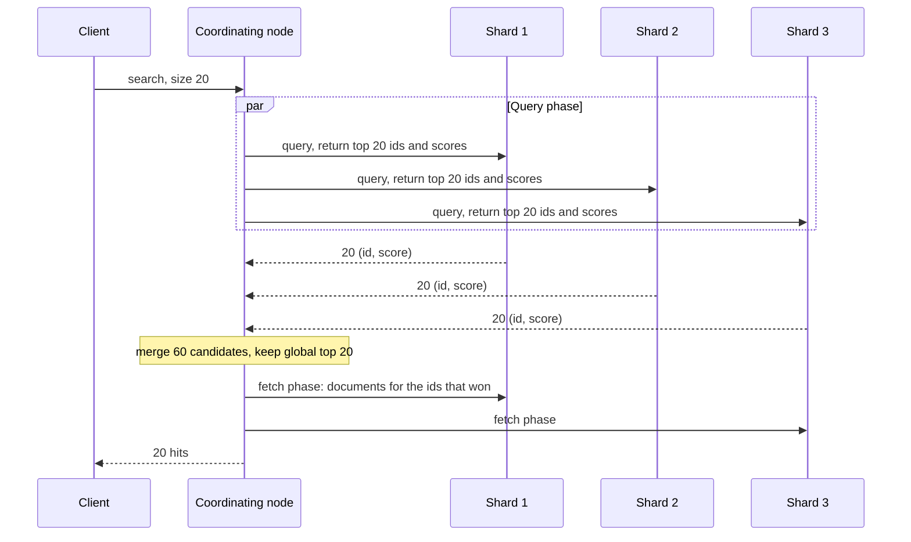

The help centre has a search box, and behind it is this query:

```sql
SELECT id, title FROM articles
WHERE body ILIKE '%connection pool%'
ORDER BY published_at DESC
LIMIT 20;
```

On 4 million articles it takes 11 seconds, because a leading wildcard cannot use a B-tree and Postgres reads every row. It is also wrong in ways speed will not fix. A search for "connection pool" misses an article that only ever talks about "pooling connections", because that text does not contain the literal string. It cannot rank: an article that mentions connection pools once in a footnote comes back above the definitive guide because it was published later. And a user who types "conection pool" gets nothing.

Search engines exist because text retrieval is a different problem from row retrieval. The data structure is different (an inverted index rather than a B-tree), the notion of a match is different (terms produced by an analysis pipeline rather than bytes), and the result is a *ranking*, not a set.

## The inverted index

A B-tree maps a row to its value. An inverted index maps each **term** to the list of documents that contain it, called a **postings list**:

```text
doc 1: "Connection pool sizing"
doc 2: "Pool connections through PgBouncer"
doc 3: "Sizing a thread pool"

term         postings (doc id: positions)
connect      1:[0]  2:[1]            <- "Connection" and "connections" both stem to "connect"
pgbouncer    2:[3]
pool         1:[1]  2:[0]  3:[3]
size         1:[2]  3:[0]            <- "sizing" stems to "size"
thread       3:[2]                   <- "a" at position 1 was dropped as a stop word
through      2:[2]
```

A query is answered by looking up each query term and combining postings lists. Postings are sorted by document ID, so the combination is a merge:

- **AND** is an intersection: walk both sorted lists with two pointers, advancing whichever is behind. Start from the rarest term, because the result can be no longer than its list, and use skip pointers stored every few hundred entries to jump ahead in the long list rather than stepping through it.
- **OR** is a union, merged the same way.
- **Phrase** queries (`"connection pool"`, analysed to `connect pool`) intersect, then check the stored positions: `pool` must appear at position `p + 1` wherever `connect` appears at `p`. Doc 1 matches; doc 2 contains both terms in the other order and does not.

Sorted document IDs also compress well. Instead of storing `[3, 7, 8, 21, 22, 190, 1024]` as seven 4-byte integers (28 bytes), store the gaps `[3, 4, 1, 13, 1, 168, 834]` with a variable-length encoding in which small numbers take one byte: five 1-byte gaps and two 2-byte gaps, 9 bytes. Common terms have dense postings and tiny gaps, so they compress best, which is exactly where compression matters most. Lucene, the library inside Elasticsearch, OpenSearch and Solr, packs postings into blocks of 128 using bit-packing so that decoding is a tight loop the CPU can vectorise.

The term dictionary itself (every distinct term, sorted, pointing to its postings) is stored in Lucene as a finite-state transducer, a compressed relative of the trie. That is what makes prefix queries and autocomplete cheap: walk the prefix, then enumerate everything below it.

```viz
{"type": "trie", "algorithm": "prefix-autocomplete",
 "operations": [["insert", "pool"], ["insert", "pooling"], ["insert", "postgres"], ["insert", "pgbouncer"], ["insert", "partition"], ["prefix", "po"]],
 "title": "Prefix lookup in a term dictionary",
 "caption": "Every term that starts with a prefix sits below one node, so a prefix query walks the prefix once and then enumerates the subtree. Lucene's term dictionary uses a compressed automaton with the same property."}
```

## Analysis decides what can ever match

The index contains whatever the **analyzer** emits, and a query only matches terms that the same analysis would produce. An analyzer is a pipeline:

1. **Character filters** clean raw text: strip HTML, map `&` to `and`.
2. A **tokenizer** splits text into tokens: on whitespace and punctuation (the standard tokenizer follows Unicode word-boundary rules), or into n-grams, or by a language-specific segmenter for Chinese and Japanese.
3. **Token filters** transform tokens: lowercase, remove stop words, fold `é` to `e`, stem (`connections` → `connect`), add synonyms.

You can watch it happen with Elasticsearch's `_analyze` API:

```text
POST /_analyze
{ "analyzer": "english", "text": "Pooling connections with PgBouncer's pools" }
```

```json
{
  "tokens": [
    {"token": "pool",      "start_offset": 0,  "end_offset": 7,  "position": 0},
    {"token": "connect",   "start_offset": 8,  "end_offset": 19, "position": 1},
    {"token": "pgbouncer", "start_offset": 25, "end_offset": 36, "position": 3},
    {"token": "pool",      "start_offset": 37, "end_offset": 42, "position": 4}
  ]
}
```

The stemmer reduced `Pooling` and `pools` to `pool` and `connections` to `connect`; the possessive filter removed `'s`; `with` was dropped as a stop word, leaving a gap at position 2 so phrase queries still measure distance correctly. The query "connection pool" goes through the same analyzer, becomes `connect pool`, and now matches.

The failure modes are all mismatches between index-time and query-time analysis, and they fail silently with zero results:

- A field indexed with the `english` analyzer queried with a `term` query (which skips analysis) for `Pooling` finds nothing, because the index only contains `pool`.
- Identifiers such as SKUs, email addresses and error codes must not be stemmed or split. Map them as `keyword` fields, which index the exact value as one term, and often index text twice: once analysed for search, once as `keyword` for exact filters, sorting and aggregations.
- Changing an analyzer changes what is in the index. Existing documents keep their old terms until reindexed, so the only safe change is to build a new index.

```text
PUT /articles
{
  "settings": { "number_of_shards": 3, "number_of_replicas": 1 },
  "mappings": {
    "properties": {
      "title":        { "type": "text", "analyzer": "english",
                        "fields": { "raw": { "type": "keyword" } } },
      "body":         { "type": "text", "analyzer": "english" },
      "tags":         { "type": "keyword" },
      "published_at": { "type": "date" }
    }
  }
}
```

## Relevance: BM25

Matching produces a set. Search returns a *ranking*, and the default ranking function in Lucene is **BM25**. For each query term `t` in document `d`:

$$ \text{score}(t, d) = \text{idf}(t) \cdot \frac{tf \cdot (k_1 + 1)}{tf + k_1 \cdot \left(1 - b + b \cdot \frac{|d|}{\text{avgdl}}\right)} $$

$$ \text{idf}(t) = \ln\left(1 + \frac{N - n_t + 0.5}{n_t + 0.5}\right) $$

A document's score is the sum over the query terms. Each part encodes an intuition:

- **idf** (inverse document frequency): rare terms are more informative. `N` is the number of documents, `n_t` the number containing `t`.
- **tf** (term frequency) with **saturation**: more occurrences help, with diminishing returns controlled by `k1` (default 1.2). The fraction can never exceed `k1 + 1`.
- **Length normalisation** controlled by `b` (default 0.75): a match in a short document counts for more than the same match in a long one, relative to the average length `avgdl`.

Work it with numbers. The index has 1,000 articles with an average length of 100 terms. `pool` appears in 100 of them and `pgbouncer` in 5:

- idf(pool) = ln(1 + 900.5 / 100.5) ≈ 2.30
- idf(pgbouncer) = ln(1 + 995.5 / 5.5) ≈ 5.20

The query is `pgbouncer pool`. Elasticsearch's `match` query is an OR by default, so any document with either term is a candidate.

| Doc | Length | tf(pool) | tf(pgbouncer) | pool contribution | pgbouncer contribution | Score |
|---|---|---|---|---|---|---|
| A | 50 | 3 | 0 | 2.30 × 1.76 = 4.05 | 0 | 4.05 |
| B | 200 | 3 | 1 | 2.30 × 1.29 = 2.97 | 5.20 × 0.71 = 3.69 | 6.67 |

B is four times longer and mentions `pool` just as often, so its `pool` contribution is lower than A's. But a single occurrence of the rare term outweighs that. Saturation shows up if you vary `tf` in an average-length document: one occurrence gives a factor of 1.0, two give 1.375, ten give 1.96. Stuffing a page with a keyword stops paying quickly, which is the point. (Recent Lucene versions drop the constant `k1 + 1` from the numerator; it scales every score equally and changes no ranking.)

Real relevance work goes beyond the default: boosting fields (a title match beats a body match), `function_score` to blend in recency or popularity, synonyms, and learning-to-rank models trained on click data. The senior point is that relevance is a product problem with a measurement loop (queries with no results, click-through on the first result, reformulation rate), not a setting you pick once.

Structure matters too. Put conditions that should not affect ranking into `filter` context, which is unscored and cacheable:

```text
GET /articles/_search
{
  "query": {
    "bool": {
      "must":   { "match": { "body": "pgbouncer pool" } },
      "filter": [
        { "term":  { "tags": "postgres" } },
        { "range": { "published_at": { "gte": "2026-01-01" } } }
      ]
    }
  },
  "size": 20
}
```

## How Elasticsearch stores and serves an index

An Elasticsearch **index** is split into a fixed number of **primary shards**, each a complete Lucene index, each with replicas on other nodes. A Lucene index is itself a set of immutable **segments**, and the write path should look familiar from [wide-column stores](/learn/databases/nosql-and-specialised/wide-column-stores):

1. A new document goes into an in-memory buffer and is appended to the **translog** (fsynced per request by default, for durability).
2. Every `refresh_interval` (1 second by default) the buffer is written out as a new small segment and becomes searchable. This is why Elasticsearch is **near-real-time**: a document you just indexed is invisible to search for up to a second.
3. Segments are never modified. A delete sets a bit in the segment's live-documents bitmap; an update is a delete plus a new document.
4. Background **merges** combine small segments into larger ones and drop deleted documents, the same role compaction plays in an LSM tree.

A search fans out and gathers:



Three consequences come up in design reviews:

- **The shard count is fixed at creation.** Documents are routed by a hash of their ID modulo the number of primary shards, so changing it means reindexing into a new index (the `_split` and `_shrink` APIs only multiply or divide the count). Size shards for the data you expect: tens of gigabytes each is a common target.
- **Deep pagination is expensive.** Page 500 with 20 per page needs every shard to return its top 10,000, and the coordinator to sort 30,000 candidates for 20 results. Elasticsearch refuses beyond `index.max_result_window` (10,000 by default). Use `search_after` with a sort key, the search equivalent of keyset pagination.
- **Scores use per-shard statistics.** `idf` is computed from each shard's own document counts. In small or skewed indexes the same document can score differently depending on which shard holds it. `search_type=dfs_query_then_fetch` gathers global statistics first, at the cost of an extra round trip.

## Keeping the index in sync with the database

Elasticsearch should almost never be your source of truth. It has no multi-document transactions, it is designed for rebuildable data, and in practice you will reindex from scratch several times in the system's life (every analyzer or mapping change). The database is the truth; the search index is a derived view that lags it.

The tempting way to keep them in sync is the dual write: `INSERT` into Postgres, then `PUT` into Elasticsearch, in the request handler. It fails in both directions. If the second write fails, the index silently misses a document. If two updates to the same article race, the index can apply them in the opposite order to the database and keep the older version permanently.

The robust way is **change data capture**: read the database's own write-ahead log, which already has every committed change in commit order, and turn it into index updates.

```viz
{"type": "system", "scenario": "cdc", "title": "Feeding a search index from the WAL",
 "caption": "A connector such as Debezium reads committed changes from a Postgres replication slot in commit order and applies them to the index as upserts keyed by primary key. Delivery is at-least-once, so the sink must be idempotent, and an abandoned slot makes Postgres retain WAL until the disk fills."}
```

The same machinery handles mapping changes without downtime. Point the application at an **alias** rather than an index name. Create `articles_v2` with the new mapping, backfill it from the database, let CDC catch it up, then switch the alias from `articles_v1` to `articles_v2` in one atomic call. Rollback is switching it back.

Whatever the pipeline, users will see the lag. An author who publishes and immediately searches for their article may not find it for a second or more. Decide whether that matters (it usually does not for search results, and it often does for "my articles" lists, which should read from the database).

## The honest alternative: Postgres full-text search

Postgres has an inverted index too. A `tsvector` is an analysed, position-annotated list of terms; a GIN index is an inverted index over them.

```sql
ALTER TABLE articles ADD COLUMN search tsvector
  GENERATED ALWAYS AS (
    setweight(to_tsvector('english', coalesce(title, '')), 'A') ||
    setweight(to_tsvector('english', coalesce(body,  '')), 'B')
  ) STORED;

CREATE INDEX articles_search_idx ON articles USING gin (search);

EXPLAIN (ANALYZE, BUFFERS)
SELECT id, title, ts_rank(search, q) AS rank
FROM articles, websearch_to_tsquery('english', 'pgbouncer pool') AS q
WHERE search @@ q
ORDER BY rank DESC
LIMIT 20;
```

```text
Limit  (actual time=41.180..41.192 rows=20 loops=1)
  Buffers: shared hit=3104
  ->  Sort  (actual time=41.178..41.186 rows=20 loops=1)
        Sort Key: (ts_rank(articles.search, q.q)) DESC
        Sort Method: top-N heapsort  Memory: 30kB
        ->  Nested Loop  (actual time=0.912..39.804 rows=3120 loops=1)
              ->  Function Scan on websearch_to_tsquery q  (actual time=0.010..0.011 rows=1 loops=1)
              ->  Bitmap Heap Scan on articles  (actual time=0.894..37.201 rows=3120 loops=1)
                    Recheck Cond: (search @@ q.q)
                    Heap Blocks: exact=2877
                    ->  Bitmap Index Scan on articles_search_idx  (actual time=0.611..0.611 rows=3120 loops=1)
                          Index Cond: (search @@ q.q)
Planning Time: 0.402 ms
Execution Time: 41.260 ms
```

Read the plan: the GIN index finds the 3,120 matching articles in well under a millisecond. The time goes on fetching all 3,120 rows and computing `ts_rank` for each, just to keep 20. That is the structural limit of Postgres full-text search. Lucene can skip documents that cannot make the top 20 (it keeps per-block maximum scores and prunes whole blocks), so its cost tracks the result size; Postgres's cost tracks the *match* count. For a query whose terms match two million rows, Postgres ranks two million rows.

Add `pg_trgm` for substring and typo-tolerant matching (`CREATE INDEX ON articles USING gin (title gin_trgm_ops)` makes `ILIKE '%bounc%'` and `similarity()` indexable), and Postgres covers a lot of product search. A reasonable decision rule:

| Stay in Postgres when | Move to a search engine when |
|---|---|
| Up to a few million documents, or queries whose terms match modest numbers of rows | Tens of millions of documents with common-term queries under load |
| Ranking can be simple (weights, recency) | Relevance is a product feature: tuning, synonyms, learning-to-rank |
| Search results must reflect writes immediately and transactionally | A second of staleness is acceptable |
| You do not want another stateful cluster on call | You need faceted aggregations, many languages, fuzzy matching at scale, or highlighting across large corpora |

The case for Postgres is operational as much as technical: no sync pipeline, no second cluster to upgrade, no reindex runbook, and results that are consistent with the rest of your data by construction. When search is central to the product, Elasticsearch or OpenSearch earns its keep. When it is a search box on an admin page, it rarely does. Vector and hybrid search, the newer reason teams add a search system, is covered in [graph, time-series and vector databases](/learn/databases/nosql-and-specialised/graph-time-series-and-vector-databases).

```exercise
id: inverted-index-and-query
title: Analyse, match and rank
prompt: |
  Implement `search(docs, query)`, returning the indices of matching documents
  in ranked order.

  Analysis (apply to documents and to the query): lowercase the text, split on
  every character that is not `a-z` or `0-9`, drop empty tokens, and drop the
  stop words `a, an, and, the, of, to, in, is`. No stemming.

  A document matches if it contains every distinct query term after analysis
  (AND semantics). If the query has no terms after analysis, return `[]`.

  Score a match as the total number of occurrences of the query terms in the
  document. Return matching indices sorted by score descending, ties broken by
  index ascending.

  Building a term-to-postings map first is the realistic approach, but any
  correct method passes.
languages: [python, javascript]
entry: search
starter:
  python: |
    STOP = {"a", "an", "and", "the", "of", "to", "in", "is"}

    def search(docs, query):
        return []
  javascript: |
    const STOP = new Set(["a", "an", "and", "the", "of", "to", "in", "is"]);

    function search(docs, query) {
      return [];
    }
tests:
  - args: [["The connection pool is full", "Pool sizing with Little's law", "PgBouncer pools connections"], "pool"]
    expected: [0, 1]
    label: no stemming, so pools does not match pool
  - args: [["The connection pool is full", "Pool sizing with Little's law", "PgBouncer pools connections"], "connection pool"]
    expected: [0]
  - args: [["The connection pool is full", "Pool sizing with Little's law", "PgBouncer pools connections"], "the of"]
    expected: []
    label: query of only stop words
  - args: [["Pool, pool, POOL!", "pool party", "no match here"], "pool"]
    expected: [0, 1]
    label: case and punctuation
  - args: [["a b c", "b c b", "c"], "c b"]
    expected: [1, 0]
    hidden: true
  - args: [[], "pool"]
    expected: []
    hidden: true
  - args: [["x y", "y x", "x"], "x y"]
    expected: [0, 1]
    hidden: true
  - args: [["Postgres-GIN index", "gin and tonic"], "GIN"]
    expected: [0, 1]
    hidden: true
hints:
  - "Write one analyze(text) function and use it for both documents and the query, exactly as a search engine must."
  - "For each document, count term occurrences in a dictionary; it matches if every query term is a key."
```

## Senior signals

- You explain search as an inverted index plus analysis plus ranking, and you know most "search is broken" bugs are index-time and query-time analysis disagreeing.
- You map identifiers as `keyword`, index important text fields twice, and treat an analyzer change as a reindex.
- You can work BM25 by hand: rare terms dominate, term frequency saturates, long documents are normalised.
- You never make the search engine the source of truth, feed it from the WAL with CDC rather than dual writes, and change mappings with an alias swap.
- You know the operational edges: near-real-time refresh, fixed shard counts, per-shard IDF, deep pagination limits and `search_after`.
- You can argue for Postgres full-text search and name its structural limit: ranking cost grows with the number of matches, not the number of results.

## Check yourself

```quiz
- q: >-
    Users report that searching for "Running" finds nothing, although many documents contain "running". The field uses the english analyzer and the application sends a term query. What is wrong?
  options: ["A term query skips analysis, so it looks for the literal token Running, but the index only contains the analysed token run; use a match query so the query text is analysed the same way", "The index is stale and needs a refresh", "Stop words removed the term", "BM25 scored the documents at zero"]
  answer: 0
  explanation: >-
    Only terms the analyzer emitted exist in the index. Lowercasing and stemming turned running into run at index time. A term query does no analysis, so it can only match keyword fields or pre-analysed input.
- q: >-
    In BM25 with k1 = 1.2, a term appears 1 time in document A and 10 times in document B, both of average length. Roughly how do their contributions for that term compare?
  options: ["B scores 10 times higher", "They score the same", "A scores higher because it is less repetitive", "B scores about twice as high, because term frequency saturates towards k1 + 1"]
  answer: 3
  explanation: >-
    At average length the tf factor is tf × 2.2 / (tf + 1.2): 1.0 for one occurrence and about 1.96 for ten. Saturation stops keyword stuffing from dominating the ranking.
- q: >-
    A team updates Postgres and then calls Elasticsearch in the same request handler. Occasionally search shows an outdated title forever, even though the database is correct. What is the likely mechanism?
  options: ["Elasticsearch loses writes under load", "Two concurrent updates reached the index in the opposite order from the database, so the older version was applied last; feeding the index from the database's WAL via CDC applies changes in commit order", "The refresh interval is too long", "The analyzer changed"]
  answer: 1
  explanation: >-
    Dual writes have no ordering guarantee between the two systems and no atomicity. CDC reads committed changes in commit order and retries idempotently, so the index converges on the database's state.
- q: >-
    A Postgres full-text query with a GIN index takes 2 seconds for common terms but 5 ms for rare ones, even with LIMIT 20. Why?
  options: ["GIN indexes cannot handle common terms", "The statistics are stale", "The index finds matches quickly, but ts_rank must be computed for every matching row before the top 20 can be chosen, so cost grows with the number of matches", "websearch_to_tsquery is slow"]
  answer: 2
  explanation: >-
    Postgres fetches and ranks every match, then sorts. Lucene prunes documents that cannot enter the top k, so its cost tracks the result size much more closely. This is the main technical reason to move heavy ranked search out of Postgres.
- q: >-
    You need to change the analyzer on a 200-million-document Elasticsearch index without downtime. What is the standard approach?
  options: ["Update the mapping in place; Elasticsearch reanalyses existing documents", "Close the index, change the analyzer, reopen it", "Add more replicas", "Create a new index with the new mapping, backfill it from the source of truth while CDC keeps it current, then atomically move the alias the application queries"]
  answer: 3
  explanation: >-
    Existing segments contain the terms the old analyzer produced, and segments are immutable. Building a new index behind an alias lets you verify it before switching and switch back if needed.
```
