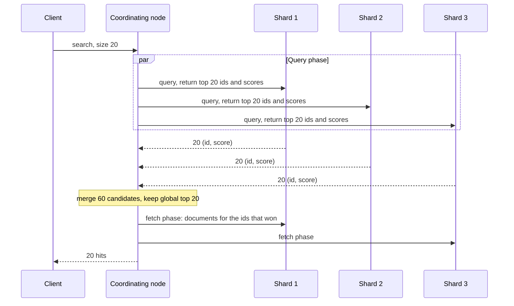

The help centre has a search box, and behind it is this query:

```sql
SELECT id, title FROM articles
WHERE body ILIKE '%connection pool%'
ORDER BY published_at DESC
LIMIT 20;
```

Over 500,000 articles an `ILIKE` like this reads every row, about 200 ms measured on PostgreSQL 17, and the cost grows linearly with the corpus, because a leading wildcard cannot use a B-tree. It is also wrong in ways speed will not fix. A search for "connection pool" misses an article that only talks about "pooling connections", because that text does not contain the literal string. It cannot rank: an article that mentions connection pools once in a footnote comes back above the definitive guide because it was published later. And a user who types "conection pool" gets nothing.

Search engines exist because text retrieval is a different problem from row retrieval. The data structure is different (an inverted index rather than a B-tree), the notion of a match is different (terms produced by an analysis pipeline rather than bytes), and the result is a *ranking*, not a set. This lesson follows Lucene 9.x, the library inside Elasticsearch 8, OpenSearch (the 2021 fork of Elasticsearch 7.10) and Solr.

## The inverted index

A B-tree maps a key to rows. An inverted index maps each **term** to the sorted list of documents that contain it, the **postings list**, with the positions where it occurs:

```text
doc 1: "Connection pool sizing"
doc 2: "Pool connections through PgBouncer"
doc 3: "Sizing a thread pool"

term         postings (doc id: positions)
connect      1:[0]  2:[1]            <- "Connection" and "connections" both stem to "connect"
pgbouncer    2:[3]
pool         1:[1]  2:[0]  3:[3]
size         1:[2]  3:[0]            <- "sizing" stems to "size"
thread       3:[2]                   <- "a" at position 1 was dropped as a stop word
through      2:[2]
```

A query looks up each term and combines postings lists. Because they are sorted by document id, combination is a merge:

- **AND** is an intersection. Trace `size AND pool`: start from the rarer list, `size` = [1, 3]. Look for 1 in `pool`: found. Advance `pool` past 1 to 2, then to 3: found. Result [1, 3]. On long lists, **skip data** stored every 128 documents lets the cursor jump over whole blocks instead of stepping, so the cost tracks the shorter list.
- **OR** is a union, merged the same way.
- **Phrase** queries (`"connection pool"`, analysed to `connect pool`) intersect, then check positions: `pool` must be at position p + 1 wherever `connect` is at p. Doc 1 has `connect` at 0 and `pool` at 1: match. Doc 2 has `pool` at 0 and `connect` at 1: no match.

```viz
{"type": "trie", "algorithm": "prefix-autocomplete",
 "operations": [["insert", "pool"], ["insert", "pooling"], ["insert", "postgres"], ["insert", "pgbouncer"], ["insert", "partition"], ["prefix", "po"]],
 "title": "Prefix lookup in a term dictionary",
 "caption": "Every term that starts with a prefix sits below one node, so a prefix query walks the prefix once and then enumerates the subtree. Lucene's term dictionary uses a compressed automaton with the same property."}
```

## Under the hood: what Lucene writes to disk

A Lucene index is a set of **segments**, each an immutable mini-index with its own files:

| File | Holds | How it is encoded |
|---|---|---|
| `.tim` / `.tip` | Term dictionary / terms index | Sorted terms in blocks of 25–48 sharing prefixes; the index over block prefixes is a finite-state transducer (FST) |
| `.doc` | Document ids and term frequencies per term | Gaps between ids, bit-packed in blocks of 128, plus skip data |
| `.pos`, `.pay` | Positions, offsets, payloads | Also delta-encoded; read only for phrase and span queries |
| `.nvd` | Norms: one byte per document per field | Encoded field length, used by BM25 |
| `.dvd` | Doc values | Column-oriented values for sorting and aggregations |
| `.fdt` | Stored fields (the original `_source`) | Compressed blocks: LZ4 by default; `best_compression` is DEFLATE in Lucene's codec and zstd in recent Elasticsearch |
| `.liv` | Live documents | A bitset; a deleted document's bit is cleared |

An **FST** is a trie that also shares suffixes and emits an output (here, the on-disk address of a term block) along each path. For a vocabulary of millions of terms it is a few megabytes, so looking up a term costs a walk through a small automaton followed by one block read and a scan of at most 48 entries.

Postings compress because ids are sorted. Instead of storing `[3, 7, 8, 21, 22, 190, 1024]` as seven 4-byte integers (28 bytes), store the gaps `[3, 4, 1, 13, 1, 168, 834]`; with variable-length bytes (7 bits per byte), five gaps take one byte and two take two: 9 bytes. Full blocks of 128 gaps are bit-packed at the width of the block's largest gap: if it is 834, 10 bits each, 160 bytes instead of 512. Common terms have dense postings and tiny gaps, so they compress best, which is where it matters most, and decoding a block is a tight loop the CPU vectorises.

## Analysis decides what can ever match

The index contains whatever the **analyzer** emitted, and a query matches only terms that the same analysis produces. An analyzer is a pipeline of character filters (strip HTML, map `&` to `and`), one tokenizer (Unicode word boundaries in the `standard` tokenizer, n-grams, or a language segmenter for Chinese and Japanese), and token filters. Elasticsearch's `english` analyzer is: `standard` tokenizer, then possessive stemmer (`'s` removed), lowercase, English stop words, keyword marker (protects listed words), Porter stemmer. Watch it with the `_analyze` API:

```text
POST /_analyze
{ "analyzer": "english", "text": "Pooling connections with PgBouncer's pools" }
```

```json
{
  "tokens": [
    {"token": "pool",      "start_offset": 0,  "end_offset": 7,  "position": 0},
    {"token": "connect",   "start_offset": 8,  "end_offset": 19, "position": 1},
    {"token": "pgbouncer", "start_offset": 25, "end_offset": 36, "position": 3},
    {"token": "pool",      "start_offset": 37, "end_offset": 42, "position": 4}
  ]
}
```

Trace it: `Pooling` → lowercase `pooling` → Porter `pool`; `connections` → `connect`; `with` is a stop word, removed but leaving a gap at position 2 so phrase distances stay correct; `PgBouncer's` → possessive filter `PgBouncer` → `pgbouncer`; `pools` → `pool`. The query "connection pool" goes through the same chain, becomes `connect pool`, and now matches.

The failures are all mismatches between index-time and query-time analysis, and they fail silently with zero results:

- A `term` query skips analysis, so `term: Pooling` against that field finds nothing: the index holds only `pool`.
- Identifiers (SKUs, emails, error codes) must not be stemmed or split. Map them as `keyword`, which indexes the exact value as one term, and index important text twice: analysed for search, `keyword` for filters, sorting and aggregations.
- Changing an analyzer changes what is in the index. Existing segments keep their old terms, so the only safe change is a new index.

**Typos and prefixes** are handled on the term dictionary, not the documents. A `fuzzy` or `match` query with `fuzziness: AUTO` allows 0 edits for terms of 1–2 characters, 1 edit for 3–5 and 2 for longer ones; Lucene compiles the query term into a Levenshtein automaton and intersects it with the term FST, so `conection` finds `connection` (one insertion) without scanning every term. Autocomplete either indexes edge n-grams (`p`, `po`, `poo`, `pool` as separate terms, a bigger index and plain term lookups) or uses the completion suggester, an in-memory FST of whole suggestions walked by prefix, as the [search autocomplete case study](/learn/system-design/case-studies/search-autocomplete) designs.

```text
PUT /articles
{
  "settings": { "number_of_shards": 3, "number_of_replicas": 1 },
  "mappings": {
    "properties": {
      "title":        { "type": "text", "analyzer": "english",
                        "fields": { "raw": { "type": "keyword" } } },
      "body":         { "type": "text", "analyzer": "english" },
      "tags":         { "type": "keyword" },
      "published_at": { "type": "date" }
    }
  }
}
```

## Relevance: BM25

Matching produces a set; search returns a ranking. Lucene's default is **BM25**. For query term t in document d:

$$ \text{score}(t, d) = \text{idf}(t) \cdot \frac{tf}{tf + k_1 \cdot \left(1 - b + b \cdot \frac{|d|}{\text{avgdl}}\right)} $$

$$ \text{idf}(t) = \ln\left(1 + \frac{N - n_t + 0.5}{n_t + 0.5}\right) $$

A document's score is the sum over the query terms. **idf** rewards rare terms (N documents, n_t containing t). The tf fraction **saturates**: it approaches 1 however large tf gets, at a rate set by `k1` (1.2). **Length normalisation**, weighted by `b` (0.75), makes a match in a short document count for more than the same match in a long one, relative to the average length `avgdl`. Some versions multiply the fraction by the constant k1 + 1 = 2.2; it scales every score equally and changes no ranking.

## BM25 by hand on three documents

Three help articles, already analysed:

| Doc | Terms after analysis | Length |
|---|---|---|
| d1 | pgbouncer pool connect pool size cap connect | 7 |
| d2 | size thread pool | 3 |
| d3 | connect pool pool mode pool size pool timeout pool limit server | 11 |

The query is `pgbouncer pool`; a `match` query is an OR, so all three are candidates. N = 3 and avgdl = (7 + 3 + 11) / 3 = 7.0.

1. **idf(pgbouncer)**: n = 1, so (3 − 1 + 0.5) / (1 + 0.5) = 2.5 / 1.5 = 1.6667, and ln(2.6667) = **0.9808**.
2. **idf(pool)**: n = 3, so (3 − 3 + 0.5) / (3 + 0.5) = 0.1429, and ln(1.1429) = **0.1335**. A term in every document is nearly worthless. The classic Robertson form, ln((N − n + 0.5)/(n + 0.5)), would give −1.95 here and punish documents for containing it; Lucene's added 1 keeps idf positive.
3. **Length factor** K = 1.2 × (0.25 + 0.75 × |d| / 7): d1 = 1.2 × 1.0 = **1.2000**; d2 = 1.2 × (0.25 + 0.3214) = **0.6857**; d3 = 1.2 × (0.25 + 1.1786) = **1.7143**.
4. **Term contributions**, tf / (tf + K) × idf:

| Doc | pgbouncer | pool | Score |
|---|---|---|---|
| d1 | 1 / 2.2 = 0.4545 × 0.9808 = 0.4458 | 2 / 3.2 = 0.6250 × 0.1335 = 0.0835 | **0.5293** |
| d2 | — | 1 / 1.6857 = 0.5932 × 0.1335 = 0.0792 | **0.0792** |
| d3 | — | 5 / 6.7143 = 0.7447 × 0.1335 = 0.0994 | **0.0994** |

The ranking is d1, d3, d2. Counting occurrences would put d3 first (five `pool`s). The one rare term in d1 is worth four and a half times all of d3's matches (0.4458 against 0.0994); d3's five occurrences beat d2's one by only 25%, because saturation flattens tf and d3's length pushes K up while d2's shortness pulls it down. At average length the tf factor for 1, 2, 3, 5, 10 and 100 occurrences is 0.45, 0.63, 0.71, 0.81, 0.89 and 0.99: ten mentions are worth 1.96 times one, not ten times. A script reproduces every number above; this is also what the second exercise implements.

## From scores to the top 20

Scoring every matching document is what makes naive ranking expensive. Lucene (since 8.0) runs **block-max WAND**: each postings block records the best score any document in it could reach, and once the current 20th-best score exceeds what a block could contribute, the block is skipped without decoding. That is why Elasticsearch 7+ stops counting at 10,000 hits by default (`track_total_hits`) and reports "10,000 or more": exact counting would force every match to be visited.

Put conditions that should not affect ranking in **filter context**, which is unscored and cacheable as a bitset:

```text
GET /articles/_search
{
  "query": {
    "bool": {
      "must":   { "match": { "body": "pgbouncer pool" } },
      "filter": [
        { "term":  { "tags": "postgres" } },
        { "range": { "published_at": { "gte": "2026-01-01" } } }
      ]
    }
  },
  "size": 20
}
```

Real relevance work goes further: field boosts (a title match beats a body match), `function_score` to blend in recency or popularity, synonyms, and learning-to-rank models trained on clicks. Relevance is a product problem with a measurement loop (zero-result rate, click-through on the first result, reformulation rate), not a setting you choose once.

## Segments, refresh, translog and merges

An Elasticsearch **index** is a fixed number of **primary shards**, each a complete Lucene index, each with replicas. The write path on one shard:

1. The document is analysed into an in-memory indexing buffer (shared across shards, 10% of the heap by default) and appended to the **translog**. With the default `index.translog.durability: request` the translog is fsynced before the request is acknowledged.
2. Every `refresh_interval` (1 s by default) the buffer is written out as a new small segment and opened for search. That is why Elasticsearch is **near-real-time**: a document is invisible to search for up to a second, and `?refresh=wait_for` makes a request wait for it. Shards that have had no searches for 30 seconds skip scheduled refreshes until the next search.
3. Periodically, or when the translog passes its size threshold, a **flush** performs a Lucene commit (fsyncs the segments) and trims the translog. Recovery after a crash replays the translog on top of the last commit.
4. Segments are never modified. A delete clears a bit in the segment's live-documents bitset; an update is a delete plus a new document in a new segment.
5. Lucene's `TieredMergePolicy` merges roughly ten similar-sized segments at a time in the background, preferring segments with many deletions, and stops growing segments at about 5 GB. Merging is where deleted documents finally disappear.

This is an LSM tree for text, the same shape as [wide-column stores](/learn/databases/nosql-and-specialised/wide-column-stores): immutable files, background merges, deletes as markers. One consequence surprises people: deleted documents still count in `docFreq` and `docCount` until merged, so idf, and therefore scores, drift with update churn, and a primary and its replica, which merge independently, can score the same document slightly differently.

## Shards, replicas and the distributed query

A search fans out and gathers in two phases:



Replication is primary-backup at the document level: the primary indexes the operation, assigns it a sequence number and forwards it to every in-sync replica, and acknowledges once they have all applied it; a replica that fails is removed from the in-sync set rather than blocking writes. (OpenSearch also offers segment replication, which copies finished segments instead of re-indexing on each replica.) Documents are routed to a shard by a hash of their id modulo the number of primary shards, so the count is fixed at creation (1 by default since 7.0); `_split` and `_shrink` only multiply or divide it, and anything else is a reindex. The documented guidance is shards of 10–50 GB and under about 200 million documents; a Lucene index holds at most about 2.1 billion.

**The distributed IDF problem.** Each shard computes idf from its own statistics. Suppose shard 1 holds 1,000 documents with `pgbouncer` in one of them, and shard 2 holds 1,000 with `pgbouncer` in 100. Shard 1's idf is ln(1 + 999.5 / 1.5) = 6.50; shard 2's is ln(1 + 900.5 / 100.5) = 2.30. The same document scores 2.8 times higher on shard 1, and the merged top 20 is ordered by an accident of routing. `search_type=dfs_query_then_fetch` first collects global statistics (N = 2,000, n = 101, idf 2.98) at the cost of an extra round trip; large, evenly routed indexes rarely need it, small or skewed ones do.

**Deep pagination.** Page 500 at 20 per page means `from = 9,980`: every shard returns its top 10,000, and on five shards the coordinator sorts 50,000 entries to return 20. Elasticsearch refuses beyond `index.max_result_window` (10,000). Use `search_after` with a sort key and a tiebreaker, over a point-in-time (PIT) snapshot so pages stay consistent: each page costs the same as the first, like keyset pagination in SQL.

## Keeping the index in sync

Elasticsearch should almost never be your source of truth. It has no multi-document transactions, and you will reindex from scratch several times in a system's life (every analyzer or mapping change). The database is the truth; the index is a derived view that lags it.

The tempting design is the dual write: `INSERT` into Postgres, then `PUT` into Elasticsearch, in the request handler. It fails both ways. If the second write fails, the index silently misses the document. If two updates race, the index can apply them in the opposite order to the database and keep the older version forever.

The robust design is **change data capture**: read the database's write-ahead log, which already has every committed change in commit order, and turn it into index operations.

```viz
{"type": "system", "scenario": "cdc", "title": "Feeding a search index from the WAL",
 "caption": "A connector such as Debezium reads committed changes from a Postgres replication slot in commit order and applies them to the index as upserts keyed by primary key. Delivery is at-least-once, so the sink must be idempotent, and an abandoned slot makes Postgres retain WAL until the disk fills."}
```

Make the sink order-safe with **external versioning**: index with `version_type=external` and the row's version (or the change's log position) as `version`. Trace a redelivery: update A (version 10) and update B (version 11) arrive as B, then A. B is indexed at version 11; A arrives with 10, which is not greater than 11, so Elasticsearch rejects it with a 409 and the index keeps B. Redelivered duplicates are rejected the same way.

Mapping changes use an **alias**. The application queries `articles`, an alias for `articles_v1`. Create `articles_v2` with the new mapping, backfill it from the database, let CDC catch it up, compare, then swap the alias in one atomic call. Rollback is swapping it back. Whatever the pipeline, users see the lag: an author who publishes and immediately searches may not find the article for a second or more, so "my articles" lists should read from the database. The [change data capture lesson](/learn/big-data/streaming/change-data-capture) covers slots, snapshots and connectors.

## Postgres full-text search, measured

Postgres has an inverted index too. A `tsvector` is an analysed, position-annotated list of terms; a GIN index maps each term to the rows containing it, the same structure as the [GIN indexes](/learn/databases/relational-fundamentals/indexes) used for arrays and `jsonb`.

```sql
ALTER TABLE articles ADD COLUMN search tsvector
  GENERATED ALWAYS AS (to_tsvector('english', title || ' ' || body)) STORED;
CREATE INDEX articles_search_idx ON articles USING gin (search);

SELECT id, ts_rank(search, q) AS rank
FROM articles, websearch_to_tsquery('english', 'pgbouncer') AS q
WHERE search @@ q
ORDER BY rank DESC
LIMIT 20;
```

Measured on PostgreSQL 17.11 with 500,000 synthetic articles of 60 words each (a 175 MB table): `pgbouncer` appears in 1,550 of them and `pool` in 249,623.

| Query | Plan | Time (warm) |
|---|---|---|
| `body ILIKE '%pgbouncer%'` (count) | Parallel sequential scan of every row | 216 ms |
| `@@ 'pgbouncer'`, ranked, top 20 | GIN bitmap scan; fetch and rank 1,550 rows | 1.7 ms |
| `@@ 'pool'`, ranked, top 20 | Planner switches to a sequential scan; ranks 249,623 rows | 49 ms |
| `@@ 'pool'`, unranked `LIMIT 20` | Stops after 20 matches | 0.07 ms |
| `@@ 'pgbouncer & pool'`, ranked | GIN intersection; 714 rows | 2.6 ms |
| `body ILIKE '%pgbounc%'` with a `pg_trgm` GIN index | Trigram index then recheck | 2.9 ms |

The costs were a 115 MB GIN index (9 s to build) plus the stored `tsvector` column, which grew the table (heap and TOAST) from 175 MB to 542 MB, and 120 MB for the trigram index. Read the pattern: GIN finds matches in well under a millisecond, but ranked queries fetch and score **every** match before keeping 20, so cost tracks the match count, not the page size. Lucene's block-max WAND makes cost track the result size much more closely. `ts_rank` also has no idf: it weighs term frequency and position, so a term in half the corpus counts like a rare one.

## Choosing between them

| | Postgres FTS (+ `pg_trgm`) | Elasticsearch / OpenSearch |
|---|---|---|
| Ranking | `ts_rank`: frequency and weights, no corpus statistics | BM25, boosts, function scores, learning to rank |
| Cost of a ranked query | Grows with the number of matches | Grows with the result size (top-k pruning) |
| Freshness | Transactional: visible at commit | ~1 s refresh, plus the sync pipeline's lag |
| Scale | Millions of documents on one node | Billions across shards |
| Operations | Nothing new | A cluster, a sync pipeline, reindex runbooks |

Stay in Postgres when the corpus is up to a few million documents, ranking can be simple, and results must reflect writes immediately. Move to a search engine when relevance is a product feature, common-term queries over tens of millions of documents run under load, or you need facets, many languages and fuzzy matching at scale. Vector and hybrid search are covered in [graph, time-series and vector databases](/learn/databases/nosql-and-specialised/graph-time-series-and-vector-databases).

## Failure modes

| Symptom | Diagnosis | Fix |
|---|---|---|
| Searches for a word return nothing although documents contain it | Index-time and query-time analysis differ (`term` query on a `text` field, analyzer changed without reindexing); check with `_analyze` | Use `match` for text, `keyword` for identifiers; reindex behind an alias |
| Search shows an outdated title forever | Dual writes applied out of order | CDC from the WAL with external versioning |
| `Result window is too large` errors from a paging UI | `from + size` over 10,000 | `search_after` with a PIT |
| Cluster state bloats and indexing slows after importing JSON logs | Dynamic mapping created thousands of fields (the limit is 1,000 per index by default) | Explicit mappings, `dynamic: false` or `flattened` fields |
| Indexing throughput collapses during a bulk load | A refresh every second creates and merges thousands of tiny segments | `refresh_interval: -1` and replicas 0 during the load, then restore |
| Scores for the same query differ between runs | Per-shard idf and deleted-document counts differ between primary and replica | `preference` to pin a session to copies, or `dfs_query_then_fetch` for small indexes |
| Postgres disk fills while the search sync is paused | An inactive replication slot retains WAL | Monitor slot lag; drop or advance abandoned slots |

## Interviewer follow-ups

**"You index a document and search for it immediately. What happens?"** Model answer: the write is in the indexing buffer and the translog, acknowledged and durable, but not in a searchable segment until the next refresh, up to a second later; use `refresh=wait_for` if the caller must see it, never a refresh per document. Common wrong answer: "it is searchable when the index call returns".

**"Why can the same query score a document differently between runs?"** Model answer: idf comes from per-shard statistics, and deleted documents count until merged, so a primary and a replica with different merge histories disagree; pin copies with `preference` or use DFS for small indexes. Common wrong answer: "BM25 is non-deterministic".

**"Users need page 1,000 of results."** Model answer: `from + size` makes every shard return 20,000 candidates and the coordinator sort shards × 20,000; use `search_after` with a PIT, and question whether page 1,000 is a product need. Common wrong answer: "raise `max_result_window`".

**"How do you keep Elasticsearch in sync with Postgres?"** Model answer: CDC from the WAL in commit order, an idempotent sink with external versions, backfill and alias swaps for mapping changes, lag monitoring on the slot. Common wrong answer: "write to both in one transaction", which no two-system transaction exists for.

**"When is Postgres full-text search enough?"** Model answer: when matches per query are modest and ranking is simple; measured, a rare term ranks in about 2 ms, but a term matching half of 500,000 documents costs about 50 ms because every match is ranked, and `ts_rank` has no idf. Common wrong answer: "never, it has no inverted index".

## What mid-level engineers get wrong

- **Using `term` queries on analysed text**, then debugging "missing" documents in the application.
- **Stemming identifiers** such as SKUs and error codes because they were mapped as `text`.
- **Changing an analyzer in place** and expecting old documents to follow.
- **Dual-writing from the request handler**, which silently diverges under failures and races.
- **Treating relevance as a setting** instead of a measured product loop.
- **Paginating with `from` into the tens of thousands.**
- **Oversharding small indexes**, which also makes per-shard idf noisy.

## Exercises

The first exercise builds the match-and-count core of a search engine; the second is the BM25 ranking you traced above.

```exercise
id: inverted-index-and-query
title: Analyse, match and rank
prompt: |
  Implement `search(docs, query)`, returning the indices of matching documents
  in ranked order.

  Analysis (apply to documents and to the query): lowercase the text, split on
  every character that is not `a-z` or `0-9`, drop empty tokens, and drop the
  stop words `a, an, and, the, of, to, in, is`. No stemming.

  A document matches if it contains every distinct query term after analysis
  (AND semantics). If the query has no terms after analysis, return `[]`.

  Score a match as the total number of occurrences of the query terms in the
  document. Return matching indices sorted by score descending, ties broken by
  index ascending.

  Building a term-to-postings map first is the realistic approach, but any
  correct method passes.
languages: [python, javascript]
entry: search
starter:
  python: |
    STOP = {"a", "an", "and", "the", "of", "to", "in", "is"}

    def search(docs, query):
        return []
  javascript: |
    const STOP = new Set(["a", "an", "and", "the", "of", "to", "in", "is"]);

    function search(docs, query) {
      return [];
    }
tests:
  - args: [["The connection pool is full", "Pool sizing with Little's law", "PgBouncer pools connections"], "pool"]
    expected: [0, 1]
    label: no stemming, so pools does not match pool
  - args: [["The connection pool is full", "Pool sizing with Little's law", "PgBouncer pools connections"], "connection pool"]
    expected: [0]
  - args: [["The connection pool is full", "Pool sizing with Little's law", "PgBouncer pools connections"], "the of"]
    expected: []
    label: query of only stop words
  - args: [["Pool, pool, POOL!", "pool party", "no match here"], "pool"]
    expected: [0, 1]
    label: case and punctuation
  - args: [["a b c", "b c b", "c"], "c b"]
    expected: [1, 0]
    hidden: true
  - args: [[], "pool"]
    expected: []
    hidden: true
  - args: [["x y", "y x", "x"], "x y"]
    expected: [0, 1]
    hidden: true
  - args: [["Postgres-GIN index", "gin and tonic"], "GIN"]
    expected: [0, 1]
    hidden: true
hints:
  - "Write one analyze(text) function and use it for both documents and the query, exactly as a search engine must."
  - "For each document, count term occurrences in a dictionary; it matches if every query term is a key."
```

```exercise
id: bm25-ranking
title: Rank documents with BM25
prompt: |
  Implement `bm25_rank(docs, query)`. `docs` is a list of already-analysed
  documents, each a list of terms; `query` is a list of terms (count each
  distinct query term once). Use k1 = 1.2 and b = 0.75.

  - N is the number of documents, avgdl the mean document length in terms,
    n_t the number of documents containing term t.
  - idf(t) = ln(1 + (N - n_t + 0.5) / (n_t + 0.5))
  - For each query term t with frequency tf > 0 in document d, add
    idf(t) * tf / (tf + k1 * (1 - b + b * len(d) / avgdl)).

  Return the indices of documents with a score above 0, sorted by score
  descending, ties broken by index ascending. An empty collection returns
  `[]`.
languages: [python, javascript]
entry: bm25_rank
starter:
  python: |
    import math

    def bm25_rank(docs, query):
        return []
  javascript: |
    function bm25_rank(docs, query) {
      return [];
    }
tests:
  - args: [[["pgbouncer", "pool", "connect", "pool", "size", "cap", "connect"], ["size", "thread", "pool"], ["connect", "pool", "pool", "mode", "pool", "size", "pool", "timeout", "pool", "limit", "server"]], ["pgbouncer", "pool"]]
    expected: [0, 2, 1]
    label: the traced example
  - args: [[["pool", "a", "b", "c", "d", "e", "f", "g", "h", "i"], ["pool"]], ["pool"]]
    expected: [1, 0]
    label: the shorter document wins a tie on tf
  - args: [[["a", "b"], ["c"]], ["zzz"]]
    expected: []
    label: no document matches
  - args: [[], ["pool"]]
    expected: []
    label: empty collection
  - args: [[["common", "common", "common", "x"], ["rare", "y", "z", "w"], ["common", "q", "r", "s"]], ["rare", "common"]]
    expected: [1, 0, 2]
    hidden: true
    label: idf lets one rare term beat three common ones
  - args: [[["a", "a", "a", "a", "a", "a", "a", "a", "z", "z"], ["a", "b", "z", "z", "z", "z", "z", "z", "z", "z"]], ["a", "b"]]
    expected: [1, 0]
    hidden: true
    label: saturation caps repeated terms
  - args: [[["same", "doc"], ["same", "doc"]], ["same"]]
    expected: [0, 1]
    hidden: true
    label: equal scores keep index order
  - args: [[["pool", "pool", "pool", "pool", "pool", "pool", "pool", "pool", "pool", "pool"], ["pool", "x", "x", "x", "x", "x", "x", "x", "x", "x"], ["x", "x", "x"]], ["pool", "pool"]]
    expected: [0, 1]
    hidden: true
    label: a term in most documents still adds a positive score
hints:
  - "Compute N, avgdl and each term's document frequency once, before scoring any document."
  - "Deduplicate the query while keeping order; a repeated query term must not count twice."
```

## Senior signals

- You explain search as analysis plus an inverted index plus ranking, and you know most "search is broken" bugs are index-time and query-time analysis disagreeing.
- You can describe Lucene's files: an FST over blocks of terms, gap-encoded postings bit-packed in blocks of 128, positions only for phrases, norms, doc values and a live-docs bitset.
- You can work BM25 by hand: idf from N and n, saturation through k1, length normalisation through b and avgdl, and why a term in every document is nearly worthless.
- You know the write path's defaults (translog fsync per request, 1 s refresh, background tiered merges) and that deletes only disappear at merge time and still count in idf until then.
- You can explain per-shard idf, deep-pagination cost and `search_after`, and you size shards at 10–50 GB.
- You never make the search engine the source of truth; you feed it by CDC with external versions and change mappings with an alias swap.
- You can argue for Postgres full-text search with measured numbers and name its structural limit: ranked cost grows with the match count.

## Check yourself

```quiz
- q: >-
    Users report that searching for "Running" finds nothing, although many documents contain "running". The field uses the english analyzer and the application sends a term query. What is wrong?
  options: ["BM25 gave those documents a score of zero, so they were filtered out", "A term query skips analysis, but the index holds only the stemmed run", "The index has not refreshed yet, so those documents are still invisible", "The english stop-word filter removed running from the index entirely"]
  answer: 1
  explanation: >-
    Only terms the analyzer emitted exist in the index: lowercasing and stemming turned running into run. A term query does no analysis, so it looks for the literal token Running; a match query analyses the query text the same way as the documents. Stop words are words like the and of, and refresh lag lasts about a second, not indefinitely.
- q: >-
    In BM25 with k1 = 1.2, a term appears once in document A and ten times in document B, both of average length. How do their contributions for that term compare?
  options: ["A scores higher, since BM25 penalises repeated terms as stuffing", "B scores about twice as high, since term frequency saturates", "They score the same, since BM25 counts only presence per document", "B scores ten times higher, since tf is multiplied straight into it"]
  answer: 1
  explanation: >-
    At average length the tf factor is tf / (tf + 1.2): 0.45 for one occurrence and 0.89 for ten, a ratio of 1.96. More occurrences still help, so presence-only and penalty models are wrong, but saturation stops keyword stuffing from dominating the ranking.
- q: >-
    A corpus has 3 documents and the query term pool appears in all of them. Under Lucene's BM25, what does pool contribute to the ranking?
  options: ["Nothing, because idf is exactly zero when n equals N", "A small positive amount, because idf is ln(1 + 0.5 / 3.5)", "A negative amount, because a term in every document is noise", "The largest amount, because it matches every document"]
  answer: 1
  explanation: >-
    Lucene's idf is ln(1 + (N - n + 0.5) / (n + 0.5)) = ln(1.1429) = 0.13, positive but small, so a rarer query term dominates the ranking. The classic Robertson idf without the added 1 would be ln(0.5 / 3.5), which is negative; Lucene added the 1 precisely to avoid penalising documents for containing a common query term.
- q: >-
    A team updates Postgres and then calls Elasticsearch in the same request handler. Occasionally search shows an outdated title forever, although the database is correct. What is the likely mechanism?
  options: ["The refresh interval is too long, so the new title never surfaces", "Two updates reached the index out of order, so the older one won", "An analyzer change left the old title's terms in older segments", "Elasticsearch drops some writes under load without reporting them"]
  answer: 1
  explanation: >-
    Dual writes have no ordering guarantee between the two systems, so two concurrent updates can reach the index in the opposite order from the database. Refresh delays visibility by about a second, not forever. CDC applies committed changes in commit order, and external versioning makes the index reject a stale version even if it is redelivered late.
- q: >-
    A Postgres full-text query with a GIN index takes about 50 ms for a common term but under 2 ms for a rare one, even with LIMIT 20. Why?
  options: ["Every match must be fetched and ranked before the top 20 are known", "GIN indexes cannot store postings for terms in over half the rows", "websearch_to_tsquery reparses the query once for each row it sees", "The planner's statistics are stale for the most common search terms"]
  answer: 0
  explanation: >-
    The ORDER BY on ts_rank forces Postgres to compute the rank of every matching row before sorting; measured, 1,550 matches took 1.7 ms and 249,623 took 49 ms, with the planner switching to a sequential scan. Lucene's block-max WAND skips blocks that cannot enter the top k, so its cost tracks the result size much more closely.
- q: >-
    You need to change the analyzer on a 200-million-document Elasticsearch index without downtime. What is the standard approach?
  options: ["Build a new index, backfill and sync it, then swap the alias to it", "Close the index, change the analyzer on it, and then reopen the index", "Update the mapping in place, since old documents are reanalysed", "Add a replica with the new analyzer, then promote it to be primary"]
  answer: 0
  explanation: >-
    Segments are immutable and hold the terms the old analyzer produced, so neither an in-place change nor a reopened index reanalyses them, and a replica is a copy of the same segments. Build the new index, backfill it from the source of truth while CDC keeps it current, compare, and move the alias atomically, which also gives an instant rollback.
```
