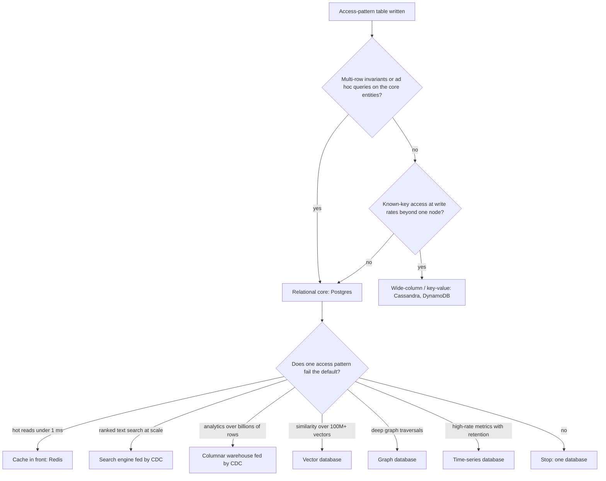

A startup chooses MongoDB because "the schema will change a lot" and Cassandra for its event history because "it needs to scale". Eighteen months later the product has a relational core (customers, orders, invoices, refunds) that the team keeps consistent with multi-document transactions and application-side joins. The event history takes 300 writes a second, which one Postgres table would have absorbed without noticing. The three-person platform team half-understands two clusters, each with its own backup procedure, upgrade path and 3 a.m. failure modes.

None of those choices was wrong in the abstract. Each was made from a product's reputation instead of the workload's requirements, and each was paid for in operating cost long before any benefit arrived. A senior engineer's contribution in this conversation is not knowing more databases. It is asking the four questions that turn "which database is best?" into "which requirement does the default fail, and by how much?"

## Start from the default

For a new transactional system, the default is a mainstream relational database (Postgres in this track), and the burden of proof is on anything else. That is not nostalgia. It is a list of capabilities you get together, in one system, with decades of operational knowledge behind them:

- transactions across any rows, constraints, and a choice of isolation levels;
- ad hoc queries and joins planned by an optimiser, with secondary indexes of several kinds;
- `jsonb` for flexible attributes, full-text search, `pgvector` for similarity, partitioning for time-ordered data;
- replication, point-in-time recovery, and a managed offering from every cloud provider.

What does one well-provisioned node realistically handle? The honest answer depends on hardware, row width and query mix, so treat these as orders of magnitude to check against a benchmark of *your* workload:

| Dimension | Comfortable on one Postgres primary | Where it starts to take real work |
|---|---|---|
| Data size | Hundreds of GB to a few TB | Tens of TB (vacuum, backups, index builds get slow) |
| Simple indexed writes | Thousands to low tens of thousands per second | Sustained high tens of thousands per second |
| Indexed point reads | Tens of thousands per second, more with read replicas | When replicas are not enough and reads must be partitioned |
| Connections | A few hundred active, thousands with a pooler | Tens of thousands of clients without a pooler |

Most products never leave the left column. Many that do, leave it for one table or one access pattern, and the right move is to take *that* workload elsewhere while the relational core stays put.

## The four questions

### 1. What are the access patterns?

Write the access-pattern table before discussing products, exactly as in [modelling for access patterns](/learn/databases/data-modeling-and-evolution/modelling-for-access-patterns): every query the system will run, its shape, its frequency, its latency target and its result size. Then map shapes to the data structures that serve them:

| Access shape | Structure that serves it | Stores built around it |
|---|---|---|
| Point lookup and range scan by key, plus ad hoc filters and joins | B-tree indexes and a query planner | Postgres, MySQL |
| Known-key access only, very high write rates, no joins | Hash partitioning plus a sorted clustering key over an LSM tree | Cassandra, DynamoDB, ScyllaDB |
| Sub-millisecond reads of a hot working set | In-memory hash tables and data structures | Redis, Memcached |
| Whole documents read and written as a unit | Document storage with secondary indexes | MongoDB, Postgres `jsonb` |
| Ranked text relevance | Inverted index | Elasticsearch, OpenSearch, Postgres FTS |
| "Most similar to this vector" | HNSW or IVF | pgvector, dedicated vector databases |
| Deep, variable-length traversals | Index-free adjacency | Neo4j and other graph stores |
| Aggregations over billions of rows | Columnar storage, vectorised execution | ClickHouse, BigQuery, Snowflake |
| High-rate time-ordered points with retention | Time-partitioned compressed columns | Prometheus, TimescaleDB, InfluxDB |

The table turns a vague requirement into a checkable one. "We need to scale" becomes "Q7 is a known-key write at 40,000 per second with no reads except by key", and that sentence chooses the store for you.

### 2. What consistency does each operation need?

Ask this per operation, not per system. Moving money or decrementing inventory needs atomic, isolated, multi-row transactions. A "likes" counter can be approximate and eventually consistent. Editing your own profile needs read-your-writes: *you* must see the change immediately, even if other users see it a second later.

That list decides a lot. If the core entities have invariants spanning several rows (an order and its line items and the stock they reserve), you need transactions over those rows, which points to a relational store or a design that keeps each invariant inside one partition (DynamoDB and MongoDB both offer transactions, with limits on size and cost). If most operations tolerate staleness and the system must stay writable during network partitions, a leaderless store with tunable consistency fits:

```viz
{"type": "system", "scenario": "quorum", "replicas": 3,
 "title": "Tunable consistency per operation",
 "caption": "With N = 3 replicas, writing to W = 2 and reading from R = 2 guarantees the read set overlaps the latest write. Leaderless stores let each query choose W and R, trading latency and availability against staleness, which is exactly the per-operation decision this question asks for."}
```

Two traps. First, "eventually consistent" names no bound and no anomaly: ask which stale read a user will see, for how long, and what happens when they act on it. Second, asynchronous replication means a failover can lose the last acknowledged writes on *any* store, relational included; that is a durability question to answer explicitly (see [replication](/learn/databases/storage-and-scale/replication)).

### 3. What is the scale, and what shape does it have?

Put numbers on it with a back-of-envelope estimate, and keep the shape as well as the size:

- **Data size and growth.** Fifty million users with 2 KB profiles is 100 GB, which fits in the RAM of one large machine. Twenty thousand events a second at 500 bytes is 864 GB a day, over 300 TB a year before replication: a partitioning problem, not a tuning problem.
- **Read:write ratio and write shape.** Read-heavy workloads scale with replicas and caches. Write-heavy ones scale only by partitioning.
- **Hot keys.** A celebrity account, a flash-sale SKU or a global counter concentrates load on one key whatever the cluster size.
- **Working set versus memory.** A database whose hot data fits in the buffer pool behaves completely differently from one that must read disk for most requests.
- **Geography.** Writes accepted in several regions means either cross-region latency on every write or conflict resolution.

Write shape is where storage engines genuinely differ. A B-tree updates pages in place: reads are cheap and predictable, and random writes cost a page write plus WAL each. An LSM tree turns every write into a sequential append and pays later in compaction and in reads that may check several files:

```viz
{"type": "system", "scenario": "lsm-tree",
 "title": "The write-optimised alternative",
 "caption": "Writes land in a memtable and the log, then flush as immutable sorted files that background compaction merges. Sustained write throughput is far higher than a B-tree's, at the cost of read amplification, compaction I/O, and tombstones for deletes."}
```

If the dominant operation is a high-rate, known-key write, that picture is the argument for Cassandra or DynamoDB. If writes are modest and queries are varied, it is an argument against.

### 4. What will it cost to operate?

This question is the one most often skipped, and it decides more outcomes than the other three. For each candidate, answer:

- Who is on call for it, and have they run it through a failure before? Can the team restore it from backup today, and when was that last tested?
- Is there a managed offering you trust, at a price that works at your projected size?
- What does an upgrade look like? What does a schema or index change look like at full size?
- What are its characteristic failure modes (compaction storms, split brain, JVM pauses, wraparound, eviction), and do you have alerts for them?
- How does data get into it and out of it? Every store that is not the source of truth needs a sync pipeline, and every pipeline is code with bugs and a lag users can see.
- What are the licence terms? Several popular databases have changed theirs in recent years in ways that matter to some businesses.

A system that is 20% faster on a benchmark and needs a specialist you do not have is slower in every way that matters.

## A decision flow



Read the shape of the chart rather than its boxes. The relational core is decided first, by invariants and query flexibility. Everything else is a *derived* store added for one failing access pattern, fed from the source of truth, with a named reason.

## Three worked decisions

### This app

Ascend stores users, server-side sessions, lesson progress, module preferences, quiz attempts, code submissions, comments, AI conversations and interviews, a per-user daily AI usage counter, and a log of the days each learner was active (for streaks). Run the questions:

- **Access patterns.** Per-user lookups by primary key, composite-key upserts for progress (`(user_id, lesson_slug)`), "the newest 500 comments on target X" served by one composite index on `(target_kind, target_slug, created_at)` read backwards, per-user submission history. No analytics in the request path, no text search over user data, no traversals.
- **Consistency.** Progress and preference writes must not race (single-statement upserts handle it); the AI budget must count correctly under concurrency, because it caps real spend (its reservation is one conditional upsert that increments only while the user is under every limit). Both want a transactional store.
- **Scale.** Tens of thousands of users times a few hundred lessons is millions of progress rows. Trivial for one node. The heaviest read paths (the curriculum itself) are not in the database at all: lessons are Markdown compiled into the binary and served from memory.
- **Operating cost.** A small team, one managed Postgres on the hosting platform, one backup story.

Decision: one Postgres, nothing else. The architecture notes name the first change that would force a second store: rate limiting is in-process (`Limiters` in `AppState`), which is correct for one instance and wrong for several, so running more replicas means moving it to Redis or to a shared counter in Postgres. That is the pattern to copy: know which requirement will trigger the next store, and do not add it before the trigger fires.

### A ride-hailing location service

A million active drivers each report a position every four seconds: 250,000 writes a second. The dominant read is "available drivers near this point", and only the latest position matters for matching. Trip history is needed for billing, disputes and analytics. Payments and trips have strict invariants.

- Latest positions: ephemeral, key-overwritten, geo-queried, extremely write-heavy. An in-memory store with geo indexes (Redis `GEOADD`/`GEOSEARCH` over sorted sets), partitioned by city, with loss of a few seconds acceptable because drivers report again in four seconds.
- Position history: append-only and huge. A log (Kafka) feeding columnar storage for analytics, or a wide-column store keyed by trip for replay.
- Trips, fares and payments: Postgres, with transactions.

Writing 250,000 short-lived positions a second into a B-tree with a WAL would be paying durability costs for data whose value expires in four seconds. The per-operation consistency answer does most of the work here.

### Viewing history at a streaming service

Hundreds of millions of members each generate play events; the dominant read is "continue watching" for one member, most recent first; the service runs in several regions and must stay writable in each; a stale entry for a few seconds is harmless.

That is a known-key (member), time-ordered, write-heavy, multi-region workload with relaxed consistency: the textbook fit for a wide-column store partitioned by member and clustered by time, which is what Netflix has described using Cassandra for. The member's account, billing and entitlements live elsewhere, in stores with stronger guarantees.

## The polyglot tax

Every additional store charges the same tax, and it is worth itemising in the design review:

1. A **sync path** from the source of truth: CDC or an outbox, with its own monitoring, lag and replay story.
2. A **consistency window** users can observe: the search result that does not show the item you just created, the cache that shows yesterday's price.
3. A **backup, restore and disaster-recovery** procedure, which must be tested, and which must be consistent with the other stores' restores.
4. An **on-call surface**: dashboards, alerts, runbooks, and people who understand the failure modes.
5. **Security and compliance** work: access control, encryption, data deletion requests that must reach every copy.

Add a store when a measured requirement fails the default and the tax is smaller than the gap. Adding one because the requirement might fail someday usually costs more than migrating would when the day comes, and the day often does not come.

## The anti-patterns, named

- **"Schema flexibility."** A `jsonb` column gives you a flexible attribute bag inside a transactional database. Schemaless storage does not remove the schema; it moves it into every reader.
- **Benchmark-driven selection.** A vendor benchmark is a workload chosen to flatter the product. Benchmark your top three queries at your data size.
- **Designing for 100× scale on day one.** You pay the complexity now for load you may never see. Know the migration path instead.
- **A different engine per microservice by default.** Data ownership per service is a good rule. Engine diversity per service is not a consequence of it.
- **A cache as the primary store.** If losing the cache loses data, it is a database with a cache's durability. See [caching layers](/learn/databases/data-modeling-and-evolution/caching-layers).
- **Eventual consistency without a named anomaly.** If nobody can say what a user sees during the window, nobody has decided whether it is acceptable.

## Keeping the decision reversible

The database is the hardest component to change, because data has gravity and every query encodes its semantics. You cannot make the choice free to reverse, but you can make it cheaper. Keep data access behind a narrow layer of services, as this app does in `crates/core/src/services`, so that the set of queries is enumerable. Do not contort the design for engine portability; using Postgres features fully is usually worth more than being able to leave. And when you do migrate a workload, use the same machinery as a schema change: backfill, keep the new store current with CDC, compare shadow reads, cut over behind a flag, and keep the old path until the new one has survived a real incident. [Migrations and evolution](/learn/system-design/senior-design-skills/migrations-and-evolution) covers the playbook.

## Senior signals

- You start from the relational default and ask what specific requirement it fails, with a number attached.
- You write the access-pattern table first and let access shapes, not product reputations, choose data structures.
- You decide consistency per operation and can name the anomaly each relaxed operation allows.
- You weigh operating cost (on-call, backups, upgrades, failure modes, sync pipelines) as a first-class requirement, not an afterthought.
- You add derived stores for single failing access patterns, fed from the source of truth, and you can itemise the polyglot tax for each.
- You can say what you would *not* add, and which trigger would change your mind.

## Check yourself

```quiz
- q: >-
    A team proposes MongoDB for a new orders service because requirements are still changing. Orders have line items, reserve inventory and must never be double-charged. What is the strongest counter-argument?
  options: ["MongoDB cannot nest line items inside an order, so every order read needs extra lookups", "MongoDB is always slower than Postgres on writes, so charges would lag behind", "Changing requirements are better served by a graph database than by a document store", "The invariants want transactions and constraints, and jsonb already gives flexibility"]
  answer: 3
  explanation: >-
    Schema flexibility is available in Postgres through jsonb, while the multi-entity invariants (reservations, payments) are exactly what relational transactions and constraints are for. Nesting line items is something MongoDB does well, so that is not the objection. MongoDB can do transactions, but they are the exception in its model rather than the default.
- q: >-
    Which requirement, stated with numbers, most directly argues for a wide-column store such as Cassandra?
  options: ["We have 200 GB of data, growing by 5 GB a month, and most of it is rarely read", "We need strictly consistent balance transfers at 3,000 a second between accounts", "Known-key, time-ordered appends at 60,000 a second in three regions, read by that key", "We need ad hoc reporting that filters on any of 40 attributes over 2 billion rows"]
  answer: 2
  explanation: >-
    Known-key access, very high write rates and multi-region writes are the wide-column sweet spot. Ad hoc reporting and strong multi-row consistency point the other way, and 200 GB fits comfortably on one relational node.
- q: >-
    A design adds Elasticsearch, Redis and ClickHouse beside Postgres from day one for an app with 5,000 users. What is the most important review comment?
  options: ["Each store adds sync, backup and on-call costs; add one only when a measured need fails", "Use OpenSearch instead of Elasticsearch, since its licence is safer for a small team", "Keep sessions only in Redis, since they are read on every request and must be fast", "Make ClickHouse the primary store, since it answers most queries far faster than Postgres"]
  answer: 0
  explanation: >-
    The polyglot tax (a sync path, a visible consistency window, backups, an on-call surface) is paid immediately and continuously; the benefits arrive only when the default fails. Swapping one search engine for another leaves that tax untouched. At this size Postgres full-text search, a well-indexed schema and read replicas very likely cover every pattern.
- q: >-
    A product manager says the feed can be eventually consistent. What should you ask before agreeing?
  options: ["Whether the feed data exceeds 1 TB, since only small data can be strongly consistent", "Whether the feed is stored as JSON, since document stores are eventually consistent", "Which database vendor they prefer, since the vendor fixes the consistency model", "What stale state a user can see, for how long, and what happens if they act on it"]
  answer: 3
  explanation: >-
    Eventual consistency without a bound and a named anomaly is not a requirement. The anomaly to name first is usually a user not seeing their own new post: read-your-writes for a user's own actions is usually required even when global staleness is fine, and it changes the design. Consistency is a property of how reads and writes are routed, not of the vendor or the storage format.
- q: >-
    This app runs one instance with an in-process rate limiter and one Postgres. What change would force a second datastore or a redesign of rate limiting?
  options: ["Adding many more lessons, because each lesson adds rows the database must serve", "Running several API replicas, because each process would keep its own counters", "Adding an index on comments, because each index slows every write to that table", "Enabling pgvector, because vector search needs its own dedicated datastore"]
  answer: 1
  explanation: >-
    In-process limiters are correct for one process and silently wrong for several: each replica counts separately, so the effective limit multiplies by the replica count. The fix is a shared counter, in Redis or in Postgres. Curriculum growth does not touch the database at all, because content is compiled into the binary and served from memory.
```
