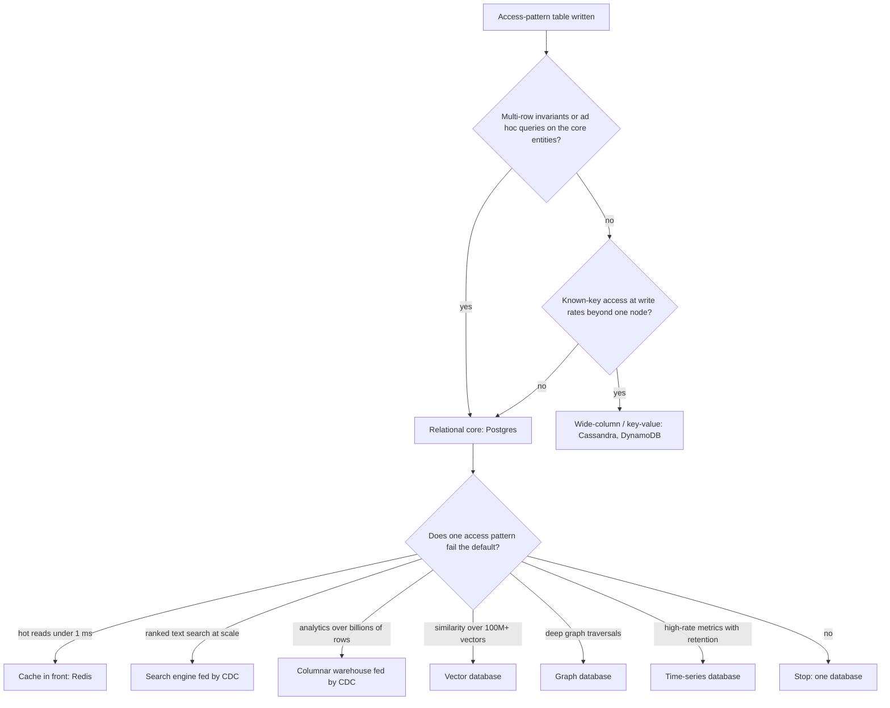

A startup chooses MongoDB because "the schema will change a lot" and Cassandra for its event history because "it needs to scale". Eighteen months later the product has a relational core (customers, orders, invoices, refunds) that the team keeps consistent with multi-document transactions and application-side joins. The event history takes 300 writes a second, which one Postgres table would have absorbed without noticing. The three-person platform team half-understands two clusters, each with its own backup procedure, upgrade path and 3 a.m. failure modes.

None of those choices was wrong in the abstract. Each was made from a product's reputation instead of the workload's requirements, and each was paid for in operating cost long before any benefit arrived. A senior engineer's contribution in this conversation is not knowing more databases. It is asking the four questions that turn "which database is best?" into "which requirement does the default fail, and by how much?", with numbers attached.

## Start from the default

For a new transactional system, the default is a mainstream relational database (Postgres in this track), and the burden of proof is on anything else. That is not nostalgia. It is a list of capabilities you get together, in one system, with decades of operational knowledge behind them: transactions across any rows, constraints, several isolation levels; ad hoc queries and joins planned by an optimiser with B-tree, GIN, BRIN and expression indexes; `jsonb`, full-text search, `pgvector` and partitioning for the specialised shapes; replication, point-in-time recovery, and a managed offering from every cloud.

What does one well-provisioned node handle? It depends on hardware, row width and query mix, so treat these as orders of magnitude to check with `pgbench` or a replay of *your* workload:

| Dimension | Comfortable on one primary | Where it takes real work | Why |
|---|---|---|---|
| Data size | Hundreds of GB to a few TB | Tens of TB | Vacuum, index builds and restores scale with size |
| Simple indexed writes | Thousands to low tens of thousands per second | Sustained high tens of thousands | One WAL stream, index maintenance, vacuum debt |
| Indexed point reads | Tens to hundreds of thousands per second, more with replicas | When replicas are not enough | CPU and buffer-cache hit rate |
| Connections | `max_connections` defaults to 100; a few hundred active | Thousands of clients without a pooler | A process per connection |

Two pieces of arithmetic show where "real work" starts. **Transaction ids**: each write transaction consumes a 32-bit id, and autovacuum must freeze old rows before `autovacuum_freeze_max_age` (200 million) ids have passed. At 1,000 write transactions a second that is every 56 hours; at 10,000, every 5.6 hours, and if vacuum cannot keep up the hard stop at about 2.1 billion arrives in 60 hours. **Restore time**: a restore moves every byte back, so 2 TB at 250–500 MB/s takes 1–2 hours and 20 TB takes 11–22 hours, before WAL replay. Your recovery-time objective caps your single-node size long before disk capacity does.

Most products never leave the left column. Many that do leave it for one table or one access pattern, and the right move is to take *that* workload elsewhere while the relational core stays put.

## What one Postgres did in this module

The earlier lessons measured the "Postgres alternative" to each specialised store on PostgreSQL 17 with a few million rows. Collected, they are a map of where the default stops being enough:

| Workload | Measured | Where it bends |
|---|---|---|
| Documents: `jsonb @>` with a `jsonb_path_ops` GIN index, 1 M rows | 1.4 ms (44 ms without an index), 18 MB index | Updating one key rewrites the whole value: 113 KB of WAL for a 104 KB document |
| Full-text: ranked top 20, 500 k articles | 1.7 ms for a term in 1,550 documents | 49 ms for a term in 250,000: every match is ranked |
| Graph: two-hop friend suggestions, 5 M edges | 1.1 ms | 24 ms with one 50,000-friend supernode; depth 4 took 643 ms |
| Time series: one hour of 4.3 M points, BRIN index | 1.1 ms with a 24 kB index | 52 bytes a point against about 1.4 in a TSDB; BRIN fails if rows leave time order |
| Compound index order (ESR), 2 M orders | 0.07 ms with the right order, 21 ms with the wrong one | Very selective ranges reverse the rule |

Every row is "fine until a number": a match count, a depth, a byte cost per point, a selectivity. That is the form a database decision should take.

## Question 1: what are the access patterns?

Write the access-pattern table before discussing products, exactly as in [modelling for access patterns](/learn/databases/data-modeling-and-evolution/modelling-for-access-patterns): every query the system will run, its shape, frequency, latency target and result size. Then map shapes to the data structures that serve them:

| Access shape | Structure that serves it | Stores built around it |
|---|---|---|
| Point lookup and range scan by key, plus ad hoc filters and joins | B-tree indexes and a query planner | Postgres, MySQL |
| Known-key access only, very high write rates, no joins | Hash partitioning plus a sorted clustering key over an LSM tree | Cassandra, DynamoDB, ScyllaDB |
| Sub-millisecond reads of a hot working set | In-memory hash tables and data structures | Redis, Memcached |
| Whole documents read and written as a unit | Document storage with secondary indexes | MongoDB, Postgres `jsonb` |
| Ranked text relevance | Inverted index | Elasticsearch, OpenSearch, Postgres FTS |
| "Most similar to this vector" | HNSW or IVF | pgvector, dedicated vector databases |
| Deep, variable-length traversals | Index-free adjacency | Neo4j and other graph stores |
| Aggregations over billions of rows | Columnar storage, vectorised execution | ClickHouse, BigQuery, Snowflake |
| High-rate time-ordered points with retention | Time-partitioned compressed columns | Prometheus, TimescaleDB, InfluxDB |

The table turns a vague requirement into a checkable one. "We need to scale" becomes "Q7 is a known-key write at 40,000 per second with no reads except by key", and that sentence chooses the store for you.

## Question 2: what consistency does each operation need?

Ask this per operation, not per system. Moving money or decrementing inventory needs atomic, isolated, multi-row transactions. A "likes" counter can be approximate and eventually consistent. Editing your own profile needs read-your-writes: *you* must see the change immediately, even if others see it a second later.

That list decides a lot. If core entities have invariants spanning several rows (an order, its line items and the stock they reserve), you need transactions over those rows: a relational store, or a design that keeps each invariant inside one partition or document (DynamoDB and MongoDB offer transactions, with limits on size and cost). If most operations tolerate staleness and the system must stay writable during partitions, a leaderless store with tunable consistency fits:

```viz
{"type": "system", "scenario": "quorum", "replicas": 3,
 "title": "Tunable consistency per operation",
 "caption": "With N = 3 replicas, writing to W = 2 and reading from R = 2 guarantees the read set overlaps the latest write. Leaderless stores let each query choose W and R, trading latency and availability against staleness, which is exactly the per-operation decision this question asks for."}
```

Two traps. "Eventually consistent" names no bound and no anomaly: ask which stale read a user will see, for how long, and what happens when they act on it. And asynchronous replication means a failover can lose the last acknowledged writes on *any* store, relational included; that is a durability question to answer explicitly (see [replication](/learn/databases/storage-and-scale/replication)).

## Question 3: what is the scale, and what shape does it have?

Put numbers on it with a back-of-envelope estimate, keeping the shape as well as the size:

- **Data size and growth.** Fifty million users with 2 KB profiles is 100 GB, which fits in the RAM of one large machine. Twenty thousand events a second at 500 bytes is 864 GB a day, over 300 TB a year before replication: a partitioning problem, not a tuning problem.
- **Read:write ratio and write shape.** Read-heavy workloads scale with replicas and caches. Write-heavy ones scale only by partitioning.
- **Hot keys.** A celebrity account, a flash-sale SKU or a global counter concentrates load on one key whatever the cluster size.
- **Working set versus memory.** A database whose hot data fits in the buffer pool behaves completely differently from one that reads disk for most requests.
- **Geography.** Writes accepted in several regions means either cross-region latency on every write or conflict resolution.

Write shape is where storage engines genuinely differ. A B-tree updates pages in place: reads are cheap and predictable, and each random write costs a page write plus WAL. An LSM tree turns every write into a sequential append and pays later in compaction and in reads that check several files:

```viz
{"type": "system", "scenario": "lsm-tree",
 "title": "The write-optimised alternative",
 "caption": "Writes land in a memtable and the log, then flush as immutable sorted files that background compaction merges. Sustained write throughput is far higher than a B-tree's, at the cost of read amplification, compaction I/O, and tombstones for deletes."}
```

If the dominant operation is a high-rate, known-key write, that picture is the argument for Cassandra or DynamoDB. If writes are modest and queries are varied, it is an argument against. The [B-tree versus LSM lesson](/learn/advanced-data-structures/log-structured-and-disk-structures/b-tree-vs-lsm) puts numbers on both.

## Question 4: what will it cost to operate?

This question is the one most often skipped, and it decides more outcomes than the other three. For each candidate:

- **People.** Who is on call for it, and have they run it through a failure? A rota needs several people per system who can restore it; a second stateful store adds its failure modes (compaction storms, split brain, JVM pauses, eviction storms) to everyone's pager.
- **Restore.** Can the team restore it from backup today, how long does it take at its size, and when was that last tested? A store nobody has restored is a store without backups.
- **Change.** What does a version upgrade look like, and a schema or index change at full size? Reindexing 500 GB into a new search index at 50 MB/s is about three hours before catch-up.
- **Data movement.** Every store that is not the source of truth needs a sync pipeline, and every pipeline is code with bugs and a lag users can see.
- **Price and terms.** Is there a managed offering you trust at your projected size? Several popular databases changed their licences in recent years (Redis, Elasticsearch, MongoDB), in ways that matter to some businesses.

A system that is 20% faster on a benchmark and needs a specialist you do not have is slower in every way that matters.

## A decision flow



Read the shape of the chart rather than its boxes. The relational core is decided first, by invariants and query flexibility. Everything else is a *derived* store added for one failing access pattern, fed from the source of truth, with a named reason.

## Worked decision 1: this app

Ascend stores users (each with an optional IANA time zone and the time the email address was verified), server-side sessions, known login devices and single-use email links (only a SHA-256 of each token), lesson progress, module preferences, quiz attempts, code submissions with the server's own verdict, comments, AI conversations and messages, interviews, one AI-usage row per user per day, one row per learner per active day in the learner's own time zone, from which streaks are computed, and rate-limit state. Run the questions:

- **Access patterns.** Per-user lookups by primary key; composite-key upserts for progress on `(user_id, lesson_slug)` and preferences on `(user_id, module_slug)`; "the newest 500 comments on target X", served by one composite index on `(target_kind, target_slug, created_at)` read backwards and then reversed in memory so threads read oldest first; per-user submission history. No analytics in the request path, no text search over user data, no traversals.
- **Consistency.** Progress and preference writes are single-statement upserts, so there is no read-modify-write race. The AI budget caps real spend, so a call first reserves its worst case: in one short transaction the service locks the day's `ai_usage` row (`SELECT … FOR UPDATE`), checks every limit including this call's output and estimated input, and records a hold, so a hundred concurrent requests cannot all read "99 of 100" and proceed, and no call can run past the day's output limit. At most one active interview per user is enforced by a partial unique index, because the service's abandon-then-insert could race. All three are invariants a transactional store gives almost for free.
- **Scale.** A few hundred lessons and tens of thousands of users is at most millions of progress rows: trivial for one node. The tables that grow with every attempt and message are bounded by an hourly retention round (`crates/core/src/services/retention.rs`, commit `531f48d`): submissions go after 180 days except each learner's latest attempt and latest pass per target, conversations 365 days after their last message, AI-usage rows after 90 days. The heaviest read paths never touch the database: the curriculum is embedded in the binary with `include_dir!`, parsed at boot and served from memory, together with an in-memory search index, so search needs no second store either.
- **Operating cost.** A small team and one managed Postgres on the hosting platform. Each replica's pool is `DATABASE_POOL_MAX` (15 in production), so up to two API replicas (one while the site is invite-only) plus a rolling deploy's overlap hold at most 60 of about 100 connections, leaving headroom for migrations and `psql`.

### The decision

One Postgres, nothing else. The architecture notes used to name the first change that would force a second store: every rate limit lived in process memory (`governor`), so a second replica would silently double each allowance, and the plan was to move them to Redis. When the trigger came, the store already running met it. The security-relevant limits (30 sign-up or login attempts per minute per IP, 10 password attempts per minute per account or per known device, 20 model calls and 20 graded submissions per minute per session, 3 reset emails an hour per address) are now GCRA state in Postgres. `SharedLimiter` in `crates/core/src/services/rate_limit.rs` keeps one theoretical arrival time per key in the `UNLOGGED` table `rate_limits` (migration `m0009_shared_rate_limits`) and checks and advances it with one conditional upsert, `INSERT … ON CONFLICT (key) DO UPDATE … WHERE` the time is within tolerance `RETURNING`, so two replicas cannot both take the last slot.

`UNLOGGED` skips the WAL, which keeps each check cheap; the [Postgres documentation](https://www.postgresql.org/docs/17/sql-createtable.html) states the price: the table is truncated after a crash and not replicated to standbys, which here only forgives some recent requests. The loose 1,200-per-minute general bucket stays in each replica's memory on purpose, and the shared limiter fails closed with a 503 when Postgres is unreachable. The test `replicas_share_the_security_limits` runs two app instances on one database and shows the second refusing once the first has spent the allowance. That is the pattern to copy: name the requirement that triggers the next store, and when it fires, check whether the store you already run can meet it.

## Worked decision 2: a ride-hailing location service

A million active drivers each report a position every four seconds: 250,000 writes a second. The dominant read is "available drivers near this point", and only the latest position matters. Trip history is needed for billing, disputes and analytics. Payments and trips have strict invariants.

- **Latest positions**: ephemeral, overwritten by key, geo-queried, extremely write-heavy. At about 100 bytes per driver in a Redis sorted set (Redis `GEOADD` stores a 52-bit geohash as the score) the whole fleet is about 100 MB, which fits one machine, but 250,000 writes a second is more than one Redis core. Partition by city: the largest city with 100,000 drivers is 25,000 writes a second per shard. Losing a few seconds of positions is acceptable because every driver reports again in four seconds.
- **Position history**: append-only, about 1.3 TB a day at 60 bytes per point. A log (Kafka) feeding columnar storage for analytics, or a wide-column table keyed by trip for replay.
- **Trips, fares, payments**: Postgres, with transactions.

Writing 250,000 short-lived positions a second into a B-tree with a WAL would pay durability costs for data whose value expires in four seconds. The per-operation consistency answer does most of the work.

## Worked decision 3: viewing history at a streaming service

Assume 250 million members generating five play events a day each: 1.25 billion events, about 14,500 a second on average and over 40,000 at peak, 250 GB a day at 200 bytes an event (750 GB with three replicas), about 90 TB of raw data a year. The dominant read is "continue watching" for one member, most recent first; the service runs in several regions and must stay writable in each; a few seconds of staleness is harmless.

That is a known-key (member), time-ordered, write-heavy, multi-region workload with relaxed consistency: a wide-column store partitioned by member and clustered by time, written at `LOCAL_QUORUM` in each region, which is what Netflix has described using Cassandra for. Partitions must stay bounded (older history rolled up or moved to cheaper storage), exactly as the [wide-column lesson](/learn/databases/nosql-and-specialised/wide-column-stores) sizes them. The member's account, billing and entitlements live elsewhere, in stores with stronger guarantees.

## The polyglot tax

Every additional store charges the same tax, and it is worth itemising in the design review:

1. A **sync path** from the source of truth: CDC or an outbox, with its own monitoring, lag and replay story.
2. A **consistency window** users can observe: the search result that does not yet show the item you created a second ago, the cache that shows yesterday's price.
3. A **backup, restore and disaster-recovery** procedure, tested, and consistent with the other stores' restores (restoring Postgres to 09:00 and the search index to 08:00 is itself an inconsistency).
4. An **on-call surface**: dashboards, alerts, runbooks, and people who understand the failure modes.
5. **Security and compliance** work: access control, encryption, and deletion requests that must reach every copy.

Add a store when a measured requirement fails the default and the tax is smaller than the gap. Adding one because the requirement might fail someday usually costs more than migrating would when the day comes, and the day often does not come.

| Capability | Postgres feature | Dedicated store | Switch when |
|---|---|---|---|
| Flexible documents | `jsonb` + GIN | MongoDB | Horizontal write scaling must be built in, or there is no relational core |
| Text search | `tsvector` + GIN, `pg_trgm` | Elasticsearch, OpenSearch | Common terms match hundreds of thousands of rows under load, or relevance is a product |
| Vectors | `pgvector` | Qdrant, Milvus, and others | Hundreds of millions of vectors, or selective filtered search at scale |
| Time series | Partitioning, BRIN, TimescaleDB | Prometheus, InfluxDB | Bytes per point dominate cost at hundreds of thousands of points a second |
| Graphs | Recursive CTEs | Neo4j | Deep, variable-depth traversals are latency-critical |
| Massive writes by key | Partitioned tables | Cassandra, DynamoDB | Sustained writes exceed one primary, or multi-region writes are required |

## Keeping the decision reversible

The database is the hardest component to change, because data has gravity and every query encodes its semantics. Decisions differ in how reversible they are: adding a derived store fed by CDC is a two-way door (drop it and nothing is lost), while moving the source of truth is a one-way door with a long, risky walk back. Spend review time in proportion.

You can make even a one-way door cheaper. Keep data access behind a narrow layer, as this app does: route handlers stay thin, queries live in `crates/core/src/services`, and only the AI budget in `crates/core/src/ai/budget.rs` and the retention round touch `ai_usage`, so the set of queries is enumerable. Do not contort the design for engine portability; using Postgres features fully is usually worth more than being able to leave. When you do move a workload, use the machinery of a schema change:

1. Create the new store and **backfill** it from a snapshot (500 GB at 50 MB/s is about three hours).
2. Start **CDC** from the snapshot's log position so the new store catches up and stays current.
3. **Shadow-read**: serve from the old store, also read the new one, and log mismatches until they are zero for a representative period.
4. **Cut over** reads behind a flag, a percentage at a time; then writes, if the new store becomes the source of truth.
5. Keep the old path and the reverse sync until the new one has survived a real incident, then remove it.

[Migrations and evolution](/learn/system-design/senior-design-skills/migrations-and-evolution) covers the playbook, and [change data capture](/learn/big-data/streaming/change-data-capture) the sync mechanics.

## Failure modes

| Symptom | Diagnosis | Fix |
|---|---|---|
| A search or cache shows data that was deleted weeks ago | The sync pipeline dropped or reordered events; nobody monitors lag or diffs | Lag and row-count alerts, periodic full reconciliation, idempotent versioned sinks |
| Data loss when a cache cluster restarts | The cache had quietly become the only copy of some keys | Name the source of truth for every key; write-through or outbox to the database |
| A restore test leaves orders in Postgres whose search entries are missing | Stores restored to different points in time | Rebuild derived stores from the restored source rather than restoring them |
| The second database is down and nobody on call can fix it | Operating cost was never budgeted; one expert left | Runbooks, restore drills, managed offering, or remove the store |
| Postgres stops accepting writes with a wraparound warning | Vacuum could not freeze fast enough at a high write rate | Tune autovacuum, remove long transactions, move the high-rate table out |
| A migration to a new store stalls for months with dual writes | No shadow comparison or cut-over criteria | Backfill plus CDC, shadow reads with a mismatch target, a flag and a date |

## What mid-level engineers get wrong

- **"Schema flexibility" as a reason for a document store**, when a `jsonb` column gives a flexible attribute bag inside a transactional database.
- **Benchmark-driven selection.** A vendor benchmark is a workload chosen to flatter the product; benchmark your top three queries at your data size.
- **Designing for 100× scale on day one**, paying the complexity now for load that may never arrive, instead of knowing the migration path.
- **A different engine per microservice by default.** Data ownership per service is a good rule; engine diversity per service is not a consequence of it.
- **A cache as the primary store.** If losing the cache loses data, it is a database with a cache's durability; see [caching layers](/learn/databases/data-modeling-and-evolution/caching-layers).
- **Eventual consistency without a named anomaly.** If nobody can say what a user sees during the window, nobody has decided whether it is acceptable.
- **Skipping the restore drill** for the new store because backups "are configured".

## Interviewer follow-ups

**"Why not MongoDB for a new orders service?"** Model answer: orders reserve inventory and must not double-charge, which are multi-entity invariants that relational transactions and constraints give by default; flexibility is available through `jsonb`; MongoDB would fit if there were no relational core and built-in sharding mattered. Common wrong answer: "MongoDB cannot do transactions", which has been false since 4.0.

**"When would you add Elasticsearch next to Postgres?"** Model answer: when a measured search requirement fails, such as common terms matching hundreds of thousands of rows at the target latency, or relevance tuning as a product need; feed it by CDC, keep Postgres the truth, and budget the sync, reindex and on-call tax. Common wrong answer: "whenever there is a search box".

**"The product manager says the feed can be eventually consistent. Are we done?"** Model answer: no; name the anomaly (a user not seeing their own post), its duration and its consequence, then decide per operation, usually read-your-writes for the author and staleness for everyone else. Common wrong answer: "yes, use Cassandra".

**"How do you move a hot table to DynamoDB without downtime?"** Model answer: backfill from a snapshot, CDC from the snapshot's position, shadow reads with mismatch tracking, flagged cut-over of reads and then writes, and keep a reverse path until an incident has been survived. Common wrong answer: "a maintenance window and a dump".

**"What would make you add a second datastore to a one-Postgres app?"** Model answer: a named trigger with a number, such as search matches outgrowing ranked queries; and when one fires, check the existing store first, as this app did when several replicas needed shared rate limits and an `UNLOGGED` Postgres table sufficed. Until then the tax outweighs the benefit. Common wrong answer: "when we grow".

## Senior signals

- You start from the relational default and ask what specific requirement it fails, with a number attached, and you know the single-node limits as orders of magnitude, including restore time and transaction-id arithmetic.
- You write the access-pattern table first and let access shapes, not product reputations, choose data structures.
- You decide consistency per operation and can name the anomaly each relaxed operation allows.
- You weigh operating cost (people, restore, change, data movement, price and licence) as a first-class requirement.
- You add derived stores for single failing access patterns, fed from the source of truth, and can itemise the polyglot tax for each.
- You distinguish two-way doors from one-way doors, and you migrate with backfill, CDC, shadow reads and a flagged cut-over.
- You can say what you would *not* add, and which trigger would change your mind.

## Check yourself

```quiz
- q: >-
    A team proposes MongoDB for a new orders service because requirements are still changing. Orders have line items, reserve inventory and must never be double-charged. What is the strongest counter-argument?
  options: ["Invariants need transactions and constraints; jsonb gives flexibility", "MongoDB cannot nest line items in an order, so reads need extra lookups", "Changing requirements suit a graph database better than a document store", "MongoDB is always slower than Postgres on writes, so charges would lag"]
  answer: 0
  explanation: >-
    Schema flexibility is available in Postgres through jsonb, while multi-entity invariants such as reservations and payments are what relational transactions and constraints are for. Nesting line items is something MongoDB does well, so that is not the objection, and MongoDB has multi-document transactions; they are the exception in its model rather than the default.
- q: >-
    Which requirement, stated with numbers, most directly argues for a wide-column store such as Cassandra?
  options: ["Known-key, time-ordered appends at 60,000 a second in three regions", "We need strictly consistent balance transfers at 3,000 a second", "Ad hoc reporting that filters on any of 40 attributes over 2B rows", "We have 200 GB of data, growing 5 GB a month, and most is rarely read"]
  answer: 0
  explanation: >-
    Known-key access, very high write rates and multi-region writes are the wide-column sweet spot. Ad hoc reporting points to a columnar warehouse, strong multi-row consistency to a relational store, and 200 GB fits comfortably on one relational node.
- q: >-
    A design adds Elasticsearch, Redis and ClickHouse beside Postgres from day one for an app with 5,000 users. What is the most important review comment?
  options: ["Every store adds sync, backup and on-call cost before any benefit", "Use OpenSearch instead of Elasticsearch, since its licence is safer", "Keep sessions only in Redis, since they are read on every request", "Make ClickHouse the primary store, since it answers queries fastest"]
  answer: 0
  explanation: >-
    The polyglot tax (a sync path, a visible consistency window, backups and restores, an on-call surface, compliance) is paid immediately and continuously, while the benefits arrive only when the default fails. Swapping one search engine for another leaves that tax untouched. At this size Postgres full-text search, a well-indexed schema and replicas very likely cover every pattern.
- q: >-
    A product manager says the feed can be eventually consistent. What should you ask before agreeing?
  options: ["Whether feed data exceeds 1 TB, as only small data stays consistent", "Whether the feed is stored as JSON, as document stores are eventual", "Which vendor they prefer, since the vendor fixes the consistency model", "What stale data users see, for how long, and what acting on it does"]
  answer: 3
  explanation: >-
    Eventual consistency without a bound and a named anomaly is not a requirement. The anomaly to name first is usually a user not seeing their own new post: read-your-writes for a user's own actions is usually required even when global staleness is fine, and it changes the design. Consistency is a property of how reads and writes are routed, not of the vendor or the storage format.
- q: >-
    This app's security rate limits had to hold across several replicas. Why did it keep them in an UNLOGGED Postgres table instead of adding Redis?
  options: ["Redis cannot make a check and an increment atomic across clients", "A Postgres check avoids the network round trip that Redis would add", "An UNLOGGED table survives a crash, which Redis without AOF cannot", "Every replica already shares Postgres, and UNLOGGED skips the WAL"]
  answer: 3
  explanation: >-
    Every replica already talks to the same Postgres, so shared state needed no new system, and one conditional upsert makes the check and the advance atomic. UNLOGGED skips the WAL to keep each check cheap; the price is that a crash truncates the table, which only forgives some recent requests. Redis could do the same atomically with INCR or a Lua script; it was simply not needed. Each check is still a database round trip, which is why the loose general bucket stays in memory.
- q: >-
    Which of these decisions is cheapest to reverse a year later?
  options: ["Adopting single-table DynamoDB design for every entity type", "Moving the orders source of truth from Postgres to DynamoDB", "Sharding the orders table by customer across 16 Postgres nodes", "Adding Elasticsearch as a CDC-fed index derived from Postgres"]
  answer: 3
  explanation: >-
    A derived store fed by CDC is a two-way door: the source of truth never changed, so dropping the index loses nothing and the application falls back to Postgres queries. Moving or reshaping the source of truth changes every query and every invariant, and walking it back needs a full migration with backfill, CDC and shadow reads.
```
