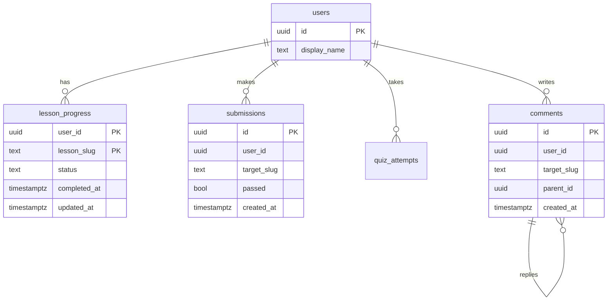

Your first schema for an e-learning product had `users`, `lessons`, `lesson_progress`, `submissions` and `quiz_attempts`. It was in third normal form, every foreign key was declared, and every reviewer approved it. Six months later the dashboard query that shows "42 of 180 lessons complete, 31 problems solved, 12-day streak" takes 900 ms at p99, the leaderboard takes four seconds, and the "most discussed lessons" widget has been replaced with a hard-coded list because the real query timed out.

Nothing was wrong with the normalisation. What was wrong was the order of operations: the team modelled the nouns of the domain and hoped the queries would be fine. Senior engineers model the other way round. They write down the queries first, with their frequency, latency budget and consistency requirement, and then derive a schema in which each hot query is one index scan. The normalised form is the starting point, not the answer.

## The access-pattern table

Before you draw a single table, write this table. It is the artefact a design reviewer at a top-tier company expects to see, and it is the artefact that prevents most of the rewrites.

| # | Query | Frequency | Latency budget | Freshness |
|---|---|---|---|---|
| Q1 | Dashboard summary for one user (counts, streak, XP) | 200/s | p99 < 50 ms | seconds stale is fine |
| Q2 | Mark a lesson complete | 20/s | p99 < 100 ms | must be durable |
| Q3 | Progress list for one user (which lessons, which status) | 200/s | p99 < 50 ms | read-your-writes |
| Q4 | Top 100 users by XP this week | 5/s | p99 < 200 ms | minutes stale is fine |
| Q5 | Ten most-commented lessons | 50/s | p99 < 50 ms | minutes stale is fine |
| Q6 | All comments on one lesson, oldest first | 100/s | p99 < 50 ms | read-your-writes |

Three columns do the work. **Frequency** tells you which queries must be cheap; a 5/s query can afford a hash join over a million rows, a 200/s query cannot. **Latency budget** tells you how many index probes you can afford; a 50 ms p99 on a busy primary is roughly five to ten index scans, not one sequential scan. **Freshness** is the column engineers forget, and it is the one that unlocks every denormalisation: if the leaderboard can be three minutes stale, you can precompute it.

Notice that this table is the same thing as the "requirements" step of a system design interview, applied at the level of one database. Interviewers at the senior bar will ask "what are the access patterns?" before they let you draw a schema, and a candidate who answers with a table like this has already passed the data-modelling part of the round.

## The normalised starting point

Here is the schema in the form a textbook produces. It is the right place to start because it has no update anomalies: every fact lives in one place.



Now run the access patterns against it. Q2, Q3 and Q6 are fine: each one is a primary-key or composite-index lookup on a small number of rows. The `lesson_progress` primary key `(user_id, lesson_slug)` serves Q3 directly, and an index on `comments (target_kind, target_slug, created_at)` serves Q6 as an index scan that also satisfies the `ORDER BY`. That is the same shape this app uses; the [ORM lesson](/learn/databases/data-modeling-and-evolution/orms-and-n-plus-one) walks through the query.

Q1, Q4 and Q5 are the ones that hurt.

## The three queries that hurt

**Q1, the dashboard.** The normalised version aggregates three tables per request:

```sql
SELECT
  (SELECT count(*) FROM lesson_progress
     WHERE user_id = $1 AND status = 'completed')            AS lessons_completed,
  (SELECT count(DISTINCT target_slug) FROM submissions
     WHERE user_id = $1 AND target_kind = 'problem' AND passed) AS problems_solved,
  (SELECT count(*) FROM quiz_attempts
     WHERE user_id = $1 AND score * 10 >= total * 7)          AS quizzes_passed;
```

With indexes on `user_id` this is three index scans and three small aggregates, perhaps 2 ms for a typical user. It is fine until you meet the user with 4,000 submissions, and it is definitely not fine for Q4, which needs it for every user.

**Q4, the leaderboard.** The naive query computes XP for everyone:

```sql
SELECT u.id, u.display_name,
       50  * count(DISTINCT lp.lesson_slug) FILTER (WHERE lp.status = 'completed')
     + 100 * count(DISTINCT s.target_slug)  FILTER (WHERE s.passed) AS xp
FROM users u
LEFT JOIN lesson_progress lp ON lp.user_id = u.id
LEFT JOIN submissions s      ON s.user_id  = u.id
GROUP BY u.id
ORDER BY xp DESC
LIMIT 100;
```

The plan shape tells the story. With a million users and twenty million submissions it looks like this:

```text
Limit  (cost=2841022.11..2841022.36 rows=100)
  ->  Sort  (cost=2841022.11..2843522.11 rows=1000000)
        Sort Key: (...) DESC
        ->  HashAggregate  (cost=2711022.11..2801022.11 rows=1000000)
              Group Key: u.id
              ->  Hash Right Join  (cost=...)
                    ->  Seq Scan on submissions s  (rows=20000000)
                    ->  Hash
                          ->  Hash Right Join
                                ->  Seq Scan on lesson_progress lp  (rows=8000000)
                                ->  Hash
                                      ->  Seq Scan on users u  (rows=1000000)
```

Two sequential scans over tens of millions of rows, a hash aggregate that has to hold a million groups, and a sort of a million rows to keep a hundred. There is no index that helps, because the query touches every row by definition. That is four seconds on a good day and a full buffer-pool eviction on a bad one. [Query plans](/learn/databases/relational-fundamentals/sql-and-query-plans) covers how to read the numbers; the point here is that no amount of tuning makes this fast, because the shape is wrong for the frequency.

**Q5, most-commented lessons.** Same problem in miniature: `SELECT target_slug, count(*) FROM comments GROUP BY 1 ORDER BY 2 DESC LIMIT 10` scans the whole comments table fifty times a second to produce a list that changes a few times an hour.

## Denormalisation is a set of tools, not a sin

Every fix below moves work from the read path to the write path. That is the principle: **the write path pays for the read path.** Writes are usually one to two orders of magnitude rarer than reads, and the write already holds a transaction, so doing a little extra work there is cheap. The cost is that the same fact now lives in two places, and you have to decide who keeps them consistent.

### Counter columns

The simplest tool. Add `comment_count` to a `lesson_stats` table and maintain it in the same transaction as the insert:

```sql
BEGIN;
INSERT INTO comments (id, user_id, target_kind, target_slug, body, created_at, updated_at)
VALUES ($1, $2, 'lesson', $3, $4, now(), now());
INSERT INTO lesson_stats (target_slug, comment_count)
VALUES ($3, 1)
ON CONFLICT (target_slug) DO UPDATE SET comment_count = lesson_stats.comment_count + 1;
COMMIT;
```

Q5 becomes `SELECT target_slug FROM lesson_stats ORDER BY comment_count DESC LIMIT 10`, which an index on `comment_count DESC` answers by reading ten index entries.

The trap is contention. A counter row is a hot row: every comment on a popular lesson updates the same tuple, and under [MVCC](/learn/databases/relational-fundamentals/mvcc-and-locking) each update writes a new version and takes a row lock that serialises concurrent writers. At a few hundred updates per second on one row you will see lock waits and bloat. The standard mitigations are to shard the counter into N rows and sum them on read, or to batch increments in the application and flush every second, accepting that the count is a second stale.

### Redundant columns kept in the same transaction

Store `author_name` on `comments` so the comment list needs no join to `users`. The rule that keeps this honest is that the redundant copy is written in the same transaction as the source, and there is a documented answer to "what happens when the source changes". For display names that change once a year, a nightly repair job that reconciles copies is acceptable. For prices on order lines it is not just acceptable, it is correct: an order line should record the price at the time of purchase, and the "redundancy" is actually a historical fact with its own meaning.

### Summary tables

For Q1 and Q4, the fix is a `user_stats` row per user that holds `lessons_completed`, `problems_solved`, `quizzes_passed`, `xp` and `streak_days`, updated on every event:

```sql
CREATE TABLE user_stats (
  user_id           uuid PRIMARY KEY REFERENCES users(id) ON DELETE CASCADE,
  lessons_completed int  NOT NULL DEFAULT 0,
  problems_solved   int  NOT NULL DEFAULT 0,
  quizzes_passed    int  NOT NULL DEFAULT 0,
  xp                int  GENERATED ALWAYS AS
                      (50 * lessons_completed + 100 * problems_solved + 30 * quizzes_passed) STORED,
  updated_at        timestamptz NOT NULL DEFAULT now()
);
CREATE INDEX idx_user_stats_xp ON user_stats (xp DESC);
```

The generated column means XP can never disagree with its inputs. Q1 becomes a primary-key lookup. Q4 becomes:

```text
Limit  (cost=0.42..8.71 rows=100)
  ->  Index Scan using idx_user_stats_xp on user_stats  (cost=0.42..82911.42 rows=1000000)
```

One index scan that stops after a hundred entries, well under a millisecond. The four-second query is gone, and it is gone because the work now happens twenty times a second on the write path instead of five times a second over twenty million rows.

The subtle part is idempotency. "Mark lesson complete" can be retried, and `lessons_completed` must not increment twice. The upsert on `lesson_progress` is naturally idempotent (the second attempt hits `ON CONFLICT` and updates a row that is already complete), so the increment must be conditional on the row actually transitioning:

```sql
WITH changed AS (
  INSERT INTO lesson_progress (user_id, lesson_slug, status, completed_at, created_at, updated_at)
  VALUES ($1, $2, 'completed', now(), now(), now())
  ON CONFLICT (user_id, lesson_slug) DO UPDATE
    SET status = EXCLUDED.status, completed_at = EXCLUDED.completed_at, updated_at = EXCLUDED.updated_at
    WHERE lesson_progress.status <> 'completed'
  RETURNING 1
)
UPDATE user_stats SET lessons_completed = lessons_completed + 1
WHERE user_id = $1 AND EXISTS (SELECT 1 FROM changed);
```

The `WHERE` clause on `DO UPDATE` makes the upsert a no-op when the lesson is already complete, so `RETURNING` produces no row and the counter does not move. Trace it: first call, no row exists, insert succeeds, `changed` has one row, counter goes 0 to 1. Retry, conflict, status already `completed`, `DO UPDATE ... WHERE` skips, `changed` is empty, counter stays at 1.

### Arrays and JSONB for read-mostly leaves

When a parent is always read with its children and the children are never queried on their own, fold them in. A lesson's tags, an order's shipping address snapshot, a user's notification preferences: a `jsonb` column or a `text[]` avoids a join and a second table. Postgres can index inside JSONB with a GIN index, so `WHERE tags @> '{"sql"}'` still uses an index. The moment you need to query the children independently, join across them, or update one child without rewriting the parent, they belong in their own table. This is the same embed-versus-reference decision that [document stores](/learn/databases/nosql-and-specialised/document-stores) force on you, and the answer is the same.

## Materialised views

A materialised view is a summary table the database builds for you from a query and stores on disk, with real indexes:

```sql
CREATE MATERIALIZED VIEW leaderboard_week AS
SELECT u.id AS user_id, u.display_name, sum(e.points) AS xp
FROM users u JOIN xp_events e ON e.user_id = u.id
WHERE e.created_at >= date_trunc('week', now())
GROUP BY u.id;
CREATE UNIQUE INDEX ON leaderboard_week (user_id);
CREATE INDEX ON leaderboard_week (xp DESC);
```

Reads are index scans on the view. The cost is freshness: the view is a snapshot as of the last refresh. `REFRESH MATERIALIZED VIEW leaderboard_week` takes an exclusive lock and blocks readers for the whole rebuild. `REFRESH MATERIALIZED VIEW CONCURRENTLY leaderboard_week` computes the new result into a temporary table, diffs it against the old one and applies the changes as ordinary updates, so readers keep reading throughout; it requires that unique index, which is why the example creates one. The concurrent refresh is slower than the plain one and still recomputes the whole query, so it suits a five-minute cron on a query that takes seconds, not a per-second refresh of one that takes minutes.

Materialised views fit the "minutes stale is fine" row of your access-pattern table. They do not fit read-your-writes: a user who just solved a problem and does not see their XP move on the leaderboard for five minutes will file a bug unless the product explicitly says "updated every few minutes".

## Who keeps the copies in sync

You now have a fact in two places. Three mechanisms keep them consistent, and the choice is a real design decision.

| Mechanism | Consistency | Failure mode | Where the logic lives |
|---|---|---|---|
| Same transaction in application code | Atomic with the source write | Every write path must remember to do it; a new code path that forgets silently drifts | Service layer, visible in code review |
| Database trigger | Atomic with the source write | Invisible to application developers; hard to test; adds latency to every write; triggers calling triggers | Schema, easy to forget it exists |
| CDC / outbox consumer | Eventual (tens of ms to seconds) | Consumer lag or crash leaves the copy stale; needs idempotent apply and a reconciliation job | Separate service, decoupled |

The first is the default for a single Postgres. It costs nothing extra, it is atomic, and the drift risk is managed by routing all writes through one service function (the way `ProgressService::set_lesson_status` is the only place in this app that writes `lesson_progress`).

Change-data-capture is the right answer once the copy lives somewhere the transaction cannot reach: a Redis leaderboard, an Elasticsearch index, an analytics warehouse, a cache. A CDC connector tails the write-ahead log and emits every committed row change as an event; a consumer applies it to the other store. Watch the mechanism, and note the delay between commit and the downstream copy, because that delay is your staleness window.

```viz
{"type": "system", "scenario": "cdc", "title": "Change data capture from the WAL to a read model", "caption": "Each committed change appears in the WAL, the connector emits it, and a consumer applies it to the summary store. The gap between commit and apply is the staleness a reader can observe."}
```

The [CDC lesson](/learn/big-data/streaming/change-data-capture) covers Debezium and the outbox pattern in depth. The design rule here is short: **one transaction for copies inside the database, CDC for copies outside it, triggers almost never.**

## Read models and CQRS-lite

Push the idea one step further and you have separate read models: tables (or stores) whose only job is to answer one query each, populated from the write model by CDC or by the same transaction. The dashboard has its `user_stats` row; the leaderboard has its sorted set in Redis; the "most discussed" widget has its `lesson_stats` row. Each read model is shaped exactly like its query, and the write model stays normalised because it is the source of truth that everything else is rebuilt from.

That last property is the one senior engineers insist on. A read model that can be dropped and rebuilt from the write model is safe to get wrong: you fix the bug, truncate, replay. A denormalised copy with no rebuild procedure is a liability, because the first inconsistency is permanent. Before you add any summary table, write the SQL that rebuilds it from scratch and check it into the repository next to the migration.

Full CQRS with separate services and event sourcing is a large architectural commitment and usually the wrong one for a product of this size; the [event-driven architecture](/learn/system-design/building-blocks/event-driven-architecture) lesson covers where it pays for itself. What you should take from it is the discipline, not the infrastructure.

## The same thinking in DynamoDB

DynamoDB makes access-pattern modelling mandatory rather than optional. There are no joins, a query touches one partition key, and you pay per read unit, so the only viable design is one where every access pattern from your table maps to a single `Query` on a partition key with an optional sort-key condition. The single-table pattern stores users, progress and comments in the same table with composite keys:

| PK | SK | attributes |
|---|---|---|
| `USER#42` | `PROFILE` | display_name, xp, lessons_completed |
| `USER#42` | `PROGRESS#databases/indexes` | status, completed_at |
| `LESSON#databases/indexes` | `COMMENT#2026-09-26T10:01:00Z#c1` | user_id, author_name, body |
| `LESSON#databases/indexes` | `STATS` | comment_count |

Q3 is `Query PK = USER#42, SK begins_with PROGRESS#`. Q6 is `Query PK = LESSON#..., SK begins_with COMMENT#`, and the sort key gives you oldest-first for free. Q1 is a `GetItem` on the profile row, which is exactly the `user_stats` summary table with a different name. Q4 needs a global secondary index keyed on a bucket with `xp` as the sort key, which is the `idx_user_stats_xp` index in different clothes. Every denormalisation you applied in Postgres to make the hot queries cheap is the *only* design available in DynamoDB. The [wide-column lesson](/learn/databases/nosql-and-specialised/wide-column-stores) goes through the partition-key mechanics; the modelling discipline is identical.

## Indexes are part of the model

An access-pattern table is incomplete until each row names the index that serves it. The B-tree is the mechanism that makes "one query, one index scan" possible, and the composite index must be ordered so that equality predicates come first and the sort column last; watch how a lookup descends from the root to the leaf and then walks siblings for the range.

```viz
{"type": "system", "scenario": "b-tree-index", "title": "The index that serves Q6", "caption": "An index on (target_kind, target_slug, created_at) descends to the first comment on the lesson and walks the leaf level in created_at order, so the query needs no sort."}
```

When you review a schema, ask for the table of queries with the index each one uses. A schema with fifteen tables and no such table is a schema nobody has thought about yet. The [indexes lesson](/learn/databases/relational-fundamentals/indexes) covers selectivity and covering indexes; the modelling rule is that every hot query gets an index designed for it, and every index gets a query that justifies its write cost.

## Senior signals

- You produce an access-pattern table (query, frequency, latency budget, freshness) before a schema, and you can point to the index that serves each hot query.
- You say "the write path pays for the read path" and can name the price: hot-row contention on counters, staleness on materialised views, drift on redundant columns.
- You keep the write model normalised as the source of truth and can show the SQL that rebuilds every read model from it.
- You choose the sync mechanism deliberately: same transaction inside Postgres, CDC for copies in other stores, triggers only with a documented reason.
- You make counter maintenance idempotent under retries and can trace why a conditional `DO UPDATE ... WHERE` prevents a double increment.
- You recognise a DynamoDB single-table design as the same denormalisation forced into the open, and you can move between the two without changing the reasoning.

## Check yourself

```quiz
- q: >-
    A leaderboard query aggregates 20 million rows and runs 5 times a second with a 200 ms budget. Adding an index on submissions(user_id) does not help. Why?
  options: ["The index is on the wrong column; it should be on passed", "The query touches every row by definition, so no index reduces the rows scanned; the shape must change to a precomputed summary", "Postgres never uses indexes in GROUP BY queries", "The index would help but only after VACUUM ANALYZE"]
  answer: 1
  explanation: >-
    An index reduces work when a predicate selects a small fraction of rows. A global aggregate over every user needs every row, so the fix is a summary table or materialised view that moves the work to the write path. VACUUM and column choice are irrelevant to a full-table aggregate.
- q: >-
    You add comment_count to lesson_stats and increment it in the same transaction as each comment insert. A single lesson receives 500 comments per second. What goes wrong first?
  options: ["The count overflows a 32-bit integer", "Every insert updates the same row, so writers serialise on its row lock and MVCC bloat grows", "The transaction becomes non-atomic", "The index on comment_count is rebuilt on each update"]
  answer: 1
  explanation: >-
    Under MVCC each update creates a new tuple version and takes a row lock; hundreds of concurrent updates on one row queue behind each other. Sharding the counter into N rows or batching increments fixes it. Overflow at 500/s takes months, and atomicity is unaffected.
- q: >-
    Which freshness requirement rules out a materialised view refreshed every five minutes?
  options: ["Minutes stale is fine", "The user must see their own write immediately after it commits", "The query runs only once a day", "The view has a unique index"]
  answer: 1
  explanation: >-
    A materialised view is a snapshot as of its last refresh; read-your-writes semantics cannot be met by anything refreshed on a timer. Low frequency and stale-tolerant queries are exactly what materialised views suit.
- q: >-
    REFRESH MATERIALIZED VIEW CONCURRENTLY fails with an error about a unique index. Why does the concurrent form need one?
  options: ["To make the refresh faster than the plain form", "Because it diffs the new result against the old rows and applies changes row by row, which requires identifying each row", "Because materialised views cannot exist without a primary key", "To prevent readers from seeing duplicates during the refresh"]
  answer: 1
  explanation: >-
    The concurrent refresh computes the new result into a temporary table and merges the differences into the existing view as updates, inserts and deletes, so it must match rows by a unique key. It is actually slower than the plain refresh; its benefit is that readers are not blocked.
- q: >-
    A retry of \"mark lesson complete\" must not double-increment lessons_completed. Which design guarantees this?
  options: ["Wrap both statements in a transaction", "Make the upsert a no-op when the status is already completed and increment only if the upsert returned a row", "Use a trigger instead of application code", "Increment the counter before the upsert"]
  answer: 1
  explanation: >-
    A transaction makes the two writes atomic but a retried transaction still runs both again. Conditioning the increment on the upsert actually changing state (DO UPDATE ... WHERE status <> 'completed' with RETURNING) makes the pair idempotent. A trigger has the same double-count problem unless it carries the same condition.
- q: >-
    Which copy of data should be kept in sync by CDC rather than by the same transaction?
  options: ["A comment_count column in the same Postgres database", "A Redis sorted set that serves the leaderboard", "A generated column computing xp from three counters", "A redundant author_name column on comments"]
  answer: 1
  explanation: >-
    A transaction can only make copies inside the same database atomic. Redis is outside it, so the update must be eventual, and CDC from the WAL (or an outbox) is the reliable way to deliver it. The other options all live in Postgres and belong in the same transaction or in a generated column.
```
