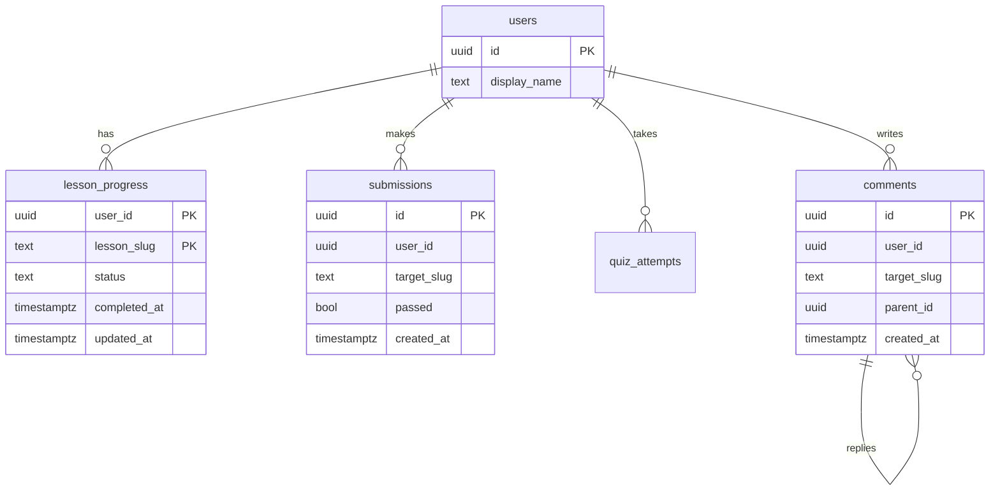

Your first schema for an e-learning product had `users`, `lessons`, `lesson_progress`, `submissions` and `quiz_attempts`. It was in third normal form, every foreign key was declared, and every reviewer approved it. Six months later the weekly leaderboard times out, and a well-meaning fix to it makes things worse.

On a lab copy of that schema in PostgreSQL 17 (100,000 users, 2.3 million progress rows, 3.7 million submissions, 1 million quiz attempts), the leaderboard query as first written took **34.5 seconds**. Rewritten carefully it took **749 ms**. Served from a summary table it took **0.4 ms**. The per-user dashboard, which everyone assumed was the slow one, took **0.26 ms** straight from the normalised tables and needed no change at all.

Nothing was wrong with the normalisation. What was wrong was the order of operations: the team modelled the nouns of the domain and hoped the queries would be fine. Senior engineers model the other way round. They write down the queries first, with frequency, latency target, cardinality and freshness, then derive the keys and indexes, and denormalise only the queries the table proves need it. This lesson does that for Postgres, measures the three denormalisation tools (summary tables, counters, materialised views), and then shows that a DynamoDB single-table design is the same method with no fallback.

## The access-pattern table

Before you draw a single table, write this one. It is the artefact a design reviewer expects to see, and it prevents most rewrites.

| # | Query | Frequency | p99 target | Cardinality (rows touched → returned) | Freshness |
|---|---|---|---|---|---|
| Q1 | Dashboard summary for one user (counts, streak, XP) | 200/s | 50 ms | about 70 → 1 | seconds stale is fine |
| Q2 | Mark a lesson complete | 20/s | 100 ms | 1 → 1 (write) | durable, read-your-writes |
| Q3 | Progress list for one user | 200/s | 50 ms | up to 180 → up to 180 | read-your-writes |
| Q4 | Top 100 users by XP | 5/s | 200 ms | 6 million → 100 | minutes stale is fine |
| Q5 | Ten most-commented lessons | 50/s | 50 ms | every comment → 10 | minutes stale is fine |
| Q6 | Comments on one lesson, in order | 100/s | 50 ms | up to 500 → up to 500 | read-your-writes |

Each column does a job:

- **Frequency** multiplies cost. The number that matters is frequency × cost per call, in CPU-seconds per second.
- **p99 target** bounds how many page reads a query can afford: on a warm buffer pool a page access costs microseconds, so a 50 ms budget is generous for an index scan and hopeless for a scan of millions of rows.
- **Cardinality** is the column people omit, and it is the one that predicts the design. When rows touched is close to rows returned, an index can bound the query. When a hot query touches millions of rows to return 100, no index can help, because the query reads everything by definition, and the work has to move to the write path.
- **Freshness** unlocks denormalisation. If the leaderboard can be three minutes stale, you can precompute it; if the progress list must show a write immediately, it must read the source of truth.

This is the "requirements" step of a system design interview applied to one database. Interviewers at the senior bar ask "what are the access patterns?" before they let you draw a schema.

## Deriving keys and indexes from the table

Take each row and name its access path, then check the cost. The lab numbers are `EXPLAIN (ANALYZE, BUFFERS)` on PostgreSQL 17 with the data in memory.

| Query | Access path | Index | Measured |
|---|---|---|---|
| Q1 | Three range scans on the user's rows | Primary key `(user_id, lesson_slug)`; `(user_id, …)` on `submissions`; `(user_id)` on `quiz_attempts` | 46 buffers, 0.26 ms; 0.30 ms for a user with 4,037 submissions |
| Q2 | Upsert on the primary key | `(user_id, lesson_slug)` | one probe plus the write |
| Q3 | Prefix scan of the primary key | `(user_id, lesson_slug)` | at most 180 entries |
| Q4 | Aggregate over every user | none can bound it | 749 ms at best |
| Q5 | Aggregate over every comment | none can bound it | grows with the table |
| Q6 | Two equalities, then the sort column | `(target_kind, target_slug, created_at)` | one backward index scan |

Now multiply by frequency. Q1 costs 200 × 0.26 ms = 0.05 CPU-seconds per second: nothing. Q4 at its best costs 5 × 0.749 s = 3.7 CPU-seconds per second, four cores busy all day for one widget, and its cost grows with every user who signs up. The table has told you which query to denormalise, and it is not the one people guessed.

This app makes the same call. `ProgressService::summary` computes the dashboard from the base tables on every request with five queries (lesson progress, module preferences, distinct solved problems, quiz attempts and recent activity days) and keeps no summary table, and Q6 is served by `idx_comments_target` on `(target_kind, target_slug, created_at)` from the `m0004_community` migration. The [indexes lesson](/learn/databases/relational-fundamentals/indexes) measures that index; the rule here is that every hot query names its index, and every index names the query that pays for its write cost.

```viz
{"type": "system", "scenario": "b-tree-index", "title": "The index that serves Q6", "caption": "An index on (target_kind, target_slug, created_at) descends to the first comment on the lesson and walks the leaf level in created_at order, so the query needs no sort and a LIMIT can stop early."}
```

## The normalised starting point

Here is the schema a textbook produces. Start here: every fact lives in one place, so there are no update anomalies, and it is the source of truth that every read model will be rebuilt from.



Q1, Q2, Q3 and Q6 are served by it as it stands. Q4 and Q5 are not, and the next section shows why no tuning rescues them.

## Q4, measured: the fan-out join and the full scan

The first version of the leaderboard joined both child tables to `users` and counted distinct values to undo the duplication:

```sql
SELECT u.id, u.display_name,
       50  * count(DISTINCT lp.lesson_slug) FILTER (WHERE lp.status = 'completed')
     + 100 * count(DISTINCT s.target_slug)  FILTER (WHERE s.passed) AS xp
FROM users u
LEFT JOIN lesson_progress lp ON lp.user_id = u.id
LEFT JOIN submissions s      ON s.user_id  = u.id
GROUP BY u.id
ORDER BY xp DESC
LIMIT 100;
```

The plan on the lab data, trimmed:

```text
Merge Left Join (actual time=0.116..9622.237 rows=85192000 loops=1)
  Merge Cond: (u.id = s.user_id)
  ->  Merge Left Join (actual rows=2300000)
        ->  Index Scan using users_pkey on users u (actual rows=100000)
        ->  Index Scan using lesson_progress_pkey on lesson_progress lp (actual rows=2300000)
  ->  Materialize (actual rows=85191978)
        ->  Index Only Scan using sub_user_idx on submissions s (actual rows=3704000)
Execution Time: 34454.990 ms
```

Trace one user. They have 23 progress rows and 37 submissions. The first join produces 23 rows; the second joins each of those to all 37 submissions, giving 23 × 37 = **851 rows** for one user, and 100,000 users produce 85 million rows that `count(DISTINCT)` then collapses. Two independent one-to-many joins from the same parent multiply; the `DISTINCT` hides the wrong answer and leaves the cost. The [ORM lesson](/learn/databases/data-modeling-and-evolution/orms-and-n-plus-one) meets the same cartesian product from the application side.

Aggregating each child table first, then joining one row per user, removes the multiplication:

```sql
SELECT u.id, u.display_name, 50 * coalesce(l.n, 0) + 100 * coalesce(s.n, 0) AS xp
FROM users u
LEFT JOIN (SELECT user_id, count(*) n FROM lesson_progress
           WHERE status = 'completed' GROUP BY 1) l ON l.user_id = u.id
LEFT JOIN (SELECT user_id, count(DISTINCT target_slug) n FROM submissions
           WHERE passed GROUP BY 1) s ON s.user_id = u.id
ORDER BY xp DESC LIMIT 100;
```

That measured **749 ms**: a sequential scan of `lesson_progress` (1.8 million matching rows, a hash aggregate that spilled to disk in 5 batches with the default 4 MB `work_mem`), an index-only scan of 1.85 million passed submissions, and a top-N heapsort to keep 100 of 100,000. It is now correct and roughly as fast as it will get, and it still reads 6 million rows to return 100. [Query plans](/learn/databases/relational-fundamentals/sql-and-query-plans) explains each node; the design point is that the shape is wrong for the frequency, and only moving the work fixes it.

## Summary tables: the write path pays

Every fix below moves work from reads to writes. Writes are usually one to two orders of magnitude rarer than reads (20/s against 200/s in the table), and the write already holds a transaction. The cost is that one fact now lives in two places and something must keep them consistent.

For Q4, keep one `user_stats` row per user:

```sql
CREATE TABLE user_stats (
  user_id           uuid PRIMARY KEY REFERENCES users(id) ON DELETE CASCADE,
  lessons_completed int  NOT NULL DEFAULT 0,
  problems_solved   int  NOT NULL DEFAULT 0,
  quizzes_passed    int  NOT NULL DEFAULT 0,
  xp                int  GENERATED ALWAYS AS
                      (50 * lessons_completed + 100 * problems_solved + 30 * quizzes_passed) STORED,
  updated_at        timestamptz NOT NULL DEFAULT now()
);
CREATE INDEX idx_user_stats_xp ON user_stats (xp DESC);
```

The generated column means `xp` can never disagree with its inputs. Q4 becomes:

```text
Limit (actual time=0.027..0.377 rows=100 loops=1)
  Buffers: shared hit=400 read=2
  ->  Nested Loop (actual rows=100 loops=1)
        ->  Index Scan using idx_user_stats_xp on user_stats us (actual rows=100 loops=1)
        ->  Index Scan using users_pkey on users u (actual rows=1 loops=100)
Execution Time: 0.401 ms
```

One hundred index entries and one hundred primary-key probes for the names: 402 buffers, 0.4 ms, and the same 0.4 ms at ten times the users. The table and its two indexes take 8.6 MB for 100,000 users. The rebuild query (the pre-aggregated join above, inserted into `user_stats`) took **1.9 s**; keep it in the repository next to the migration, because it is how you repair drift.

The part that breaks under retries is idempotency. "Mark lesson complete" can be retried by a client, and `lessons_completed` must not move twice. Make the increment conditional on the progress row actually changing state:

```sql
WITH changed AS (
  INSERT INTO lesson_progress (user_id, lesson_slug, status, completed_at, created_at, updated_at)
  VALUES ($1, $2, 'completed', now(), now(), now())
  ON CONFLICT (user_id, lesson_slug) DO UPDATE
    SET status = EXCLUDED.status, completed_at = EXCLUDED.completed_at, updated_at = EXCLUDED.updated_at
    WHERE lesson_progress.status <> 'completed'
  RETURNING 1
)
UPDATE user_stats SET lessons_completed = lessons_completed + 1
WHERE user_id = $1 AND EXISTS (SELECT 1 FROM changed);
```

Trace it:

1. First call, no progress row: the insert succeeds, `changed` holds one row, the counter goes from 0 to 1.
2. Retry: the insert conflicts; `DO UPDATE ... WHERE status <> 'completed'` is false, so no row is updated and `RETURNING` emits nothing; `changed` is empty; the counter stays at 1.
3. The user marks the lesson in progress and then complete again: the second completion does transition the row, so the counter goes to 2. If the product wants "completed at least once", the condition must test `completed_at IS NULL` instead. Write the rule down; the SQL follows from it.

## Counters and the hot row

The smallest summary is one counter. For Q5, keep `comment_count` in `lesson_stats` and bump it in the comment's transaction:

```sql
BEGIN;
INSERT INTO comments (id, user_id, target_kind, target_slug, body, created_at, updated_at)
VALUES ($1, $2, 'lesson', $3, $4, now(), now());
UPDATE lesson_stats SET comment_count = comment_count + 1 WHERE target_slug = $3;
COMMIT;
```

That is correct and has a ceiling. The lab ran it with `pgbench`: 16 clients, 10 seconds, two runs each:

| Workload | Transactions/s | Mean latency |
|---|---|---|
| Insert only, no counter | 3,884 | 4.1 ms |
| Counter spread over 10,000 lessons | 3,886–3,959 | 4.0–4.1 ms |
| Every comment on one lesson: one hot row | 321–406 | 39–50 ms |
| One hot row, a single client | 392 | 2.5 ms |
| One lesson, counter split over 16 rows | 2,212–2,291 | 7.0–7.2 ms |
| Hot row updated first, then 2 ms of other work before commit | 208 | 77 ms |
| 16-way split, same 2 ms of work | 1,515 | 10.6 ms |

### Under the hood: why one row caps at about 400 per second

An `UPDATE` stamps the row version with its transaction ID and holds that until the transaction ends. A second updater finds the version locked by a live transaction and sleeps on that transaction's ID: in `pg_locks` it appears as a `transactionid` lock with `granted = false`, and `pg_stat_activity` shows `wait_event = 'transactionid'`. When the first commits, the waiter re-reads the newest version (read committed re-evaluates its `WHERE` on it) and applies its increment. Updates to one row are therefore serial, and each holds the lock from its `UPDATE` until its `COMMIT` returns, which includes flushing WAL to disk: about 2.5 ms on this lab's virtual disk. One row's throughput is about 1 / 2.5 ms = 400 per second whether 1 or 16 clients try, and the extra clients only add queueing: by Little's law, 16 waiters at 400 per second each wait about 16 / 400 = 40 ms, the measured latency.

That gives three fixes:

- **Hold the lock for less time.** Put the hot update last in the transaction. Updating first and then doing 2 ms of other work dropped throughput to 208 per second (1 / 4.8 ms).
- **Shard the counter.** `lesson_stats_sharded (target_slug, shard, comment_count)` with 16 rows per lesson; each writer picks `shard = random(0, 15)`, and readers `SUM` the 16 rows. Throughput rose sixfold. Random picks still collide, so use more shards than concurrent writers.
- **Stop updating in place.** Append a delta row per event and fold deltas into the total every few seconds; the counter is then seconds stale and the write path has no hot row at all.

Watch the index. The counter updates above were 97% heap-only (HOT) updates, so bloat stayed small. Adding an index on `comment_count` so Q5 can read the top ten dropped HOT to **0%** in a rerun of the same benchmark: every increment now writes a new index entry too. Since Q5 tolerates minutes of staleness, a materialised view refreshed every minute is the cheaper design for it.

## Materialised views, measured

A materialised view is a summary table that the database builds from a query and stores on disk, with real indexes:

```sql
CREATE MATERIALIZED VIEW leaderboard AS
SELECT e.user_id, u.display_name, sum(e.points) AS xp, count(*) AS events
FROM xp_events e JOIN users u ON u.id = e.user_id
GROUP BY e.user_id, u.display_name;
CREATE UNIQUE INDEX leaderboard_user_uq ON leaderboard (user_id);
CREATE INDEX leaderboard_xp_idx ON leaderboard (xp DESC);
```

The lab built it over 2 million `xp_events` rows (100,000 users, so 100,000 view rows, 7 MB of heap) and timed each operation:

| Operation | Time | Lock taken on the view |
|---|---|---|
| The aggregate query itself, top 100 | 655 ms | none |
| `CREATE MATERIALIZED VIEW` | 502 ms | |
| `REFRESH MATERIALIZED VIEW`, no indexes | 456–466 ms | `ACCESS EXCLUSIVE` |
| `REFRESH MATERIALIZED VIEW`, two indexes | 492–519 ms | `ACCESS EXCLUSIVE` |
| `REFRESH ... CONCURRENTLY`, nothing changed | 909–933 ms | `EXCLUSIVE` |
| `REFRESH ... CONCURRENTLY`, 1%, 20% or 100% of rows changed | 1.08 s, 0.99 s, 1.29 s | `EXCLUSIVE` |
| Top 100 read from the view | 0.13 ms | `ACCESS SHARE` |

The lock is what decides between them. `ACCESS EXCLUSIVE` conflicts with the `ACCESS SHARE` lock of every `SELECT`, so readers wait for the whole plain refresh; `EXCLUSIVE` conflicts with writes and with itself but not with `ACCESS SHARE`. The lab held each refresh open in a second session with `dblink` and read the view with `lock_timeout = '500ms'`: during the plain refresh the read failed with `canceling statement due to lock timeout`; during the concurrent refresh it returned all 100,000 rows; a second concurrent refresh timed out, because two refreshes of one view serialise. Try the concurrent form without the unique index and Postgres refuses:

```text
ERROR:  cannot refresh materialized view "evo.leaderboard" concurrently
HINT:  Create a unique index with no WHERE clause on one or more columns of the materialized view.
```

## Under the hood: how the two refreshes work

A **plain refresh** runs the query into a brand-new heap file, builds the indexes on it, and swaps it in: the view's `relfilenode` changed from 43357 to 43367 in the lab, and the old file was dropped at commit. It is a rewrite, so it leaves no dead rows and needs no vacuum, and nobody can read the view while it runs.

A **concurrent refresh** cannot swap files under running readers, so it computes a difference. It runs the query into a temporary table, joins it against the current contents with a full outer join, matching rows on the unique index's columns and then comparing whole rows, and applies the result as ordinary DML: `DELETE` for rows that vanished or changed, `INSERT` for rows that are new or changed. In the lab, after 10,000 users gained an event, the refresh reported **10,000 deletes, 10,000 inserts and 10,000 dead tuples**, and `relfilenode` stayed at 43440. Four consequences:

1. The unique index is how rows are matched; without it the diff cannot tell an old row from a new one, hence the error above.
2. It always runs the full query and a join over every row, so it costs about twice a plain refresh even when nothing changed (909 ms against 456 ms). Postgres 17 core has no incremental maintenance; the third-party `pg_ivm` extension adds it for a subset of queries.
3. Changed rows become dead tuples, so a view refreshed every minute needs autovacuum to keep up, or it bloats like any update-heavy table (see [MVCC and locking](/learn/databases/relational-fundamentals/mvcc-and-locking)).
4. Readers see the old contents until the refresh commits, then the new ones all at once.

Materialised views fit the "minutes stale is fine" rows of the table: Q4 and Q5 here. They never fit read-your-writes. A user who solves a problem and does not see their XP move for five minutes files a bug unless the product says "updated every few minutes".

## Who keeps the copies in sync

Every denormalised copy needs a named mechanism. Three exist, and the choice is a design decision:

| Mechanism | Consistency | How it fails | Where the logic lives |
|---|---|---|---|
| Same transaction in application code | Atomic with the source write | A new code path that forgets the copy drifts silently | Service layer, visible in review |
| Database trigger | Atomic with the source write | Invisible to application developers; adds latency to every write; triggers calling triggers | Schema, easy to forget |
| CDC or outbox consumer | Eventual: commit-to-apply lag, tens of milliseconds to seconds | Consumer lag or crash leaves the copy stale; needs idempotent apply and reconciliation | A separate consumer |

The first is the default inside one Postgres. It costs nothing extra and it is atomic; drift is contained by routing every write through one function, the way `ProgressService::set_lesson_status` is the only application code that writes `lesson_progress` in this app.

Change-data-capture is the answer once the copy lives where the transaction cannot reach: a Redis sorted set for the leaderboard (the [Redis lesson](/learn/databases/nosql-and-specialised/key-value-stores-and-redis) covers the structure), a search index, a warehouse, a cache. A connector tails the write-ahead log and emits each committed change; a consumer applies it. The delay between commit and apply is your staleness window, so monitor it as a metric.

```viz
{"type": "system", "scenario": "cdc", "title": "Change data capture from the WAL to a read model", "caption": "Each committed change appears in the WAL, the connector emits it, and a consumer applies it to the summary store. The gap between commit and apply is the staleness a reader can observe."}
```

The [CDC lesson](/learn/big-data/streaming/change-data-capture) covers Debezium and the outbox pattern. The rule: **one transaction for copies inside the database, CDC for copies outside it, triggers only with a written reason.**

Push the idea one step further and you have read models: stores whose only job is to answer one query each, populated from a normalised write model. Senior engineers insist that every read model can be dropped and rebuilt from the write model; a copy with no rebuild procedure turns its first inconsistency into a permanent one. Full CQRS with event sourcing is a large commitment that the [event-driven architecture](/learn/system-design/building-blocks/event-driven-architecture) lesson weighs; the discipline is what transfers.

## DynamoDB single-table design: entities and keys

DynamoDB makes access-pattern modelling mandatory. There are no joins; a `Query` reads one partition key, optionally narrowed by a sort-key condition; and you pay per request unit. So you start from the same access-pattern table and design keys until every row maps to one `GetItem` or one `Query`. Items that share a partition key form an **item collection**, stored together and returned in sort-key order, so one `Query` can fetch a parent and its children.

The design for this domain puts every entity in one table, with generic key attributes `PK`, `SK` and, for the first global secondary index, `GSI1PK` and `GSI1SK`:

| Entity | PK | SK | GSI1PK | GSI1SK | Other attributes |
|---|---|---|---|---|---|
| User profile | `USER#42` | `PROFILE` | | | display_name, xp, lessons_completed |
| Progress | `USER#42` | `PROGRESS#databases/indexes` | | | status, completed_at |
| Lesson | `LESSON#databases/indexes` | `META` | `TRACK#databases` | `LESSON#01-03` | title, comment_count |
| Comment | `LESSON#databases/indexes` | `COMMENT#2026-09-26T10:01:00Z#c91` | `USER#42` | `COMMENT#2026-09-26T10:01:00Z` | author_name, body, parent_id |
| Study group | `GROUP#g7` | `META` | | | name |
| Membership | `GROUP#g7` | `MEMBER#USER#42` | `USER#42` | `GROUP#g7` | role, joined_at, display_name |

Four techniques are packed into that table:

- **Item collections.** `USER#42` holds the profile and every progress item. `PROFILE` sorts before `PROGRESS#…` (F before G), so `Query PK = USER#42` returns the dashboard's profile and all progress in one request: the join, done at write time by choosing keys.
- **GSI overloading.** `GSI1` has no fixed meaning. For comments it means "by author, by time"; for lessons "by track, in course order"; for memberships "by user". One index serves three access patterns because each entity type writes different values into the same two attributes.
- **Adjacency list for many-to-many.** A membership is an edge item stored under the group (members of a group) and projected by `GSI1` under the user (groups of a user). The textbook variant is an inverted index whose partition key is `SK`; it puts every item whose sort key is `PROFILE` or `META` into one giant index partition, which is why this design uses a dedicated attribute that only edges carry.
- **Sparse indexes.** A second index keyed on `mod_status` and `flagged_at` contains only comments that carry those attributes, which are set when a comment is flagged and removed when a moderator clears it. The moderation queue is a small index over a large table, and clearing an item removes it from the queue.

```viz
{"type": "system", "scenario": "sharding-hash", "title": "A partition key is hashed to a partition", "caption": "DynamoDB hashes each partition key to one partition, so an item collection lives on one partition and a hot key's traffic cannot spread beyond it. Different keys spread evenly; one popular key does not."}
```

## DynamoDB: access patterns as key conditions

| Access pattern | Operation | Key condition and options |
|---|---|---|
| Dashboard: profile and all progress | `Query` table | `PK = USER#42` |
| Progress list only | `Query` table | `PK = USER#42 AND begins_with(SK, "PROGRESS#")` |
| Mark lesson complete | `TransactWriteItems` | Put the progress item with condition `attribute_not_exists(PK) OR #status <> :completed`; update the profile with `ADD lessons_completed :one` |
| Comments on a lesson, oldest first | `Query` table | `PK = LESSON#x AND begins_with(SK, "COMMENT#")`, `ScanIndexForward = true`, `Limit = 50` |
| Lesson title and comment count | `GetItem` | `PK = LESSON#x, SK = META` |
| A user's comments, newest first | `Query` GSI1 | `GSI1PK = USER#42 AND begins_with(GSI1SK, "COMMENT#")`, `ScanIndexForward = false` |
| Lessons in a track | `Query` GSI1 | `GSI1PK = TRACK#databases` |
| Members of a group | `Query` table | `PK = GROUP#g7 AND begins_with(SK, "MEMBER#")` |
| Groups a user belongs to | `Query` GSI1 | `GSI1PK = USER#42 AND begins_with(GSI1SK, "GROUP#")` |
| Moderation queue | `Query` sparse GSI2 | `mod_status = "PENDING"`, sorted by `flagged_at` |
| Top 100 by XP this week | 10 × `Query` GSI3, then merge | `GSI3PK = LB#2026-W39#0` … `#9`, `ScanIndexForward = false`, `Limit = 100` |

The mark-complete transaction is the DynamoDB twin of the conditional upsert: if the progress item is already `completed`, the condition fails, the whole transaction is cancelled, and the counter does not move, so a retry is harmless. The leaderboard index is sharded ten ways because a single leaderboard key would put every XP update on one index partition.

Two constraints change the model's shape. Global secondary indexes are updated asynchronously and support only eventually consistent reads, so any read-your-writes pattern (Q2, Q3, Q6) must use the base table's keys. And an update that changes an index key (a new `xp` value is a new `GSI3SK`) costs two index writes, a delete and a put.

## DynamoDB: capacity arithmetic

DynamoDB's documented unit rules (the [wide-column stores lesson](/learn/databases/nosql-and-specialised/wide-column-stores) tabulates them) turn each access pattern into a capacity number. A read unit (RCU) is one strongly consistent read of up to 4 KB per second, or two eventually consistent ones; a write unit (WCU) is one write of up to 1 KB. A `Query` sums the sizes of the items it returns and then rounds up to 4 KB; `GetItem` and `BatchGetItem` round each item separately.

Work the comments page (50 comments of about 600 bytes, eventually consistent):

1. Total returned: 50 × 600 = 30,000 bytes.
2. Round up to 4 KB units: ⌈30,000 / 4,096⌉ = 8 RCU strongly consistent.
3. Eventually consistent halves it: **4 RCU** per page load. At 100 loads per second, 400 RCU.
4. The same 50 items fetched with `BatchGetItem` would round each to 4 KB: 50 units, 25 eventually consistent, more than six times the cost. Keeping children in the parent's item collection is also the cheap way to read them.
5. The dashboard collection (a 400-byte profile and 180 progress items of 150 bytes, 27,400 bytes) costs 7 RCU strongly consistent; a typical user with 23 progress items fits in one 4 KB unit.

## DynamoDB: the hard limits

A design that is affordable can still throttle. Check each hot pattern against three documented ceilings:

- **Per-partition throughput.** One partition serves at most **3,000 RCU and 1,000 WCU per second**, and one partition key's traffic lands on one partition. At 4 RCU per page, one lesson's comments top out at 3,000 / 4 = **750 page loads per second**; a viral lesson needs a cache in front (DAX or a CDN), smaller pages, or both. The same limit caps a single counter item at 1,000 one-KB writes per second, which is why the leaderboard index is sharded.
- **Item size.** An item, attribute names included, is at most **400 KB**. Embedding a lesson's comments in the lesson item would stop at about 680 comments of 600 bytes, and long before that each append would be ruinous: an update is charged on the larger of the item's before and after sizes, so appending to a 300 KB item costs 300 WCU, and the 1,000 WCU partition limit allows about three comments per second on that lesson.
- **Page size.** One `Query` returns at most 1 MB before you must paginate with `LastEvaluatedKey`.

Every denormalisation this lesson applied to Postgres (the summary row, the counter, the precomputed leaderboard) is the only design DynamoDB offers. The reasoning is identical; DynamoDB removes the option of skipping it.

## Failure modes

| Symptom | Diagnosis | Fix |
|---|---|---|
| A report or leaderboard gets slower every month; CPU climbs while traffic is flat | `EXPLAIN` shows full scans and a hash aggregate over every row; frequency × cost grows with the table | Summary table or materialised view; keep the rebuild SQL |
| An aggregate is correct but takes tens of seconds; rows in the plan dwarf the table sizes | Two one-to-many joins from one parent multiply (85 million rows for 6 million inputs); `count(DISTINCT)` hides it | Aggregate each child table in a subquery, then join one row per parent |
| Inserts on one popular item take 40–50 ms while the database is idle; throughput stuck near 400/s | Hot row: waiters on a `transactionid` lock in `pg_locks`; lock held until commit, including the WAL flush | Update last in the transaction; shard the counter; append deltas and fold them |
| Dashboard counts disagree with the base tables after an incident | Non-idempotent increments ran twice on retries, or a code path skipped the copy | Condition increments on a state change; run the rebuild SQL; add a nightly reconciliation diff |
| The leaderboard endpoint times out for half a second every five minutes | Plain `REFRESH` holds `ACCESS EXCLUSIVE`; readers queue behind it | `REFRESH ... CONCURRENTLY` with a unique index |
| A materialised view refreshed every minute grows and slows | Concurrent refresh turns every changed row into a dead tuple | Tune autovacuum for the view; refresh less often; switch to a summary table maintained per write |
| DynamoDB throttles one lesson or one counter while the table is under its provisioned rate | One partition key over 3,000 RCU or 1,000 WCU per second | Write-shard the key; cache hot reads; shrink items and pages |

## Trade-offs

| Approach | Read cost | Write cost | Staleness | Consistency mechanism | Rebuild |
|---|---|---|---|---|---|
| Compute on read (normalised) | Grows with rows touched | None extra | None | None needed | Nothing to rebuild |
| Summary table in the same transaction | One index probe | One more row update per write; hot-row risk | None | Application transaction | Rebuild SQL, about 2 s here |
| Trigger-maintained summary | One index probe | Same, hidden in the schema | None | Trigger | Same, but easy to forget |
| Materialised view | One index probe | None per write; full query per refresh | Up to the refresh interval | Scheduled refresh | `REFRESH` is the rebuild |
| CDC-fed read model in another store | Whatever that store costs | None in the transaction; a consumer per change | Consumer lag | WAL-based CDC or outbox | Replay the log or re-snapshot |
| DynamoDB single-table | One `Query`, units by size | Every copy written explicitly | None for base-table keys; GSIs eventual | Transactions or streams | A backfill job |

## Interviewer follow-ups

**"The dashboard is slow. Would you add a summary table?"** Model answer: first measure it against the access-pattern table. A per-user aggregate over a few dozen rows through `(user_id, …)` indexes cost 0.26 ms here, so the fix is the index, and a summary table would add a consistency mechanism for no gain; denormalise the queries whose cardinality makes them read far more than they return, like a global leaderboard. Common wrong answer: "yes, precompute everything the UI shows", which buys drift and write contention for queries that were already cheap.

**"Your comment counter is a hot row. Why does adding database connections not help?"** Model answer: updates to one row are serialised by the row lock, held until commit including the WAL flush, so throughput is about one over the hold time (400/s at 2.5 ms here) and more clients only add queueing latency. Shorten the hold, shard the counter or append deltas. Common wrong answer: "the database is out of CPU; scale it up", when the measured database was idle.

**"When would you choose a materialised view over a summary table maintained per write?"** Model answer: when the result tolerates minutes of staleness, the query is expensive but writes are frequent, and a per-write update would create a hot row or cost HOT updates; refresh `CONCURRENTLY` with a unique index so readers are not blocked, and budget for roughly twice the query cost per refresh plus vacuum. Choose the summary table when readers need fresh values. Common wrong answer: "materialised views update themselves when the base tables change", which Postgres core does not do.

**"Walk me through a DynamoDB design for users, lessons, progress and comments."** Model answer: list the access patterns first, choose partition keys so each pattern reads one item collection, overload a GSI for the secondary patterns, use an adjacency list with a projected edge for many-to-many, check each pattern's unit cost and the 3,000 RCU / 1,000 WCU per-partition and 400 KB item limits, and keep read-your-writes patterns off GSIs. Common wrong answer: "one table per entity, like Postgres", which turns every page into several requests and client-side joins.

## What mid-level engineers get wrong

- **Designing from the nouns.** The schema is normalised and nobody knows which query it is for; the slow query is discovered in production.
- **Denormalising by guess.** Precomputing the dashboard, which was cheap, and missing the leaderboard, which was not.
- **Joining two one-to-many relations and reaching for `DISTINCT`.** The answer is right and the row count is multiplied, 851-fold per user here.
- **Treating a counter row as free.** One row serialises every writer at about one commit time each.
- **Indexing the counter column.** It turns every increment from a HOT update into an index write.
- **Scheduling a plain `REFRESH`** on a view that users read, then chasing periodic timeouts.
- **Adding a copy without a rebuild query.** The first drift becomes permanent.
- **Porting a relational schema to DynamoDB table by table**, and discovering joins in application code and GSIs that cannot give read-your-writes.

## Exercise: DynamoDB capacity units

Capacity arithmetic decides whether a single-table design is affordable and whether a hot key throttles. Implement the unit rules used in the worked example.

```exercise
id: dynamodb-capacity-units
title: Compute DynamoDB read and write units
prompt: |
  Implement `capacity_units(op, sizes, strong)` returning the capacity units
  one request consumes. `sizes` lists the byte sizes of the items involved.
  Use 1 KB = 1,024 bytes.

  - `"get"`: GetItem or BatchGetItem. Each item is rounded up to a whole
    number of 4 KB units separately; a missing item (size 0) still costs one
    unit. Sum over items.
  - `"query"`: sum all sizes first, then round up to whole 4 KB units, with
    a minimum of one unit even when nothing is returned.
  - `"transact_get"`: like `"get"`, but each unit costs 2 and `strong` is
    ignored.
  - `"write"`: each item costs its size rounded up to whole 1 KB units, at
    least one; sum over items. `strong` is ignored.
  - `"transact_write"`: twice `"write"`.

  For `"get"` and `"query"`, an eventually consistent read (`strong` false)
  costs half. Return a number (for example `4` or `0.5`).
languages: [python, javascript]
entry: capacity_units
starter:
  python: |
    def capacity_units(op, sizes, strong):
        # op: "get" | "query" | "transact_get" | "write" | "transact_write"
        return 0
  javascript: |
    function capacity_units(op, sizes, strong) {
      // op: "get" | "query" | "transact_get" | "write" | "transact_write"
      return 0;
    }
tests:
  - args: ["query", [6000, 6000, 6000, 6000, 6000], false]
    expected: 4
    label: a query sums sizes, then rounds
  - args: ["get", [6000, 6000, 6000, 6000, 6000], false]
    expected: 5
    label: a batch get rounds each item
  - args: ["write", [2560], true]
    expected: 3
  - args: ["transact_write", [600, 100], true]
    expected: 4
  - args: ["get", [0], false]
    expected: 0.5
    label: a missing item still costs
  - args: ["query", [], true]
    expected: 1
    hidden: true
    label: empty query result
  - args: ["query", [4096, 4096], true]
    expected: 2
    hidden: true
    label: exact 4 KB boundary
  - args: ["transact_get", [4097], false]
    expected: 4
    hidden: true
    label: transactional reads ignore consistency
hints:
  - "Write one helper that rounds a byte count up to units of a given size with a minimum of one: `max(1, ceil(n / unit))`."
  - "For a query, round the sum once; for a get, round each item and then add."
```

## Senior signals

- You write the access-pattern table (query, frequency, p99 target, cardinality, freshness) before a schema, and derive a key or index for each row.
- You compute frequency × cost per query and denormalise the queries whose rows touched dwarf rows returned, not the ones that feel slow.
- You name the consistency mechanism for every copy (same transaction, trigger, refresh, CDC) and keep a rebuild query for it.
- You know a hot row's ceiling is one over the lock hold time, including the commit flush, and you shorten the hold, shard the counter or append deltas.
- You choose plain or concurrent `REFRESH` by its lock, know the concurrent form needs a unique index, costs about twice as much and leaves dead tuples.
- You can lay out a DynamoDB single-table design with item collections, an overloaded GSI, an adjacency list and a sparse index, map every access pattern to a key condition, and check it against the 3,000 RCU / 1,000 WCU partition and 400 KB item limits.

## Check yourself

```quiz
- q: >-
    A leaderboard query LEFT JOINs users to lesson_progress (23 rows per user) and to submissions (37 rows per user), then uses count(DISTINCT ...). It returns the right numbers but takes 34 seconds. What is the mechanism?
  options: ["The DISTINCT forces a sort of every row in the two child tables", "Each user yields 23 × 37 joined rows, and DISTINCT only hides it", "The LIMIT 100 is applied before the joins, so each join is repeated", "The planner picked merge joins where hash joins would be far faster"]
  answer: 1
  explanation: >-
    Two independent one-to-many joins from the same parent multiply: 851 rows per user and 85 million in total, which count(DISTINCT) collapses back to the right answer. Aggregating each child table in its own subquery and joining one row per user took 749 ms. The join algorithm was not the problem, and LIMIT applies after aggregation.
- q: >-
    Sixteen clients insert comments on one popular lesson and each transaction also increments that lesson's counter row. Throughput stays near 400 per second and latency is 40 ms, with the database mostly idle. What sets the ceiling?
  options: ["The counter's row lock is held until commit, WAL flush included", "The connection pool is too small for sixteen concurrent writers", "The primary key index on lesson_stats is locked by each update", "Autovacuum cannot keep up with the dead versions of the counter row"]
  answer: 0
  explanation: >-
    Each updater waits on the previous transaction's ID until it commits, and a commit includes flushing WAL (about 2.5 ms in the lab), so one row sustains about one over the hold time whatever the client count; extra clients only queue. Sharding the counter over 16 rows raised throughput sixfold. The updates were 97% HOT, so vacuum and index locks were not the issue.
- q: >-
    Users read a materialised view continuously, and a plain REFRESH every five minutes causes half-second timeouts. What does switching to REFRESH ... CONCURRENTLY change?
  options: ["It needs no extra index, because the view is diffed on every column", "It refreshes only the rows whose base data changed since the last run", "It swaps in a new file atomically, so no dead tuples are produced", "It takes an EXCLUSIVE lock readers pass, but takes twice as long"]
  answer: 3
  explanation: >-
    The concurrent form takes EXCLUSIVE instead of ACCESS EXCLUSIVE, so SELECTs proceed, but it reruns the whole query and diffs it against the view using a required unique index, applying deletes and inserts: 909 ms against 456 ms in the lab even with nothing changed, and dead tuples for every changed row. The plain refresh is the one that swaps files.
- q: >-
    A DynamoDB Query returns 50 comments of about 600 bytes each, eventually consistent. How many read units does it consume, and why?
  options: ["25, because each item is rounded up to 4 KB and then halved", "15, because 30,000 bytes is about 30 KB and each 2 KB is a unit", "50, because every item returned costs one full read unit", "4, because sizes are summed, rounded to 4 KB units, then halved"]
  answer: 3
  explanation: >-
    A Query sums the returned sizes (30,000 bytes), rounds up to 4 KB units (8) and halves for eventual consistency (4). Per-item rounding applies to GetItem and BatchGetItem, which is why fetching the same items by key costs 25 units. At 4 units per page, one partition's 3,000 RCU caps that lesson at about 750 page loads per second.
- q: >-
    A per-user dashboard aggregates about 70 rows through indexes that lead with user_id, measured at 0.26 ms, and runs 200 times a second. What should you do about it?
  options: ["Keep computing it on read, since frequency × cost is tiny", "Move the dashboard counts into a Redis hash kept in sync by CDC", "Add a summary row per user maintained in the same transaction", "Create a materialised view of all dashboards, refreshed each minute"]
  answer: 0
  explanation: >-
    200 × 0.26 ms is about 0.05 CPU-seconds per second, and the cost does not grow with the number of users, only with one user's history. Every alternative adds a copy and a consistency mechanism to save almost nothing. Denormalise queries whose rows touched dwarf rows returned, such as a global leaderboard at 749 ms per call.
- q: >-
    Which copy of data should be kept in sync by CDC rather than by the same database transaction?
  options: ["A comment_count column kept in the same Postgres database", "A generated column computing xp from three counter columns", "A redundant author_name column on the comments table", "A Redis sorted set that serves the leaderboard to readers"]
  answer: 3
  explanation: >-
    A transaction can only make copies inside the same database atomic. Redis is outside it, so the update must be eventual, and CDC from the WAL or an outbox is the reliable way to deliver it. The other copies live in Postgres and belong in the same transaction or in a generated column.
```
