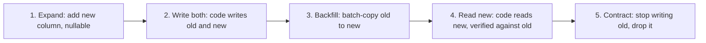

At 14:02 an engineer ran a migration that added a `NOT NULL` column with a default to the `orders` table. In the staging database, with ten thousand rows, it took 40 ms. In production, with 400 million rows, it held an `ACCESS EXCLUSIVE` lock on `orders` for eleven minutes while it rewrote every row. During those eleven minutes every `SELECT` on `orders` queued behind the lock, the connection pool filled with waiting queries, the API returned 503s, and the checkout page was down. The migration had been code-reviewed and had passed CI.

Schema changes are the most dangerous routine operation in a database-backed system, because the same statement is free at small scale and catastrophic at large scale, and because the failure is not "the migration errors" but "everything else stops". This lesson is about the lock that causes that, the specific DDL statements that hold it for a long time, and the pattern that turns any change into a sequence of steps each of which is safe.

## The lock queue trap

Every Postgres DDL statement on a table takes a lock on that table. Most `ALTER TABLE` forms take `ACCESS EXCLUSIVE`, the strongest level, which conflicts with every other lock including the `ACCESS SHARE` lock that a plain `SELECT` takes. That much is documented. The part that takes sites down is how the lock queue works.

Locks in Postgres are granted in order. If a transaction is holding `ACCESS SHARE` on `orders` (a long-running report, an open transaction someone forgot in a psql session, a slow query behind a replica), your `ALTER TABLE` waits for it. While the `ALTER` waits, every new `SELECT` on `orders` queues *behind the ALTER*, because granting the `ACCESS SHARE` to a newcomer while a stronger request is waiting would starve the writer. So a migration that is itself instantaneous can block all reads for as long as the transaction in front of it runs.


The two defences are a lock timeout and a retry loop. Set `lock_timeout` so the migration gives up instead of queueing everyone, then retry with backoff until it gets in:

```sql
SET lock_timeout = '2s';
ALTER TABLE orders ADD COLUMN fulfilment_status text;
-- on "canceling statement due to lock timeout": wait, retry, up to N times
```

Tools such as `pg_repack`, `strong_migrations` and most migration frameworks either do this for you or can be configured to. This app's migrations run through `sea-orm-migration` (see `migration/src/lib.rs`, which applies `m0001_identity` through `m0007_integrity` in order); the framework does not set a lock timeout by default, so on a large table you would wrap a raw `SET lock_timeout` statement around the DDL yourself.

Also check what is in front of you before you start: `SELECT pid, state, xact_start, query FROM pg_stat_activity WHERE xact_start < now() - interval '1 minute'` shows the transactions that will make your DDL wait.

## Fast DDL and slow DDL

The lock is only half the problem. The other half is how long the statement holds it. Postgres DDL falls into two groups: statements that only touch the catalog and finish in milliseconds regardless of table size, and statements that rewrite or scan the whole table.

| Statement | Cost | Why |
|---|---|---|
| `ADD COLUMN c text` (nullable, no default) | Catalog only | Existing rows are read as NULL for the missing column |
| `ADD COLUMN c int NOT NULL DEFAULT 0` | Catalog only since Postgres 11 | The constant default is stored in the catalog and applied on read; before 11 this rewrote the table |
| `ADD COLUMN c timestamptz DEFAULT now()` | Full rewrite | The default is volatile, so each row needs its own value written |
| `DROP COLUMN c` | Catalog only | The column is marked dropped; space is reclaimed by later rewrites and vacuum |
| `ALTER COLUMN c TYPE bigint` (from int) | Full rewrite plus index rebuild | Every value is converted and stored; all indexes on the column are rebuilt |
| `ALTER COLUMN c TYPE varchar(200)` (from varchar(100)) | Catalog only | Widening a varchar needs no data change |
| `ALTER COLUMN c SET NOT NULL` | Full scan under ACCESS EXCLUSIVE | Postgres must verify no NULL exists, unless a validated CHECK (c IS NOT NULL) already proves it (Postgres 12+) |
| `ADD CONSTRAINT ... FOREIGN KEY` | Full scan of the referencing table | Validates every existing row |
| `ADD CONSTRAINT ... NOT VALID` | Catalog only | New rows are checked; existing rows are not, until VALIDATE |
| `VALIDATE CONSTRAINT` | Full scan under SHARE UPDATE EXCLUSIVE | Reads and writes continue during the scan |
| `CREATE INDEX` | Full scan under SHARE | Blocks writes, not reads, for the whole build |
| `CREATE INDEX CONCURRENTLY` | Two full scans, weak lock | Reads and writes continue; roughly twice as slow |

The `int` to `bigint` case is the one that catches teams who let an `id` column approach 2.1 billion. The rewrite of a large table can take hours and holds the strongest lock throughout. The zero-downtime version is to add a new `bigint` column, backfill it in batches, swap the primary key in a short transaction, and drop the old column, which is the expand/contract pattern below applied to a type change.

### Constraints without the scan

The `NOT VALID` two-step is the tool for adding constraints to a populated table:

```sql
-- Instant: only new and updated rows are checked from now on.
ALTER TABLE orders ADD CONSTRAINT orders_total_positive CHECK (total_cents >= 0) NOT VALID;

-- Later, in its own transaction: scans the table, holds a lock that allows reads and writes.
ALTER TABLE orders VALIDATE CONSTRAINT orders_total_positive;
```

The same trick gets you `NOT NULL` without a blocking scan on Postgres 12 and later: add `CHECK (c IS NOT NULL) NOT VALID`, validate it, then `ALTER COLUMN c SET NOT NULL` sees the validated check and skips its own scan, and you can drop the check afterwards.

### Indexes without blocking writes

`CREATE INDEX CONCURRENTLY` builds the index in two passes without taking a lock that blocks writes. Two things to know. It cannot run inside a transaction block, so a migration framework that wraps each migration in a transaction (many do by default) has to be told to run this one outside. And if it fails partway (a lock timeout, a deadlock, a unique violation for a unique index), it leaves behind an index marked `INVALID` that is maintained on every write but never used by the planner. Check `pg_index.indisvalid` after any concurrent build, and `DROP INDEX CONCURRENTLY` the broken one before retrying.

## Expand and contract

Everything above makes a single statement safe. The harder problem is that most real schema changes are not one statement: they are "rename this column", "split this column into two", "move this data to another table", each of which requires the application and the schema to change together. You cannot deploy the application and the schema atomically, and with rolling deploys you cannot even guarantee that only one version of the application is running. So every change is made in phases where each phase is compatible with the versions of the code that are live at the time.

The pattern has a name, expand/contract (or parallel change), and a fixed shape:



Take a concrete case: `users.name` holds "Ada Lovelace" and you need `first_name` and `last_name`.

**Deploy 1, expand.** Migration adds two nullable columns. Catalog-only, milliseconds.

```sql
ALTER TABLE users ADD COLUMN first_name text, ADD COLUMN last_name text;
```

Code is unchanged. Old code keeps working because the columns are nullable.

**Deploy 2, write both.** Code writes `name`, `first_name` and `last_name` on every insert and update, and still reads `name`. At this point new rows are correct in both shapes; old rows have the new columns NULL. The reads have not changed, so nothing can break.

**Backfill.** A job copies the old shape to the new for existing rows, in batches, outside of any deploy. The shape matters:

```sql
-- Repeat until no rows updated. Track last_id in the job's state so a restart resumes.
UPDATE users
SET first_name = split_part(name, ' ', 1),
    last_name  = nullif(substr(name, length(split_part(name, ' ', 1)) + 2), '')
WHERE id IN (
  SELECT id FROM users
  WHERE id > $last_id AND first_name IS NULL
  ORDER BY id
  LIMIT 5000
)
RETURNING id;
-- sleep 50–200 ms between batches
```

Batches are keyed by primary key, not by `OFFSET`, so each batch is an index range scan rather than a scan that gets slower as it goes. Each batch is its own short transaction, so it never holds row locks for long and never produces a single enormous WAL burst that replicas struggle to apply. The sleep leaves headroom for production traffic and gives autovacuum a chance to keep up with the dead tuples the updates create. On a 400-million-row table at 5,000 rows per 100 ms, the backfill takes a little over two hours, which is fine because nothing is waiting on it.

Note the `first_name IS NULL` predicate: rows written by the new code path since deploy 2 are already correct and are skipped, and a re-run of the job is harmless.

**Deploy 3, read new.** Code reads `first_name` and `last_name`, still writes all three. Before shipping it, verify the backfill: `SELECT count(*) FROM users WHERE first_name IS NULL AND name IS NOT NULL` should be zero, and a sample comparison of the old and new shapes should agree.

**Deploy 4, contract.** Code stops writing `name`. Once no live version touches the column, a migration drops it. Catalog-only.

Four deploys and one background job instead of one `ALTER TABLE ... RENAME` that would have broken every running instance of the old code at the moment it ran. It is slower and it is boring, and boring is the point.

```viz
{"type": "system", "scenario": "blue-green", "title": "Two application versions live during a rollout", "caption": "During a rolling deploy both the old and the new code run against the same schema at once. Every migration phase must be compatible with both versions that can be live at the moment it is applied."}
```

## Dual writes and the ordering bug

Phase 2 above, "write both", has a trap when the two copies live in different stores, or when the copy is maintained by a separate code path. Consider a dual write of the `name` fields where the new columns are updated by a second `UPDATE` in the same request rather than in the same statement:

1. Request A sets `name = 'Ada L.'` and then, in a second statement, `first_name = 'Ada'`.
2. Request B, concurrently, sets `name = 'Ada Lovelace'` and then `first_name = 'Ada'`, `last_name = 'Lovelace'`.
3. Interleaving: A writes old, B writes old, B writes new, A writes new. Now `name` says "Ada Lovelace" and `last_name` says NULL. The copies disagree, and no single request did anything wrong.

Inside one database the fix is to write both shapes in the same statement or the same transaction with the row lock held, which makes the interleaving impossible. Across two databases there is no such fix; dual writes to two independent stores can always interleave, and the reliable pattern is to write one store and derive the other from its change stream. That is the argument for CDC over dual writes, and it applies exactly when the "migration" is moving data to a new system rather than a new column.

```viz
{"type": "system", "scenario": "cdc", "title": "Migrating to a new store by replaying the change log", "caption": "The old store stays the source of truth. A connector tails its WAL and replays every change into the new store, which catches up and then stays in sync without any dual-write race."}
```

## Feature flags for data

Two of the deploys above can be collapsed into flags. A `write_both` flag turns on the dual write without a deploy, and a `read_new_path` flag switches the read. The advantage is that the switch is instant and reversible: if the new read path returns wrong data for 0.1% of users, you flip the flag back in seconds rather than rolling back a deploy. The discipline is that flags are temporary; a codebase with thirty stale data-migration flags is worse than one with four extra deploys. Each flag gets an owner and a removal date when it is created.

A useful variant for high-risk changes is shadow reading: the code reads both shapes, serves the old one, and logs a metric when they disagree. Ship deploy 3 with the shadow read on, watch the disagreement counter sit at zero for a day, then switch.

## Migration tooling and the transaction question

Migration frameworks (Flyway, Alembic, Django migrations, SeaORM's migrator) do three useful things: they give each migration a stable identity, they record which ones have been applied in a table in the database, and they apply the pending ones in order. This app's `migration/src/lib.rs` declares the conventions worth copying: one migration per bounded context, append-only ("never edit a migration that has shipped; add a new one"), mutable tables get `created_at`/`updated_at` with database-side defaults while append-only tables (sessions, messages, quiz attempts, submissions) get only `created_at`, every foreign key declares an `ON DELETE` policy (rows a user owns privately cascade; shared comments survive with `SET NULL`), and each index is declared next to the columns it serves with a comment on the query pattern that needs it. The `idx_comments_target` index in `m0004_community.rs` carries exactly such a comment: "all comments on target X, oldest first". (The query has since changed to fetch the newest 500 and reverse them in memory; a B-tree on `(target_kind, target_slug, created_at)` serves that scanned backwards, so the index is still right even though its comment now describes the old query.)

`m0006` shows the append-only rule in practice. When the AI budget needed to record prompt-cache tokens, `m0006_ai_usage_cache_tokens.rs` added two `bigint NOT NULL DEFAULT 0` columns to `ai_usage` with `ALTER TABLE`, instead of editing `m0003_ai.rs`, which created that table and had already shipped. Editing `m0003` would have changed nothing on any database that had already applied it, so production and a fresh checkout would silently disagree about the schema. A constant default also keeps the change catalog-only on Postgres 11 and later, so it is safe on a large table.

`m0007_integrity` is a repair to data that already exists, which is what many later migrations turn out to be. It does three things. It creates an `activity_days` table and backfills it with one `INSERT ... SELECT ... ON CONFLICT DO NOTHING` from `quiz_attempts`, `submissions` and `lesson_progress`, because streaks had been computed from `lesson_progress.updated_at`, which every update overwrote, so earlier active days vanished. It marks all but the newest active interview per user as abandoned and only then creates the partial unique index `uq_interviews_one_active_per_user` on `interviews (user_id) WHERE status = 'active'`: clean the data first, or the index build fails on the duplicates. And it makes `comments.user_id` nullable and swaps its `ON DELETE CASCADE` foreign key for `ON DELETE SET NULL`, because deleting an account used to delete that user's comments and, through the `parent_id` cascade, other people's replies to them. SeaORM's migrator runs each migration in its own transaction on Postgres, so all of that commits or none of it does. At this app's size every statement takes milliseconds. On a table with a billion rows the same migration would need this lesson's techniques instead: the backfill would be a batched job, the index would be built `CONCURRENTLY` (which cannot run in that transaction, so the migration would opt out by returning `Some(false)` from `use_transaction()`), and the new foreign key would be added `NOT VALID` and validated separately.

What frameworks do not do is make a migration safe. A framework will happily run `ALTER COLUMN id TYPE bigint` on a billion rows. Three habits close the gap:

- **Separate schema migrations from data migrations.** Schema changes are small, fast, transactional. Backfills are long, batched, resumable, and run as jobs, never as migrations that hold a transaction open for two hours.
- **Know your framework's transaction behaviour.** Postgres supports transactional DDL, and many frameworks wrap each migration in a transaction so a failure rolls back cleanly. That is excellent for ordinary migrations and fatal for `CREATE INDEX CONCURRENTLY`, which refuses to run inside a transaction block. Every framework has a way to mark a migration non-transactional; use it only for that.
- **Lint the DDL.** Tools such as `squawk` and `strong_migrations` flag the dangerous forms (volatile defaults, type changes, non-concurrent index builds, missing lock timeouts) in review, before they reach a large table.

### MySQL, for contrast

MySQL's InnoDB has grown online DDL for many operations, but the general-purpose answer for years has been an external tool: `gh-ost` (GitHub) and `pt-online-schema-change` (Percona). Both create a shadow copy of the table with the new schema, copy rows across in batches, keep the copy in sync (gh-ost by tailing the binary log, pt-osc with triggers), and finally swap the tables with an atomic rename. It is expand/contract implemented by a tool for the whole table at once. Postgres rarely needs this because its catalog-only DDL covers most cases, but `pg_repack` uses the same shadow-and-swap approach to rewrite a bloated table without the long lock.

## Rollbacks and forward-only thinking

Every migration framework offers a `down` migration, and every senior engineer knows when it is a lie. This app's `down` for `m0004_community` drops the `comments` table, which is a correct inverse in a development database and a data-loss event in production. The `down` for `m0007_integrity` is subtler: before it can make `comments.user_id` `NOT NULL` again it has to delete every comment whose author has deleted their account. Down migrations are for local development. In production, you roll forward: if deploy 3 reads the new columns and they are wrong, you fix the data or ship deploy 3a that reads the old ones again. The expand/contract phases are designed so that rolling back the *code* to the previous deploy is always safe, because the schema at every phase is compatible with the previous code version. That is the rollback that matters.

The contract phase is the one place you lose the option. Once `name` is dropped, the old code cannot run. So the contract waits: a day, a week, until the metrics confirm nothing reads the old column, and it ships as its own deploy so that it can be delayed indefinitely without blocking anything else.

## Testing migrations before they matter

The staging database that ran the fatal migration in 40 ms had ten thousand rows. A migration that has not been run against production-sized data has not been tested. The practical approaches, from cheap to thorough:

- **Check the plan.** `EXPLAIN` does not work on DDL, but `pg_stat_user_tables.n_live_tup` tells you the row count, and the table above tells you whether the statement rewrites it. Multiply.
- **Restore a snapshot.** Most managed Postgres services can restore last night's backup to a throwaway instance in minutes. Run the migration there and time it. This also catches the `INVALID` index, the constraint violation on a row nobody knew existed, and the extension that is not installed.
- **Lock-time budget.** For each DDL statement, state the expected lock level and duration in the pull request. A reviewer who sees "ACCESS EXCLUSIVE, catalog-only, under 10 ms" and "SHARE UPDATE EXCLUSIVE, full scan, about 3 minutes, reads and writes continue" can approve with confidence; a reviewer who sees nothing has to guess.

The bar at a top-tier company is that the migration plan is written down before the code is: which statements, which lock each takes, how long, what runs concurrently, what the rollback of each phase is, and how the backfill resumes if it is interrupted. The [replication lesson](/learn/databases/storage-and-scale/replication) adds one more line to that plan, because a large backfill is also a burst of WAL that every replica has to apply, and replication lag during a backfill is a common way to break read-your-writes for users who were not involved at all.

## Senior signals

- You explain why an instantaneous `ALTER TABLE` can still block every read (the lock queue behind a long transaction) and you set `lock_timeout` with a retry loop on any DDL against a busy table.
- You classify DDL as catalog-only or full-rewrite before running it, and you know the version-dependent cases such as constant defaults since Postgres 11 and NOT NULL via a validated CHECK since 12.
- You use `NOT VALID` plus `VALIDATE` for constraints and `CREATE INDEX CONCURRENTLY` outside a transaction, and you check for `INVALID` indexes afterwards.
- You break any incompatible change into expand, write-both, backfill, read-new and contract, and you can say which code versions are live during each phase and why each phase is safe.
- You write backfills as batched, primary-key-ranged, resumable jobs with sleeps, and you keep them out of the migration framework's transaction.
- You treat down migrations as a development convenience and plan production rollbacks as forward fixes, with the contract phase deliberately delayed.

## Check yourself

```quiz
- q: >-
    A migration runs ALTER TABLE orders ADD COLUMN note text (nullable, no default). It should take milliseconds, yet the API returns 503s for four minutes while it runs. What is the most likely cause?
  options: ["The connection pool was too small to serve both the migration and the API traffic", "Postgres rewrote the whole table to add the column, holding its lock throughout", "Adding a text column writes an empty TOAST pointer into every existing row", "The ALTER queued behind a long transaction, and new reads queued behind the ALTER"]
  answer: 3
  explanation: >-
    Adding a nullable column is catalog-only, so the statement itself is fast. The damage comes from lock queueing: the ALTER waits for ACCESS EXCLUSIVE behind an existing lock holder, and Postgres grants locks in order, so new readers wait behind the ALTER. A lock_timeout with retry prevents this.
- q: >-
    Which of these ALTER TABLE statements rewrites every row of a large table on Postgres 15?
  options: ["ALTER COLUMN name TYPE varchar(500) from varchar(100)", "ADD COLUMN created timestamptz DEFAULT now()", "ADD COLUMN status text NOT NULL DEFAULT 'new'", "DROP COLUMN legacy_flag"]
  answer: 1
  explanation: >-
    A volatile default such as now() needs a distinct value per row, so the table is rewritten. A constant default is stored in the catalog since Postgres 11, DROP COLUMN only marks the column dropped, and widening a varchar needs no data change.
- q: >-
    CREATE INDEX CONCURRENTLY was interrupted by a lock timeout. What state is the database in?
  options: ["An INVALID index remains, maintained on writes but unused; drop it, then retry", "No index exists, because the failed build rolled back cleanly; simply retry", "The table stays locked against writes until the unfinished index is dropped", "The index is complete but stays invisible to the planner until the next ANALYZE"]
  answer: 0
  explanation: >-
    A failed concurrent build leaves an INVALID index behind. It costs write overhead and helps no query. Check pg_index.indisvalid and DROP INDEX CONCURRENTLY before retrying. The table is not locked.
- q: >-
    In expand/contract, why does the code start writing the new column (deploy 2) before it starts reading it (deploy 3)?
  options: ["Reads cost more than writes, so the cheaper change should always ship first", "Reading first would force the column's migration and its backfill into a single deploy", "Postgres requires a column to hold data before any index can be built on it", "So rows written after deploy 2 are already right and only older rows need a backfill"]
  answer: 3
  explanation: >-
    Writing both shapes first means the backfill only has to cover rows that predate deploy 2, and the read switch can be verified against a complete data set. Reading first would return NULLs for every row not yet backfilled.
- q: >-
    A backfill uses UPDATE ... WHERE id IN (SELECT id ... OFFSET $n LIMIT 5000) and gets slower with each batch. What is wrong?
  options: ["The backfill should be one UPDATE over the whole table instead of many batches", "OFFSET makes Postgres read and discard every skipped row; range on id > $last_id", "The LIMIT of 5000 is too small, so per-batch overhead grows with the table", "Autovacuum is switched off while a backfill runs, so dead rows pile up per batch"]
  answer: 1
  explanation: >-
    OFFSET pagination is O(n) per batch because the skipped rows are still read. Keyset pagination on the primary key turns each batch into an index range scan of constant cost. One giant UPDATE would hold locks and produce a huge WAL burst for hours.
- q: >-
    Two services each dual-write a user's name to Postgres and to Elasticsearch. Occasionally the two stores disagree even though every request wrote both. What is the sound fix?
  options: ["Take a distributed lock around both writes so no other request interleaves", "Write only to Postgres and build the search document from CDC or an outbox table", "Add retries with backoff to the Elasticsearch write so that it always lands", "Write Elasticsearch first and Postgres second, so the search index never lags"]
  answer: 1
  explanation: >-
    Dual writes to independent stores can interleave in any order, so no ordering of the two writes prevents the race, and retries only affect failures, not ordering. Making one store the source of truth and replaying its committed changes into the other removes the race. A distributed lock works in principle but adds a coordination service and latency to every write.
```
