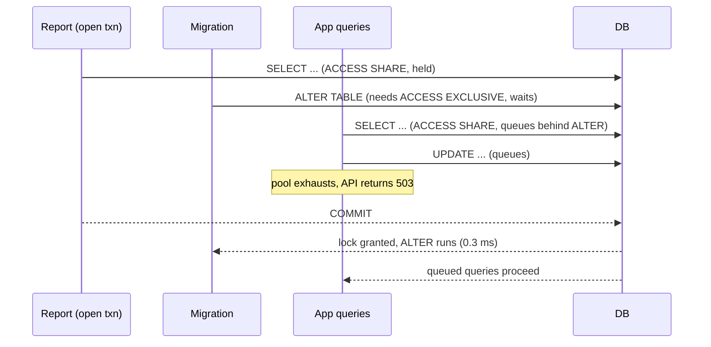

At 14:02 an engineer ran a migration that added `public_id uuid NOT NULL DEFAULT gen_random_uuid()` to the `orders` table. In staging, with ten thousand rows, it took 40 ms. In production, with 400 million rows, it held an `ACCESS EXCLUSIVE` lock on `orders` while it rewrote every row. Every `SELECT` on `orders` queued behind the lock, the connection pool filled with waiting queries, the API returned 503s, and checkout was down until the rewrite finished. The migration had been code-reviewed and had passed CI.

The same statement with a constant default (`DEFAULT 0`) would have taken under a millisecond, because Postgres 11 and later store a constant default in the catalog instead of in every row. `gen_random_uuid()` is volatile: each row needs its own value, so the table is rewritten. On a lab table of 2 million orders (156 MB) the rewrite took 2.7 s and wrote 293 MB of WAL; scaled linearly to 400 million rows that is about nine minutes, before counting wider rows, more indexes and a cold cache.

Schema changes are the most dangerous routine database operation: the same statement is free at small scale and an outage at large scale, and the failure is not "the migration errors" but "everything else stops". This lesson measures the lock and rewrite behind each common DDL, reproduces the lock queue, and builds the expand/contract sequence and batched backfill that make any change boring, on PostgreSQL 17 with a lab `orders` table of 2 million rows (213 MB with two indexes) in memory.

## The lock each DDL takes, measured

The method works on any table: in a transaction, run the DDL, read your own locks from `pg_locks`, and compare `pg_relation_filenode` before and after; a new filenode means a complete new copy of the table.

```sql
BEGIN;
SELECT pg_relation_filenode('orders');          -- note it
ALTER TABLE orders ADD COLUMN priority int NOT NULL DEFAULT 0;
SELECT c.relname, l.mode FROM pg_locks l JOIN pg_class c ON c.oid = l.relation
WHERE l.pid = pg_backend_pid() AND l.locktype = 'relation';
SELECT pg_relation_filenode('orders');          -- changed means rewritten
ROLLBACK;
```

| Statement | Lock on `orders` | Rewrite or scan | Time on 2M rows |
|---|---|---|---|
| `ADD COLUMN c text` (nullable) | `ACCESS EXCLUSIVE` | neither | 0.26 ms |
| `ADD COLUMN c int NOT NULL DEFAULT 0` | `ACCESS EXCLUSIVE` | neither (Postgres 11+) | 0.57 ms |
| `ADD COLUMN c timestamptz DEFAULT now()` | `ACCESS EXCLUSIVE` | neither: `now()` is stable, evaluated once | 0.39 ms |
| `ADD COLUMN c timestamptz DEFAULT clock_timestamp()` | `ACCESS EXCLUSIVE`, plus both indexes | rewrite | 1.50 s |
| `ADD COLUMN c uuid DEFAULT gen_random_uuid()` | `ACCESS EXCLUSIVE`, plus both indexes | rewrite | 2.73 s |
| `ALTER COLUMN id TYPE bigint` (from `int`) | `ACCESS EXCLUSIVE`, plus both indexes | rewrite of heap and every index | 1.28 s |
| `ALTER COLUMN status TYPE varchar(20)` (from `text`) | `ACCESS EXCLUSIVE` | rewrite | 1.32 s |
| `ALTER COLUMN status TYPE varchar(40)` (from `varchar(20)`) | `ACCESS EXCLUSIVE` | neither | 0.26 ms |
| `DROP COLUMN note` | `ACCESS EXCLUSIVE` | neither | 0.34 ms |
| `RENAME COLUMN note TO gift_note` | `ACCESS EXCLUSIVE` | neither | 0.18 ms |
| `ALTER COLUMN total_cents SET NOT NULL` | `ACCESS EXCLUSIVE` | full scan | 71 ms |
| `ADD CONSTRAINT ... CHECK (total_cents >= 0)` | `ACCESS EXCLUSIVE` | full scan | 48 ms |
| `ADD CONSTRAINT ... CHECK (...) NOT VALID` | `ACCESS EXCLUSIVE` | neither | 0.9 ms |
| `VALIDATE CONSTRAINT` (the check) | `SHARE UPDATE EXCLUSIVE` | full scan | 46 ms |
| `ADD FOREIGN KEY (customer_id) REFERENCES customers` | `SHARE ROW EXCLUSIVE` on both tables | full scan | 84 ms |
| `ADD FOREIGN KEY ... NOT VALID` | `SHARE ROW EXCLUSIVE` on both tables | neither | 1.0 ms |
| `VALIDATE CONSTRAINT` (the foreign key) | `SHARE UPDATE EXCLUSIVE`; `ROW SHARE` on `customers` | full scan | 80 ms |
| `CREATE INDEX` | `SHARE` | build | 0.78–0.87 s |
| `CREATE INDEX CONCURRENTLY` | `SHARE UPDATE EXCLUSIVE` | two passes plus waits | 0.90–0.92 s |

Two things stand out. Almost every `ALTER TABLE` takes `ACCESS EXCLUSIVE`, even the 0.2 ms ones, so the lock level alone never says a statement is safe; the dangerous rows are the rewrites and scans, whose time grows with the table under that lock. The `gen_random_uuid()` default wrote a new 203 MB heap and 293 MB of WAL; the constant default wrote 27 KB.

What each lock blocks is what matters to your users:

| Lock | Blocks `SELECT` | Blocks `INSERT`/`UPDATE`/`DELETE` | Also conflicts with |
|---|---|---|---|
| `ACCESS EXCLUSIVE` | yes | yes | everything |
| `SHARE ROW EXCLUSIVE` | no | yes | itself, `SHARE`, `SHARE UPDATE EXCLUSIVE` |
| `SHARE` | no | yes | `SHARE UPDATE EXCLUSIVE`; not itself |
| `SHARE UPDATE EXCLUSIVE` | no | no | itself (vacuum, analyze, other concurrent builds), `SHARE` |

## Under the hood: why some changes are catalog-only

A heap tuple's header records how many attributes it stores (`t_natts`). When Postgres reads attribute number *n* from a tuple that stores fewer, it does not fail; it returns a default. Before version 11 that default was always NULL, which is why adding a nullable column has always been free and adding a column with a default meant rewriting every row.

Since Postgres 11, a non-volatile default is evaluated once at `ALTER` time and stored in `pg_attribute` (the lab showed `atthasmissing = t`, `attmissingval = {0}`). Old tuples keep their shorter layout and read the missing value; updated rows store it physically. `now()` is `STABLE`, so it counts as non-volatile: every existing row gets the moment of the `ALTER`, catalog-only and probably not what you meant. `clock_timestamp()`, `random()` and `gen_random_uuid()` are `VOLATILE` and force a rewrite.

`DROP COLUMN` is the same trick in reverse: the lab's column 6 became `........pg.dropped.6........` with `attisdropped = t`. The bytes stay in every old tuple until the table is rewritten, and the dropped column still counts toward the 1,600-column limit.

A rewrite (a volatile default, a type change that is not binary-compatible, `text` to `varchar(20)` because every value must be checked) builds new files for the heap and every index under `ACCESS EXCLUSIVE` and swaps them at commit. It needs disk for a second copy, and with `wal_level = replica` streams the whole copy through WAL to every replica. `SET NOT NULL` and a plain `CHECK` do not rewrite but scan every row under `ACCESS EXCLUSIVE`; the `NOT VALID` forms defer that scan to `VALIDATE`, which runs under `SHARE UPDATE EXCLUSIVE` and lets reads and writes continue.

## The lock queue trap, reproduced

Rewrites explain the opening incident, not why a 0.26 ms `ADD COLUMN` can also take a site down. The lock queue does.

Postgres grants table locks in arrival order. A new request is granted only if it conflicts neither with the locks already held nor with the requests already waiting ahead of it; the second rule stops a stream of readers from starving a writer forever. So if anything holds even `ACCESS SHARE` on `orders` (a report in an open transaction, a psql session left in `BEGIN`), your `ALTER TABLE` waits, and every new `SELECT` queues behind the `ALTER`.



The lab reproduced it with four `dblink` sessions: `a` ran `BEGIN` and a `SELECT` on `orders` and went idle; `b` sent the `ALTER TABLE ... ADD COLUMN`; then `c` sent a primary-key `SELECT` and `d` a one-row `UPDATE`. One second later:

```text
   who    |        mode         | granted |        state        | wait_event | blocked_by
 a report | AccessShareLock     | t       | idle in transaction | ClientRead |
 b ALTER  | AccessExclusiveLock | f       | active              | relation   | {a}
 c SELECT | AccessShareLock     | f       | active              | relation   | {b}
 d UPDATE | RowExclusiveLock    | f       | active              | relation   | {b}
```

`pg_blocking_pids` names the culprit precisely: the reader and the writer are blocked by the migration, not by the report, whose `ACCESS SHARE` they are compatible with. When `a` committed three seconds later, everything completed; a one-row lookup had taken three seconds. A real report holding its transaction for four minutes means four minutes of outage for a 0.3 ms statement.

Before any DDL on a busy table, look for what is in front of you:

```sql
SELECT pid, state, now() - xact_start AS open_for, left(query, 60)
FROM pg_stat_activity
WHERE xact_start < now() - interval '30 seconds' ORDER BY xact_start;
```

## lock_timeout and retry, measured

The defence is to make the migration give up quickly instead of queueing everyone, and to retry until it finds a gap:

```bash
for attempt in $(seq 1 40); do
  if psql -X -q -c "SET lock_timeout = '200ms'; ALTER TABLE orders ADD COLUMN fulfilment_status text"; then
    echo "applied on attempt $attempt"; break
  fi
  sleep 0.3   # canceling statement due to lock timeout: let the queue drain, try again
done
```

The lab ran four `pgbench` clients doing primary-key reads (about 36,000 per second) while a report held `ACCESS SHARE` for 4 s and the migration arrived half a second later. Per-second reader statistics from `pgbench --aggregate-interval=1`:

| Second | Plain `ALTER`: reads, max latency | `lock_timeout = 200ms` + retry: reads, max latency |
|---|---|---|
| 1 | 11,657, 1.8 ms | 27,920, 2.0 ms |
| 2 | 35,629, 1.5 ms | 28,255, 200 ms |
| 3 | 6,302, 0.3 ms | 27,873, 201 ms |
| 4 | **0** | 21,319, 200 ms |
| 5 | **0** | 26,093, 200 ms |
| 6 | 11,310, **3,504 ms** | 29,413, 200 ms |
| 7 | 36,145, 2.0 ms | 35,991, 0.4 ms |

Without a timeout, reads stopped completely for over two seconds and the unlucky ones waited 3.5 s. With it, the migration timed out six times, succeeded on the seventh attempt once the report committed, and no read waited more than 200 ms. Pick the timeout from your latency budget: every attempt can delay readers by up to its value.

Two more guards belong in the runbook: `statement_timeout`, so a supposedly catalog-only statement cannot silently rewrite for ten minutes, and `idle_in_transaction_session_timeout` on application roles.

## Constraints without the long lock

The `NOT VALID` two-step adds a constraint to a populated table without a scan under `ACCESS EXCLUSIVE`:

```sql
-- 0.9 ms: new and updated rows are checked from now on; existing rows are not.
ALTER TABLE orders ADD CONSTRAINT orders_total_positive CHECK (total_cents >= 0) NOT VALID;
-- 46 ms here, under SHARE UPDATE EXCLUSIVE: reads and writes continue during the scan.
ALTER TABLE orders VALIDATE CONSTRAINT orders_total_positive;
```

The same trick gives you `NOT NULL` without the blocking scan on Postgres 12 and later. Add `CHECK (total_cents IS NOT NULL) NOT VALID`, validate it, then `SET NOT NULL`. With `client_min_messages = debug1` Postgres says why the last step took 0.47 ms:

```text
DEBUG:  existing constraints on column "orders.total_cents" are sufficient to prove that it does not contain nulls
```

Then drop the now-redundant check. Foreign keys follow the same pattern with one extra detail: both the plain and the `NOT VALID` form take `SHARE ROW EXCLUSIVE` on the referenced table as well, which blocks writes to `customers` for the (short) duration of the catalog change, and `VALIDATE` takes only `ROW SHARE` there.

## Indexes: CREATE INDEX versus CONCURRENTLY

`CREATE INDEX` takes `SHARE`: reads continue, and every write waits for the whole build. `CREATE INDEX CONCURRENTLY` (CIC) takes `SHARE UPDATE EXCLUSIVE`, so writes continue; on the idle lab table it cost about 10% more (0.90 s against 0.82 s), and more under heavy writes. Three behaviours catch teams out.

**It cannot run in a transaction block.** `ERROR: CREATE INDEX CONCURRENTLY cannot run inside a transaction block`. A migration framework that wraps each migration in a transaction must be told not to for this one.

**It waits for old transactions it has nothing to do with.** The lab opened a `REPEATABLE READ` transaction in another session that had only read `customers`, then started CIC on `orders`. After 3 s, `pg_stat_progress_create_index` showed `phase = waiting for old snapshots` with the build 19,999 of 20,000 blocks done, and `pg_blocking_pids` pointed at the unrelated session. An `UPDATE` on `orders` during the wait took 5.7 ms, so writes were fine, but the index did not finish until that transaction committed.

**A failure leaves an INVALID index behind**, in one of two states:

| How it failed | `indisvalid` | `indisready` | Size | Effect |
|---|---|---|---|---|
| Unique build hit a duplicate (`Key (customer_id)=(17094) is duplicated`) | false | false | 0 bytes | Harmless debris |
| Cancelled while waiting for old snapshots (`lock_timeout = 2s`) | false | **true** | 65 MB | Maintained on every write, never used by the planner |

The second is the expensive one. With it present, 200,000 inserts took 504 ms instead of 356 ms and the index grew by 1.3 MB, while `EXPLAIN` for a query it was built for still chose a sequential scan. Check after every concurrent build, then remove the debris without blocking writes, or rebuild it in place with `REINDEX INDEX CONCURRENTLY` (Postgres 12+):

```sql
SELECT indexrelid::regclass, indisvalid, indisready FROM pg_index WHERE NOT indisvalid;
DROP INDEX CONCURRENTLY orders_status_placed_idx;   -- 8 ms here
```

## Under the hood: the phases of a concurrent build

CIC trades one long lock for several short commits and waits, visible as `phase` in `pg_stat_progress_create_index`:

1. Insert the index into the catalog as not ready and not valid, commit, and wait for every transaction that could write the table without knowing the index exists ("waiting for writers before build").
2. Build the index from a snapshot of the table, mark it `indisready` so that every new write maintains it, commit, and wait for writers again.
3. Validate: scan the index and the table again and insert the entries for rows written during the build ("index validation").
4. Wait until every transaction in the database whose snapshot predates the validation has finished ("waiting for old snapshots"), because such a transaction could still see rows the index does not describe; then mark it `indisvalid`.

The failure states follow: a duplicate found in step 2 fails before `indisready`; a cancel in step 4 leaves a ready index that writers maintain and the planner ignores. Step 4 is also why one long analytics transaction anywhere in the database can stretch a five-minute build to an hour.

## Expand and contract

Everything so far makes one statement safe. Real changes (renaming a column, splitting one, moving data) are several statements plus code, and you cannot deploy application and schema atomically: during a rolling deploy two code versions run at once. This app's API binary applies pending migrations when it boots, before it binds (`migrate::run` in `crates/api/src/migrate.rs`, under a Postgres advisory lock so replicas booting together do not race), so the new schema is in place while old instances still serve; every schema change must be compatible with the code already running.

The pattern is expand/contract (parallel change). Take `users.name` holding "Ada Lovelace", which must become `first_name` and `last_name`:

| Phase | Migration | Code writes | Code reads | Safe to roll the code back to |
|---|---|---|---|---|
| 1. Expand | `ADD COLUMN first_name text, ADD COLUMN last_name text` (catalog-only) | `name` | `name` | the previous release |
| 2. Write both | none | `name`, `first_name`, `last_name` in one statement | `name` | phase 1 code |
| 3. Backfill | batched job, not a migration | same | `name` | phase 1 code |
| 4. Read new | none | all three | `first_name`, `last_name` | phase 2 code |
| 5. Contract | `DROP COLUMN name` (catalog-only), days later | the new columns | the new columns | phase 4 code only |

Writing before reading means the backfill covers only rows older than phase 2. Each phase ships as its own deploy; the contract phase waits longest, because it is the one step that makes rollback impossible.

```viz
{"type": "system", "scenario": "blue-green", "title": "Two application versions live during a rollout", "caption": "During a rolling deploy both the old and the new code run against the same schema at once. Every migration phase must be compatible with both versions that can be live at the moment it is applied."}
```

## Backfills in batches, measured

The backfill copies old shape to new for existing rows. Its shape was measured on a 2-million-row `people` table (117 MB) with a stored procedure that commits after every batch:

```sql
CREATE PROCEDURE backfill_names(p_batch int) LANGUAGE plpgsql AS $$
DECLARE last_id bigint := 0; max_id bigint;
BEGIN
  LOOP
    SELECT max(id) INTO max_id
      FROM (SELECT id FROM people WHERE id > last_id ORDER BY id LIMIT p_batch) s;
    EXIT WHEN max_id IS NULL;
    UPDATE people
       SET first_name = split_part(name, ' ', 1),
           last_name  = nullif(substr(name, length(split_part(name, ' ', 1)) + 2), '')
     WHERE id > last_id AND id <= max_id AND first_name IS NULL;
    COMMIT;                  -- releases the batch's row locks; makes progress durable
    last_id := max_id;       -- persist this in a job table to resume after a crash
  END LOOP;
END $$;
```

Keyset batches (`id > last_id`) cost the same at the end as at the start; `OFFSET` does not: 10,000 ids at `OFFSET 1990000` walked 2 million index entries (67 ms) against 63 buffers (0.77 ms) for `WHERE id > 1990000`. The `first_name IS NULL` predicate skips rows the new code already wrote and makes a rerun harmless.

Two `pgbench` clients meanwhile ran 200 single-row application updates per second on random rows:

| Batch size | Batches | Time in batches | Per batch, p50 / max | WAL per batch | Longest app `UPDATE` |
|---|---|---|---|---|---|
| 1,000 | 2,000 | 10.7 s | 4.4 / 54 ms | 328 kB | 130 ms |
| 10,000 | 200 | 4.9 s | 24 / 81 ms | 3.2 MB | 83 ms |
| 100,000 | 20 | 4.0 s | 200 / 230 ms | 29 MB | 135 ms |
| one `UPDATE` of all rows | 1 | 4.4 s | | 690 MB | **4,187 ms** (mean 1,193 ms) |

Total WAL was 584–690 MB in every case, about 300 bytes per row (new heap tuple, index entry, full-page images), and the heap grew from 117 MB to about 258 MB as each row got a new version. Batch size does not change how much work there is; it changes how that work lands:

- **Row locks.** Every updated row stays locked until its batch commits: the single statement made application updates wait a mean of 1.2 s and up to 4.2 s; 10,000-row batches capped it near 80 ms.
- **WAL bursts.** Replicas replay each batch, and logical decoding (CDC) emits a transaction only at commit, spilling to disk beyond `logical_decoding_work_mem` (64 MB by default), so the single `UPDATE` reached CDC consumers as 2 million events after seconds of silence. Sleep between batches and pause when replica lag passes your threshold.
- **Vacuum and restarts.** Committed batches can be vacuumed while later ones run, and a crash loses one batch, not all.

1,000-row batches spend more time on overhead, 100,000-row batches hold locks for 200 ms at a time; a few thousand to ten thousand rows, sized to your latency budget, is the usual choice.

## Verify before you switch reads

The backfill ran; that does not make it right. The lab's names included one-word names and three-word names, and the split rule mishandles both in different ways:

| `name` | `first_name` | `last_name` |
|---|---|---|
| `Ada Lovelace` | `Ada` | `Lovelace` |
| `Prince` | `Prince` | NULL |
| `Mary Ann Evans` | `Mary` | `Ann Evans` |

Nothing errored. Before phase 4, count what the backfill missed (`WHERE first_name IS NULL AND name IS NOT NULL` must be zero) and compare the shapes: `WHERE first_name || coalesce(' ' || last_name, '') <> name` finds every row where the round trip loses information. Here it finds none, because the transform is reversible, but the `Mary Ann Evans` row shows that "reversible" and "correct" are different questions, and only the product can answer the second.

Shadow reads make the check continuous. Ship the read path behind a flag that reads both shapes, serves the old one, and increments a counter when they disagree; watch it at zero for a day, then switch.

## Dual writes and feature flags for data

Phase 2 has a trap when the two shapes are written by separate statements: if request B interleaves its two writes between request A's, the columns describe different names with no request at fault. Inside one database, write both shapes in one statement or one transaction holding the row lock. Across two stores no such lock exists and dual writes can always interleave; write one store and derive the other from its change stream.

```viz
{"type": "system", "scenario": "cdc", "sink": "new-store", "title": "Migrating to a new store by replaying the change log", "caption": "The old store stays the source of truth. A connector tails its WAL and replays every change into the new store, which catches up and then stays in sync without any dual-write race."}
```

Phases 2 and 4 are code switches, and flags make them instant and reversible: `write_both` and `read_new` flipped per percentage of users, rolled back in seconds when the disagreement counter moves. Data-migration flags are temporary; each gets an owner and a removal date.

```viz
{"type": "system", "scenario": "canary", "title": "Switching the read path for a small share of traffic first", "caption": "The read_new flag routes a few per cent of requests to the new columns while the rest keep the old path; if errors or disagreements rise, the flag goes back in seconds, with no deploy."}
```

## This app's migrations, read closely

Migration frameworks (Flyway, Alembic, Django migrations, SeaORM's migrator) give each migration a stable identity, record what was applied, and apply the rest in order. This app's `migration/src/lib.rs` states its conventions in its header: one migration per bounded context, append-only ("never edit a migration that has shipped; add a new one"), mutable tables with `created_at`/`updated_at` defaulted by the database while append-only tables (sessions, messages, quiz attempts, submissions) have only `created_at`, an explicit `ON DELETE` policy on every foreign key, and each index declared next to the columns it serves with a comment on its query pattern. `idx_comments_target` in `m0004_community.rs` carries "all comments on target X, oldest first"; the query has since changed to fetch the newest 500 and reverse them in memory, which the same `(target_kind, target_slug, created_at)` B-tree serves scanned backwards.

`m0006_ai_usage_cache_tokens.rs` shows the append-only rule: when cost reporting needed prompt-cache tokens, it added two `bigint NOT NULL DEFAULT 0` columns to `ai_usage` rather than editing `m0003_ai.rs`, which created the table and had shipped. Editing `m0003` would change nothing on databases that had applied it, so production and a fresh checkout would silently disagree. The constant default also keeps it catalog-only: the lab's equivalent `ADD COLUMN ... NOT NULL DEFAULT 0` wrote 27 KB of WAL. The later migrations, up to `m0013`, keep both rules: `m0008_budget_holds` adds two `bigint NOT NULL DEFAULT 0` hold columns to `ai_usage`, and `m0011_user_timezones` and `m0012_email_tokens` add nullable `users` columns, all catalog-only, while `m0009_shared_rate_limits` creates `rate_limits` as an `UNLOGGED` table in raw SQL, since rate-limit state lost in a crash only forgives a few requests.

`m0007_integrity` repairs existing data. It creates `activity_days` and backfills it with one `INSERT ... SELECT ... ON CONFLICT DO NOTHING` from `quiz_attempts`, `submissions` and `lesson_progress`, because streaks had been computed from `lesson_progress.updated_at`, which every update overwrote. It marks all but the newest active interview per user as abandoned and only then creates the partial unique index `uq_interviews_one_active_per_user` on `interviews (user_id) WHERE status = 'active'`: clean first, or the build fails on duplicates. And it makes `comments.user_id` nullable and replaces the cascading foreign key with `ON DELETE SET NULL`, so deleting an account no longer deletes other people's replies.

## What the framework does, and what it leaves to you

In sea-orm-migration 2.0.3, `use_transaction()` defaults to `None`: on Postgres each migration runs in its own transaction, and the row recording it in `seaql_migrations` is inserted in that same transaction: a failed migration leaves no record and reruns cleanly. The framework sets no lock or statement timeout. At this app's size every statement in `m0007` takes milliseconds, and so do the five plain `CREATE INDEX` statements in `m0013_retention_indexes`, though each takes a `SHARE` lock that blocks writes to its table until the migration commits. On a billion-row table `m0007` would put `SET LOCAL lock_timeout = '2s'` first, run the backfill as a batched job, build the index `CONCURRENTLY` in a migration whose `use_transaction()` returns `Some(false)`, and add the foreign key `NOT VALID` with a separate `VALIDATE`. Because the API runs migrations on boot, a lock timeout fails the boot, and whatever restarts the process becomes the retry loop.

Linters close the rest of the gap: `squawk` and `strong_migrations` flag volatile defaults, type changes, non-concurrent index builds and missing timeouts in review. MySQL teams use `gh-ost` or `pt-online-schema-change`, which build a shadow table, copy rows in batches, keep it in sync from the binlog or triggers, and swap with an atomic rename; `pg_repack` does the same for rewriting a bloated Postgres table without the long lock.

## Rollbacks and testing

Down migrations are for development. This app's `down` for `m0004_community` drops the `comments` table, a correct inverse locally and data loss in production; the `down` for `m0007_integrity` must delete every comment whose author deleted their account before it can make `user_id` `NOT NULL` again. In production you roll forward, and expand/contract is designed so that rolling the code back one phase is always safe; `migrate.rs` relies on it, booting an older build against a newer schema without migrating (`Plan::SchemaAhead`) and refusing only a diverged history. Only the contract phase removes that option, so it waits until metrics show nothing reads the old column.

A migration not run against production-sized data has not been tested: restore last night's snapshot to a scratch instance and time it there, which also finds the duplicate that fails the unique index. Then write the lock budget into the pull request: for each statement, the lock, rewrite or scan, expected duration, and what runs concurrently ("`ACCESS EXCLUSIVE`, catalog-only, under 10 ms, `lock_timeout` 2 s with retry"; "`SHARE UPDATE EXCLUSIVE`, full scan, about 3 minutes, reads and writes continue"). The [replication lesson](/learn/databases/storage-and-scale/replication) adds the last line: the backfill's WAL rate against replica apply, because replica lag during a backfill breaks read-your-writes for users who were never involved.

## Failure modes

| Symptom | Diagnosis | Fix |
|---|---|---|
| All queries on one table hang for minutes during a catalog-only migration | `pg_blocking_pids`: readers blocked by the `ALTER`, the `ALTER` by an idle-in-transaction session | `lock_timeout` plus retry; `idle_in_transaction_session_timeout` |
| A "simple" column add holds `ACCESS EXCLUSIVE` for minutes; disk and WAL spike | Volatile default or incompatible type change rewrote the table (new relfilenode) | Add it nullable, backfill in batches, then set the default |
| Writes slow down after a failed deploy and an index sits unused | `indisvalid = false, indisready = true`: a cancelled concurrent build | `DROP INDEX CONCURRENTLY` and rebuild, or `REINDEX INDEX CONCURRENTLY` |
| `CREATE INDEX CONCURRENTLY` sits at "waiting for old snapshots" for an hour | A long transaction elsewhere in the database holds an old snapshot | Find it in `pg_stat_activity`; build outside reporting windows; cap transaction age |
| Application updates time out during a backfill; replicas lag | Batches too large: row locks held for seconds, WAL in bursts | Smaller keyset batches, sleeps, pause on replica lag |
| Backfill slows down as it progresses | `OFFSET` pagination walks every skipped row | Keyset on the primary key |
| New columns disagree with the old one after the switch | Interleaved dual writes, or a transform wrong for some rows | Write both in one statement; verify and shadow-read before switching |

## Trade-offs

| Approach | Lock held | Total time | Extra disk | Complexity | Rollback |
|---|---|---|---|---|---|
| In-place `ALTER` that rewrites | `ACCESS EXCLUSIVE` for the whole rewrite | Shortest | A full copy of table and indexes | One statement | None mid-way; the rewrite restarts |
| Expand/contract with a batched backfill | `ACCESS EXCLUSIVE` for milliseconds per step | Longest: several deploys | New columns only | Several deploys and a job | Code rolls back one phase at a time |
| Shadow table and swap (`gh-ost`, `pg_repack`) | Brief lock at the swap | Hours on large tables | A full copy | A tool to operate | Abandon the shadow before the swap |
| New store fed by CDC | None on the source | Snapshot plus catch-up | A second system | Highest | Keep the old store authoritative until cut-over |

## Interviewer follow-ups

**"The migration only adds a nullable column. Why did it cause an outage?"** Model answer: the statement is catalog-only but needs `ACCESS EXCLUSIVE`; it queued behind a long-running transaction, and because lock requests are granted in order, every later `SELECT` queued behind it. `lock_timeout` with retries bounds the damage to the timeout. Common wrong answer: "adding a column rewrites the table", false for nullable columns and blind to the queue.

**"How do you add NOT NULL to a column on a 2 TB table?"** Model answer: backfill nulls, add `CHECK (c IS NOT NULL) NOT VALID` (instant), `VALIDATE CONSTRAINT` under `SHARE UPDATE EXCLUSIVE` while traffic continues, then `SET NOT NULL`, which on Postgres 12+ uses the validated check instead of scanning, and drop the check. Common wrong answer: "`SET NOT NULL` in a quiet hour", a full scan under `ACCESS EXCLUSIVE`.

**"Your primary key is int and approaching 2.1 billion. What is the plan?"** Model answer: `ALTER COLUMN TYPE bigint` rewrites the heap and every index under `ACCESS EXCLUSIVE`, so add a `bigint` column, write both, backfill in keyset batches, build a unique index `CONCURRENTLY`, then swap the primary key to it and rename in one short transaction; foreign keys follow. Common wrong answer: "run the `ALTER` at night", when the lab's 2 million rows took 1.3 s and the real table is a thousand times larger.

**"A CREATE INDEX CONCURRENTLY failed. What state is the database in?"** Model answer: an `indisvalid = false` index remains; if it failed after becoming ready, every write maintains it while nothing uses it (inserts were 42% slower in the lab), so find it in `pg_index` and drop it concurrently before retrying. Common wrong answer: "it rolled back cleanly", which only a transactional build does.

**"How big should backfill batches be?"** Model answer: small enough that each batch's row locks and WAL burst fit the latency budget and replica apply rate (10,000 rows: about 24 ms of locks and 3.2 MB here), large enough to amortise overhead; keyed by primary key, committed per batch, resumable, throttled on replica lag. Common wrong answer: "one `UPDATE`, it is faster", which here made application writes wait up to 4.2 s.

## What mid-level engineers get wrong

- **Reading the lock level as the risk.** A 0.2 ms rename and a nine-minute rewrite both take `ACCESS EXCLUSIVE`; duration and the queue decide.
- **Believing any default is free since Postgres 11.** Only non-volatile ones; `gen_random_uuid()` rewrites, and `now()` stamps every old row with the same time.
- **Running DDL without `lock_timeout`**, and meeting the idle transaction in the incident review.
- **Wrapping `CREATE INDEX CONCURRENTLY` in the migration transaction**, or leaving an `INVALID` index behind after it fails.
- **Backfilling in one statement**, or with `OFFSET`, from inside a migration.
- **Switching reads without verification** because the backfill reported success.

## Exercise: simulate the lock queue

The outage in this lesson is a scheduling rule. Implement it and replay the incident, the `lock_timeout` fix and the difference between the two index builds.

```exercise
id: simulate-lock-queue
title: Simulate Postgres's table-lock queue
prompt: |
  Implement `simulate_lock_queue(events)` for locks on one table. Each session
  holds at most one lock. Modes and the modes each conflicts with:

  - "ACCESS SHARE" (SELECT): ACCESS EXCLUSIVE
  - "ROW EXCLUSIVE" (INSERT/UPDATE/DELETE): SHARE, ACCESS EXCLUSIVE
  - "SHARE UPDATE EXCLUSIVE" (VACUUM, CREATE INDEX CONCURRENTLY):
    SHARE UPDATE EXCLUSIVE, SHARE, ACCESS EXCLUSIVE
  - "SHARE" (CREATE INDEX): ROW EXCLUSIVE, SHARE UPDATE EXCLUSIVE, ACCESS EXCLUSIVE
  - "ACCESS EXCLUSIVE" (most ALTER TABLE): all five modes

  Events:
  - `["acquire", session, mode]`: granted at once only if the mode conflicts
    with no granted lock and with no request already waiting; otherwise the
    request joins the end of the wait queue.
  - `["release", session]`: the session's granted lock is released, or, if it
    is waiting (a lock timeout), its request is removed. Then walk the queue in
    order: grant each waiter whose mode conflicts with no granted lock and with
    no waiter ahead of it that is still waiting.

  Return `{"granted": [...], "waiting": [...]}`: sessions in the order their
  locks were granted, and the sessions still waiting, in queue order.
languages: [python, javascript]
entry: simulate_lock_queue
starter:
  python: |
    def simulate_lock_queue(events):
        return {"granted": [], "waiting": []}
  javascript: |
    function simulate_lock_queue(events) {
      return { granted: [], waiting: [] };
    }
tests:
  - args: [[["acquire", "report", "ACCESS SHARE"], ["acquire", "migration", "ACCESS EXCLUSIVE"], ["acquire", "reader", "ACCESS SHARE"], ["acquire", "writer", "ROW EXCLUSIVE"]]]
    expected: {"granted": ["report"], "waiting": ["migration", "reader", "writer"]}
    label: readers queue behind a waiting ALTER
  - args: [[["acquire", "report", "ACCESS SHARE"], ["acquire", "migration", "ACCESS EXCLUSIVE"], ["acquire", "reader", "ACCESS SHARE"], ["acquire", "writer", "ROW EXCLUSIVE"], ["release", "report"], ["release", "migration"]]]
    expected: {"granted": ["report", "migration", "reader", "writer"], "waiting": []}
    label: the queue drains in order
  - args: [[["acquire", "report", "ACCESS SHARE"], ["acquire", "migration", "ACCESS EXCLUSIVE"], ["acquire", "reader", "ACCESS SHARE"], ["release", "migration"]]]
    expected: {"granted": ["report", "reader"], "waiting": []}
    label: lock_timeout cancels the ALTER and frees the reader
  - args: [[["acquire", "cic", "SHARE UPDATE EXCLUSIVE"], ["acquire", "writer", "ROW EXCLUSIVE"], ["acquire", "reader", "ACCESS SHARE"], ["acquire", "cic2", "SHARE UPDATE EXCLUSIVE"]]]
    expected: {"granted": ["cic", "writer", "reader"], "waiting": ["cic2"]}
    label: a concurrent build lets writes through
  - args: [[["acquire", "build", "SHARE"], ["acquire", "w1", "ROW EXCLUSIVE"], ["acquire", "reader", "ACCESS SHARE"], ["acquire", "build2", "SHARE"]]]
    expected: {"granted": ["build", "reader"], "waiting": ["w1", "build2"]}
    hidden: true
    label: a plain build blocks writers, and a waiting writer blocks a second build
  - args: [[["acquire", "w1", "ROW EXCLUSIVE"], ["acquire", "idx", "SHARE"], ["acquire", "w2", "ROW EXCLUSIVE"], ["acquire", "q", "ACCESS SHARE"], ["release", "w1"]]]
    expected: {"granted": ["w1", "q", "idx"], "waiting": ["w2"]}
    hidden: true
  - args: [[["acquire", "a", "SHARE UPDATE EXCLUSIVE"], ["acquire", "b", "ACCESS EXCLUSIVE"], ["acquire", "c", "SHARE UPDATE EXCLUSIVE"], ["acquire", "d", "ACCESS SHARE"], ["release", "b"]]]
    expected: {"granted": ["a", "d"], "waiting": ["c"]}
    hidden: true
    label: a later compatible waiter passes a blocked one
hints:
  - "Keep an ordered map of granted session to mode and a list of [session, mode] waiters; write one helper that asks whether a mode conflicts with any mode in a list."
  - "During the wake-up walk, collect the modes of waiters that stay blocked; a later waiter must not conflict with those either."
```

## Senior signals

- You can say, for each common DDL, the lock it takes and whether it is catalog-only, a scan or a rewrite, and you confirm a rewrite by the relfilenode.
- You explain the lock queue (granted in order, new requests conflict with waiters too) and never run DDL on a busy table without `lock_timeout` and a retry loop.
- You add constraints `NOT VALID` then `VALIDATE`, get `NOT NULL` through a validated check, build indexes `CONCURRENTLY` outside a transaction, and check `pg_index` for `INVALID` leftovers that still cost every write.
- You break incompatible changes into expand, write-both, backfill, read-new and contract, and can say which code versions are live in each phase.
- You size backfill batches by row-lock time, WAL burst and replica lag, key them by primary key, commit per batch, and verify before switching reads.
- You treat down migrations as a development convenience and plan production rollback as rolling the code back one phase.

## Check yourself

```quiz
- q: >-
    A migration runs ALTER TABLE orders ADD COLUMN note text (nullable, no default). It should take milliseconds, yet reads on orders stop for four minutes. What is the most likely cause?
  options: ["Adding a text column writes an empty TOAST pointer into each existing row", "The connection pool was too small for the migration and the API together", "Adding the column rewrote every row of the table under an exclusive lock", "The ALTER waited behind an open transaction, and reads queued behind it"]
  answer: 3
  explanation: >-
    Adding a nullable column is catalog-only. The ALTER needs ACCESS EXCLUSIVE, waits for an existing ACCESS SHARE holder, and because a new request must not conflict with waiting requests either, every later SELECT queues behind the ALTER. The lab showed readers blocked by the migration, not by the report. lock_timeout with retries capped reader latency at 200 ms.
- q: >-
    Which of these statements rewrites the whole table on Postgres 17?
  options: ["ADD COLUMN status text NOT NULL DEFAULT 'new'", "ALTER COLUMN code TYPE varchar(40) from varchar(20)", "ADD COLUMN created timestamptz DEFAULT now()", "ADD COLUMN id2 uuid DEFAULT gen_random_uuid()"]
  answer: 3
  explanation: >-
    gen_random_uuid() is volatile, so each row needs its own value and the table is rewritten (2.7 s and a new relfilenode in the lab). now() is stable, evaluated once and stored as the missing value, so every old row gets the same timestamp without a rewrite; constant defaults are catalog-only since Postgres 11; widening a varchar needs no data change.
- q: >-
    CREATE INDEX CONCURRENTLY was cancelled by lock_timeout while in the waiting for old snapshots phase. What does pg_index show, and what does it cost?
  options: ["indisvalid false, indisready true: writes maintain it, queries skip it", "Nothing: a failed concurrent build is rolled back like any transaction", "indisvalid false and indisready false: a harmless empty catalog entry", "A valid index that the planner will use once ANALYZE has been run"]
  answer: 0
  explanation: >-
    By that phase the index was built and marked ready, so every insert and update maintains it (200,000 inserts went from 356 ms to 504 ms in the lab), but it was never marked valid, so the planner ignores it. A build that fails earlier, such as on a duplicate key, leaves an empty unready entry instead. Drop it concurrently or REINDEX CONCURRENTLY.
- q: >-
    You must add NOT NULL to a column of a 2 TB table on Postgres 17 without blocking traffic. Which sequence works?
  options: ["SET NOT NULL directly, since Postgres 12 no longer scans for nulls", "Add a NOT NULL column with a default, then drop the original column", "Add CHECK (c IS NOT NULL) NOT VALID, VALIDATE it, then SET NOT NULL", "Create a unique index CONCURRENTLY on c, which rejects NULL values"]
  answer: 2
  explanation: >-
    The NOT VALID check is instant, VALIDATE scans under SHARE UPDATE EXCLUSIVE while reads and writes continue, and SET NOT NULL then uses the validated check to skip its own scan, as the DEBUG message in the lab confirmed. A bare SET NOT NULL scans under ACCESS EXCLUSIVE, and unique indexes allow multiple NULLs.
- q: >-
    A backfill updates 2 million rows in one UPDATE statement. It finishes in 4.4 s, about as fast as batches. What is the main cost of doing it that way?
  options: ["Every updated row stays locked until the end, stalling app writes", "It writes several times more WAL than 10,000-row batches in total", "It prevents HOT updates, which small batches would have allowed", "It takes an ACCESS EXCLUSIVE lock on the table for the whole run"]
  answer: 0
  explanation: >-
    Total WAL was similar in every run (about 300 bytes per row), and an UPDATE takes only ROW EXCLUSIVE on the table. But its row locks last until commit: concurrent single-row application updates waited a mean of 1.2 s and up to 4.2 s, against about 80 ms with 10,000-row batches, and the 690 MB of WAL arrived as one transaction for replicas and CDC.
- q: >-
    In expand/contract, why does the code start writing the new columns before it starts reading them?
  options: ["Because reads are more expensive than writes, so the cheaper change should always ship first", "Because Postgres will not build an index on a column until at least one row holds a value", "So the backfill can run inside the migration transaction without holding any row locks", "So rows written after that deploy are already right and the backfill covers only older rows"]
  answer: 3
  explanation: >-
    Once every write fills both shapes, only rows older than that deploy need the backfill, and the read switch can then be verified against a complete data set. Reading first would return NULLs for every row not yet backfilled. The backfill belongs in a batched job, not the migration transaction.
```
