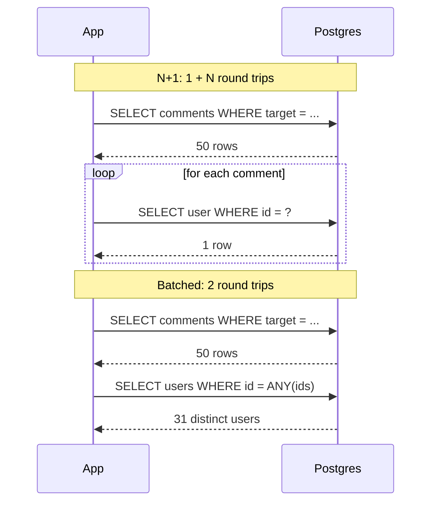

The comments section under a lesson shows 50 comments, each with its author's name. The page takes 45 ms of server time, and the database dashboard says Postgres is nearly idle. Turn on query logging in development and the reason scrolls past: one query for the comments, then fifty queries of the form `SELECT ... FROM users WHERE id = $1`, one per comment. Each takes 0.05 ms inside Postgres. Each also costs a network round trip, a trip through the connection pool, and a turn of the ORM's machinery, so together they cost 40 ms. On a lesson with 400 comments the page takes a third of a second, and it gets slower every time someone comments.

Nothing in the code looks like a loop over queries. The loop is in the template, and the query is hidden behind `comment.author.name`. That is the N+1 problem: one query to fetch N parent rows, then one more query per row to fetch something related. It is the most common performance bug in applications that use an ORM, and it is the default behaviour of most ORMs.

## Anatomy of an N+1

Here is the Django version. Rails, SQLAlchemy and Hibernate's lazy associations behave the same way.

```python
comments = Comment.objects.filter(target_slug="indexes").order_by("created_at")
for c in comments:                 # query 1: SELECT ... FROM comments WHERE ...
    render(c.body, c.author.name)  # query 2..N+1: SELECT ... FROM users WHERE id = %s
```

`c.author` is a lazy relation. The ORM loaded each comment's `author_id` but not the user, and on first access it issues a query to fetch that one user. The ORM cannot batch them, because at the moment of the first access it has no idea you are about to access 49 more. The SQL log shows the pattern:

```text
SELECT id, author_id, body, created_at FROM comments WHERE target_slug = 'indexes' ORDER BY created_at;
SELECT id, name FROM users WHERE id = '0192f3a1-...';
SELECT id, name FROM users WHERE id = '0192f3a1-...';   -- the same author again
SELECT id, name FROM users WHERE id = '0192f7c9-...';
... 47 more
```

Notice the repeated ID. Django keeps no identity map, so an author with three comments is fetched three times. (Hibernate and SQLAlchemy check their session's identity map before a many-to-one lazy load, which saves the repeats but not the other queries.)

### Why it costs more than it looks

A query's cost is not only the work Postgres does. For a primary-key lookup, the fixed costs dominate:

| Step | Typical cost, same availability zone |
|---|---|
| Acquire a pooled connection (plus a ping if the pool tests connections) | 0.01–0.3 ms |
| Network round trip to the database | 0.2–0.5 ms |
| Parse, plan (skipped for a cached prepared statement), execute | 0.02–0.1 ms |
| Serialise, deserialise, build the ORM object | 0.01–0.05 ms |

So 51 queries at about 0.8 ms each is 40 ms, against about 1 ms for a single query that fetches everything. Move the database to another availability zone, or put a proxy in the path, and the round trip doubles and so does the page. The pool pays too: [connection management](/learn/databases/storage-and-scale/connection-management) showed that pool demand is acquires per second times hold time, and N+1 multiplies acquires by N.



It compounds. If each author row then lazily loads an avatar record, a page makes 1 + N + N queries. A GraphQL resolver that fetches each field's relation independently can make hundreds of queries for one request.

## Three fixes and the SQL they produce

### 1. Join: one query, one row per result

Eager loading a to-one relation with a join (Django's `select_related`, Rails's `eager_load`, SeaORM's `find_also_related`) sends one query:

```sql
SELECT c.id, c.body, c.created_at, u.id AS author_id, u.display_name
FROM comments c
LEFT JOIN users u ON u.id = c.user_id
WHERE c.target_kind = 'lesson' AND c.target_slug = 'indexes'
ORDER BY c.created_at
LIMIT 500;
```

This is the right fix for *to-one* relations (each comment has one author). For *to-many* relations it has a cost: the parent's columns repeat on every child row. Join two to-many relations at once (a post with its 20 comments and its 10 tags) and you get the cartesian product: 200 rows to describe one post, which the ORM must deduplicate back into 1 + 20 + 10 objects.

### 2. Batch load: one extra query per relation

Fetch the parents, collect the foreign keys, and fetch all the related rows in one more query (Django's `prefetch_related`, Rails's `preload`, SeaORM's `LoaderTrait::load_one` and `load_many`):

```sql
SELECT id, display_name FROM users WHERE id = ANY($1);   -- $1 = array of 31 distinct ids
```

```text
Index Scan using users_pkey on users  (cost=0.29..92.40 rows=31 width=40) (actual time=0.018..0.074 rows=31 loops=1)
  Index Cond: (id = ANY ($1))
  Buffers: shared hit=93
```

Two round trips regardless of N, no duplication, and it works for to-many relations without a cartesian explosion. Prefer `= ANY($1)` with an array parameter over `IN ($1, $2, ..., $31)`: the array form is one prepared statement whatever the list length, while the `IN` form produces a different statement text (and a different plan cache entry) for every list length.

### 3. Shape the result in SQL

When the response is a nested document, Postgres can build the nesting itself and return one row per parent:

```sql
SELECT p.id, p.title,
       coalesce(
         json_agg(json_build_object('id', c.id, 'body', c.body) ORDER BY c.created_at)
           FILTER (WHERE c.id IS NOT NULL),
         '[]') AS comments
FROM posts p
LEFT JOIN comments c ON c.post_id = p.id
WHERE p.id = ANY($1)
GROUP BY p.id;
```

One round trip and no duplicated parent columns on the wire. The cost is that the ORM is now mostly out of the picture, and the query is harder to compose.

| Fix | Round trips | Best for | Watch out for |
|---|---|---|---|
| Join | 1 | To-one relations | Row duplication for to-many; cartesian product for two to-many joins |
| Batch load (`= ANY`) | 1 per relation level | To-many relations, GraphQL, deep graphs | Very large ID lists; one more query per level of nesting |
| Shape in SQL (`json_agg`) | 1 | Read-heavy nested endpoints | Harder to compose and test; moves logic into SQL |

## How this app does it with SeaORM

This app's data layer is SeaORM on top of sqlx, with every service in `crates/core/src/services`. Reading it with the N+1 lens is a good exercise, because it gets the important things right and makes a few trade-offs worth naming.

### Comments: one query, threaded in memory

`CommentService::list` fetches the comments for a lesson or problem together with each author's name. The first version did it like this:

```rust
// Single query with the author joined; threading is done in memory.
let rows: Vec<(comments::Model, Option<users::Model>)> = Comments::find()
    .find_also_related(Users)
    .filter(comments::Column::TargetKind.eq(kind))
    .filter(comments::Column::TargetSlug.eq(slug))
    .order_by_asc(comments::Column::CreatedAt)
    .limit(500)
    .all(&self.db)
    .await?;
```

`find_also_related` is a `LEFT JOIN`. SeaORM selects both entities' columns with `A_` and `B_` prefixes so it can split each row back into two models:

```sql
SELECT "comments"."id" AS "A_id", "comments"."user_id" AS "A_user_id",
       "comments"."target_kind" AS "A_target_kind", ...,
       "users"."id" AS "B_id", "users"."email" AS "B_email",
       "users"."password_hash" AS "B_password_hash", "users"."display_name" AS "B_display_name", ...
FROM "comments"
LEFT JOIN "users" ON "comments"."user_id" = "users"."id"
WHERE "comments"."target_kind" = $1 AND "comments"."target_slug" = $2
ORDER BY "comments"."created_at" ASC
LIMIT $3
```

The composite index `idx_comments_target (target_kind, target_slug, created_at)` from the comments migration serves the `WHERE` and the `ORDER BY` in one index scan, so there is no sort and the `LIMIT` can stop early (the [indexes lesson](/learn/databases/relational-fundamentals/indexes) shows the plan). The join to `users` is a primary-key probe per comment or a hash join, whichever the planner prefers. One round trip for the whole thread: not N+1. A review still found two problems, and both are now fixed.

1. **The projection was wider than it needed to be.** `find_also_related(Users)` selected every `users` column for every comment, including `email` and `password_hash`, and the code only used `display_name`. Nothing leaked (the view model copied only the name, and the model skips `password_hash` when serialising), but a public endpoint was loading credential hashes into memory it did not need, one careless serialisation change away from sending them.
2. **Oldest-first with a limit hid new comments.** On a lesson with 600 comments, the 100 newest were never returned: the thread froze for everyone at comment 500.

The current code:

```rust
// One query with the author's display name joined (not the whole user
// row: never select password hashes you don't need). Newest 500 first,
// then reversed so threads read oldest to newest.
let mut rows: Vec<(comments::Model, Option<String>)> = Comments::find()
    .select_only()
    .columns(comments::Column::iter())
    .column_as(users::Column::DisplayName, "author_name")
    .left_join(Users)
    .filter(comments::Column::TargetKind.eq(kind))
    .filter(comments::Column::TargetSlug.eq(slug))
    .order_by_desc(comments::Column::CreatedAt)
    .limit(500)
    .into_model::<CommentRow>()
    .all(&self.db)
    .await?
    .into_iter()
    .map(|r| (r.comment(), r.author_name))
    .collect();
rows.reverse();
```

`select_only()` clears the default projection, `columns(...)` puts back the comment's own columns, and `column_as` adds exactly one user column under the alias `author_name`. `into_model::<CommentRow>()` maps each row onto a flat struct declared for this query (the comment's fields plus `author_name: Option<String>`) instead of two full models:

```sql
SELECT "comments"."id", "comments"."user_id", ..., "comments"."updated_at",
       "users"."display_name" AS "author_name"
FROM "comments"
LEFT JOIN "users" ON "comments"."user_id" = "users"."id"
WHERE "comments"."target_kind" = $1 AND "comments"."target_slug" = $2
ORDER BY "comments"."created_at" DESC
LIMIT $3
```

Still one round trip, and still the same index, now scanned backwards (a B-tree reads in either direction, so `DESC` needs no second index). The cap keeps the 500 newest comments, and `rows.reverse()` restores oldest-to-newest reading order in memory. It is still a cap rather than pagination: anything older than the newest 500 is unreachable, and a new reply whose root is older than that window is not shown either, because the attach step finds no root for it. Keyset pagination on `(created_at, id)` is the next step if threads grow that long. The general lesson from both fixes: an ORM's convenient defaults (load whole related models, order the obvious way) are decisions about data exposure and correctness, not just query count, so review the projection and the ordering as well as the number of queries.

The code then builds the thread structure in memory: one pass splits rows into roots and replies, and a second pass attaches each reply to its root. Replies are one level deep by design; `create` rejects a reply to a reply ("one level of nesting keeps threads readable on a phone"). Threading in the application rather than with a recursive CTE is the right call here: the data is small, the shape is fixed, and Rust is fast at it.

Two further observations a reviewer might make:

1. **The attach step is quadratic in the worst case.** Each reply does a linear `find` over the roots, so 250 roots and 250 replies cost about 62,500 comparisons. That is microseconds, and a `HashMap` from root ID to position would make it linear. At a 500-row cap it does not matter, which is itself the point: know the complexity, then decide it is fine.
2. **The `Option` used to handle a case the schema forbade.** The join is a left join, so the author's name is typed `Option<String>`, and the code falls back to `"deleted user"`. The foreign key was originally `ON DELETE CASCADE`, so the fallback could never run: deleting a user deleted their comments and, through the `parent_id` cascade, every reply other people had written to them. Once accounts could be deleted, that cascade was a real bug, and migration `m0007_integrity` fixed it by making `comments.user_id` nullable with `ON DELETE SET NULL`. A deleted account's comments now stay, shown as by "deleted user" with a null `author_id`, and the fallback is live code. Cheap handling of a case the schema forbids is worth keeping for exactly this reason: schemas change.

The exercise at the end of this lesson asks you to write the threading step in linear time.

### Authentication: the same pattern on every request

Every authenticated request resolves its session cookie through `AuthService::authenticate`, which uses the same technique:

```rust
let Some((session, user)) = Sessions::find_by_id(&hash).find_also_related(Users).one(&self.db).await? else {
    return Ok(None);
};
```

Session and user in one primary-key join, one round trip on the hottest path in the application. It also updates `last_seen_at` at most once an hour rather than on every request, which avoids turning every read into a write (and, as the [MVCC lesson](/learn/databases/relational-fundamentals/mvcc-and-locking) explains, a new row version, WAL and vacuum work each time).

### Progress: one statement per write

`ProgressService::set_lesson_status` records progress with an upsert:

```rust
// Upsert returning the row: one statement, one round trip, no
// read-modify-write race.
super::activity::record(&self.db, user_id).await?;
let row = LessonProgress::insert(model)
    .on_conflict(
        sea_query::OnConflict::columns([lesson_progress::Column::UserId, lesson_progress::Column::LessonSlug])
            .update_columns([
                lesson_progress::Column::Status,
                lesson_progress::Column::CompletedAt,
                lesson_progress::Column::UpdatedAt,
            ])
            .to_owned(),
    )
    .exec_with_returning(&self.db)
    .await?;
Ok(row)
```

which sends:

```sql
INSERT INTO "lesson_progress" ("user_id", "lesson_slug", "status", "completed_at", "created_at", "updated_at")
VALUES ($1, $2, $3, $4, $5, $6)
ON CONFLICT ("user_id", "lesson_slug") DO UPDATE SET
  "status"       = "excluded"."status",
  "completed_at" = "excluded"."completed_at",
  "updated_at"   = "excluded"."updated_at"
RETURNING "user_id", "lesson_slug", "status", "completed_at", "created_at", "updated_at"
```

The ORM-shaped alternative, "find the row; if it exists update it, else insert it", is two or three round trips and a race: two tabs marking the same lesson complete at the same moment both find nothing and both insert, and one fails on the primary key. `ON CONFLICT` makes the unique index arbitrate atomically. Two details are deliberate: `created_at` is not in `update_columns`, so the first-seen time survives every later update; and `excluded` refers to the row that was proposed for insertion. `set_module_preference` uses the same pattern. The `activity::record` call before it is the same idea again: `INSERT INTO activity_days ... ON CONFLICT DO NOTHING` marks today as an active day for the streak, and repeating it on the same day changes nothing. The two statements are not in one transaction, which is acceptable here: if the upsert fails after the activity row lands, the only effect is a streak day for a click that did not save.

This used to be two round trips. The first version called `.exec(&self.db)`, which returns only the primary key (`RETURNING "user_id", "lesson_slug"`), and then ran `LessonProgress::find_by_id(...)` to read the row back for the response. That doubled the database work on every progress click, and the pair was not atomic: another tab's write could land in between, so the response could describe a state this request never produced. `exec_with_returning` lists every column in `RETURNING` and gets the row back from the same statement, as it stands after the upsert (so `created_at` is the original first-seen time, not the proposed one). The general habit: when a write is followed by a read of the same row, ask whether the write can return it.

### The dashboard: a few queries is not N+1

`ProgressService::summary` runs five queries in sequence: the user's lesson progress, module preferences, the distinct problems they have solved, their quiz attempts, and the days they were active in the last 400 (for the streak). That is a fixed number of queries whatever the user's history, which is a different thing from N+1, where the count grows with the data. The solved-problems query is also a good example of a narrow projection:

```sql
SELECT DISTINCT "submissions"."target_slug" FROM "submissions"
WHERE "submissions"."user_id" = $1 AND "submissions"."target_kind" = $2 AND "submissions"."passed" = $3
```

The five queries are independent, so they could run concurrently with `tokio::try_join!`, cutting latency from the sum of five round trips to roughly the slowest one. The costs: each concurrent query holds its own pooled connection, so one request would use five connections at once; and the five queries would each see their own snapshot rather than one consistent view. At this app's scale, sequential is simpler and fast enough. That is the right kind of answer: name the optimisation, name its cost, decide.

All of these share the single 20-connection pool configured in `crates/api/src/state.rs`, which is why keeping per-request query counts constant matters more than shaving microseconds off any one query.

## Detecting N+1

N+1 is invisible in code review and obvious in data, so detect it with data.

**Count queries in tests.** The strongest defence is a test that renders an endpoint with realistic fan-out (50 comments by 30 authors) and asserts the number of queries. Django has it built in:

```python
def test_comment_thread_query_count(self):
    make_thread(comments=50, authors=30)
    with self.assertNumQueries(2):
        self.client.get("/api/comments?target=lesson/indexes")
```

In Rust, count statements through a tracing subscriber or a test wrapper around the connection. The assertion is on the *shape*: the count must not depend on N.

**Log queries in development.** SeaORM can log every statement it sends; this app turns it off in `connect_db` with `sqlx_logging(false)`, which is right for production noise and worth flipping on locally when a page feels slow.

**Read `pg_stat_statements` in production.** N+1 has a fingerprint: a cheap statement whose call count is a large multiple of your request count, returning one row per call.

```sql
SELECT calls, round(mean_exec_time::numeric, 3) AS mean_ms,
       round(total_exec_time::numeric) AS total_ms, rows, left(query, 60) AS query
FROM pg_stat_statements
ORDER BY calls DESC
LIMIT 5;
```

```text
   calls   | mean_ms | total_ms |   rows    |                            query
-----------+---------+----------+-----------+--------------------------------------------------------------
  48211093 |   0.011 |   530322 |  48211093 | SELECT "users"."id", "users"."display_name" FROM "users" WHER
   1210554 |   0.410 |   496327 |  60427702 | SELECT "comments"."id", "comments"."body", "comments"."creat
    ...
```

Forty million calls of a 0.011 ms query, one row each, for about a million comment-page loads: roughly forty lookups per page. The per-call time is tiny, so a "slowest queries" view never shows it. Sort by `calls`.

**Look at traces.** In a distributed trace, N+1 is a waterfall of identical short database spans under one request span.

## Other ORM traps

- **Read-modify-write in objects.** `progress.attempts += 1; progress.save()` reads, increments in memory and writes back: a lost update under concurrency ([isolation levels](/learn/databases/relational-fundamentals/isolation-levels-and-anomalies)). Use an atomic `UPDATE ... SET attempts = attempts + 1` or an upsert. SeaORM narrows the damage by writing only the columns you `Set`: `CommentService::delete` sets `body` and `deleted_at`, and the resulting statement is `UPDATE "comments" SET "body" = $1, "deleted_at" = $2 WHERE "comments"."id" = $3` (plus `RETURNING` on Postgres), not a rewrite of every column. Django's `save()` writes every field unless you pass `update_fields`.
- **Check, then act, in two round trips.** The same `delete` first loads the comment to check ownership, then updates it. For a soft delete the gap between the two is harmless. For anything where it is not, fold the check into the write: `UPDATE ... WHERE id = $1 AND user_id = $2 RETURNING id`, and treat zero rows as "not found or not yours".
- **Implicit transactions, or none.** Each ORM `save()` may be its own transaction. Two saves that must succeed together need an explicit transaction (`db.begin()` in SeaORM).
- **Loading to count.** `len(Comment.objects.filter(...))` fetches every row to count them; `.count()` sends `SELECT count(*)`. The same applies to existence checks (`exists()` versus loading a row).
- **Pagination with `OFFSET`.** ORMs make `.offset(n)` easy; page 1,000 reads and discards the 999 pages before it. Use keyset pagination.

## When to leave the ORM

An ORM is good at mapping rows to objects for the 80% of queries that are simple CRUD. Drop to SQL, without guilt, for the rest: reporting queries with window functions, CTEs, bulk upserts, `FOR UPDATE SKIP LOCKED` job claims, and anything where you need to control the exact statement. SeaORM gives you `sea_query` to build statements programmatically and `Statement::from_sql_and_values` with `find_by_statement` or `into_model` for raw SQL mapped onto a struct; sqlx underneath offers `query_as!`, which checks the SQL against the database schema at compile time. The rule that keeps this maintainable: raw SQL lives in the same service layer as the ORM code, behind the same function signatures, with a test.

## Batching in GraphQL: the DataLoader pattern

GraphQL makes N+1 the default: each field's resolver runs independently, so resolving `author` on 50 comments calls the author resolver 50 times. The standard fix is a **DataLoader**: a per-request object whose `load(id)` does not query immediately but records the ID and returns a promise. When the current tick of the event loop finishes, the loader sends one batched query for every ID requested during that tick (deduplicated), resolves all the promises, and caches the results for the rest of the request so a repeated ID costs nothing.

```exercise
id: thread-comments
title: Thread comments in one pass
prompt: |
  This app fetches up to 500 comments for a target in one query, puts them
  in `created_at` order, then builds threads in memory. Implement that step
  in linear time.

  `rows` is a list of `{"id": str, "parent_id": str or null}` in `created_at`
  order. A row with a null `parent_id` is a root. Replies attach only to roots
  (one level of nesting); a reply whose parent is not a root in `rows` is
  dropped, as the app does.

  Return a list of `[root_id, [reply_id, ...]]`, roots in input order and each
  root's replies in input order. Note that a reply may appear in `rows` before
  its root if both have the same timestamp, so do not assume parents come first.
languages: [python, javascript]
entry: thread_comments
starter:
  python: |
    def thread_comments(rows):
        return []
  javascript: |
    function thread_comments(rows) {
      return [];
    }
tests:
  - args: [[{"id": "a", "parent_id": null}, {"id": "b", "parent_id": "a"}, {"id": "c", "parent_id": null}, {"id": "d", "parent_id": "a"}, {"id": "e", "parent_id": "c"}]]
    expected: [["a", ["b", "d"]], ["c", ["e"]]]
  - args: [[]]
    expected: []
    label: no comments
  - args: [[{"id": "x", "parent_id": "gone"}, {"id": "y", "parent_id": null}]]
    expected: [["y", []]]
    label: orphan reply is dropped
  - args: [[{"id": "r", "parent_id": null}, {"id": "s", "parent_id": "r"}, {"id": "t", "parent_id": "s"}]]
    expected: [["r", ["s"]]]
    hidden: true
  - args: [[{"id": "b", "parent_id": "a"}, {"id": "a", "parent_id": null}]]
    expected: [["a", ["b"]]]
    hidden: true
hints:
  - "Make two passes: the first collects roots into a list and a dictionary from id to that root's entry; the second attaches replies."
  - "Appending to the reply list stored in the dictionary also updates the entry in the result list, because both refer to the same object."
```

```exercise
id: dataloader-batches
title: Plan a DataLoader's batches
prompt: |
  A per-request DataLoader collects the keys requested during each event-loop
  tick and sends one batched query per tick. It caches every key it has loaded
  for the rest of the request.

  `ticks` is a list of ticks; each tick is the list of keys (integers) requested
  during that tick, possibly with duplicates. Return the list of queries the
  loader sends: for each tick, the keys requested in that tick that have not been
  loaded before, deduplicated and sorted ascending. A tick that needs no new keys
  sends no query.
languages: [python, javascript]
entry: plan_batches
starter:
  python: |
    def plan_batches(ticks):
        return []
  javascript: |
    function plan_batches(ticks) {
      return [];
    }
tests:
  - args: [[[3, 1, 3, 2]]]
    expected: [[1, 2, 3]]
    label: duplicates within a tick
  - args: [[[1, 2], [2, 3], [1]]]
    expected: [[1, 2], [3]]
    label: cache across ticks
  - args: [[]]
    expected: []
  - args: [[[5], [5], [5]]]
    expected: [[5]]
    hidden: true
  - args: [[[4, 4], [], [9, 4, 1]]]
    expected: [[4], [1, 9]]
    hidden: true
hints:
  - "Keep a set of loaded keys across ticks."
  - "In JavaScript, sort numbers with a comparator: `arr.sort((a, b) => a - b)`."
```

## Senior signals

- You can spot N+1 from a query log or `pg_stat_statements` (a cheap statement with calls in multiples of requests) and you assert query counts in tests so it cannot come back.
- You choose between join, batch load and SQL-side shaping by relation cardinality: join for to-one, `= ANY($1)` batching for to-many, `json_agg` for hot nested reads.
- You distinguish N+1 (queries grow with data) from a fixed handful of independent queries, and you can weigh running those concurrently against pool usage and snapshot consistency.
- You use single-statement upserts and atomic updates instead of ORM read-modify-write, and you know which columns your ORM's update actually writes.
- You review projections as well as query counts: selecting whole related rows (including sensitive columns) to render one field is a smell.
- You drop to SQL for reporting, bulk and locking queries without apology, and keep that SQL in the same tested service layer.

## Check yourself

```quiz
- q: >-
    A page renders 200 orders with each order's customer name. It issues 201 queries, each under 0.1 ms in Postgres, and the endpoint takes 120 ms. Where does the time go?
  options: ["Serialising 200 orders and their customer names to JSON on the hot response path", "Fixed per-query costs (round trip, pool acquire, ORM work) paid 200 times over", "The orders query needs an index on customer_id to avoid a sequential scan", "Postgres is slow at primary-key lookups once a table holds millions of rows"]
  answer: 1
  explanation: >-
    Each lazy load pays a network round trip, a pool acquire and client-side ORM work that dwarf the execution time; the question already says each query runs in under 0.1 ms, so no index or Postgres tuning can recover 120 ms. Two queries (orders, then customers WHERE id = ANY($1)) or one join replace 201 round trips with one or two.
- q: >-
    You need blog posts with their comments and their tags. Why is one query joining posts to both comments and tags a poor choice?
  options: ["Tags must be stored as an array column, so they cannot be joined like rows", "Postgres cannot join more than two tables in one query without a subquery", "Two to-many joins return comments × tags rows for each post, duplicating the data", "Joins cannot use indexes on to-many relations, so each join scans both tables"]
  answer: 2
  explanation: >-
    Joining a parent to two independent to-many relations produces their cartesian product: 20 comments and 10 tags yield 200 rows for one post, which the ORM must then deduplicate. Postgres joins many tables happily and uses indexes for each join; the problem is the shape of the result. Batch-load each relation separately or aggregate with json_agg to keep the result proportional to the data.
- q: >-
    The first version of this app's CommentService::list used find_also_related(Users). What SQL did that generate, and what was the fair review comment?
  options: ["A recursive CTE that threaded replies in SQL; the fix was threading in memory", "Two queries, one per table, joined in memory; the fix was a single database-side join", "N+1: one lazy load per comment to fetch its author; the fix was a single join", "One LEFT JOIN, not N+1, but it selected every users column, password_hash included"]
  answer: 3
  explanation: >-
    find_also_related is a single left join with prefixed column aliases, served by the (target_kind, target_slug, created_at) index, so the query count was already right and calling it N+1 misreads it. The projection was wider than necessary: every users column, including email and password_hash, when only display_name was used. That costs memory and is a defence-in-depth concern on a public endpoint. The current code selects only the comment's columns plus users.display_name (select_only, column_as) into a dedicated CommentRow struct.
- q: >-
    Why does ProgressService::set_lesson_status use INSERT ... ON CONFLICT DO UPDATE instead of reading the row and choosing between insert and update?
  options: ["The unique index arbitrates concurrent writers, so two requests cannot both insert", "SeaORM cannot update rows whose primary key spans two columns, like this one", "An upsert skips the write-ahead log when the row already holds the same values", "ON CONFLICT is parsed and planned only once, so it is faster than a separate SELECT"]
  answer: 0
  explanation: >-
    Read-then-write is a race: both requests can see no row and both insert, and one fails. An upsert makes the conflict check and the write one atomic statement, and it saves round trips as a side effect, which is a bonus rather than the reason. It still writes WAL like any other update. Leaving created_at out of update_columns also preserves the original timestamp.
- q: >-
    pg_stat_statements shows SELECT ... FROM users WHERE id = $1 with 50 million calls, 0.01 ms mean time, and rows equal to calls, while the service handles about 1 million requests in the same period. What does that suggest?
  options: ["Normal behaviour: each request authenticates, which looks up the user by id", "The users table needs a better index, since every call reads a single row", "The prepared-statement cache is too small, so the query text is re-sent each time", "N+1: about 50 single-row lookups per request, hidden because each one is fast"]
  answer: 3
  explanation: >-
    A cheap single-row statement whose call count is a large multiple of the request count is the fingerprint of per-row lazy loading. Authentication would account for about one lookup per request, not fifty, and a 0.01 ms mean says the index is already fine. Sorting pg_stat_statements by calls, not by mean time, is how you find it.
```
