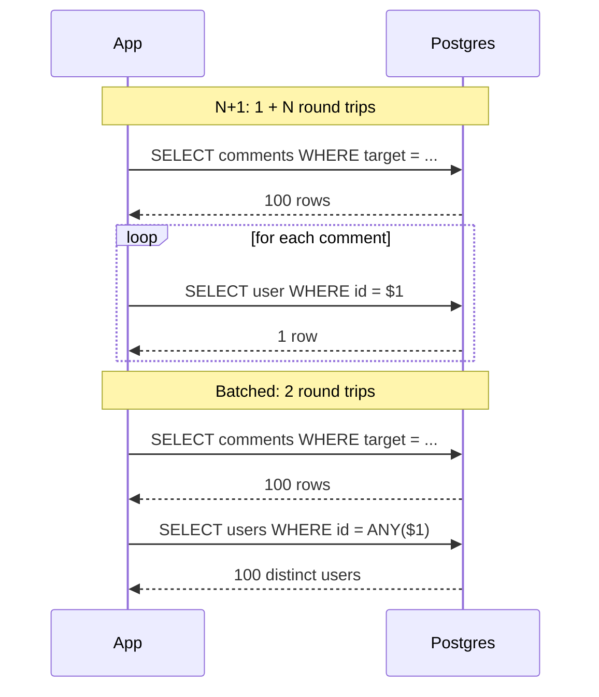

The comments section under a lesson shows 100 comments, each with its author's name. The page is slow, and the database dashboard says Postgres is nearly idle. Turn on query logging in development and the reason scrolls past: one query for the comments, then one hundred queries of the form `SELECT ... FROM users WHERE id = $1`, one per comment. Each is a primary-key lookup that Postgres answers in microseconds.

The lab reproduced the page on PostgreSQL 17 with `pgbench` running on the database host itself: the 101 queries took **11.5 ms**, and one join returning the same data took **0.30 ms**. That gap is almost all round trips, and round trips get more expensive once the application is on another machine: at a 0.5 ms same-zone round trip the N+1 page costs about **62 ms** against **0.8 ms**, and at 1,000 comments it costs over half a second. It also gets slower every time someone comments.

Nothing in the code looks like a loop over queries. The loop is in the template, and the query is hidden behind `comment.author.name`. That is the N+1 problem: one query to fetch N parent rows, then one more query per row to fetch something related. It is the most common performance bug in applications that use an ORM, and in most ORMs it is the default behaviour. This lesson measures it, explains what each round trip costs on the wire, compares the fixes (including the case where the "obvious" join loses), shows how to detect it without `pg_stat_statements`, and reads this app's SeaORM code with the same lens.

## Anatomy of an N+1

Here is the Django version. Rails, SQLAlchemy and Hibernate's lazy associations behave the same way.

```python
comments = Comment.objects.filter(target_slug="indexes").order_by("created_at")
for c in comments:                 # query 1: SELECT ... FROM comments WHERE ...
    render(c.body, c.author.name)  # query 2..N+1: SELECT ... FROM users WHERE id = %s
```

`c.author` is a lazy relation. The ORM loaded each comment's `author_id` but not the user, and on first access it issues a query to fetch that one user. It cannot batch them, because at the moment of the first access it has no idea you are about to access 99 more. The SQL log shows the pattern:

```text
SELECT id, author_id, body, created_at FROM comments WHERE target_slug = 'indexes' ORDER BY created_at;
SELECT id, name FROM users WHERE id = '0192f3a1-...';
SELECT id, name FROM users WHERE id = '0192f3a1-...';   -- the same author again
SELECT id, name FROM users WHERE id = '0192f7c9-...';
... 97 more
```

Notice the repeated ID. Django keeps no identity map, so an author with three comments is fetched three times. (Hibernate and SQLAlchemy check their session's identity map before a many-to-one lazy load, which saves the repeats but not the other queries.) It compounds: if each author lazily loads an avatar record, the page makes 1 + N + N queries, and a GraphQL resolver per field can make hundreds.

## N+1 measured: 1 + N queries, one join, one batch

The lab put 300,000 comments over 2,000 lessons plus three targets with 10, 100 and 1,000 comments, each by a random author among 100,000 users, and ran three versions of the page as `pgbench` scripts (`-M prepared`, one client, 8 seconds each) over the local socket inside the database container:

| Comments N | 1 + N lookups | One `LEFT JOIN` | Comments, then `WHERE id = ANY($1)` |
|---|---|---|---|
| 10 | 1.26 ms (11 queries) | 0.15 ms | 0.25 ms |
| 100 | 11.5 ms (101 queries) | 0.30 ms | 0.42 ms |
| 1,000 | 115 ms (1,001 queries) | 4.0 ms | 1.35 ms |

`pgbench -r` breaks the N+1 page down by statement: the comments query took 0.227 ms and **each author lookup 0.112–0.117 ms**, a constant cost per round trip that the page pays N times. Over loopback TCP instead of the Unix socket the 101-query page took 13.0 ms, about 0.015 ms more per round trip.

The last row holds a surprise: at 1,000 comments, one join (4.0 ms) was three times slower than two queries (1.35 ms). `EXPLAIN ANALYZE` shows why. At 100 rows the planner chose a nested loop of 100 primary-key probes (0.38 ms). At 1,000 it estimated that probing the users index 1,000 times at `random_page_cost = 4` would cost more than reading the table, so it built a hash of **all 100,000 users** (`Hash Right Join` over a sequential scan, 8.2 ms under `EXPLAIN ANALYZE`). The batched lookup gave the planner no such choice: one index scan for 994 distinct ids, 1.26 ms. "One query" is not automatically the fastest shape; the [indexes lesson](/learn/databases/relational-fundamentals/indexes) hit the same plan flip on this app's comments query, where a `random_page_cost` that describes SSD storage (1.1 instead of 4) turned it back into a nested loop.

## What a round trip costs, modelled

The lab ran on one machine. Your application does not. Each extra query pays the network round trip (RTT) between application and database, so the page's time is roughly the local cost plus round trips × RTT. The RTTs below are typical figures that depend on your network: about 0.1 ms on the same host or a fast LAN, about 0.5 ms within one cloud availability zone, 1–2 ms across zones.

| N | RTT | 1 + N queries | One join | Two queries |
|---|---|---|---|---|
| 10 | 0.5 ms | 6.8 ms | 0.65 ms | 1.25 ms |
| 100 | 0.1 ms | 21.6 ms | 0.40 ms | 0.61 ms |
| 100 | 0.5 ms | 62 ms | 0.80 ms | 1.42 ms |
| 100 | 2.0 ms | 214 ms | 2.30 ms | 4.42 ms |
| 1,000 | 0.5 ms | 616 ms | 4.51 ms | 2.35 ms |
| 1,000 | 2.0 ms | 2,117 ms | 6.01 ms | 5.35 ms |

Three consequences follow. Moving the database one zone away multiplies an N+1 page's latency and barely moves the fixed-query versions. A proxy in the path (PgBouncer, a sidecar) adds its hop to every one of the N round trips. And the connection pool pays too: each query holds a pooled connection for its round trip, so the page occupies about 62 ms of connection time at N = 100 and 0.5 ms RTT. This app's pool has 20 connections (`crates/api/src/state.rs`), so pages of that shape saturate it at about 20 / 0.062 s ≈ 320 per second, against about 14,000 per second for the two-query version. The [connection management lesson](/learn/databases/storage-and-scale/connection-management) derives pool demand as acquires × hold time; N+1 multiplies the acquires by N.



## Under the hood: one query on the wire

A query from sqlx (under SeaORM) uses Postgres's extended protocol. For a statement text the connection has seen before, the client sends `Bind` (the statement name plus parameter values), `Execute` and `Sync`, and waits for `DataRow` messages, `CommandComplete` and `ReadyForQuery`: one round trip. For a new statement text, sqlx first sends `Parse`, `Describe` and `Sync` and waits for the parameter and row descriptions, which costs an extra round trip; it then caches the prepared statement per connection, up to `statement_cache_capacity`, 100 by default in sqlx-postgres 0.9.

On the server, a cached statement skips parsing, and after several executions Postgres may switch it to a cached generic plan, so a primary-key lookup is a few microseconds of work: one B-tree descent and one heap fetch. Most of the ~0.11 ms per lookup in the lab was the round trip itself: a write into the kernel's socket buffer, a wake-up of the server process, the same again for the reply, and the client decoding the row. An ORM adds its own step per row: mapping columns onto a model struct or object, which in Python ORMs is often the largest part of the client's share.

This is why N+1 barely shows up in database metrics: Postgres spends almost nothing per query and is mostly waiting on the client. The cost lives in the application's latency, in connection-pool occupancy, and in CPU spent on both ends shuttling small messages.

## Lazy and eager loading across ORMs

Every ORM offers the same three loading strategies under different names, and most default to lazy for relations:

| ORM | Lazy default | Eager by join | Eager by second query | Refuse lazy loads |
|---|---|---|---|---|
| Django | yes | `select_related` | `prefetch_related` | not built in (third-party packages) |
| Rails (Active Record) | yes | `eager_load` (or `includes` with a condition on the relation) | `preload` (or `includes`) | `strict_loading` (Rails 6.1+) |
| SQLAlchemy | `lazy="select"` | `joinedload` | `selectinload` | `raiseload`, `lazy="raise"` |
| Hibernate / JPA | to-many lazy, to-one eager | `JOIN FETCH`, entity graphs | `@BatchSize`, subselect fetching | a lazy load outside the session throws `LazyInitializationException` |
| SeaORM | none: no lazy loading | `find_also_related`, `find_with_related` | `LoaderTrait::load_one` / `load_many` | not needed |

The last column is the senior move in a dynamic-language codebase: make lazy loading an error in tests and in development, so an accidental N+1 fails loudly instead of shipping.

SeaORM has no lazy properties at all. A model has no `author` field that fetches on access; you ask for related rows explicitly with `comment.find_related(Users).one(&db).await`. So N+1 in SeaORM is visible in the code: an `.await` on a query inside a `for` loop over rows. That makes review the first line of defence, and the smell to look for is any database call inside a loop.

SeaORM 2.0.3's batch loader is worth knowing precisely. `load_one` and `load_many` collect the parents' keys, deduplicate them, and issue one query per relation hop of the form `WHERE ("users"."id") IN (($1), ($2), ...)`, one bind parameter per distinct key. Two consequences: a page with 50 distinct authors and one with 51 produce different statement texts, each prepared separately and competing for the 100-entry statement cache; and a Postgres statement carries at most 65,535 parameters, so a key list larger than that fails and must be chunked. A hand-written `= ANY($1)` with one array parameter has neither problem.

## Three fixes and the SQL they produce

### 1. Join: one query, one row per result

Eager loading a to-one relation with a join (Django's `select_related`, Rails's `eager_load`, SeaORM's `find_also_related`) sends one query:

```sql
SELECT c.id, c.body, c.created_at, u.id AS author_id, u.display_name
FROM comments c
LEFT JOIN users u ON u.id = c.user_id
WHERE c.target_kind = 'lesson' AND c.target_slug = 'indexes'
ORDER BY c.created_at
LIMIT 500;
```

This is the right fix for *to-one* relations (each comment has one author), with the caveat measured above: the planner decides how to join, and for large N it may hash the whole related table. For *to-many* relations a join repeats the parent's columns on every child row, and joining two to-many relations at once (a post with its 20 comments and its 10 tags) returns their cartesian product: 200 rows for one post, which the ORM deduplicates back into 1 + 20 + 10 objects. The [access-patterns lesson](/learn/databases/data-modeling-and-evolution/modelling-for-access-patterns) measured the same multiplication at 85 million rows. A `LIMIT` on such a join limits joined rows, not parents, so "the first 10 posts with their comments" silently returns fewer posts.

### 2. Batch load: one extra query per relation

Fetch the parents, collect the foreign keys, fetch all related rows in one more query (Django's `prefetch_related`, Rails's `preload`, SQLAlchemy's `selectinload`, SeaORM's `load_one`):

```sql
SELECT id, display_name FROM users WHERE id = ANY($1);   -- $1 = array of distinct ids
```

Two round trips regardless of N, no duplication, and it works for to-many relations without a cartesian product. At N = 1,000 it was the fastest version measured (1.35 ms). Prefer `= ANY($1)` with an array parameter over `IN ($1, ..., $n)`: Postgres plans both as the same array comparison, but the array form is one statement text whatever the list length.

### 3. Shape the result in SQL

When the response is a nested document, Postgres can build the nesting itself and return one row per parent:

```sql
SELECT p.id, p.title,
       coalesce(
         json_agg(json_build_object('id', c.id, 'body', c.body) ORDER BY c.created_at)
           FILTER (WHERE c.id IS NOT NULL),
         '[]') AS comments
FROM posts p
LEFT JOIN comments c ON c.post_id = p.id
WHERE p.id = ANY($1)
GROUP BY p.id;
```

One round trip and no duplicated parent columns on the wire. The ORM is now mostly out of the picture, and the query is harder to compose and test.

## This app: comments in one query

This app's data layer is SeaORM on top of sqlx, with the services in `crates/core/src/services`. Reading it with the N+1 lens is a good exercise, because it gets the important things right and makes trade-offs worth naming.

`CommentService::list` fetches the comments for a lesson or problem together with each author's name. The first version did it like this:

```rust
// Single query with the author joined; threading is done in memory.
let rows: Vec<(comments::Model, Option<users::Model>)> = Comments::find()
    .find_also_related(Users)
    .filter(comments::Column::TargetKind.eq(kind))
    .filter(comments::Column::TargetSlug.eq(slug))
    .order_by_asc(comments::Column::CreatedAt)
    .limit(500)
    .all(&self.db)
    .await?;
```

`find_also_related` is a `LEFT JOIN`. SeaORM selects both entities' columns with `A_` and `B_` prefixes so it can split each row back into two models:

```sql
SELECT "comments"."id" AS "A_id", "comments"."user_id" AS "A_user_id",
       "comments"."target_kind" AS "A_target_kind", ...,
       "users"."id" AS "B_id", "users"."email" AS "B_email",
       "users"."password_hash" AS "B_password_hash", "users"."display_name" AS "B_display_name", ...
FROM "comments"
LEFT JOIN "users" ON "comments"."user_id" = "users"."id"
WHERE "comments"."target_kind" = $1 AND "comments"."target_slug" = $2
ORDER BY "comments"."created_at" ASC
LIMIT $3
```

The composite index `idx_comments_target (target_kind, target_slug, created_at)` serves the `WHERE` and the `ORDER BY` in one index scan, so there is no sort and the `LIMIT` can stop early. One round trip for the whole thread: not N+1. A review still found two problems, and both are fixed.

1. **The projection was wider than it needed to be.** `find_also_related(Users)` selected every `users` column for every comment, including `email` and `password_hash`, and the code used only `display_name`. Nothing leaked (the view model copied only the name, and the model skips `password_hash` when serialising), but a public endpoint was loading credential hashes into memory, one careless serialisation change away from sending them.
2. **Oldest-first with a limit hid new comments.** On a lesson with 600 comments, the 100 newest were never returned: the thread froze for everyone at comment 500.

## This app: the current comments query

```rust
// One query with the author's display name joined (not the whole user
// row: never select password hashes you don't need). Newest 500 first,
// then reversed so threads read oldest to newest.
let mut rows: Vec<(comments::Model, Option<String>)> = Comments::find()
    .select_only()
    .columns(comments::Column::iter())
    .column_as(users::Column::DisplayName, "author_name")
    .left_join(Users)
    .filter(comments::Column::TargetKind.eq(kind))
    .filter(comments::Column::TargetSlug.eq(slug))
    .order_by_desc(comments::Column::CreatedAt)
    .limit(500)
    .into_model::<CommentRow>()
    .all(&self.db)
    .await?
    .into_iter()
    .map(|r| (r.comment(), r.author_name))
    .collect();
rows.reverse();
```

`select_only()` clears the default projection, `columns(...)` puts back the comment's own columns, and `column_as` adds exactly one user column under the alias `author_name`. `into_model::<CommentRow>()` maps each row onto a flat struct declared for this query (the comment's fields plus `author_name: Option<String>`) instead of two full models. The SQL is the same join with a narrow projection and `ORDER BY "comments"."created_at" DESC`: still one round trip and the same index, now scanned backwards. The cap keeps the 500 newest comments, and `rows.reverse()` restores reading order. It is still a cap rather than pagination: anything older than the newest 500 is unreachable, and a new reply whose root is older than that window is dropped, because the attach step finds no root for it. Keyset pagination on `(created_at, id)` is the next step if threads grow that long.

The code then builds threads in memory: one pass splits rows into roots and replies, a second attaches each reply to its root. Replies are one level deep by design; `create` rejects a reply to a reply ("One level of nesting keeps threads readable on a phone."). Two further observations:

1. **The attach step is quadratic in the worst case.** Each reply does a linear `find` over the roots, so 250 roots and 250 replies cost about 62,500 comparisons: microseconds. A `HashMap` from root ID to position makes it linear. At a 500-row cap it does not matter, which is the point: know the complexity, then decide.
2. **The `Option` used to handle a case the schema forbade.** The author's name is `Option<String>` because of the left join, with a `"deleted user"` fallback. The foreign key was originally `ON DELETE CASCADE`, so the fallback could never run: deleting a user deleted their comments and, through the `parent_id` cascade, other people's replies. Migration `m0007_integrity` made `comments.user_id` nullable with `ON DELETE SET NULL`, and the fallback is now live code.

## This app: one statement per write

Every authenticated request resolves its session cookie through `AuthService::authenticate`, with the same technique:

```rust
let Some((session, user)) = Sessions::find_by_id(&hash).find_also_related(Users).one(&self.db).await? else {
    return Ok(None);
};
```

Session and user in one primary-key join, one round trip on the hottest path. It updates `last_seen_at` at most once an hour rather than on every request, which avoids turning every read into a write (and, as the [MVCC lesson](/learn/databases/relational-fundamentals/mvcc-and-locking) explains, a new row version, WAL and vacuum work each time).

`ProgressService::set_lesson_status` records progress with an upsert:

```rust
// Upsert returning the row: one statement, one round trip, no
// read-modify-write race.
let row = LessonProgress::insert(model)
    .on_conflict(
        sea_query::OnConflict::columns([lesson_progress::Column::UserId, lesson_progress::Column::LessonSlug])
            .update_columns([
                lesson_progress::Column::Status,
                lesson_progress::Column::CompletedAt,
                lesson_progress::Column::UpdatedAt,
            ])
            .to_owned(),
    )
    .exec_with_returning(&self.db)
    .await?;
// Only saved progress counts toward today's streak.
super::activity::record(&self.db, user_id).await?;
Ok(row)
```

which sends `INSERT ... ON CONFLICT ("user_id", "lesson_slug") DO UPDATE SET "status" = "excluded"."status", ... RETURNING` every column. The ORM-shaped alternative, "find the row; insert or update it", is two or three round trips and a race: two tabs both find nothing and both insert, and one fails on the primary key. `created_at` is deliberately absent from `update_columns`, so the first-seen time survives. The first version called `.exec(&self.db)`, which on Postgres returns only the primary key, then read the row back with `find_by_id`: double the round trips, and another tab's write could land in between. `activity::record` (an `INSERT INTO activity_days ... ON CONFLICT DO NOTHING`) used to run before the upsert, so a failed click still earned a streak day; it now runs after. The two statements are not one transaction, and the order decides which failure is possible: a failure after the upsert reports an error for saved progress, and a retry is harmless because the upsert is idempotent.

`ProgressService::summary` runs five queries in sequence (lesson progress, module preferences, distinct solved problems, quiz attempts, active days in the last 400). A fixed number whatever the user's history is not N+1, where the count grows with the data. They could run concurrently with `tokio::try_join!`, cutting latency to roughly the slowest one, at the price of five pooled connections per request and five separate snapshots instead of one consistent view; at this app's scale, sequential is simpler. Name the optimisation, name its cost, decide.

## Detecting N+1

N+1 is invisible in code review in dynamic ORMs and obvious in data, so detect it with data: count statements per unit of work.

**Count queries in tests.** Render an endpoint with realistic fan-out and assert the number of queries; the assertion is on the shape, which must not depend on N. This complete example uses only the Python standard library: `sqlite3`'s trace callback fires once per statement, which is what a query counter needs.

```python
import sqlite3
from contextlib import contextmanager

db = sqlite3.connect(":memory:")
db.executescript("""
CREATE TABLE users (id INTEGER PRIMARY KEY, display_name TEXT);
CREATE TABLE comments (id INTEGER PRIMARY KEY, user_id INTEGER, body TEXT);
""")
db.executemany("INSERT INTO users VALUES (?, ?)", [(i, f"user {i}") for i in range(1, 31)])
db.executemany("INSERT INTO comments VALUES (?, ?, ?)",
               [(i, 1 + i % 30, f"comment {i}") for i in range(1, 51)])   # 50 comments, 30 authors

statements = []
db.set_trace_callback(statements.append)      # called once per statement sent

@contextmanager
def assert_max_queries(n):
    start = len(statements)
    yield
    used = len(statements) - start
    assert used <= n, f"{used} queries, expected at most {n}"

def page_lazy():                               # what a lazy ORM relation does
    rows = db.execute("SELECT id, user_id, body FROM comments ORDER BY id").fetchall()
    return [(body, db.execute("SELECT display_name FROM users WHERE id = ?", (uid,)).fetchone()[0])
            for _, uid, body in rows]

def page_batched():                            # collect keys, one IN query
    rows = db.execute("SELECT id, user_id, body FROM comments ORDER BY id").fetchall()
    ids = sorted({uid for _, uid, _ in rows})
    marks = ",".join("?" * len(ids))
    names = dict(db.execute(f"SELECT id, display_name FROM users WHERE id IN ({marks})", ids))
    return [(body, names[uid]) for _, uid, body in rows]

with assert_max_queries(2):
    batched = page_batched()
try:
    with assert_max_queries(2):
        page_lazy()
except AssertionError as e:
    print("lazy page:", e)                     # lazy page: 51 queries, expected at most 2
assert page_lazy() == batched
```

Django has the same built in (`assertNumQueries`). In Rust, SeaORM 2.0.3's `DatabaseConnection::set_metric_callback` calls a closure with every statement and its elapsed time; an `AtomicUsize` incremented there gives a test the count per request.

**In production, count statements per request.** `pg_stat_statements` shows the fingerprint: a cheap statement whose `calls` is a large multiple of the request count, one row per call; sort by `calls`, not by mean time. It must be in `shared_preload_libraries`, which needs a restart, and the lab server does not load it (`SHOW shared_preload_libraries` is empty), which is common on self-managed servers. Two cheaper signals exist, and one misleads:

- `pg_stat_database.xact_commit` counts transactions, and each autocommit query is one. Loading the N = 100 page moved it by 106 for the N+1 version and by 4 and 5 for the join and the batch (about 3 of each were connection overhead).
- `pg_stat_user_indexes.idx_scan` on `users_pkey` moved by 100 for the N+1 page, but also by **102 for the join** (its nested loop probes the index once per comment) and by 86 for the `ANY` batch (Postgres 17 counts index descents, and nearby keys share some). Index counters cannot tell N+1 from a join.

**Log and trace.** SeaORM can log every statement; this app turns that off in `connect_db` with `sqlx_logging(false)`, right for production noise and worth flipping locally. In a distributed trace, N+1 is a waterfall of identical short database spans under one request span.

## Other ORM traps

- **Read-modify-write in objects.** `progress.attempts += 1; progress.save()` is a lost update under concurrency ([isolation levels](/learn/databases/relational-fundamentals/isolation-levels-and-anomalies)); use `UPDATE ... SET attempts = attempts + 1` or an upsert. SeaORM writes only the columns you `Set`: `CommentService::delete` sets `body`, `deleted_at` and `updated_at`, producing `UPDATE "comments" SET "body" = $1, "deleted_at" = $2, "updated_at" = $3 WHERE "comments"."id" = $4` (plus `RETURNING` on Postgres). The flip side: a column you forget is not touched. The first soft delete left `updated_at` at the creation time, because a database default applies only on `INSERT`. Django's `save()` writes every field unless you pass `update_fields`.
- **Check, then act, in two round trips.** The same `delete` loads the comment to check ownership, then updates it. For a soft delete the gap is harmless; where it is not, fold the check into the write (`UPDATE ... WHERE id = $1 AND user_id = $2 RETURNING id`) and treat zero rows as "not found or not yours".
- **Implicit transactions.** Each ORM `save()` may be its own transaction; two that must succeed together need an explicit one (`db.begin()` in SeaORM).
- **Loading to count.** `len(Comment.objects.filter(...))` fetches every row; `.count()` sends `SELECT count(*)`.
- **`OFFSET` pagination.** Page 1,000 reads and discards the 999 before it; use keyset pagination.

## When to leave the ORM

An ORM maps rows to objects well for the bulk of simple CRUD. Drop to SQL, without guilt, for reporting queries with window functions and CTEs, bulk upserts, `FOR UPDATE SKIP LOCKED` job claims, `= ANY($1)` batch loads, and anything where you need the exact statement. SeaORM offers `sea_query` for building statements, and `Statement::from_sql_and_values` with `find_by_statement` or `into_model` for raw SQL mapped onto a struct; sqlx underneath offers `query_as!`, which checks SQL against the schema at compile time. Keep raw SQL in the same service layer as the ORM code, behind the same function signatures, with a test that counts its queries.

## Batching in GraphQL: the DataLoader pattern

GraphQL makes N+1 the default: each field's resolver runs independently, so resolving `author` on 100 comments calls the author resolver 100 times. The standard fix is a **DataLoader**: a per-request object whose `load(id)` records the ID and returns a promise instead of querying. When the current tick of the event loop ends, the loader sends one batched query for every ID requested during that tick (deduplicated), resolves all the promises, and caches results for the rest of the request so a repeated ID costs nothing. A nested query then costs one round trip per level of the tree, not per node.

## Failure modes

| Symptom | Diagnosis | Fix |
|---|---|---|
| A page's latency grows with its row count while the database looks idle | Query log or statement counter shows 1 + N statements per request; each fast | Join for to-one, `= ANY($1)` batch for to-many; assert the count in a test |
| Latency jumps after the database moves to another zone or behind a proxy, with no query changes | Round trips × RTT: an N+1 page multiplied its per-query hop | Remove the per-row queries; the fixed-count versions barely move |
| Connection-pool timeouts under moderate load | Pages hold pooled connections for 1 + N round trips each | Batch the queries; then size the pool from acquires × hold time |
| A "fixed" join is slower than two queries for large result sets | Plan flipped to a hash join over the whole related table | Batch with `= ANY($1)`; set `random_page_cost` to match the storage |
| A list endpoint returns fewer parents than its `LIMIT` | `LIMIT` on a to-many join counts joined rows | Batch-load children, or limit parents in a subquery |
| Queries fail with "too many arguments" or the statement cache churns | IN lists with one parameter per key: 65,535-parameter cap, one statement per list length | One array parameter; chunk very large key sets |
| An endpoint returns stale or conflicting data after a "harmless" refactor | ORM read-modify-write or check-then-act across round trips | Atomic `UPDATE`, upsert, or the check folded into the `WHERE` clause |

## Trade-offs

| Fix | Round trips | Rows on the wire | Plan risk | To-many relations | Composability |
|---|---|---|---|---|---|
| Lazy (N+1) | 1 + N | minimal | none; each lookup is trivial | works, slowly | easiest |
| Join | 1 | parent columns repeated per child | planner may hash the whole related table | cartesian product with two or more | good for to-one |
| Batch load (`= ANY`) | 1 per relation level | minimal, deduplicated | low: an index scan | yes | good; one query per level |
| Shape in SQL (`json_agg`) | 1 | one row per parent | aggregate cost grows with children | yes | poor; logic moves into SQL |

## Interviewer follow-ups

**"Each query takes 0.1 ms. Why is the page 60 ms?"** Model answer: count them. A hundred round trips at a 0.5 ms same-zone RTT is 50 ms of network alone, plus pool acquires and row mapping; the database's execution time is the smallest term, which is why its dashboards look idle. Common wrong answer: "add an index", when each lookup is already a primary-key probe.

**"Join or two queries?"** Model answer: join for to-one relations and modest result sizes; two queries (`= ANY($1)`) for to-many relations, for deep graphs, and when a large join might flip to hashing the whole related table, as it did at 1,000 rows in the lab (4.0 ms against 1.35 ms). Common wrong answer: "always one query, round trips are the enemy", which ignores cartesian products and plan flips.

**"How would you find N+1 in production without pg_stat_statements?"** Model answer: count statements per request in the application (an ORM metric hook or a driver wrapper), read request traces for waterfalls of identical spans, and compare transaction counters with request counts; index scan counters do not help, because a nested-loop join produces the same counts. Common wrong answer: "look at the slow query log", where each N+1 query is far too fast to appear.

**"Why does SeaORM not have lazy loading, and is that better?"** Model answer: relations are loaded by explicit async calls, so an N+1 is a visible `.await` inside a loop rather than an innocent attribute access; the cost is more code for the common eager case. Its batch loader uses one `IN` parameter per key, so watch statement-cache churn and the 65,535-parameter limit. Common wrong answer: "Rust is fast, so N+1 does not matter", when the cost is round trips, not CPU.

## What mid-level engineers get wrong

- **Trusting "each query is fast"** and never multiplying by the number of queries and the network round trip.
- **Fixing N+1 with a join everywhere**, including two to-many relations at once, and shipping a cartesian product.
- **Assuming one query always beats two**, without looking at the plan at realistic N.
- **Looking for N+1 in the slow-query log**, where it never appears.
- **Passing thousands of IDs as individual parameters** and hitting the parameter limit in production.
- **Batching the query and then looping over results with a linear search**, turning a round-trip problem into a quadratic one.
- **Selecting whole related rows to render one field**, including columns such as password hashes.

## Exercises

The first exercise is this app's threading step, done in linear time; the second plans the batches a DataLoader sends.

```exercise
id: thread-comments
title: Thread comments in one pass
prompt: |
  This app fetches up to 500 comments for a target in one query, puts them
  in `created_at` order, then builds threads in memory. Implement that step
  in linear time.

  `rows` is a list of `{"id": str, "parent_id": str or null}` in `created_at`
  order. A row with a null `parent_id` is a root. Replies attach only to roots
  (one level of nesting); a reply whose parent is not a root in `rows` is
  dropped, as the app does.

  Return a list of `[root_id, [reply_id, ...]]`, roots in input order and each
  root's replies in input order. Note that a reply may appear in `rows` before
  its root if both have the same timestamp, so do not assume parents come first.
languages: [python, javascript]
entry: thread_comments
starter:
  python: |
    def thread_comments(rows):
        return []
  javascript: |
    function thread_comments(rows) {
      return [];
    }
tests:
  - args: [[{"id": "a", "parent_id": null}, {"id": "b", "parent_id": "a"}, {"id": "c", "parent_id": null}, {"id": "d", "parent_id": "a"}, {"id": "e", "parent_id": "c"}]]
    expected: [["a", ["b", "d"]], ["c", ["e"]]]
  - args: [[]]
    expected: []
    label: no comments
  - args: [[{"id": "x", "parent_id": "gone"}, {"id": "y", "parent_id": null}]]
    expected: [["y", []]]
    label: orphan reply is dropped
  - args: [[{"id": "r", "parent_id": null}, {"id": "s", "parent_id": "r"}, {"id": "t", "parent_id": "s"}]]
    expected: [["r", ["s"]]]
    hidden: true
  - args: [[{"id": "b", "parent_id": "a"}, {"id": "a", "parent_id": null}]]
    expected: [["a", ["b"]]]
    hidden: true
hints:
  - "Make two passes: the first collects roots into a list and a dictionary from id to that root's entry; the second attaches replies."
  - "Appending to the reply list stored in the dictionary also updates the entry in the result list, because both refer to the same object."
```

```exercise
id: dataloader-batches
title: Plan a DataLoader's batches
prompt: |
  A per-request DataLoader collects the keys requested during each event-loop
  tick and sends one batched query per tick. It caches every key it has loaded
  for the rest of the request.

  `ticks` is a list of ticks; each tick is the list of keys (integers) requested
  during that tick, possibly with duplicates. Return the list of queries the
  loader sends: for each tick, the keys requested in that tick that have not been
  loaded before, deduplicated and sorted ascending. A tick that needs no new keys
  sends no query.
languages: [python, javascript]
entry: plan_batches
starter:
  python: |
    def plan_batches(ticks):
        return []
  javascript: |
    function plan_batches(ticks) {
      return [];
    }
tests:
  - args: [[[3, 1, 3, 2]]]
    expected: [[1, 2, 3]]
    label: duplicates within a tick
  - args: [[[1, 2], [2, 3], [1]]]
    expected: [[1, 2], [3]]
    label: cache across ticks
  - args: [[]]
    expected: []
  - args: [[[5], [5], [5]]]
    expected: [[5]]
    hidden: true
  - args: [[[4, 4], [], [9, 4, 1]]]
    expected: [[4], [1, 9]]
    hidden: true
hints:
  - "Keep a set of loaded keys across ticks."
  - "In JavaScript, sort numbers with a comparator: `arr.sort((a, b) => a - b)`."
```

## Senior signals

- You estimate a page's database time as round trips × RTT plus work, and you know an N+1 page at N = 100 is about 60 ms in the same zone before Postgres does anything.
- You spot N+1 from statement counts (tests, ORM metric hooks, `pg_stat_statements` sorted by `calls`, commit counters) and you know index scan counters cannot distinguish it from a nested-loop join.
- You choose between join, batch load and SQL-side shaping by relation cardinality and result size, and you check the plan at realistic N because a join can flip to hashing the whole related table.
- You make lazy loading an error in tests where the ORM allows it, and in SeaORM you treat an `.await` inside a loop over rows as a review finding.
- You use single-statement upserts and atomic updates instead of ORM read-modify-write, and you know which columns your ORM's update writes.
- You review projections as well as query counts, and you drop to SQL for reporting, bulk and locking queries, keeping it in the same tested service layer.

## Check yourself

```quiz
- q: >-
    A page renders 100 orders with each customer's name and issues 101 queries, each under 0.1 ms inside Postgres. The application runs in the same availability zone as the database with a 0.5 ms round trip. Roughly how long does the page spend on the database, and why?
  options: ["About 10 ms, since 101 queries at 0.1 ms each is the whole cost", "About 200 ms, since each query must parse and plan the SQL again", "Under 1 ms, since each lookup is a fast primary-key index probe", "About 60 ms, since every query pays a network round trip"]
  answer: 3
  explanation: >-
    Each lazy load pays a round trip plus pool and client work that dwarf the execution time: 101 × 0.5 ms is about 50 ms before anything else, and the lab model gave 62 ms. Execution time is the smallest term, and a cached prepared statement is not parsed again. One join or two queries remove almost all of it.
- q: >-
    At 1,000 comments, one LEFT JOIN to users took 4.0 ms while fetching the comments and then the authors WHERE id = ANY($1) took 1.35 ms. What explains the join losing?
  options: ["The ANY query benefits from a warmer cache because it runs as the second statement", "The join sent 1,000 separate result messages while the batch sent them all at once", "Joins cannot use an index on the inner table once a query returns many rows", "The planner hashed the whole users table instead of probing 1,000 times"]
  answer: 3
  explanation: >-
    With 1,000 outer rows and random_page_cost at 4, the planner estimated that 1,000 index probes cost more than a sequential scan, so it built a hash of all 100,000 users. The batch gave it one index scan for 994 distinct ids. A join can use the index, as it did with a nested loop at 100 rows; checking the plan at realistic N is the lesson.
- q: >-
    You need blog posts with their comments and their tags. Why is one query joining posts to both comments and tags a poor choice?
  options: ["Tags must be stored in an array column, so they cannot be joined as rows", "Joins cannot use indexes on to-many relations, so each one scans a whole table", "Two to-many joins return comments × tags rows for each post, duplicating data", "Postgres cannot join more than two tables in one query without a subquery"]
  answer: 2
  explanation: >-
    Joining a parent to two independent to-many relations produces their cartesian product: 20 comments and 10 tags yield 200 rows for one post, which the ORM then deduplicates, and a LIMIT counts those rows rather than posts. Batch-load each relation separately or aggregate with json_agg.
- q: >-
    Your server does not load pg_stat_statements. Which signal distinguishes an N+1 page from a single join?
  options: ["The page's worst query time as recorded in the slow-query log", "The number of statements or transactions per page load", "The idx_scan counter on the related table's primary key index", "The number of buffers the related table reads from the buffer pool"]
  answer: 1
  explanation: >-
    N+1 is a statement-count problem, so count statements: in the lab the commit counter rose by 106 for the N+1 page and by 4 for the join. idx_scan rose by about 100 for both, because a nested-loop join probes the index once per row. Each N+1 query is too fast for a slow-query log, and buffer reads are similar either way.
- q: >-
    The first version of this app's CommentService::list used find_also_related(Users). What SQL did that generate, and what was the fair review comment?
  options: ["Two queries, one per table, joined in memory; the fix was a single join", "One LEFT JOIN, not N+1, but it also selected password hashes", "N+1: one lazy load per comment for its author; the fix was a single join", "A recursive CTE threading replies in SQL; the fix was threading in memory"]
  answer: 1
  explanation: >-
    find_also_related is a single left join with A_ and B_ column aliases, served by the (target_kind, target_slug, created_at) index, so the query count was already right. The projection was wider than necessary: every users column, including email and password_hash, when only display_name was used. The current code selects the comment's columns plus users.display_name into a dedicated CommentRow struct.
- q: >-
    SeaORM's load_one batches related rows with WHERE (id) IN (($1), ($2), ...), one parameter per distinct key. What problem can this cause that = ANY($1) avoids?
  options: ["IN lists return related rows in a different order than the keys", "The IN form cannot use the primary key index for its lookups", "Each list length is a new statement, and 65,535 keys is the cap", "The IN form repeats parent columns on every related row returned"]
  answer: 2
  explanation: >-
    Postgres plans both forms as the same array comparison with an index scan, but the IN text changes with the number of keys, so each length is prepared separately and competes for sqlx's 100-entry statement cache, and a statement cannot carry more than 65,535 parameters. One array parameter is one statement text for any list size.
```
