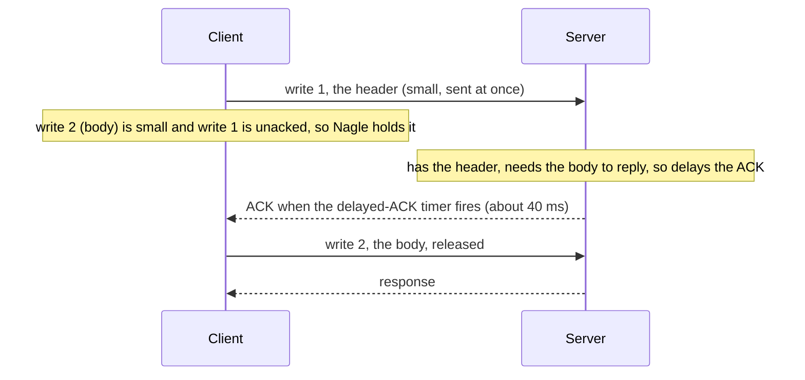
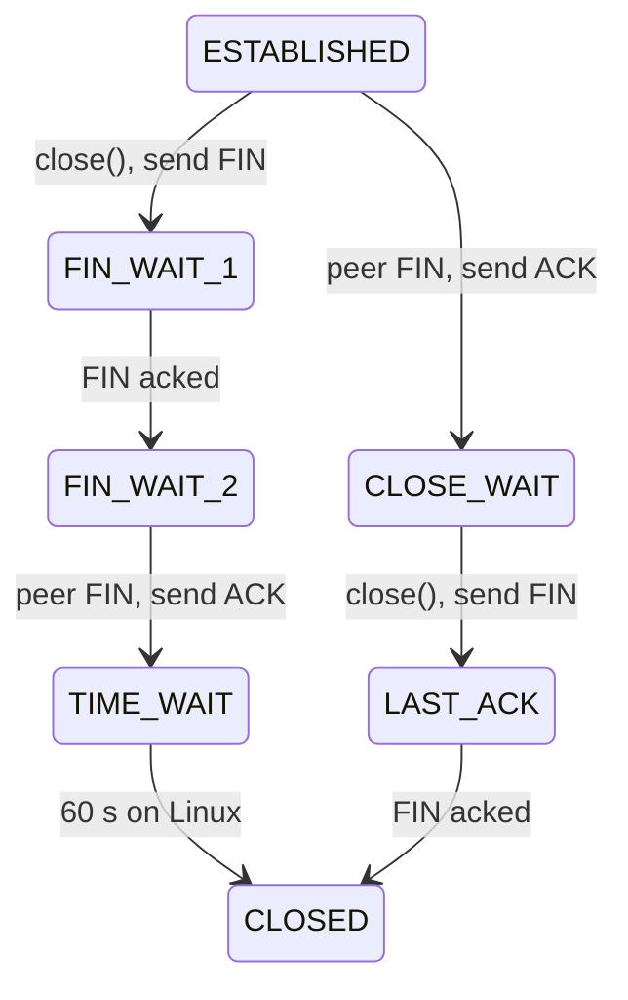

Three tickets land in the same week. A reverse proxy starts failing with `connect: cannot assign requested address` once traffic passes about 470 new connections per second to one backend. A tiny RPC that should take 1 ms takes almost exactly 41 ms, every time. And a health check against a host in another VPC hangs for just over two minutes before failing, while the same check against a stopped service fails instantly.

None of these is a bug in your code in the usual sense. Each is TCP doing precisely what its state machine says: TIME_WAIT holding ports for 60 seconds, Nagle's algorithm waiting for an ACK that the receiver is deliberately delaying, and a SYN being retransmitted with exponential backoff into a firewall that drops it silently. [UDP versus TCP](/learn/networking/fundamentals/udp-vs-tcp) listed TCP's mechanisms as items on a bill. This lesson opens each one up, shows it in `tcpdump` and `ss`, and names the incident it causes.

## A connection is two byte counters

TCP numbers bytes, not packets. Each direction of a connection has its own 32-bit sequence space, starting at a random **initial sequence number** (ISN). A segment's sequence number is the number of its first payload byte. An **acknowledgement number** means "I have every byte before this one; send me this one next". Both sides track two pointers per direction: `SND.UNA` (oldest unacknowledged byte) and `SND.NXT` (next byte to send), with `RCV.NXT` on the receiving side.

The ISN is random (Linux hashes the 4-tuple with a secret and a clock, per RFC 6528) for two reasons. It stops an attacker who cannot see your traffic from guessing sequence numbers and injecting data, and it makes it unlikely that a delayed segment from an old connection on the same 4-tuple lands inside the new connection's window.

Thirty-two bits is 4 GiB of sequence space, which wraps in about 3.4 seconds at 10 Gbit/s. The **timestamps** option guards against that (PAWS): a segment carrying an older timestamp than the last one seen is discarded even if its sequence number looks valid.

## The handshake and what it negotiates

```viz
{"type": "network", "scenario": "tcp-handshake", "title": "SYN, SYN-ACK, ACK: agreeing on two ISNs", "caption": "Each side picks a random ISN and the other acknowledges ISN+1, because SYN consumes one sequence number. Data can ride on the third packet."}
```

The handshake exists to exchange ISNs, and it is also the only moment TCP can negotiate options. Everything a connection will be able to do is decided in the first two packets:

```text
10:41:07.100 IP 10.0.0.5.44120 > 203.0.113.9.443: Flags [S], seq 1187562001, win 64240,
             options [mss 1460,sackOK,TS val 3001 ecr 0,nop,wscale 7], length 0
10:41:07.180 IP 203.0.113.9.443 > 10.0.0.5.44120: Flags [S.], seq 2810004112, ack 1187562002, win 65160,
             options [mss 1460,sackOK,TS val 9112 ecr 3001,nop,wscale 7], length 0
10:41:07.180 IP 10.0.0.5.44120 > 203.0.113.9.443: Flags [.], ack 1, win 502, length 0
```

| Option | What it negotiates | If it is missing |
|---|---|---|
| `mss 1460` | Largest segment payload each side will accept: MTU 1,500 minus 20 IP and 20 TCP bytes | Defaults to 536 bytes; a middlebox rewriting it down ("MSS clamping") is how VPNs avoid fragmentation |
| `sackOK` | Selective acknowledgement: receivers can report the exact ranges they hold | After a loss the sender can only learn about one hole per RTT |
| `TS val/ecr` | Timestamps: one RTT sample per ACK, and PAWS | RTT sampling is coarse; high-speed connections risk accepting wrapped segments. Costs 12 bytes per segment, which is why `ss` shows `mss:1448` rather than 1460 |
| `wscale 7` | Window scale: the 16-bit window field is multiplied by 2^7 = 128 | The receive window is capped at 65,535 bytes for the life of the connection |

The third line shows `ack 1` and `win 502`. `tcpdump` prints sequence numbers relative to the ISN after the handshake (use `-S` for absolute), and the window is the raw field; multiply by 128 to get the 64,256 bytes actually advertised.

### Listen queues and the one-second connect

A listening socket has two queues. The **SYN queue** holds half-open connections (SYN received, SYN-ACK sent). The **accept queue** holds completed connections waiting for your process to call `accept()`. Its length is the `backlog` you passed to `listen()`, capped by `net.core.somaxconn`.

```bash
$ ss -lnt 'sport = :8080'
State   Recv-Q  Send-Q  Local Address:Port  Peer Address:Port
LISTEN  129     128     0.0.0.0:8080        0.0.0.0:*
$ nstat -az | grep -i listen
TcpExtListenOverflows           48213              0.0
TcpExtListenDrops               48213              0.0
```

For a `LISTEN` socket, `Recv-Q` is the current accept-queue length and `Send-Q` is its limit. `129` against `128` means the queue is full: your process is not calling `accept()` fast enough, usually because its event loop or thread pool is saturated. The kernel drops the handshake, the client retransmits its SYN after the initial timeout of **one second**, and your latency histogram grows spikes at 1,000 ms and 3,000 ms. Connection latency clustered at 1 s and 3 s means: check `ListenOverflows` first. (SYN floods target the other queue; **SYN cookies**, on by default, let the server encode the handshake state in its ISN and keep none.)

### Refused versus silent

A SYN to a port with nothing listening gets an immediate `RST`: `ECONNREFUSED` in one RTT. A SYN into a firewall that drops packets gets nothing, and Linux retransmits it `tcp_syn_retries` times (default 6) with the timeout doubling: 1, 2, 4, 8, 16, 32 seconds, then a final 64-second wait. That is 127 seconds before `ETIMEDOUT`, the "just over two minutes" from the opening. Every client needs its own connect timeout rather than the kernel's.

## Data, cumulative ACKs and delayed ACKs

```viz
{"type": "network", "scenario": "tcp-data-transfer", "packets": 4, "title": "Pipelined segments and one cumulative ACK", "caption": "The sender does not wait per segment; it may have up to min(cwnd, rwnd) bytes unacknowledged. ACK N means every byte below N arrived in order."}
```

A download in `tcpdump`, relative numbering, server to client:

```text
IP 203.0.113.9.443 > 10.0.0.5.44120: Flags [.],  seq 1:1449,    ack 518, win 509, length 1448
IP 203.0.113.9.443 > 10.0.0.5.44120: Flags [.],  seq 1449:2897, ack 518, win 509, length 1448
IP 203.0.113.9.443 > 10.0.0.5.44120: Flags [P.], seq 2897:4345, ack 518, win 509, length 1448
IP 10.0.0.5.44120 > 203.0.113.9.443: Flags [.],  ack 2897, win 501, length 0
IP 10.0.0.5.44120 > 203.0.113.9.443: Flags [.],  ack 4345, win 490, length 0
```

`seq 1:1449` is the byte range `[1, 1449)`. Each server segment also carries `ack 518`: the client's 517-byte TLS record, already acknowledged, piggybacked on data rather than sent as a separate packet. The client acknowledges every second segment, not every segment. That is the **delayed ACK**: the receiver ACKs at least every second full-sized segment, otherwise it waits for a timer (40 ms minimum on Linux, shown as `ato:40` in `ss`; up to 200 ms on Windows) hoping to piggyback the ACK on response data. Delayed ACKs halve ACK traffic on bulk transfers, and they cause the 41 ms stall from the opening. The shrinking `win` (509, 501, 490) is the receive buffer filling because the application has not read yet: flow control, covered below.

## Retransmission: timers and duplicate ACKs

TCP discovers loss in two ways: a timer that expires, or a pattern of ACKs that implies a hole. The timer is the fallback and it is expensive.

### Computing the retransmission timeout

The **RTO** must be longer than the RTT (or every segment is retransmitted spuriously) but not much longer (or every loss stalls the connection). RFC 6298 tracks a smoothed RTT and its variation:

$$\text{RTTVAR} \leftarrow \tfrac{3}{4}\,\text{RTTVAR} + \tfrac{1}{4}\,|\text{SRTT} - R|$$
$$\text{SRTT} \leftarrow \tfrac{7}{8}\,\text{SRTT} + \tfrac{1}{8}\,R$$
$$\text{RTO} = \text{SRTT} + 4\cdot\text{RTTVAR}$$

The first sample initialises `SRTT = R` and `RTTVAR = R/2`. Work it for samples of 100, 100, 400 ms:

| Sample | RTTVAR | SRTT | RTO |
|---|---|---|---|
| 100 | 50 | 100 | 300 |
| 100 | 0.75·50 + 0.25·0 = 37.5 | 100 | 250 |
| 400 | 0.75·37.5 + 0.25·300 = 103.1 | 0.875·100 + 0.125·400 = 137.5 | 550 |

One slow sample more than doubles the RTO, because the variance term reacts four times faster than the mean. That is deliberate: a path whose RTT has become erratic should be given more slack before TCP declares a packet lost.

Three details that matter in production:

- **Minimum RTO.** The RFC says 1 second; Linux uses 200 ms and applies the floor to the variance term, so on a LAN `ss` shows `rto:201` to `rto:204`. A lost segment that waits for the timer costs 200 ms, hundreds of times a datacentre RTT.
- **Karn's rule.** An ACK for a retransmitted segment is ambiguous (did it ack the original or the copy?), so it produces no RTT sample. Timestamps remove the ambiguity.
- **Exponential backoff.** Each consecutive timeout doubles the RTO. Linux gives up after `tcp_retries2` (default 15) retransmissions, about 924.6 seconds by the kernel documentation. A peer that vanishes without a RST (power loss, a partition) leaves your writes blocked for around 15 minutes unless you set `TCP_USER_TIMEOUT` or an application-level timeout. TCP keepalive will not save you either: its default first probe is after two hours of idleness.

```exercise
id: rto-estimator
title: Compute the retransmission timeout
prompt: |
  Implement the RFC 6298 estimator. `samples` is a non-empty list of RTT
  measurements in whole milliseconds. Return the RTO after each sample.

  - First sample R: `SRTT = R`, `RTTVAR = R / 2`.
  - Each later sample R: first `RTTVAR = 3/4 * RTTVAR + 1/4 * |SRTT - R|`,
    then `SRTT = 7/8 * SRTT + 1/8 * R` (update RTTVAR using the old SRTT).
  - `RTO = SRTT + 4 * RTTVAR`, clamped to the range [200, 120000], then
    rounded down to a whole number of milliseconds.
languages: [python, javascript]
entry: rto_estimates
starter:
  python: |
    def rto_estimates(samples):
        out = []
        # keep SRTT and RTTVAR as floats; round only the reported RTO
        return out
  javascript: |
    function rto_estimates(samples) {
      const out = [];
      // keep SRTT and RTTVAR as floats; round only the reported RTO
      return out;
    }
tests:
  - args: [[100]]
    expected: [300]
    label: first sample initialises the estimator
  - args: [[100, 100, 400]]
    expected: [300, 250, 550]
    label: the worked example
  - args: [[100, 100, 100, 100]]
    expected: [300, 250, 212, 200]
    label: variance decays until the floor applies
  - args: [[2, 2, 2]]
    expected: [200, 200, 200]
    label: LAN RTTs hit the minimum
  - args: [[80, 120, 90, 300, 85]]
    expected: [240, 245, 210, 420, 367]
    hidden: true
  - args: [[50000, 90000]]
    expected: [120000, 120000]
    label: maximum clamp
    hidden: true
hints:
  - "Update RTTVAR before SRTT: the variance uses the difference from the previous smoothed value."
  - "Only floor the value you append; flooring SRTT or RTTVAR would change later results."
```

### Fast retransmit and SACK

Waiting 200 ms or more for a timer is a disaster on a 20 ms path. Most losses are instead detected by the receiver's behaviour. When segment 2 of 4 is lost, segments 3 and 4 still arrive, and the receiver, being cumulative, can only keep saying "I still want the byte after segment 1". Three **duplicate ACKs** tell the sender that later segments are getting through and one is missing, so it retransmits immediately without waiting for the RTO.

```viz
{"type": "network", "scenario": "tcp-retransmit", "title": "Three duplicate ACKs trigger fast retransmit", "caption": "The receiver buffers segments 3 and 4 but keeps ACKing the hole. The retransmission fills it and the cumulative ACK jumps past everything buffered."}
```

With SACK, each duplicate ACK also carries the ranges the receiver does hold (`sack 1 {2897:5793}` in `tcpdump`), so the sender can repair several holes in one RTT. Modern Linux adds time-based loss detection (RACK) and **tail loss probes**: if the *last* segments of a response are lost, nothing follows them to generate duplicate ACKs, so the sender re-sends the final segment after about two RTTs instead of waiting for the RTO. Tail loss is the common case for request/response traffic, so this matters more for APIs than for bulk transfers.

## Flow control: the receive window

Every ACK carries a window: how many bytes past the acknowledged one the receiver has buffer space for. The sender must never have more than that outstanding. Combined with the congestion window from [Congestion control](/learn/networking/fundamentals/congestion-control), the rule is:

$$\text{bytes in flight} \le \min(\text{cwnd}, \text{rwnd})$$

and so a single connection's throughput is bounded by the window divided by the RTT. To keep a path busy, the window must be at least the **bandwidth-delay product**, the number of bytes the path holds in flight. [Latency, bandwidth and the math of a round trip](/learn/networking/networking-in-practice/latency-bandwidth-and-math) derives it; here is the part the handshake decides. The window field is 16 bits, so without window scaling no connection can exceed 65,535 bytes per RTT. On a 1 Gbit/s path with a 70 ms RTT the BDP is $10^9 \times 0.07 / 8 = 8.75$ MB, which needs a scale shift of 8 ($65{,}535 \times 2^8 \approx 16.8$ MB; a shift of 7 gives only 8.4 MB). The maximum shift is 14, a window of about 1 GiB.

```exercise
id: bdp-window-scale
title: Size the window for a path
prompt: |
  Given a path's bandwidth in Mbit/s and its RTT in milliseconds (both
  positive integers), return `[bdp_bytes, shift]`:

  - `bdp_bytes` is the bandwidth-delay product in bytes
    (1 Mbit/s for 1 ms is 125 bytes).
  - `shift` is the smallest window-scale shift s (0 to 14) such that
    `65535 * 2**s >= bdp_bytes`. If even 14 is not enough, return 14.
languages: [python, javascript]
entry: window_for_bdp
starter:
  python: |
    def window_for_bdp(bandwidth_mbps, rtt_ms):
        bdp = 0
        shift = 0
        return [bdp, shift]
  javascript: |
    function window_for_bdp(bandwidth_mbps, rtt_ms) {
      let bdp = 0;
      let shift = 0;
      return [bdp, shift];
    }
tests:
  - args: [1000, 70]
    expected: [8750000, 8]
    label: 1 Gbit/s across a continent
  - args: [10, 20]
    expected: [25000, 0]
    label: fits without scaling
  - args: [100, 100]
    expected: [1250000, 5]
  - args: [1, 525]
    expected: [65625, 1]
    label: just over 64 KiB
  - args: [1000, 1]
    expected: [125000, 1]
    hidden: true
  - args: [100000, 200]
    expected: [2500000000, 14]
    label: beyond the largest window
    hidden: true
hints:
  - "Mbit/s times ms is kilobits; 1,000,000 bits/s x 0.001 s / 8 bits per byte = 125 bytes."
  - "Loop the shift upward from 0 and stop at 14. In JavaScript use 2 ** s rather than 1 << s so large values stay exact."
```

Three production consequences:

- **The receiver's buffer is the window.** Linux autotunes the receive buffer between the bounds in `net.ipv4.tcp_rmem` (the default maximum on recent kernels is about 6 MB). If an application sets `SO_RCVBUF` explicitly, autotuning is switched off for that socket, and a "tuned" 256 KB buffer can cap a cross-region transfer far below what the default would have reached. Cross-region replication that is mysteriously slow with no loss is usually a window, not a link.
- **Zero window.** A receiver that stops reading (a stalled consumer, a full disk, a garbage collection pause) advertises `win 0`. The sender stops and sends periodic **zero-window probes** until the window reopens. In a capture, `win 0` from one side means that side's application is the bottleneck; the network is idle and innocent.
- **Send-Q and Recv-Q tell you who is slow.** On an established socket, `Recv-Q` in `ss` is bytes received but not yet read by your process, and `Send-Q` is bytes not yet acknowledged by the peer. Growing `Recv-Q` means your application is slow; growing `Send-Q` means the peer or the path is.

## Nagle and delayed ACK: the 40 ms stall

Nagle's algorithm (RFC 896) stops a sender from flooding the network with tiny segments: while any sent data is unacknowledged, small writes are buffered until either the ACK arrives or a full MSS accumulates. Delayed ACK, on the other side, holds the ACK for up to 40 ms hoping to piggyback it on a response. Each is sensible alone. Together, with a write-write-read pattern, they deadlock until a timer fires:



That is the 41 ms RPC from the opening: 1 ms of work plus one delayed-ACK timer. The fixes, in order of preference:

1. **Write once.** Build the whole message in a buffer, or use `writev`, so the request is one write. This also halves syscalls.
2. **Set `TCP_NODELAY`.** It disables Nagle on the socket. Go's `net` package sets it by default, as do most RPC libraries and HTTP clients; check yours rather than assume.

If a latency histogram has a mode at 40 ms (Linux peers) or 200 ms (Windows peers) that does not move with load, suspect this before anything else.

## Closing: FIN, RST and the states that leak

```viz
{"type": "network", "scenario": "tcp-teardown", "title": "Each direction closes independently", "caption": "FIN means no more data from this side. The side that sends the first FIN ends up in TIME_WAIT; the other side passes through CLOSE_WAIT, which lasts exactly as long as its application takes to call close()."}
```



A FIN closes one direction only. `shutdown(fd, SHUT_WR)` sends FIN while still reading, which is how a client says "that is the whole request" and then waits for the full response. An **RST** is different: it aborts both directions immediately and discards unsent data. The kernel sends one when a segment arrives for a connection it does not know, when an application closes a socket that still has unread received data, or when `SO_LINGER` is set to zero.

### TIME_WAIT and port exhaustion

The side that closes first sits in TIME_WAIT for twice the maximum segment lifetime, a fixed 60 seconds on Linux. It exists for two reasons: if the final ACK is lost, the peer retransmits its FIN and someone must still be there to ACK it; and it prevents a new connection on the same 4-tuple from accepting a delayed segment from the old one.

It costs a port. A client connecting to one `(destination IP, port)` from one source IP can use each ephemeral port once per 4-tuple. Linux's default range is 32768 to 60999, 28,232 ports. If the client closes first and each port is locked for 60 seconds:

$$\frac{28{,}232 \text{ ports}}{60 \text{ s}} \approx 470 \text{ new connections per second}$$

That is the proxy from the opening: it opened a fresh connection to its single backend per request, closed it, and hit the ceiling at around 470 per second with `EADDRNOTAVAIL`. The fixes, best first:

- **Reuse connections.** Keep-alive and pooling remove the problem entirely and also remove a handshake per request. See [Connection pooling and keep-alive](/learn/networking/networking-in-practice/connection-pooling-and-keep-alive).
- **Let the server close first** where the protocol allows, so TIME_WAIT lands on the side with a fixed port and many clients (a server's TIME_WAIT entries do not consume its listening port).
- **Widen the 4-tuple space:** more backend IPs, more source IPs, or a wider `ip_local_port_range`.
- `net.ipv4.tcp_tw_reuse=1` lets new *outgoing* connections reuse a TIME_WAIT port when TCP timestamps prove the new segments are newer. Its old sibling `tcp_tw_recycle` broke clients behind NAT and was removed from Linux in 4.12; any blog post recommending it is out of date.

Do not "fix" TIME_WAIT by sending RSTs (`SO_LINGER` 0) as a matter of course. You trade a port-count problem for silently discarded data and the old-segment risk the state exists to prevent.

### CLOSE_WAIT is always your bug

CLOSE_WAIT means the peer has sent FIN, the kernel has ACKed it, and your application has not yet called `close()`. There is no timer; it lasts until your code closes the socket. Thousands of CLOSE_WAIT sockets (`ss -tan state close-wait | wc -l`) mean a code path that stops reading when the peer disconnects and never releases the socket: a missing `finally`, a response body that is never closed, a connection pool that does not notice closed connections. It ends with `EMFILE` (too many open files).

### The idle-timeout race

A load balancer drops idle connections after its idle timeout (60 seconds by default on an AWS Application Load Balancer). Your backend's HTTP server also closes idle keep-alive connections after its own timeout (Node's default `keepAliveTimeout` is 5 seconds). If the backend's timeout is *shorter* than the balancer's, the backend sends FIN at the moment the balancer decides to reuse the connection for a new request; the request meets a closed socket and the balancer returns a 502. The rule: every hop's idle timeout must be longer than the timeout of the hop in front of it, so the client side of each connection is always the one that closes it.

## Reading a live connection with `ss -ti`

`ss -ti` prints the kernel's view of each connection, and it answers most "why is this connection slow" questions without a packet capture:

```bash
$ ss -tin dst 203.0.113.9
State  Recv-Q  Send-Q   Local Address:Port    Peer Address:Port
ESTAB  0       1286512  10.0.0.5:8443         203.0.113.9:51220
	 cubic wscale:7,7 rto:284 rtt:81.2/2.4 ato:40 mss:1448 pmtu:1500 rcvmss:536
	 advmss:1448 cwnd:42 ssthresh:30 bytes_sent:52431872 bytes_acked:51145360
	 segs_out:36244 segs_in:12031 data_segs_out:36240 send 6.0Mbps lastsnd:4
	 lastrcv:9120 lastack:4 pacing_rate 7.2Mbps delivery_rate 5.8Mbps busy:9120ms
	 retrans:0/61 rcv_space:14480 minrtt:79.9
```

| Field | Reading |
|---|---|
| `Send-Q 1286512` | 1.2 MB queued and unacknowledged: this server is trying to send faster than the path allows |
| `cubic` | Congestion control algorithm |
| `wscale:7,7` | Window scaling negotiated in both directions; a missing `wscale` on a long path explains a hard throughput ceiling |
| `rto:284 rtt:81.2/2.4` | Smoothed RTT 81.2 ms with 2.4 ms variation; RTO is roughly SRTT + 200 ms on Linux |
| `mss:1448` | 1,460 minus the 12-byte timestamp option |
| `cwnd:42 ssthresh:30` | 42 segments allowed in flight; `ssthresh` below cwnd means a loss has already happened and the connection is in congestion avoidance |
| `send 6.0Mbps` | cwnd × MSS / RTT: $42 \times 1448 \times 8 / 0.0812 \approx 6.0$ Mbit/s, the ceiling the congestion window allows |
| `retrans:0/61` | Nothing outstanding right now, 61 retransmissions over the connection's life: about 0.17% of 36,240 data segments |

That connection is limited by congestion, not by the receiver: every loss has cut the window, and even a loss rate of a fraction of a percent keeps it small on an 80 ms path, which is the subject of [Congestion control](/learn/networking/fundamentals/congestion-control). If instead `cwnd` were large and the peer were advertising a small window, the receiver would be the bottleneck. `ss` separates the two in one command.

## Senior signals

- You read a TCP problem as a state-machine question: which side is in which state, and which timer or queue is involved. Connection latency at exactly 1 s and 3 s is a full accept queue; 40 ms or 200 ms is Nagle plus delayed ACK; two minutes is SYNs into a silent firewall.
- You know TIME_WAIT is on the side that closes first, can derive the roughly 470 connections per second per destination limit, and fix it with connection reuse rather than `tcp_tw_recycle` or RST-on-close.
- You treat CLOSE_WAIT build-up as an application resource leak, not a kernel tuning problem.
- You set connect, request and idle timeouts explicitly, and you order idle timeouts so each hop's is longer than the one in front of it.
- You use `ss -ti` (cwnd, ssthresh, rtt, retrans, Send-Q/Recv-Q) to decide whether the sender, the receiver or the path is the bottleneck before you open a packet capture.
- You know `SO_RCVBUF` disables autotuning, and you check the window against the bandwidth-delay product before blaming the link for slow long-distance transfers.

## Check yourself

```quiz
- q: >-
    A reverse proxy opens a new TCP connection to its single backend for every request and closes it after the response. At about 470 requests per second it starts failing with EADDRNOTAVAIL. What is the most effective fix?
  options: ["Pool keep-alive connections to the backend", "Increase the backend's listen() accept backlog", "Raise net.core.somaxconn on the backend host", "Enable tcp_tw_recycle so TIME_WAIT ports recycle"]
  answer: 0
  explanation: >-
    The proxy closes first, so each connection leaves a port in TIME_WAIT for 60 seconds; 28,232 ephemeral ports divided by 60 s is about 470 per second to one destination. Keep-alive and pooling mean ports are no longer consumed and locked per request, and they remove a handshake per request too. somaxconn and backlog are server-side accept limits and unrelated. tcp_tw_recycle broke NAT'd clients and no longer exists in Linux.
- q: >-
    A client sends a small request header with one write() and the body with a second write(), then waits for the reply. Round trips are 0.5 ms, yet every call takes about 40 ms. What is happening?
  options: ["Slow start limits the connection to one segment per RTT", "Nagle holds write two while the ACK is delayed", "The server's event loop is blocked for 40 ms per call", "The first segment is lost and the RTO fires each time"]
  answer: 1
  explanation: >-
    Write-write-read with small writes is the classic Nagle and delayed-ACK interaction: Nagle holds the second small write until the first is ACKed, while the server delays its ACK hoping to piggyback it on data, and the delayed-ACK timer (40 ms minimum on Linux) breaks the deadlock. Coalescing the writes into one or setting TCP_NODELAY removes it. A lost segment would cost at least the 200 ms minimum RTO, and slow start does not add a fixed 40 ms per request.
- q: >-
    Connecting to port 5432 on host A fails instantly with connection refused. Connecting to port 5432 on host B hangs for about two minutes and then times out. What is the likely difference?
  options: ["Host B advertises a much larger receive window than A", "Host A has SYN cookies enabled and B does not", "A has no listener and sends RST; B's SYNs are silently dropped", "Host B is overloaded and cannot accept new connections"]
  answer: 2
  explanation: >-
    A port with no listener makes the kernel reply with RST, which produces ECONNREFUSED in one RTT. A firewall or security group that drops SYNs silently produces SYN retransmissions at 1, 2, 4, 8, 16 and 32 seconds and a final wait until tcp_syn_retries is exhausted, about 127 seconds on Linux defaults. An overloaded host would still answer or overflow its queue, not fail at a fixed two minutes. That is why clients need an explicit connect timeout.
- q: >-
    Your service has 9,000 sockets in CLOSE_WAIT and is approaching its file-descriptor limit. Which statement is true?
  options: ["The kernel will reap CLOSE_WAIT sockets after 60 s", "Your code received FIN but never called close()", "Nagle's algorithm is holding the sockets' final FIN", "Peers never sent their final ACK; shorten TIME_WAIT"]
  answer: 1
  explanation: >-
    CLOSE_WAIT means the remote side has closed and the local application has not called close(). There is no kernel timer for it. TIME_WAIT is the state on the side that closes first and has nothing to do with this. The fix is in the code path that should close the socket, typically an unclosed response body or a missing cleanup path.
- q: >-
    A bulk transfer between regions runs at 50 Mbit/s on a 10 Gbit/s link with an 80 ms RTT, and ss -ti shows no retransmissions and a large cwnd. The receiving application calls setsockopt(SO_RCVBUF, 512 KB) at startup. What limits throughput?
  options: ["TIME_WAIT sockets piling up on the sending host", "The MSS is too small for a 10 Gbit/s link to fill", "The 512 KB receive window, with autotuning disabled", "Congestion control, since the cwnd has grown large"]
  answer: 2
  explanation: >-
    Throughput is bounded by min(cwnd, rwnd) per RTT. With no loss and a large cwnd, the receiver's window is the binding limit: 524,288 bytes x 8 / 0.08 s is about 52 Mbit/s, far below the path's bandwidth-delay product of about 100 MB. Setting SO_RCVBUF turned off autotuning, which would have grown the window toward the tcp_rmem maximum. Removing the setsockopt call usually fixes it.
- q: >-
    Behind a load balancer with a 60-second idle timeout, a Node service with the default 5-second keepAliveTimeout returns occasional 502s at low traffic. Why?
  options: ["Node's HTTP server cannot handle keep-alive at all", "Nagle's algorithm delays the balancer's requests", "Backend idle timeout is shorter than the balancer's", "The balancer's TIME_WAIT table fills at low traffic"]
  answer: 2
  explanation: >-
    Two hops with idle timeouts race to close the same connection. The backend closes idle connections after 5 seconds, so the balancer sometimes sends a new request on a connection the backend has just closed, and that request fails. Making each hop's idle timeout longer than the one in front of it ensures the client side of every connection closes first.
```
