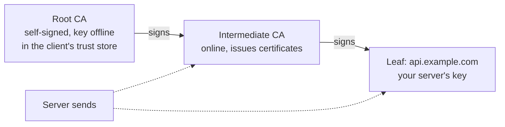
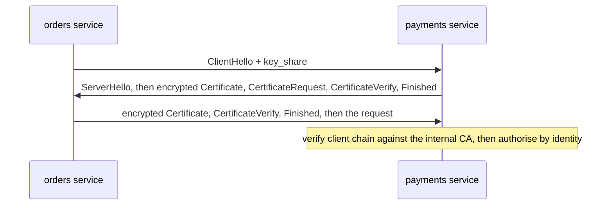

The certificate for `api.example.com` was renewed on Tuesday. On Saturday the old one expires, and at midnight every call from your Android app and every server-to-server client fails with a certificate error, while Chrome on your laptop loads the site perfectly. `curl` says `SSL certificate problem: unable to get local issuer certificate`. The new certificate is valid. The renewal script deployed the leaf certificate and forgot the intermediate, and Chrome was quietly fetching the missing link for itself. Nothing else was.

Almost no TLS incident is about cryptography. They are about chains, names, clocks, and how many round trips a handshake costs. This lesson covers the handshake as it runs on the wire, the certificate machinery that decides whether a client trusts it, and the operational failure modes of both.

## What TLS promises, and with which tool

TLS gives a byte stream three properties: **confidentiality** (nobody on the path can read it), **integrity** (nobody can modify it undetected), and **authentication** of the server (and optionally the client). Each property comes from a different primitive:

| Property | Mechanism in TLS 1.3 |
|---|---|
| Agree a secret with a stranger over a public network | Ephemeral Diffie-Hellman (ECDHE), usually X25519: each side sends a public key share, both derive the same secret |
| Know the stranger is `api.example.com` | A certificate binding that name to a public key, signed by a CA the client trusts, plus a signature over the handshake made with the matching private key |
| Keep records secret and unmodified | An AEAD cipher: AES-128-GCM, AES-256-GCM or ChaCha20-Poly1305 |

Because the Diffie-Hellman keys are ephemeral, stealing the server's certificate private key later does not decrypt recorded traffic: **forward secrecy**. TLS 1.2 allowed RSA key transport, where the client encrypted the secret to the server's certificate key, so a stolen key decrypted every recorded session. TLS 1.3 removed that option, along with CBC-mode ciphers, RC4, SHA-1, compression and renegotiation. The whole cipher-suite menu is now five entries, three of them in common use.

## The TLS 1.3 handshake in one round trip

```viz
{"type": "network", "scenario": "https-tls-handshake", "title": "TLS 1.3: one flight each way before application data", "caption": "The client guesses the key-exchange group and sends its key share in the first message, so the server can derive keys and encrypt everything after ServerHello immediately."}
```

What each message carries:

1. **ClientHello** (plaintext): `supported_versions` (TLS 1.3 is 0x0304; the legacy version field still says TLS 1.2 because middleboxes broke when it changed), cipher suites, `key_share` with an X25519 public key, `signature_algorithms`, `server_name` (SNI, so a server hosting many names picks the right certificate), ALPN (`h2`, `http/1.1`), and a pre-shared key if resuming.
2. **ServerHello** (plaintext): chosen suite and the server's key share. Both sides now compute the shared secret; everything that follows is encrypted.
3. **EncryptedExtensions**: the chosen ALPN protocol and other parameters.
4. **Certificate**: the server's certificate chain.
5. **CertificateVerify**: a signature over the entire handshake transcript with the certificate's private key. This is the proof that the server holds the key, not just a copy of a public certificate.
6. **Finished** (both directions): a MAC over the transcript, which detects any tampering with the plaintext hellos, such as a downgrade attack that strips strong cipher suites.

TLS 1.2 needed two round trips: the client sent its key share only after the server's first reply had fixed the parameters, and the Finished messages confirming the keys needed a second exchange. TLS 1.3 has the client guess the group and send its share up front. If the guess is wrong (the server wants P-256 and the client sent only X25519), the server replies `HelloRetryRequest` and the handshake costs an extra round trip; this is rare because nearly everything supports X25519.

Here is what `curl -v` prints for that exchange:

```text
* Connected to api.example.com (203.0.113.9) port 443
* ALPN: curl offers h2,http/1.1
* TLSv1.3 (OUT), TLS handshake, Client hello (1):
* TLSv1.3 (IN), TLS handshake, Server hello (2):
* TLSv1.3 (IN), TLS handshake, Encrypted Extensions (8):
* TLSv1.3 (IN), TLS handshake, Certificate (11):
* TLSv1.3 (IN), TLS handshake, CERT verify (15):
* TLSv1.3 (IN), TLS handshake, Finished (20):
* TLSv1.3 (OUT), TLS change cipher, Change cipher spec (1):
* TLSv1.3 (OUT), TLS handshake, Finished (20):
* SSL connection using TLSv1.3 / TLS_AES_128_GCM_SHA256 / X25519 / id-ecPublicKey
* ALPN: server accepted h2
* Server certificate:
*  subject: CN=api.example.com
*  start date: Aug  3 00:00:00 2026 GMT
*  expire date: Nov  1 23:59:59 2026 GMT
*  subjectAltName: host "api.example.com" matched cert's "api.example.com"
*  issuer: C=US; O=Example Trust; CN=Example Issuing CA
*  SSL certificate verify ok.
```

The `Change cipher spec` line in a TLS 1.3 handshake is a fake: a meaningless message sent only so that middleboxes expecting TLS 1.2 do not drop the connection. It is a good example of how deployed middleboxes constrain protocol design.

### What the handshake costs

Count round trips before the first response byte arrives, at a 100 ms RTT:

| Connection setup | RTTs until response | At 100 ms |
|---|---|---|
| TCP + TLS 1.2 full handshake | 4 | 400 ms |
| TCP + TLS 1.2 resumed, or TCP + TLS 1.3 full | 3 | 300 ms |
| TCP + TLS 1.3 with 0-RTT early data | 2 | 200 ms |
| QUIC (transport and TLS 1.3 handshake combined) | 2 | 200 ms |
| QUIC with 0-RTT | 1 | 100 ms |
| Reused, already-established connection | 1 | 100 ms |

The last row is the cheapest in every protocol, which is why connection reuse matters more than any handshake optimisation.

### Resumption and 0-RTT

After a full handshake the server can issue a **session ticket**: the session's resumption secret, encrypted with a key only the server fleet knows. On reconnect, the client presents the ticket as a pre-shared key, and the server skips the certificate and the expensive signature. For resumption to work across a fleet, every server behind the load balancer must share the ticket-encryption keys, and those keys must be rotated frequently, because anyone who obtains one can decrypt the resumed sessions it protected.

With a ticket, a TLS 1.3 client may also send **0-RTT early data**: the first request, encrypted under the resumption secret, in the same flight as the ClientHello. It saves a whole round trip and has a price: early data can be **replayed**. An attacker who records the ClientHello and early data can send them again, and the server has no handshake state yet to tell the copy from the original. So:

- Only allow 0-RTT for requests that are safe to execute twice: idempotent reads like `GET /catalog`, never `POST /payments`.
- A CDN or proxy that accepts early data should forward it with an `Early-Data: 1` header; an origin that cannot risk a replay answers `425 Too Early`, and the client retries after the full handshake completes (RFC 8470).
- Early data also lacks forward secrecy with respect to the ticket key.

Many deployments therefore enable 0-RTT only for `GET` and `HEAD`, or not at all. The idempotency reasoning is the same as for retries in [Timeouts, retries and backoff](/learn/networking/networking-in-practice/timeouts-retries-and-backoff).

## What is in a certificate

A certificate is a signed statement: "the holder of this public key may use these names, between these dates, signed by this issuer". `openssl x509 -noout -text` prints its fields; these are the ones you will debug:

| Field | What it says | Why it bites |
|---|---|---|
| Subject / Issuer | Distinguished names of the holder and the signing CA | Chain building matches each certificate's Issuer to the next one's Subject |
| Validity (`notBefore`, `notAfter`) | The window in which it may be used | Expiry outages; clients with wrong clocks see "not yet valid" |
| Subject Alternative Name (SAN) | The DNS names (and IPs, URIs) it is valid for | The only name field modern clients check; the Common Name is ignored |
| Basic Constraints | `CA:TRUE` or `CA:FALSE`, optional path length | A leaf must not be able to sign other certificates |
| Key Usage / Extended Key Usage | `serverAuth`, `clientAuth` | A server certificate without `clientAuth` cannot be reused as an mTLS client certificate |
| Authority Information Access | URLs for the issuer's certificate and for OCSP | Lets some clients fetch a missing intermediate |
| Signed Certificate Timestamps | Proof the certificate was logged in Certificate Transparency | Browsers reject publicly trusted certificates without them |

A wildcard SAN `*.example.com` matches exactly one label: `api.example.com`, but not `example.com` and not `v2.api.example.com`. Teams discover this when they add a second level of subdomains.

## The chain of trust



Clients trust a few hundred **root** certificates that ship with the operating system, browser or language runtime. Roots sign **intermediates**, and intermediates sign your **leaf**. The root keys live offline in hardware security modules, and if an intermediate is compromised it can be revoked without replacing roots on billions of devices.

The server sends its leaf plus every intermediate, but not the root. The client then:

1. **Builds a path** from the leaf to a root in its own trust store, matching Issuer to Subject.
2. **Verifies each signature** up the path, and checks that every certificate above the leaf has `CA:TRUE`.
3. **Checks validity dates** on each certificate against its own clock.
4. **Checks the name**: the hostname it connected to must match a SAN on the leaf.
5. Checks key usage, Certificate Transparency and, sometimes, revocation.

Trust stores differ. Browsers ship their own root programmes, the operating system has one, Java has `cacerts`, Node bundles Mozilla's list, and Python uses the OS store or the `certifi` package. A container image built two years ago carries a two-year-old `ca-certificates` package. That is why the same server can be trusted by one client and rejected by another.

### The missing intermediate

Back to the opening. The server was sending only the leaf, and `openssl s_client` shows it immediately:

```text
$ openssl s_client -connect api.example.com:443 -servername api.example.com </dev/null
CONNECTED(00000003)
depth=0 CN = api.example.com
verify error:num=20:unable to get local issuer certificate
verify return:1
depth=0 CN = api.example.com
verify error:num=21:unable to verify the first certificate
verify return:1
---
Certificate chain
 0 s:CN = api.example.com
   i:C = US, O = Example Trust, CN = Example Issuing CA
---
...
Verify return code: 21 (unable to verify the first certificate)
```

One entry under `Certificate chain` where there should be two. Chrome recovered by fetching the intermediate from the certificate's AIA URL, and Firefox ships a preloaded set of known intermediates, so the website "worked". curl, Go (`x509: certificate signed by unknown authority`), Java (`PKIX path building failed`), Node (`UNABLE_TO_VERIFY_LEAF_SIGNATURE`), Python (`CERTIFICATE_VERIFY_FAILED`) and mobile apps do not. Always test a certificate deployment with `openssl s_client` or curl, never with a browser.

A healthy chain shows `depth=1` and `depth=0` both returning `verify return:1`, two certificates in the chain, and `Verify return code: 0 (ok)`. Add `-showcerts` to print every certificate the server sent.

```exercise
id: validate-cert-chain
title: Validate a certificate chain
prompt: |
  Implement the checks a TLS client runs on a server's chain (assume every
  signature has already been verified). `chain` is a list of certificates,
  leaf first; each is a dict (Python) or object (JavaScript) with
  `subject`, `issuer`, `sans` (list of
  names), `not_before`, `not_after` (integers, inclusive) and `is_ca`.
  `trusted_roots` is a list of root subject names in the client's store.

  Return the first failure, checking in this order:

  1. For each adjacent pair, `chain[i].issuer` must equal
     `chain[i+1].subject`, else `"broken-chain"`; and `chain[i+1].is_ca`
     must be true, else `"not-a-ca"`.
  2. The last certificate must be anchored: its `subject` or its `issuer`
     is in `trusted_roots`, else `"untrusted"`.
  3. For each certificate from the leaf up: `now < not_before` gives
     `"not-yet-valid"`, `now > not_after` gives `"expired"`.
  4. `hostname` must match one of the leaf's `sans`, case-insensitively:
     an exact match, or a wildcard `*.rest` that matches exactly one extra
     leading label. Else `"name-mismatch"`.

  If everything passes, return `"ok"`.
languages: [python, javascript]
entry: validate_chain
starter:
  python: |
    def validate_chain(hostname, chain, trusted_roots, now):
        return "ok"
  javascript: |
    function validate_chain(hostname, chain, trusted_roots, now) {
      return "ok";
    }
tests:
  - args: ["api.example.com", [{"subject": "api.example.com", "issuer": "Example Issuing CA", "sans": ["api.example.com", "www.example.com"], "not_before": 100, "not_after": 190, "is_ca": false}, {"subject": "Example Issuing CA", "issuer": "Example Root CA", "sans": [], "not_before": 0, "not_after": 1000, "is_ca": true}], ["Example Root CA"], 150]
    expected: "ok"
    label: leaf plus intermediate
  - args: ["api.example.com", [{"subject": "api.example.com", "issuer": "Example Issuing CA", "sans": ["api.example.com", "www.example.com"], "not_before": 100, "not_after": 190, "is_ca": false}], ["Example Root CA"], 150]
    expected: "untrusted"
    label: missing intermediate
  - args: ["api.example.com", [{"subject": "api.example.com", "issuer": "Example Issuing CA", "sans": ["api.example.com", "www.example.com"], "not_before": 100, "not_after": 190, "is_ca": false}, {"subject": "Example Issuing CA", "issuer": "Example Root CA", "sans": [], "not_before": 0, "not_after": 1000, "is_ca": true}], ["Example Root CA"], 200]
    expected: "expired"
  - args: ["admin.example.com", [{"subject": "api.example.com", "issuer": "Example Issuing CA", "sans": ["api.example.com", "www.example.com"], "not_before": 100, "not_after": 190, "is_ca": false}, {"subject": "Example Issuing CA", "issuer": "Example Root CA", "sans": [], "not_before": 0, "not_after": 1000, "is_ca": true}], ["Example Root CA"], 150]
    expected: "name-mismatch"
  - args: ["API.Example.com", [{"subject": "*.example.com", "issuer": "Example Issuing CA", "sans": ["*.example.com"], "not_before": 100, "not_after": 190, "is_ca": false}, {"subject": "Example Issuing CA", "issuer": "Example Root CA", "sans": [], "not_before": 0, "not_after": 1000, "is_ca": true}], ["Example Root CA"], 150]
    expected: "ok"
    label: wildcard, mixed case
    hidden: true
  - args: ["a.b.example.com", [{"subject": "*.example.com", "issuer": "Example Issuing CA", "sans": ["*.example.com"], "not_before": 100, "not_after": 190, "is_ca": false}, {"subject": "Example Issuing CA", "issuer": "Example Root CA", "sans": [], "not_before": 0, "not_after": 1000, "is_ca": true}], ["Example Root CA"], 150]
    expected: "name-mismatch"
    label: wildcard covers one label only
    hidden: true
  - args: ["api.example.com", [{"subject": "api.example.com", "issuer": "Example Issuing CA", "sans": ["api.example.com", "www.example.com"], "not_before": 100, "not_after": 190, "is_ca": false}, {"subject": "Example Issuing CA", "issuer": "Example Root CA", "sans": [], "not_before": 0, "not_after": 1000, "is_ca": false}], ["Example Root CA"], 150]
    expected: "not-a-ca"
    hidden: true
  - args: ["www.example.com", [{"subject": "api.example.com", "issuer": "Example Issuing CA", "sans": ["api.example.com", "www.example.com"], "not_before": 100, "not_after": 190, "is_ca": false}, {"subject": "Example Issuing CA", "issuer": "Example Root CA", "sans": [], "not_before": 0, "not_after": 1000, "is_ca": true}, {"subject": "Example Root CA", "issuer": "Example Root CA", "sans": [], "not_before": 0, "not_after": 5000, "is_ca": true}], ["Example Root CA"], 190]
    expected: "ok"
    label: root included, last valid instant
    hidden: true
hints:
  - "Run the checks strictly in the stated order and return on the first failure."
  - "For a wildcard, drop everything up to and including the host's first dot and compare the rest with the pattern after '*.'; the dropped label must be non-empty."
```

## The failures that page you

**Expiry.** Still the most common TLS outage, and entirely preventable. Public certificate lifetimes are capped by CA/Browser Forum rules: 398 days from 2020, 200 days from March 2026, stepping down to 47 days by 2029. Let's Encrypt has issued 90-day certificates for years. The only sustainable answer is automation (ACME) plus monitoring of the certificate *actually served* on every endpoint, not the file on disk:

```bash
echo | openssl s_client -connect api.example.com:443 -servername api.example.com 2>/dev/null \
  | openssl x509 -noout -enddate -subject
notAfter=Nov  1 23:59:59 2026 GMT
subject=CN = api.example.com
```

**Missing intermediate.** Covered above. Serve the full chain file (`fullchain.pem`), not the leaf.

**Wrong or missing SNI.** A client that connects by IP address, or an old library that does not send SNI, gets the server's default certificate and a name mismatch. `openssl s_client` without `-servername` reproduces this, which also makes it an easy way to fool yourself while debugging.

**Clock skew.** A device whose clock is wrong sees valid certificates as "not yet valid" or expired. Embedded devices and freshly booted VMs without NTP are the usual victims.

**Root expiry and trust-store drift.** When an old root expires or a CA changes its chain, clients with outdated trust stores fail. The expiry of the DST Root CA X3 root in September 2021 broke a long tail of old devices and old OpenSSL builds that had not picked up the newer ISRG root. Your own fleet has a long tail too: old container images, pinned runtime versions.

**Revocation is weak.** OCSP checks add latency and a privacy leak, so browsers soft-fail them or rely on revocation lists pushed with browser updates. Stapling (the server attaches a recent OCSP response to the handshake) helps where used. In practice the industry's answer to key compromise is short lifetimes, which is why lifetimes keep shrinking.

## mTLS: authenticating the client too

In ordinary TLS only the server proves its identity. **Mutual TLS** adds a `CertificateRequest` to the server's encrypted flight; the client answers with its own `Certificate` and `CertificateVerify`, all in the same round trip, so mTLS costs no extra RTT in TLS 1.3. The server validates the client chain against a private CA rather than the public roots.



mTLS is the standard way to authenticate services to each other, and it is what a service mesh does on your behalf. The identity lives in the SAN; in SPIFFE-based meshes it is a URI such as `spiffe://prod.example/ns/payments/sa/api`, and authorisation policies say "the orders service may call `POST /charges`" instead of trusting source IPs, which are meaningless in a cluster where pods move. Sidecars obtain short-lived certificates (commonly 24 hours or less) from the mesh's CA and rotate them automatically, which removes the expiry problem by making it happen constantly and invisibly. [Service meshes and proxies](/learn/networking/networking-in-practice/service-meshes-and-proxies) covers the sidecar mechanics.

The costs are operational. You run a private CA and its rotation. Debugging needs client credentials (`openssl s_client -connect payments:443 -cert client.pem -key client.key`). And any proxy that terminates TLS ends the mutual authentication at the proxy: the backend sees the proxy, not the client, unless the proxy passes the verified client identity along in a header (Envoy uses `x-forwarded-client-cert`) that the backend trusts only from the proxy.

## Why HTTPS is fast now

Ten years ago "HTTPS is slow" was a real objection. Each reason has since been removed:

- **Round trips.** TLS 1.3 cut the full handshake from two RTTs to one, resumption and 0-RTT cut repeat visits further, and QUIC folds the transport handshake in too. Connection reuse and HTTP/2 multiplexing mean most requests pay no handshake at all.
- **Key exchange and signatures.** X25519 key agreement and ECDSA P-256 signatures cost tens of microseconds of CPU; an RSA-2048 signature costs on the order of a millisecond. Moving a fleet from RSA to ECDSA certificates measurably cuts handshake CPU on busy terminators.
- **Bulk encryption.** AES-GCM runs at several gigabytes per second per core using the CPU's AES instructions; ChaCha20-Poly1305 is fast in software on phones without them, which is why clients advertise it.
- **Kernel and NIC offload.** Kernel TLS lets the kernel encrypt records and keep `sendfile` zero-copy; some NICs encrypt in hardware. Netflix has published its work on in-kernel TLS in FreeBSD for the Open Connect servers that stream its video, which serve hundreds of gigabits per second of encrypted traffic per machine.
- **Size of the first flight.** Certificates are not free bytes. If the server's Certificate plus handshake messages exceed the initial congestion window (about 14.6 KB, from [Congestion control](/learn/networking/fundamentals/congestion-control)), the handshake needs an extra round trip. Short chains with ECDSA keys keep it well under. This matters again now that hybrid post-quantum key exchange (X25519 combined with ML-KEM) is being deployed by browsers and CDNs; it adds about a kilobyte to each hello.

What remains expensive is a cold connection to a distant server. That is a latency and geography problem, solved by terminating TLS at an edge close to the user, which is the subject of [CDNs and the edge](/learn/networking/application-protocols/cdns-and-edge).

## Senior signals

- You count TLS in round trips per connection setup (TLS 1.2: two, TLS 1.3: one, 0-RTT: zero) and know that connection reuse beats all of them.
- You allow 0-RTT only for idempotent requests, and you know about `Early-Data` and `425 Too Early`.
- You test certificate deployments with `openssl s_client -servername` and check the number of certificates in the chain, because browsers hide missing intermediates.
- You monitor days-to-expiry of the served certificate on every endpoint and automate renewal, and you know lifetimes are shrinking toward 47 days.
- You know trust stores differ per runtime and image, so "works in Chrome" and "works in my container" are separate claims.
- You describe mTLS as identity for services (SAN or SPIFFE ID), know where it terminates, and know what the proxy must forward for the backend to authorise.

## Check yourself

```quiz
- q: >-
    After a certificate renewal, the website loads in Chrome but a Go service calling the same API fails with "x509: certificate signed by unknown authority". openssl s_client shows one certificate in the chain. What is wrong?
  options: ["The server omits the intermediate certificate", "The renewed certificate expired before it was deployed", "The Go service's clock is wrong, so the cert looks invalid", "The Go service needs a newer TLS version to connect"]
  answer: 0
  explanation: >-
    A single certificate in the chain means the intermediate is missing. Chrome uses the AIA URL to fetch it and Firefox preloads intermediates, which masks the problem. Go, Java, curl, Python and mobile clients require the server to send it, so they cannot build a path to a trusted root. An expired or not-yet-valid certificate would produce a date error, not "unknown authority". Serve the full chain.
- q: >-
    Why does a TLS 1.3 full handshake need one round trip where TLS 1.2 needed two?
  options: ["The client sends its key share in the ClientHello", "TLS 1.3 piggybacks on the TCP handshake packets", "TLS 1.3 skips certificate validation to save a round trip", "TLS 1.3 runs over UDP, so it has no TCP handshake"]
  answer: 0
  explanation: >-
    TLS 1.2 spent a round trip negotiating parameters before key exchange. TLS 1.3 has the client guess the group and send its ephemeral key share up front, so the server can derive keys and send its certificate, signature and Finished in its first reply; a wrong guess costs a HelloRetryRequest. Certificates are still validated, and TLS 1.3 still runs over TCP (QUIC is what merges it with the transport).
- q: >-
    A team wants to enable TLS 1.3 0-RTT on the API edge to save a round trip for returning clients. Which constraint must they add?
  options: ["Require client certificates on all 0-RTT connections", "Accept early data only for requests that are safe to replay", "Disable session tickets so resumed sessions stay fresh", "None; early data is protected like any other application data"]
  answer: 1
  explanation: >-
    Early data is sent before the server has any fresh handshake state, so an attacker can resend captured early data. It is encrypted, but a replay of a POST that charges a card is still a second charge, so only idempotent requests such as GETs qualify; the edge forwards it with Early-Data and the origin answers 425 Too Early when it cannot risk a replay. 0-RTT depends on session tickets, so disabling them would disable 0-RTT entirely.
- q: >-
    A wildcard certificate for *.example.com is deployed. Which hostname will fail validation?
  options: ["status.example.com", "v2.api.example.com", "WWW.EXAMPLE.COM", "payments.example.com"]
  answer: 1
  explanation: >-
    A wildcard matches exactly one label in the leftmost position. v2.api.example.com has two labels in front of example.com. Matching is case-insensitive, so the uppercase name is fine.
- q: >-
    In a service mesh with mTLS, the orders service calls the payments service through an L7 proxy that terminates TLS. What must be true for payments to authorise the call based on the caller's identity?
  options: ["Payments must check the connection's source IP address", "The proxy must downgrade the inner hop to plain TLS 1.2", "The proxy must forward the verified client identity", "Nothing; mTLS identity passes through any proxy intact"]
  answer: 2
  explanation: >-
    TLS authenticates the two ends of one TCP connection. A terminating proxy is the peer that payments sees, so the proxy must verify the client certificate and forward the verified identity (for example in an x-forwarded-client-cert header) that payments trusts only from the proxy, or pass TLS through untouched. Source IPs are not identities in a cluster.
```
