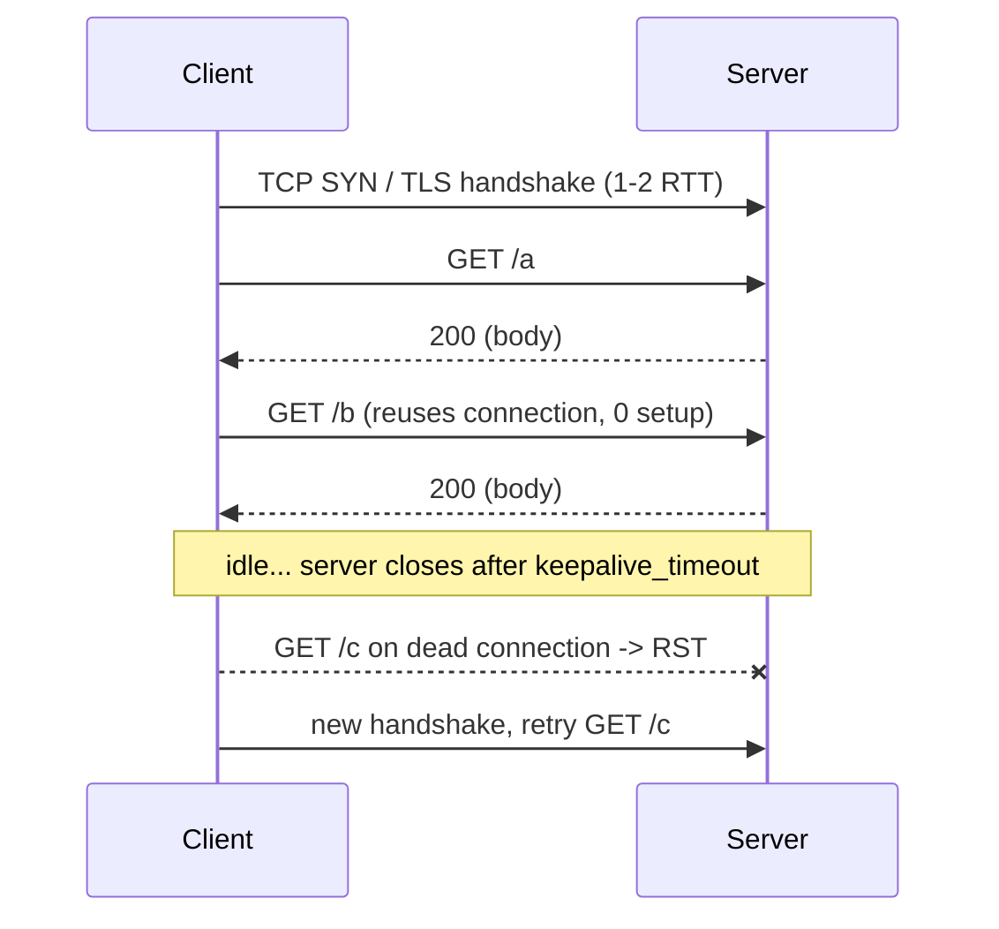

Your service is "slow", and the dashboard says the handler takes 4 ms. The browser waterfall says the request took 340 ms. Somewhere in the 336 ms gap are a DNS lookup, a TCP handshake, a TLS handshake, a queue behind five other requests on the same host, a header parse, and possibly a cache that should have answered the request without touching your handler at all. Every one of those is decided by HTTP/1.1 headers and connection rules that most engineers have never read.

HTTP/1.1 is a plain-text, request-response protocol over a reliable byte stream (TCP, usually wrapped in TLS). It has one request in flight per connection at a time. That single fact explains most of its performance behaviour, and the rest is explained by a dozen headers. This lesson reads the bytes.

## The bytes on the wire

`curl -v` prints the exact request it sends (lines prefixed `>`) and the exact response head it receives (`<`). This is the single most useful debugging tool you have for HTTP, and you should be able to read every line.

```bash
curl -v https://api.example.com/v1/users/42
```

```text
* Connected to api.example.com (203.0.113.10) port 443
* ALPN: server accepted http/1.1
* SSL connection using TLSv1.3 / TLS_AES_256_GCM_SHA384
> GET /v1/users/42 HTTP/1.1
> Host: api.example.com
> User-Agent: curl/8.5.0
> Accept: */*
>
< HTTP/1.1 200 OK
< Content-Type: application/json
< Content-Length: 187
< Cache-Control: private, max-age=0
< ETag: "5f1c-a9b3e2"
< Date: Tue, 22 Sep 2026 10:14:03 GMT
< Connection: keep-alive
<
{"id":42,"name":"Ada","plan":"pro", ...}
* Connection #0 to host api.example.com left intact
```

The request is a **request line** (`GET /v1/users/42 HTTP/1.1`), zero or more **header lines** (`Name: value`), a blank line (`\r\n\r\n`), and an optional body. The response is a **status line** (`HTTP/1.1 200 OK`), headers, blank line, body. Everything up to the blank line is ASCII. The body is bytes whose meaning `Content-Type` declares.

Three lines carry the framing:

- `Host: api.example.com` is mandatory in HTTP/1.1. One IP address serves many hostnames; the server picks the virtual host from this header. Omit it and a compliant server returns 400.
- `Content-Length: 187` tells the receiver where the body ends and the next message begins on the same connection. Without it the receiver would have to wait for the connection to close.
- `Connection: keep-alive` (the HTTP/1.1 default; the header is there for old proxies) means the connection stays open for the next request. `* Connection #0 ... left intact` is curl telling you it did.

The last line matters for debugging: if you see `* Closing connection 0` instead, the server (or a proxy) sent `Connection: close`, and every subsequent request pays a fresh TCP and TLS handshake.

```viz
{"type": "network", "scenario": "http-request", "title": "One HTTP/1.1 request over an existing connection", "caption": "Request line and headers go up, status line, headers and body come back. Nothing else can use this connection until the response finishes."}
```

### Content-Length versus chunked

When the server does not know the body size up front (a streamed template, a compressed response, a database cursor), it uses `Transfer-Encoding: chunked` instead of `Content-Length`. Each chunk is a hex length, CRLF, the bytes, CRLF; a zero-length chunk ends the body.

```text
< HTTP/1.1 200 OK
< Transfer-Encoding: chunked
<
1a
{"items":[{"id":1},{"id":2}
b
,{"id":3}]}
0

```

Two production consequences. First, a client cannot show a progress bar for a chunked response because there is no total. Second, a proxy that receives *both* `Content-Length` and `Transfer-Encoding` must reject the message; disagreements between front and back proxies over which one wins are the mechanism behind HTTP request-smuggling attacks. Never emit both.

## Methods and their promises

The method is not just a verb; it is a contract about side effects that caches, proxies, retry logic and browsers rely on.

| Method | Safe (no side effects) | Idempotent (repeat = same result) | Cacheable | Typical use |
|---|---|---|---|---|
| GET | yes | yes | yes | read a resource |
| HEAD | yes | yes | yes | GET without the body; check `Content-Length` or `ETag` |
| OPTIONS | yes | yes | no | CORS preflight, capability discovery |
| PUT | no | yes | no | replace a resource at a known URL |
| DELETE | no | yes | no | remove |
| POST | no | no | rarely | create, or anything else |
| PATCH | no | no (unless you design it so) | no | partial update |

"Idempotent" is the property retry logic cares about. A client library, a load balancer and a service mesh will each happily retry an idempotent request on a connection error, because sending `DELETE /orders/9` twice leaves the world in the same state as sending it once. They must not blindly retry `POST /orders`, because the first attempt may have succeeded before the connection dropped and you have now charged the card twice. If your POST is actually safe to retry, say so with an idempotency key; the [API styles lesson](/learn/networking/application-protocols/api-styles) covers the mechanism.

"Safe" is what a prefetcher or crawler relies on. A `GET /users/42/delete` link that deletes the user will be executed by the first link-prefetching browser extension that sees it.

## Status codes as a state machine

You know the classes: 1xx informational, 2xx success, 3xx redirection, 4xx client error, 5xx server error. The senior detail is which codes change client behaviour.

- **301 vs 302 vs 307 vs 308.** 301 and 308 are permanent (browsers and caches remember them; a wrong 301 can be nearly impossible to undo for cached clients). 302 and 307 are temporary. 301 and 302 allow the client to change POST to GET on redirect; 307 and 308 forbid it. Redirecting an API POST with a 302 silently turns it into a GET with no body.
- **304 Not Modified.** Not an error; it is the cache-revalidation success path, below.
- **429 Too Many Requests** and **503 Service Unavailable** both carry `Retry-After`. A client that ignores it and retries immediately is a retry storm waiting to happen.
- **502/503/504** are almost always the proxy in front of you talking, not your application. 502 means the upstream sent garbage or reset; 504 means the proxy's own upstream timeout fired, and that timeout is a number someone configured (nginx's `proxy_read_timeout` defaults to 60 s).

## Caching: the headers that decide origin load

Caching is where HTTP/1.1 pays for itself. A response cached at the browser or CDN never reaches your service, and the difference between a 90 % and a 99 % hit ratio is a 10× difference in origin traffic. The whole system is controlled by a handful of response headers.

### Freshness: Cache-Control

```text
Cache-Control: public, max-age=60, s-maxage=600, stale-while-revalidate=30
```

| Directive | Meaning |
|---|---|
| `max-age=60` | Fresh for 60 s from the moment the response was generated. Any cache may serve it without asking the origin. |
| `s-maxage=600` | Overrides `max-age` for *shared* caches (CDNs, proxies). Browsers ignore it. Lets a CDN hold an object for 10 minutes while a browser rechecks every minute. |
| `public` | Shared caches may store it even if the request had an `Authorization` header. |
| `private` | Only the end user's browser cache may store it. Personalised pages. |
| `no-cache` | May be *stored*, but must be *revalidated* with the origin before every use. The name is misleading. |
| `no-store` | Must not be written to any cache, at all. Secrets, banking pages. |
| `stale-while-revalidate=30` | After expiry, may serve the stale copy for up to 30 s more while refreshing in the background. Users never wait for the refresh. |
| `stale-if-error=300` | If the origin returns 5xx or is unreachable, serve the stale copy for up to 5 minutes. Your CDN keeps serving during your outage. |
| `must-revalidate` | Once stale, never serve without a successful revalidation. |

The mistake mid-level engineers make is sending `Cache-Control: no-cache` when they meant `no-store`, or sending nothing at all. With no caching headers, HTTP allows heuristic caching: a cache may guess a freshness lifetime (commonly 10 % of the time since `Last-Modified`). An asset last modified a year ago can be cached for 36 days by a browser you never told to cache anything.

Work the numbers. A product page receives 2,000 requests per second across all users. With `s-maxage=10` at a CDN with 40 edge locations, the origin sees at most 40 requests every 10 s, which is 4 per second: a 500× reduction, and the page is never more than 10 s stale. That is a better deal than any amount of server optimisation.

### Validation: ETag and If-None-Match

When an object is stale, the cache does not have to download it again. It asks the origin "has this changed?" using the validator the origin gave it.

```text
> GET /v1/catalog HTTP/1.1
> If-None-Match: "5f1c-a9b3e2"
>
< HTTP/1.1 304 Not Modified
< ETag: "5f1c-a9b3e2"
< Cache-Control: max-age=60
<
```

A 304 has no body. The cache resets its freshness clock using the new `Cache-Control` and serves the copy it already has. For a 200 KB response, the revalidation costs a few hundred bytes and one round trip instead of 200 KB and one round trip.

The `ETag` is any opaque string that changes when the representation changes: a content hash, a version number, or the `size-mtime` pair nginx uses for static files. A weak ETag (`W/"..."`) means "semantically equivalent", which lets you skip revalidation for whitespace-only changes but prevents byte-range requests from being combined across versions.

`Last-Modified` / `If-Modified-Since` is the older validator with one-second granularity. It fails when a file changes twice within a second, and it fails for generated content with no meaningful modification time. Prefer ETags; send both if you have both.

The senior-level trick: ETags also give you **optimistic concurrency** on writes. Send `If-Match: "5f1c-a9b3e2"` with a PUT, and the server returns 412 Precondition Failed if someone else changed the resource first. No lost updates, no server-side locks.

### Vary: the cache key

A cache stores responses under a key. By default that key is the URL. `Vary` adds request headers to it.

```text
Vary: Accept-Encoding
```

means a gzip response and an identity response for the same URL are separate cache entries, and a client that cannot decode gzip will not be served the gzip copy. `Vary: Accept-Encoding` is almost always correct. `Vary: Cookie` or `Vary: User-Agent` are almost always mistakes: the cache key now includes every distinct cookie or UA string, the hit ratio drops to near zero, and you have effectively disabled the CDN while still paying for it. The [CDN lesson](/learn/networking/application-protocols/cdns-and-edge) covers what to do instead.

## Connections: keep-alive and the six-per-host rule

HTTP/1.0 opened a TCP connection per request. On a 50 ms RTT, that is at least 50 ms for the TCP handshake plus 50–100 ms for TLS before the request can even be sent, every time. HTTP/1.1 made persistent connections the default: the connection stays open after the response and the next request reuses it, paying only the RTT of the request itself.

The rule that shapes every browser waterfall follows from "one request at a time per connection": to fetch several resources concurrently, the client needs several connections. Browsers cap this at **six connections per host**. A page that loads 30 small images from one host loads them in five waves of six, each wave costing a round trip. Historically this drove **domain sharding** (`img1.example.com`, `img2.example.com`) to get 12 or 18 connections, at the cost of extra DNS lookups and handshakes; HTTP/2 made that an anti-pattern.

Server-to-server, the same rule means your HTTP client's connection pool size is your concurrency ceiling. A pool of 10 connections to a downstream with a 20 ms response time can carry at most 500 requests per second by Little's law; request 501 waits in the client-side queue and shows up as latency you cannot see on the server. [Connection pooling](/learn/networking/networking-in-practice/connection-pooling-and-keep-alive) goes through the sizing arithmetic.

Two headers govern the lifetime. The server may send `Keep-Alive: timeout=5, max=100` (advisory; nginx's `keepalive_timeout` defaults to 75 s). The client side has its own idle timeout, and if the client's is longer than the server's, the client will try to send on a connection the server has already closed, get a reset, and (if it retries) waste a round trip. Set the client idle timeout shorter than the server's.



## Head-of-line blocking and the pipelining that never shipped

Because a connection carries one request at a time, a slow response blocks every request queued behind it on that connection. If `/report` takes 3 s to render and `/status` is queued on the same connection, `/status` takes 3 s too, even though the server could have answered it in 2 ms. This is **head-of-line (HOL) blocking** at the HTTP layer. The browser's six-connections rule is a crude workaround: six lanes, so one slow response only blocks a sixth of the traffic.

HTTP/1.1 specified **pipelining** as the fix: send several requests without waiting for responses, and the server answers them in order. It was a failure in practice. Responses must still come back in order, so a slow first response still blocks the rest (the HOL problem moves rather than disappears). Worse, enough proxies and servers mishandled pipelined requests that every major browser eventually disabled it. The real fix was to change the framing so that responses can interleave, which is [HTTP/2 multiplexing](/learn/networking/application-protocols/http-2-and-http-3).

For a service owner the practical consequences are:

- On HTTP/1.1, per-connection latency is dominated by the slowest response, so isolate slow endpoints (reports, exports) onto their own hostnames or, better, make them asynchronous.
- Client libraries that default to one connection (some gRPC-over-h1 shims, naive `http.Client` usage) serialise all your calls. Check the pool size before you blame the server.
- Timeouts must be set per request, not per connection, or a stuck response holds the whole lane.

## Compression and the body

`Accept-Encoding: gzip, br` on the request lets the server compress; `Content-Encoding: br` on the response says it did. Brotli beats gzip by roughly 15–20 % on text at similar decode speed; both compress JSON by 5–10×. Compression is applied to the body only, which is why HTTP/1.1 headers, repeated on every request with cookies attached, are such a large fraction of small-request traffic: a 600-byte cookie on a request for a 200-byte JSON response is 75 % overhead. HTTP/2's HPACK exists to fix exactly this.

One security note that a senior interviewer will probe: compressing a response that mixes attacker-controlled input with a secret (a CSRF token on a page that echoes a query parameter) leaks the secret through the compressed length. This is the BREACH attack. Do not compress responses that contain secrets alongside reflected input, or pad them.

## Reading a slow request

Put it together. `curl -w` gives you the timing breakdown that turns "it is slow" into a named layer:

```bash
curl -o /dev/null -s -w 'dns=%{time_namelookup} tcp=%{time_connect} tls=%{time_appconnect} ttfb=%{time_starttransfer} total=%{time_total}\n' https://api.example.com/v1/users/42
```

```text
dns=0.021 tcp=0.047 tls=0.098 ttfb=0.312 total=0.318
```

Read it as deltas: DNS 21 ms, TCP handshake 26 ms (so RTT is about 26 ms), TLS 51 ms (two RTTs, so probably TLS 1.2 or no session resumption), then 214 ms from request sent to first byte of response. That 214 ms is the server plus any queueing in front of it. The handler said 4 ms. The other 210 ms is a proxy, a queue, or a database the handler's timer does not wrap. The [debugging lesson](/learn/networking/networking-in-practice/debugging-the-network) builds on this.

## Senior signals

- You read `curl -v` output line by line and can say which header explains a caching miss, a redirect loop or a dropped connection.
- You distinguish `no-cache` from `no-store`, `max-age` from `s-maxage`, and you can quantify the origin-load reduction a given TTL buys.
- You use `ETag` + `If-None-Match` for revalidation and `If-Match` for optimistic concurrency, and you know why `Vary: Cookie` silently disables a CDN.
- You know that "one request in flight per connection" is the root cause of HOL blocking, the six-connection rule, domain sharding and client pool ceilings, and that pipelining failed because ordering was kept.
- You set client idle timeouts shorter than server keep-alive timeouts and per-request timeouts rather than per-connection ones.
- You never emit both `Content-Length` and `Transfer-Encoding`, and you can explain what request smuggling is.

## Check yourself

```quiz
- q: >-
    A response carries "Cache-Control: no-cache, max-age=3600". A CDN receives a request for it 10 minutes later. What does the CDN do?
  options: ["Serves the cached copy without contacting the origin, since it is within max-age", "Sends a conditional request to the origin and serves the cached body only on a 304", "Refuses to store the response at all", "Serves the copy only if the client sent no Authorization header"]
  answer: 1
  explanation: >-
    no-cache means the stored copy must be revalidated before each use; max-age is irrelevant while no-cache is present. Refusing to store is no-store, a different directive.
- q: >-
    Your API returns 302 for POST /orders to send clients to the new /v2/orders endpoint. Clients report that orders are created empty. Why?
  options: ["302 responses cannot carry a Location header", "Clients are allowed to change the method to GET on a 302, so the body is dropped", "The 302 is being cached by the CDN", "POST is not idempotent so redirects are forbidden"]
  answer: 1
  explanation: >-
    301 and 302 permit the client to switch to GET when following the redirect, which discards the body. 307 and 308 preserve the method and body; use 308 for a permanent API move.
- q: >-
    A page loads 24 equally sized images from one hostname over HTTP/1.1 with a 40 ms RTT and negligible transfer time. Roughly how long do the images take to load once the connections exist?
  options: ["About 40 ms, they load in parallel", "About 160 ms, four waves of six", "About 960 ms, one at a time", "About 240 ms, six waves of four"]
  answer: 1
  explanation: >-
    Browsers open at most six connections per host and each carries one request at a time, so 24 images load in four sequential waves, each costing about one RTT.
- q: >-
    Which header combination lets a CDN keep serving your home page during a 3-minute origin outage without users noticing?
  options: ["Cache-Control: no-store, must-revalidate", "Cache-Control: max-age=60, stale-if-error=600", "ETag with If-None-Match", "Vary: Cookie"]
  answer: 1
  explanation: >-
    stale-if-error allows a cache to serve an expired copy when the origin returns 5xx or is unreachable. ETags only help when the origin is up to answer the conditional request; must-revalidate forbids serving stale content.
- q: >-
    A service's HTTP client has a pool of 8 keep-alive connections to a downstream whose responses take 40 ms. Load rises to 300 requests per second and client-side latency climbs while the downstream's own metrics stay flat. What is happening?
  options: ["The downstream is silently throttling", "The pool can carry at most 8 / 0.04 = 200 requests per second, so requests queue in the client", "TLS renegotiation is triggering on every request", "The Host header is missing so the downstream is returning 400"]
  answer: 1
  explanation: >-
    Each connection carries one request at a time, so throughput is bounded by pool size divided by response time. The excess queues on the client, which the downstream never sees.
```
