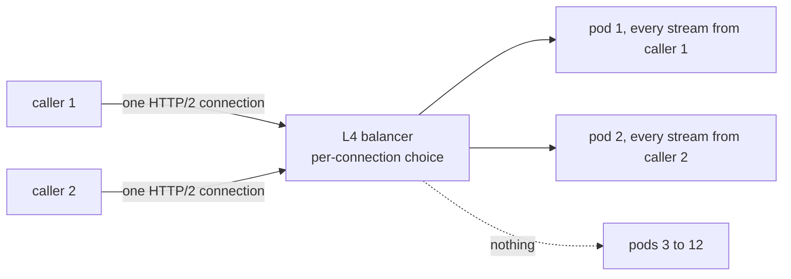

Before a launch you scale the recommendations service from 3 pods to 12. The dashboards show three pods at 90% CPU and nine new ones idle. An hour later one of the hot pods stalls on a slow dependency, and the checkout service that calls it stops responding altogether, because none of its gRPC calls has a deadline and every worker is waiting on a response that will never come.

Both incidents are gRPC working as designed. HTTP/2 puts every call from a client onto one long-lived connection, so a balancer that routes connections rather than requests pins all traffic to the pods that existed when the connections opened. And gRPC, like most RPC stacks, waits forever unless told otherwise. gRPC is an excellent default between services, and the price is knowing what it does on the wire. This lesson goes from protobuf bytes up to call semantics; every encoding below was computed with the small Python encoder and decoder shown, since no protobuf library is needed to read the format.

## Why a binary RPC protocol at all

JSON over HTTP/1.1 has four costs between services: field names travel in every message, numbers are text to parse, nothing checks the contract before production, and HTTP/1.1 carries one request per connection at a time ([HTTP/1.1](/learn/networking/application-protocols/http-1-1)). gRPC replaces each: a **protobuf** schema that generates typed clients and servers in a dozen languages, a compact binary encoding, HTTP/2 streams, and deadlines and cancellation on every call. You give up readability, direct browser support and HTTP caching.

## Protobuf on the wire: tags, wire types, varints

```text
syntax = "proto3";
package catalog.v1;

message Rating {
  string country = 1;
  sint32 delta = 2;
}

message Title {
  int64 id = 1;
  string name = 2;
  repeated string genres = 3;
  optional int32 runtime_minutes = 4;
  repeated int32 seasons = 5;
  Rating rating = 6;
}

service CatalogService {
  rpc GetTitle(GetTitleRequest) returns (Title);
  rpc WatchTitles(WatchRequest) returns (stream TitleEvent);
}
```

The numbers after `=` are the contract; names exist only in generated code. Each field on the wire is a **tag** then a value, and the tag is a varint of `(field_number << 3) | wire_type`:

| Wire type | Name | Used for |
|---|---|---|
| 0 | VARINT | `int32`, `int64`, `uint32`, `uint64`, `sint32`, `sint64`, `bool`, `enum` |
| 1 | I64 | `fixed64`, `sfixed64`, `double` |
| 2 | LEN | `string`, `bytes`, embedded messages, packed repeated fields |
| 5 | I32 | `fixed32`, `sfixed32`, `float` |

The wire type tells a decoder how to *skip* a field it does not know, which is the basis of schema evolution: an old client that receives field 7 reads the tag, sees type 2, reads the length and jumps over it.

A **varint** stores an unsigned integer in 7-bit groups, least significant first, with the top bit of every byte but the last set to 1 ("more follows"). Encode 300:

```text
300 in binary            = 1 0010 1100
split into 7-bit groups  = 0000010 | 0101100
least significant first  = 0101100, 0000010
set continuation bit     = 1_0101100, 0_0000010
bytes                    = 0xAC 0x02
```

150 is `96 01` the same way. Values below 128 take one byte, below 16,384 two, and a 64-bit value up to ten.

```exercise
id: protobuf-varint
title: Encode a protobuf varint
prompt: |
  Return the varint encoding of a non-negative integer `n` as a list of
  byte values (0 to 255): 7 bits per byte, least significant group first,
  with the top bit (128) set on every byte except the last.

  `n` can be as large as 2^53 - 1, so in JavaScript use arithmetic
  (`%` and `Math.floor`) rather than 32-bit bitwise operators.
languages: [python, javascript]
entry: encode_varint
starter:
  python: |
    def encode_varint(n):
        out = []
        return out
  javascript: |
    function encode_varint(n) {
      const out = [];
      return out;
    }
tests:
  - args: [1]
    expected: [1]
  - args: [300]
    expected: [172, 2]
    label: the worked example
  - args: [0]
    expected: [0]
    label: zero is one byte, not zero bytes
  - args: [128]
    expected: [128, 1]
    label: first value that needs two bytes
  - args: [127]
    expected: [127]
    hidden: true
  - args: [16384]
    expected: [128, 128, 1]
    hidden: true
  - args: [4294967296]
    expected: [128, 128, 128, 128, 16]
    label: beyond 32 bits
    hidden: true
  - args: [9007199254740991]
    expected: [255, 255, 255, 255, 255, 255, 255, 15]
    hidden: true
hints:
  - "Take n % 128 as the next group, then n = floor(n / 128). If anything is left, add 128 to the byte you produced."
  - "Use a do-while shape so that n = 0 still emits one byte."
```

## A full message, byte by byte

Encode `Title{id: 150, name: "Dark", genres: ["drama", "sci-fi"], runtime_minutes: 55, seasons: [2017, 2019, 2020], rating: {country: "DE", delta: -1}}`:

| Field | Tag byte | Bytes | Reading |
|---|---|---|---|
| id | `08` = 1<<3 \| 0 | `08 96 01` | varint 150 |
| name | `12` = 2<<3 \| 2 | `12 04 44 61 72 6b` | length 4, "Dark" |
| genres | `1a` = 3<<3 \| 2 | `1a 05 64 72 61 6d 61` | "drama": one tag per element for strings |
| genres | `1a` | `1a 06 73 63 69 2d 66 69` | "sci-fi" |
| runtime_minutes | `20` = 4<<3 \| 0 | `20 37` | 55 |
| seasons | `2a` = 5<<3 \| 2 | `2a 06 e1 0f e3 0f e4 0f` | packed: 6 bytes holding varints 2017, 2019, 2020 |
| rating | `32` = 6<<3 \| 2 | `32 06 0a 02 44 45 10 01` | nested message of 6 bytes: country "DE", then `10 01` = field 2, ZigZag(−1) = 1 |

**42 bytes.** Compact JSON for the same object is 136 bytes, 3.2 times larger, and a decoder must scan all of it. Decoding reverses the walk: read a varint key, split it into number (`key >> 3`) and wire type (`key & 7`), then read a varint or a length and that many bytes:

```python
def read_varint(buf, pos):
    result, shift = 0, 0
    while True:
        b = buf[pos]
        result |= (b & 0x7F) << shift      # low 7 bits, least significant group first
        pos += 1
        if b < 0x80:                        # top bit clear: this was the last byte
            return result, pos
        shift += 7

def decode(buf):
    pos, fields = 0, []
    while pos < len(buf):
        key, pos = read_varint(buf, pos)
        number, wire_type = key >> 3, key & 7
        if wire_type == 0:
            value, pos = read_varint(buf, pos)
        elif wire_type == 2:                # string, bytes, nested message or packed list
            length, pos = read_varint(buf, pos)
            value, pos = buf[pos:pos + length], pos + length
        else:
            raise ValueError(f"wire type {wire_type} not handled here")
        fields.append((number, wire_type, value))
    return fields

msg = bytes.fromhex("08960112044461726b1a056472616d611a067363692d6669"
                    "20372a06e10fe30fe40f32060a0244451001")
for field in decode(msg):
    print(field)            # (1, 0, 150), (2, 2, b'Dark'), ... (6, 2, b'\n\x02DE\x10\x01')
print(decode(decode(msg)[-1][2]))   # [(1, 2, b'DE'), (2, 0, 1)]: the nested Rating
```

The decoder cannot tell a string from a nested message or a packed list: all three are wire type 2, and only the schema says which. That is why `protoc --decode_raw` guesses, and why a schema registry matters for data at rest.

The sizes depend on shape. For a synthetic list of 100 such titles, protobuf was 4,932 bytes against 13,984 for JSON; after gzip, 1,017 against 1,198. Compression recovers most of JSON's repeated field names, so protobuf's lasting advantages are parse CPU, the typed contract and a smaller uncompressed wire, not a tenfold bandwidth saving.

## Negative numbers and ZigZag

`int32` and `int64` encode a negative value as its 64-bit two's complement, so −1 becomes ten bytes, `ff ff ff ff ff ff ff ff ff 01`. Had `delta` been `int32`, the nested rating would have grown from 8 bytes to 17. `sint32` and `sint64` first apply **ZigZag**, `(n << 1) ^ (n >> 31)`, equivalently `2n` for n ≥ 0 and `−2n − 1` for n < 0:

| n | ZigZag | Varint bytes |
|---|---|---|
| 0 | 0 | `00` |
| −1 | 1 | `01` |
| 1 | 2 | `02` |
| −2 | 3 | `03` |
| 150 | 300 | `ac 02` |
| −150 | 299 | `ab 02` |
| 2,147,483,647 | 4,294,967,294 | `fe ff ff ff 0f` |
| −2,147,483,648 | 4,294,967,295 | `ff ff ff ff 0f` |

Use `sint*` for fields that are often negative (deltas, offsets); use `int*` for ids and counts, where ZigZag would waste a bit.

```exercise
id: protobuf-zigzag
title: Encode a sint64 with ZigZag and a varint
prompt: |
  Return the wire bytes of a protobuf `sint64` value `n` (without the tag):
  map it with ZigZag (`2n` for n >= 0, `-2n - 1` for n < 0), then encode
  the result as a varint, returned as a list of byte values.

  Inputs are within JavaScript's safe integer range after the mapping,
  so use arithmetic rather than the `<<` and `>>` operators, which
  truncate to 32 bits in JavaScript.
languages: [python, javascript]
entry: encode_sint
starter:
  python: |
    def encode_sint(n):
        z = n  # TODO: ZigZag map
        out = []
        # TODO: varint-encode z
        return out
  javascript: |
    function encode_sint(n) {
      let z = n; // TODO: ZigZag map
      const out = [];
      // TODO: varint-encode z
      return out;
    }
tests:
  - args: [0]
    expected: [0]
    label: zero
  - args: [-1]
    expected: [1]
    label: minus one is one byte, not ten
  - args: [1]
    expected: [2]
  - args: [-150]
    expected: [171, 2]
  - args: [150]
    expected: [172, 2]
    hidden: true
  - args: [-2147483648]
    expected: [255, 255, 255, 255, 15]
    label: most negative int32
    hidden: true
  - args: [2147483647]
    expected: [254, 255, 255, 255, 15]
    hidden: true
hints:
  - "ZigZag interleaves signs: 0, -1, 1, -2, 2 map to 0, 1, 2, 3, 4."
  - "After mapping, reuse the varint loop: byte = z % 128, z = floor(z / 128), add 128 while anything remains."
```

## Rules that follow from the encoding

- **Field numbers 1 to 15 have one-byte tags**; 16 to 2,047 take two. Give the hottest fields the small numbers. Valid numbers run to 536,870,911, with 19,000 to 19,999 reserved.
- **Defaults are not sent.** In proto3 a scalar equal to its zero value (0, `""`, `false`) is omitted, so the receiver cannot tell zero from unset: a `discount_percent` of 0 and a missing discount look identical. Declare the field `optional` (explicit presence, accepted in proto3 without an experimental flag since protobuf 3.15) or use a wrapper message when the difference matters.
- **Repeated scalars are packed** in proto3: `seasons` cost 8 bytes packed, and would cost 9 as three tagged varints; the gap grows with the list. Parsers accept either form.
- **Order and duplicates.** Encoders usually write fields in number order, but parsers accept any order; for a repeated scalar field the last value wins, and nested messages merge. Concatenating two encoded messages therefore merges them, which some systems use to patch messages without decoding.

```exercise
id: protobuf-encode-message
title: Encode a protobuf message
prompt: |
  `fields` is a list of `[field_number, value]` pairs in the order to be
  written. Integer values (non-negative) use wire type 0 (a varint).
  String values use wire type 2: a varint length in bytes followed by the
  UTF-8 bytes (the tests use ASCII). Return the whole message as a list of
  byte values.

  Encode every pair you are given, including zero values and empty
  strings. (A real proto3 encoder would skip defaults; this one does not.)
  The tag is `(field_number << 3) | wire_type`, written as a varint.
languages: [python, javascript]
entry: encode_message
starter:
  python: |
    def encode_varint(n):
        out = []
        while True:
            byte, n = n % 128, n // 128
            if n:
                out.append(byte + 128)
            else:
                out.append(byte)
                return out

    def encode_message(fields):
        out = []
        return out
  javascript: |
    function encode_varint(n) {
      const out = [];
      while (true) {
        const byte = n % 128;
        n = Math.floor(n / 128);
        if (n) out.push(byte + 128);
        else { out.push(byte); return out; }
      }
    }

    function encode_message(fields) {
      const out = [];
      return out;
    }
tests:
  - args: [[[1, 150]]]
    expected: [8, 150, 1]
  - args: [[[2, "testing"]]]
    expected: [18, 7, 116, 101, 115, 116, 105, 110, 103]
  - args: [[[1, 150], [2, "testing"]]]
    expected: [8, 150, 1, 18, 7, 116, 101, 115, 116, 105, 110, 103]
    label: an integer field then a string field
  - args: [[]]
    expected: []
    label: empty message
  - args: [[[16, 1]]]
    expected: [128, 1, 1]
    label: field 16 needs a two-byte tag
    hidden: true
  - args: [[[3, ""]]]
    expected: [26, 0]
    label: empty string still has a length
    hidden: true
  - args: [[[5, 300], [1, "hi"], [2047, 2]]]
    expected: [40, 172, 2, 10, 2, 104, 105, 248, 127, 2]
    hidden: true
hints:
  - "The tag for a string field 2 is 2 * 8 + 2 = 18; for an integer field 1 it is 1 * 8 + 0 = 8."
  - "Encode the tag with encode_varint too; field numbers above 15 produce tags of 128 or more."
```

## Evolving a schema without breaking anyone

Because fields are identified by number and unknown fields are skipped, protobuf supports old readers of new data and new readers of old data, if you follow the rules:

| Change | Safe? | Why |
|---|---|---|
| Add a field with a new number | Yes | Old readers skip it; new readers see the default when absent |
| Remove a field | Yes, if you `reserve` its number and name | Reusing the number makes old data decode as the new field |
| Rename a field | Binary yes, JSON no | Binary uses numbers; the JSON mapping uses names |
| `int32` to `int64` | Mostly | Same wire type; old readers truncate values above 2^31 |
| `int32` to `sint32` | No | Same wire type, different meaning: `int32` −1 reads back as −2,147,483,648 |
| `int32` to `string` | No | Different wire type |
| Add an enum value | With care | Old readers see an unknown value; keep a zero `UNSPECIFIED` first |

```text
message Title {
  reserved 4;
  reserved "runtime_minutes";
  int64 id = 1;
  string name = 2;
  repeated string genres = 3;
  repeated int32 seasons = 5;
  Rating rating = 6;
  optional int32 duration_seconds = 7;
}
```

**Unknown-field preservation** makes the chain safe: a service built on an old schema that reads a message, changes one field and writes it back keeps the fields it does not understand. Proto3 dropped unknown fields at first and restored preservation in protobuf 3.5 (2017); a JSON round trip still drops them, because the JSON mapping has no place for unnamed fields.

Roll out readers before writers, and let tools such as `buf breaking` compare each schema with the last release in CI so that these rules are a check rather than folklore. Breaking changes go into a new package (`catalog.v2`) served alongside the old one. Netflix has written publicly about using protobuf `FieldMask` so callers request only the fields they need, which keeps a large message type from becoming a performance problem as it grows.

## Under the hood: the libraries

- **Parsers** are table-driven or generated code; Python's `protobuf` package has used the `upb` C core by default since 4.21, so parsing in Python is not pure-Python speed. The maximum varint is 10 bytes, and a parser rejects an 11th continuation byte as malformed.
- **gRPC transports** are their own HTTP/2 implementations: grpc-go ships one (not `net/http`), grpc-java runs on Netty, and Python, Ruby and C++ wrap the shared C core. A **channel** is a logical connection to a service name; it holds **subchannels**, one per resolved backend address, and a load-balancing policy (`pick_first` by default, or `round_robin`) chooses a subchannel per call.
- **Limits and timers:** the default maximum received message is 4 MiB (larger ones fail with `RESOURCE_EXHAUSTED`); grpc-go servers by default allow client keepalive pings at most every 5 minutes and answer repeated violations with `GOAWAY` and "too_many_pings"; grpc-go grows its HTTP/2 flow-control windows by estimating the bandwidth-delay product with PING frames unless you fix a window size.

## gRPC on HTTP/2: the frames of one call

```viz
{"type": "network", "scenario": "grpc-stream", "title": "A server-streaming call on one HTTP/2 stream", "caption": "Headers carry the method and deadline, DATA frames carry length-prefixed protobuf messages, and the status arrives last, in trailers."}
```

A unary `GetTitle` is one HTTP/2 stream ([HTTP/2 and HTTP/3](/learn/networking/application-protocols/http-2-and-http-3) covers frames):

| Step | Frame | Content |
|---|---|---|
| 1 | Client HEADERS | `:method POST`, `:path /catalog.v1.CatalogService/GetTitle`, `content-type: application/grpc`, `te: trailers`, `grpc-timeout: 250m` |
| 2 | Client DATA, END_STREAM | 5-byte prefix + the request message |
| 3 | Server HEADERS | `:status 200`, `content-type: application/grpc` |
| 4 | Server DATA | `00 00 00 00 2a` + the 42-byte Title: 47 bytes of payload, 56 with the frame header |
| 5 | Server HEADERS, END_STREAM | Trailers: `grpc-status: 0`, `grpc-message` |

The 5-byte **message prefix** is a 1-byte compressed flag and a 4-byte big-endian length (`0x2a` = 42), so several messages can share a stream. `grpc-timeout` is a number of up to 8 digits and a unit (`H`, `M`, `S`, `m`, `u`, `n`). Metadata is extra headers, and keys ending in `-bin` carry base64 binary.

The status comes last because a streaming call only knows whether it succeeded after its last message. Two consequences: the HTTP status is 200 even for failed calls, so a dashboard that reads HTTP codes reports 100% success while every call returns `UNAVAILABLE`; and anything that cannot read HTTP/2 trailers (browser `fetch`, many HTTP/1.1 proxies) cannot speak gRPC natively, hence gRPC-Web and the Connect protocol, and why a proxy that downgrades to HTTP/1.1 towards the backend breaks gRPC.

## Four call shapes and flow control

| Shape | Client sends | Server sends | END_STREAM from client | Typical use |
|---|---|---|---|---|
| Unary | 1 message | 1 message + trailers | After its message | Lookups, commands |
| Server streaming | 1 | Many | After its message | Watches, feeds, large result sets |
| Client streaming | Many | 1 | After the last upload message | Uploads, batched ingestion |
| Bidirectional | Many | Many | Whenever it is done | Chat, control channels |

Each stream has its own HTTP/2 flow-control window, so a slow consumer of one stream applies backpressure to that stream only: the sender's window reaches zero, its `Send` call blocks, and other calls on the connection continue. A server-streaming handler that ignores this and buffers in memory is how a slow client turns into an out-of-memory crash.

## Deadlines: budget arithmetic across hops

A call without a deadline waits until the server answers or the connection dies, and a connection to a hung process does not die. Most gRPC libraries default to no deadline. Set one on every call and pass the incoming context downstream:

```go
ctx, cancel := context.WithTimeout(ctx, 300*time.Millisecond)
defer cancel()

title, err := catalog.GetTitle(ctx, &catalogpb.GetTitleRequest{Id: 150})
switch status.Code(err) {
case codes.OK:
case codes.DeadlineExceeded, codes.Unavailable:
    // fall back to a cached or default response
default:
    return err
}
```

The deadline travels as a *relative* `grpc-timeout`, so clock skew between machines does not matter; each hop sends what remains. A 300 ms budget at the edge, 1 ms of network per hop:

| Hop | Receives at | Local deadline | Work before its call | Sends `grpc-timeout` |
|---|---|---|---|---|
| Edge | 0 ms | 300 | 10 ms (auth) | 290m |
| A | 11 | 301 | 40 ms (database) | 250m |
| B | 52 | 302 | 30 ms | 220m |
| C | 83 | 303 | Stuck on a slow dependency | – |

At 300 ms the edge gives up, returns `DEADLINE_EXCEEDED` and sends RST_STREAM; A's context is cancelled, which cancels B's call, which cancels C's, so no hop keeps working for a caller that has left. Two details: a relative timeout cannot subtract transit time, so each hop's deadline lands about one one-way delay later than the edge's; and a hop that wants to return a fallback must pass on less than it has (A sending 230m instead of 250m keeps 20 ms to answer with cached data). [Timeouts, retries and backoff](/learn/networking/networking-in-practice/timeouts-retries-and-backoff) generalises the budget.

## Status codes, retries and hedging

gRPC's 17 status codes are more precise than HTTP's, and gateways map them:

| Code | HTTP mapping | Retry? |
|---|---|---|
| `UNAVAILABLE` (14) | 503 | Yes, with backoff: not processed, or server shutting down |
| `DEADLINE_EXCEEDED` (4) | 504 | Only if idempotent and budget remains: the work may have happened |
| `RESOURCE_EXHAUSTED` (8) | 429 | Later, with backoff |
| `ABORTED` (10) | 409 | At a higher level: re-read, then retry |
| `CANCELLED` (1) | 499 | No: the caller gave up |
| `UNAUTHENTICATED` (16) | 401 | After refreshing credentials |
| `INVALID_ARGUMENT` (3), `NOT_FOUND` (5), `PERMISSION_DENIED` (7), `FAILED_PRECONDITION` (9) | 400, 404, 403, 400 | Never |
| `INTERNAL` (13), `UNKNOWN` (2) | 500 | Usually not |

Clients can retry automatically from a service config:

```json
{"methodConfig": [{"name": [{"service": "catalog.v1.CatalogService"}],
   "timeout": "0.3s",
   "retryPolicy": {"maxAttempts": 3, "initialBackoff": "0.05s", "maxBackoff": "0.5s",
                   "backoffMultiplier": 2, "retryableStatusCodes": ["UNAVAILABLE"]}}],
 "retryThrottling": {"maxTokens": 10, "tokenRatio": 0.1}}
```

`maxAttempts` includes the first call and clients cap it at 5. `retryThrottling` is the retry budget: the client holds 10 tokens, each failure costs 1, each success earns 0.1, and retries stop while tokens are at or below half (5). In a total outage retrying stops after five failures, so retries cannot triple the load on a service that is already down, and they resume only once successes, each worth a tenth of a failure, lift the count back above 5. Hedging (`hedgingPolicy`) sends a second copy after a delay and keeps the first answer, trading extra load for tail latency, and is only for idempotent methods.

```viz
{"type": "system", "scenario": "retry-backoff", "title": "Retries with exponential backoff", "caption": "Each retry waits longer than the last, with jitter so that clients do not retry in lockstep. A retry budget caps the extra load when every call is failing."}
```

## Load balancing: the L4 trap

Back to the three hot pods. The callers opened their HTTP/2 connections through a Kubernetes `ClusterIP` service, which balances at L4: it picks a pod once per TCP connection. Every call since has been a new stream on an existing connection, so new pods get traffic only when a client opens a new connection, which may be never.



The fixes move the decision to the request:

- **An L7 proxy** (Envoy, Linkerd, a mesh sidecar) terminates HTTP/2 and balances each stream.
- **Client-side balancing**: the client resolves every backend (a headless service returns one DNS record per pod, or an xDS control plane pushes the list), keeps a subchannel to each, and picks per call with `round_robin` or least-request.
- **Maximum connection age** on servers (`MaxConnectionAge` in grpc-go): after, say, five minutes the server sends `GOAWAY`, clients reconnect, and connections spread over time. A mitigation, not a balancer.

Quiet streams also collide with idle timeouts: a watch silent for longer than a balancer's idle timeout is dropped, so clients send keepalive PINGs, within the server's enforcement limit. [Load balancing](/learn/networking/application-protocols/load-balancing) covers per-request algorithms.

## Debugging with grpcurl

`grpcurl` uses server reflection (or your `.proto` files) to translate JSON:

```bash
$ grpcurl -d '{"id": 150}' catalog.internal:443 catalog.v1.CatalogService/GetTitle
{
  "id": "150",
  "name": "Dark"
}
$ grpcurl -d '{"id": 999}' catalog.internal:443 catalog.v1.CatalogService/GetTitle
ERROR:
  Code: NotFound
  Message: title 999 not found
```

`"id": "150"` is a string because the canonical protobuf JSON mapping writes 64-bit integers as strings: JavaScript numbers cannot represent all of them exactly. Every JSON gateway in front of gRPC inherits that quirk.

## Production failure modes

| Failure | Symptom | Diagnosis | Fix |
|---|---|---|---|
| L4 pinning | New pods idle, old ones hot after scaling | Connections per pod skewed; calls per connection high | L7 proxy, client-side `round_robin`, max connection age |
| No deadlines | A slow dependency freezes callers; threads or goroutines climb | Traces show calls open for minutes; no `grpc-timeout` header | Deadline on every call, propagated context |
| Field number reused | Garbage values or parse errors after a deploy | Schema history shows the number used before | `reserved`, `buf breaking` in CI |
| HTTP-only monitoring | 100% success on dashboards during an outage | Balancer counts HTTP 200s; `grpc-status` ignored | gRPC-aware metrics on `grpc-status` |
| Message too large | `RESOURCE_EXHAUSTED: received message larger than max` | Response grew past 4 MiB | Paginate or stream; raise the limit deliberately |
| Retry amplification | Load multiplies during an incident | Attempts per call rise; retries on non-idempotent methods | Retry only `UNAVAILABLE`, `retryThrottling`, budgets |
| Keepalive mismatch | Streams drop after idle; or `GOAWAY too_many_pings` | Balancer idle timeout shorter than ping interval, or pings faster than server allows | Align keepalive with both limits |

## Trade-offs: gRPC or REST

| Axis | gRPC + protobuf | REST + JSON |
|---|---|---|
| Payload | 42 bytes in the example; binary | 136 bytes; text, readable |
| Contract | Generated, checked in CI | OpenAPI if you maintain it |
| Streaming | Four shapes with flow control | SSE, WebSockets, or chunked responses |
| Browsers | Needs gRPC-Web or Connect via a proxy | Native |
| HTTP caching | None: every call is POST | GET plus `Cache-Control` and CDNs |
| Load balancing | Needs per-request (L7 or client-side) | Works with anything |
| Debugging | `grpcurl`, reflection | curl, any log |

Choose gRPC for internal, high-QPS, multi-language and streaming traffic; choose REST for public APIs, browsers and CDN-cacheable reads. Large organisations commonly run both, generating the edge from the same protobuf definitions (for example with `google.api.http` annotations and a transcoding proxy) so there is one contract. [API styles](/learn/networking/application-protocols/api-styles) compares the options on one payload.

## Interviewer follow-ups

**"Why are field numbers the contract, and what breaks if you reuse one?"** Model answer: the wire carries only number and wire type, so a reused number makes old data, cached payloads and queued events decode as the new field, silently when the wire types match. Reserve removed numbers and names. Common wrong answer: "protoc would reject the conflict", which it cannot without `reserved`.

**"How should deadlines work across three services?"** Model answer: set one at the edge, pass the context so each hop sends the remaining budget in `grpc-timeout`, keep a reserve for fallbacks, and rely on cancellation to stop downstream work; relative timeouts avoid clock skew but drift late by transit time. Common wrong answer: "give every hop 300 ms", which lets the chain outlive its caller.

**"Is it safe to retry `DEADLINE_EXCEEDED`?"** Model answer: only for idempotent methods and only with budget remaining, because the server may have done the work; `UNAVAILABLE` is the canonical retryable code, and retries need a budget such as `retryThrottling`. Common wrong answer: "yes, a timeout means it failed".

**"Twelve pods, three hot: why, and what would you change?"** Model answer: long-lived HTTP/2 connections plus a per-connection L4 balancer; move to per-request balancing and add a maximum connection age. Common wrong answer: "restart the hot pods", which re-pins the new connections as unevenly.

## What mid-level engineers get wrong

- **Calling without a deadline**, so one slow dependency takes down every caller.
- **Using `int32` for values that are often negative**, paying ten bytes for −1 instead of one with `sint32`.
- **Deleting a field without `reserved`**, then reusing its number months later.
- **Relying on zero values** to mean "not set" in proto3 without `optional`.
- **Putting gRPC behind an L4 balancer** and assuming new pods share the load.
- **Retrying every error**, including `INVALID_ARGUMENT` and non-idempotent `DEADLINE_EXCEEDED` calls.
- **Reading HTTP status codes** to judge gRPC health.

## Senior signals

- You decode protobuf by hand (tag, wire type, varint, ZigZag, length-delimited, packed) and know the decoder needs the schema to tell a string from a message.
- You `reserve` removed numbers, keep a zero `UNSPECIFIED` enum value, use `optional` where zero and unset differ, rely on unknown-field preservation, and run a breaking-change check in CI.
- You can draw the frames of a call: HEADERS with `:path` and `grpc-timeout`, 5-byte-prefixed messages, trailers carrying `grpc-status`.
- You set a deadline on every call, propagate remaining budget and cancellation, and map status codes to retry decisions with a retry budget.
- You fix HTTP/2 imbalance with per-request balancing and maximum connection age, and you make proxies and dashboards read `grpc-status`.
- You pick REST for public, browser-facing or CDN-cacheable APIs and gRPC inside, often from one contract.

## Check yourself

```quiz
- q: >-
    After scaling a gRPC service from 3 to 12 pods behind a Kubernetes ClusterIP service, only the original 3 pods receive traffic. What is the cause?
  options: ["ClusterIP picks a pod per connection, not per call", "gRPC clients cap each service at three backends", "Each pod caches its own copy of the protobuf schema", "The new pods are failing their readiness checks"]
  answer: 0
  explanation: >-
    An L4 balancer such as ClusterIP decides once per TCP connection. gRPC multiplexes every call as a stream over long-lived HTTP/2 connections that were opened when only 3 pods existed, so new pods get nothing until clients reconnect. Per-request balancing (an L7 proxy or client-side round robin over all pod addresses) or a server-side maximum connection age fixes it.
- q: >-
    How many bytes does the varint encoding of 300 occupy, and what are they?
  options: ["2 bytes: 0x2C 0x82", "2 bytes: 0xAC 0x02", "2 bytes: 0x01 0x2C", "3 bytes: 0xAC 0x82 0x00"]
  answer: 1
  explanation: >-
    300 is 0b100101100. The low 7 bits (0101100 = 44) come first with the continuation bit set (44 + 128 = 0xAC), then the remaining bits (2) with no continuation bit. The 0x01 0x2C form is big-endian fixed-width thinking, 0x2C 0x82 puts the continuation bit on the wrong byte, and no third byte is needed below 16,384.
- q: >-
    A field that is often -1 is declared int32. How many bytes does the value -1 take on the wire, excluding the tag, and what would sint32 take?
  options: ["4 bytes as int32, 1 byte as sint32", "10 bytes as int32, 2 bytes as sint32", "1 byte as int32, 1 byte as sint32", "10 bytes as int32, 1 byte as sint32"]
  answer: 3
  explanation: >-
    int32 encodes a negative value as a sign-extended 64-bit number, which needs the maximum ten varint bytes. sint32 applies ZigZag first, mapping -1 to 1, which is a single byte. Fixed-width four bytes would be sfixed32, a different type.
- q: >-
    A team removes the deprecated field int32 legacy_score = 7 and, a month later, adds string region = 7. What goes wrong?
  options: ["The new field is silently ignored by every client", "Old field-7 varints are misread as the new string", "Nothing, since a number is free once its field is gone", "protoc refuses to compile a schema that reuses 7"]
  answer: 1
  explanation: >-
    The wire identifies fields only by number and wire type. Old writers, cached payloads and events in queues still carry field 7 as an integer, which new code expecting a string will misread or reject, and old readers will misinterpret new messages. Reserving removed numbers and names makes the compiler reject reuse; protoc cannot know the history unless you record it.
- q: >-
    A dashboard built on load-balancer HTTP status codes shows 100% success for a gRPC service while clients are receiving errors. Why?
  options: ["Failures arrive as HTTP 200 with a non-zero grpc-status", "The clients are misreporting their own call errors", "gRPC sends its errors over a separate connection", "The load balancer is caching successful responses"]
  answer: 0
  explanation: >-
    The call status is only known at the end of the stream, so it travels in the grpc-status trailer. HTTP status 200 means only that the HTTP exchange worked. Infrastructure and metrics must be gRPC-aware and read grpc-status to see failures.
- q: >-
    The edge sets a 300 ms deadline, spends 10 ms, and calls A; A spends 40 ms and calls B. What grpc-timeout should A send to B, and what happens to B's work if the edge gives up?
  options: ["300 ms; B finishes its work even after the edge gives up", "About 250 ms; the cancellation propagates and B stops", "No timeout; B should always complete what it started", "About 250 ms; B keeps working until its own budget ends"]
  answer: 1
  explanation: >-
    A received about 290 ms and has used 40, so it passes on the remainder, less any reserve it keeps for a fallback. When the edge's deadline fires it cancels its stream, A's context is cancelled, and that cancellation travels to B as RST_STREAM, so B stops rather than working for a caller that has left. A fresh 300 ms per hop, or no deadline at all, lets the chain outlive the request.
```
