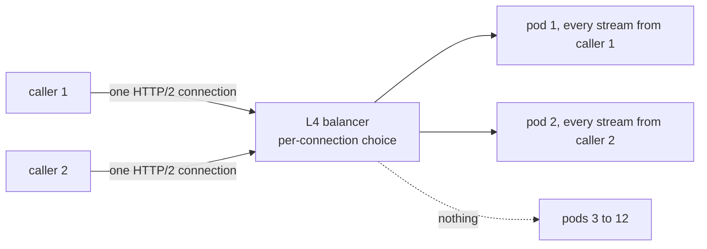

Before a launch you scale the recommendations service from 3 pods to 12. The dashboards show three pods at 90% CPU and nine new ones doing nothing. An hour later one of the hot pods stalls on a slow dependency, and the checkout service that calls it stops responding altogether, because none of its gRPC calls has a deadline and every worker is now waiting on a response that will never come.

Both incidents are gRPC working exactly as designed. HTTP/2 puts every call from a client onto one long-lived connection, so a balancer that routes connections rather than requests pins all traffic to whichever pods existed when the connections were opened. And gRPC, like most RPC stacks, waits forever unless you tell it not to. gRPC is an excellent default for service-to-service traffic, and the price is that you need to understand what it does on the wire. This lesson goes from the protobuf bytes up to the call semantics.

## Why a binary RPC protocol at all

JSON over HTTP/1.1 is the universal API format, and between services it has four costs. Field names travel with every message. Numbers are text that must be parsed. There is no machine-checked contract, so a renamed field is discovered in production. And HTTP/1.1 carries one request at a time per connection, as [HTTP/1.1](/learn/networking/application-protocols/http-1-1) covered.

gRPC replaces each: a **protobuf** schema that generates typed client and server code in a dozen languages, a compact binary encoding, HTTP/2 streams for multiplexing and streaming, and deadlines and cancellation built into every call. What you give up is readability, direct browser support, and HTTP caching; the last section weighs them.

## Protobuf on the wire

A schema:

```text
syntax = "proto3";
package catalog.v1;

message Title {
  int64 id = 1;
  string name = 2;
  repeated string genres = 3;
  optional int32 runtime_minutes = 4;
}

service CatalogService {
  rpc GetTitle(GetTitleRequest) returns (Title);
  rpc WatchTitles(WatchRequest) returns (stream TitleEvent);
}
```

The numbers after `=` are the contract. Names exist only in generated code; on the wire, every field is identified by its number.

### Tags and wire types

Each field is encoded as a **tag** followed by a value. The tag is itself a varint:

$$\text{tag} = (\text{field number} \ll 3)\ |\ \text{wire type}$$

| Wire type | Name | Used for |
|---|---|---|
| 0 | VARINT | `int32`, `int64`, `uint32`, `uint64`, `sint32`, `sint64`, `bool`, `enum` |
| 1 | I64 | `fixed64`, `sfixed64`, `double` |
| 2 | LEN | `string`, `bytes`, embedded messages, packed repeated fields |
| 5 | I32 | `fixed32`, `sfixed32`, `float` |

The wire type tells a decoder how to *skip* a field it does not know, which is the whole basis of schema evolution: an old client that receives field 7 reads its tag, sees wire type 2, reads the length and jumps over it.

### Varints

A varint stores an unsigned integer in 7-bit groups, least significant group first. Every byte except the last has its top bit set to 1, meaning "more bytes follow". Encode 300:

```text
300 in binary            = 1 0010 1100
split into 7-bit groups  = 0000010 | 0101100
least significant first  = 0101100, 0000010
set continuation bit     = 1_0101100, 0_0000010
bytes                    = 0xAC 0x02
```

Values below 128 take one byte, below 16,384 two bytes, and a full 64-bit value up to ten.

Now encode `Title{id: 150, name: "testing"}`:

```text
08            tag: field 1, wire type 0  (1 << 3 | 0 = 8)
96 01         varint 150
12            tag: field 2, wire type 2  (2 << 3 | 2 = 18 = 0x12)
07            length 7
74 65 73 74 69 6e 67   "testing"
```

Twelve bytes. The equivalent compact JSON, `{"id":150,"name":"testing"}`, is 27 bytes, and a decoder must scan every character of it. `protoc --decode_raw` reads raw bytes without a schema, which is how you inspect a payload captured from the wire:

```bash
$ printf '\x08\x96\x01\x12\x07testing' | protoc --decode_raw
1: 150
2: "testing"
```

```exercise
id: protobuf-varint
title: Encode a protobuf varint
prompt: |
  Return the varint encoding of a non-negative integer `n` as a list of
  byte values (0 to 255): 7 bits per byte, least significant group first,
  with the top bit (128) set on every byte except the last.

  `n` can be as large as 2^53 - 1, so in JavaScript use arithmetic
  (`%` and `Math.floor`) rather than 32-bit bitwise operators.
languages: [python, javascript]
entry: encode_varint
starter:
  python: |
    def encode_varint(n):
        out = []
        return out
  javascript: |
    function encode_varint(n) {
      const out = [];
      return out;
    }
tests:
  - args: [1]
    expected: [1]
  - args: [300]
    expected: [172, 2]
    label: the worked example
  - args: [0]
    expected: [0]
    label: zero is one byte, not zero bytes
  - args: [128]
    expected: [128, 1]
    label: first value that needs two bytes
  - args: [127]
    expected: [127]
    hidden: true
  - args: [16384]
    expected: [128, 128, 1]
    hidden: true
  - args: [4294967296]
    expected: [128, 128, 128, 128, 16]
    label: beyond 32 bits
    hidden: true
  - args: [9007199254740991]
    expected: [255, 255, 255, 255, 255, 255, 255, 15]
    hidden: true
hints:
  - "Take n % 128 as the next group, then n = floor(n / 128). If anything is left, add 128 to the byte you just produced."
  - "Use a do-while shape so that n = 0 still emits one byte."
```

### Consequences of the encoding

- **Negative numbers are expensive in `int32` and `int64`.** A negative value is sign-extended to 64 bits, so `-1` becomes ten bytes of varint. The `sint32`/`sint64` types apply **ZigZag** encoding first, `(n << 1) ^ (n >> 31)`, mapping 0, -1, 1, -2 to 0, 1, 2, 3, so small negatives stay small. Use them for fields that are often negative, such as deltas.
- **Field numbers 1 to 15 have one-byte tags**; 16 to 2,047 take two. Give the hottest fields the small numbers.
- **Defaults are not sent.** In proto3, a scalar field equal to its zero value (0, `""`, `false`) is omitted from the wire, and the receiver cannot tell "zero" from "not set". A `discount_percent` of 0 and a missing discount look identical. Declare the field `optional` (explicit presence, which generates a `has_` accessor) or use a wrapper message when the difference matters.
- **Repeated scalars are packed.** `repeated int32 ids = 5` becomes one LEN field containing back-to-back varints, not one tag per element.

```exercise
id: protobuf-encode-message
title: Encode a protobuf message
prompt: |
  `fields` is a list of `[field_number, value]` pairs in the order to be
  written. Integer values (non-negative) use wire type 0 (a varint).
  String values use wire type 2: a varint length in bytes followed by the
  UTF-8 bytes (the tests use ASCII). Return the whole message as a list of
  byte values.

  Encode every pair you are given, including zero values and empty
  strings. (A real proto3 encoder would skip defaults; this one does not.)
  The tag is `(field_number << 3) | wire_type`, written as a varint.
languages: [python, javascript]
entry: encode_message
starter:
  python: |
    def encode_varint(n):
        out = []
        while True:
            byte, n = n % 128, n // 128
            if n:
                out.append(byte + 128)
            else:
                out.append(byte)
                return out

    def encode_message(fields):
        out = []
        return out
  javascript: |
    function encode_varint(n) {
      const out = [];
      while (true) {
        const byte = n % 128;
        n = Math.floor(n / 128);
        if (n) out.push(byte + 128);
        else { out.push(byte); return out; }
      }
    }

    function encode_message(fields) {
      const out = [];
      return out;
    }
tests:
  - args: [[[1, 150]]]
    expected: [8, 150, 1]
  - args: [[[2, "testing"]]]
    expected: [18, 7, 116, 101, 115, 116, 105, 110, 103]
  - args: [[[1, 150], [2, "testing"]]]
    expected: [8, 150, 1, 18, 7, 116, 101, 115, 116, 105, 110, 103]
    label: the Title message from the lesson
  - args: [[]]
    expected: []
    label: empty message
  - args: [[[16, 1]]]
    expected: [128, 1, 1]
    label: field 16 needs a two-byte tag
    hidden: true
  - args: [[[3, ""]]]
    expected: [26, 0]
    label: empty string still has a length
    hidden: true
  - args: [[[5, 300], [1, "hi"], [2047, 2]]]
    expected: [40, 172, 2, 10, 2, 104, 105, 248, 127, 2]
    hidden: true
hints:
  - "The tag for a string field 2 is 2 * 8 + 2 = 18; for an integer field 1 it is 1 * 8 + 0 = 8."
  - "Encode the tag with encode_varint too; field numbers above 15 produce tags of 128 or more."
```

## Evolving a schema without breaking anyone

Because fields are identified by number and unknown fields are skipped, protobuf supports both directions of compatibility, provided you follow the rules:

| Change | Safe? | Why |
|---|---|---|
| Add a field with a new number | Yes | Old readers skip it; new readers see the default when it is absent |
| Remove a field | Yes, if you `reserve` its number and name | Reusing the number later would make old writers' data decode as the new field's type |
| Rename a field | On the wire yes; in JSON no | Binary uses numbers; the JSON mapping uses names |
| Change `int32` to `int64` | Mostly | Same wire type; old readers truncate values above 2^31 |
| Change `int32` to `string` | No | Different wire type; old readers skip or fail |
| Change a field's number | No | It is a different field |
| Add an enum value | Yes, with care | Old readers see an unknown value; always keep a zero `UNSPECIFIED` value first so that "unset" is not a real state |

```text
message Title {
  reserved 4;
  reserved "runtime_minutes";
  int64 id = 1;
  string name = 2;
  repeated string genres = 3;
  optional int32 duration_seconds = 5;
}
```

Deploy order matters too: readers must understand a new field before writers depend on it, so roll out consumers first. Tools such as `buf breaking` compare a schema against the last released version in CI and fail the build on an unsafe change, which turns these rules from folklore into a check. Breaking changes go into a new package (`catalog.v2`) served alongside the old one. Netflix has written publicly about using protobuf `FieldMask` so callers can request only the fields they need, which keeps a large message type from becoming a performance problem as it grows.

## gRPC on HTTP/2

```viz
{"type": "network", "scenario": "grpc-stream", "title": "A server-streaming call on one HTTP/2 stream", "caption": "Headers carry the method and deadline, DATA frames carry length-prefixed protobuf messages, and the status arrives last, in trailers."}
```

A gRPC call is an HTTP/2 stream with a fixed shape. The request headers for `GetTitle`:

```text
:method: POST
:scheme: https
:path: /catalog.v1.CatalogService/GetTitle
:authority: catalog.internal
content-type: application/grpc
te: trailers
grpc-timeout: 250m
grpc-accept-encoding: gzip
x-request-id: 7f3a9c02
```

Every call is a `POST` to `/<package>.<Service>/<Method>`. `grpc-timeout: 250m` is the deadline, 250 milliseconds (units `H`, `M`, `S`, `m`, `u`, `n`). Custom metadata is just more headers; keys ending in `-bin` carry base64-encoded binary.

Each message in a DATA frame is prefixed with 5 bytes: a 1-byte compressed flag and a 4-byte big-endian length. The `Title` above travels as `00 00 00 00 0c` followed by its 12 bytes. The response is `:status: 200` and `content-type: application/grpc` in headers, the messages in DATA frames, then a second HEADERS frame of **trailers**:

```text
grpc-status: 0
grpc-message:
```

The status comes last because a streaming call only knows whether it succeeded after the last message. Two consequences follow. The HTTP status is 200 even for failed calls, so a load balancer, proxy or dashboard that only reads HTTP status codes reports a 100% success rate while every call returns `UNAVAILABLE`; your L7 infrastructure must understand `grpc-status`. And anything that cannot read HTTP/2 trailers (browsers' `fetch`, many HTTP/1.1 proxies) cannot speak gRPC natively; that is why gRPC-Web and the Connect protocol exist, and why a proxy that downgrades to HTTP/1.1 towards the backend breaks gRPC, as [HTTP/2 and HTTP/3](/learn/networking/application-protocols/http-2-and-http-3) noted.

The four call types are all the same stream with different message counts: **unary** (one request, one response), **server streaming** (one request, many responses: a watch or a feed), **client streaming** (many requests, one response: an upload), and **bidirectional** (both directions independently: chat, or a long-lived control channel). Each stream has its own HTTP/2 flow-control window, so a slow consumer applies backpressure to its stream without stalling others on the connection.

## Deadlines and cancellation

A gRPC call without a deadline waits until the server answers or the connection dies, and a TCP connection to a hung process does not die. Most gRPC libraries default to no deadline. Set one on every call:

```go
ctx, cancel := context.WithTimeout(ctx, 300*time.Millisecond)
defer cancel()

title, err := catalog.GetTitle(ctx, &catalogpb.GetTitleRequest{Id: 150})
switch status.Code(err) {
case codes.OK:
case codes.DeadlineExceeded, codes.Unavailable:
    // fall back to a cached or default response
default:
    return err
}
```

The deadline travels as `grpc-timeout`, so the server's handler receives a context that expires at the same moment as the client's. When the handler calls further services with that same context, each hop sends the *remaining* budget: if the edge gave 300 ms and 40 ms have passed, the next call carries about 260 ms. No service keeps working on a request the user has already given up on. Cancellation travels the same way: a cancelled client sends `RST_STREAM`, and the server's context is cancelled so it can stop. [Timeouts, retries and backoff](/learn/networking/networking-in-practice/timeouts-retries-and-backoff) works through deadline budgets across a call chain.

Status codes decide retry behaviour, and they are more precise than HTTP's:

| Code | Meaning | Retry? |
|---|---|---|
| `UNAVAILABLE` (14) | Server not reachable, shutting down, overloaded before processing | Yes, with backoff; the canonical retryable code |
| `DEADLINE_EXCEEDED` (4) | Deadline passed; the server may or may not have done the work | Only if the call is idempotent, and only with budget left |
| `RESOURCE_EXHAUSTED` (8) | Quota or rate limit | Later, with backoff |
| `ABORTED` (10) | Concurrency conflict, such as a transaction abort | Yes, at a higher level (re-read, then retry) |
| `INVALID_ARGUMENT` (3), `NOT_FOUND` (5), `PERMISSION_DENIED` (7), `FAILED_PRECONDITION` (9) | The request is wrong | Never |
| `INTERNAL` (13), `UNKNOWN` (2) | Bug or unexpected failure | Usually not |

gRPC clients can retry and hedge automatically from a service config (`retryableStatusCodes`, `maxAttempts`), which is convenient and dangerous in equal measure: automatic retries multiply load during an outage unless they are capped by a retry budget.

## Load balancing: the L4 trap

Back to the three hot pods. The callers opened their HTTP/2 connections when three pods existed, through a Kubernetes `ClusterIP` service, which balances at L4: it picks a pod once per TCP connection. Every call since has been a new stream on an existing connection. The new pods receive traffic only when a client happens to open a new connection, which might be never.



The fixes all move the balancing decision to the level of the request:

- **An L7 proxy** (Envoy, Linkerd, or the sidecar of a service mesh) terminates HTTP/2 and balances each stream across backends.
- **Client-side balancing**: the gRPC client resolves every backend address (a Kubernetes headless service returns one DNS record per pod, or an xDS control plane pushes the list), keeps a connection to each, and uses a `round_robin` or least-request policy per call.
- **Maximum connection age** on servers (`MaxConnectionAge` in grpc-go, `max_connection_age` elsewhere): the server sends `GOAWAY` after, say, five minutes, clients reconnect, and connections redistribute over time. It is a mitigation, not a balancer, but it guarantees new pods eventually get traffic.

Long-lived streams also collide with idle timeouts: a watch stream that is quiet for longer than a load balancer's idle timeout is silently dropped. gRPC keepalive pings (sent as HTTP/2 PING frames) keep it alive, and servers enforce a minimum ping interval so that misconfigured clients cannot flood them. [Load balancing](/learn/networking/application-protocols/load-balancing) covers per-request algorithms in detail.

## Debugging: grpcurl

Binary payloads are the main operational cost. `grpcurl` is curl for gRPC; it uses server reflection (or your `.proto` files) to translate JSON:

```bash
$ grpcurl -d '{"id": 150}' catalog.internal:443 catalog.v1.CatalogService/GetTitle
{
  "id": "150",
  "name": "testing"
}
$ grpcurl -d '{"id": 999}' catalog.internal:443 catalog.v1.CatalogService/GetTitle
ERROR:
  Code: NotFound
  Message: title 999 not found
```

Note `"id": "150"` as a string: the canonical protobuf JSON mapping encodes 64-bit integers as strings because JavaScript numbers cannot represent all of them exactly. Any JSON gateway in front of gRPC inherits that quirk.

## When REST is the better choice

| Situation | Better fit | Reason |
|---|---|---|
| Internal service-to-service calls, high QPS, many languages | gRPC | Typed contracts, compact encoding, multiplexing, deadlines |
| Streaming between services | gRPC | First-class streams with flow control |
| Public API for third parties | REST/JSON | Every language and tool speaks it; no codegen required |
| Browser clients | REST/JSON, or gRPC-Web/Connect via a proxy | Browsers cannot read trailers or control HTTP/2 framing |
| Cacheable reads served through a CDN | REST with `GET` | gRPC is always `POST`, which HTTP caches do not store |
| Debuggability by humans with curl | REST | Readable payloads and status codes |

Large organisations commonly run both: gRPC inside the perimeter, REST or GraphQL at the edge, with the edge generated or transcoded from the same protobuf definitions (for example via `google.api.http` annotations and a transcoding proxy) so there is only one contract. [API styles](/learn/networking/application-protocols/api-styles) compares the three styles directly.

## Senior signals

- You can decode a protobuf payload by hand (tag, wire type, varint) and explain why field numbers, not names, are the contract.
- You `reserve` removed field numbers, keep a zero `UNSPECIFIED` enum value, use `optional` where zero and unset differ, and run a breaking-change check in CI.
- You set a deadline on every call, propagate the context so downstream calls get the remaining budget, and map status codes to retry decisions (retry `UNAVAILABLE`; never retry `INVALID_ARGUMENT`).
- You know HTTP/2 connections defeat L4 load balancers and fix it with an L7 proxy, client-side balancing, or a maximum connection age.
- You know gRPC failures are HTTP 200 with a non-zero `grpc-status`, and you make sure proxies and dashboards read the right field.
- You choose REST for public, browser-facing or CDN-cacheable APIs, and say why, instead of treating gRPC as universally better.

## Check yourself

```quiz
- q: >-
    After scaling a gRPC service from 3 to 12 pods behind a Kubernetes ClusterIP service, only the original 3 pods receive traffic. What is the cause?
  options: ["The new pods are failing their readiness checks", "Each pod caches its own copy of the protobuf schema", "ClusterIP picks a pod per connection, not per call", "gRPC clients cap each service at three backends"]
  answer: 2
  explanation: >-
    An L4 balancer such as ClusterIP decides once per TCP connection. gRPC multiplexes every call as a stream over long-lived HTTP/2 connections that were opened when only 3 pods existed, so new pods get nothing until clients reconnect. Per-request balancing (an L7 proxy or client-side round robin over all pod addresses) or a server-side maximum connection age fixes it.
- q: >-
    How many bytes does the varint encoding of 300 occupy, and what are they?
  options: ["2 bytes: 0xAC 0x02", "4 bytes: 0x00 0x00 0x01 0x2C", "2 bytes: 0x01 0x2C", "3 bytes: 0x82 0xAC 0x00"]
  answer: 0
  explanation: >-
    300 is 0b100101100. The low 7 bits (0101100 = 44) come first with the continuation bit set (44 + 128 = 0xAC), then the remaining bits (2) with no continuation bit. "0x01 0x2C" is big-endian fixed-width thinking; varints are little-endian groups of 7 bits.
- q: >-
    A team removes the deprecated field "int32 legacy_score = 7" and, a month later, adds "string region = 7". What goes wrong?
  options: ["The new field is silently ignored by every client", "Nothing; a number is free again once its field is gone", "protoc refuses to compile a schema that reuses 7", "Old field-7 varints are misread as strings"]
  answer: 3
  explanation: >-
    The wire identifies fields only by number and wire type. Old writers, cached payloads and events in queues still carry field 7 as an integer, which new code expecting a string will misread, and old readers will misinterpret new messages. Reserving removed numbers and names makes the compiler reject reuse; protoc cannot know about the history unless you record it with reserved.
- q: >-
    A dashboard built on load-balancer HTTP status codes shows 100% success for a gRPC service while clients are receiving errors. Why?
  options: ["The load balancer is caching successful responses", "Failures arrive as HTTP 200 with a non-zero grpc-status", "The clients are misreporting their own errors", "gRPC sends its errors over a separate connection"]
  answer: 1
  explanation: >-
    The call status is only known at the end of the stream, so it travels in the grpc-status trailer. HTTP status 200 means only that the HTTP exchange worked. Infrastructure and metrics must be gRPC-aware and read grpc-status to see failures.
- q: >-
    Service A has a 300 ms deadline from its caller and calls B, which calls C. What is the best practice?
  options: ["Set no deadline downstream so the work always completes", "Give every hop its own fixed 300 ms timeout budget", "Give downstream calls a longer timeout than the caller's", "Propagate the context so hops inherit what remains"]
  answer: 3
  explanation: >-
    Passing the incoming context sends the remaining budget with each hop via grpc-timeout, so B and C stop work when it expires or the caller cancels, and no service keeps working after the original caller has given up. Fixed per-hop timeouts can add up to more than the caller's budget, and no deadline at all is how threads pile up behind a hung dependency.
```
